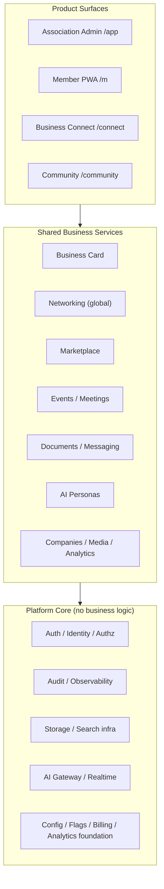

# Platform Layer Diagram (FROZEN — BC-0.4)

Canonical three-layer architecture. Documentation-only. Rendered diagram:
`Platform_Layer_Diagram.mmd` artifact (same content as below).

```text
┌──────────────────────────────────────────────────────────────────────┐
│ PRODUCT SURFACES                                                       │
│  Association Admin (/app)   Member PWA (/m)                            │
│  Business Connect (/connect)   Community (/community)   Future (/company)
│  → compose Shared Services under one identity context + route namespace │
└──────────────────────────────────────────────────────────────────────┘
                                 ▲  consume (down-only)
┌──────────────────────────────────────────────────────────────────────┐
│ SHARED BUSINESS SERVICES (scope-agnostic, one owner each)             │
│  Business Card · Networking · Companies · Meetings · Marketplace       │
│  Events · Messaging · Documents · Search · AI personas · Media         │
│  Analytics · Notification templates                                    │
└──────────────────────────────────────────────────────────────────────┘
                                 ▲  consume (down-only)
┌──────────────────────────────────────────────────────────────────────┐
│ PLATFORM CORE (zero business logic)                                    │
│  Authentication · Identity · Authorization · Audit · Notification infra│
│  Storage · Search infra · AI Gateway · Realtime · Observability        │
│  Configuration · Feature Flags · Billing foundation · Analytics found. │
└──────────────────────────────────────────────────────────────────────┘

Dependency rules: arrows point strictly downward.
Core imports nothing above it. Shared imports only Core. Products import
Shared + Core. No product/association imports into Core or Shared.
No circular dependencies.
```

## Mermaid source


