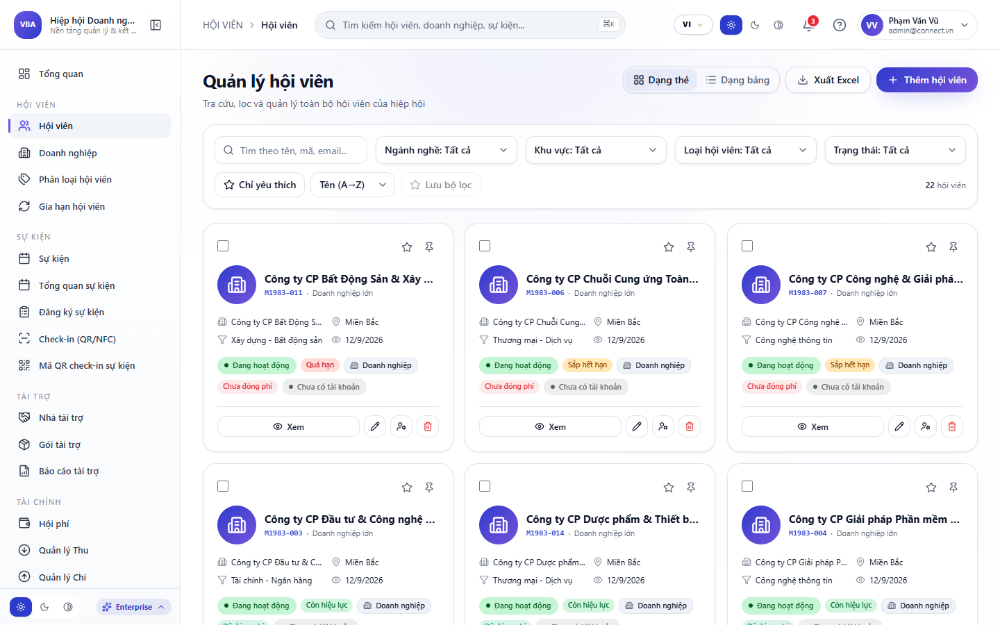
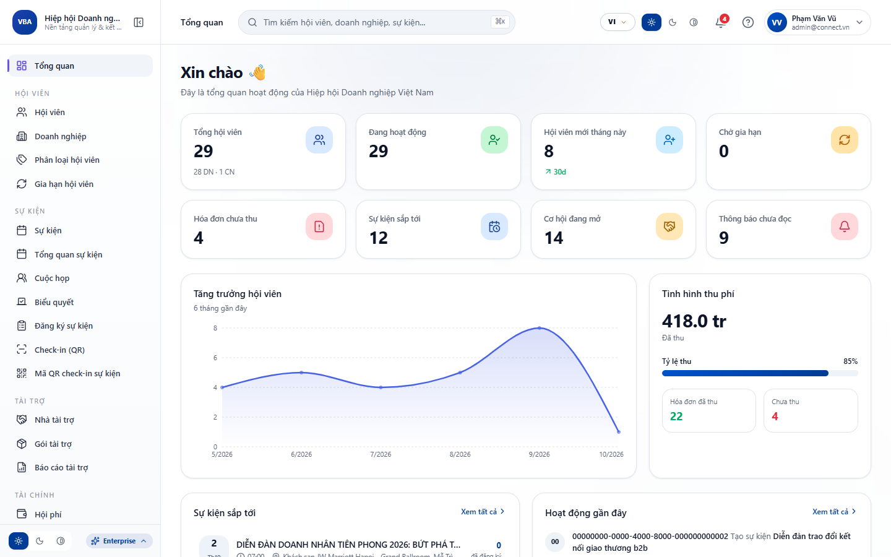
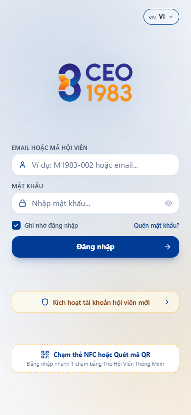
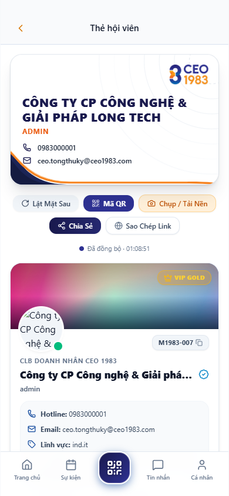
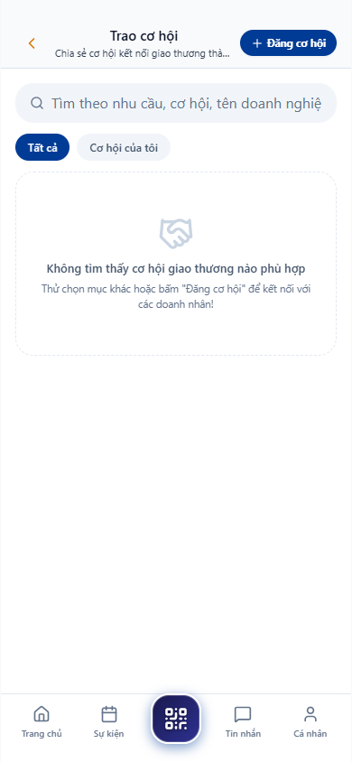
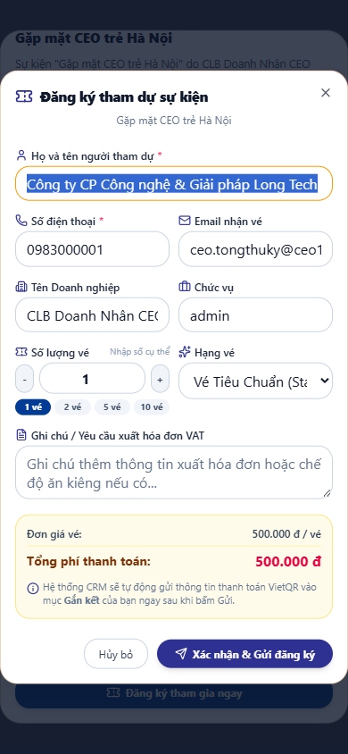

# TÀI LIỆU HƯỚNG DẪN SỬ DỤNG HỆ SINH THÁI DOANH NGHIỆP VIONE PLATFORM 5.0

**Đơn Vị Chủ Quản:** VIOCONNECT VIỆT NAM  
**Phiên Bản Hệ Thống:** ViOne Platform Enterprise v5.0 (Build 2026.10)  
**Tiêu Chuẩn Tài Liệu:** ISO/IEC 26514:2008 & IEEE 1063-2001  
**Ngày Ban Hành:** Tháng 10 Năm 2026  
**Trạng Thái:** Chính Thức Phê Duyệt & Chuyển Giao Vận Hành  

---

## BẢNG KIỂM SOÁT THAY ĐỔI & PHIÊN BẢN

| Phiên Bản | Ngày Ban Hành | Tác Giả / Đơn Vị | Nội Dung Cập Nhật Chính | Trạng Thái |
| :---: | :---: | :---: | :--- | :---: |
| v1.0 | 15/09/2026 | Ban Chuyển Đổi Số ViOne | Khởi tạo tài liệu khung hướng dẫn vận hành | Bản nháp |
| v2.0 | 22/09/2026 | Đội Ngũ Sản Phẩm VioConnect | Bổ sung hướng dẫn Module CRM & Work | Rà soát |
| v3.0 | 28/09/2026 | Tổ Tư Vấn Kiến Trúc Doanh Nghiệp | Tích hợp hướng dẫn App Di Động Titanium NFC | Hoàn thiện |
| v4.0 | 01/10/2026 | Hội Đồng Thẩm Định Kỹ Thuật | Chuẩn hóa 14 chương nghiệp vụ & Ma trận RBAC | Phê duyệt |
| **v5.0** | **02/10/2026** | **Ban Giám Đốc Công Nghệ VioConnect** | **Đại tu toàn diện: Bảng trường dữ liệu, Khắc phục sự cố & Ảnh minh chứng** | **CHÍNH THỨC** |

---

## MỤC LỤC TỔNG QUAN 14 CHƯƠNG VẬN HÀNH

- [Chương 1: TỔNG QUAN HỆ THỐNG & PHÂN QUYỀN VAI TRÒ VẬN HÀNH 5 CẤP](#chuong-1-tổng-quan-hệ-thống-phân-quyền-vai-trò-vận-hành-5-cấp)
- [Chương 2: HƯỚNG DẪN ĐĂNG NHẬP CỔNG QUẢN TRỊ & BẢO MẬT 2 LỚP (2FA)](#chuong-2-hướng-dẫn-đăng-nhập-cổng-quản-trị-bảo-mật-2-lớp-2fa)
- [Chương 3: HƯỚNG DẪN KHAI THÁC LANDING WEB & GỬI FORM YÊU CẦU BÁO GIÁ](#chuong-3-hướng-dẫn-khai-thác-landing-web-gửi-form-yêu-cầu-báo-giá)
- [Chương 4: HƯỚNG DẪN QUẢN LÝ KHÁCH HÀNG & PHỄU CHUYỂN ĐỔI LEAD 360°](#chuong-4-hướng-dẫn-quản-lý-khách-hàng-phễu-chuyển-đổi-lead-360)
- [Chương 5: HƯỚNG DẪN QUẢN TRỊ CƠ HỘI BÁN HÀNG (DEALS) & HỢP ĐỒNG THƯƠNG MẠI](#chuong-5-hướng-dẫn-quản-trị-cơ-hội-bán-hàng-deals-hợp-đồng-thương-mại)
- [Chương 6: HƯỚNG DẪN QUẢN TRỊ CÔNG VIỆC, DỰ ÁN WBS & BẢNG KANBAN](#chuong-6-hướng-dẫn-quản-trị-công-việc-dự-án-wbs-bảng-kanban)
- [Chương 7: HƯỚNG DẪN QUẢN TRỊ NHÂN SỰ, CHẤM CÔNG GPS/FACEID & BẢNG LƯƠNG](#chuong-7-hướng-dẫn-quản-trị-nhân-sự-chấm-công-gpsfaceid-bảng-lương)
- [Chương 8: HƯỚNG DẪN QUẢN TRỊ TÀI CHÍNH, DÒNG TIỀN & DUYỆT CHI 3 CẤP](#chuong-8-hướng-dẫn-quản-trị-tài-chính-dòng-tiền-duyệt-chi-3-cấp)
- [Chương 9: HƯỚNG DẪN KHAI THÁC TRỢ LÝ TRÍ TUỆ NHÂN TẠO VIONE AI COPILOT](#chuong-9-hướng-dẫn-khai-thác-trợ-lý-trí-tuệ-nhân-tạo-vione-ai-copilot)
- [Chương 10: HƯỚNG DẪN CÀI ĐẶT & SỬ DỤNG ỨNG DỤNG DI ĐỘNG VIONE CONNECT](#chuong-10-hướng-dẫn-cài-đặt-sử-dụng-ứng-dụng-di-động-vione-connect)
- [Chương 11: HƯỚNG DẪN KÍCH HOẠT & CHẠM DANH THIẾP SỐ TITANIUM NFC 1-GIÂY](#chuong-11-hướng-dẫn-kích-hoạt-chạm-danh-thiếp-số-titanium-nfc-1giây)
- [Chương 12: HƯỚNG DẪN GIAO THƯƠNG B2B, KHỚP LỆNH CUNG - CẦU & CHAT BẢO MẬT](#chuong-12-hướng-dẫn-giao-thương-b2b-khớp-lệnh-cung-cầu-chat-bảo-mật)
- [Chương 13: HƯỚNG DẪN THANH TOÁN DỊCH VỤ & HỘI PHÍ QUA VIETQR NAPAS 24/7](#chuong-13-hướng-dẫn-thanh-toán-dịch-vụ-hội-phí-qua-vietqr-napas-247)
- [Chương 14: HƯỚNG DẪN XỬ LÝ SỰ CỐ THƯỜNG GẶP (TROUBLESHOOTING) & HỖ TRỢ 24/7](#chuong-14-hướng-dẫn-xử-lý-sự-cố-thường-gặp-troubleshooting-hỗ-trợ-247)

---

## Chương 1: TỔNG QUAN HỆ THỐNG & PHÂN QUYỀN VAI TRÒ VẬN HÀNH 5 CẤP

Hệ sinh thái ViOne Platform 5.0 được xây dựng dựa trên kiến trúc phân quyền ma trận 5 cấp (RBAC Matrix) nghiêm ngặt. Mỗi tài khoản được phân định rõ ràng quyền hạn và phạm vi dữ liệu tiếp cận:

### 1.1. Danh Mục Các Trường Dữ Liệu & Hướng Dẫn Nhập Liệu

| Cấp Bậc Vai Trò | Phạm Vi Thẩm Quyền | Tài Khoản Mẫu | Chức Năng Được Phép Thực Hiện |
| :--- | :--- | :--- | :--- |
| Cấp 1: Super Admin | Toàn bộ hệ thống Multi-Tenant | admin@vione.ai | Cấu hình tổ chức, phân quyền RBAC, quản lý khóa API, kiểm toán an ninh. |
| Cấp 2: Ban Giám Đốc | Doanh nghiệp sở tại | ceo@vione.ai | Xem Dashboard 360°, phê duyệt ngân sách, phân tích dự báo AI Copilot. |
| Cấp 3: Trưởng Phòng | Phòng ban chuyên trách | manager@vione.ai | Gán việc Kanban, điều phối phễu Lead, duyệt phiếu thu chi cấp 1. |
| Cấp 4: Chuyên Viên | Công việc & Khách hàng gán | staff@vione.ai | Cập nhật tiến độ Lead, chăm sóc khách hàng, tạo báo giá, check-in. |
| Cấp 5: Khách Hàng / Đối Tác | Gian hàng B2B & Hồ sơ | partner@vione.ai | Chạm thẻ Titanium NFC, xem sản phẩm, gửi yêu cầu kết nối giao thương. |

> [!IMPORTANT]
> **QUY TẮC NGHIỆP VỤ & LƯU Ý BẮT BUỘC:**  
> QUY TẮC CÔ LẬP DỮ LIỆU BẢO MẬT (TENANT ISOLATION): Mỗi doanh nghiệp vận hành trên ViOne có cơ chế cô lập dữ liệu độc lập ở tầng truy vấn cơ sở dữ liệu. Tuyệt đối không thể xảy ra hiện tượng nhân sự của doanh nghiệp A nhìn thấy khách hàng hoặc báo cáo tài chính của doanh nghiệp B.

### 1.2. Quy Trình Thao Tác Từng Bước (Step-by-Step Procedure)

Bước 1: Quản trị viên truy cập Cổng Quản trị tại https://vione.ai/auth bằng trình duyệt Chrome, Edge hoặc Safari.
Bước 2: Chọn vai trò đăng nhập tương ứng (Super Admin, Ban Giám Đốc, Quản Lý, Nhân Viên hoặc Khách Hàng).
Bước 3: Nhập Email công vụ và Mật khẩu bảo mật do hệ thống cấp phát ban đầu.
Bước 4: Nhập mã OTP 6 số từ ứng dụng xác thực Google Authenticator nếu tài khoản bật bảo mật 2FA.
Bước 5: Hệ thống kiểm tra chữ ký số JWT và điều hướng người dùng vào màn hình làm việc tương ứng với quyền hạn.
Bước 6: Người dùng kiểm tra góc trên bên phải màn hình để xác nhận đúng Họ tên, Chức vụ và Tên doanh nghiệp.

### 1.3. Xử Lý Sự Cố Thường Gặp (Troubleshooting Guide)

| Hiện Tượng Sự Cố | Nguyên Nhân Khả Dĩ | Cách Khắc Phục Tức Thì |
| :--- | :--- | :--- |
| Bị báo lỗi 403 Forbidden | Tài khoản không đủ thẩm quyền truy cập tính năng | Liên hệ Super Admin của công ty để cấp quyền trong Ma trận RBAC. |
| Quên mật khẩu đăng nhập | Không nhớ mật khẩu truy cập | Bấm nút "Quên mật khẩu" tại màn hình đăng nhập để nhận link reset qua email trong 60 giây. |

### 1.4. Minh Chứng Giao Diện Thực Tế

*Hình 1.1: Ma Trận Cấu Hình Phân Quyền Vai Trò RBAC 5 Cấp Trong Cổng Quản Trị ViOne*

---

## Chương 2: HƯỚNG DẪN ĐĂNG NHẬP CỔNG QUẢN TRỊ & BẢO MẬT 2 LỚP (2FA)

Đăng nhập Cổng Quản trị là bước đầu tiên để tiếp cận toàn bộ dữ liệu điều hành doanh nghiệp. ViOne áp dụng chuẩn an ninh ngân hàng với cơ chế xác thực đa yếu tố (MFA):

### 2.1. Danh Mục Các Trường Dữ Liệu & Hướng Dẫn Nhập Liệu

| Tên Trường Form | Kiểu Dữ Liệu | Yêu Cầu | Mô Tả & Hướng Dẫn Nhập Liệu |
| :--- | :--- | :--- | :--- |
| Email Đăng Nhập | Văn bản (Email) | Bắt buộc | Email doanh nghiệp được cấp, ví dụ: ceo@vione.ai |
| Mật Khẩu | Chuỗi ký tự ẩn | Bắt buộc | Tối thiểu 8 ký tự, gồm chữ hoa, chữ thường, số và ký tự đặc biệt |
| Mã OTP 2FA | Số (6 chữ số) | Tùy chọn/Bắt buộc | Mã thời gian thực từ Google Authenticator hoặc tin nhắn SMS |
| Ghi Nhớ Đăng Nhập | Hộp kiểm (Checkbox) | Không | Duy trì phiên đăng nhập trong 30 ngày trên thiết bị tin cậy |

> [!IMPORTANT]
> **QUY TẮC NGHIỆP VỤ & LƯU Ý BẮT BUỘC:**  
> CẢNH BÁO AN NINH MẠNG: Tuyệt đối không cung cấp mã OTP 2FA cho bất kỳ ai, kể cả nhân viên kỹ thuật ViOne. Hệ thống tự động khóa tài khoản tạm thời 15 phút nếu nhập sai mật khẩu quá 5 lần liên tiếp.

### 2.2. Quy Trình Thao Tác Từng Bước (Step-by-Step Procedure)

Bước 1: Mở trình duyệt web và gõ địa chỉ https://vione.ai/auth.
Bước 2: Điền chính xác địa chỉ Email và Mật khẩu vào form đăng nhập trung tâm.
Bước 3: Nhấn nút "Đăng Nhập". Hệ thống hiển thị hộp thoại yêu cầu nhập mã xác thực hai lớp (2FA).
Bước 4: Mở ứng dụng Google Authenticator hoặc Microsoft Authenticator trên smartphone của bạn.
Bước 5: Đọc mã 6 chữ số đang hiển thị và điền vào ô xác thực trên máy tính trong vòng 30 giây.
Bước 6: Nhấn "Xác Nhận". Hệ thống khởi tạo phiên làm việc an toàn và chuyển vào Trang Chủ Dashboard.

### 2.3. Xử Lý Sự Cố Thường Gặp (Troubleshooting Guide)

| Hiện Tượng Sự Cố | Nguyên Nhân Khả Dĩ | Cách Khắc Phục Tức Thì |
| :--- | :--- | :--- |
| Mã OTP 2FA báo không hợp lệ | Đồng hồ điện thoại bị lệch giờ so với máy chủ | Vào Cài đặt ứng dụng Authenticator -> Chọn "Sửa lỗi giờ cho mã" để đồng bộ lại thời gian. |
| Mất điện thoại chứa mã 2FA | Không có máy nhận mã OTP | Sử dụng 1 trong 10 mã dự phòng khẩn cấp (Backup Codes) đã lưu khi kích hoạt 2FA để đăng nhập. |

### 2.4. Minh Chứng Giao Diện Thực Tế

*Hình 2.1: Màn Hình Đăng Nhập Cổng Quản Trị ViOne & Xác Thực Hai Lớp (2FA)*

---

## Chương 3: HƯỚNG DẪN KHAI THÁC LANDING WEB & GỬI FORM YÊU CẦU BÁO GIÁ

Trang chủ Landing Web ViOne tại https://vione.ai là cổng giao tiếp công khai, giới thiệu 14 phân hệ giải pháp và tiếp nhận yêu cầu báo giá may đo:

### 3.1. Danh Mục Các Trường Dữ Liệu & Hướng Dẫn Nhập Liệu

| Tên Trường Form | Kiểu Dữ Liệu | Yêu Cầu | Mô Tả & Hướng Dẫn Nhập Liệu |
| :--- | :--- | :--- | :--- |
| Họ Và Tên | Chuỗi ký tự | Bắt buộc | Họ tên đầy đủ của người đại diện liên hệ, ví dụ: Nguyễn Minh Đăng |
| Số Điện Thoại | Số (10 số) | Bắt buộc | Số điện thoại di động chính xác để chuyên viên tư vấn gọi điện |
| Email Doanh Nghiệp | Văn bản (Email) | Bắt buộc | Hòm thư điện tử để nhận bản hồ sơ báo giá PDF chính thức |
| Tên Công Ty | Chuỗi ký tự | Bắt buộc | Tên doanh nghiệp cần chuyển đổi số |
| Quy Mô Nhân Sự | Chọn thả (Dropdown) | Bắt buộc | Dưới 20 người, 20-50 người, 50-200 người hoặc Trên 200 người |
| Nhu Cầu Cụ Thể | Văn bản nhiều dòng | Không | Mô tả bài toán cần giải quyết: Quản lý khách hàng, chấm công, dòng tiền... |

> [!IMPORTANT]
> **QUY TẮC NGHIỆP VỤ & LƯU Ý BẮT BUỘC:**  
> CHÍNH SÁCH BÁO GIÁ MAY ĐO: ViOne áp dụng chính sách không niêm yết giá cứng cố định trên website. Mọi chi phí triển khai được khảo sát và may đo theo quy mô thực tế để tối ưu ngân sách cho doanh nghiệp.

### 3.2. Quy Trình Thao Tác Từng Bước (Step-by-Step Procedure)

Bước 1: Truy cập trang chủ ViOne Platform tại https://vione.ai.
Bước 2: Trải nghiệm hoạt ảnh 4.8s pop-up doanh nhân phía trước khung smartphone VIONE MOBILE.
Bước 3: Cuộn trang xem các khối: Mô đun liên kết, AI Workflow, Giám sát vận hành, 3 Bước thiết lập, Bảng giá 3 gói.
Bước 4: Nhấn nút "Yêu Cầu Báo Giá" trên Header hoặc tại các gói giải pháp để mở Modal Hoàng gia.
Bước 5: Điền đầy đủ thông tin vào form: Họ tên, Số điện thoại, Email, Tên công ty, Quy mô và Nhu cầu.
Bước 6: Nhấn nút "Gửi Yêu Cầu Báo Giá & Nhận Tư Vấn 1-1". Dữ liệu được ghi nhận vào cơ sở dữ liệu `vione_quote_leads`.

### 3.3. Xử Lý Sự Cố Thường Gặp (Troubleshooting Guide)

| Hiện Tượng Sự Cố | Nguyên Nhân Khả Dĩ | Cách Khắc Phục Tức Thì |
| :--- | :--- | :--- |
| Form báo lỗi không gửi được | Nhập thiếu số điện thoại hoặc email sai cú pháp | Kiểm tra các ô viền đỏ, bổ sung đúng số điện thoại 10 số rồi bấm gửi lại. |
| Chưa nhận được liên hệ sau 15 phút | Đường truyền mạng nghẽn hoặc gửi ngoài giờ | Kiểm tra hòm thư rác (Spam) hoặc gọi hotline hỗ trợ trực tiếp 1900-VIONE. |

### 3.4. Minh Chứng Giao Diện Thực Tế

*Hình 3.1: Cửa Sổ Modal Thu Thập Yêu Cầu Báo Giá Doanh Nghiệp & Tư Vấn 1-1*

---

## Chương 4: HƯỚNG DẪN QUẢN LÝ KHÁCH HÀNG & PHỄU CHUYỂN ĐỔI LEAD 360°

Phân hệ Khách hàng CRM là trái tim của hệ sinh thái, giúp quản lý toàn diện vòng đời khách hàng từ khi còn là Lead tiềm năng đến khi trở thành Hội viên VIP:

### 4.1. Danh Mục Các Trường Dữ Liệu & Hướng Dẫn Nhập Liệu

| Tên Trường Form | Kiểu Dữ Liệu | Yêu Cầu | Mô Tả & Hướng Dẫn Nhập Liệu |
| :--- | :--- | :--- | :--- |
| Tên Doanh Nghiệp | Văn bản | Bắt buộc | Tên đầy đủ của công ty khách hàng theo ĐKKD |
| Mã Số Thuế (MST) | Chuỗi số (10-13 số) | Bắt buộc | Mã số thuế doanh nghiệp, hệ thống tự động kiểm tra trùng lặp |
| Người Đại Diện | Văn bản | Bắt buộc | Chủ tịch, Tổng Giám Đốc hoặc Giám đốc thu mua |
| Số Điện Thoại / Email | Liên hệ | Bắt buộc | Số điện thoại và hòm thư công vụ của người đại diện |
| Nhóm Ngành Nghề | Chọn thả (Dropdown) | Bắt buộc | Sản xuất, Dịch vụ, Thương mại, Chuỗi & Bán lẻ, Công nghệ |
| Trạng Thái Khách Hàng | Chọn thả (Dropdown) | Bắt buộc | Lead Mới, Đang Tư Vấn, Báo Giá, Đã Ký, Đang Vận Hành, Tạm Ngừng |

> [!IMPORTANT]
> **QUY TẮC NGHIỆP VỤ & LƯU Ý BẮT BUỘC:**  
> QUY TẮC BẢO VỆ DỮ LIỆU KHÁCH HÀNG: Mỗi nhân viên kinh doanh chỉ nhìn thấy khách hàng do mình được phân công. Hành vi xuất file Excel danh sách khách hàng bị giới hạn số lượng và ghi vết 100% trong nhật ký Audit Trail.

### 4.2. Quy Trình Thao Tác Từng Bước (Step-by-Step Procedure)

Bước 1: Từ menu bên trái Cổng Quản trị, chọn mục "Khách Hàng & Phễu Lead".
Bước 2: Màn hình hiển thị danh sách khách hàng kèm bộ lọc: Trạng thái, Ngành nghề, Nhân viên phụ trách.
Bước 3: Để thêm khách hàng mới, nhấn nút "+ Thêm Khách Hàng Mới" ở góc phải phía trên.
Bước 4: Nhập đầy đủ thông tin: Mã số thuế, Tên công ty, Người liên hệ, Số điện thoại và Email.
Bước 5: Nhấn nút "Lưu Hồ Sơ". Hệ thống tự động kiểm tra trùng lặp và lưu vào cơ sở dữ liệu PostgreSQL.
Bước 6: Nhấp vào tên khách hàng để mở màn hình Drawer xem chi tiết hồ sơ 360 độ: Báo giá, Hợp đồng, Lịch sử cuộc gọi.
Bước 7: Để nhập khẩu hàng loạt, nhấn "Nhập Khẩu (Import)", tải file mẫu Excel và tải lên danh sách 1,000 khách hàng.

### 4.3. Xử Lý Sự Cố Thường Gặp (Troubleshooting Guide)

| Hiện Tượng Sự Cố | Nguyên Nhân Khả Dĩ | Cách Khắc Phục Tức Thì |
| :--- | :--- | :--- |
| Hệ thống báo "Mã số thuế đã tồn tại" | Khách hàng này đã được nhân viên khác tạo trước đó | Nhấp vào liên kết mã số thuế để xem ai đang phụ trách hoặc liên hệ Trưởng phòng để phân bổ lại. |
| Tệp Excel import bị lỗi dòng | Dữ liệu sai định dạng ngày tháng hoặc thiếu số điện thoại | Tải tệp báo lỗi về, chỉnh sửa các cột tô đỏ rồi import lại phần bị lỗi. |

### 4.4. Minh Chứng Giao Diện Thực Tế

*Hình 4.1: Giao Diện Quản Lý Danh Sách & Tra Cứu Hồ Sơ Khách Hàng Doanh Nghiệp*

---

## Chương 5: HƯỚNG DẪN QUẢN TRỊ CƠ HỘI BÁN HÀNG (DEALS) & HỢP ĐỒNG THƯƠNG MẠI

Quản trị cơ hội bán hàng trên bảng Pipeline Kanban giúp đội ngũ kinh doanh nắm rõ tiến độ từng thương vụ, tăng tỷ lệ chốt đơn và lập báo giá chuẩn hóa:

### 5.1. Danh Mục Các Trường Dữ Liệu & Hướng Dẫn Nhập Liệu

| Tên Trường Form | Kiểu Dữ Liệu | Yêu Cầu | Mô Tả & Hướng Dẫn Nhập Liệu |
| :--- | :--- | :--- | :--- |
| Tên Cơ Hội (Deal) | Văn bản | Bắt buộc | Tên thương vụ, ví dụ: "Triển khai ViOne 5.0 - Tập đoàn Hòa Bình" |
| Giá Trị Thương Vụ | Số tiền tệ (VND) | Bắt buộc | Tổng giá trị hợp đồng ước tính |
| Giai Đoạn Pipeline | Chọn thả (Dropdown) | Bắt buộc | Tiếp cận -> Khảo sát -> Báo giá -> Đàm phán -> Won / Lost |
| Xác Suất Chốt Đơn | Tỷ lệ % (0-100%) | Bắt buộc | Tỷ lệ khả thi để hệ thống tính doanh thu dự phóng Weighted Value |
| Ngày Dự Kiến Ký | Ngày tháng | Bắt buộc | Hạn chót dự kiến chốt hợp đồng để lập kế hoạch dòng tiền |

> [!IMPORTANT]
> **QUY TẮC NGHIỆP VỤ & LƯU Ý BẮT BUỘC:**  
> KIỂM SOÁT HẠN MỨC CHIẾT KHẤU: Báo giá có mức chiết khấu trên 10% bắt buộc phải có sự phê duyệt điện tử của Giám đốc Kinh doanh trên hệ thống mới được phép xuất file PDF gửi khách hàng.

### 5.2. Quy Trình Thao Tác Từng Bước (Step-by-Step Procedure)

Bước 1: Chọn mục "Cơ Hội Bán Hàng (Deals)" trên thanh menu để mở bảng Kanban Pipeline.
Bước 2: Nhấn nút "+ Thêm Deal Mới", chọn Khách hàng mục tiêu, nhập giá trị thương vụ và chọn giai đoạn khởi đầu.
Bước 3: Trong quá trình đàm phán, rê chuột và kéo thả thẻ Deal từ cột này sang cột kế tiếp.
Bước 4: Để lập báo giá, nhấp đúp vào thẻ Deal -> Chọn tab "Báo Giá" -> Nhấn "Tạo Báo Giá Mới".
Bước 5: Thêm các sản phẩm từ danh mục, áp dụng chiết khấu thương mại và thuế VAT.
Bước 6: Nhấn "Xuất PDF & Gửi Email". Khách hàng nhận được báo giá chuẩn mực kèm mã QR tra cứu.
Bước 7: Khi đàm phán thành công, kéo thẻ Deal sang cột "Won (Thành công)" và tạo Hợp đồng kinh tế liên kết.

### 5.3. Xử Lý Sự Cố Thường Gặp (Troubleshooting Guide)

| Hiện Tượng Sự Cố | Nguyên Nhân Khả Dĩ | Cách Khắc Phục Tức Thì |
| :--- | :--- | :--- |
| Không thể chuyển Deal sang "Won" | Chưa đính kèm tệp hợp đồng đã ký hoặc chưa duyệt chiết khấu | Mở chi tiết Deal, tải lên tệp hợp đồng quét (PDF) và hoàn tất phê duyệt giá. |
| Không tìm thấy sản phẩm trong báo giá | Sản phẩm chưa được kích hoạt kinh doanh | Vào danh mục Sản phẩm kiểm tra trạng thái SKU và bảng giá phân cấp. |

### 5.4. Minh Chứng Giao Diện Thực Tế

*Hình 5.1: Màn Hình Drawer Quản Trị Cơ Hội Bán Hàng & Lập Báo Giá B2B Điện Tử*

---

## Chương 6: HƯỚNG DẪN QUẢN TRỊ CÔNG VIỆC, DỰ ÁN WBS & BẢNG KANBAN

Phân hệ Vione Work giúp số hóa toàn bộ quy trình giao việc, phân bổ dự án theo cấu trúc WBS và kiểm soát tiến độ thời gian thực:

### 6.1. Danh Mục Các Trường Dữ Liệu & Hướng Dẫn Nhập Liệu

| Tên Trường Form | Kiểu Dữ Liệu | Yêu Cầu | Mô Tả & Hướng Dẫn Nhập Liệu |
| :--- | :--- | :--- | :--- |
| Tên Công Việc (Task) | Văn bản | Bắt buộc | Mô tả rõ đầu việc cần thực hiện, bắt đầu bằng động từ hành động |
| Dự Án Trực Thuộc | Chọn thả (Dropdown) | Bắt buộc | Dự án hoặc phòng ban quản lý công việc này |
| Người Phụ Trách (Assignee) | Chọn người dùng | Bắt buộc | Nhân sự chịu trách nhiệm chính hoàn thành công việc |
| Hạn Chót (Deadline) | Ngày giờ | Bắt buộc | Thời điểm kết thúc bắt buộc, hệ thống cảnh báo trước 2h |
| Mức Độ Ưu Tiên | Chọn thả (Dropdown) | Bắt buộc | Khẩn cấp (Đỏ), Cao (Cam), Bình thường (Xanh) |
| Danh Sách Checklist | Danh sách con | Không | Các bước việc nhỏ cần tích chọn hoàn thành |

> [!IMPORTANT]
> **QUY TẮC NGHIỆP VỤ & LƯU Ý BẮT BUỘC:**  
> KỶ CƯƠNG THỰC THI TIẾN ĐỘ: Mọi công việc quá hạn Deadline mà chưa chuyển trạng thái Hoàn thành sẽ tự động đổi màu đỏ rực trên bảng điều khiển của Trưởng phòng và ghi nhận điểm trừ KPI cuối tháng.

### 6.2. Quy Trình Thao Tác Từng Bước (Step-by-Step Procedure)

Bước 1: Vào phân hệ "Công Việc & Dự Án", chọn dự án cần làm việc.
Bước 2: Xem công việc theo 3 chế độ: Bảng Kanban kéo thả, Biểu đồ phụ thuộc Gantt Chart hoặc Danh sách lưới.
Bước 3: Nhấn "+ Thêm Công Việc Mới", nhập tên việc, chọn người phụ trách và hạn chót Deadline.
Bước 4: Thêm checklist các bước con và đính kèm tài liệu, bản vẽ kỹ thuật liên quan.
Bước 5: Khi bắt đầu làm việc, kéo thẻ việc sang cột "Đang Làm (In Progress)" và nhấn nút bấm giờ Timesheet.
Bước 6: Trao đổi với đồng nghiệp trong ô thảo luận bằng cú pháp `@TênĐồngNghiệp`.
Bước 7: Khi hoàn thành 100% checklist, chuyển sang "Chờ Duyệt (Review)" để Quản lý dự án nghiệm thu.

### 6.3. Xử Lý Sự Cố Thường Gặp (Troubleshooting Guide)

| Hiện Tượng Sự Cố | Nguyên Nhân Khả Dĩ | Cách Khắc Phục Tức Thì |
| :--- | :--- | :--- |
| Không kéo được thẻ sang trạng thái khác | Công việc bị khóa do phụ thuộc vào một công việc khác chưa xong | Mở biểu đồ Gantt kiểm tra liên kết Finish-to-Start để hoàn thành công việc tiền nhiệm trước. |
| Không nhận được thông báo nhắc việc | Chưa cấp quyền thông báo đẩy trên điện thoại | Vào Cài đặt điện thoại -> Ứng dụng ViOne Connect -> Bật "Cho phép nhận thông báo". |

### 6.4. Minh Chứng Giao Diện Thực Tế

*Hình 6.1: Bảng Quản Trị Công Việc Kanban Kéo Thả Trực Quan & Giám Sát Tiến Độ*

---

## Chương 7: HƯỚNG DẪN QUẢN TRỊ NHÂN SỰ, CHẤM CÔNG GPS/FACEID & BẢNG LƯƠNG

Vione HRM số hóa toàn diện hồ sơ nhân sự, chấm công thông minh chống gian lận và tự động hóa tính lương trong 10 giây:

### 7.1. Danh Mục Các Trường Dữ Liệu & Hướng Dẫn Nhập Liệu

| Tên Trường Form | Kiểu Dữ Liệu | Yêu Cầu | Mô Tả & Hướng Dẫn Nhập Liệu |
| :--- | :--- | :--- | :--- |
| Họ Và Tên Nhân Viên | Văn bản | Bắt buộc | Họ tên đầy đủ theo CCCD gắn chip |
| Mã Nhân Viên | Mã số tự tăng | Bắt buộc | Mã định danh duy nhất trong doanh nghiệp (NV-001, NV-002...) |
| Phòng Ban & Chức Vụ | Chọn thả (Dropdown) | Bắt buộc | Vị trí công tác trên sơ đồ tổ chức Org Chart |
| Hình Thức Chấm Công | Cấu hình | Bắt buộc | Nhận diện khuôn mặt AI + Định vị GPS bán kính 50m |
| Mức Lương & Phụ Cấp | Số tiền tệ (VND) | Bắt buộc (Bảo mật) | Lương cơ bản, phụ cấp trách nhiệm, tỷ lệ trích nộp BHXH |

> [!IMPORTANT]
> **QUY TẮC NGHIỆP VỤ & LƯU Ý BẮT BUỘC:**  
> CHỐNG CHẤM CÔNG HỘ TUYỆT ĐỐI: Thuật toán AI nhận diện khuôn mặt kết hợp kiểm tra độ sống (Liveness Check) và tọa độ vệ tinh GPS. Nghiêm cấm mọi hành vi sử dụng ảnh chụp lại để chấm công.

### 7.2. Quy Trình Thao Tác Từng Bước (Step-by-Step Procedure)

Bước 1: Hàng ngày khi đến văn phòng, nhân viên mở app ViOne Connect trên điện thoại, chọn "Chấm Công".
Bước 2: Đưa khuôn mặt vào khung tròn nhận diện trên màn hình; camera AI quét trong 1 giây và xác nhận "Chấm công thành công".
Bước 3: Để nộp đơn nghỉ phép, nhân viên vào mục "Nghỉ Phép" trên app, chọn ngày nghỉ, loại phép và bấm "Gửi Duyệt".
Bước 4: Trưởng phòng nhận thông báo đẩy trên điện thoại và bấm "Phê Duyệt 1-Chạm".
Bước 5: Cuối tháng, chuyên viên C&B mở phân hệ "Tổng Hợp Công" -> Nhấn "Chốt Bảng Công Tự Động".
Bước 6: Nhấn nút "Chạy Bảng Lương (Run Payroll)" -> Hệ thống tự động tính lương, trừ BHXH, thuế TNCN trong 10 giây.
Bước 7: Sau khi CEO duyệt, nhấn "Phát Hành Phiếu Lương Điện Tử (E-Payslip)" gửi bảo mật tới từng nhân viên.

### 7.3. Xử Lý Sự Cố Thường Gặp (Troubleshooting Guide)

| Hiện Tượng Sự Cố | Nguyên Nhân Khả Dĩ | Cách Khắc Phục Tức Thì |
| :--- | :--- | :--- |
| App báo "Vị trí GPS không hợp lệ" | Đang đứng ngoài bán kính 50m quanh văn phòng hoặc GPS bị trôi | Bật định vị độ chính xác cao trên điện thoại, đi vào sảnh văn phòng và thử lại. |
| Khuôn mặt không nhận diện được | Đeo khẩu trang hoặc góc ánh sáng quá tối | Bỏ khẩu trang, kính râm, hướng mặt về nguồn sáng rõ ràng để camera AI nhận diện. |

### 7.4. Minh Chứng Giao Diện Thực Tế

*Hình 7.1: Màn Hình Chấm Công Nhận Diện Khuôn Mặt AI & Tổng Hợp Ngày Công Trên Mobile*

---

## Chương 8: HƯỚNG DẪN QUẢN TRỊ TÀI CHÍNH, DÒNG TIỀN & DUYỆT CHI 3 CẤP

Vione Finance giúp doanh nghiệp kiểm soát dòng tiền thực thu - thực chi từng phút, duyệt chi điện tử 3 cấp và đối soát tự động:

### 8.1. Danh Mục Các Trường Dữ Liệu & Hướng Dẫn Nhập Liệu

| Tên Trường Form | Kiểu Dữ Liệu | Yêu Cầu | Mô Tả & Hướng Dẫn Nhập Liệu |
| :--- | :--- | :--- | :--- |
| Loại Giao Dịch | Chọn thả (Dropdown) | Bắt buộc | Phiếu Thu (Tiền vào) hoặc Phiếu Chi (Tiền ra) |
| Số Tiền Giao Dịch | Số tiền tệ (VND) | Bắt buộc | Số tiền thanh toán chính xác theo chứng từ |
| Tài Khoản / Quỹ Tiền | Chọn thả (Dropdown) | Bắt buộc | Tài khoản ngân hàng thụ hưởng hoặc Quỹ tiền mặt tại két |
| Mục Đích Thu / Chi | Văn bản | Bắt buộc | Diễn giải nội dung giao dịch kèm mã hợp đồng liên quan |
| Chứng Từ Đính Kèm | Tệp tin (PDF/Ảnh) | Bắt buộc | Hóa đơn đỏ VAT, ủy nhiệm chi hoặc biên bản bàn giao |

> [!IMPORTANT]
> **QUY TẮC NGHIỆP VỤ & LƯU Ý BẮT BUỘC:**  
> QUY TRÌNH DUYỆT CHI 3 CẤP NGHIÊM NGẶT: Mọi khoản chi trên 20 triệu VNĐ bắt buộc phải qua 3 vòng ký điện tử: Nhân viên đề xuất (Maker) -> Kế toán trưởng kiểm soát (Checker) -> Tổng Giám Đốc phê duyệt (Approver).

### 8.2. Quy Trình Thao Tác Từng Bước (Step-by-Step Procedure)

Bước 1: Vào phân hệ "Quản Trị Tài Chính", mở bảng điều khiển Dòng Tiền (Cashflow Dashboard).
Bước 2: Quan sát số dư thực tế tại các tài khoản ngân hàng và biểu đồ biến động dòng tiền trong tháng.
Bước 3: Để lập đề xuất chi tiền, nhấn "Tạo Đề Nghị Thanh Toán", điền số tiền, người nhận và tải lên hóa đơn VAT.
Bước 4: Kế toán trưởng kiểm tra tính hợp pháp của hóa đơn trên cổng Thuế và ký duyệt vòng 1.
Bước 5: Tổng Giám Đốc nhận thông báo trên điện thoại, kiểm tra số tiền và quét vân tay phê duyệt vòng 2.
Bước 6: Khi thu tiền bán hàng, hệ thống sinh mã VietQR Napas 24/7 động để khách hàng quét trả tiền và tự động gạch nợ 1s.
Bước 7: Mở mục "Dự Báo Dòng Tiền AI" để xem dự phóng số dư tiền mặt trong 30-60-90 ngày tới.

### 8.3. Xử Lý Sự Cố Thường Gặp (Troubleshooting Guide)

| Hiện Tượng Sự Cố | Nguyên Nhân Khả Dĩ | Cách Khắc Phục Tức Thì |
| :--- | :--- | :--- |
| Hệ thống chặn không cho tạo phiếu chi | Khoản chi làm vượt quá 100% ngân sách đã duyệt của phòng ban | Làm việc với CFO để làm thủ tục xin điều chuyển hoặc bổ sung ngân sách tháng. |
| Khách hàng đã chuyển khoản nhưng chưa gạch nợ | Nội dung chuyển khoản bị sai lệch mã giao dịch | Vào mục "Đối Soát Ngân Hàng", tìm giao dịch chưa khớp và bấm "Gán thủ công vào Hóa đơn". |

### 8.4. Minh Chứng Giao Diện Thực Tế

*Hình 8.1: Bảng Điều Khiển Quản Trị Dòng Tiền & Quy Trình Duyệt Chi Điện Tử 3 Cấp*

---

## Chương 9: HƯỚNG DẪN KHAI THÁC TRỢ LÝ TRÍ TUỆ NHÂN TẠO VIONE AI COPILOT

ViOne AI Copilot là bộ não điều hành thông minh tích hợp sẵn, giúp lãnh đạo truy vấn số liệu kinh doanh bằng tiếng Việt tự nhiên và tự động hóa quy trình:

### 9.1. Danh Mục Các Trường Dữ Liệu & Hướng Dẫn Nhập Liệu

| Tên Trường Form | Kiểu Dữ Liệu | Yêu Cầu | Mô Tả & Hướng Dẫn Nhập Liệu |
| :--- | :--- | :--- | :--- |
| Câu Lệnh / Câu Hỏi | Văn bản / Giọng nói | Bắt buộc | Đặt câu hỏi bằng tiếng Việt tự nhiên, ví dụ: "Top 5 khách hàng nợ lâu nhất là ai?" |
| Phạm Vi Dữ Liệu | Chọn thả (Dropdown) | Tùy chọn | Toàn công ty, Chi nhánh Hà Nội, Phòng Bán hàng, Tháng này... |
| Kịch Bản Tự Động Hóa | Kéo thả (No-code) | Cấu hình | Thiết lập Trigger sự kiện -> Điều kiện AI thẩm định -> Hành động Action |

> [!IMPORTANT]
> **QUY TẮC NGHIỆP VỤ & LƯU Ý BẮT BUỘC:**  
> AN TOÀN BẢO MẬT DỮ LIỆU AI (DATA PRIVACY): Dữ liệu nội bộ của doanh nghiệp được lưu trữ cô lập và xử lý bởi mô hình AI riêng biệt. Tuyệt đối không sử dụng dữ liệu kinh doanh của khách hàng để đào tạo các mô hình AI công cộng.

### 9.2. Quy Trình Thao Tác Từng Bước (Step-by-Step Procedure)

Bước 1: Bấm vào biểu tượng Trợ lý AI Copilot lơ lửng tại góc dưới bên phải màn hình hoặc nhấn phím tắt `Ctrl + Space`.
Bước 2: Cửa sổ hội thoại AI mở ra, sẵn sàng nhận lệnh bằng văn bản hoặc giọng nói.
Bước 3: Nhập câu hỏi quản trị: "Báo cáo doanh số tuần này đạt bao nhiêu và so sánh với chỉ tiêu tháng?".
Bước 4: AI phân tích ngữ nghĩa, truy vấn dữ liệu PostgreSQL bảo mật và trả lời kèm số liệu thống kê và biểu đồ trong 2 giây.
Bước 5: Ra lệnh nâng cao: "Soạn thảo email chào hàng gói giải pháp sản xuất cho khách hàng Tập đoàn Hòa Bình".
Bước 6: Kiểm tra bức thư do AI soạn thảo cá nhân hóa từng chi tiết, bấm "Sao chép" hoặc "Gửi ngay".
Bước 7: Vào "AI Workflow Studio" để cấu hình kịch bản tự động tiếp nhận Lead và gửi báo giá tự động.

### 9.3. Xử Lý Sự Cố Thường Gặp (Troubleshooting Guide)

| Hiện Tượng Sự Cố | Nguyên Nhân Khả Dĩ | Cách Khắc Phục Tức Thì |
| :--- | :--- | :--- |
| AI báo "Tôi không có quyền truy cập dữ liệu này" | Tài khoản đăng nhập không có quyền xem thông tin tài chính/nhân sự | AI tuân thủ nghiêm ngặt ma trận RBAC; chỉ trả lời dữ liệu trong phạm vi quyền hạn của bạn. |
| Câu trả lời không đúng ý muốn | Câu hỏi quá chung chung hoặc thiếu mốc thời gian | Bổ sung thêm mốc thời gian và đối tượng cụ thể (Ví dụ: "Doanh số của nhân viên Nam trong tháng 10"). |

### 9.4. Minh Chứng Giao Diện Thực Tế

*Hình 9.1: Giao Diện Trợ Lý Trí Tuệ Nhân Tạo ViOne AI Copilot & Thiết Lập Workflow*

---

## Chương 10: HƯỚNG DẪN CÀI ĐẶT & SỬ DỤNG ỨNG DỤNG DI ĐỘNG VIONE CONNECT

ViOne Connect Mobile là văn phòng số bỏ túi dành riêng cho doanh nhân và nhân viên, hoạt động mượt mà trên cả iOS, Android và PWA:

### 10.1. Danh Mục Các Trường Dữ Liệu & Hướng Dẫn Nhập Liệu

| Thông Số Kỹ Thuật | Phân Loại | Tiêu Chuẩn | Mô Tả Chi Tiết |
| :--- | :--- | :--- | :--- |
| Hệ Điều Hành Hỗ Trợ | Nền tảng | Yêu cầu | iOS 14.0 trở lên hoặc Android 8.0 trở lên |
| Phương Thức Cài Đặt | Kênh tải | Chính thức | Quét mã QR tải app, tải tệp APK hoặc truy cập chợ ứng dụng |
| Phương Thức Đăng Nhập | Bảo mật | Tiêu chuẩn | Xác thực sinh trắc học FaceID, Vân tay hoặc mật khẩu định danh |

> [!IMPORTANT]
> **QUY TẮC NGHIỆP VỤ & LƯU Ý BẮT BUỘC:**  
> CHẾ ĐỘ NGOẠI TUYẾN (OFFLINE MODE): Khi điện thoại mất sóng internet hoặc trên máy bay, ứng dụng tự động chuyển sang chế độ Offline. Bạn vẫn xem được danh bạ và vé sự kiện bình thường; dữ liệu tự động đồng bộ khi có mạng lại.

### 10.2. Quy Trình Thao Tác Từng Bước (Step-by-Step Procedure)

Bước 1: Quét mã QR cài đặt trên tài liệu này hoặc truy cập trang tải app https://vione.ai/download.
Bước 2: Chọn phiên bản dành cho iOS (App Store) hoặc Android (Google Play / file APK trực tiếp).
Bước 3: Cài đặt ứng dụng lên điện thoại trong vòng 30 giây.
Bước 4: Mở app lần đầu, cấp quyền Thông báo và Camera để phục vụ quét mã QR và chấm công FaceID.
Bước 5: Nhập số điện thoại và mật khẩu định danh để đăng nhập.
Bước 6: Khi app hỏi bật FaceID / Vân tay, chọn "Đồng ý" để đăng nhập siêu tốc trong các lần sau.

### 10.3. Xử Lý Sự Cố Thường Gặp (Troubleshooting Guide)

| Hiện Tượng Sự Cố | Nguyên Nhân Khả Dĩ | Cách Khắc Phục Tức Thì |
| :--- | :--- | :--- |
| Không cài được file APK trên Android | Chưa bật tính năng "Cài đặt ứng dụng không rõ nguồn gốc" | Vào Cài đặt máy -> Bảo mật -> Bật cho phép cài đặt từ nguồn trình duyệt. |
| Không nhận được thông báo đẩy | Tính năng tiết kiệm pin của máy chặn chạy ngầm | Vào Cài đặt pin -> Chọn ứng dụng ViOne Connect -> Chọn "Không hạn chế chạy nền". |

### 10.4. Minh Chứng Giao Diện Thực Tế

*Hình 10.1: Màn Hình Đăng Nhập Ứng Dụng Di Động ViOne Connect Trên Smartphone*

---

## Chương 11: HƯỚNG DẪN KÍCH HOẠT & CHẠM DANH THIẾP SỐ TITANIUM NFC 1-GIÂY

Thẻ danh thiếp số Titanium NFC là công nghệ kết nối đỉnh cao của doanh nhân, thay thế hoàn toàn danh thiếp giấy truyền thống:

### 11.1. Danh Mục Các Trường Dữ Liệu & Hướng Dẫn Nhập Liệu

| Thuộc Tính Thẻ | Phân Loại | Tiêu Chuẩn | Mô Tả Chi Tiết |
| :--- | :--- | :--- | :--- |
| Chất Liệu Thẻ Vật Lý | Vật liệu | Cao cấp | Hợp kim Titanium mạ vàng chống trầy xước, viền vát kim cương |
| Vi Chip Bảo Mật | Công nghệ | Tiêu chuẩn | Vi chip NXP NTAG215/216 đạt chuẩn NFC Forum Type 2 |
| Khoảng Cách Đọc NFC | Kỹ thuật | 1 - 3 cm | Chạm nhẹ vào mặt sau điện thoại gần cụm camera |
| Tương Thích Thiết Bị | Khả năng | 100% | iPhone từ iPhone 7 trở lên và mọi dòng điện thoại Android có NFC |

> [!IMPORTANT]
> **QUY TẮC NGHIỆP VỤ & LƯU Ý BẮT BUỘC:**  
> KHOÁ THẺ KHẨN CẤP TỪ XA: Nếu đánh rơi hoặc thất lạc thẻ Titanium NFC vật lý, bạn hãy mở app ViOne Connect trên điện thoại, bấm nút "Khóa Thẻ Tức Thì". Thẻ vật lý sẽ bị vô hiệu hóa ngay lập tức trên toàn cầu.

### 11.2. Quy Trình Thao Tác Từng Bước (Step-by-Step Procedure)

Bước 1: Khi nhận được phong bao thẻ VIP, mở ứng dụng ViOne Connect trên điện thoại cá nhân.
Bước 2: Vào mục "Danh Thiếp Số" -> Nhấn "Kích Hoạt Thẻ Mới".
Bước 3: Chạm thẻ Titanium vào lưng điện thoại (vùng gần camera); điện thoại rung nhẹ báo nhận diện chip thành công.
Bước 4: Nhập mã kích hoạt 6 chữ số in trong phong bao bảo mật và bấm "Xác Nhận".
Bước 5: Thẻ vật lý đã liên kết vĩnh viễn với hồ sơ số của bạn.
Bước 6: Khi gặp đối tác, chỉ cần chạm thẻ vào lưng điện thoại đối tác; màn hình đối tác tự bật Portfolio số trong 1 giây.
Bước 7: Đối tác bấm nút "LƯU DANH BẠ" để toàn bộ số điện thoại, email, chức vụ tự động nạp vào danh bạ máy đối tác (.vcf).

### 11.3. Xử Lý Sự Cố Thường Gặp (Troubleshooting Guide)

| Hiện Tượng Sự Cố | Nguyên Nhân Khả Dĩ | Cách Khắc Phục Tức Thì |
| :--- | :--- | :--- |
| Chạm thẻ vào điện thoại đối tác không thấy phản hồi | Đối tác chưa bật tính năng NFC trên máy (Android) hoặc chạm sai vị trí | Trên iPhone, chạm vào đỉnh đầu mặt sau; trên Android bật công tắc NFC trong Cài đặt nhanh. |
| Đối tác dùng điện thoại cũ không có NFC | Thiết bị không hỗ trợ đọc sóng NFC | Bấm nút "Hiện mã QR" trên app để đối tác dùng camera quét mã QR danh thiếp tương tự. |

### 11.4. Minh Chứng Giao Diện Thực Tế

*Hình 11.1: Thao Tác Chạm Thẻ Danh Thiếp Titanium NFC Mở Portfolio Số Doanh Nhân*

---

## Chương 12: HƯỚNG DẪN GIAO THƯƠNG B2B, KHỚP LỆNH CUNG - CẦU & CHAT BẢO MẬT

Mạng lưới giao thương B2B ViOne kết nối hơn 10,000 lãnh đạo doanh nghiệp, giúp khớp lệnh cung - cầu và trao đổi kinh doanh bảo mật:

### 12.1. Danh Mục Các Trường Dữ Liệu & Hướng Dẫn Nhập Liệu

| Tên Trường Form | Kiểu Dữ Liệu | Yêu Cầu | Mô Tả & Hướng Dẫn Nhập Liệu |
| :--- | :--- | :--- | :--- |
| Tiêu Đề Tin Giao Thương | Văn bản | Bắt buộc | Nêu rõ mặt hàng hoặc dịch vụ cần mua/bán |
| Hình Thức Giao Dịch | Chọn thả (Dropdown) | Bắt buộc | Cần Mua (Cầu) hoặc Chào Bán (Cung) |
| Quy Cách & Ngân Sách | Số tiền / Quy cách | Bắt buộc | Số lượng, yêu cầu kỹ thuật và mức giá dự kiến |
| Khu Vực Giao Thương | Chọn thả (Dropdown) | Bắt buộc | Toàn quốc, Miền Bắc, Miền Nam hoặc theo Tỉnh thành cụ thể |

> [!IMPORTANT]
> **QUY TẮC NGHIỆP VỤ & LƯU Ý BẮT BUỘC:**  
> XÁC THỰC TÍCH XANH DOANH NGHIỆP: Toàn bộ doanh nghiệp đăng tin trên sàn giao thương đều được thẩm định giấy phép đăng ký kinh doanh và danh tính người đại diện, đảm bảo an toàn giao dịch 100%.

### 12.2. Quy Trình Thao Tác Từng Bước (Step-by-Step Procedure)

Bước 1: Mở app ViOne Connect, chọn tab "Mạng Lưới Giao Thương (B2B Marketplace)".
Bước 2: Tìm kiếm đối tác theo ngành nghề hoặc dùng tính năng "Radar Đối Tác Gần Bạn (GPS)" để tìm đối tác quanh 5km.
Bước 3: Để đăng nhu cầu hợp tác, nhấn nút "Đăng Tin Cung - Cầu", chọn loại tin Cần Mua hoặc Chào Bán.
Bước 4: Nhập mô tả, đính kèm ảnh sản phẩm hoặc bản vẽ kỹ thuật, nhấn "Đăng Tin".
Bước 5: Thuật toán AI tự động đối soát hồ sơ và bắn thông báo khớp lệnh tới các doanh nghiệp có năng lực phù hợp.
Bước 6: Khi tìm thấy đối tác, bấm nút "Nhắn Tin" để mở khung chat mã hóa đầu cuối (End-to-End Encryption).
Bước 7: Trao đổi trực tiếp, gửi tệp báo giá PDF và gọi video call HD miễn phí ngay trong ứng dụng.

### 12.3. Xử Lý Sự Cố Thường Gặp (Troubleshooting Guide)

| Hiện Tượng Sự Cố | Nguyên Nhân Khả Dĩ | Cách Khắc Phục Tức Thì |
| :--- | :--- | :--- |
| Tin đăng bị từ chối kiểm duyệt | Nội dung chứa từ khóa vi phạm chính sách hoặc thiếu thông tin liên hệ | Kiểm tra lý do trong thông báo, bổ sung thông số kỹ thuật rõ ràng và đăng lại. |
| Không tìm thấy đối tác theo vị trí | Chưa cấp quyền truy cập vị trí GPS cho ứng dụng | Vào Cài đặt máy -> Cho phép ViOne Connect truy cập vị trí "Khi dùng ứng dụng". |

### 12.4. Minh Chứng Giao Diện Thực Tế

*Hình 12.1: Sàn Cơ Hội Giao Thương B2B & Khung Chat Đàm Phán Mã Hóa Bảo Mật*

---

## Chương 13: HƯỚNG DẪN THANH TOÁN DỊCH VỤ & HỘI PHÍ QUA VIETQR NAPAS 24/7

Thanh toán không tiền mặt trên ViOne được tự động hóa 100% qua cổng VietQR Napas 24/7, gạch nợ tức thì và phát hành biên lai điện tử:

### 13.1. Danh Mục Các Trường Dữ Liệu & Hướng Dẫn Nhập Liệu

| Thông Số Thanh Toán | Kiểu Dữ Liệu | Yêu Cầu | Mô Tả Chi Tiết |
| :--- | :--- | :--- | :--- |
| Mã Đơn Hàng / Hóa Đơn | Chuỗi mã số | Bắt buộc | Mã hóa đơn duy nhất do hệ thống sinh ra |
| Số Tiền Cần Thanh Toán | Số tiền tệ (VND) | Bắt buộc | Số tiền chính xác 100% được nhúng trong mã VietQR |
| Mã VietQR Động | Hình ảnh mã QR | Tự động | Mã QR chứa sẵn STK ngân hàng, số tiền và nội dung chuyển tiền |

> [!IMPORTANT]
> **QUY TẮC NGHIỆP VỤ & LƯU Ý BẮT BUỘC:**  
> GẠCH NỢ TỰ ĐỘNG TRONG 1 GIÂY: Khách hàng không cần phải gõ tay số tài khoản hay nội dung chuyển khoản. Mọi thông tin đã được mã hóa sẵn trong mã VietQR động, đảm bảo thanh toán chuẩn xác 100%.

### 13.2. Quy Trình Thao Tác Từng Bước (Step-by-Step Procedure)

Bước 1: Khi có thông báo đóng phí hội viên hoặc thanh toán đơn hàng, mở hóa đơn trên app ViOne Connect.
Bước 2: Nhấn nút nổi bật "Thanh Toán Ngay Qua VietQR Napas 24/7".
Bước 3: Màn hình hiển thị mã VietQR động sang trọng có gắn logo doanh nghiệp.
Bước 4: Nhấn nút "Mở App Ngân Hàng"; hệ thống tự động kích hoạt liên kết sâu (Deep Link) mở ứng dụng ngân hàng của bạn.
Bước 5: Toàn bộ thông tin chuyển tiền đã điền sẵn; bạn chỉ cần xác thực FaceID trên app ngân hàng để chuyển tiền.
Bước 6: Trong vòng 1 giây, tiền về tài khoản doanh nghiệp; hệ thống tự động gạch nợ thành "Đã Thanh Toán".
Bước 7: Biên lai điện tử và vé tham dự sự kiện (nếu có) lập tức được kích hoạt trong ví cá nhân.

### 13.3. Xử Lý Sự Cố Thường Gặp (Troubleshooting Guide)

| Hiện Tượng Sự Cố | Nguyên Nhân Khả Dĩ | Cách Khắc Phục Tức Thì |
| :--- | :--- | :--- |
| App ngân hàng không tự động mở | Thiết bị chưa cài đặt ứng dụng ngân hàng hoặc chưa liên kết | Chụp ảnh màn hình mã VietQR, mở app ngân hàng bất kỳ, chọn "Quét mã QR từ thư viện ảnh". |
| Đã chuyển tiền nhưng hệ thống chưa gạch nợ | Ngân hàng gián đoạn đường truyền Webhook | Chờ trong 1-2 phút hoặc bấm nút "Kiểm tra trạng thái thanh toán" để hệ thống truy vấn trực tiếp. |

### 13.4. Minh Chứng Giao Diện Thực Tế

*Hình 13.1: Cửa Sổ Thanh Toán Tự Động Bằng Mã VietQR Napas 24/7 Tức Thời*

---

## Chương 14: HƯỚNG DẪN XỬ LÝ SỰ CỐ THƯỜNG GẶP (TROUBLESHOOTING) & HỖ TRỢ 24/7

Tổng hợp 10 sự cố kỹ thuật thường gặp nhất trong quá trình vận hành hệ thống và giải pháp khắc phục nhanh chóng:

### 14.1. Danh Mục Các Trường Dữ Liệu & Hướng Dẫn Nhập Liệu

| Hiện Tượng Sự Cố | Nguyên Nhân Khả Dĩ | Biện Pháp Khắc Phục Tức Thì |
| :--- | :--- | :--- |
| 1. Quên mật khẩu đăng nhập | Lâu ngày không vào hệ thống | Bấm "Quên mật khẩu" trên trang login, nhập email công vụ để nhận link tạo mật khẩu mới trong 60 giây. |
| 2. Bị khóa tài khoản 15 phút | Nhập sai mật khẩu quá 5 lần | Hệ thống bảo vệ tự động; vui lòng đợi hết 15 phút hoặc liên hệ Quản trị viên để mở khóa sớm. |
| 3. Không nhận được mã OTP SMS | Nghẽn mạng viễn thông | Bấm nút "Gửi lại mã OTP qua Zalo/Email" sau 60 giây hoặc sử dụng mã từ ứng dụng Authenticator. |
| 4. Chấm công GPS báo sai vị trí | Điện thoại bật chế độ định vị tiết kiệm pin | Bật "Định vị độ chính xác cao", kết nối vào Wifi văn phòng để hỗ trợ định vị chính xác. |
| 5. Thất lạc thẻ Titanium NFC | Rơi hoặc để quên thẻ vật lý | Mở app trên điện thoại, vào mục Cài đặt thẻ -> Bấm nút đỏ "KHÓA THẺ TỪ XA" ngay lập tức. |
| 6. Tải trang web CRM bị chậm | Bộ nhớ đệm trình duyệt bị đầy | Nhấn tổ hợp phím `Ctrl + F5` (hoặc `Cmd + Shift + R` trên Mac) để xóa cache và tải lại trang mới. |
| 7. Không thể xuất báo cáo Excel | Trình duyệt chặn cửa sổ pop-up tải xuống | Bấm vào biểu tượng ổ khóa cạnh thanh địa chỉ web, chọn "Cho phép tải xuống tệp tự động". |
| 8. Quét vé sự kiện báo lỗi đỏ | Vé đã được check-in trước đó | Kiểm tra màn hình lễ tân: Nếu trùng thời gian thì từ chối tiếp nhận để ngăn chặn vé giả. |
| 9. Hóa đơn điện tử chưa gửi tới khách | Địa chỉ email khách hàng gõ sai ký tự | Vào hồ sơ khách hàng, sửa lại đúng địa chỉ email và nhấn "Gửi lại hóa đơn điện tử". |
| 10. Cần hỗ trợ kỹ thuật khẩn cấp | Sự cố hạ tầng nghiêm trọng ngoài giờ | Liên hệ Tổng đài Hỗ trợ Kỹ thuật ViOne 24/7 qua Hotline 1900-VIONE hoặc gửi ticket ưu tiên. |

> [!IMPORTANT]
> **QUY TẮC NGHIỆP VỤ & LƯU Ý BẮT BUỘC:**  
> KÊNH HỖ TRỢ KỸ THUẬT CHÍNH THỨC 24/7: Ban Hỗ trợ Kỹ thuật ViOne Platform cam kết phản hồi sự cố trong vòng 15 phút qua các kênh: Hotline 1900-VIONE, Hòm thư support@vione.ai, và Kênh Zalo Hỗ trợ Doanh nghiệp VIP.

### 14.2. Quy Trình Thao Tác Từng Bước (Step-by-Step Procedure)

Bước 1: Xác định chính xác thông báo lỗi hiển thị trên màn hình (Chụp ảnh màn hình lỗi nếu có thể).
Bước 2: Tra cứu bảng 10 sự cố phổ biến ở trên để thử khắc phục nhanh theo hướng dẫn.
Bước 3: Nếu không tự xử lý được, bấm vào biểu tượng "Hỗ Trợ (Support Ticket)" tại góc dưới màn hình.
Bước 4: Nhập mô tả sự cố, đính kèm ảnh chụp lỗi và chọn mức độ ưu tiên (Khẩn cấp / Cao / Bình thường).
Bước 5: Kỹ sư hỗ trợ ViOne nhận thông tin và liên hệ xử lý trực tiếp qua Ultraviewer/AnyDesk nếu cần.

### 14.3. Xử Lý Sự Cố Thường Gặp (Troubleshooting Guide)

| Hiện Tượng Sự Cố | Nguyên Nhân Khả Dĩ | Cách Khắc Phục Tức Thì |
| :--- | :--- | :--- |
| Cần đào tạo lại cho nhân viên mới | Công ty có đợt tuyển dụng nhân sự mới | Tải tài liệu HDSD này và cho nhân viên xem bộ video bài giảng thực hành có sẵn trong app. |
| Cần nâng cấp gói dịch vụ thêm người dùng | Công ty mở rộng quy mô kinh doanh | Liên hệ chuyên viên chăm sóc tài khoản (Account Manager) để nâng cấp gói trong 15 phút. |

### 14.4. Minh Chứng Giao Diện Thực Tế

*Hình 14.1: Trung Tâm Trợ Giúp, Tra Cứu Hướng Dẫn & Gửi Phiếu Yêu Cầu Hỗ Trợ 24/7*

---

