# TÀI LIỆU HƯỚNG DẪN SỬ DỤNG VẬN HÀNH ỨNG DỤNG
## ỨNG DỤNG DI ĐỘNG HỘI VIÊN CLB DOANH NHÂN CEO 1983 (APP CEO 1983)
*Đặc tả Chi tiết Từng Chức Năng Hội Viên, Thao Tác Trải Nghiệm & Ảnh Chụp Minh Họa Thực Tế Từ Máy Chủ Dev*

---

- **Tên Ứng Dụng**: **App Hiệp Hội CLB Doanh Nhân CEO 1983 (CEO 1983 Mobile App & PWA)**
- **Mã Tài Liệu**: **HDSD-APP-CEO1983-V4.0**
- **Phiên Bản**: **Version 4.0 — Master Production User Manual (Bàn Giao Hội Viên)**
- **Địa Chỉ Server Dev**: `https://14.225.217.232:5444/association`
- **Đối Tượng Áp Dụng**: Toàn thể Hội viên chính thức CLB Doanh Nhân CEO 1983, Ban Chấp Hành, Khách mời C-Level
- **Ngày Ban Hành**: **01/10/2026**
- **Người Thực Hiện / Phụ Trách**: **Phạm Văn Vũ & ViOne Mobile Engineering Team**

---

> [!IMPORTANT]
> **THÔNG TIN MÔI TRƯỜNG & TÀI KHOẢN TRUY CẬP APP HIỆP HỘI**
> - **Cổng Web App di động (PWA)**: `https://14.225.217.232:5444/association`
> - **Màn hình Đăng nhập App**: `https://14.225.217.232:5444/association/login`
> - **Tài khoản thử nghiệm mẫu**: `admin@connect.vn` (hoặc mã hội viên `M1983-001`) | Mật khẩu: `123456`
> - **Bản Android Native (.APK)**: Tệp đóng gói mới nhất tại `release_apk/CEO1983-app-latest.apk` (hỗ trợ quét NFC, quét Camera QR Code check-in và cảm biến con quay 3D).

---

## 📌 MỤC LỤC TÀI LIỆU

1. [TỔNG QUAN ỨNG DỤNG & CÁC NỀN TẢNG HỖ TRỢ](#1-tổng-quan-ứng-dụng--các-nền-tảng-hỗ-trợ)
2. [HƯỚNG DẪN CÀI ĐẶT & ĐĂNG NHẬP ỨNG DỤNG](#2-hướng-dẫn-cài-đặt--đăng-nhập-ứng-dụng)
3. [TRANG CHỦ HỘI VIÊN (EXECUTIVE HOME FEED)](#3-trang-chủ-hội-viên-executive-home-feed)
4. [DANH BẠ HỘI VIÊN 360° & KẾT NỐI ĐỒNG NIÊN](#4-danh-bạ-hội-viên-360-kết-nối-đồng-niên)
5. [THẺ HỘI VIÊN VIP 3D GYROSCOPE & DANH THIẾP SỐ DOANH NHÂN](#5-thẻ-hội-viên-vip-3d-gyroscope--danh-thiếp-số-doanh-nhân)
6. [SỰ KIỆN CLB, VÉ ĐIỆN TỬ E-TICKET & QUÉT MÃ CHECK-IN](#6-sự-kiện-clb-vé-điện-tử-e-ticket--quét-mã-check-in)
7. [TRA CỨU & NỘP HỘI PHÍ THƯỜNG NIÊN VIETQR NAPAS 24/7](#7-tra-cứu--nộp-hội-phí-thường-niên-vietqr-napas-247)
8. [SÀN GIAO THƯƠNG B2B MARKETPLACE CHUẨN SHOPEE](#8-sàn-giao-thương-b2b-marketplace-chuẩn-shopee)
9. [KHO ĐẶC QUYỀN DOANH NGHIỆP & ƯU ĐÃI NỘI BỘ](#9-kho-đặc-quyền-doanh-nghiệp--ưu-đãi-nội-bộ)
10. [BẢNG TIN TỨC HIỆP HỘI, BIỂU QUYẾT ĐẠI HỘI & LỊCH HỌP](#10-bảng-tin-tức-hiệp-hội-biểu-quyết-đại-hội--lịch-họp)
11. [HỘP THƯ TRAO ĐỔI BAN THƯ KÝ & CHỈNH SỬA HỒ SƠ](#11-hộp-thư-trao-đổi-ban-thư-ký--chỉnh-sửa-hồ-sơ)
12. [CÂU HỎI THƯỜNG GẶP (FAQ) & XỬ LÝ SỰ CỐ DI ĐỘNG](#12-câu-hỏi-thường-gặp-faq--xử-lý-sự-cố-di-động)

---

# 1. TỔNG QUAN ỨNG DỤNG & CÁC NỀN TẢNG HỖ TRỢ

### 1.1. Sứ mệnh Ứng dụng Di động CEO 1983
Ứng dụng di động CLB Doanh Nhân CEO 1983 là cầu nối trực tuyến bỏ túi dành riêng cho các doanh nhân sinh năm 1983 (Quý Hợi). Ứng dụng chuẩn hóa theo **Phong cách Phiên bản 1 (Classic Navy & Gold)**: Sắc xanh hoàng gia Deep Cobalt Navy kết hợp viền ánh kim Warm Amber Gold sang trọng.

### 1.2. Các Phương thức Trải nghiệm Đa nền tảng
- **PWA Mobile Web**: Mở trực tiếp trên trình duyệt Safari (iOS) hoặc Chrome (Android) tại địa chỉ: `https://14.225.217.232:5444/association`.
- **Ứng dụng Native Android (.APK)**: Tải và cài đặt trực tiếp gói cài đặt không cần qua Google Play Store. Tích hợp đầy đủ phần cứng: Rung haptic, Đọc/Ghi thẻ NFC 1-chạm, Quét Camera QR Code đón tiếp sự kiện.
- **Ứng dụng Apple iOS**: Đang chạy bản phân phối thử nghiệm TestFlight.

---

# 2. HƯỚNG DẪN CÀI ĐẶT & ĐĂNG NHẬP ỨNG DỤNG

### 2.1. Cài đặt Ứng dụng lên Màn hình chính (PWA)
1. Dùng trình duyệt di động truy cập: `https://14.225.217.232:5444/association`.
2. **Trên iPhone (Safari)**: Bấm nút Chia sẻ (biểu tượng hình vuông có mũi tên chỉ lên) ➔ Chọn **"Thêm vào MH chính" (Add to Home Screen)**.
3. **Trên Android (Chrome)**: Bấm dấu 3 chấm góc phải ➔ Chọn **"Cài đặt ứng dụng"** hoặc **"Thêm vào màn hình chính"**.
4. Biểu tượng ứng dụng với Logo dập nổi vàng CEO 1983 xuất hiện trên màn hình điện thoại như ứng dụng native.

### 2.2. Đăng nhập Ứng dụng Hội viên
1. Mở ứng dụng hoặc truy cập đường dẫn: `https://14.225.217.232:5444/association/login`.

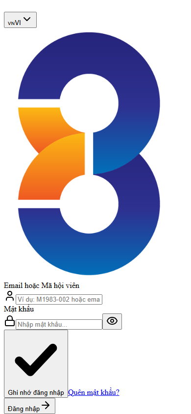
*Hình 2.1: Màn hình Đăng nhập App Hội viên CEO 1983 chuẩn Classic Navy & Gold*

2. **Các bước đăng nhập chi tiết**:
   - Nhập **Email hoặc Mã hội viên** (Ví dụ: `admin@connect.vn` hoặc `M1983-001`) vào ô tài khoản.
   - Nhập **Mật khẩu** khởi tạo (Mặc định: `123456`).
   - Tích chọn **"Ghi nhớ đăng nhập"** để tự động lưu phiên làm việc.
   - Bấm nút **"Đăng nhập"** màu Xanh Navy nổi bật.
   - Nếu đăng nhập lần đầu, ứng dụng sẽ gợi ý đổi mật khẩu để bảo vệ tài khoản hội viên.

---

# 3. TRANG CHỦ HỘI VIÊN (EXECUTIVE HOME FEED)

Sau khi đăng nhập, hội viên bước vào không gian trang chủ điều hành độc quyền tại `/association`.

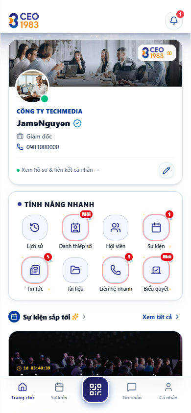
*Hình 3.1: Giao diện Trang chủ Hội viên với Thẻ hội viên VIP Gold mạ vàng và các lối tắt tiện ích*

### 3.1. Các Thành phần Giao diện Trang chủ
1. **Header Chào mừng Doanh nhân**: Hiển thị họ tên, chức danh C-Level và ảnh đại diện có tích xanh hội viên chính thức.
2. **Thẻ Hội viên VIP Gold Tương tác**: Thẻ hiển thị mã số hội viên (`M1983-001`), hạn hội phí, mã QR định danh và logo doanh nghiệp của hội viên được lồng khung kính mờ sắc nét.
3. **Thanh Lối tắt Tiện ích Nhanh (Quick Actions)**:
   - **Thẻ 3D**: Mở thẻ hội viên 3D có cảm biến con quay gyroscope.
   - **Danh bạ**: Mở danh sách kết nối toàn thể hội viên đồng niên.
   - **Sự kiện**: Xem lịch hội thảo và vé tham gia.
   - **Hội phí**: Quét mã VietQR gia hạn hội phí thường niên.
4. **Bảng tin Nổi bật & Sự kiện Sắp diễn ra**: Cập nhật các thông báo quan trọng nhất từ Ban Chấp Hành.

---

# 4. DANH BẠ HỘI VIÊN 360° & KẾT NỐI ĐỒNG NIÊN

Tuyến đường chức năng: `/association/members`.

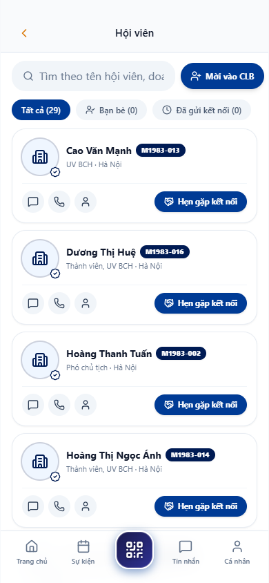
*Hình 4.1: Danh bạ Hội viên CLB CEO 1983 với bộ lọc thông minh*

### 4.1. Tìm kiếm & Kết nối Doanh nhân Đồng niên
- Thanh tìm kiếm thông minh hỗ trợ gõ tìm theo: Họ và tên, Tên công ty, Ngành nghề thế mạnh hoặc Mã hội viên.
- Bộ lọc theo 6 Ban chuyên môn: Ban Quản trị, Thư ký, Thành viên, Xúc tiến thương mại, Truyền thông, Thiện nguyện.
- Mỗi card hội viên hiển thị: Ảnh chân dung doanh nhân, Tên công ty, Chức vụ và các nút tương tác nhanh: **Gọi điện thoại**, **Nhắn tin Zalo**, **Xem hồ sơ**.

### 4.2. Modal Chi tiết Hồ sơ Hội viên 360°
Bấm vào card bất kỳ để mở modal chi tiết:
- Thông tin cá nhân, ngày sinh 1983, tiểu sử và kinh nghiệm thương trường.
- Thông tin doanh nghiệp: Lĩnh vực kinh doanh, sản phẩm dịch vụ chủ lực, địa chỉ trụ sở và website.
- Nút **"Kết nối giao thương"**: Gửi lời mời kết nối 1-on-1 hoặc trao đổi danh thiếp số.

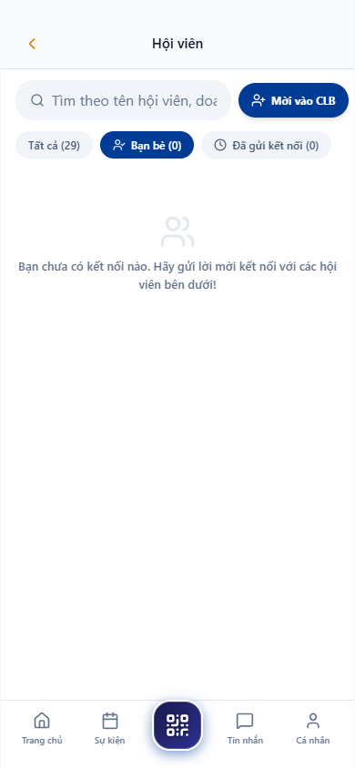
*Hình 4.2: Modal Hồ sơ Hội viên 360° và thông tin doanh nghiệp thành viên*

---

# 5. THẺ HỘI VIÊN VIP 3D GYROSCOPE & DANH THIẾP SỐ DOANH NHÂN

Tuyến đường chức năng: `/association/card` và `/association/business-cards`.

### 5.1. Thẻ Hội viên VIP 3D Gyroscope (`/association/card`)
- Ứng dụng công nghệ đồ họa 3D mô phỏng chất liệu thẻ kim loại mạ vàng sang trọng.
- Khi nghiêng điện thoại, hiệu ứng phản chiếu ánh sáng và con quay hồi chuyển (gyroscope) làm cho thẻ lấp lánh như thẻ vật lý thật.
- Mặt trước hiển thị: Logo dập nổi CEO 1983, Họ tên hội viên, Tên doanh nghiệp, Số thẻ và Hạn hiệu lực.
- Bấm vào thẻ để lật mặt sau: Hiển thị mã QR định danh cá nhân phục vụ check-in sự kiện và chia sẻ thông tin.

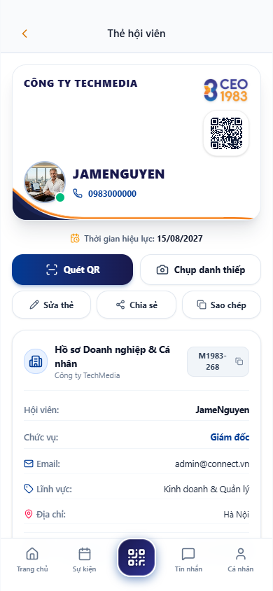
*Hình 5.1: Thẻ Hội viên VIP 3D Gyroscope phản chiếu ánh sáng sang trọng*

### 5.2. Danh thiếp Số Doanh Nhân Digital Visit Card (`/association/business-cards`)
- Thay thế hoàn toàn danh thiếp giấy truyền thống: Không sợ rách, không sợ thất lạc và cập nhật thông tin tức thì.
- **Tính năng Chạm NFC**: Chạm lưng điện thoại vào điện thoại đối tác để mở ngay danh thiếp số trên trình duyệt đối tác mà đối tác không cần cài app.
- **Tính năng Lưu Danh bạ 1-Chạm**: Đối tác bấm nút "Lưu liên hệ" để tải tệp danh bạ (.VCF) tự động ghi đầy đủ Họ tên, SĐT, Email, Tên công ty vào điện thoại.

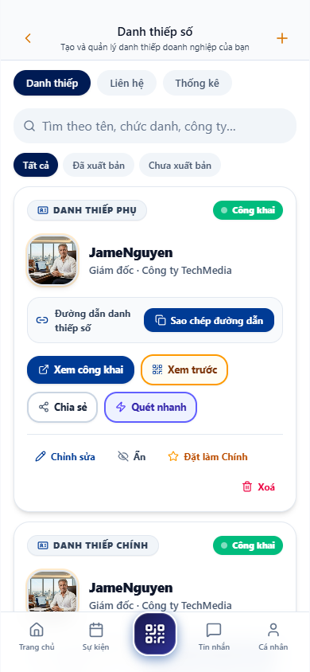
*Hình 5.2: Danh thiếp số Doanh nhân Digital Visit Card chia sẻ 1-chạm*

---

# 6. SỰ KIỆN CLB, VÉ ĐIỆN TỬ E-TICKET & QUÉT MÃ CHECK-IN

Tuyến đường chức năng: `/association/events` và `/association/checkin`.

### 6.1. Danh sách Sự kiện & Đăng ký Tham dự (`/association/events`)
- Lịch các chương trình giao lưu, họp mặt định kỳ, giải golf doanh nhân, caravan thiện nguyện và đại hội toàn thể.
- Xem chi tiết thời gian, địa điểm, diễn giả và quyền lợi tham gia.
- Bấm nút **"Đăng ký tham dự"**: Hệ thống ghi nhận và phát hành vé điện tử tức thì.

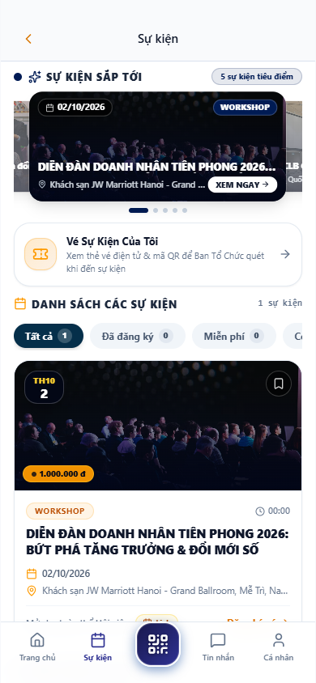
*Hình 6.1: Danh sách Sự kiện, Hội thảo & Gala CLB CEO 1983*

### 6.2. Vé Điện tử VIP Pass E-Ticket & QR Check-in (`/association/checkin`)
- Vé điện tử được thiết kế tinh tế với dải màu Gold Navy sang trọng.
- Hiển thị đầy đủ: Mã số vé, Tên đại biểu, Hạng vé (VIP / Hội viên), Số ghế ngồi và **Số may mắn Lucky Draw** để bốc thăm trúng thưởng tại sự kiện.
- **Mã QR Check-in tốc độ cao**: Khi đến sảnh hội nghị, chỉ cần đưa màn hình vé cho Ban Lễ tân quét mã; hệ thống xác nhận check-in thành công chỉ trong 0.5 giây.

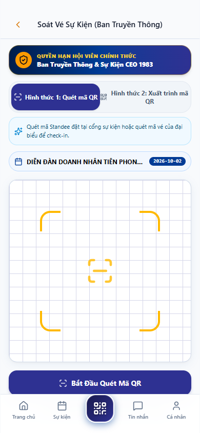
*Hình 6.2: Vé Điện tử VIP Pass E-Ticket và Mã QR Check-in cổng sự kiện*

---

# 7. TRA CỨU & NỘP HỘI PHÍ THƯỜNG NIÊN VIETQR NAPAS 24/7

Tuyến đường chức năng: `/association/renew`.

*Hình 7.1: Màn hình Tra cứu & Nộp Hội phí Thường niên qua mã VietQR MB Bank*

### 7.1. Các bước Nộp Hội phí Thường niên bằng VietQR
1. Truy cập mục **Hội phí** hoặc `/association/renew`.
2. Màn hình hiển thị: Số tiền hội phí niêm yết (Ví dụ: `5.000.000 đ / năm`), Ngày hết hạn hiện tại và Thông tin tài khoản tiếp nhận.
3. Hệ thống tạo **Mã VietQR Napas 24/7 động**:
   - **Ngân hàng thụ hưởng**: MB Bank (Ngân hàng Quân Đội).
   - **Số tài khoản chính thức**: `1983000000`.
   - **Chủ tài khoản**: `CLB DOANH NHAN CEO 1983`.
   - **Cú pháp chuyển khoản tự động**: `HP[MÃ_HỘI_VIÊN] [SỐ_ĐIỆN_THOẠI]`.
4. Hội viên mở ứng dụng ngân hàng bất kỳ, quét mã VietQR và bấm xác nhận chuyển khoản.
5. Sau khi chuyển khoản thành công, hệ thống ghi nhận và chuyển trạng thái "Chờ kế toán gạch nợ"; khi kế toán duyệt, hạn thẻ sẽ tự động cộng thêm 12 tháng.

---

# 8. SÀN GIAO THƯƠNG B2B MARKETPLACE CHUẨN SHOPEE

Tuyến đường chức năng: `/association/products`.

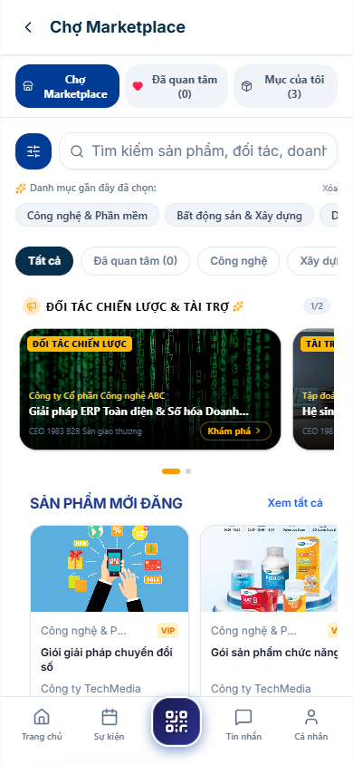
*Hình 8.1: Sàn Giao thương B2B Marketplace phong cách Shopee chuyên nghiệp*

### 8.1. Các Tính năng Đột phá của Sàn B2B CEO 1983
1. **Thanh Tìm kiếm & Bộ lọc Giá Thông minh**:
   - Icon bộ lọc bên trái cho phép sắp xếp theo: Giá từ thấp đến cao, Giá từ cao đến thấp, Hàng mới nhất.
   - Dải chip **"Danh mục gần đây đã chọn" (Recent categories)** ghi nhớ thói quen tìm kiếm của hội viên.
2. **Hệ thống Đánh giá Sao & Uy tín Doanh nghiệp**:
   - Mỗi sản phẩm hiển thị điểm đánh giá sao trung bình (Ví dụ: ⭐ 4.9) và số lượt đã giao dịch.
   - **Điểm uy tín công ty (% hài lòng)**: Tính minh bạch theo công thức: `[Tổng số sao nhận được / (Tổng lượt đánh giá * 5)] * 100%`.
3. **Modal Chi tiết Sản phẩm Shopee-style**:
   - Khối hồ sơ Shop của CEO đăng bán.
   - Bảng phân bổ đánh giá 1-5 sao và nhận xét thực tế từ các chủ doanh nghiệp trong CLB.
   - Nút **"Liên hệ báo giá B2B"** và **"Đặt mua ưu đãi hội viên"**.

---

# 9. KHO ĐẶC QUYỀN DOANH NGHIỆP & ƯU ĐÃI NỘI BỘ

Tuyến đường chức năng: `/association/perks`.

*Hình 9.1: Kho Đặc quyền Doanh nghiệp & Mã ưu đãi dành riêng cho Hội viên*

### 9.1. Khám phá & Kích hoạt Ưu đãi Hội viên
- Danh mục voucher giảm giá từ 10% đến 50% cho các sản phẩm, dịch vụ cao cấp do các doanh nghiệp thành viên cung cấp: Nghỉ dưỡng resort, vé máy bay, dịch vụ logistics, thiết kế nội thất, phần mềm quản trị.
- Bấm **"Nhận ưu đãi"**: Hệ thống hiển thị mã code độc quyền hoặc liên kết trực tiếp tới người phụ trách để nhận giá ưu đãi nội bộ.

---

# 10. BẢNG TIN TỨC HIỆP HỘI, BIỂU QUYẾT ĐẠI HỘI & LỊCH HỌP

Tuyến đường chức năng: `/association/news`, `/association/voting`, `/association/meetings`.

### 10.1. Bản tin Hiệp hội (`/association/news`)
- Cập nhật liên tục các bài phóng sự, tin tức hoạt động kết nối, vinh danh hội viên và các hoạt động xã hội từ thiện của CLB Doanh Nhân CEO 1983.

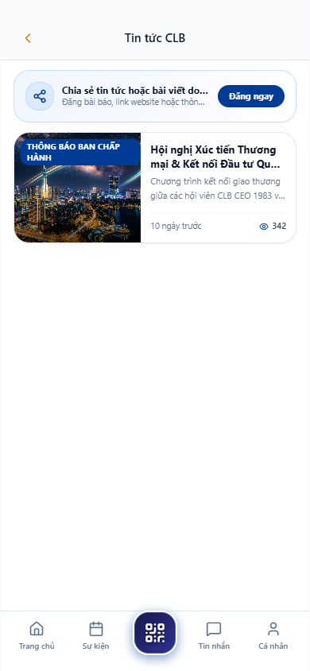
*Hình 10.1: Bảng tin Hoạt động & Phóng sự Hiệp hội*

### 10.2. Biểu quyết Đại hội Trực tuyến (`/association/voting`)
- Tham gia biểu quyết các chủ trương lớn và bầu cử Ban Chấp Hành trực tuyến ngay trên điện thoại di động.
- Bỏ phiếu kín bảo mật tuyệt đối, mỗi hội viên 1 lá phiếu duy nhất và xem kết quả biểu quyết minh bạch.

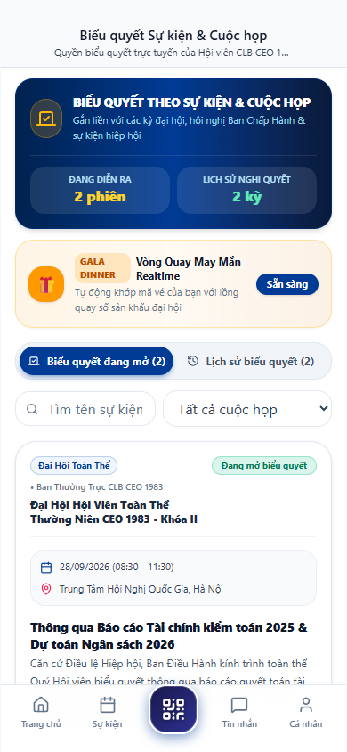
*Hình 10.2: Màn hình Biểu quyết Đại hội Trực tuyến trên App*

### 10.3. Lịch họp & Điều phối Ban Chuyên Môn (`/association/meetings`)
- Theo dõi lịch họp định kỳ của Ban Chấp Hành và Ban chuyên môn mà hội viên trực thuộc.
- Tham gia phòng họp trực tuyến (Zoom / Google Meet) chỉ bằng 1 nút bấm hoặc xem địa chỉ phòng họp offline.

*Hình 10.3: Lịch họp Ban Chấp Hành & Ban Chuyên Môn trên App*

---

# 11. HỘP THƯ TRAO ĐỔI BAN THƯ KÝ & CHỈNH SỬA HỒ SƠ

Tuyến đường chức năng: `/association/messages` và `/association/profile`.

### 11.1. Hộp thư Trao đổi với Ban Thư Ký (`/association/messages`)
- Kênh liên lạc trực tiếp, chính thống giữa hội viên và Ban Thư ký CLB.
- Gửi kiến nghị, đề xuất hợp tác, đăng ký tài trợ hoặc yêu cầu hỗ trợ kỹ thuật; Ban Thư ký tiếp nhận và phản hồi nhanh chóng.

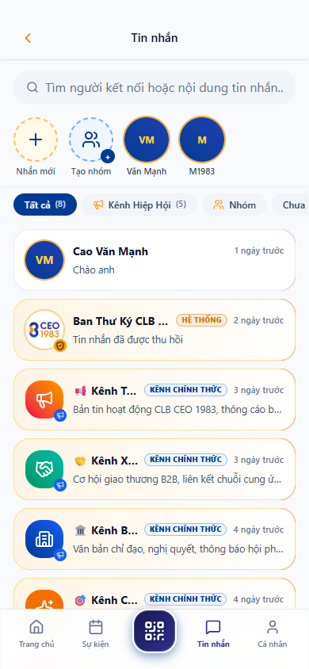
*Hình 11.1: Hộp thư Trao đổi Trực tiếp với Ban Thư Ký CLB*

### 11.2. Trang Cá nhân & Chỉnh sửa Thông tin (`/association/profile`)
- Quản lý thông tin cá nhân: Họ tên, số điện thoại, email, địa chỉ, ảnh đại diện doanh nhân.
- Quản lý thông tin doanh nghiệp: Tên công ty, ngành nghề, logo doanh nghiệp hiển thị trên thẻ hội viên.
- Đổi mật khẩu đăng nhập và quản lý thiết bị đăng nhập.

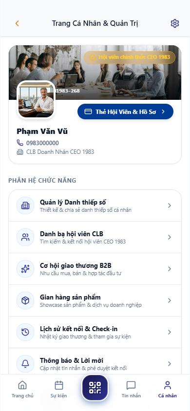
*Hình 11.2: Trang Cá nhân & Cài đặt Hồ sơ Doanh nhân*

---

# 12. CÂU HỎI THƯỜNG GẶP (FAQ) & XỬ LÝ SỰ CỐ DI ĐỘNG

### 12.1. Tôi quên mật khẩu đăng nhập App thì làm thế nào?
- Tại màn hình đăng nhập `/association/login`, bấm vào liên kết **"Quên mật khẩu?"** để nhận hướng dẫn cấp lại mật khẩu qua Email, hoặc liên hệ trực tiếp Ban Thư ký để được hỗ trợ reset mật khẩu về mặc định `123456`.

### 12.2. Làm thế nào để logo công ty hiển thị đẹp trên Thẻ Hội Viên?
- Vào mục **Hồ sơ** ➔ Bấm vào icon máy ảnh trên thẻ hội viên hoặc nút **"Đổi logo công ty"** ➔ Chọn ảnh logo có định dạng PNG nền trong suốt để hiển thị sang trọng nhất trên nền thẻ Gold Navy.

---
*Tài liệu được biên soạn và chuẩn hóa phục vụ toàn thể Hội viên CLB Doanh Nhân CEO 1983.*
