# HƯỚNG DẪN THAO TÁC & VẬN HÀNH TOÀN DIỆN ỨNG DỤNG HIỆP HỘI DOANH NHÂN CEO 1983
**Phân hệ:** Ứng dụng Di động Doanh nhân (Mobile App / PWA) & Cổng Đăng Ký Hội Viên  
**Đơn vị phát triển & Vận hành:** Ban Quản Trị & Ban Thư Ký CLB Doanh Nhân CEO 1983 (Trực thuộc Hội Doanh Nhân Trẻ Hà Nội - HanoiBA)  
**Nền tảng hỗ trợ:** iOS (Apple TestFlight), Android (APK Cài đặt trực tiếp), Web PWA  

---

## 📑 MỤC LỤC TỔNG QUAN

1. [PHẦN 1: DANH SÁCH TÀI KHOẢN VẬN HÀNH TRÊN HỆ THỐNG](#phần-1-danh-sách-tài-khoản-vận-hành-trên-hệ-thống)
2. [PHẦN 2: QUY TRÌNH ĐĂNG KÝ HỘI VIÊN, XÉT DUYỆT & CẤP TÀI KHOẢN](#phần-2-quy-trình-đăng-ký-hội-viên-xét-duyệt--cấp-tài-khoản)
3. [PHẦN 3: HƯỚNG DẪN CHI TIẾT TỪNG CHỨC NĂNG TRÊN MOBILE APP](#phần-3-hướng-dẫn-chi-tiết-từng-chức-năng-trên-mobile-app)
   - [3.1. Đăng Nhập & Kích Hoạt Phiên Làm Việc](#31-đăng-nhập--kích-hoạt-phiên-làm-việc)
   - [3.2. Trang Chủ Dashboard Doanh Nhân & Tiện Ích 1-Chạm](#32-trang-chủ-dashboard-doanh-nhân--tiện-ích-1-chạm)
   - [3.3. Thẻ Hội Viên VIP Gold & Thẻ Visit Card Thông Minh NFC](#33-thẻ-hội-viên-vip-gold--thẻ-visit-card-thông-minh-nfc)
   - [3.4. Quét Mã QR Bằng Camera & Quét Ảnh Từ Bộ Sưu Tập](#34-quét-mã-qr-bằng-camera--quét-ảnh-từ-bộ-sưu-tập)
   - [3.5. Cài Đặt Danh Thiếp Điện Tử & Tùy Biến Ẩn/Hiện Thông Tin](#35-cài-đặt-danh-thiếp-điện-tử--tùy-biến-ẩnhiện-thông-tin)
   - [3.6. Hồ Sơ Doanh Nhân 360° & Đổi Mật Khẩu Bảo Mật](#36-hồ-sơ-doanh-nhân-360--đổi-mật-khẩu-bảo-mật)
   - [3.7. Danh Bạ Doanh Nhân CEO 1983 & Bộ Lọc Ngành Nghề Đa Chiều](#37-danh-bạ-doanh-nhân-ceo-1983--bộ-lọc-ngành-nghề-đa-chiều)
   - [3.8. Xem Chi Tiết Hồ Sơ Đối Tác & Kết Nối Giao Thương 2 Chiều](#38-xem-chi-tiết-hồ-sơ-đối-tác--kết-nối-giao-thương-2-chiều)
   - [3.9. Hộp Thư Tin Nhắn Doanh Nghiệp B2B](#39-hộp-thư-tin-nhắn-doanh-nghiệp-b2b)
   - [3.10. Hội Thoại Chat 1-on-1, Gửi File Catalog & Chia Sẻ Điểm Hẹn](#310-hội-thoại-chat-1-on-1-gửi-file-catalog--chia-sẻ-điểm-hẹn)
   - [3.11. Quản Lý Nhóm Chat Giao Thương, Ghim Tin & Thu Hồi Tin Nhắn](#311-quản-lý-nhóm-chat-giao-thương-ghim-tin--thu-hồi-tin-nhắn)
   - [3.12. Lịch Sự Kiện, Diễn Đàn & Đồng Bộ Lịch Hẹn Google/Apple Calendar](#312-lịch-sự-kiện-diễn-đàn--đồng-bộ-lịch-hẹn-googleapple-calendar)
   - [3.13. Đăng Ký Vé Sự Kiện & Chọn Hạng Vé Đại Biểu](#313-đăng-ký-vé-sự-kiện--chọn-hạng-vé-đại-biểu)
   - [3.14. Vé Điện Tử Thông Minh, Định Vị Số Bàn VIP & Check-in QR 1 Giây](#314-vé-điện-tử-thông-minh-định-vị-số-bàn-vip--check-in-qr-1-giây)
   - [3.15. Bầu Cử Ban Chấp Hành Trực Tuyến & Quay Số May Mắn Lucky Draw](#315-bầu-cử-ban-chấp-hành-trực-tuyến--quay-số-may-mắn-lucky-draw)
   - [3.16. Sàn Giao Dịch Marketplace B2B & Ưu Đãi Nội Bộ](#316-sàn-giao-dịch-marketplace-b2b--ưu-đãi-nội-bộ)
   - [3.17. Đăng Bán Sản Phẩm Mới & Quản Lý Gian Hàng Doanh Nghiệp](#317-đăng-bán-sản-phẩm-mới--quản-lý-gian-hàng-doanh-nghiệp)
   - [3.18. Chi Tiết Sản Phẩm & Gửi Yêu Cầu Báo Giá Sỉ B2B](#318-chi-tiết-sản-phẩm--gửi-yêu-cầu-báo-giá-sỉ-b2b)
   - [3.19. Bảng Tin Trao Đổi Cơ Hội Giao Thương & Đón Nhận Deals](#319-bảng-tin-trao-đổi-cơ-hội-giao-thương--đón-nhận-deals)
   - [3.20. Đăng Tin Trao Cơ Hội Hợp Tác Mới](#320-đăng-tin-trao-cơ-hội-hợp-tác-mới)
   - [3.21. Cổng Đóng Hội Phí Niên Liễm VietQR & Tải Biên Lai Điện Tử](#321-cổng-đóng-hội-phí-niên-liễm-vietqr--tải-biên-lai-điện-tử)
   - [3.22. Trung Tâm Thông Báo Đẩy & Bản Tin Hoạt Động Hiệp Hội](#322-trung-tâm-thông-báo-đẩy--bản-tin-hoạt-động-hiệp-hội)
4. [PHẦN 4: MỐI LIÊN KẾT ĐỒNG BỘ HAI CHIỀU VỚI WEB CRM](#phần-4-mối-liên-kết-đồng-bộ-hai-chiều-với-web-crm)

---

## 👥 PHẦN 1: DANH SÁCH TÀI KHOẢN VẬN HÀNH TRÊN HỆ THỐNG

Hệ thống quản lý định danh người dùng tập trung kết nối đồng bộ giữa Mobile App và Web CRM. Dưới đây là danh sách tài khoản chuẩn phục vụ kiểm thử và vận hành:

### 1.1. Tài Khoản Quản Trị Cấp Cao (Platform & System Admins)

| STT | Họ và Tên | Email Đăng Nhập | Vai Trò Hệ Thống | Phạm Vi Quyền Hạn |
|:---:|---|---|---|---|
| 1 | **Phạm Văn Vũ (Admin)** | `admin@connect.vn` | Super Admin / Quản Trị CRM | Toàn quyền kiểm soát hệ thống: Duyệt hội viên, tài chính sổ quỹ, sự kiện, marketplace, cơ hội và cấu hình hệ thống |
| 2 | **Trần Tuấn Anh (Platform Admin)** | `admin1@connect.vn` | Platform Admin | Quản trị nền tảng hạ tầng, cấu hình máy chủ, phân quyền bảo mật SSL và nhật ký kiểm toán |

### 1.2. Tài Khoản Kiểm Thử Nghiệp Vụ Hội Viên Chuẩn

| STT | Họ và Tên Doanh Nhân | Pháp Nhân Doanh Nghiệp | Email Đăng Nhập | Mã Hội Viên | Trạng Thái |
|:---:|---|---|---|:---:|:---:|
| 1 | **Phạm Vũ Nam** | Công ty TNHH MediSocial | `vumikasa6@gmail.com` | `CEO1983-000002` | **Active** (Đã kích hoạt) |

### 1.3. Danh Sách Lãnh Đạo Ban Điều Hành CLB CEO 1983

Toàn bộ 28 lãnh đạo chủ chốt trong Ban Điều Hành CLB Doanh Nhân CEO 1983 đã được khởi tạo tài khoản hội viên chính thức trên hệ thống:

| STT | Mã Hội Viên | Họ và Tên | Chức Vụ Trong Ban Điều Hành | Số Điện Thoại | Email Đăng Nhập |
|:---:|:---:|---|---|:---:|---|
| 1 | `M1983-001` | **Lê Thị Dung** | Chủ tịch CLB | 0988870888 | `ledung22183@gmail.com` |
| 2 | `M1983-002` | **Hoàng Thanh Tuấn** | Phó Chủ tịch | 0983988999 | `tuanht.vb@gmail.com` |
| 3 | `M1983-003` | **Nguyễn Thanh Tuấn** | Phó Chủ tịch | 0964699499 | `tuannt@saokim.com.vn` |
| 4 | `M1983-004` | **Nguyễn Trung Kiên** | Phó Chủ tịch | 0767313314 | `ceo.acmholdings@gmail.com` |
| 5 | `M1983-005` | **Đỗ Minh Thành** | Phó Chủ tịch | 0948396888 | `thanh.dm@valis.vn` |
| 6 | `M1983-006` | **Nguyễn Đình Toản** | Ủy viên BCH, Thành viên | 0989310558 | `toannd2910@gmail.com` |
| 7 | `M1983-007` | **Phùng Quyết Thanh** | Ủy viên BCH, Thành viên | 0987879689 | `thanh.pq@quyettienco.com` |
| 8 | `M1983-008` | **Nguyễn Thế Duẩn** | Phó Chủ tịch | 0984247726 | `theduan.pvn@gmail.com` |
| 9 | `M1983-009` | **Nguyễn Thị Hồng Trang** | Ủy viên BCH, Thành viên | 0983126918 | `nguyentrang021083@gmail.com` |
| 10 | `M1983-010` | **Trần Ánh Phương** | Thành viên, Ủy viên BCH | 0903299616 | `phuong.trananh83@gmail.com` |
| 11 | `M1983-011` | **Hoàng Văn Nam** | Ủy viên BCH, Thành viên | 0988311882 | `kevin.nam@globalcom.vn` |
| 12 | `M1983-012` | **Nguyễn Vân Hương** | Thành viên, Ủy viên BCH | 0904157755 | `vanhuongplvn@gmail.com` |
| 13 | `M1983-013` | **Cao Văn Mạnh** | Ủy viên BCH | 0982848884 | `master@hoaduong.vn` |
| 14 | `M1983-014` | **Hoàng Thị Ngọc Ánh** | Thành viên, Ủy viên BCH | 0941272222 | `hoanganh@avtravel.com.vn` |
| 15 | `M1983-015` | **Triệu Văn Ba** | Phó Chủ tịch | 0973256686 | `congtycophanvietphu@gmail.com` |
| 16 | `M1983-016` | **Dương Thị Huệ** | Thành viên, Ủy viên BCH | 0983971783 | `huedohoa@gmail.com` |
| 17 | `M1983-017` | **Nguyễn Thị Khuyên** | Thành viên, Ủy viên BCH | 0982695550 | `nasakivn@gmail.com` |
| 18 | `M1983-018` | **Nguyễn Anh Tuấn** | Phó Chủ tịch, Trưởng ĐD KV Nam | 0915062564 | `tuan.nguyen@haseca.com` |
| 19 | `M1983-019` | **Phạm Văn Hùng** | Thành viên, Ủy viên BCH | 0942222075 | `hungpham@hoangsaviet.com` |
| 20 | `M1983-020` | **Nguyễn Thị Phượng** | Ủy viên BCH, Thành viên | 0907117118 | `trangnguyentrangh84@gmail.com` |
| 21 | `M1983-021` | **Nguyễn Phi Hồng Nguyên** | Thành viên, Ủy viên BCH | 0908898475 | `admin@vietpromotion.vn` |
| 22 | `M1983-022` | **Đặng Văn Giang** | Thành viên, Ủy viên BCH | 0974788686 | `hoanggiangpt44b@gmail.com` |
| 23 | `M1983-023` | **Trịnh Quang Thái** | Thành viên, Ủy viên BCH | 0912841157 | `thaitq@tcsoft.vn` |
| 24 | `M1983-024` | **Nguyễn Thế Tư** | Thành viên, Ủy viên BCH | 0813946888 | `vptdl.prudential.q10@gmail.com` |
| 25 | `M1983-025` | **Nguyễn Văn Thuy** | Thành viên, Ủy viên BCH | 0913968388 | `thuynv@minhdunggroup.vn` |
| 26 | `M1983-026` | **Trần Đức Tuân** | Ủy viên BCH, Thành viên | 0909588136 | `vpct@vtgroup.com.vn` |
| 27 | `M1983-027` | **Phạm Trung Thành** | Thành viên, Ủy viên BCH | 0911859969 | `thanhphamphd@visionviet.vn` |
| 28 | `M1983-028` | **Phạm Văn Vũ** | Thành viên Ban Điều Hành | 0988090120 | `vupv090120@gmail.com` |

---

## 🚀 PHẦN 2: QUY TRÌNH ĐĂNG KÝ HỘI VIÊN, XÉT DUYỆT & CẤP TÀI KHOẢN

Quy trình đăng ký gia nhập CLB Doanh Nhân CEO 1983 được khép kín qua 4 bước:

### Bước 1: Tiếp nhận Đăng ký Hội viên Mới (Duy Nhất Qua Cổng Landing Page)

Hệ thống quy chuẩn duy nhất **01 luồng tiếp nhận hồ sơ đăng ký chính thức qua Cổng Landing Page Giới thiệu CLB**:
- Doanh nhân có nhu cầu gia nhập truy cập Cổng Landing Page Giới thiệu CLB Doanh Nhân CEO 1983, nhấn nút **"Đăng Ký Gia Nhập"**.
- Biểu mẫu mở ra tiếp nhận đầy đủ thông tin lãnh đạo và doanh nghiệp: Họ và tên lãnh đạo, Số điện thoại, Email, Tên doanh nghiệp, Chức vụ (Chủ tịch / CEO / Tổng Giám đốc) và Mã số thuế.
- Nhấn **"Gửi Hồ Sơ Đăng Ký"**. Dữ liệu được mã hóa và truyền tải tức thì về hàng đợi thẩm định của Ban Quản Trị trên Web CRM.
- **Lưu ý nghiệp vụ:** Để đảm bảo tính bảo mật và kiểm soát nghiêm ngặt tiêu chuẩn hội viên tinh hoa, **Ứng dụng Di động Hiệp Hội (Mobile App) không mở đăng ký tự do**. Mobile App là không gian số bảo mật nội bộ, chỉ những hội viên đã qua thẩm định và được Ban Thư Ký phê duyệt mới được cấp tài khoản đăng nhập chính thức.

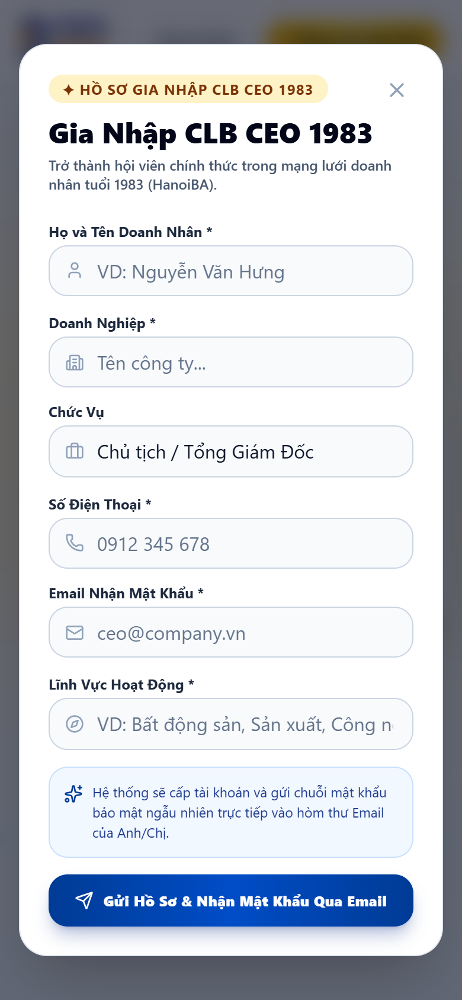
*Hình 2.1: Biểu mẫu Tiếp nhận Đăng ký Hội viên Duy Nhất trên Cổng Landing Page CEO 1983.*

### Bước 2: Thẩm định Hồ sơ & Phê duyệt tại Web CRM Quản trị

1. Ban Thư Ký đăng nhập vào Web CRM Quản trị.
2. Truy cập mục **"Hội viên"** (`/members`).
3. Các hồ sơ mới nộp sẽ hiển thị trạng thái **"Chờ xét duyệt"** (màu vàng).
4. Nhấp vào hồ sơ để mở Drawer thẩm định chi tiết 360°: Kiểm tra thông tin pháp lý công ty, mã số thuế, chức vụ và ngành nghề hoạt động.
5. Nhấp nút **"Phê duyệt (Approve)"** màu xanh.

*Hình 2.2: Giao diện Web CRM thẩm định hồ sơ và phê duyệt kết nạp hội viên chính thức.*

### Bước 3: Tự động kích hoạt tài khoản & Bắn Email Cấp Quyền Đăng Nhập

Khi Ban Thư Ký / Admin nhấn Phê duyệt trên CRM, hệ thống tự động:
1. Chuyển trạng thái hồ sơ sang **"Hoạt động (Active)"**.
2. Sinh mã định danh hội viên chính thức (ví dụ: `CEO1983-000002` hoặc `M1983-xxx`).
3. Khởi tạo tài khoản đăng nhập trong CSDL PostgreSQL.
4. Gửi email thông báo chào mừng chính thức kèm tài khoản đăng nhập, mã hội viên và mật khẩu khởi tạo an toàn về hòm thư hội viên.
5. Cung cấp hướng dẫn 3 bước tiếp theo để hội viên tải ứng dụng, đăng nhập đổi mật khẩu và kích hoạt danh thiếp số doanh nhân.

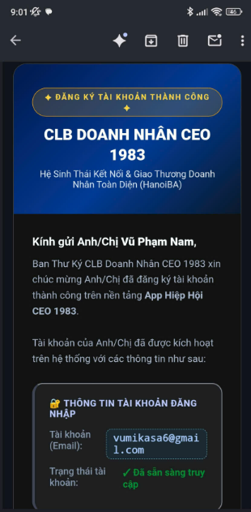
*Hình 2.3: Email chào mừng chính thức từ CLB Doanh Nhân CEO 1983 cấp thông tin tài khoản đăng nhập và mật khẩu khởi tạo an toàn.*

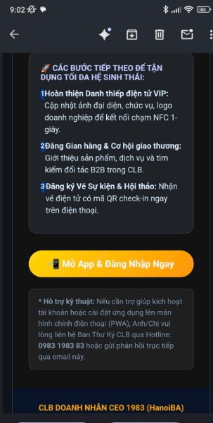
*Hình 2.4: Email hướng dẫn chi tiết các bước tải ứng dụng, đăng nhập đổi mật khẩu và hoàn thiện hồ sơ hội viên.*

---

## 📱 PHẦN 3: HƯỚNG DẪN CHI TIẾT TỪNG CHỨC NĂNG TRÊN MOBILE APP

### 3.1. Đăng Nhập & Kích Hoạt Phiên Làm Việc

1. Mở ứng dụng di động trên điện thoại (hoặc truy cập qua trình duyệt Web PWA).
2. Nhập **Email** hoặc **Số điện thoại** đã được cấp tài khoản.
3. Nhập mật khẩu bảo mật (hỗ trợ hiển thị/ẩn mật khẩu qua biểu tượng con mắt).
4. Bật tùy chọn **"Ghi nhớ đăng nhập"** để tự động lưu phiên làm việc.
5. Nhấn **"Đăng Nhập"**. Hệ thống xác thực bằng mã JWT Bearer mã hóa và chuyển hướng vào Dashboard Doanh nhân.

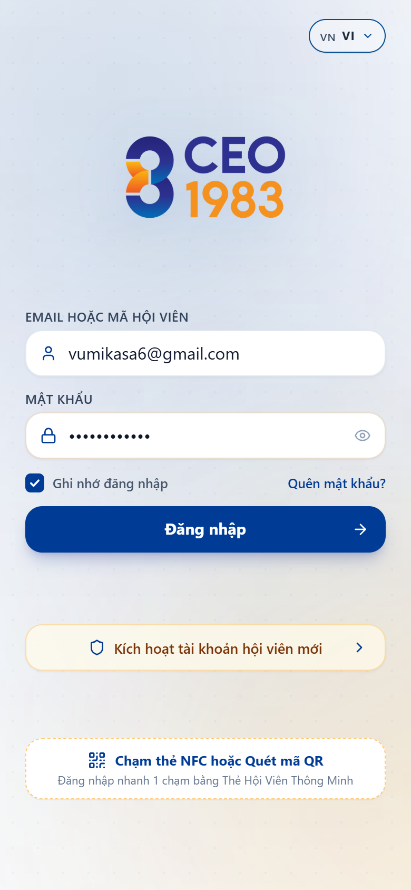
*Hình 3.1: Màn hình Đăng nhập App Hiệp Hội CEO 1983 chuẩn bảo mật cao cấp.*

---

### 3.2. Trang Chủ Dashboard Doanh Nhân & Tiện Ích 1-Chạm

Trang chủ là trung tâm điều khiển và cập nhật thông tin toàn diện của hội viên:
- **Thẻ VIP Doanh nhân 3D:** Hiển thị trực quan họ tên, chức danh, doanh nghiệp và mã định danh độc bản.
- **Thanh tác vụ tiện ích nhanh:** 
  * *Chạm NFC:* Kích hoạt chế độ truyền danh thiếp điện tử.
  * *Bầu cử:* Truy cập phòng bỏ phiếu đại hội.
  * *Điểm danh:* Mở mã QR Pass check-in vào sự kiện.
  * *Đăng sản phẩm:* Đưa hàng hóa lên sàn Marketplace B2B.
  * *Đóng hội phí:* Gia hạn niên liễm qua cổng VietQR tự động.
- **Banner sự kiện tiêu điểm:** Hiển thị sự kiện lớn sắp diễn ra kèm đồng hồ đếm ngược (ngày, giờ, phút, giây).
- **Bản tin hoạt động CLB:** Tin tức bổ nhiệm, nghị quyết và các hoạt động giao thương mới nhất.

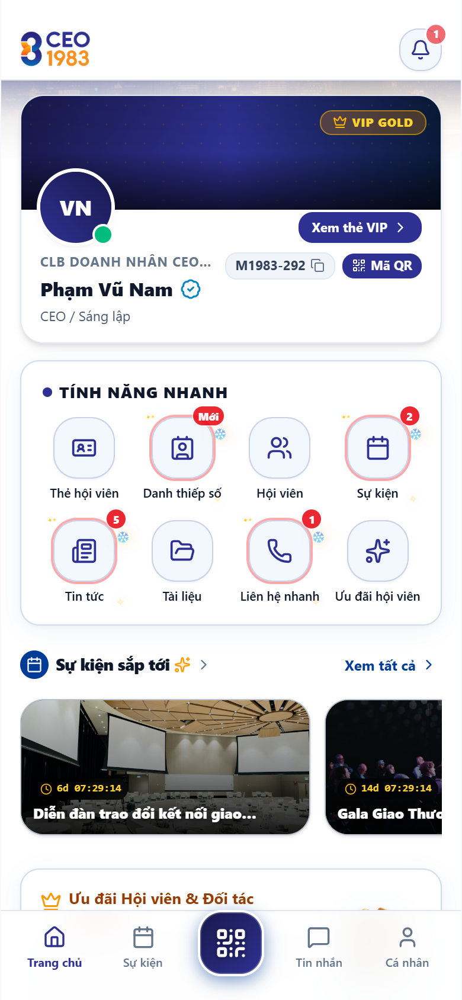
*Hình 3.2: Trang chủ Dashboard App Doanh nhân với Thẻ VIP và các tiện ích kết nối nhanh.*

---

### 3.3. Thẻ Hội Viên VIP Gold & Thẻ Visit Card Thông Minh NFC

Hệ thống cung cấp bộ đôi công cụ nhận diện thương hiệu số đẳng cấp dành riêng cho Lãnh đạo CLB CEO 1983:

#### A. Danh Thiếp Số Doanh Nhân (CEO 1983 Business Visit Card)
1. **Mặt trước danh thiếp:** Thiết kế chuẩn Brandbook CLB Doanh Nhân CEO 1983 với Logo nhận diện ánh kim, Họ tên lãnh đạo, Chức danh quản trị doanh nghiệp, Số điện thoại và Email.
2. **Nút thao tác thông minh:**
   - **"Lật Mặt Sau":** Hiệu ứng lật thẻ trực quan sang mặt sau.
   - **"Mã QR":** Phóng to mã QR định danh cá nhân để đối tác quét kết nối.
   - **"Chụp / Tải Nền":** Tùy biến hình nền danh thiếp theo bộ nhận diện công ty.
   - **"Chia Sẻ" & "Sao Chép Link":** Gửi liên kết danh thiếp số tức thì qua Zalo, Messenger, SMS.

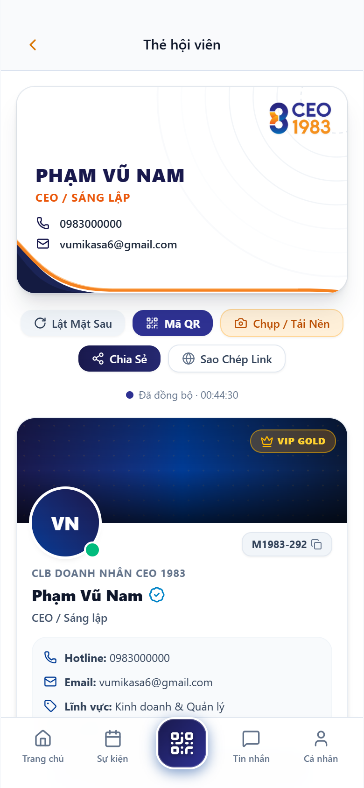
*Hình 3.3a: Danh thiếp số Doanh nhân CEO 1983 - Mặt trước sang trọng chuẩn Brandbook.*

3. **Mặt sau danh thiếp:** Phủ màu xanh Navy hoàng gia `#24357B`, dập nổi Logo trắng và Slogan bảo chứng **"Kết nối bền - Phát triển vững"**.

*Hình 3.3b: Danh thiếp số Doanh nhân CEO 1983 - Mặt sau thẻ visit card sang trọng.*

#### B. Thẻ Định Danh Hội Viên Chính Thức (VIP GOLD Membership Card)
- Cuộn xuống phần Thẻ Hội Viên để xem Thẻ Định Danh Số VIP:
  - Huy hiệu **👑 VIP GOLD** chứng thực cấp bậc hội viên danh dự.
  - Ảnh đại diện Avatar sắc nét kèm Tích xanh xác thực danh tính lãnh đạo.
  - Mã định danh hội viên chính thức (ví dụ: `M1983-292` hoặc `M1983-001`).
  - Hotline doanh nghiệp, Email liên hệ và Lĩnh vực chuyên môn hoạt động.
- **Công nghệ Chạm thẻ NFC 1-Chạm:** Chạm mặt lưng điện thoại vào thẻ cứng hoặc điện thoại đối tác để truyền toàn bộ hồ sơ trong 1 giây mà không cần cài đặt thêm app.

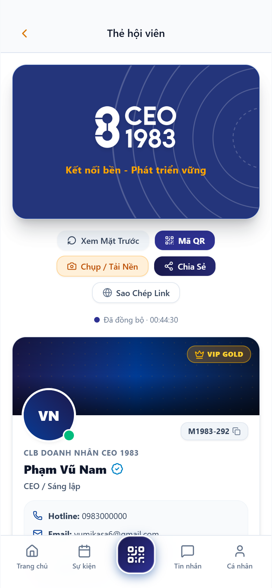
*Hình 3.3c: Thẻ định danh số Hội viên VIP GOLD với Mã hội viên, Tích xanh & Chip NFC.*

---

### 3.4. Quét Mã QR Từ Ứng Dụng Khác (Zalo / Camera) Hiển Thị Thông Tin Xác Thực

Một trong những ưu điểm đột phá nhất của nền tảng là **khả năng tương thích mở đa ứng dụng**:
- Khi đối tác hoặc khách hàng sử dụng **Camera điện thoại iPhone/Android**, ứng dụng **Zalo**, hoặc bất kỳ trình quét QR nào từ bên ngoài để quét mã trên Thẻ / Danh thiếp của hội viên:
  1. Thiết bị của đối tác sẽ tự động mở trang web định danh số công khai (`/card/$code`).
  2. Hiển thị giao diện Thẻ Doanh Nhân 3D sang trọng với huy hiệu **"ĐÃ XÁC THỰC" (Verified)**.
  3. Dấu mộc bảo chứng: **"Hồ sơ hội viên hợp lệ, được cấp chứng thực điện tử bởi CLB Doanh nhân CEO 1983"**.
  4. Các nút tương tác 1-chạm:
     - **"Lưu danh bạ" (vCard):** Tự động tải file `.vcf` lưu trọn vẹn số điện thoại, email, chức danh vào danh bạ điện thoại của đối tác.
     - **"Gọi điện":** Kết nối cuộc gọi trực tiếp đến số hotline của lãnh đạo.
     - **"Zalo":** Mở cuộc trò chuyện Zalo ngay lập tức với hội viên.
  5. Đối tác hoàn toàn **không cần đăng nhập hay cài đặt bất kỳ ứng dụng nào** vẫn tiếp cận đầy đủ thông tin doanh nghiệp, website, mã số thuế và địa chỉ trụ sở.

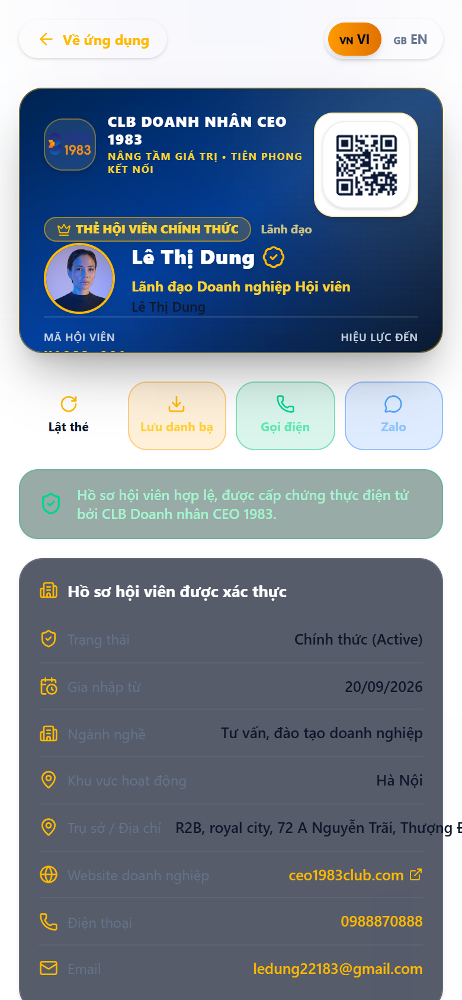
*Hình 3.4: Giao diện xác thực danh thiếp số công khai hiển thị khi đối tác quét mã QR từ Zalo / Camera điện thoại.*

---

### 3.5. Cài Đặt Danh Thiếp Điện Tử & Tùy Biến Ẩn/Hiện Thông Tin Bảo Mật

Nhằm tối ưu hóa quyền riêng tư và bảo vệ thông tin liên lạc cá nhân của các chủ doanh nghiệp khi networking:
1. Tại trang Thẻ hội viên, nhấn nút **"Cài đặt"** hoặc biểu tượng bánh răng.
2. Modal **"Quyền riêng tư khi quét QR"** mở ra cho phép linh hoạt cấu hình:
   - *Số điện thoại / Hotline:* Tùy chọn cho phép hoặc ẩn số máy khi người ngoài quét thẻ.
   - *Địa chỉ Email:* Bật/tắt nhận thư liên hệ và hợp tác kinh doanh.
   - *Địa chỉ văn phòng / Doanh nghiệp:* Ẩn/hiện địa chỉ trụ sở công ty.
   - *Tên Công ty / Doanh nghiệp & Họ tên hội viên:* Tùy biến hiển thị danh tính.
   - *Ảnh đại diện (Avatar) & Lĩnh vực kinh doanh:* Tùy biến hồ sơ nhận diện.
3. Khi hội viên tắt một trường thông tin, người ngoài khi quét mã QR sẽ thấy nhãn *"Đã ẩn theo cài đặt riêng tư"* thay vì số điện thoại hoặc email cá nhân.
4. Nhấn **"Lưu cài đặt"** để hệ thống đồng bộ tức thời lên máy chủ CSDL.

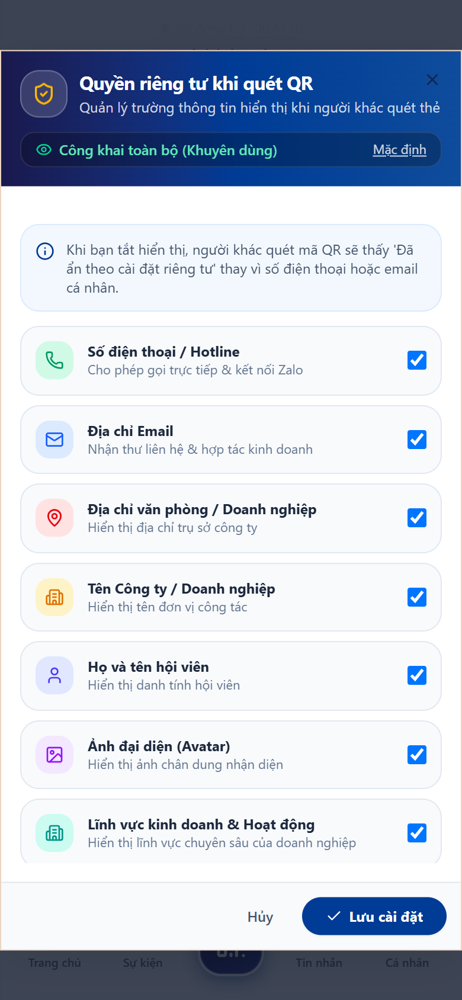
*Hình 3.5: Modal Cài đặt Quyền riêng tư danh thiếp: Tùy biến Ẩn/Hiện SĐT, Email, Địa chỉ công ty khi đối tác quét thẻ.*

---

### 3.6. Hồ Sơ Doanh Nhân 360° & Đổi Mật Khẩu Bảo Mật

Truy cập biểu tượng Cá nhân (`/association/profile`):
- **Cập nhật thông tin:** Họ tên, chức danh trong CLB, ảnh đại diện Avatar sắc nét và ảnh bìa thương hiệu công ty.
- **Hồ sơ pháp nhân:** Tên công ty, mã số thuế, địa chỉ văn phòng, lĩnh vực hoạt động và liên kết website.
- **Đính kèm tài liệu:** Tải lên file Hồ sơ năng lực / Catalog doanh nghiệp định dạng PDF để các hội viên khác tải về.
- **Quy trình Đổi Mật Khẩu:**
  1. Nhấn mục **"Đổi mật khẩu"**.
  2. Nhập mật khẩu hiện tại để xác minh danh tính.
  3. Nhập mật khẩu mới (tối thiểu 8 ký tự, bao gồm chữ hoa, chữ thường và chữ số).
  4. Nhập lại mật khẩu mới và bấm **"Cập nhật"**. Hệ thống tự động làm mới mã xác thực JWT.

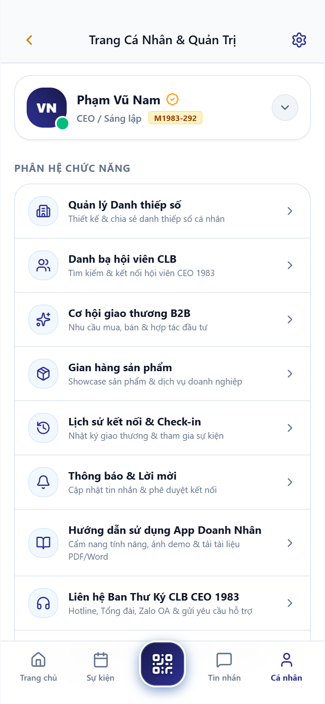
*Hình 3.6: Hồ sơ Doanh nhân 360° và Quản lý thông tin doanh nghiệp hội viên.*

---

### 3.7. Danh Bạ Doanh Nhân CEO 1983 & Bộ Lọc Ngành Nghề Đa Chiều

Truy cập menu **"Hội viên"** (`/association/members`):
- **Mạng lưới 100+ Lãnh đạo:** Danh sách đầy đủ các Chủ tịch, Tổng Giám Đốc sinh năm 1983.
- **Bộ lọc đa chiều:**
  * Lọc theo ngành nghề: *Xây dựng & Vật liệu, Công nghệ & Chuyển đổi số, Cơ khí & Sản xuất, Y tế & Dược phẩm, F&B, Logistics & Vận tải, Tài chính & Đầu tư.*
  * Lọc theo ban chuyên môn: *Ban Chủ Tịch, Ban Thư Ký, Ban Xúc Tiến Thương Mại, Ban Sự Kiện, Ban Tài Chính.*
- **Phân loại trạng thái quan hệ:** 
  * *Tất cả hội viên:* Danh sách toàn bộ thành viên trong CLB.
  * *Bạn bè đã kết nối:* Các đối tác đã chấp thuận kết nối giao thương 2 chiều.
  * *Lời mời đang chờ:* Danh sách các lời mời kết nối đang chờ phản hồi.
- Nhấn nút **"Kết nối"** để gửi lời mời hợp tác kinh doanh.

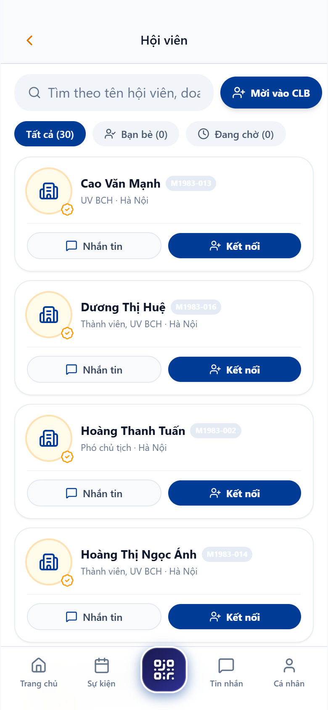
*Hình 3.7: Danh bạ Hội viên CLB Doanh Nhân CEO 1983 và bộ lọc kết nối đối tác.*

---

### 3.8. Xem Chi Tiết Hồ Sơ Đối Tác & Kết Nối Giao Thương 2 Chiều

1. Trong Danh bạ, nhấp vào thẻ thông tin của một doanh nhân bất kỳ.
2. Modal chi tiết hồ sơ năng lực đối tác mở ra:
   - Họ tên, chức vụ trong CLB và chức danh quản lý tại doanh nghiệp.
   - Số điện thoại di động và email liên hệ trực tiếp.
   - Năng lực cốt lõi, sản phẩm dịch vụ chủ lực và quy mô doanh nghiệp.
3. Các nút thao tác nhanh:
   - **"Nhắn tin":** Mở ngay phòng chat 1-on-1 để trao đổi công việc.
   - **"Kết nối":** Gửi đề nghị thiết lập quan hệ hợp tác chính thức.
   - **"Lưu danh bạ":** Tải danh thiếp số của đối tác về máy.

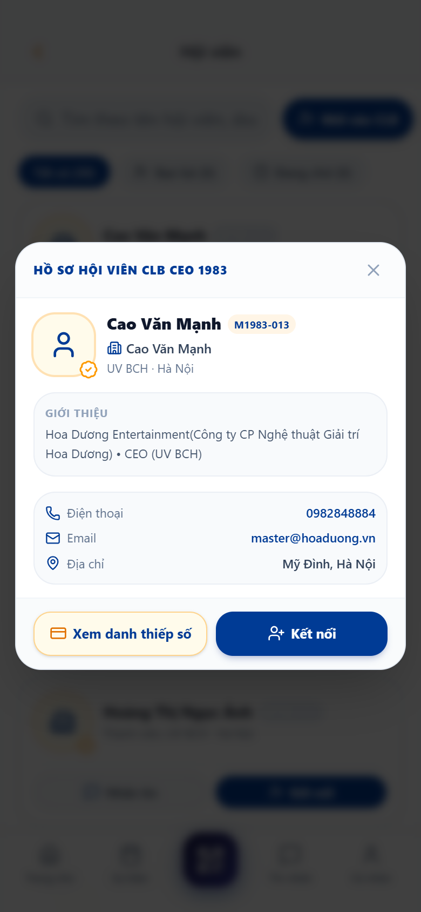
*Hình 3.8: Chi tiết Hồ sơ Năng lực Đối tác Doanh nhân và tùy chọn kết nối trực tiếp.*

---

### 3.9. Hộp Thư Tin Nhắn Doanh Nghiệp B2B

Truy cập menu **"Tin nhắn"** (`/association/messages`):
- Quản lý tập trung toàn bộ các cuộc trao đổi kinh doanh giữa các chủ doanh nghiệp.
- Thanh tìm kiếm nhanh tin nhắn theo tên đối tác hoặc tên công ty.
- Huy hiệu hiển thị số lượng tin nhắn chưa đọc (Unread badge) nổi bật.
- Chỉ báo trạng thái hoạt động: Chấm xanh hiển thị đối tác đang online thời gian thực.

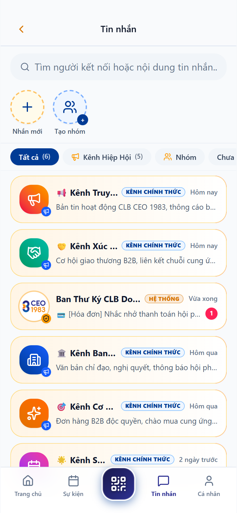
*Hình 3.9: Hộp thư Tin nhắn B2B kết nối trao đổi cơ hội kinh doanh giữa các doanh nhân.*

---

### 3.10. Hội Thoại Chat 1-on-1, Gửi File Catalog & Chia Sẻ Điểm Hẹn

1. Nhấp vào một cuộc hội thoại trong Hộp thư tin nhắn.
2. Giao diện chat trực tiếp tốc độ cao mở ra:
   - **Soạn tin nhắn:** Nhập nội dung văn bản và gửi tức thời.
   - **Đính kèm tài liệu:** Nhấn biểu tượng chiếc ghim để gửi file Catalog sản phẩm, báo giá hoặc hợp đồng nguyên tắc định dạng PDF/Word.
   - **Gửi hình ảnh:** Chọn ảnh sản phẩm hoặc ảnh mẫu từ máy ảnh/thư viện ảnh.
   - **Chia sẻ điểm hẹn giao thương:** Nhấn biểu tượng bản đồ để gửi tọa độ quán cafe hoặc văn phòng hẹn gặp làm việc trực tiếp.
   - **Bảo mật tuyệt đối:** Đường truyền mã hóa WebSocket/HTTPS bảo vệ bí mật kinh doanh của hai bên.

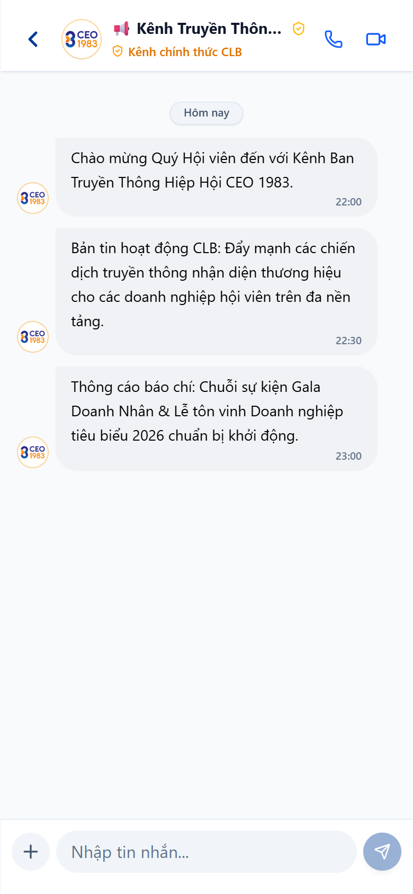
*Hình 3.10: Màn hình Chat trực tiếp 1-on-1 hỗ trợ trao đổi tài liệu và giao thương tin cậy.*

---

### 3.11. Quản Lý Nhóm Chat Giao Thương, Ghim Tin & Thu Hồi Tin Nhắn

Bên cạnh chat 1-on-1, ứng dụng hỗ trợ tính năng làm việc nhóm chuyên sâu:
- **Tạo nhóm chat:** Hội viên có thể khởi tạo nhóm chat theo dự án liên minh hoặc ban chuyên môn (ví dụ: *Nhóm Xúc Tiến Thương Mại Quý 3*).
- **Thêm/bớt thành viên:** Quản trị viên nhóm có quyền mời thêm lãnh đạo vào nhóm hoặc mời ra khỏi nhóm khi kết thúc dự án.
- **Ghim tin nhắn:** Ghim thông báo lịch họp hoặc điều khoản hợp tác quan trọng lên đầu khung chat để mọi thành viên dễ theo dõi.
- **Biểu tượng cảm xúc (Emoji):** Thả reaction (Thích, Trái tim, Bắt tay) trên từng tin nhắn.
- **Thu hồi tin nhắn:** Người gửi có thể bấm giữ tin nhắn và chọn **"Thu hồi"** nếu gửi nhầm thông tin.

---

### 3.12. Lịch Sự Kiện, Diễn Đàn & Đồng Bộ Lịch Hẹn Google/Apple Calendar

Truy cập menu **"Sự kiện"** (`/association/events`):
- Danh sách các sự kiện trọng thể của CLB: Đại hội thường niên, Caravan xúc tiến thương mại liên tỉnh, Cafe Doanh nhân định kỳ sáng thứ 7, Gala Dinner cuối năm.
- Thông tin chi tiết: Thời gian, địa điểm, nội dung Timeline chương trình (Agenda) từng khung giờ, danh sách diễn giả và nhà tài trợ.
- **Tiện ích Thêm vào Lịch:** Nhấn nút **"Thêm vào Lịch"** để tự động tạo lịch hẹn trên Google Calendar hoặc Apple Calendar trên điện thoại kèm lời nhắc trước 24 giờ.
- **Bản đồ chỉ đường:** Nhấn vào địa chỉ sự kiện để mở Google Maps dẫn đường trực tiếp đến hội trường.

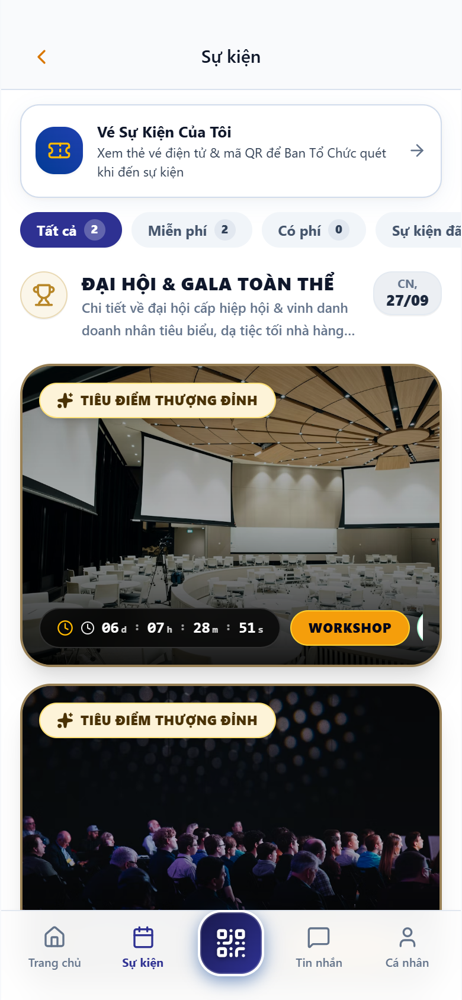
*Hình 3.12: Danh sách Sự kiện, Diễn đàn Doanh nhân & Gala Dinner CLB CEO 1983.*

---

### 3.13. Đăng Ký Vé Sự Kiện & Chọn Hạng Vé Đại Biểu

1. Tại danh sách sự kiện, nhấn nút **"Đăng ký vé"**.
2. Modal đăng ký mở ra:
   - Chọn hạng vé:
     * *Vé Hội Viên VIP:* Đặc quyền 0đ dành riêng cho hội viên chính thức của CLB.
     * *Vé Khách Mời Mở Rộng:* Dành cho đối tác và khách mời tham dự.
     * *Vé Nhà Tài Trợ:* Dành cho các đơn vị đồng hành cùng sự kiện.
   - Nhập thông tin người tham dự, chức vụ và yêu cầu bàn tiệc.
   - Đối với vé có thu phí: Hệ thống tạo đơn hàng và hiển thị mã VietQR chuyển khoản chính xác tới từng đồng.

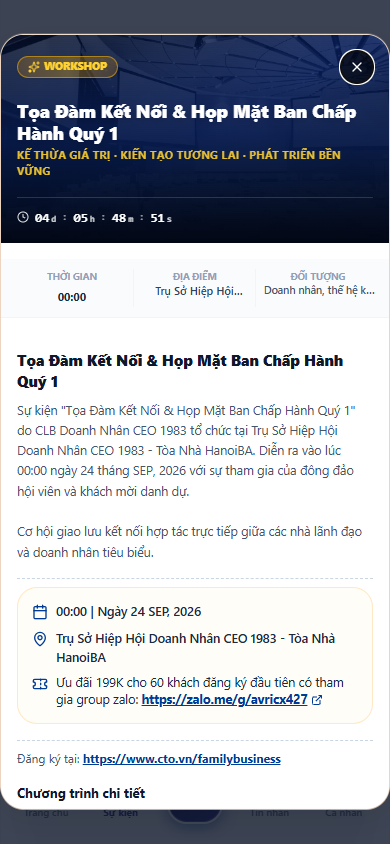
*Hình 3.13: Biểu mẫu Đăng ký Vé tham dự sự kiện và chọn hạng vé đại biểu.*

---

### 3.14. Vé Điện Tử Thông Minh, Định Vị Số Bàn VIP & Check-in QR 1 Giây

Truy cập mục **"Vé của tôi / Điểm danh"** (`/association/checkin`):
- Vé điện tử hiển thị sang trọng: Tên sự kiện, Họ tên đại biểu, Vị trí **Số Bàn VIP** và **Số Ghế Ngồi** được Ban Tổ Chức sắp đặt sẵn.
- **Mã QR Code động:** Được mã hóa an toàn, tự động làm mới chống hành vi chụp ảnh màn hình chuyển tiếp.
- **Thao tác Check-in tại cửa:** Đưa màn hình mã QR trước camera tại bàn lễ tân sự kiện. Hệ thống quét và xác thực thành công trong vòng **1 giây**, màn hình lễ tân phát âm thanh thông báo và hiển thị lời chào trân trọng.

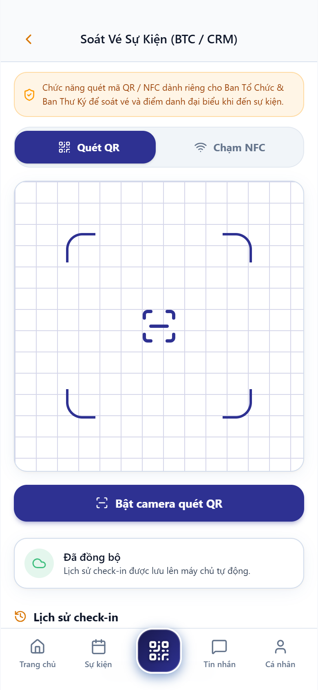
*Hình 3.14: Vé điện tử thông minh tích hợp Mã QR Check-in tức thì tại cổng sự kiện.*

---

### 3.15. Bầu Cử Ban Chấp Hành Trực Tuyến & Vòng Quay May Mắn Lucky Draw

Trong khuôn khổ Đại hội thường niên hoặc đêm tiệc Gala Dinner, ứng dụng hỗ trợ 2 phân hệ tương tác số hóa đặc sắc:

#### A. Vòng Quay May Mắn Sự Kiện (Lucky Draw Gala)
- Ban Tổ chức đồng bộ danh sách đại biểu tham dự và mã vé may mắn vào hệ thống quay số.
- Vòng quay số ngẫu nhiên minh bạch với cơ cấu giải thưởng hấp dẫn: *Giải Đặc Biệt (Xe VinFast VF3 / Apple VIP Bundle), Giải Nhất, Giải Nhì, Giải May Mắn*.
- Tự động hiển thị chúc mừng đại biểu trúng giải (họ tên, công ty, mã vé, vị trí bàn VIP) và gửi thông báo đẩy trực tiếp tới điện thoại của người trúng giải.

*Hình 3.15a-1: Giao diện Vòng quay May mắn Lucky Draw: Quay số ngẫu nhiên theo mã vé, trao giải VinFast VF3 & thông báo trúng giải.*

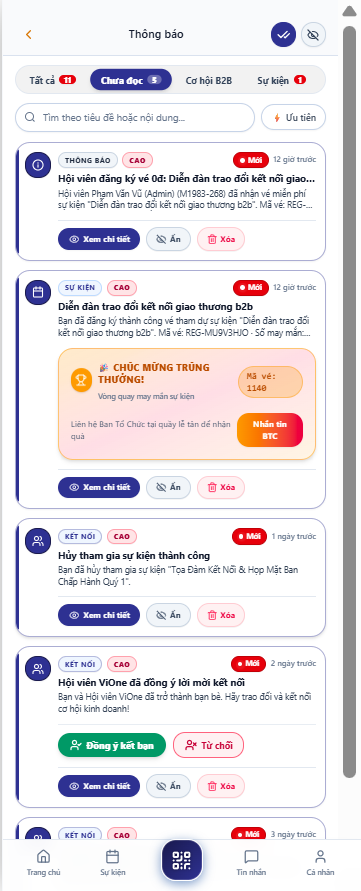
*Hình 3.15a-2: Màn hình điện thoại Hội viên nhận thông báo đẩy chúc mừng trúng thưởng Lucky Draw kèm mã số may mắn và danh mục giải thưởng.*

#### B. Bầu Cử & Biểu Quyết Tín Nhiệm Trực Tuyến
1. Hội viên truy cập phân hệ **"Biểu quyết"** trên ứng dụng.
2. Danh sách các kỳ đại hội và phiên biểu quyết hiển thị minh bạch: *Đang diễn ra, Sắp diễn ra, Đã kết thúc*.
3. Đọc chi tiết phương án / danh sách ứng cử viên Ban Chấp Hành nhiệm kỳ mới.
4. Chạm chọn phương án và bấm **"Bỏ phiếu"**. Hệ thống mã hóa phiếu bầu đảm bảo tính ẩn danh và công bằng tuyệt đối. Tỷ lệ % kết quả biểu quyết được cập nhật theo thời gian thực trên toàn hệ thống.

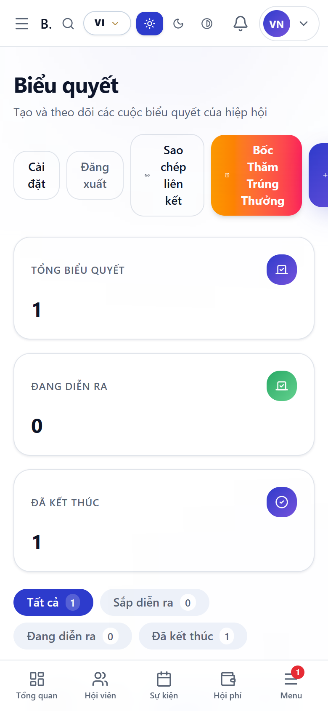
*Hình 3.15b: Phân hệ Bầu cử & Biểu quyết tín nhiệm đại hội trực tuyến trên ứng dụng di động.*

---

### 3.16. Sàn Giao Dịch Marketplace B2B & Ưu Đãi Nội Bộ

Truy cập menu **"Sản phẩm"** (`/association/products`):
- Sàn thương mại điện tử B2B nội bộ dành riêng cho các doanh nghiệp thành viên CEO 1983.
- Trưng bày các mặt hàng sản xuất công nghiệp, vật liệu xây dựng, dịch vụ công nghệ, pháp lý, y tế...
- **Cam kết chiết khấu nội khối:** Mọi sản phẩm niêm yết đều có chính sách giá ưu đãi đặc quyền cho hội viên so với giá thị trường bên ngoài.
- Thanh tìm kiếm sản phẩm theo tên, khoảng giá và danh mục ngành hàng.

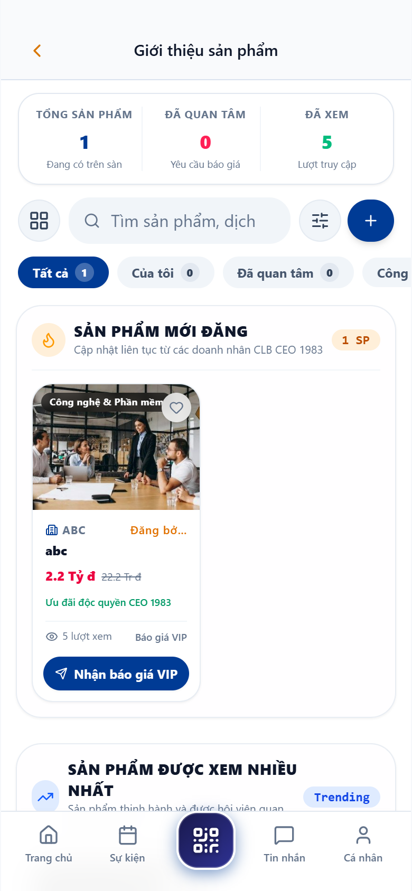
*Hình 3.16: Sàn Giao dịch & Gian hàng Sản phẩm Hội viên Ưu đãi Nội bộ CLB CEO 1983.*

---

### 3.17. Đăng Bán Sản Phẩm Mới & Quản Lý Gian Hàng Doanh Nghiệp

1. Tại màn hình Marketplace, nhấn nút **"Đăng sản phẩm"** (`+`).
2. Điền đầy đủ thông tin:
   - Tên sản phẩm / gói dịch vụ.
   - Giá bán niêm yết thị trường và Giá ưu đãi đặc quyền cho hội viên CLB.
   - Tải lên hình ảnh sản phẩm sắc nét (hệ thống tự động nén tối ưu dung lượng).
   - Quy cách đóng gói, tiêu chuẩn chất lượng và chính sách bảo hành.
3. Nhấn **"Gửi duyệt"**: Bài đăng được chuyển về Web CRM để Ban Quản Trị thẩm định xuất xứ trước khi hiển thị công khai trên App.

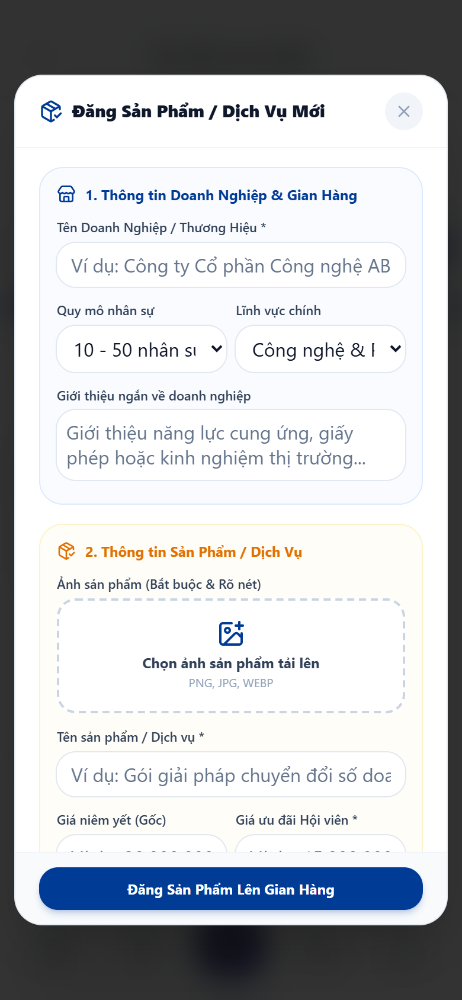
*Hình 3.17: Biểu mẫu Đăng tải sản phẩm & dịch vụ doanh nghiệp lên Sàn Marketplace.*

---

### 3.18. Chi Tiết Sản Phẩm & Gửi Yêu Cầu Báo Giá Sỉ B2B

1. Nhấp vào sản phẩm bất kỳ trên Sàn Marketplace.
2. Xem hình ảnh chi tiết, thông số kỹ thuật và thông tin pháp nhân công ty cung ứng.
3. Nhấn nút **"Nhận Báo Giá Sỉ"**:
   - Nhập số lượng dự kiến cần mua sắm.
   - Nhập ghi chú yêu cầu kỹ thuật và tiến độ giao hàng mong muốn.
   - Bấm **"Gửi yêu cầu"**: Hệ thống gửi thông báo tức thì đến Giám đốc kinh doanh của doanh nghiệp cung cấp để hai bên tiến hành đàm phán hợp đồng.

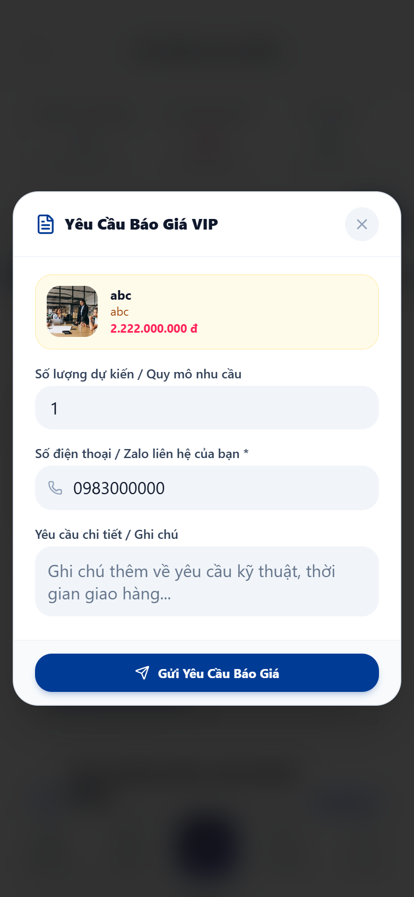
*Hình 3.18: Modal Chi tiết Sản phẩm và Yêu cầu Báo giá Ưu đãi VIP dành cho Hội viên.*

---

### 3.19. Bảng Tin Trao Đổi Cơ Hội Giao Thương & Đón Nhận Deals

Truy cập menu **"Cơ hội"** (`/association/opportunities`):
- Nơi chia sẻ các nhu cầu hợp tác kinh doanh: Tìm nhà phân phối, tìm nhà thầu phụ, mua vật tư số lượng lớn, kêu gọi vốn đầu tư.
- **Khu vực Cơ hội tiêu điểm:** Tự động xoay vòng mỗi 2 giây thu hút sự chú ý của các doanh nhân.
- **Đón nhận cơ hội (Claim Deal):** Nhấn nút **"Đón nhận"** để kết nối trực tiếp với người đăng tin và nhận hồ sơ yêu cầu chi tiết.

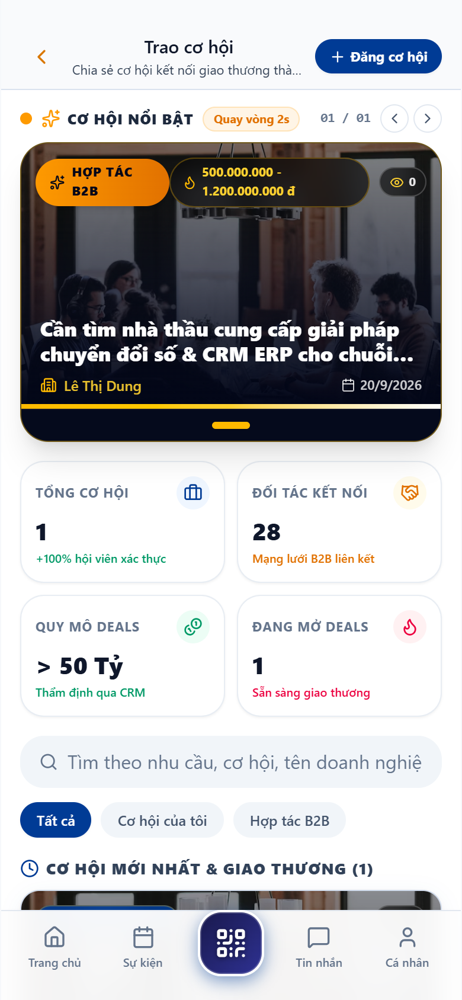
*Hình 3.19: Bảng tin Trao Cơ Hội Giao Thương B2B & Tìm kiếm Đối tác Tiềm năng.*

---

### 3.20. Đăng Tin Trao Cơ Hội Hợp Tác Mới

1. Tại màn hình Cơ hội, nhấn nút **"Đăng cơ hội"** (`+`).
2. Biểu mẫu đăng tin mở ra tiếp nhận:
   - Tiêu đề cơ hội hợp tác rõ ràng, súc tích.
   - Phân loại: Mua sắm hàng hóa, Tìm đối tác phân phối, Hợp tác liên danh, Kêu gọi đầu tư.
   - Giá trị ước tính của thương vụ (Triệu đồng / Tỷ đồng).
   - Hạn chót tiếp nhận đề xuất hợp tác.
3. Nhấn **"Đăng tin"**: Cơ hội lập tức xuất hiện trên bảng tin của toàn thể hội viên và đồng bộ về CRM phục vụ báo cáo thống kê quy mô giao thương của CLB.

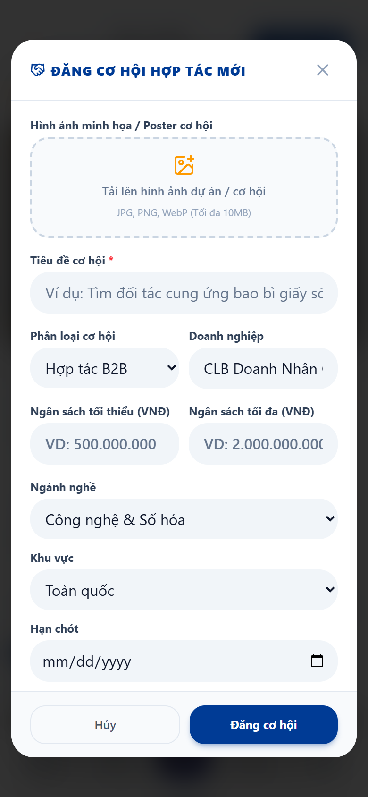
*Hình 3.20: Biểu mẫu Đăng tin Trao cơ hội Hợp tác & Nhu cầu Giao thương B2B.*

---

### 3.21. Cổng Đóng Hội Phí Niên Liễm VietQR & Tải Biên Lai Điện Tử

Truy cập mục **"Gia hạn hội phí"** (`/association/renew`):
- Hiển thị thông tin niên độ hội phí (ví dụ: Niên liễm năm 2026), hạn nộp và quyền lợi sinh hoạt.
- **Cổng thanh toán VietQR tự động:**
  1. Hệ thống tự động tạo mã VietQR động chứa chính xác số tiền và cú pháp chuyển khoản định danh.
  2. Hội viên mở bất kỳ ứng dụng ngân hàng nào (Vietcombank, Techcombank, BIDV, MB...) và quét mã QR.
  3. Sau khi chuyển khoản thành công từ 3-5 giây, hệ thống tự động gạch nợ và gia hạn hạn thẻ hội viên trên ứng dụng.
  4. Hệ thống tự động gửi **Biên lai thu tiền điện tử** có chữ ký số xác nhận về hòm thư điện tử của doanh nghiệp để làm chứng từ quyết toán kế toán.

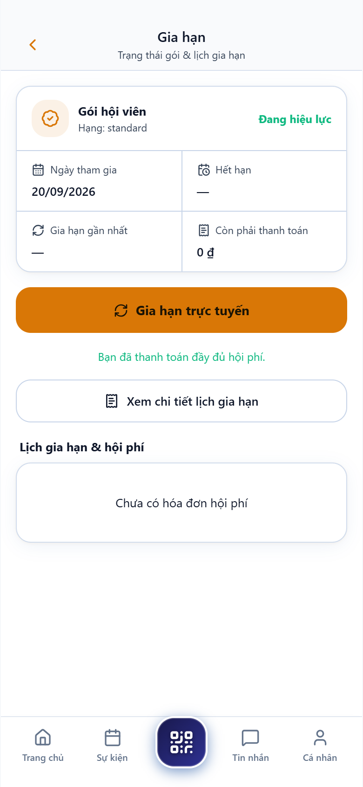
*Hình 3.21: Cổng Đóng Hội Phí Thường Niên tích hợp Quét mã VietQR Tự Động.*

---

### 3.22. Trung Tâm Thông Báo Đẩy & Bản Tin Hoạt Động Hiệp Hội

- **Trung tâm thông báo (`/association/notifications`):**
  * Nhắc nhở sự kiện sắp diễn ra trước 24 giờ.
  * Thông báo khi có đối tác gửi lời mời kết nối hoặc tin nhắn mới.
  * Cập nhật kết quả phê duyệt sản phẩm / cơ hội kinh doanh từ Ban Quản Trị.

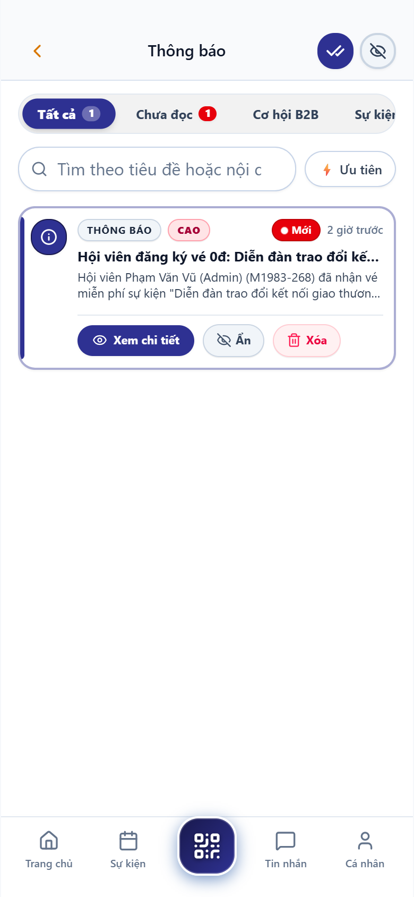
*Hình 3.22: Trung tâm Thông báo Đẩy, Hoạt động CLB & Lời nhắc Sự kiện.*

- **Bản tin hiệp hội (`/association/news`):**
  * Đăng tải nghị quyết các kỳ họp Ban Chấp Hành, thông cáo báo chí chính thức.
  * Vinh danh các doanh nhân tiêu biểu, thành tích sản xuất kinh doanh xuất sắc trong tháng.

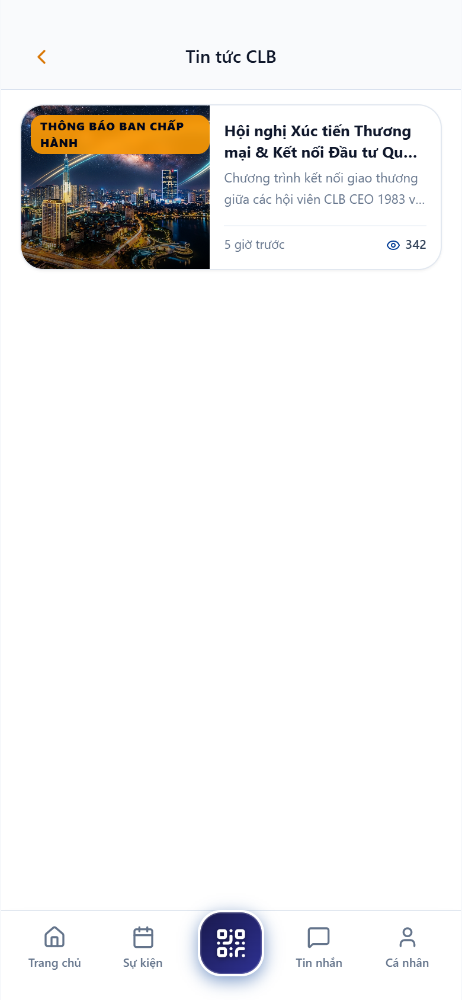
*Hình 3.23: Bản tin Hiệp Hội, Thông cáo Báo chí & Văn bản Nghị quyết CLB CEO 1983.*

---

## 🔄 PHẦN 4: MỐI LIÊN KẾT ĐỒNG BỘ HAI CHIỀU VỚI WEB CRM

| Chức Năng Trên Mobile App | Nghiệp Vụ Tương Ứng Trên Web CRM | Cơ Chế Đồng Bộ Thực Tế |
|---|---|---|
| **Đăng ký hội viên mới** | Duyệt hồ sơ tại `/members` | Tự động sinh mã hội viên, cấp mật khẩu và gửi email tức thì |
| **Đăng bán sản phẩm B2B** | Thẩm định sản phẩm tại `/marketplace` | Kiểm tra xuất xứ, gắn nhãn kiểm duyệt trước khi hiển thị lên App |
| **Đăng tin trao cơ hội B2B** | Giám sát & thống kê Deal tại `/opportunities` | Theo dõi tổng giá trị giao thương kết nối thành công của CLB |
| **Đăng ký vé sự kiện** | Điều hành sự kiện & ghế ngồi tại `/events` | Cập nhật số lượng vé, phân bổ số ghế VIP vào vé điện tử |
| **Quét mã QR Check-in vé** | Cổng soát vé lễ tân tại `/checkin` | Tốc độ quét 1s, chống trùng vé 100%, ghi nhận danh sách có mặt |
| **Quét VietQR nộp hội phí** | Kế toán sổ quỹ tại `/fees` | Đối soát sao kê tự động, gạch nợ và gia hạn thẻ hội viên ngay lập tức |

---

*Tài liệu được biên soạn và chuẩn hóa phục vụ công tác bàn giao vận hành số hóa CLB Doanh Nhân CEO 1983.*
