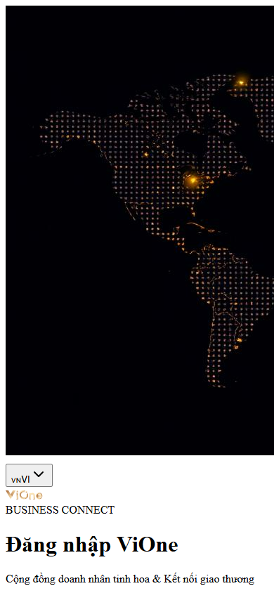
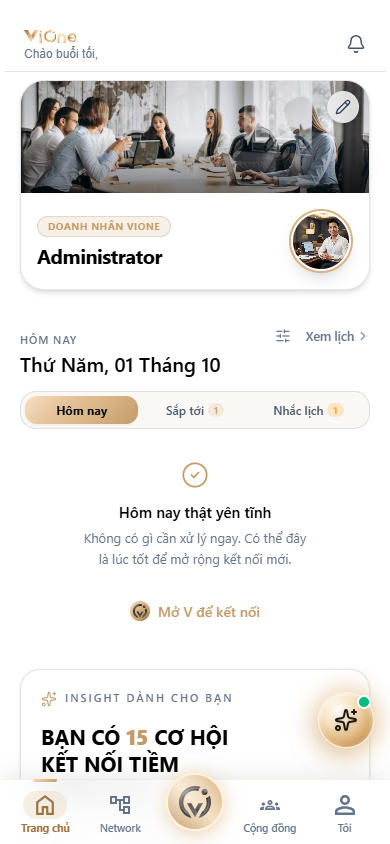
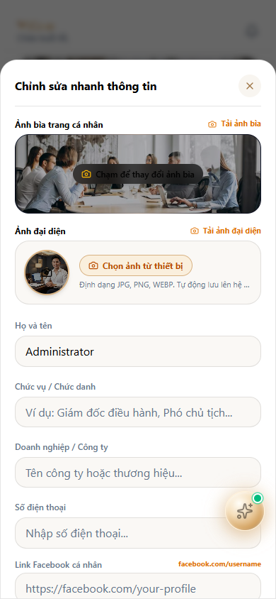
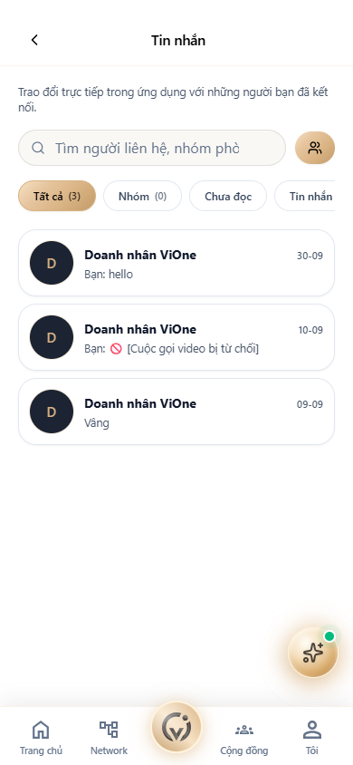
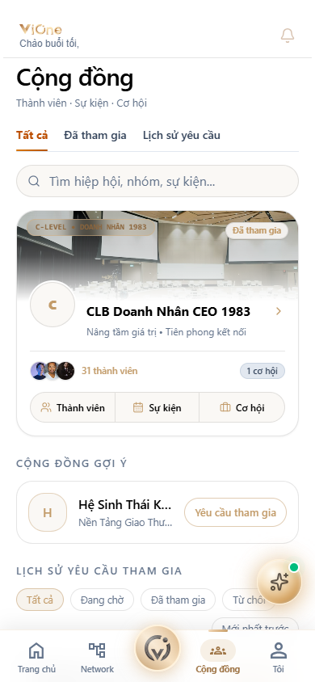
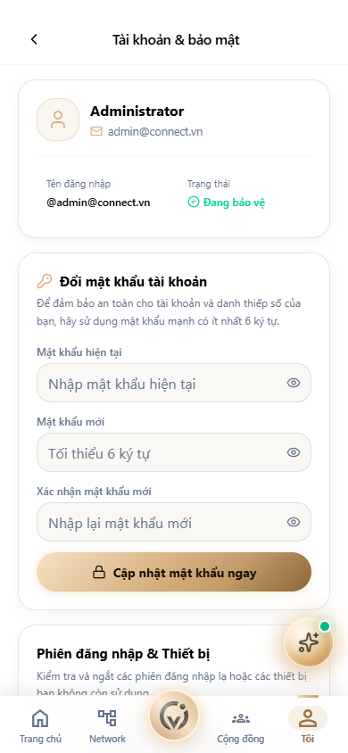

# TÀI LIỆU HƯỚNG DẪN SỬ DỤNG VẬN HÀNH ỨNG DỤNG
## ỨNG DỤNG MẠNG LƯỚI GIAO THƯƠNG & DANH THIẾP SỐ VIONE CONNECT (APP VIONE)
*Đặc tả Chi tiết Danh Thiếp Titanium NFC 1-Chạm, Ghép Cặp AI Matchmaking & Trải Nghiệm Mạng Xã Hội Doanh Nhân*

---

- **Tên Ứng Dụng**: **ViOne Connect (Business Connect Mobile App & PWA)**
- **Mã Tài Liệu**: **HDSD-APP-VIONE-V4.0**
- **Phiên Bản**: **Version 4.0 — Master Production User Manual (Bàn Giao Doanh Nhân)**
- **Địa Chỉ Server Dev**: `https://14.225.217.232:5445/connect-app`
- **Đối Tượng Áp Dụng**: Chủ tịch, CEO Doanh nghiệp B2B, Giám đốc Kinh doanh (CCO), Đại diện Thương mại, Nhà đầu tư
- **Ngày Ban Hành**: **01/10/2026**
- **Người Thực Hiện / Phụ Trách**: **Phạm Văn Vũ & ViOne Mobile Product Team**

---

> [!IMPORTANT]
> **THÔNG TIN MÔI TRƯỜNG & TÀI KHOẢN TRUY CẬP APP VIONE CONNECT**
> - **Cổng Web App di động (PWA)**: `https://14.225.217.232:5445/connect-app`
> - **Màn hình Đăng nhập App**: `https://14.225.217.232:5445/vione/login`
> - **Tài khoản thử nghiệm mẫu**: `admin@connect.vn` | Mật khẩu: `123456`
> - **Kho lưu trữ Object Storage**: MinIO S3 Server độc lập (Port 9060 / 9061) lưu trữ ảnh đại diện, ảnh bìa và brochure doanh nghiệp.
> - **Thiết bị phần cứng hỗ trợ**: Tích hợp chip NFC Titanium thông minh, giao tiếp tiệm cận Web NFC API, chia sẻ danh bạ điện tử chuẩn vCard (.VCF).

---

## 📌 MỤC LỤC TÀI LIỆU

1. [TỔNG QUAN ỨNG DỤNG VIONE CONNECT](#1-tổng-quan-ứng-dụng-vione-connect)
2. [HƯỚNG DẪN CÀI ĐẶT & ĐĂNG NHẬP ỨNG DỤNG](#2-hướng-dẫn-cài-đặt--đăng-nhập-ứng-dụng)
3. [TRANG CHỦ ĐIỀU HÀNH EXECUTIVE TODAY](#3-trang-chủ-điều-hành-executive-today)
4. [NÚT KẾT NỐI TRUNG TÂM "V" & CHẠM NFC 1-GIÂY](#4-nút-kết-nối-trung-tâm-v--chạm-nfc-1-giây)
5. [QUÉT DANH THIẾP GIẤY THÔNG MINH (OCR SCANNER)](#5-quét-danh-thiếp-giấy-thông-minh-ocr-scanner)
6. [QUẢN TRỊ MẠNG LƯỚI QUAN HỆ ĐỐI TÁC B2B NETWORK](#6-quản-trị-mạng-lưới-quan-hệ-đối-tác-b2b-network)
7. [KHOẢNH KHẮC DOANH NHÂN & BẢNG TIN GIAO THƯƠNG B2B MOMENTS](#7-khoảnh-khắc-doanh-nhân--bảng-tin-giao-thương-b2b-moments)
8. [TRÒ CHUYỆN MÃ HÓA & ĐÀM PHÁN B2B THỜI GIAN THỰC](#8-trò-chuyện-mã-hóa--đàm-phán-b2b-thời-gian-thực)
9. [CỘNG ĐỒNG GIAO THƯƠNG & CƠ HỘI KINH DOANH B2B](#9-cộng-đồng-giao-thương--cơ-hội-kinh-doanh-b2b)
10. [TRUNG TÂM THẺ SỐ CÁ NHÂN TITANIUM & QUẢN TRỊ PROFILE](#10-trung-tâm-thẻ-số-cá-nhân-titanium--quản-trị-profile)
11. [HƯỚNG DẪN KÍCH HOẠT THẺ TITANIUM NFC THÔNG MINH](#11-hướng-dẫn-kích-hoạt-thẻ-titanium-nfc-thông-minh)
12. [THIẾT LẬP BẢO MẬT & XỬ LÝ SỰ CỐ DI ĐỘNG](#12-thiết-lập-bảo-mật--xử-lý-sự-cố-di-động)

---

# 1. TỔNG QUAN ỨNG DỤNG VIONE CONNECT

### 1.1. Sứ mệnh của ViOne Connect
ViOne Connect là Trợ lý Giao thương số và Mạng xã hội Doanh nhân bỏ túi dành riêng cho giới chủ doanh nghiệp và các nhà điều hành. Ứng dụng giải quyết triệt để vấn đề thất lạc danh thiếp giấy truyền thống, đồng thời mở ra cánh cửa kết nối đối tác B2B thông qua thuật toán gợi ý ghép đôi AI thông minh.

### 1.2. 4 Giá trị Đột phá Cốt lõi
1. **Danh thiếp Titanium NFC thông minh**: Chỉ cần 1 chạm nhẹ thẻ vào lưng điện thoại đối tác, toàn bộ thông tin công ty, hồ sơ năng lực và nút lưu số danh bạ (.VCF) tự động mở trên điện thoại đối tác trong 1 giây mà đối tác không cần cài ứng dụng.
2. **Quản trị quan hệ đối tác B2B (Personal CRM)**: Tự động lưu trữ thông tin người đã chạm thẻ, ghi chú thỏa thuận hợp tác, ghi âm cuộc gặp và nhắc lịch tái kết nối định kỳ.
3. **Mạng xã hội B2B Moments**: Chia sẻ khoảnh khắc hợp tác, ký kết hợp đồng, đăng tải nhu cầu tìm kiếm đối tác cung - cầu.
4. **Hệ thống liên lạc đàm phán mã hóa**: Chat thời gian thực WebSocket, trao đổi profile năng lực ngay trong khung chat và lên lịch hẹn giao thương 1-on-1.

---

# 2. HƯỚNG DẪN CÀI ĐẶT & ĐĂNG NHẬP ỨNG DỤNG

### 2.1. Cài đặt Ứng dụng lên Màn hình chính (PWA)
1. Dùng trình duyệt di động (Safari trên iPhone hoặc Chrome trên Android) truy cập: `https://14.225.217.232:5445/connect-app`.
2. Bấm vào biểu tượng chia sẻ trên trình duyệt ➔ Chọn **"Thêm vào Màn hình chính" (Add to Home Screen)**.
3. Biểu tượng ứng dụng với Logo ViOne màu Vàng đồng sang trọng xuất hiện trên màn hình điện thoại.

### 2.2. Đăng nhập Ứng dụng ViOne Connect
1. Mở ứng dụng hoặc truy cập: `https://14.225.217.232:5445/vione/login`.

*Hình 2.1: Màn hình Đăng nhập App ViOne Connect chuẩn Titanium & Champagne Gold*

2. **Các bước đăng nhập chi tiết**:
   - Nhập **Email hoặc Tên đăng nhập** (`admin@connect.vn`) vào ô tài khoản.
   - Nhập **Mật khẩu** (`123456`).
   - Tích chọn **"Ghi nhớ đăng nhập"**.
   - Bấm nút **"Đăng nhập"** màu Vàng đồng quý tộc.
   - Hệ thống tự động chuyển hướng vào Trang chủ Điều hành Executive Today.

---

# 3. TRANG CHỦ ĐIỀU HÀNH EXECUTIVE TODAY

Tuyến đường chức năng: `/connect-app`.

*Hình 3.1: Trang chủ Điều hành Executive Today với lịch trình gặp gỡ và gợi ý AI Match Highlights*

### 3.1. Các Khối Tiện ích Điều hành Hàng ngày
1. **Header Doanh nhân & Lời chào Buổi sáng**: Lời chào thân mật kèm danh hiệu C-Level và trạng thái sẵn sàng kết nối.
2. **Lịch trình Hôm nay (Today Agenda)**: Lịch các cuộc gặp 1-1, hội thảo B2B và các đối tác cần gọi điện thăm hỏi lại.
3. **Gợi ý Kết nối AI Match Highlights**: Hệ thống AI tự động phân tích nhu cầu Cung - Cầu của doanh nghiệp và đề xuất 3 đối tác tiềm năng nhất trong ngày với điểm số phù hợp (Match Score từ 85% đến 98%).
4. **Nhật ký Tương tác Gần đây (Recent Interactions)**: Lịch sử các doanh nhân vừa chạm danh thiếp hoặc xem hồ sơ của bạn.

---

# 4. NÚT KẾT NỐI TRUNG TÂM "V" & CHẠM NFC 1-GIÂY

*Hình 4.1: Nút kết nối trung tâm "V" Quick Action mở bảng tùy chọn kết nối tức thì*

### 4.1. Thao tác Chạm để Kết nối (Tap to Connect)
- Bấm vào nút chữ **"V"** phát sáng màu vàng đồng ở chính giữa thanh điều hướng dưới cùng.
- Menu tròn mở ra 3 thao tác kết nối quyền lực:
  + **Chạm thẻ NFC (Tap NFC)**: Sẵn sàng áp lưng điện thoại vào thẻ thông minh của đối tác.
  + **Mã QR Cá nhân**: Mở mã QR động có logo thương hiệu để đối tác quét bằng Camera thông thường.
  + **Quét Danh thiếp Giấy (Scan Card OCR)**: Kích hoạt camera chụp lại danh thiếp giấy của đối tác.

---

# 5. QUÉT DANH THIẾP GIẤY THÔNG MINH (OCR SCANNER)

- Khi đối tác trao danh thiếp giấy truyền thống, doanh nhân không cần nhập tay từng số điện thoại.
- Bấm nút **"Quét Danh Thiếp"**: Camera ứng dụng chụp ảnh danh thiếp giấy; trí tuệ nhân tạo OCR tự động bóc tách chính xác: Họ tên, Tên công ty, Chức vụ, Số điện thoại, Email và Địa chỉ trụ sở.
- Bấm **"Lưu vào Danh bạ"**: Thông tin được ghi tự động vào mục Quản trị Quan hệ mà không sợ bị thất lạc.

---

# 6. QUẢN TRỊ MẠNG LƯỚI QUAN HỆ ĐỐI TÁC B2B NETWORK

Tuyến đường chức năng: `/connect-app/network`.

*Hình 6.1: Quản trị Mạng lưới Quan hệ Đối tác B2B Network*

### 6.1. Danh bạ Quan hệ & Thẻ Nhãn Phân loại
- Quản lý toàn bộ danh sách các mối quan hệ đã kết nối: Đối tác chiến lược, Khách hàng tiềm năng, Nhà đầu tư, Bạn đồng niên.
- Lọc theo ngành nghề: Xây dựng, Tài chính, Công nghệ thông tin, Logistics, Dịch vụ F&B.

### 6.2. Hồ sơ Chi tiết Đối tác 360° (Person Detail & Journey)
- Bấm vào đối tác bất kỳ để mở hồ sơ năng lực 360°.
- **Tính năng Ghi chú Cuộc gặp (PersonNotes)**: Ghi lại nội dung hai bên vừa bàn bạc trong buổi cà phê (Ví dụ: "Quan tâm đến giải pháp ERP, hẹn báo giá vào thứ 5 tuần tới").
- **Hành trình Hợp tác (PersonJourney)**: Theo dõi tiến trình từ lần chạm thẻ đầu tiên đến khi ký hợp đồng chính thức.

---

# 7. KHOẢNH KHẮC DOANH NHÂN & BẢNG TIN GIAO THƯƠNG B2B MOMENTS

Tuyến đường chức năng: `/connect-app/moment`.

*Hình 7.1: Bảng tin Khoảnh khắc Doanh nhân & Cơ hội Hợp tác B2B Moments*

### 7.1. Đăng bài Khoảnh khắc Hợp tác (Moment Composer)
- Đăng tải hình ảnh bắt tay ký kết hợp tác, lễ ra mắt sản phẩm mới hoặc hoạt động giao lưu doanh nghiệp.
- **Tính năng Gắn thẻ Đối tác (Tag Partner)**: Tag trực tiếp tài khoản doanh nhân cùng tham gia sự kiện; bài viết sẽ đồng thời hiển thị trên trang cá nhân của cả hai bên.
- **Ghi âm Giọng nói (Voice Note)**: Đính kèm đoạn ghi âm chia sẻ cảm nghĩ hoặc thông điệp kinh doanh ngắn.

---

# 8. TRÒ CHUYỆN MÃ HÓA & ĐÀM PHÁN B2B THỜI GIAN THỰC

Tuyến đường chức năng: `/connect-app/inbox`.

*Hình 8.1: Hộp thư Trò chuyện Trực tiếp & Đàm phán B2B Inbox*

### 8.1. Các Tính năng Đàm phán Độc quyền
- Nhắn tin bảo mật thời gian thực thông qua kết nối Socket.io tốc độ cao.
- **Gửi Profile Công ty Trong Khung Chat**: Đính kèm trực tiếp danh thiếp số hoặc brochure năng lực công ty chỉ bằng 1 nút bấm.
- **Lên Lịch Hẹn Giao Thương (Schedule Meeting)**: Gửi lời mời họp 1-on-1; khi đối tác bấm "Đồng ý", hệ thống tự động thêm vào Lịch điều hành của cả hai bên.

---

# 9. CỘNG ĐỒNG GIAO THƯƠNG & CƠ HỘI KINH DOANH B2B

Tuyến đường chức năng: `/connect-app/community`.

*Hình 9.1: Cộng đồng Giao thương & Sàn Cơ hội Kinh doanh B2B*

### 9.1. Khám phá Cơ hội B2B (Opportunities & Leads)
- Nơi các doanh nhân đăng tải nhu cầu tìm kiếm nhà cung cấp hoặc chào hàng sản phẩm thế mạnh: "Cần tìm nhà thầu cơ điện MEP tại Hà Nội", "Cung ứng thép cuộn giá gốc nhà máy".
- Tương tác trao đổi trực tiếp và kết nối hợp tác mà không qua trung gian.

---

# 10. TRUNG TÂM THẺ SỐ CÁ NHÂN TITANIUM & QUẢN TRỊ PROFILE

Tuyến đường chức năng: `/connect-app/me`.

*Hình 10.1: Trung tâm Thẻ số Cá nhân Titanium & Danh thiếp Đa năng*

### 10.1. Quản lý Đa Danh Thiếp Thông Minh (Multi-Cards)
- Cho phép 1 doanh nhân tạo nhiều danh thiếp số chuyên biệt:
  + **Danh thiếp Doanh nghiệp**: Hiển thị chức danh Tổng Giám Đốc, tên công ty chính và sản phẩm dịch vụ B2B.
  + **Danh thiếp Xã hội / Hiệp hội**: Hiển thị vai trò trong CLB Doanh Nhân, Hội Golf hoặc Ban điều hành.
  + **Danh thiếp Đầu tư**: Dành cho các hoạt động đầu tư tài chính và cố vấn chiến lược.
- Thay đổi ảnh đại diện và ảnh bìa đồng bộ lên kho lưu trữ MinIO S3 Server tốc độ cao.

---

# 11. HƯỚNG DẪN KÍCH HOẠT THẺ TITANIUM NFC THÔNG MINH

Tuyến đường chức năng: `/connect-app/activate`.

*Hình 11.1: Màn hình Kích hoạt Thẻ Titanium NFC Thông Minh*

### 11.1. Các bước Kích hoạt Thẻ Vật lý Mới Nhận
1. Cầm thẻ Titanium NFC do Ban Quản trị ViOne cấp phát.
2. Mở ứng dụng ViOne Connect ➔ Vào mục **Kích hoạt thẻ** (`/connect-app/activate`).
3. Chạm mặt sau của thẻ vào vùng ăng-ten NFC ở lưng điện thoại (vùng gần camera sau đối với iPhone, vùng giữa lưng đối với Android).
4. Nhập mã bảo mật kích hoạt gồm 6 chữ số in kèm trong hộp đựng thẻ.
5. Bấm **"Xác nhận Kích hoạt"**: Thẻ vật lý lập tức liên kết vĩnh viễn với hồ sơ số của doanh nhân. Từ thời điểm này, chỉ cần chạm thẻ vào bất kỳ điện thoại nào là danh thiếp số sẽ tự động xuất hiện.

---

# 12. THIẾT LẬP BẢO MẬT & XỬ LÝ SỰ CỐ DI ĐỘNG

Tuyến đường chức năng: `/connect-app/me/security`.

*Hình 12.1: Thiết lập Bảo mật, Đổi Mật khẩu & Quản lý Phiên đăng nhập*

### 12.1. Đổi Mật khẩu & Bảo vệ Tài khoản
- Cập nhật mật khẩu định kỳ 6 tháng một lần để bảo vệ dữ liệu kinh doanh.
- Xem danh sách các thiết bị đang đăng nhập và bấm **"Đăng xuất khỏi tất cả các thiết bị khác"** nếu nghi ngờ bị lộ mật khẩu.

### 12.2. Xử lý Sự cố Khi Chạm Thẻ NFC Không Nhận
- **Trên iPhone**: Chạm đầu trên của iPhone (gần loa thoại) vào thẻ. Đảm bảo iPhone từ đời iPhone Xr / iPhone XS trở lên.
- **Trên Android**: Bật tính năng **NFC** trong menu cài đặt nhanh. Chạm vùng giữa mặt lưng điện thoại vào thẻ.
- **Trường hợp máy đối tác không hỗ trợ NFC**: Mở mã QR cá nhân trên ứng dụng để đối tác dùng camera quét bình thường.

---
*Tài liệu được biên soạn và chuẩn hóa phục vụ các doanh nhân sử dụng Nền tảng ViOne Connect.*
