# HƯỚNG DẪN THAO TÁC & VẬN HÀNH TOÀN DIỆN HỆ THỐNG WEB CRM QUẢN TRỊ CLB CEO 1983
**Phân hệ:** Web CRM Admin Portal — Trung Tâm Chỉ Huy & Điều Hành Số Hóa  
**Đơn vị quản lý:** Ban Quản Trị & Ban Thư Ký CLB Doanh Nhân CEO 1983 (Trực thuộc Hội Doanh Nhân Trẻ Hà Nội - HanoiBA)  
**Kiến trúc:** Web SPA Desktop tối ưu hóa cho màn hình làm việc máy trạm và máy tính bảng  
**Tài khoản Quản trị mẫu:** `admin@connect.vn` — **Mật khẩu:** `123456`  

---

## 📑 MỤC LỤC TỔNG QUAN

1. [PHẦN 1: QUY CHUẨN PHÂN QUYỀN VAI TRÒ QUẢN TRỊ (RBAC)](#phần-1-quy-chuẩn-phân-quyền-vai-trò-quản-trị-rbac)
2. [PHẦN 2: ĐĂNG NHẬP HỆ THỐNG CRM QUẢN TRỊ BẢO MẬT](#phần-2-đăng-nhập-hệ-thống-crm-quản-trị-bảo-mật)
3. [PHẦN 3: BẢNG ĐIỀU KHIỂN TỔNG QUAN (DASHBOARD) & THEO DÕI CHỈ SỐ KPI](#phần-3-bảng-điều-khiển-tổng-quan-dashboard--theo-dõi-chỉ-số-kpi)
4. [PHẦN 4: QUẢN TRỊ HỘI VIÊN, XÉT DUYỆT HỒ SƠ 360° & CẤP TÀI KHOẢN QUA EMAIL](#phần-4-quản-trị-hội-viên-xét-duyệt-hồ-sơ-360--cấp-tài-khoản-qua-email)
   - [4.1. Bảng Dữ Liệu Hội Viên Đa Năng](#41-bảng-dữ-liệu-hội-viên-đa-năng)
   - [4.2. Bộ Lọc Thông Minh & Tìm Kiếm Theo Ban Ngành](#42-bộ-lọc-thông-minh--tìm-kiếm-theo-ban-ngành)
   - [4.3. Drawer Thẩm Định Hồ Sơ 360° & Tra Cứu Pháp Lý](#43-drawer-thẩm-định-hồ-sơ-360--tra-cứu-pháp-lý)
   - [4.4. Thao Tác Phê Duyệt (Approve) & Tự Động Gửi Email Mật Khẩu](#44-thao-tác-phê-duyệt-approve--tự-động-gửi-email-mật-khẩu)
   - [4.5. Thao Tác Từ Chối Hồ Sơ (Reject) Kèm Lý Do Hướng Dẫn](#45-thao-tác-từ-chối-hồ-sơ-reject-kèm-lý-do-hướng-dẫn)
   - [4.6. Khóa / Mở Khóa Tài Khoản & Xuất File Danh Bạ Excel](#46-khóa--mở-khóa-tài-khoản--xuất-file-danh-bạ-excel)
5. [PHẦN 5: QUẢN TRỊ SỰ KIỆN, SƠ ĐỒ KHÁN PHÒNG & ĐIỀU PHỐI CỔNG SOÁT VÉ QR](#phần-5-quản-trị-sự-kiện-sơ-đồ-khán-phòng--điều-phối-cổng-soát-vé-qr)
   - [5.1. Khởi Tạo Sự Kiện Mới & Cấu Hình Hạn Mức Vé Đa Tầng](#51-khởi-tạo-sự-kiện-mới--cấu-hình-hạn-mức-vé-đa-tầng)
   - [5.2. Sơ Đồ Khán Phòng Cinema Seating Map & Kéo Thả Xếp Chỗ Bàn VIP](#52-sơ-đồ-khán-phòng-cinema-seating-map--kéo-thả-xếp-chỗ-bàn-vip)
   - [5.3. Cổng Soát Vé Check-in QR Tốc Độ Cao 1 Giây & Xử Lý Sự Cố Cửa](#53-cổng-soát-vé-check-in-qr-tốc-độ-cao-1-giây--xử-lý-sự-cố-cửa)
6. [PHẦN 6: QUẢN TRỊ BẦU CỬ ĐẠI HỘI, BIỂU QUYẾT TÍN NHIỆM & VÒNG QUAY MAY MẮN (LUCKY DRAW)](#phần-6-quản-trị-bầu-cử-đại-hội-biểu-quyết-tín-nhiệm--vòng-quay-may-mắn-lucky-draw)
   - [6.1. Thiết Lập Kỳ Biểu Quyết Tín Nhiệm & Giám Sát Bỏ Phiếu Thời Gian Thực](#61-thiết-lập-kỳ-biểu-quyết-tín-nhiệm--giám-sát-bỏ-phiếu-thời-gian-thực)
   - [6.2. Vận Hành Vòng Quay May Mắn (Lucky Draw) & Thông Báo Trúng Thưởng](#62-vận-hành-vòng-quay-may-mắn-lucky-draw--thông-báo-trúng-thưởng)
7. [PHẦN 7: QUẢN TRỊ SÀN MARKETPLACE, KIỂM DUYỆT SẢN PHẨM & ĐẨY LÊN APP](#phần-7-quản-trị-sàn-marketplace-kiểm-duyệt-sản-phẩm--đẩy-lên-app)
   - [7.1. Hàng Đợi Thẩm Định & Đánh Giá Tiêu Chuẩn Nguồn Gốc Xuất Xứ](#71-hàng-đợi-thẩm-định--đánh-giá-tiêu-chuẩn-nguồn-gốc-xuất-xứ)
   - [7.2. Thẩm Định Chính Sách Chiết Khấu Ưu Đãi VIP Nội Bộ](#72-thẩm-định-chính-sách-chiết-khấu-ưu-đãi-vip-nội-bộ)
   - [7.3. Phê Duyệt Xuất Bản & Gán Nhãn Đã Xác Thực CLB CEO 1983](#73-phê-duyệt-xuất-bản--gán-nhãn-đã-xác-thực-clb-ceo-1983)
   - [7.4. Giám Sát & Điều Phối Các Yêu Cầu Báo Giá Sỉ B2B](#74-giám-sát--điều-phối-các-yêu-cầu-báo-giá-sỉ-b2b)
8. [PHẦN 8: GIÁM SÁT CƠ HỘI GIAO THƯƠNG B2B & BÁO CÁO GIÁ TRỊ DEALS](#phần-8-giám-sát-cơ-hội-giao-thương-b2b--báo-cáo-giá-trị-deals)
   - [8.1. Tiếp Nhận & Phân Loại Nhu Cầu Hợp Tác Giao Thương](#81-tiếp-nhận--phân-loại-nhu-cầu-hợp-tác-giao-thương)
   - [8.2. Theo Dõi Trạng Thái Kết Nối & Đón Nhận (Claimed Deals)](#82-theo-dõi-trạng-thái-kết-nối--đón-nhận-claimed-deals)
   - [8.3. Thống Kê Tổng Quy Mô Kinh Tế Giao Thương Của Hiệp Hội](#83-thống-kê-tổng-quy-mô-kinh-tế-giao-thương-của-hiệp-hội)
9. [PHẦN 9: QUẢN TRỊ PHÁP NHÂN THÀNH VIÊN & BẢN ĐỒ CHUỖI CUNG ỨNG CLB](#phần-9-quản-trị-pháp-nhân-thành-viên--bản-đồ-chuỗi-cung-ứng-clb)
   - [9.1. Danh Mục Hồ Sơ Doanh Nghiệp & Tra Cứu Mã Số Thuế](#91-danh-mục-hồ-sơ-doanh-nghiệp--tra-cứu-mã-số-thuế)
   - [9.2. Bản Đồ Chuỗi Cung Ứng & Liên Kết Tiêu Dùng Chéo](#92-bản-đồ-chuỗi-cung-ứng--liên-kết-tiêu-dùng-chéo)
   - [9.3. Liên Kết Đa Tài Khoản Lãnh Đạo Với Doanh Nghiệp](#93-liên-kết-đa-tài-khoản-lãnh-đạo-với-doanh-nghiệp)
10. [PHẦN 10: QUẢN LÝ SỔ QUỸ TÀI CHÍNH, ĐỐI SOÁT VIETQR & NIÊN LIỄM](#phần-10-quản-lý-sổ-quỹ-tài-chính-đối-soát-vietqr--niên-liễm)
    - [10.1. Bảng Theo Dõi Niên Liễm Theo Từng Năm Tài Chính](#101-bảng-theo-dõi-niên-liễm-theo-từng-năm-tài-chính)
    - [10.2. Cơ Chế Đối Soát Giao Dịch VietQR Tự Động & Gạch Nợ Tức Thời](#102-cơ-chế-đối-soát-giao-dịch-vietqr-tự-động--gạch-nợ-tức-thời)
    - [10.3. Lập Phiếu Thu / Phiếu Chi & Quản Lý Sổ Quỹ Thu Chi Kế Toán](#103-lập-phiếu-thu--phiếu-chi--quản-lý-sổ-quỹ-thu-chi-kế-toán)
    - [10.4. Xuất Báo Cáo Tài Chính Chuẩn Phục Vụ Ban Kiểm Soát](#104-xuất-báo-cáo-tài-chính-chuẩn-phục-vụ-ban-kiểm-soát)
11. [PHẦN 11: PHÂN QUYỀN RBAC, NHẬT KÝ KIỂM TOÁN (AUDIT LOGS) & BẢO MẬT](#phần-11-phân-quyền-rbac-nhật-ký-kiểm-toán-audit-logs--bảo-mật)
    - [11.1. Ma Trận Phân Quyền Vai Trò Chi Tiết (RBAC)](#111-ma-trận-phân-quyền-vai-trò-chi-tiết-rbac)
    - [11.2. Nhật Ký Kiểm Toán An Ninh Bất Biến (Audit Trail)](#112-nhật-ký-kiểm-toán-an-ninh-bất-biến-audit-trail)
    - [11.3. Hạ Tầng Bảo Mật SSL/HTTPS & Lịch Sao Lưu CSDL Tự Động](#113-hạ-tầng-bảo-mật-sslhttps--lịch-sao-lưu-csdl-tự-động)

---

## 👥 PHẦN 1: QUY CHUẨN PHÂN QUYỀN VAI TRÒ QUẢN TRỊ (RBAC)

Hệ thống Web CRM phân quyền chặt chẽ theo 5 cấp bậc tài khoản, đảm bảo an ninh thông tin và đúng phạm vi trách nhiệm:

| STT | Vai Trò Vận Hành | Tài Khoản Email | Mật Khẩu | Quyền Hạn & Phạm Vi Nghiệp Vụ |
|:---:|---|---|:---:|---|
| 1 | **Quản Trị Viên Cấp Cao (Super Admin)** | `admin@connect.vn` | `123456` | Toàn quyền kiểm soát hệ thống: Quản lý người dùng, duyệt hội viên, tài chính sổ quỹ, phân quyền, cấu hình hệ thống và theo dõi audit logs |
| 2 | **Quản Trị Nền Tảng (Platform Admin)** | `admin1@connect.vn` | `123456` | Quản trị hạ tầng máy chủ, kết nối SSL, cấu hình database và sao lưu dữ liệu bất biến |
| 3 | **Tổng Thư Ký CLB (Executive Admin)** | `ceo.tongthuky@ceo1983.com` | `123456` | Tiếp nhận và thẩm định hồ sơ hội viên mới, xuất bản thông cáo báo chí, điều phối hoạt động chung của các ban chuyên môn |
| 4 | **Trưởng Ban Sự Kiện (Event Manager)** | `events@ceo1983.com` | `123456` | Khởi tạo sự kiện, cấu hình sơ đồ ghế ngồi, quản lý danh sách đăng ký vé, quét QR check-in tại cổng, vận hành Lucky Draw |
| 5 | **Trưởng Ban Tài Chính (Finance Manager)** | `finance@ceo1983.com` | `123456` | Quản lý sổ quỹ, đối soát sao kê ngân hàng VietQR tự động, gạch nợ hội phí thường niên, xuất phiếu thu số và báo cáo kế toán |

---

## 🛡️ PHẦN 2: ĐĂNG NHẬP HỆ THỐNG CRM QUẢN TRỊ BẢO MẬT

1. **Truy cập cổng quản trị:** Mở trình duyệt web trên máy tính để bàn hoặc laptop, truy cập giao diện đăng nhập CRM (`/auth`).
2. **Giao diện nhận diện thương hiệu:** Màn hình đăng nhập hiển thị tông màu Xanh Navy - Trắng ngà sang trọng với huy hiệu bảo mật ShieldCheck và khung đăng nhập trung tâm.
3. **Thao tác đăng nhập:**
   - **Tài khoản Email:** Nhập địa chỉ email quản trị `admin@connect.vn`.
   - **Mật khẩu:** Nhập mật khẩu bảo mật `123456`.
   - Bấm nút **"Đăng Nhập Hệ Thống"**.
4. **Cơ chế bảo mật phiên:**
   - Hệ thống xác thực danh tính, cấp phát mã JWT Bearer Token an toàn.
   - Lưu trữ phiên làm việc qua cơ chế SameSite Cookie bảo vệ chống các cuộc tấn công CSRF.
   - Chuyển hướng trực tiếp vào Bảng điều khiển Tổng quan (Dashboard).

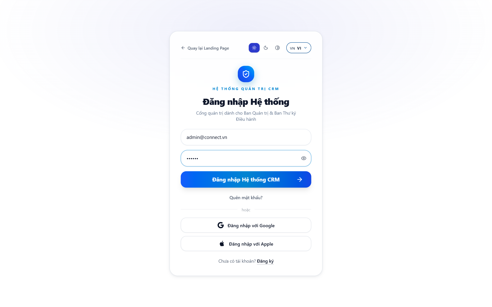
*Hình 2.1: Màn hình Đăng nhập Web CRM Quản trị an toàn chuẩn nhận diện Xanh Navy - Trắng sang trọng.*

---

## 📊 PHẦN 3: BẢNG ĐIỀU KHIỂN TỔNG QUAN (DASHBOARD) & THEO DÕI CHỈ SỐ KPI

Truy cập Trang chủ Tổng quan (`/`) để xem toàn cảnh sức khỏe hoạt động của CLB Doanh Nhân CEO 1983 theo thời gian thực:

1. **Thẻ KPI Hội Viên & Tăng Trưởng:**
   - **Tổng hội viên:** 31 doanh nghiệp và cá nhân lãnh đạo chính thức.
   - **Đang hoạt động:** 30 hội viên với tài khoản kích hoạt đầy đủ.
   - **Hội viên mới tháng này:** 31 hồ sơ (tăng trưởng thần tốc trong 30 ngày).
   - **Chờ gia hạn:** 1 hội viên sắp đến kỳ gia hạn thường niên.
2. **Thẻ KPI Sự Kiện & Giao Thương B2B:**
   - **Sự kiện sắp tới:** 12 chương trình giao lưu, diễn đàn và gala đang mở đăng ký.
   - **Cơ hội đang mở:** 14 thương vụ giao thương đang tìm kiếm đối tác hợp tác.
   - **Hóa đơn chưa thu:** 4 khoản đang chờ thanh toán đối soát.
3. **Biểu đồ Tăng Trưởng Hội Viên (6 tháng gần đây):**
   - Đồ thị phản ánh trực quan đà tăng trưởng mạnh mẽ của mạng lưới kết nối lãnh đạo.
4. **Bảng Theo Dõi Tình Hình Thu Phí & Dòng Tiền:**
   - **Đã thu thực tế:** 435.0 triệu đồng từ hội phí niên liễm và vé sự kiện.
   - **Tỷ lệ thu thành công:** 84% (21 hóa đơn đã thu, 4 hóa đơn chờ xử lý).
   - **Dòng sự kiện sắp tới & Hoạt động gần đây:** Giám sát nhật ký tạo sự kiện và tương tác trực tiếp của ban điều hành.

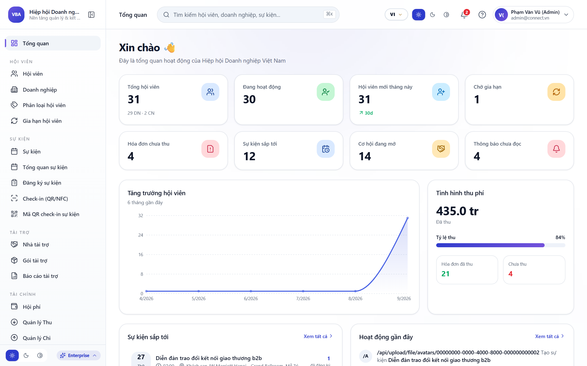
*Hình 3.1: Trung tâm chỉ huy Dashboard CRM Executive với các chỉ số KPI vận hành thực tế chuẩn sắc thái Trắng - Xanh.*

---

## 👥 PHẦN 4: QUẢN TRỊ HỘI VIÊN, XÉT DUYỆT HỒ SƠ 360° & CẤP TÀI KHOẢN QUA EMAIL

Truy cập menu bên trái: **"Hội viên"** (`/members`):

### 4.1. Bảng Dữ Liệu Hội Viên Đa Năng
Bảng dữ liệu trung tâm hiển thị danh sách hội viên rõ ràng với các trường thông tin:
- Ảnh đại diện Avatar, Họ và tên lãnh đạo, Chức vụ trong Ban Điều Hành.
- Tên pháp nhân công ty, Mã số thuế doanh nghiệp, Số điện thoại di động, Email liên hệ.
- Ban chuyên môn sinh hoạt (Ban XTTM, Ban Sự kiện, Ban Tài chính, Ban Truyền thông).
- Ngày nộp đơn đăng ký và Trạng thái hiện tại:
  * *Chờ phê duyệt* (màu vàng cảnh báo).
  * *Đang hoạt động* (màu xanh lá chuẩn).
  * *Tạm khóa* (màu đỏ).

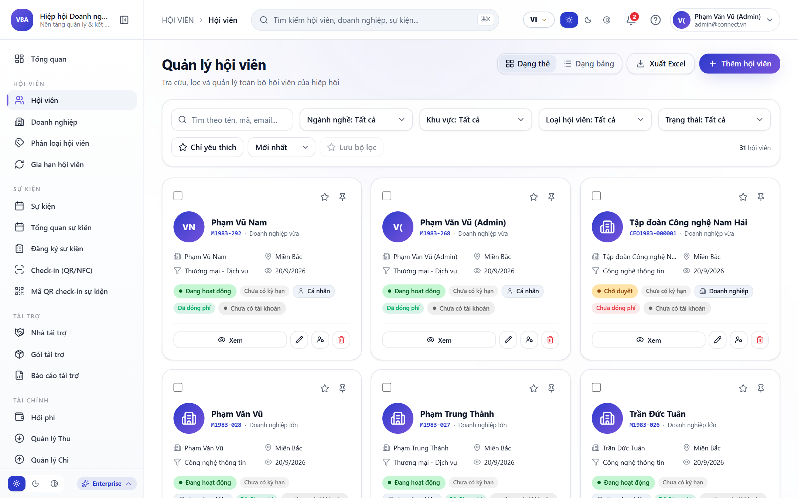
*Hình 4.1: Quản trị Danh sách Hội viên, Phân hạng & Bộ lọc Ban Chuyên môn.*

### 4.2. Bộ Lọc Thông Minh & Tìm Kiếm Theo Ban Ngành
- **Tìm kiếm đa từ khóa:** Tìm nhanh bằng cách gõ tên doanh nhân, tên công ty, số điện thoại hoặc mã số thuế.
- **Lọc theo trạng thái:** Lọc riêng các hồ sơ "Chờ phê duyệt" để xử lý hàng đợi kết nạp.
- **Lọc theo ban chuyên môn:** Lọc riêng danh sách hội viên thuộc từng ban để gửi thông báo sinh hoạt nội bộ.

### 4.3. Drawer Thẩm Định Hồ Sơ 360° & Tra Cứu Pháp Lý
- Nhấp chuột vào bất kỳ dòng hồ sơ nào trên bảng dữ liệu.
- Drawer thẩm định trượt ra từ cạnh phải màn hình hiển thị toàn diện hồ sơ năng lực 360°:
  * Tra cứu giấy phép đăng ký kinh doanh và kiểm tra tính hợp lệ của Mã số thuế.
  * Đối chiếu độ tuổi lãnh đạo (năm sinh 1983 - Quý Hợi) theo đúng điều lệ CLB.
  * Kiểm tra thông tin người giới thiệu trong Ban Chấp Hành.

### 4.4. Thao Tác Phê Duyệt (Approve) & Tự Động Gửi Email Mật Khẩu
1. Tại Drawer thẩm định, nhấp nút **"Phê duyệt (Approve)"** màu xanh.
2. Hộp thoại xác nhận hiện ra, chọn Ban chuyên môn phân bổ và bấm **"Xác nhận phê duyệt"**.
3. **Tiến trình tự động khép kín của hệ thống:**
   - Trạng thái hồ sơ chuyển sang "Hoạt động (Active)".
   - Sinh mã thẻ hội viên định danh độc bản (ví dụ: `CEO1983-000002`).
   - Cấp tài khoản đăng nhập và quyền truy cập ứng dụng Mobile App.
   - Tự động sinh mật khẩu bảo mật và **gửi một bức Email chào mừng chứa tài khoản và mật khẩu khởi tạo trực tiếp về hòm thư của doanh nhân**.

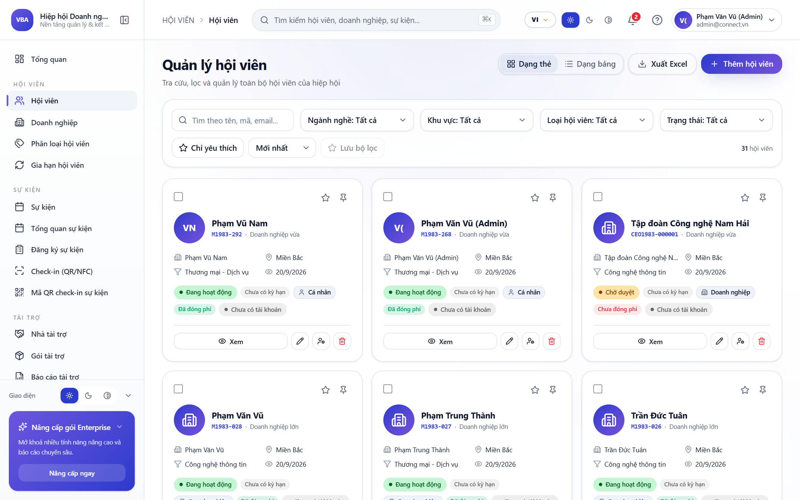
*Hình 4.2: Drawer Thẩm định Hồ sơ Chi tiết, Phân bổ Ban Chuyên môn & Phê duyệt Kết nạp.*

### 4.5. Thao Tác Từ Chối Hồ Sơ (Reject) Kèm Lý Do Hướng Dẫn
- Nếu hồ sơ chưa đủ điều kiện kết nạp (ví dụ: Thiếu mã số thuế hoặc không thuộc thế hệ 1983):
  1. Nhấp nút **"Từ chối (Reject)"**.
  2. Modal nhập lý do mở ra: Ban Thư Ký nhập lý do từ chối cụ thể và hướng dẫn bổ sung giấy tờ.
  3. Bấm **"Gửi phản hồi"**: Hệ thống tự động chuyển trạng thái hồ sơ và gửi email thông báo giải thích rõ ràng cho ứng viên.

### 4.6. Khóa / Mở Khóa Tài Khoản & Xuất File Danh Bạ Excel
- **Tạm khóa tài khoản:** Nhấp nút **"Tạm khóa"** khi hội viên vi phạm quy chế hoặc tạm dừng sinh hoạt. Khi bị khóa, tài khoản không thể đăng nhập vào Mobile App.
- **Xuất file Excel:** Nhấn nút **"Xuất Excel"** để tải toàn bộ danh bạ hội viên với đầy đủ thông tin pháp nhân phục vụ công tác in ấn kỷ yếu hiệp hội.

---

## 🎫 PHẦN 5: QUẢN TRỊ SỰ KIỆN, SƠ ĐỒ KHÁN PHÒNG & ĐIỀU PHỐI CỔNG SOÁT VÉ QR

Truy cập menu bên trái: **"Sự kiện"** (`/events`):

### 5.1. Khởi Tạo Sự Kiện Mới & Cấu Hình Hạn Mức Vé Đa Tầng
1. Nhấn nút **"Tạo sự kiện mới"** (`+`).
2. Nhập các thông tin cơ bản: Tên sự kiện, Thời gian bắt đầu/kết thúc, Địa điểm tổ chức, Banner sự kiện.
3. Cấu hình các hạng vé đa tầng:
   - *Vé Hội viên VIP:* Giá 0đ đặc quyền, giới hạn số lượng theo hội viên chính thức.
   - *Vé Khách mời / Đại biểu:* Thiết lập giá vé có phí, tự động liên kết cổng thanh toán VietQR.
   - *Vé Nhà tài trợ:* Dành cho các đơn vị đồng hành kim cương/vàng.
4. Thiết lập hạn chót đăng ký: Hệ thống tự động đóng cổng đăng ký khi hết hạn hoặc khi phát hành hết số lượng vé.

*Hình 5.1: Quản trị Tổ chức Sự kiện, Cấu hình Vé Đa Tầng & Giám sát Đại biểu.*

### 5.2. Sơ Đồ Khán Phòng Cinema Seating Map & Kéo Thả Xếp Chỗ Bàn VIP
1. Chọn sự kiện và chuyển sang tab **"Sơ đồ khán phòng (Cinema Map)"**.
2. Giao diện mô phỏng chân thực ma trận bàn tiệc và ghế ngồi:
   - Bàn VIP 1 & 2 (Đoàn Chủ Tịch & Khách Mời Danh Dự).
   - Bàn Đại biểu & Hội viên theo từng ban chuyên môn.
3. **Thao tác kéo thả xếp chỗ:**
   - Kéo tên đại biểu từ danh sách đã xác nhận vé thả vào vị trí ghế mong muốn.
   - Hệ thống tự động khóa vị trí ghế, ngăn ngừa trùng lặp chỗ ngồi 100%.
   - Vị trí số bàn và số ghế tự động được đồng bộ lên Vé Điện Tử trên điện thoại của hội viên.

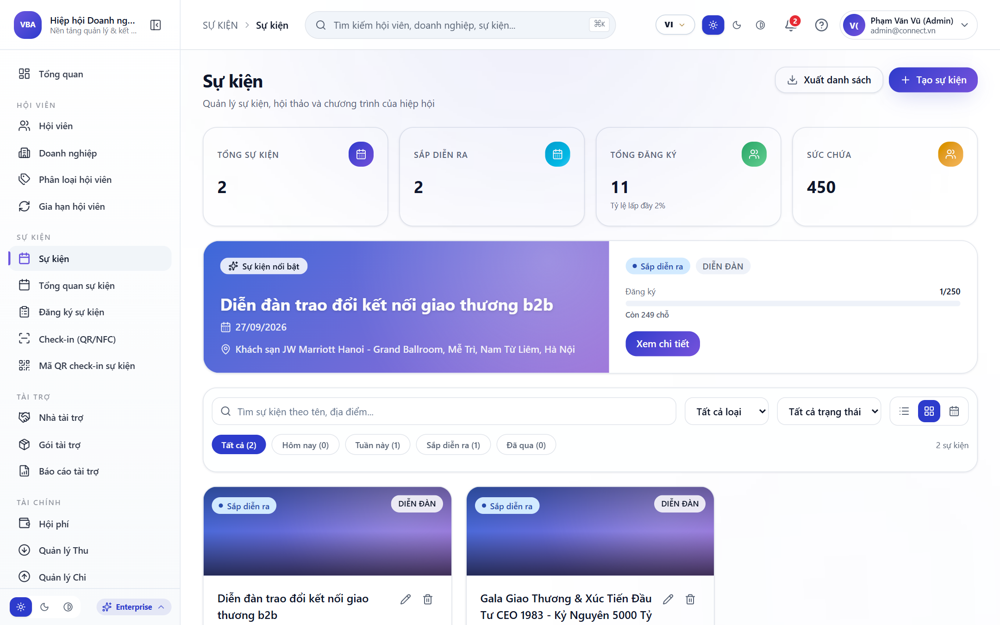
*Hình 5.2: Sơ đồ Bố trí Chỗ Ngồi Bàn VIP Gala Dinner & Xếp chỗ Đại biểu thời gian thực.*

### 5.3. Cổng Soát Vé Check-in QR Tốc Độ Cao 1 Giây & Xử Lý Sự Cố Cửa
Truy cập giao diện Soát vé (`/checkin`):
- **Tốc độ quét 1 giây/người:** Sử dụng máy quét laser chuyên dụng hoặc camera máy tính bảng quét mã QR trên vé điện tử của đại biểu.
- **Phản hồi tức thời:** Màn hình hiển thị ảnh chân dung, họ tên, công ty, vị trí số bàn VIP và phát âm thanh "Tít" xác nhận thành công.
- **Chống gian lận 100%:** Cảnh báo màu đỏ nổi bật và phát âm thanh cảnh báo nếu mã vé đã được quét trước đó hoặc vé không hợp lệ.
- **Xử lý sự cố quên điện thoại / hết pin:** 
  * Lễ tân sử dụng thanh tìm kiếm nhanh tại cổng, gõ Tên hoặc Số điện thoại của đại biểu.
  * Bấm nút **"Check-in Thủ Công"** sau khi đối chiếu giấy tờ tùy thân.
- **Chế độ quét ngoại tuyến (Offline Mode):** Khi mất kết nối Internet tại hội trường, hệ thống lưu tạm thời lịch sử quét vào bộ nhớ cục bộ và tự động đồng bộ lên CSDL ngay khi có mạng trở lại.

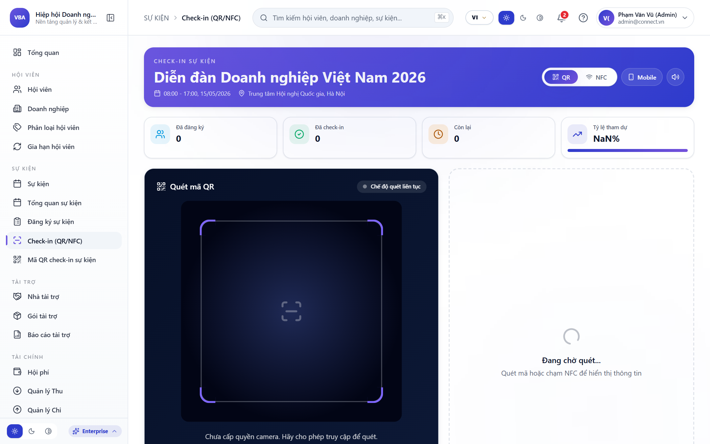
*Hình 5.3: Cổng Soát Vé Lễ Tân & Giám sát Check-in Mã QR Thời gian thực.*

---

## 🗳️ PHẦN 6: QUẢN TRỊ BẦU CỬ ĐẠI HỘI, BIỂU QUYẾT TÍN NHIỆM & VÒNG QUAY MAY MẮN (LUCKY DRAW)

Truy cập menu bên trái: **"Biểu quyết"** (`/voting`):

### 6.1. Thiết Lập Kỳ Biểu Quyết Tín Nhiệm & Giám Sát Bỏ Phiếu Thời Gian Thực
1. **Khởi tạo kỳ biểu quyết:**
   - Nhấn nút **"Tạo biểu quyết"** (`+`).
   - Nhập tiêu đề phiên biểu quyết (ví dụ: *Bầu cử Ban Chấp Hành nhiệm kỳ 2026 - 2030* hoặc *Biểu quyết sửa đổi Quy chế hội phí*).
   - Thiết lập thời gian mở và đóng hòm phiếu điện tử.
   - Thêm danh sách các lựa chọn / danh sách ứng cử viên tín nhiệm.
2. **Kênh đẩy thông báo đa nền tảng:**
   - Hệ thống tự động kích hoạt thông báo đẩy đồng thời lên: **Hiệp hội App di động**, **ViOne App** và **Web CRM Quản trị**.
3. **Giám sát kết quả kiểm phiếu trực quan:**
   - Bảng theo dõi hiển thị số lượng phiếu bầu đã phát ra, tỷ lệ tham gia (%) và số phiếu cho từng phương án.
   - Khi hết thời hạn bỏ phiếu, hệ thống tự động khóa sổ, công bố kết quả chung cuộc và gán nhãn *Phương án được chọn*.

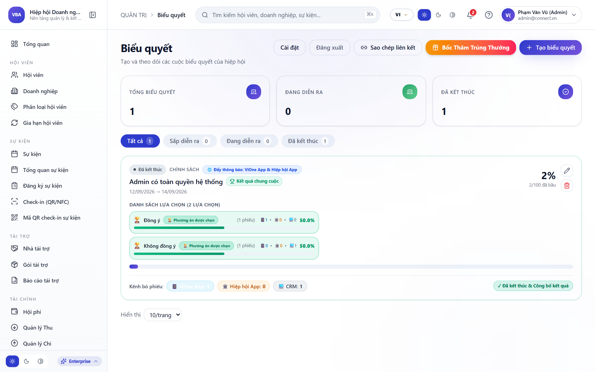
*Hình 6.1: Phân hệ Quản trị Bầu cử & Biểu quyết tín nhiệm đại biểu minh bạch đa kênh.*

### 6.2. Vận Hành Vòng Quay May Mắn (Lucky Draw) & Thông Báo Trúng Thưởng
Tại giao diện Biểu quyết, nhấn nút **"Bốc Thăm Trúng Thưởng"** để mở Trung tâm Điều phối Lucky Draw Gala:
1. **Cấu hình chương trình:**
   - **Sự kiện áp dụng:** Chọn sự kiện đang diễn ra (ví dụ: *Dạ Tiệc Gala Kết Nối Doanh Nhân CEO 1983* hoặc *Diễn đàn trao đổi kết nối giao thương B2B*).
   - **Hạng mục giải thưởng:** Chọn hạng mục trao thưởng tương ứng:
     * *🌟 Giải Đặc Biệt:* Xe VinFast VF3 / Apple VIP Bundle.
     * *🥇 Giải Nhất:* Bộ Thẻ Thành Viên Titanium & Gói Quảng Bá B2B 1 Năm.
     * *🥈 Giải Nhì:* Kỷ Niệm Chương Pha Lê & Quà Tặng Nhà Tài Trợ.
     * *🎁 Giải May Mắn:* Voucher Đào Tạo Quản Trị Doanh Nghiệp Cao Cấp.
2. **Quay số ngẫu nhiên minh bạch:**
   - Bấm nút **"QUAY SỐ NGẪU NHIÊN"**: Thuật toán ngẫu nhiên tự động chạy qua danh sách mã vé may mắn của toàn bộ đại biểu tham dự sự kiện.
   - Sau khi lồng quay dừng lại, hệ thống hiển thị nổi bật thông tin người trúng giải: **Họ và tên đại biểu**, **Tên doanh nghiệp**, **Mã vé may mắn** và **Vị trí Bàn VIP / Số ghế**.
3. **Phát lệnh thông báo trúng giải 1-chạm:**
   - Bấm nút **"Gửi thông báo trúng (App & Chat)"**: Hệ thống tự động gửi thông báo đẩy trực tiếp tới điện thoại của người trúng giải và phát tin mừng vào nhóm chat chung của CLB.
   - Bảng **Lịch sử trúng thưởng** phía dưới tự động lưu trữ danh sách người trúng giải theo từng khung giờ chính xác.

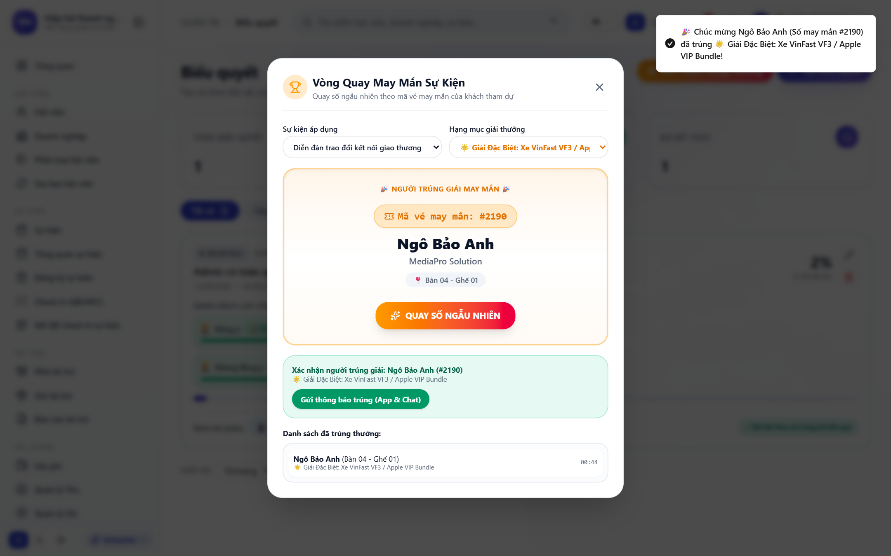
*Hình 6.2: Modal Vòng Quay May Mắn Lucky Draw: Cơ cấu giải thưởng VinFast VF3, quay số ngẫu nhiên theo mã vé & gửi thông báo trúng.*

---

## 🛍️ PHẦN 7: QUẢN TRỊ SÀN MARKETPLACE, KIỂM DUYỆT SẢN PHẨM & ĐẨY LÊN APP

Truy cập menu: **"Sàn Sản Phẩm"** (`/marketplace`):

### 7.1. Hàng Đợi Thẩm Định & Đánh Giá Tiêu Chuẩn Nguồn Gốc Xuất Xứ
- Khi hội viên đăng bán sản phẩm từ Mobile App, bài đăng tự động rơi vào hàng đợi thẩm định của CRM.
- Ban Quản Trị xem xét hình ảnh, giấy chứng nhận chất lượng, tiêu chuẩn nguồn gốc xuất xứ của hàng hóa.

### 7.2. Thẩm Định Chính Sách Chiết Khấu Ưu Đãi VIP Nội Bộ
- Đảm bảo sản phẩm có chính sách chiết khấu thực chất dành riêng cho cộng đồng doanh nhân CEO 1983 so với giá thị trường tự do.

### 7.3. Phê Duyệt Xuất Bản & Gán Nhãn Đã Xác Thực CLB CEO 1983
- Bấm nút **"Phê duyệt"**: Sản phẩm ngay lập tức xuất hiện trên Sàn Marketplace của toàn bộ hội viên trên App di động kèm huy hiệu **"Đã Kiểm Duyệt CLB CEO 1983"**.
- Bấm nút **"Gán nhãn Tiêu Biểu"**: Đưa sản phẩm lên vị trí ưu tiên hàng đầu tại trang chủ Marketplace.

### 7.4. Giám Sát & Điều Phối Các Yêu Cầu Báo Giá Sỉ B2B
- Theo dõi danh sách các yêu cầu báo giá sỉ phát sinh giữa các doanh nghiệp.
- Hỗ trợ kết nối xúc tiến thương mại nếu các bên có nhu cầu ký kết hợp đồng liên minh giá trị lớn.

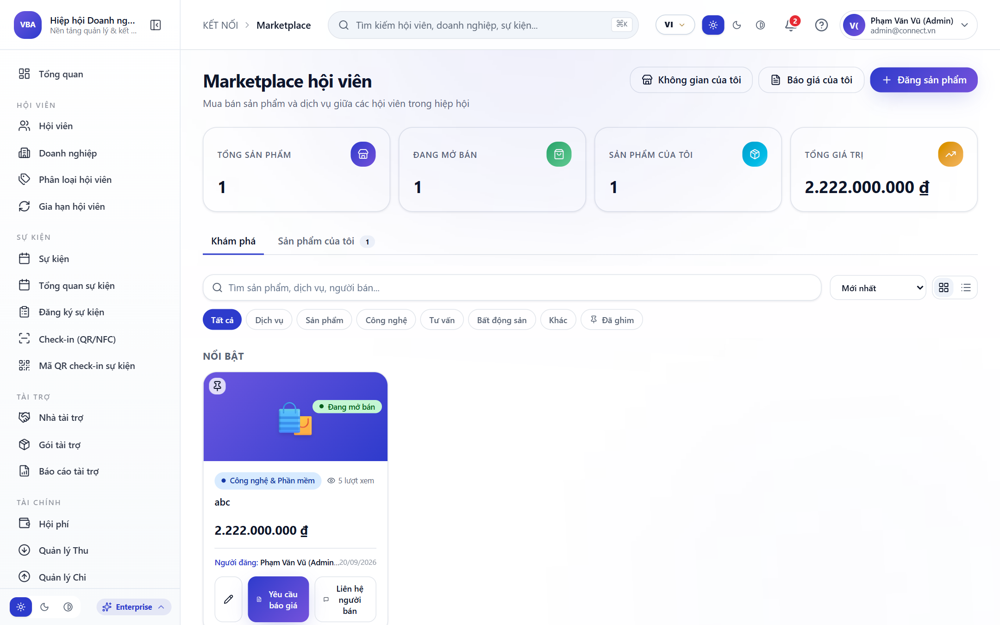
*Hình 7.1: Quản trị Sàn Marketplace, Kiểm duyệt Sản phẩm & Gán Nhãn Đạt Chuẩn CEO 1983.*

---

## 🤝 PHẦN 8: GIÁM SÁT CƠ HỘI GIAO THƯƠNG B2B & BÁO CÁO GIÁ TRỊ DEALS

Truy cập menu: **"Cơ Hội Giao Thương"** (`/opportunities`):

### 8.1. Tiếp Nhận & Phân Loại Nhu Cầu Hợp Tác Giao Thương
- Nắm bắt toàn diện các đề xuất mua hàng sỉ, tìm đại lý, hợp tác liên danh và kêu gọi vốn do hội viên đăng tải.
- Phân loại cơ hội theo từng cụm ngành để Ban Xúc Tiến Thương Mại điều phối phù hợp.

### 8.2. Theo Dõi Trạng Thái Kết Nối & Đón Nhận (Claimed Deals)
- Giám sát tiến độ từng cơ hội: Biết chính xác doanh nhân nào đã bấm "Đón nhận cơ hội" và tiến độ đàm phán hợp đồng giữa các bên.
- Cập nhật trạng thái: *Đang đàm phán $\rightarrow$ Đã ký hợp đồng $\rightarrow$ Hoàn tất giao dịch.*

### 8.3. Thống Kê Tổng Quy Mô Kinh Tế Giao Thương Của Hiệp Hội
- Tự động cộng dồn giá trị kinh tế của các Deal đã chốt thành công.
- Xuất báo cáo tổng kết giá trị giao thương nội khối (hàng chục đến hàng trăm tỷ đồng) phục vụ kỳ họp Ban Chấp Hành và Đại hội thường niên.

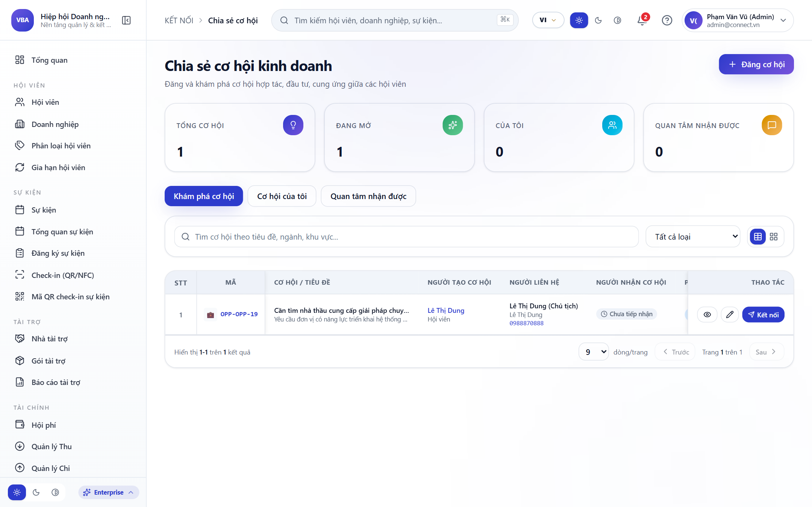
*Hình 8.1: Thẩm định & Điều phối Cơ hội Giao thương B2B, Thống kê Giá trị Deals CLB.*

---

## 🏢 PHẦN 9: QUẢN TRỊ PHÁP NHÂN THÀNH VIÊN & BẢN ĐỒ CHUỖI CUNG ỨNG CLB

Truy cập menu: **"Doanh Nghiệp"** (`/companies`):

### 9.1. Danh Mục Hồ Sơ Doanh Nghiệp & Tra Cứu Mã Số Thuế
- Lưu trữ trọn vẹn thông tin pháp nhân: Tên đầy đủ công ty, Mã số thuế, Giấy phép kinh doanh, Địa chỉ trụ sở, Đại diện pháp luật.
- Tải lên hồ sơ năng lực và chứng nhận thành tích doanh nghiệp.

### 9.2. Bản Đồ Chuỗi Cung Ứng & Liên Kết Tiêu Dùng Chéo
- Phân loại doanh nghiệp theo cụm ngành giá trị: *Sản xuất công nghiệp, Xây dựng hoàn thiện, Công nghệ thông tin, Dịch vụ tài chính, F&B.*
- Thúc đẩy chính sách ưu tiên sử dụng sản phẩm chéo của nhau trong cộng đồng CEO 1983.

### 9.3. Liên Kết Đa Tài Khoản Lãnh Đạo Với Doanh Nghiệp
- Cho phép một doanh nghiệp pháp nhân liên kết nhiều tài khoản lãnh đạo (ví dụ: Chủ tịch HĐQT và Tổng Giám Đốc) cùng sinh hoạt với quyền hạn rõ ràng.

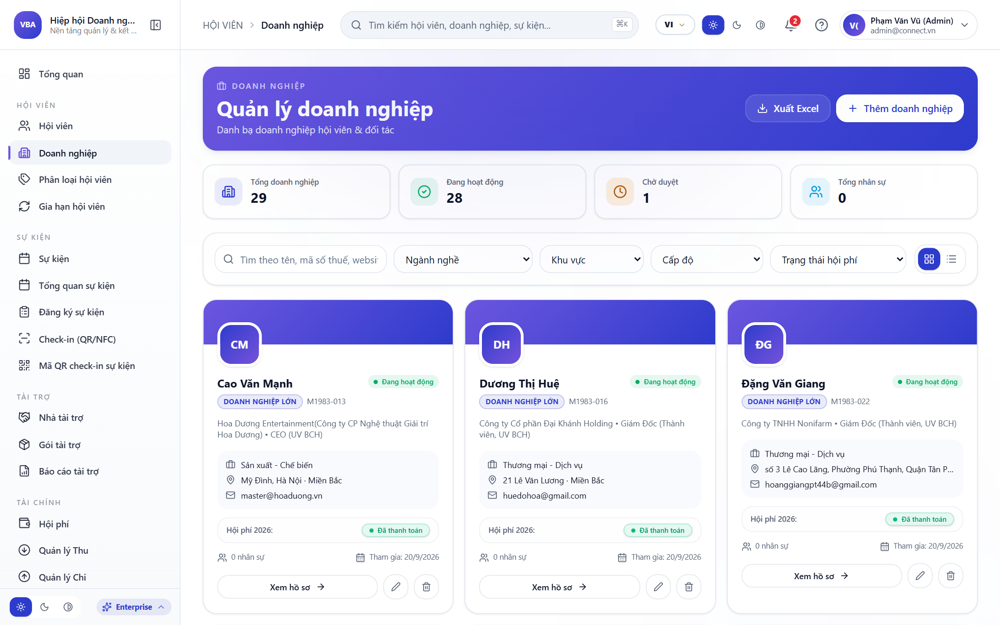
*Hình 9.1: Danh bạ Doanh nghiệp Pháp nhân, Mã số thuế & Bản đồ Chuỗi Cung ứng CLB.*

---

## 💳 PHẦN 10: QUẢN LÝ SỔ QUỸ TÀI CHÍNH, ĐỐI SOÁT VIETQR & NIÊN LIỄM

Truy cập menu: **"Hội Phí & Sổ Quỹ"** (`/fees`):

### 10.1. Bảng Theo Dõi Niên Liễm Theo Từng Năm Tài Chính
- Danh sách hội viên theo dõi theo năm tài chính (ví dụ: Niên liễm năm 2026).
- Trạng thái trực quan: *Đã thanh toán* (xanh lá), *Chưa nộp* (đỏ), *Miễn giảm* (xám).

### 10.2. Cơ Chế Đối Soát Giao Dịch VietQR Tự Động & Gạch Nợ Tức Thời
- Khi hội viên quét mã chuyển khoản trên Mobile App, hệ thống ngân hàng trả tín hiệu báo có kèm mã định danh hội viên.
- Hệ thống CRM tự động nhận diện, gạch nợ hội phí, gia hạn thẻ VIP trên App và gửi hóa đơn/biên lai điện tử về email hội viên trong vòng **3-5 giây**.

### 10.3. Lập Phiếu Thu / Phiếu Chi & Quản Lý Sổ Quỹ Thu Chi Kế Toán
- **Tạo phiếu thu:** Ghi nhận các nguồn thu ngoài hội phí như: Tiền bán vé sự kiện, Tiền tài trợ Caravan, Tiền đóng góp thiện nguyện.
- **Tạo phiếu chi:** Ghi nhận các khoản chi hoạt động: Chi phí thuê địa điểm hội thảo, Chi in ấn kỷ yếu, Chi quà tặng tri ân.

### 10.4. Xuất Báo Cáo Tài Chính Chuẩn Phục Vụ Ban Kiểm Soát
- Xuất file Excel báo cáo quyết toán thu chi chi tiết có phân loại theo danh mục.
- Đảm bảo tính minh bạch tài chính 100% phục vụ công tác kiểm tra của Ban Kiểm Soát CLB.

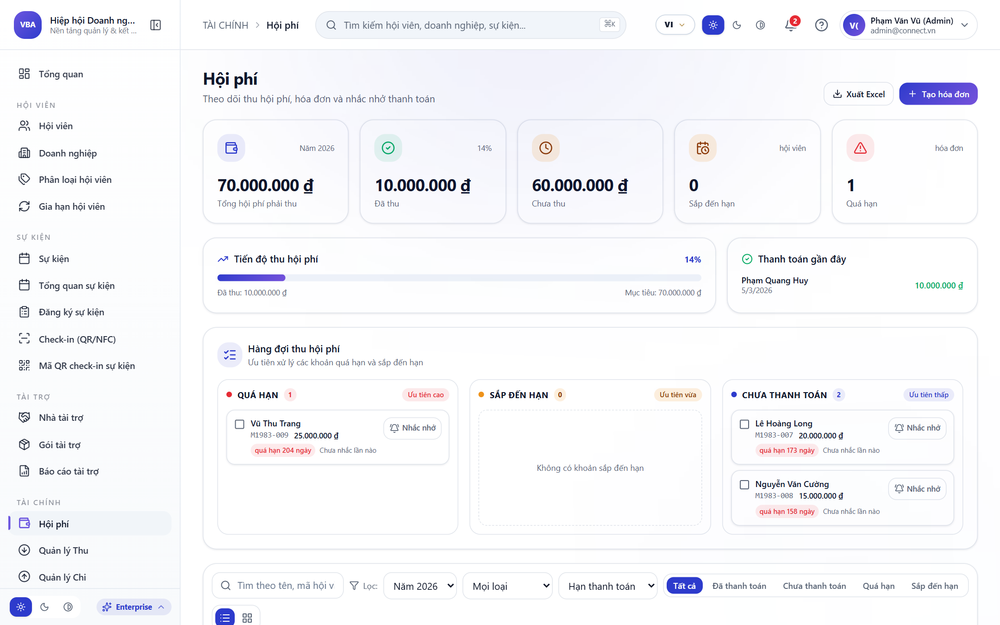
*Hình 10.1: Quản trị Thu Hội Phí Thường Niên, Đối soát VietQR & Sổ Quỹ Kế Toán.*

---

## 🔒 PHẦN 11: PHÂN QUYỀN RBAC, NHẬT KÝ KIỂM TOÁN (AUDIT LOGS) & BẢO MẬT

Truy cập menu: **"Cấu hình & Phân quyền"** (`/platform/permissions`):

### 11.1. Ma Trận Phân Quyền Vai Trò Chi Tiết (RBAC)
- Super Admin thiết lập quyền hạn chi tiết cho từng tài khoản quản trị viên:
  * *Quyền Xem (Read)*
  * *Quyền Thêm Mới (Create)*
  * *Quyền Chỉnh Sửa (Update)*
  * *Quyền Xóa (Delete)*
  * *Quyền Phê Duyệt (Approve)*

### 11.2. Nhật Ký Kiểm Toán An Ninh Bất Biến (Audit Trail)
- Hệ thống tự động ghi nhận nhật ký mọi thao tác vận hành quan trọng:
  * Ai đã đăng nhập vào hệ thống?
  * Ai đã bấm phê duyệt hội viên hoặc thay đổi chức vụ?
  * Ai đã điều chỉnh số liệu sổ quỹ hoặc gạch nợ hội phí?
  * Ai đã xuất file danh bạ Excel ra ngoài máy tính?
- Mọi bản ghi đều lưu trữ kèm Địa chỉ IP thực tế và Dấu thời gian chính xác tới từng giây, không thể bị chỉnh sửa hay xóa bỏ.

### 11.3. Hạ Tầng Bảo Mật SSL/HTTPS & Lịch Sao Lưu CSDL Tự Động
- Toàn bộ dữ liệu truyền tải giữa Web CRM, App Mobile và CSDL đều được mã hóa bằng chứng chỉ bảo mật SSL/HTTPS.
- Cơ chế tự động sao lưu dữ liệu (Automated Daily Backup) định kỳ mỗi ngày bảo đảm khả năng phục hồi nguyên vẹn hệ thống trong mọi tình huống.

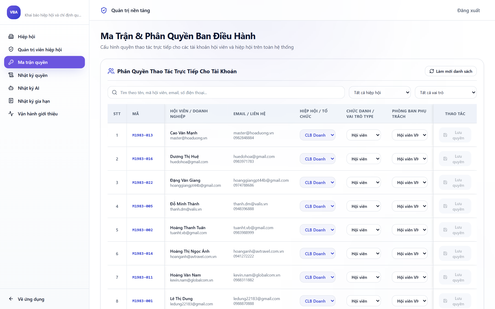
*Hình 11.1: Cấu hình Phân quyền Vai trò Quản trị (RBAC) & Nhật ký Kiểm toán An ninh.*

---

*Tài liệu hướng dẫn vận hành hệ thống Web CRM Quản trị CLB Doanh Nhân CEO 1983.*
