# TÀI LIỆU HƯỚNG DẪN SỬ DỤNG VẬN HÀNH HỆ THỐNG
## HỆ THỐNG QUẢN TRỊ HIỆP HỘI CLB DOANH NHÂN CEO 1983 (WEB CRM CEO 1983)
*Đặc tả Chi tiết Từng Chức Năng, Thao Tác Nghiệp Vụ & Ảnh Chụp Minh Họa Thực Tế Từ Máy Chủ Dev*

---

- **Tên Hệ Thống**: **Web CRM Quản Trị Hiệp Hội CLB Doanh Nhân CEO 1983**
- **Mã Tài Liệu**: **HDSD-CRM-CEO1983-V4.0**
- **Phiên Bản**: **Version 4.0 — Master Production User Manual (Bàn Giao Vận Hành)**
- **Địa Chỉ Server Dev**: `https://14.225.217.232:5443`
- **Đối Tượng Áp Dụng**: Ban Quản trị, Ban Thư ký, Ban Thành viên, Ban Xúc tiến thương mại, Ban Truyền thông, Ban Thiện nguyện
- **Ngày Ban Hành**: **01/10/2026**
- **Người Thực Hiện / Phụ Trách**: **Phạm Văn Vũ & ViOne Architecture Board**

---

> [!IMPORTANT]
> **THÔNG TIN MÔI TRƯỜNG & TÀI KHOẢN TRUY CẬP SERVER DEV**
> - **Đường dẫn truy cập CRM**: `https://14.225.217.232:5443`
> - **Cổng đăng nhập an toàn**: `https://14.225.217.232:5443/auth`
> - **Tài khoản quản trị mặc định**: `admin@connect.vn` | Mật khẩu: `123456`
> - **Cơ chế phân quyền**: Chuẩn hóa 5 vai trò hệ thống: **Quản trị (quyền cao nhất)**, **Admin**, **Tổng thư ký**, **Trưởng ban**, **Thành viên**. Phân bổ theo 6 Ban chuyên môn: Ban quản trị, Ban thư ký, Ban thành viên, Ban xúc tiến thương mại, Ban truyền thông, Ban thiện nguyện.

---

## 📌 MỤC LỤC TÀI LIỆU

1. [TỔNG QUAN HỆ THỐNG & ĐỊA CHỈ TRUY CẬP](#1-tổng-quan-hệ-thống--địa-chỉ-truy-cập)
2. [HƯỚNG DẪN ĐĂNG NHẬP & BẢO MẬT TÀI KHOẢN](#2-hướng-dẫn-đăng-nhập--bảo-mật-tài-khoản)
3. [BẢNG ĐIỀU KHIỂN TỔNG QUAN (EXECUTIVE DASHBOARD KPI)](#3-bảng-điều-khiển-tổng-quan-executive-dashboard-kpi)
4. [QUẢN TRỊ HỒ SƠ HỘI VIÊN & DOANH NGHIỆP THÀNH VIÊN](#4-quản-trị-hồ-sơ-hội-viên--doanh-nghiệp-thành-viên)
5. [QUẢN TRỊ SỰ KIỆN, HỘI THẢO & ĐIỂM DANH QR CODE TỐC ĐỘ CAO](#5-quản-trị-sự-kiện-hội-thảo--điểm-danh-qr-code-tốc-độ-cao)
6. [ĐIỀU PHỐI CUỘC HỌP 6 BAN & BIỂU QUYẾT TRỰC TUYẾN](#6-điều-phối-cuộc-họp-6-ban--biểu-quyết-trực-tuyến)
7. [QUẢN TRỊ TÀI CHÍNH, HỘI PHÍ & BÁO CÁO MINH BẠCH](#7-quản-trị-tài-chính-hội-phí--báo-cáo-minh-bạch)
8. [QUẢN LÝ NHÀ TÀI TRỢ, GÓI TÀI TRỢ & ĐẶC QUYỀN HỘI VIÊN](#8-quản-lý-nhà-tài-trợ-gói-tài-trợ--đặc-quyền-hội-viên)
9. [SÀN GIAO THƯƠNG B2B MARKETPLACE & KIỂM DUYỆT SẢN PHẨM](#9-sàn-giao-thương-b2b-marketplace--kiểm-duyệt-sản-phẩm)
10. [TRUYỀN THÔNG, BẢN TIN HIỆP HỘI & EMAIL MARKETING TẬP TRUNG](#10-truyền-thông-bản-tin-hiệp-hội--email-marketing-tập-trung)
11. [MA TRẬN PHÂN QUYỀN RBAC 5 ROLE & GIAO VIỆC TỰ ĐỘNG THÔNG BÁO](#11-ma-trận-phân-quyền-rbac-5-role--giao-việc-tự-động-thông-báo)
12. [QUY TRÌNH ĐỐI SOÁT THỦ CÔNG & XỬ LÝ SỰ CỐ (TROUBLESHOOTING)](#12-quy-trình-đối-soát-thủ-công--xử-lý-sự-cố-troubleshooting)

---

# 1. TỔNG QUAN HỆ THỐNG & ĐỊA CHỈ TRUY CẬP

### 1.1. Sứ mệnh Nền tảng
Hệ thống Web CRM Quản trị Hiệp hội CLB Doanh Nhân CEO 1983 là cổng điều hành trực tuyến tập trung, giúp Ban Chấp Hành, Ban Thư Ký và Kế Toán quản lý minh bạch toàn bộ vòng đời hội viên: từ tiếp nhận đăng ký trực tuyến, thẩm định kết nạp, thu hội phí thường niên, tổ chức sự kiện quy mô lớn, kết nối giao thương B2B đến phân quyền vận hành 6 Ban chuyên môn.

### 1.2. Thông số Kỹ thuật & Địa chỉ Truy cập
| Thông số Kỹ thuật | Giá trị Thực tế Máy chủ Dev | Ghi chú Vận hành |
|:---|:---|:---|
| **Cổng Web CRM Quản trị** | `https://14.225.217.232:5443` | Sử dụng giao thức HTTPS bảo mật |
| **Màn hình Đăng nhập riêng** | `https://14.225.217.232:5443/auth` | Card đăng nhập Admin độc lập |
| **Backend API NestJS** | `https://14.225.217.232:5443/api` | Kết nối CSDL PostgreSQL qua PgBouncer 6432 |
| **Công nghệ Frontend** | React 19, TanStack Router, TailwindCSS 4 | Giao diện Xanh Navy (#003B95) và Amber Gold (#D97706) |
| **Tài khoản Quản trị tối cao** | `admin@connect.vn` | Vai trò: **Quản trị (Cấp cao nhất)** |

---

# 2. HƯỚNG DẪN ĐĂNG NHẬP & BẢO MẬT TÀI KHOẢN

### 2.1. Truy cập Màn hình Đăng nhập
1. Mở trình duyệt Web (Google Chrome, Microsoft Edge hoặc Safari khuyến nghị).
2. Nhập liên kết: `https://14.225.217.232:5443/auth`.
3. Nếu trình duyệt hiện thông báo bảo mật (chứng chỉ SSL tự cấp phát trên server dev), bấm chọn **"Nâng cao" (Advanced)** ➔ Chọn **"Tiếp tục truy cập 14.225.217.232 (không an toàn)"**.
4. Màn hình đăng nhập quản trị Xanh Navy - Trắng sang trọng sẽ xuất hiện.

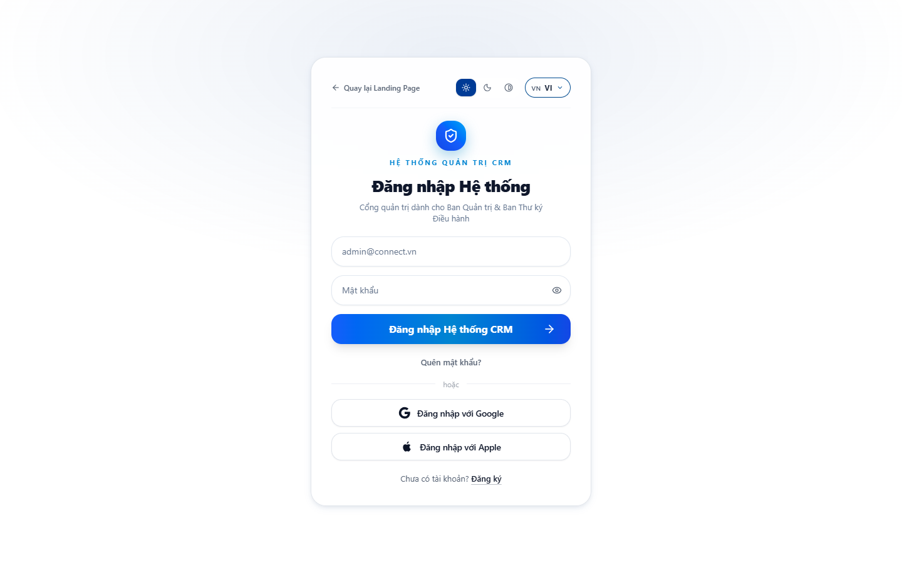
*Hình 2.1: Giao diện Đăng nhập Hệ thống Quản trị Web CRM CEO 1983 chuẩn Classic Navy & Gold*

### 2.2. Các bước Thực hiện Thao tác Đăng nhập
- **Bước 1**: Nhập địa chỉ Email hoặc Mã tài khoản quản trị vào ô **Email / Tên đăng nhập** (Ví dụ: `admin@connect.vn`).
- **Bước 2**: Nhập mật khẩu quản trị vào ô **Mật khẩu** (Ví dụ: `123456`). Có thể bấm icon con mắt bên phải để kiểm tra mật khẩu đã nhập.
- **Bước 3**: Tích chọn **"Ghi nhớ đăng nhập"** nếu sử dụng máy tính cá nhân.
- **Bước 4**: Bấm nút **"Đăng nhập Hệ thống"**. Hệ thống kiểm tra JWT Session Token và tự động chuyển hướng vào Trang chủ Dashboard.

---

# 3. BẢNG ĐIỀU KHIỂN TỔNG QUAN (EXECUTIVE DASHBOARD KPI)

Sau khi đăng nhập thành công, hệ thống chuyển thẳng đến Bảng điều khiển Tổng quan tại tuyến đường `/` hoặc `/dashboard`.

*Hình 3.1: Bảng điều khiển Tổng quan Dashboard KPI CRM hiển thị các chỉ số tài chính, hội viên và sự kiện*

### 3.1. Các Khối Chỉ số KPI Chiến lược (Top Metrics)
1. **Tổng số Hội viên Chính thức**: Số lượng doanh nhân 1983 đã kích hoạt tài khoản và đang hoạt động.
2. **Hội viên Mới Tiếp nhận**: Các hồ sơ gửi từ form đăng ký trực tuyến chờ Ban Thư ký thẩm định.
3. **Tổng Doanh thu & Quỹ Hiệp hội**: Tổng thu từ Hội phí, Tài trợ và Vé sự kiện đã đối soát gạch nợ.
4. **Sự kiện Sắp diễn ra**: Lịch họp Ban Chấp Hành, Gala xúc tiến thương mại và Hội thảo chuyên đề.

### 3.2. Biểu đồ Tăng trưởng & Dòng tiền Minh bạch
- **Biểu đồ Cột Doanh thu theo Tháng**: So sánh chỉ số Thu - Chi thực tế và thặng dư quỹ hiệp hội.
- **Biểu đồ Cơ cấu Hội viên theo 6 Ban chuyên môn**: Thống kê tỷ lệ phân bổ nhân sự vào Ban Quản trị, Thư ký, Thành viên, Xúc tiến thương mại, Truyền thông, Thiện nguyện.
- **Dòng Hoạt động Thời gian thực (Activity Log)**: Ghi nhận từng giao dịch thu phí, check-in sự kiện và thao tác phê duyệt của Quản trị viên.

---

# 4. QUẢN TRỊ HỒ SƠ HỘI VIÊN & DOANH NGHIỆP THÀNH VIÊN

Tuyến đường chức năng: `/members` và `/companies`.

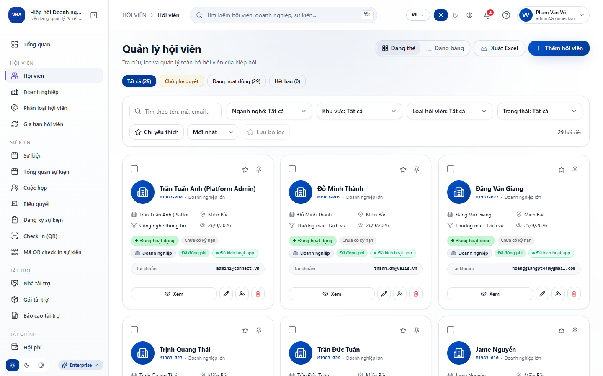
*Hình 4.1: Giao diện Quản lý Danh bạ Hội viên CLB CEO 1983 với bộ lọc phân loại và trạng thái*

### 4.1. Quy trình 4 Bước Thẩm định & Kết nạp Hội viên Mới
1. **Bước 1 - Tiếp nhận hồ sơ**: Khi doanh nhân gửi thông tin từ Landing Page, hệ thống tự động lưu vào danh sách với trạng thái **"Chờ duyệt" (Pending)**.
2. **Bước 2 - Xem xét hồ sơ 360°**: Quản trị viên bấm nút **"Xem chi tiết"** trên dòng hội viên để mở Drawer thông tin đa chiều.

*Hình 4.2: Drawer chi tiết hồ sơ hội viên 360° hiển thị đầy đủ thông tin cá nhân, doanh nghiệp và chức danh*

3. **Bước 3 - Phê duyệt kết nạp**:
   - Quản trị viên kiểm tra tính xác thực về năm sinh (1983), giấy phép kinh doanh và chức danh C-Level.
   - Bấm nút **"Phê duyệt Hội viên"**. Hệ thống tự động gán mã hội viên tuần tự (`M1983-001`, `M1983-002`,...), cập nhật trạng thái **"Đang hoạt động" (Active)** và kích hoạt quyền truy cập App Di Động.
4. **Bước 4 - Phân ban & Cấp thẻ**: Gán hội viên vào 1 trong 6 Ban chuyên môn và phát hành Thẻ Hội viên VIP 3D.

### 4.2. Quản lý Doanh nghiệp Thành viên (`/companies`)
Hệ thống cung cấp danh bạ pháp nhân doanh nghiệp thuộc sở hữu của các hội viên:
- Tìm kiếm nhanh theo Mã số thuế, Tên công ty, Ngành nghề kinh doanh.
- Quản trị quy mô nhân sự, vốn điều lệ, địa chỉ trụ sở và năng lực cung ứng sản phẩm.
- Liên kết 1-nhiều giữa Hội viên và các Công ty trực thuộc.

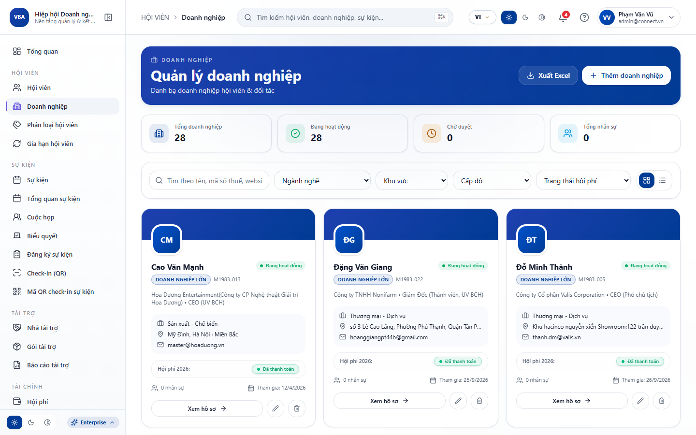
*Hình 4.3: Quản lý Doanh nghiệp Thành viên CLB Doanh Nhân CEO 1983*

---

# 5. QUẢN TRỊ SỰ KIỆN, HỘI THẢO & ĐIỂM DANH QR CODE TỐC ĐỘ CAO

Tuyến đường chức năng: `/events`, `/event-registrations`, `/checkin-qr`.

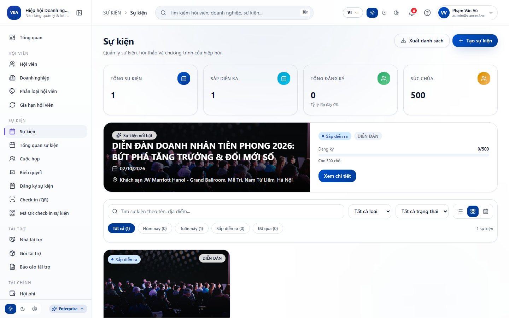
*Hình 5.1: Danh sách Quản lý Sự kiện & Hội thảo Hiệp hội*

### 5.1. Quy trình Tạo Sự kiện Mới (Event Wizard)
1. Truy cập `/events` ➔ Bấm nút **"+ Tạo sự kiện mới"**.
2. Modal Wizard 3 bước thông minh xuất hiện:
   - **Bước 1 - Thông tin cơ bản**: Nhập Tên sự kiện, Thời gian bắt đầu/kết thúc, Địa điểm tổ chức (Khách sạn / Trung tâm hội nghị / Trực tuyến), Tải lên Banner ảnh bìa sắc nét.
   - **Bước 2 - Phân loại Vé & Giá vé**:
     + Cấu hình loại vé: **Vé Hội viên thường (Miễn phí)**, **Vé VIP**, **Vé Khách mời Doanh nghiệp**.
     + Ô nhập Giá vé tích hợp bộ tự động định dạng phân cách hàng nghìn `FormattedCurrencyInput` (Ví dụ gõ `1000000` tự động hiển thị `1.000.000 đ` mà không nhảy con trỏ chuột).
     + Giới hạn số lượng vé phát hành.
   - **Bước 3 - Cấu hình Quyền lợi & Nhà tài trợ**: Đính kèm danh sách tài trợ Kim Cương, Vàng, Bạc hiển thị trên vé.
3. Bấm **"Xuất bản Sự kiện"**. Sự kiện lập tức hiển thị đồng bộ lên App Hiệp hội của toàn thể hội viên.

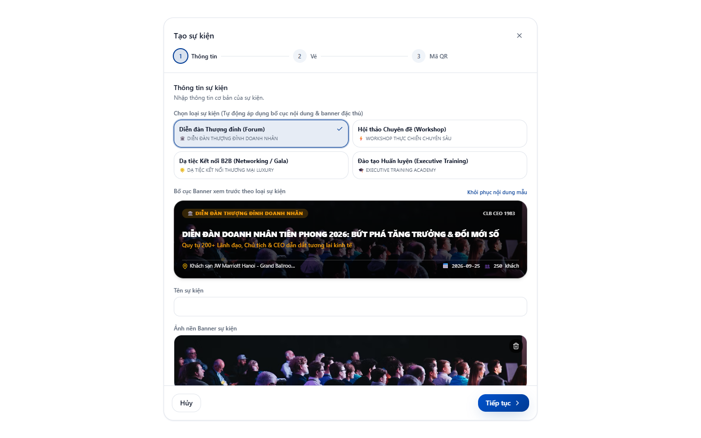
*Hình 5.2: Modal Tạo Sự kiện mới với phân loại vé và giá vé định dạng chuẩn*

### 5.2. Màn hình Standee QR Check-in Điểm danh Tốc độ cao (`/checkin-qr`)
- Hệ thống tự sinh mã QR sự kiện chất lượng cao dành riêng cho Lễ tân đón tiếp.
- Khách mới quét mã QR bằng camera điện thoại/Zalo để mở trang đăng ký nhanh:
  + Nếu sự kiện **Có phí**: Tự động hiển thị Template VietQR Napas MB Bank `1983000000` kèm cú pháp `EV[MÃ_VÉ] [SĐT]`.
  + Nếu sự kiện **Miễn phí**: Nhận ngay Vé điện tử E-Ticket và mã QR điểm danh cùng số Lucky Draw.
- Ban Lễ tân sử dụng máy quét hoặc App di động quét mã vé của người tham dự; hệ thống gạch điểm danh dưới 0.5 giây và cập nhật sĩ số trực tiếp lên màn hình lớn.

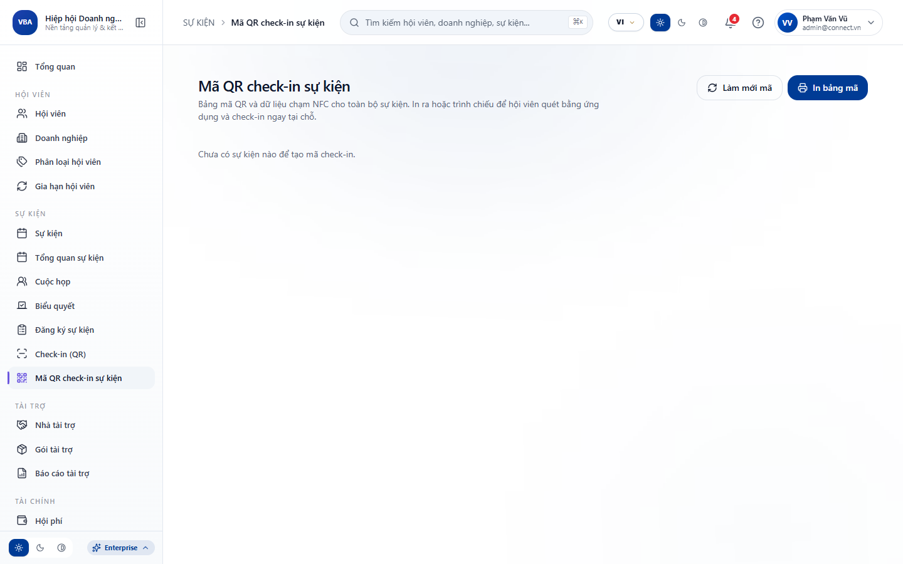
*Hình 5.3: Màn hình Standee QR Check-in Điểm danh và Đón tiếp Đại biểu*

---

# 6. ĐIỀU PHỐI CUỘC HỌP 6 BAN & BIỂU QUYẾT TRỰC TUYẾN

Tuyến đường chức năng: `/meetings` và `/voting`.

### 6.1. Quản lý Lịch họp & Đặt phòng họp Đa nền tảng (`/meetings`)
- **Phân quyền tạo cuộc họp**: Chỉ đúng 4 vai trò có quyền tạo lịch họp: **Quản trị**, **Admin**, **Tổng thư ký**, **Trưởng ban**.
- **Quy trình Quản trị phê duyệt**: Khi Tổng thư ký hoặc Trưởng ban tạo cuộc họp, trạng thái khởi tạo là **"Chờ Quản trị duyệt" (pending_approval)**. Quản trị viên bấm nút **"Duyệt Cuộc Họp"** để kích hoạt thông báo gửi tới các đại biểu.
- **Hình thức phòng họp**: Tích hợp Dropdown đa nền tảng linh hoạt: Zoom Meeting, Google Meet, UniWork Hub, Sapphire Hall, hoặc Địa điểm Offline khác.

*Hình 6.1: Quản lý Lịch họp Điều phối Ban Chấp Hành & 6 Ban Chuyên Môn*

### 6.2. Quản lý Biểu quyết & Bầu cử Đại hội Trực tuyến (`/voting`)
- Tạo kỳ biểu quyết thông qua Nghị quyết Hiệp hội hoặc Bầu cử Ban Chấp Hành nhiệm kỳ mới.
- Thiết lập thời hạn mở/đóng hòm phiếu điện tử.
- Bỏ phiếu kín mã hóa một chiều: Mỗi hội viên chỉ được biểu quyết 1 lần duy nhất; kết quả thống kê theo thời gian thực với biểu đồ % đồng thuận minh bạch.

*Hình 6.2: Quản lý Biểu quyết & Bầu cử Đại hội Trực tuyến*

---

# 7. QUẢN TRỊ TÀI CHÍNH, HỘI PHÍ & BÁO CÁO MINH BẠCH

Tuyến đường chức năng: `/fees`, `/income`, `/expenses`, `/finance-report`.

### 7.1. Quản lý Hội phí Thường niên (`/fees`)
- Theo dõi danh sách hội viên theo kỳ hạn đóng phí: **Đã nộp**, **Chờ thanh toán**, **Quá hạn**.
- Khi hội viên quét mã VietQR trên App chuyển khoản vào tài khoản MB Bank `1983000000`, Kế toán đối soát sao kê ngân hàng và bấm nút **"Xác nhận Thu Phí (+1 Năm)"**; hệ thống tự động cộng 365 ngày vào hạn sử dụng thẻ hội viên và gửi thông báo chúc mừng.

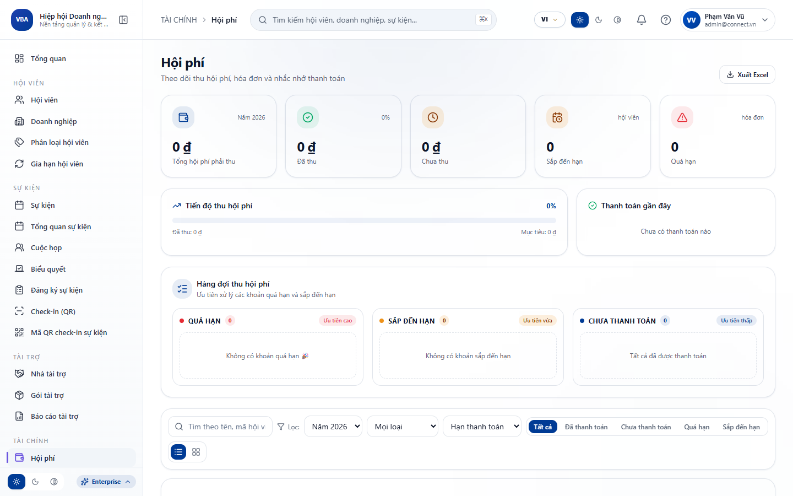
*Hình 7.1: Quản lý Hội phí Thường niên & Đối soát Gạch nợ*

### 7.2. Quản lý Danh mục Thu & Xuất Hóa đơn (`/income`)
- Ghi nhận tất cả các nguồn thu vào ngân sách hiệp hội: Thu hội phí, Thu tài trợ sự kiện, Thu bán vé hội thảo, Thu phí quảng cáo B2B.
- Tự động sinh mã phiếu thu (`PT-2026-xxxx`) và lưu vết người lập phiếu.

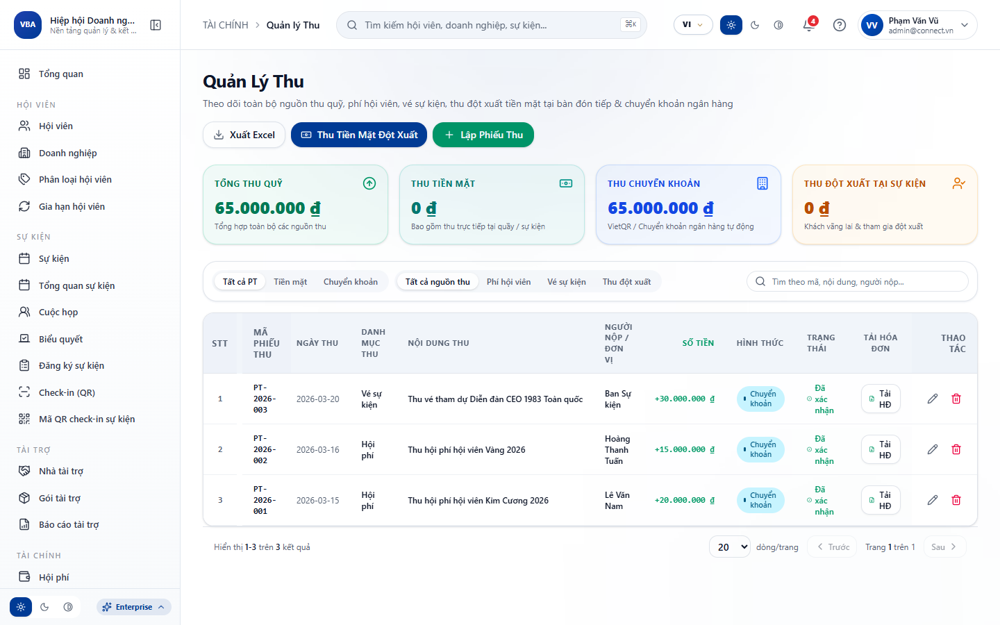
*Hình 7.2: Quản lý Danh mục Thu Tài chính & Phiếu thu*

### 7.3. Quản lý Chi Ngân sách & Hóa đơn Chứng từ (`/expenses`)
- Quản trị ngân sách chi tiêu cho các hoạt động: Tổ chức Gala, Thuê địa điểm, Quà tặng đại hội, Hoạt động thiện nguyện, Công tác truyền thông.
- Kèm tệp đính kèm hóa đơn VAT, phiếu chi và chữ ký duyệt của Trưởng ban Tài chính / Quản trị viên.

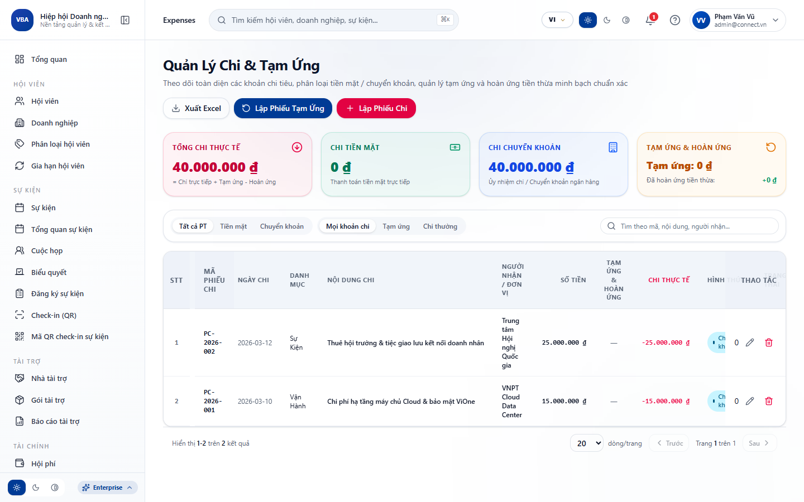
*Hình 7.3: Quản lý Chi Ngân sách Hoạt động & Duyệt chứng từ*

### 7.4. Báo cáo Tài chính Đa chiều (`/finance-report`)
- Biểu đồ Dòng tiền ròng (Net Cashflow) theo từng quý/tháng.
- Báo cáo phân bổ chi phí minh bạch theo từng Ban chuyên môn.
- Cho phép xuất khẩu Báo cáo Tài chính sang định dạng Excel phục vụ Đại hội toàn thể.

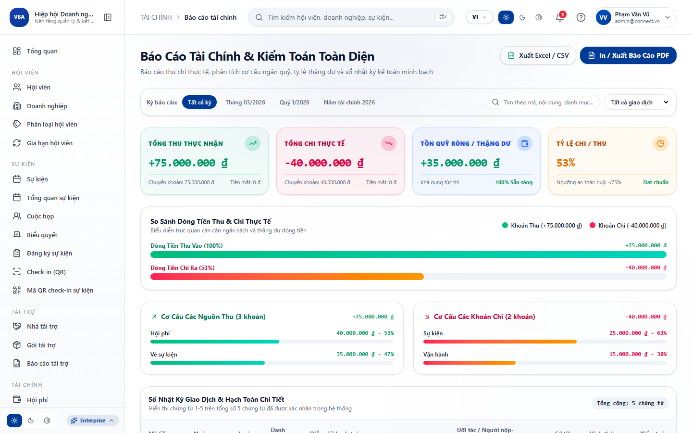
*Hình 7.4: Báo cáo Tài chính Minh bạch & Biểu đồ Dòng tiền Quỹ Hiệp hội*

---

# 8. QUẢN LÝ NHÀ TÀI TRỢ, GÓI TÀI TRỢ & ĐẶC QUYỀN HỘI VIÊN

Tuyến đường chức năng: `/sponsors`, `/sponsor-packages`, `/benefits`, `/perks`.

### 8.1. Quản lý Nhà Tài Trợ & Hạng mục Hợp tác (`/sponsors`)
- Danh bạ các thương hiệu, doanh nghiệp tài trợ cho CLB CEO 1983.
- Phân nhóm gói tài trợ: **Nhà tài trợ Kim Cương**, **Nhà tài trợ Vàng**, **Nhà tài trợ Bạc**, **Nhà tài trợ Đồng hành**.
- Theo dõi tiến độ giải ngân kinh phí tài trợ và bàn giao quyền lợi truyền thông (Logo trên Standee, Phóng sự bài viết, Vị trí VIP Gala).

*Hình 8.1: Quản lý Nhà Tài Trợ & Phân bổ Gói Tài Trợ Hiệp hội*

### 8.2. Quản lý Quyền lợi & Kho Đặc quyền Doanh nghiệp (`/benefits`, `/perks`)
- Cấu hình các đặc quyền ưu đãi dành riêng cho hội viên chính thức: Giảm giá dịch vụ khách sạn, ưu đãi vận chuyển logistics, tư vấn pháp lý miễn phí từ các doanh nghiệp thành viên.
- Duyệt và phát hành mã voucher ưu đãi lên App Hội viên.

*Hình 8.2: Quản lý Quyền lợi & Kho Đặc quyền Doanh nghiệp*

---

# 9. SÀN GIAO THƯƠNG B2B MARKETPLACE & KIỂM DUYỆT SẢN PHẨM

Tuyến đường chức năng: `/marketplace`.

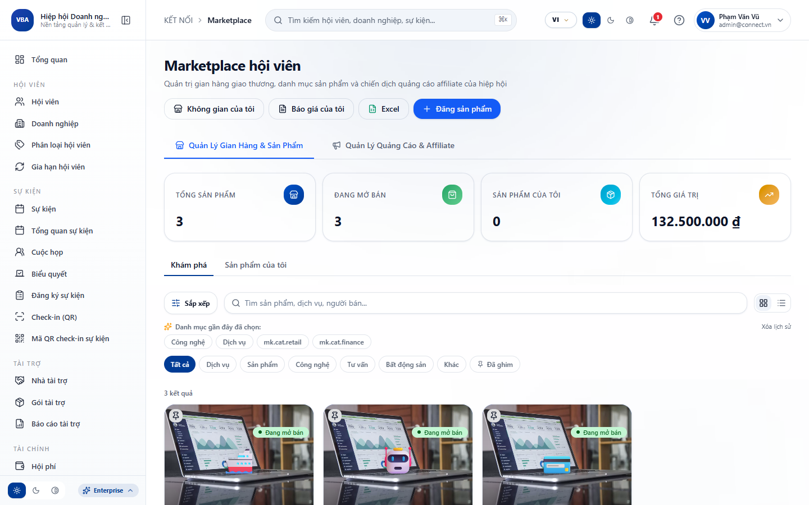
*Hình 9.1: Quản trị Sàn Giao thương B2B Marketplace & Kiểm duyệt Sản phẩm*

### 9.1. Vai trò của Sàn B2B Nội bộ
Sàn B2B CEO 1983 là kênh kết nối giao thương trực tiếp giữa các doanh nghiệp thành viên, thúc đẩy phương châm "Người 1983 ưu tiên dùng hàng 1983".

### 9.2. Quy trình Kiểm duyệt Sản phẩm/Dịch vụ
1. Hội viên đăng ký sản phẩm thế mạnh từ App di động.
2. Sản phẩm hiển thị trong hàng đợi **"Chờ duyệt"** trên Web CRM.
3. Ban Xúc tiến Thương mại kiểm tra: Giấy chứng nhận chất lượng, Nguồn gốc xuất xứ, Mức chiết khấu ưu đãi cho hội viên.
4. Bấm **"Phê duyệt niêm yết"**: Sản phẩm xuất hiện ngay lập tức trên Sàn Marketplace chuẩn Shopee của App di động với đầy đủ đánh giá % uy tín công ty.

---

# 10. TRUYỀN THÔNG, BẢN TIN HIỆP HỘI & EMAIL MARKETING TẬP TRUNG

Tuyến đường chức năng: `/news` và `/email-marketing`.

### 10.1. Quản lý Tin tức & Phóng sự Hoạt động (`/news`)
- Soạn thảo và xuất bản các bài viết phóng sự: Vinh danh doanh nhân tiêu biểu tháng, Tin tức hoạt động thiện nguyện, Kỷ yếu đại hội.
- Hỗ trợ trình soạn thảo văn bản đa phương tiện (Rich Text Editor), chèn hình ảnh và video HD.

*Hình 10.1: Quản lý Tin tức & Phóng sự Hoạt động Hiệp hội*

### 10.2. Cổng Email Marketing & Thông báo Đẩy Tập trung (`/email-marketing`)
- Soạn thảo chiến dịch email thông báo gửi tự động tới danh sách toàn thể hội viên hoặc lọc theo từng Ban chuyên môn.
- Tích hợp các mẫu Template HTML thiết kế sang trọng: Thư mời họp Ban Chấp Hành, Thông báo gia hạn hội phí, Thư chúc mừng sinh nhật hội viên.

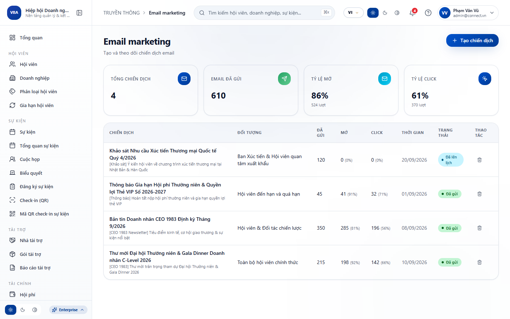
*Hình 10.2: Cổng Email Marketing & Thông báo Tập trung*

---

# 11. MA TRẬN PHÂN QUYỀN RBAC 5 ROLE & GIAO VIỆC TỰ ĐỘNG THÔNG BÁO

Tuyến đường chức năng: `/permissions` và `/tasks`.

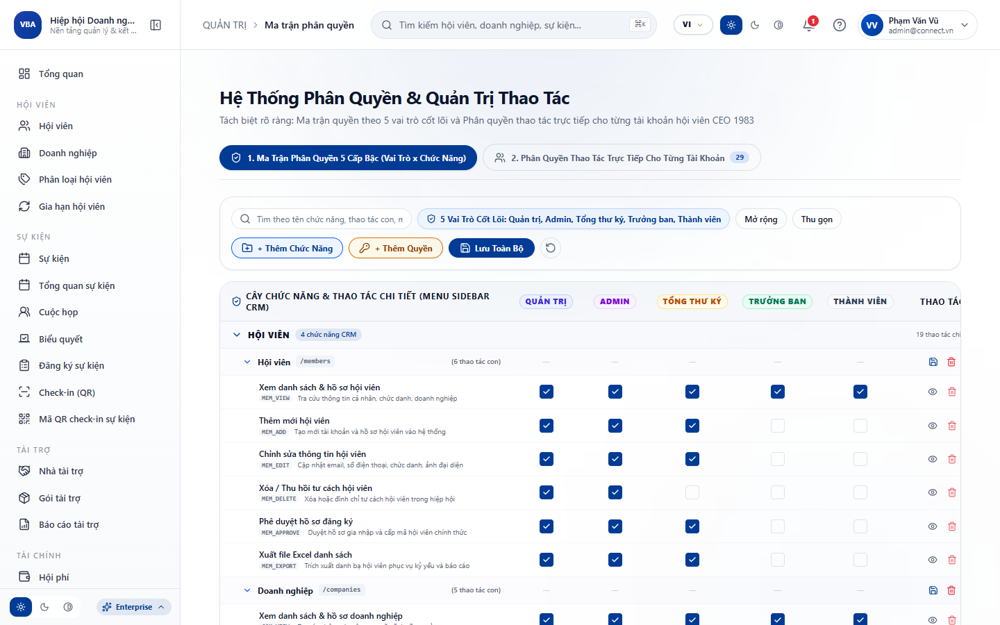
*Hình 11.1: Ma trận Phân quyền RBAC 5 Role cố định & Phân bổ 6 Ban Chuyên Môn*

### 11.1. Ma trận Phân quyền 5 Role Chuẩn hóa
Hệ thống cố định duy nhất đúng 5 vai trò hệ thống (đã loại bỏ Platform Admin, Quản trị là quyền to nhất):
1. **Quản trị (`quan_tri`)**: Toàn quyền cấu hình hệ thống, duyệt hội viên, phê duyệt cuộc họp và quản trị tài chính.
2. **Admin (`admin`)**: Quản trị vận hành sự kiện, tin tức và phê duyệt sản phẩm marketplace.
3. **Tổng thư ký (`tong_thu_ky`)**: Điều phối công việc, tạo lịch họp, gửi thông báo và quản lý danh bạ.
4. **Trưởng ban (`truong_ban`)**: Quản lý thành viên thuộc Ban phụ trách, đề xuất ngân sách và tạo lịch họp Ban.
5. **Thành viên (`member`)**: Quyền xem danh bạ, tham gia sự kiện, đăng sản phẩm và đóng hội phí.

### 11.2. Phân bổ theo 6 Ban Chuyên Môn
- Ban Quản trị
- Ban Thư ký
- Ban Thành viên
- Ban Xúc tiến thương mại
- Ban Truyền thông
- Ban Thiện nguyện

### 11.3. Cơ chế Giao việc Tự động Bắn Thông báo (Task Workflow)
- Khi Quản trị viên hoặc Trưởng ban tạo công việc tại `/tasks` và chọn người thực hiện từ danh bạ hội viên:
- Backend tự động đối soát `user_id` trong PostgreSQL và ghi đồng thời vào 2 bảng CSDL:
  + `public.business_notifications`: Hiển thị icon chuông trên Web CRM Quản trị.
  + `public.member_notifications`: Bắn thông báo đẩy tức thì lên App Di Động của người nhận.

---

# 12. QUY TRÌNH ĐỐI SOÁT THỦ CÔNG & XỬ LÝ SỰ CỐ (TROUBLESHOOTING)

### 12.1. Quy trình Đối soát Gạch nợ Hội phí VietQR
1. **Bước 1**: Hội viên chuyển khoản quét mã VietQR MB Bank `1983000000` với cú pháp `HP[MÃ_HV] [SĐT]`.
2. **Bước 2**: Kế toán mở màn hình `/fees`, đối chiếu mã giao dịch trên sao kê ngân hàng với danh sách chờ.
3. **Bước 3**: Bấm nút **"Xác nhận Đã nộp"**. Hệ thống cập nhật trạng thái hóa đơn thành `PAID`, gia hạn thời hạn hội viên thêm 1 năm và gửi thông báo xác nhận thành công.

### 12.2. Xử lý Lỗi Đăng nhập hoặc Quên Mật khẩu
- Nếu tài khoản báo lỗi sai thông tin đăng nhập: Kiểm tra xem đã nhập đúng định dạng email hoặc mã hội viên chưa.
- Để cấp lại mật khẩu: Quản trị viên truy cập `/members`, mở Drawer hội viên và bấm nút **"Đặt lại mật khẩu mặc định (123456)"**. Hội viên đăng nhập lại và được yêu cầu đổi mật khẩu mới.

---
*Tài liệu được biên soạn và chuẩn hóa phục vụ công tác bàn giao nghiệm thu CLB Doanh Nhân CEO 1983.*
