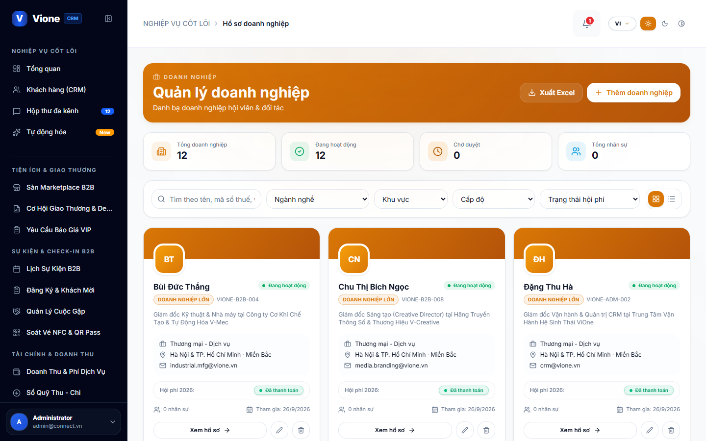
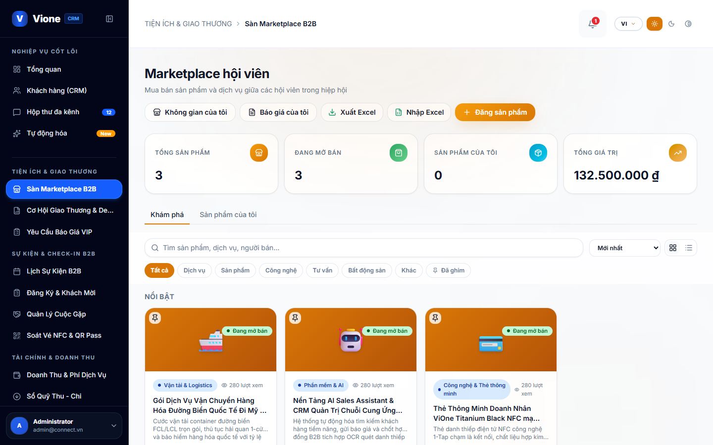
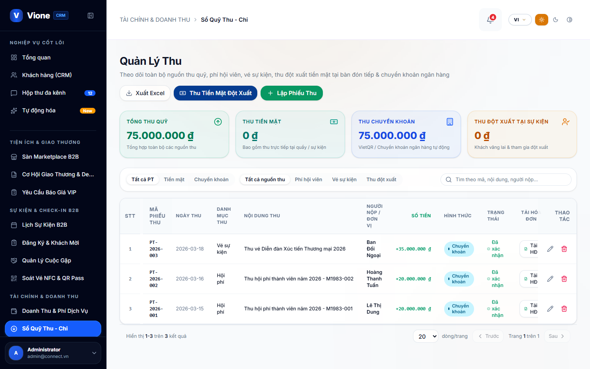
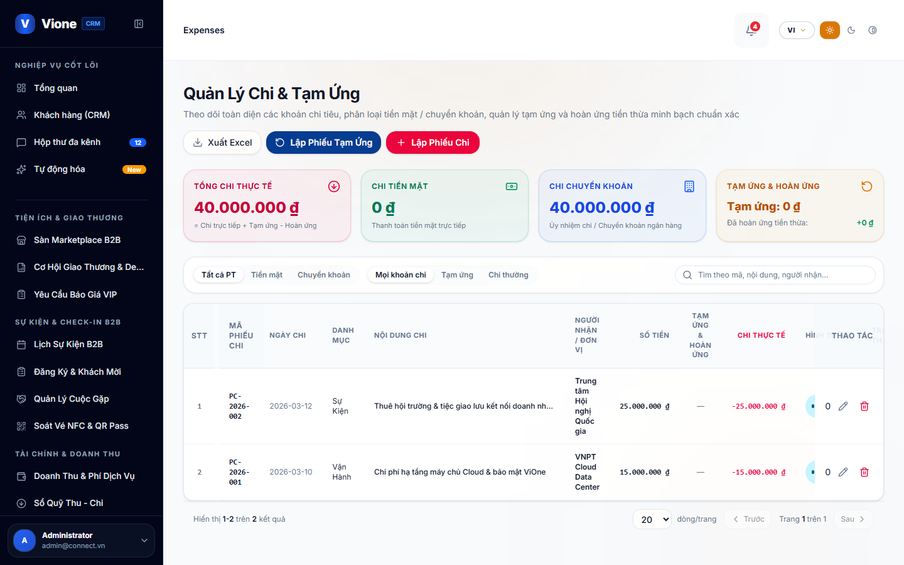
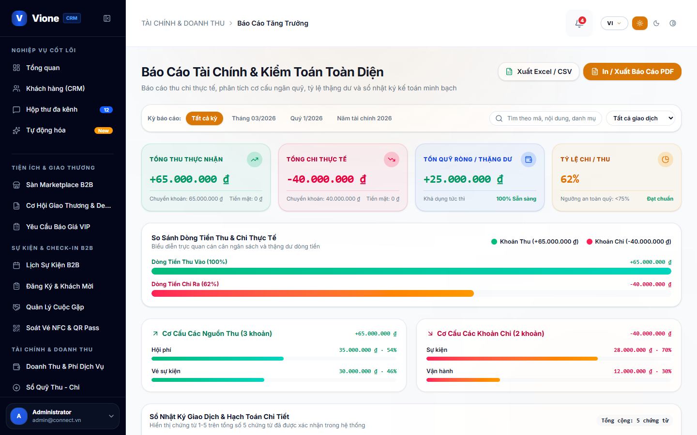
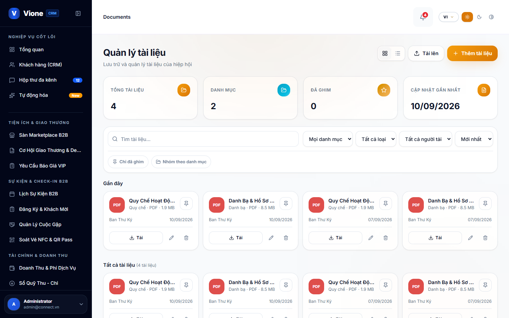
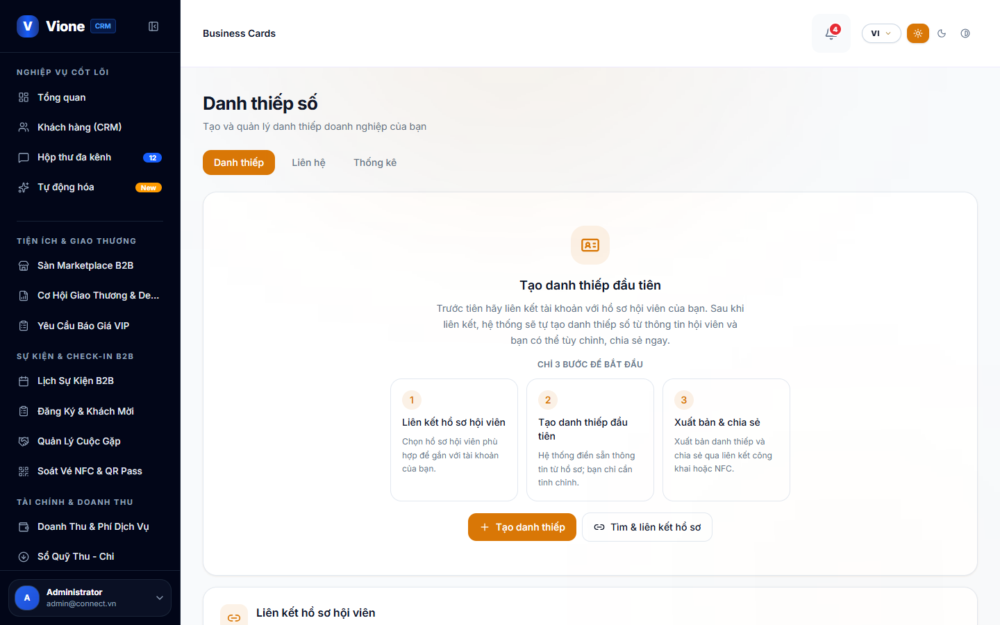
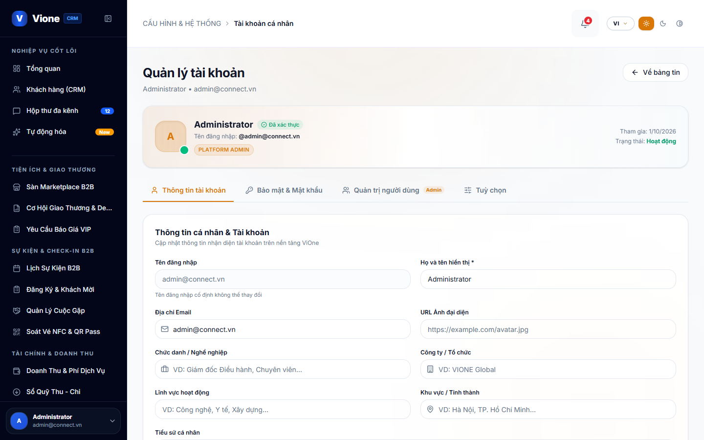

# TÀI LIỆU HƯỚNG DẪN SỬ DỤNG VẬN HÀNH HỆ THỐNG
## HỆ ĐIỀU HÀNH QUẢN TRỊ DOANH NGHIỆP VIONE ENTERPRISE CRM (WEB CRM VIONE)
*Đặc tả Chi tiết Nghiệp vụ Điều hành Doanh nghiệp B2B & Ảnh Chụp Minh Họa Thực Tế Từ Máy Chủ Dev*

---

- **Tên Hệ Thống**: **Hệ Điều Hành Quản Trị Doanh Nghiệp ViOne Enterprise CRM**
- **Mã Tài Liệu**: **HDSD-CRM-VIONE-V4.0**
- **Phiên Bản**: **Version 4.0 — Master Enterprise Production Manual (Bàn Giao Doanh Nghiệp)**
- **Địa Chỉ Server Dev**: `https://14.225.217.232:5445`
- **Đối Tượng Áp Dụng**: Chủ tịch HĐQT, Tổng Giám Đốc (CEO), Giám Đốc Kinh Doanh (CCO), Quản Lý Bán Hàng, Đội Ngũ Sales B2B, Kế Toán Trưởng
- **Ngày Ban Hành**: **01/10/2026**
- **Người Thực Hiện / Phụ Trách**: **Phạm Văn Vũ & ViOne Enterprise Architecture Board**

---

> [!IMPORTANT]
> **THÔNG TIN MÔI TRƯỜNG & TÀI KHOẢN TRUY CẬP WEB CRM VIONE**
> - **Cổng Web CRM Doanh nghiệp**: `https://14.225.217.232:5445`
> - **Màn hình Đăng nhập Quản trị**: `https://14.225.217.232:5445/auth`
> - **Tài khoản quản trị mặc định**: `admin@connect.vn` | Mật khẩu: `123456`
> - **Kiến trúc dữ liệu**: Đa doanh nghiệp cô lập hoàn toàn (Multi-Tenant 163 bảng CSDL), bảo mật cấp độ dòng (Row Level Security - RLS).
> - **Phân quyền nội bộ 4 cấp bậc**: Cấp 1 (Chủ tịch / CEO - Tenant Owner), Cấp 2 (Giám đốc kinh doanh CCO / Trưởng phòng), Cấp 3 (Nhân viên Sales B2B), Cấp 4 (Kế toán & Pháp chế doanh nghiệp).

---

## 📌 MỤC LỤC TÀI LIỆU

1. [TỔNG QUAN HỆ ĐIỀU HÀNH DOANH NGHIỆP VIONE & ĐỊA CHỈ TRUY CẬP](#1-tổng-quan-hệ-điều-hành-doanh-nghiệp-vione--địa-chỉ-truy-cập)
2. [HƯỚNG DẪN ĐĂNG NHẬP & PHÂN QUYỀN 4 CẤP BẬC ENTERPRISE](#2-hướng-dẫn-đăng-nhập--phân-quyền-4-cấp-bậc-enterprise)
3. [BẢNG ĐIỀU KHIỂN TỔNG QUAN DOANH NGHIỆP (EXECUTIVE DASHBOARD)](#3-bảng-điều-khiển-tổng-quan-doanh-nghiệp-executive-dashboard)
4. [QUẢN TRỊ KHÁCH HÀNG TIỀM NĂNG & PHỄU BÁN HÀNG B2B (LEADS PIPELINE)](#4-quản-trị-khách-hàng-tiềm-năng--phễu-bán-hàng-b2b-leads-pipeline)
5. [QUẢN LÝ DOANH NGHIỆP ĐỐI TÁC & HỆ SINH THÁI THÀNH VIÊN](#5-quản-lý-doanh-nghiệp-đối-tác--hệ-sinh-thái-thành-viên)
6. [QUẢN TRỊ BÁO GIÁ, ĐƠN HÀNG & SẢN PHẨM DỊCH VỤ ENTERPRISE](#6-quản-trị-báo-giá-đơn-hàng--sản-phẩm-dịch-vụ-enterprise)
7. [QUẢN LÝ DÒNG TIỀN DOANH NGHIỆP: THU - CHI & ĐỐI SOÁT](#7-quản-lý-dòng-tiền-doanh-nghiệp-thu---chi--đối-soát)
8. [BÁO CÁO TÀI CHÍNH & BIỂU ĐỒ DÒNG TIỀN DOANH NGHIỆP](#8-báo-cáo-tài-chính--biểu-đồ-dòng-tiền-doanh-nghiệp)
9. [KHO HỢP ĐỒNG SỐ & QUẢN TRỊ TÀI LIỆU PHÁP LÝ](#9-kho-hợp-đồng-số--quản-trị-tài-liệu-pháp-lý)
10. [ĐIỀU PHỐI LỊCH LÀM VIỆC & PHÒNG HỌP DOANH NGHIỆP](#10-điều-phối-lịch-làm-việc--phòng-họp-doanh-nghiệp)
11. [QUẢN TRỊ DANH THIẾP SỐ DOANH NGHIỆP & ĐỘI NGŨ NHÂN SỰ](#11-quản-trị-danh-thiếp-số-doanh-nghiệp--đội-ngũ-nhân-sự)
12. [CẤU HÌNH DOANH NGHIỆP, NHÂN SỰ & TRỢ LÝ AI COPILOT](#12-cấu-hình-doanh-nghiệp-nhân-sự--trợ-lý-ai-copilot)

---

# 1. TỔNG QUAN HỆ ĐIỀU HÀNH DOANH NGHIỆP VIONE & ĐỊA CHỈ TRUY CẬP

### 1.1. Sứ mệnh của ViOne Enterprise CRM
Hệ thống Web CRM ViOne là Tổng hành dinh số giúp mỗi doanh nghiệp chuyển đổi số toàn diện hoạt động kinh doanh: quản trị phễu bán hàng B2B, quản lý khách hàng doanh nghiệp, theo dõi hợp đồng số, kiểm soát dòng tiền thu chi và phân bổ danh thiếp thông minh cho toàn thể cán bộ nhân viên.

### 1.2. Kiến trúc Đa Doanh nghiệp Độc lập (Multi-Tenant)
- Hệ thống thiết kế trên kiến trúc Đa Doanh Nghiệp (Multi-Tenant) gồm 163 bảng CSDL chuẩn hóa.
- Mỗi doanh nghiệp sở hữu một không gian dữ liệu riêng biệt có khóa định danh `tenant_id`. Dữ liệu khách hàng, báo giá, hợp đồng và dòng tiền của doanh nghiệp này hoàn toàn bảo mật và không bị can thiệp bởi doanh nghiệp khác.

---

# 2. HƯỚNG DẪN ĐĂNG NHẬP & PHÂN QUYỀN 4 CẤP BẬC ENTERPRISE

### 2.1. Đăng nhập Hệ thống Quản trị
- Truy cập liên kết: `https://14.225.217.232:5445/auth`.
- Giao diện đăng nhập quản trị doanh nghiệp chuyên nghiệp hiển thị.

*Hình 2.1: Màn hình Đăng nhập Hệ thống Quản trị CRM Doanh nghiệp ViOne*

- **Các bước thực hiện**:
  + Nhập Email hoặc Tài khoản quản trị doanh nghiệp (`admin@connect.vn`).
  + Nhập Mật khẩu (`123456`).
  + Bấm nút **"Đăng nhập"**. Hệ thống xác thực và cấp mã JWT Session Token chuyển hướng đến Dashboard.

### 2.2. Ma trận Phân quyền 4 Cấp bậc Doanh nghiệp
1. **Cấp 1 - Chủ tịch / Tổng Giám Đốc (Tenant Owner)**: Toàn quyền doanh nghiệp, xem báo cáo doanh số tổng, duyệt hợp đồng lớn và cấu hình nhân sự.
2. **Cấp 2 - Giám đốc Kinh doanh (CCO) / Trưởng phòng Sales**: Quản lý toàn bộ phễu bán hàng, phân bổ khách hàng tiềm năng (Leads) cho nhân viên và duyệt báo giá.
3. **Cấp 3 - Chuyên viên Kinh doanh B2B (Sales Executive)**: Quản lý danh sách khách hàng được giao phụ trách, tạo báo giá, chăm sóc hợp đồng và ghi chú nhật ký gặp gỡ.
4. **Cấp 4 - Kế toán & Pháp chế**: Theo dõi tiến độ thanh toán, duyệt hóa đơn, đối soát công nợ và lưu trữ hợp đồng pháp lý.

---

# 3. BẢNG ĐIỀU KHIỂN TỔNG QUAN DOANH NGHIỆP (EXECUTIVE DASHBOARD)

Tuyến đường chức năng: `/` hoặc `/dashboard`.

*Hình 3.1: Bảng điều khiển Tổng quan Doanh nghiệp Executive Dashboard với các chỉ số doanh số, khách hàng và cơ hội kinh doanh*

### 3.1. Các Khối Thống kê Chỉ số Doanh số Trực quan
- **Tổng Doanh số Trong Kỳ**: Doanh thu thực nhận từ các đơn hàng và hợp đồng đã thanh toán.
- **Giá trị Hợp đồng Đang Chạy**: Tổng giá trị các dự án đang triển khai cho khách hàng doanh nghiệp.
- **Số lượng Khách hàng Tiềm năng Mới (New Leads)**: Khách hàng thu thập được qua danh thiếp số NFC, Landing page và đối tác giới thiệu.
- **Tỷ lệ Chuyển đổi Phễu (Conversion Rate)**: Tỷ lệ phần trăm từ Khách tiềm năng chuyển thành Hợp đồng ký kết thành công.

---

# 4. QUẢN TRỊ KHÁCH HÀNG TIỀM NĂNG & PHỄU BÁN HÀNG B2B (LEADS PIPELINE)

Tuyến đường chức năng: `/opportunities` và `/members`.

*Hình 4.1: Quản trị Cơ hội Kinh doanh & Phễu Bán hàng B2B (Sales Pipeline)*

### 4.1. 5 Giai đoạn của Phễu Bán hàng B2B ViOne
1. **Giai đoạn 1 - Tiếp cận (Lead / Prospect)**: Thông tin khách hàng thu thập qua danh thiếp NFC, quét card giấy OCR hoặc sự kiện xúc tiến thương mại.
2. **Giai đoạn 2 - Đánh giá Nhu cầu (Qualified)**: Sales liên hệ tìm hiểu ngân sách, người ra quyết định và quy mô dự án.
3. **Giai đoạn 3 - Gửi Báo giá (Proposal / Quotation)**: Phát hành báo giá chính thức kèm chiết khấu và điều khoản thanh toán.
4. **Giai đoạn 4 - Thương thảo Hợp đồng (Negotiation)**: Soạn thảo hợp đồng số, chốt tiến độ giao hàng và các điều khoản pháp lý.
5. **Giai đoạn 5 - Ký kết Thành công (Won / Closed)**: Khách hàng ký hợp đồng số, chuyển sang giai đoạn thực hiện đơn hàng và thu tiền.

---

# 5. QUẢN LÝ DOANH NGHIỆP ĐỐI TÁC & HỆ SINH THÁI THÀNH VIÊN

Tuyến đường chức năng: `/companies` và `/members`.

*Hình 5.1: Quản lý Doanh nghiệp Đối tác & Khách hàng Tổ chức*

- **Hồ sơ Doanh nghiệp Đối tác 360°**: Lưu trữ toàn diện Mã số thuế, Ban điều hành, Người đại diện ký hợp đồng, Lịch sử mua hàng và Hạn mức công nợ.
- **Mối quan hệ Chuỗi Cung ứng**: Phân loại doanh nghiệp theo vai trò: Khách hàng B2B, Nhà cung ứng (Vendor), Đối tác chiến lược (Partner).

---

# 6. QUẢN TRỊ BÁO GIÁ, ĐƠN HÀNG & SẢN PHẨM DỊCH VỤ ENTERPRISE

Tuyến đường chức năng: `/marketplace`.

*Hình 6.1: Quản lý Danh mục Sản phẩm & Dịch vụ Doanh nghiệp*

### 6.1. Quản lý Danh mục Hàng hóa & Bảng giá
- Tạo danh mục sản phẩm, mã SKU, đơn vị tính, giá niêm yết và chính sách giá theo từng cấp độ đại lý.
- Quản trị tình trạng tồn kho, thông số kỹ thuật và tài liệu hướng dẫn sản phẩm (.PDF).
- Soạn thảo báo giá tự động và chuyển đổi thành Đơn hàng chỉ với 1 thao tác bấm chuột.

---

# 7. QUẢN LÝ DÒNG TIỀN DOANH NGHIỆP: THU - CHI & ĐỐI SOÁT

Tuyến đường chức năng: `/income` và `/expenses`.

### 7.1. Quản lý Dòng tiền Thu (`/income`)
- Theo dõi các đợt thanh toán của khách hàng theo từng hợp đồng: Tạm ứng, Thanh toán theo giai đoạn, Thanh lý quyết toán.
- Ghi nhận tài khoản ngân hàng thụ hưởng, mã đối soát giao dịch và xuất phiếu thu tiền mặt / chuyển khoản.

*Hình 7.1: Quản lý Dòng tiền Thu & Theo dõi Thanh toán Khách hàng*

### 7.2. Quản lý Ngân sách Chi phí Doanh nghiệp (`/expenses`)
- Kiểm soát các khoản chi hoạt động: Chi lương kinh doanh, hoa hồng đối tác, chi phí tiếp khách, thuê hạ tầng văn phòng, marketing quảng cáo.
- Quy trình duyệt chi nhiều cấp: Chuyên viên đề xuất ➔ Trưởng phòng kiểm tra ➔ Giám đốc ký duyệt chi.

*Hình 7.2: Quản lý Ngân sách Chi phí Doanh nghiệp & Duyệt chi*

---

# 8. BÁO CÁO TÀI CHÍNH & BIỂU ĐỒ DÒNG TIỀN DOANH NGHIỆP

Tuyến đường chức năng: `/finance-report`.

*Hình 8.1: Báo cáo Tài chính Doanh nghiệp & Phân tích Dòng tiền Thuần*

### 8.1. Các Báo cáo Phân tích Chiến lược
- **Báo cáo Doanh thu theo Nhân viên Kinh doanh**: Xếp hạng Top Sales, tỷ lệ hoàn thành KPI chỉ tiêu doanh số tháng/quý.
- **Báo cáo Dòng tiền Thuần (Net Cashflow)**: Chênh lệch giữa Dòng tiền Thực thu và Chi phí Thực xuất, cảnh báo rủi ro thanh khoản.
- **Báo cáo Công nợ Khách hàng**: Cảnh báo các khoản nợ sắp đến hạn và quá hạn để đội ngũ kế toán đốc thúc thu hồi nợ.

---

# 9. KHO HỢP ĐỒNG SỐ & QUẢN TRỊ TÀI LIỆU PHÁP LÝ

Tuyến đường chức năng: `/documents`.

*Hình 9.1: Kho Hợp đồng Số & Quản trị Tài liệu Pháp lý Doanh nghiệp*

- Lưu trữ bản quét (Scan) hoặc tệp ký số của các hợp đồng thương mại, biên bản nghiệm thu, thỏa thuận bảo mật NDA.
- Phân quyền bảo mật theo phòng ban: Chỉ nhân sự được phân quyền mới có thể tải và xem tài liệu nhạy cảm.

---

# 10. ĐIỀU PHỐI LỊCH LÀM VIỆC & PHÒNG HỌP DOANH NGHIỆP

Tuyến đường chức năng: `/meetings`.

*Hình 10.1: Điều phối Lịch làm việc & Phòng họp Doanh nghiệp*

- Lịch họp nội bộ công ty, họp giao ban đầu tuần, lịch hẹn đàm phán với đối tác B2B.
- Đặt phòng họp thông minh, tích hợp liên kết Zoom Meeting / Google Meet tự động gửi thư mời cho khách hàng.

---

# 11. QUẢN TRỊ DANH THIẾP SỐ DOANH NGHIỆP & ĐỘI NGŨ NHÂN SỰ

Tuyến đường chức năng: `/business-cards`.

*Hình 11.1: Quản trị Danh thiếp Số Đội ngũ Nhân sự Doanh nghiệp*

- Doanh nghiệp cấp phát và quản lý tập trung danh thiếp số thông minh cho toàn thể nhân sự (Ban Giám Đốc, Sales, Marketing).
- Khóa hoặc thu hồi quyền truy cập danh thiếp khi nhân viên nghỉ việc để bảo vệ thông tin khách hàng doanh nghiệp.

---

# 12. CẤU HÌNH DOANH NGHIỆP, NHÂN SỰ & TRỢ LÝ AI COPILOT

Tuyến đường chức năng: `/account-settings`.

*Hình 12.1: Cấu hình Doanh nghiệp, Phân quyền Nhân sự & Thiết lập Hệ thống*

### 12.1. Cấu hình Hồ sơ Doanh nghiệp (Tenant Profile)
- Tên công ty chính thức, Tên thương hiệu, Logo công ty hiển thị trên hóa đơn và báo giá.
- Thông tin tài khoản ngân hàng nhận tiền chuyển khoản và cấu hình mã VietQR thanh toán.

### 12.2. Trợ lý AI Copilot Điều hành
- AI Copilot tự động quét dữ liệu định kỳ để đưa ra gợi ý thông minh cho Ban Giám Đốc:
  + Cảnh báo khách hàng VIP quá 30 ngày chưa phát sinh đơn mới.
  + Nhắc nhở các hợp đồng sắp đến ngày thanh toán đợt tiếp theo.
  + Gợi ý ghép cặp đối tác cung - cầu phù hợp trong hệ sinh thái ViOne.

---
*Tài liệu được biên soạn và chuẩn hóa phục vụ các doanh nghiệp ứng dụng Hệ điều hành Quản trị ViOne Enterprise CRM.*
