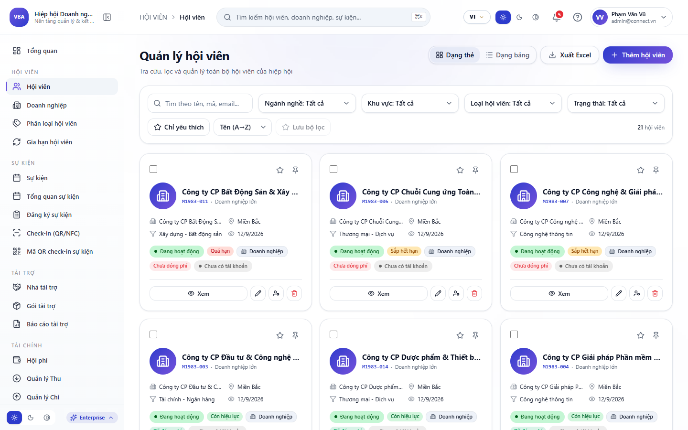
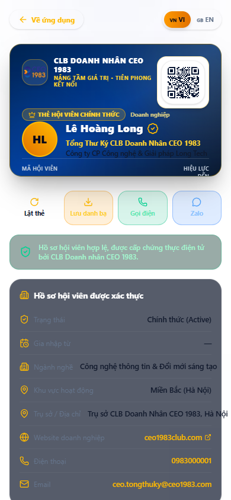

# BỘ SLIDE THUYẾT TRÌNH APP VIONE CONNECT

**Định dạng:** 16:9 Widescreen Enterprise Presentation (Bộ Chuẩn 20 Slides)  
**Bộ Nhận Diện:** Hoàng Gia Vàng Đồng ViOne (Onyx #09090B, Gold #EAB308, Amber #CA8A04)  
**Đơn Vị Chủ Quản:** Ban Giải Pháp Chuyển Đổi Số ViOne Ecosystem (Tháng 10 / 2026)  
**Phiên Bản:** v5.0 Master Release  

---

## MỤC LỤC DANH SÁCH 20 SLIDES THUYẾT TRÌNH

1. [SLIDE 1 (TỔNG QUAN ỨNG DỤNG): VIONE CONNECT MOBILE APP — ĐỈNH CAO KẾT NỐI DOANH NHÂN 5.0](#slide-1)
2. [SLIDE 2 (CÔNG NGHỆ 1-CHẠM): DANH THIẾP SỐ TITANIUM NFC & THẺ VIP ĐỘC BẢN](#slide-2)
3. [SLIDE 3 (TRẢI NGHIỆM NGƯỜI DÙNG): MÀN HÌNH TRANG CHỦ & TRUNG TÂM HOẠT ĐỘNG DOANH NHÂN](#slide-3)
4. [SLIDE 4 (KẾT NỐI TỨC THÌ): QUÉT MÃ QR & KẾT NỐI HỒ SƠ DOANH NGHIỆP TRONG 0.2 GIÂY](#slide-4)
5. [SLIDE 5 (MẠNG XÃ HỘI B2B): BẢNG TIN MOMENTS DOANH NGHIỆP & CHIA SẺ THƯƠNG VỤ](#slide-5)
6. [SLIDE 6 (KẾT NỐI KINH DOANH): SÀN CƠ HỘI GIAO THƯƠNG CUNG - CẦU THỜI GIAN THỰC](#slide-6)
7. [SLIDE 7 (THƯƠNG MẠI ĐIỆN TỬ B2B): GIAN HÀNG SẢN PHẨM & DỊCH VỤ DOANH NGHIỆP TRÊN MOBILE](#slide-7)
8. [SLIDE 8 (GIAO TIẾP DOANH NGHIỆP): TRÒ CHUYỆN BẢO MẬT E2EE & NHÓM KẾT NỐI GIAO THƯƠNG](#slide-8)
9. [SLIDE 9 (SỰ KIỆN & HỘI NGHỊ): QUẢN LÝ SỰ KIỆN DOANH NHÂN & VÉ ĐIỆN TỬ CHECK-IN](#slide-9)
10. [SLIDE 10 (ĐIỀU PHỐI SỰ KIỆN): SƠ ĐỒ CHỖ NGỒI SỰ KIỆN & ĐIỀU PHỐI KHÁCH MỜI VIP](#slide-10)
11. [SLIDE 11 (ĐẶC QUYỀN HỘI VIÊN): HỆ SINH THÁI ĐẶC QUYỀN VOUCHER & ƯU ĐÃI NỘI BỘ](#slide-11)
12. [SLIDE 12 (TRI THỨC QUẢN TRỊ): KHO TƯ LIỆU DOANH NGHIỆP & BẢN TIN KINH TẾ ĐỘC QUYỀN](#slide-12)
13. [SLIDE 13 (DÂN CHỦ SỐ HÓA): BIỂU QUYẾT ĐẠI HỘI & KHẢO SÁT DOANH NGHIỆP ĐIỆN TỬ](#slide-13)
14. [SLIDE 14 (AI TRÊN MOBILE): TRỢ LÝ ẢO BỎ TÚI VIONE ASSISTANT — ĐIỀU HÀNH BẰNG GIỌNG NÓI](#slide-14)
15. [SLIDE 15 (KẾT NỐI KHÔNG GIAN): TÍNH NĂNG GỢI Ý ĐỐI TÁC GẦN BẠN (NEARBY RADAR MATCHING)](#slide-15)
16. [SLIDE 16 (TƯƠNG TÁC THỜI GIAN THỰC): HỆ THỐNG THÔNG BÁO THÔNG MINH (SMART PUSH NOTIFICATIONS)](#slide-16)
17. [SLIDE 17 (BẢO MẬT CÁ NHÂN): QUẢN LÝ TÀI KHOẢN PHÁP NHÂN & CÀI ĐẶT BẢO MẬT RIÊNG TƯ](#slide-17)
18. [SLIDE 18 (HƯỚNG DẪN SỬ DỤNG): HƯỚNG DẪN KÍCH HOẠT THẺ TITANIUM NFC & TẢI APP](#slide-18)
19. [SLIDE 19 (VẬN HÀNH DI ĐỘNG): ĐIỀU HÀNH DỰ ÁN & DUYỆT ĐƠN TỪ NHANH TRÊN DI ĐỘNG (MOBILE APPROVALS)](#slide-19)
20. [SLIDE 20 (KẾT LUẬN & ĐỒNG HÀNH): TỔNG KẾT HỆ SINH THÁI MOBILE VIONE CONNECT & TẦM NHÌN 2026](#slide-20)

---

### SLIDE 1: VIONE CONNECT MOBILE APP — ĐỈNH CAO KẾT NỐI DOANH NHÂN 5.0

- **Phân loại:** `TỔNG QUAN ỨNG DỤNG`
- **Mục tiêu & Tóm tắt:** Ứng dụng số hóa bỏ túi dành riêng cho chủ doanh nghiệp, nhà sáng lập và lãnh đạo: Tích hợp công nghệ thẻ NFC 1-chạm, danh bạ kinh doanh, mạng xã hội giao thương và Trợ lý AI.

**Các Điểm Nhấn Nghiệp Vụ Cốt Lõi:**
- Kích hoạt danh thiếp số cá nhân hóa định danh doanh nhân.
- Chạm thẻ NFC truyền tải hồ sơ năng lực số trong 1 giây không cần cài app.
- Mạng lưới giao thương B2B bảo mật, tìm kiếm đối tác theo vị trí địa lý.
- Ứng dụng đa nền tảng tối ưu: iOS App Store, Android APK và PWA.

**Minh Chứng Giao Diện:**  

*Hình ảnh thực tế: Màn hình Đăng nhập An toàn & Xác thực Danh tính ViOne Connect Mobile*

---

### SLIDE 2: DANH THIẾP SỐ TITANIUM NFC & THẺ VIP ĐỘC BẢN

- **Phân loại:** `CÔNG NGHỆ 1-CHẠM`
- **Mục tiêu & Tóm tắt:** Thay thế hoàn toàn danh thiếp giấy truyền thống bằng thẻ vật lý chất liệu Titanium cao cấp tích hợp vi chip NFC chuẩn quốc tế, nâng tầm vị thế thương hiệu cá nhân.

**Các Điểm Nhấn Nghiệp Vụ Cốt Lõi:**
- Chạm thẻ vào mặt sau smartphone đối tác để tự động mở Portfolio số.
- Lưu trực tiếp số điện thoại, email và website vào danh bạ danh nhân chỉ 1 chạm.
- Cập nhật chức vụ, sản phẩm mới tức thời mà không cần in lại thẻ danh thiếp.
- Mã QR Code dự phòng bảo mật chuẩn mực khi đối tác dùng thiết bị cũ.

**Minh Chứng Giao Diện:**  

*Hình ảnh thực tế: Giao diện Thẻ Doanh Nhân Số Hóa Titanium NFC & QR Code Độc Bản*

---

### SLIDE 3: MÀN HÌNH TRANG CHỦ & TRUNG TÂM HOẠT ĐỘNG DOANH NHÂN

- **Phân loại:** `TRẢI NGHIỆM NGƯỜI DÙNG`
- **Mục tiêu & Tóm tắt:** Giao diện trang chủ tinh gọn, sang trọng với các tiện ích truy cập nhanh: Thẻ VIP số, Lịch hẹn hôm nay, Cơ hội kinh doanh mới và Tin tức chuyển động thị trường.

**Các Điểm Nhấn Nghiệp Vụ Cốt Lõi:**
- Widget Thẻ VIP điện tử hiển thị mã số thành viên và xếp hạng uy tín.
- Bảng tổng hợp nhanh các chỉ số kết nối: Lượt chạm thẻ, Cuộc họp, Đơn hàng B2B.
- Lối tắt truy cập nhanh: Quét QR Check-in, Mở Chat, Đăng cơ hội hợp tác.
- Thiết kế giao diện Dark Luxury tối ưu hiển thị trên màn hình OLED cao cấp.

**Minh Chứng Giao Diện:**  

*Hình ảnh thực tế: Màn hình Trang chủ Dashboard Ứng dụng Di động ViOne Connect*

---

### SLIDE 4: QUÉT MÃ QR & KẾT NỐI HỒ SƠ DOANH NGHIỆP TRONG 0.2 GIÂY

- **Phân loại:** `KẾT NỐI TỨC THÌ`
- **Mục tiêu & Tóm tắt:** Bộ máy quét camera siêu tốc nhận diện mã QR của đối tác tại các sự kiện giao thương, tự động đồng bộ thông tin pháp nhân và lưu vào danh bạ VIP.

**Các Điểm Nhấn Nghiệp Vụ Cốt Lõi:**
- Tốc độ quét nhận diện và giải mã tức thời dưới 200 mili-giây.
- Tự động phân loại đối tác theo ngành nghề (Sản xuất, Bán lẻ, Dịch vụ).
- Ghi chú bối cảnh cuộc gặp gỡ và đặt lịch hẹn gặp lại ngay trong hồ sơ.
- Bảo mật danh bạ cá nhân, chống sao chép và thu thập dữ liệu trái phép.

**Minh Chứng Giao Diện:**  

*Hình ảnh thực tế: Hồ sơ Doanh nhân 360° & Bộ máy Quét Mã QR Định danh Giao thương*

---

### SLIDE 5: BẢNG TIN MOMENTS DOANH NGHIỆP & CHIA SẺ THƯƠNG VỤ

- **Phân loại:** `MẠNG XÃ HỘI B2B`
- **Mục tiêu & Tóm tắt:** Không gian truyền thông nội bộ uy tín nơi các nhà lãnh đạo chia sẻ thành tựu ký kết hợp đồng, hoạt động doanh nghiệp và tìm kiếm đối tác đồng hành.

**Các Điểm Nhấn Nghiệp Vụ Cốt Lõi:**
- Đăng tải bài viết kèm hình ảnh, video và liên kết sản phẩm gian hàng B2B.
- Tương tác chuyên nghiệp: Bắt tay giao thương, Chúc mừng, Đề nghị hợp tác.
- Lọc tin tức theo ngành nghề, khu vực địa lý hoặc hội doanh nghiệp tham gia.
- Kiểm duyệt nội dung tự động bằng AI, loại bỏ tin rác và quảng cáo sai quy chuẩn.

**Minh Chứng Giao Diện:**  

*Hình ảnh thực tế: Bảng tin Moments Doanh nghiệp & Chia sẻ Cơ hội Giao thương Mạng lưới*

---

### SLIDE 6: SÀN CƠ HỘI GIAO THƯƠNG CUNG - CẦU THỜI GIAN THỰC

- **Phân loại:** `KẾT NỐI KINH DOANH`
- **Mục tiêu & Tóm tắt:** Chợ giao thương B2B khép kín giữa các hội viên: Đăng tải nhu cầu mua hàng số lượng lớn hoặc giới thiệu nguồn cung độc quyền với chính sách chiết khấu sâu.

**Các Điểm Nhấn Nghiệp Vụ Cốt Lõi:**
- Đăng tin Chào mua (Cần tìm nhà cung cấp) và Chào bán (Cung ứng sản phẩm).
- Bộ lọc nâng cao theo giá trị hợp đồng, địa bàn và tiến độ giao hàng.
- Hệ thống AI tự động phân tích và gán ghép cơ hội (Smart Matching Engine).
- Đánh giá uy tín đối tác qua chỉ số xác thực doanh nghiệp Verified Business.

**Minh Chứng Giao Diện:**  

*Hình ảnh thực tế: Bảng tin Nhu cầu Giao thương Cung - Cầu Thời Gian Thực ViOne Connect*

---

### SLIDE 7: GIAN HÀNG SẢN PHẨM & DỊCH VỤ DOANH NGHIỆP TRÊN MOBILE

- **Phân loại:** `THƯƠNG MẠI ĐIỆN TỬ B2B`
- **Mục tiêu & Tóm tắt:** Showroom di động trưng bày các giải pháp, sản phẩm chủ lực của doanh nghiệp: Hình ảnh sắc nét, thông số chi tiết và nút liên hệ báo giá nhanh.

**Các Điểm Nhấn Nghiệp Vụ Cốt Lõi:**
- Duyệt sản phẩm theo danh mục ngành hàng với bộ lọc thông minh.
- Xem hồ sơ năng lực (Profile), chứng chỉ chất lượng và năng lực sản xuất.
- Gửi yêu cầu nhận báo giá riêng cho hội viên chỉ với 1 thao tác chạm.
- Theo dõi lịch sử đơn hàng và tiến độ thực hiện hợp đồng cung ứng.

**Minh Chứng Giao Diện:**  

*Hình ảnh thực tế: Gian Hàng Sản Phẩm & Dịch Vụ Doanh Nghiệp Trên Ứng Dụng Mobile*

---

### SLIDE 8: TRÒ CHUYỆN BẢO MẬT E2EE & NHÓM KẾT NỐI GIAO THƯƠNG

- **Phân loại:** `GIAO TIẾP DOANH NGHIỆP`
- **Mục tiêu & Tóm tắt:** Kênh đàm phán thương vụ an toàn tuyệt đối với mã hóa đầu cuối End-to-End Encryption, chia sẻ tài liệu mật, hợp đồng và gọi thoại chất lượng cao.

**Các Điểm Nhấn Nghiệp Vụ Cốt Lõi:**
- Mã hóa tin nhắn chuẩn Signal Protocol, không lưu trữ nội dung trên máy chủ trung gian.
- Tạo nhóm làm việc kín theo từng dự án hoặc hiệp hội ngành nghề.
- Gửi tài liệu hợp đồng định dạng PDF, Excel dung lượng lớn không bị nén mờ.
- Tính năng tin nhắn tự hủy sau thời gian cài đặt đối với thông tin nhạy cảm.

**Minh Chứng Giao Diện:**  

*Hình ảnh thực tế: Trung tâm Trò chuyện Doanh nghiệp Bảo mật & Đàm phán Thương mại*

---

### SLIDE 9: QUẢN LÝ SỰ KIỆN DOANH NHÂN & VÉ ĐIỆN TỬ CHECK-IN

- **Phân loại:** `SỰ KIỆN & HỘI NGHỊ`
- **Mục tiêu & Tóm tắt:** Lịch trình hội nghị, tọa đàm xúc tiến thương mại và gala dinner được cập nhật liên tục: Đăng ký tham gia, nhận vé QR và sơ đồ đường đi chỉ dẫn chi tiết.

**Các Điểm Nhấn Nghiệp Vụ Cốt Lõi:**
- Danh sách sự kiện sắp diễn ra kèm thông tin diễn giả và nội dung chương trình.
- Vé điện tử tích hợp mã QR cá nhân hóa, hiển thị số bàn và vị trí chỗ ngồi.
- Nhắc lịch tự động trước 24 giờ và 2 giờ qua thông báo đẩy trên điện thoại.
- Tải tài liệu thuyết trình của diễn giả ngay trên trang chi tiết sự kiện.

**Minh Chứng Giao Diện:**  

*Hình ảnh thực tế: Lịch Trình Sự Kiện Kết Nối Giao Thương & Vé Điện Tử E-Ticket QR*

---

### SLIDE 10: SƠ ĐỒ CHỖ NGỒI SỰ KIỆN & ĐIỀU PHỐI KHÁCH MỜI VIP

- **Phân loại:** `ĐIỀU PHỐI SỰ KIỆN`
- **Mục tiêu & Tóm tắt:** Trải nghiệm đỉnh cao tại các đại hội doanh nhân: Tra cứu vị trí bàn tiệc VIP của mình, xem danh sách các lãnh đạo ngồi cùng bàn để chủ động giao lưu.

**Các Điểm Nhấn Nghiệp Vụ Cốt Lõi:**
- Sơ đồ hội trường tương tác trực quan (Interactive Seating Map).
- Xem thông tin chức vụ và doanh nghiệp của các đối tác ngồi chung bàn.
- Tính năng gửi lời mời kết bạn trước khi sự kiện chính thức khai mạc.
- Đổi chỗ ngồi linh hoạt thông qua ban tổ chức khi có nhu cầu đặc biệt.

**Minh Chứng Giao Diện:**  

*Hình ảnh thực tế: Sơ đồ Vị Trí Chỗ Ngồi Hội Nghị & Danh Sách Đại Biểu Bàn VIP*

---

### SLIDE 11: HỆ SINH THÁI ĐẶC QUYỀN VOUCHER & ƯU ĐÃI NỘI BỘ

- **Phân loại:** `ĐẶC QUYỀN HỘI VIÊN`
- **Mục tiêu & Tóm tắt:** Hàng trăm mã ưu đãi độc quyền dành riêng cho lãnh đạo: Dịch vụ phòng chờ sân bay, khách sạn 5 sao, sân golf, nhà hàng sang trọng và dịch vụ xe đưa đón VIP.

**Các Điểm Nhấn Nghiệp Vụ Cốt Lõi:**
- Kho voucher số hóa phân loại theo phong cách sống và nhu cầu công tác.
- Mã vạch và mã QR ưu đãi sử dụng trực tiếp tại quầy dịch vụ đối tác.
- Tặng voucher cho bạn bè, đối tác hoặc nhân sự xuất sắc trong công ty.
- Nhận thông báo khi có thương hiệu cao cấp mới tham gia hệ sinh thái đặc quyền.

**Minh Chứng Giao Diện:**  

*Hình ảnh thực tế: Trung tâm Ưu đãi Đặc quyền Doanh nhân & Kho Voucher VIP ViOne*

---

### SLIDE 12: KHO TƯ LIỆU DOANH NGHIỆP & BẢN TIN KINH TẾ ĐỘC QUYỀN

- **Phân loại:** `TRI THỨC QUẢN TRỊ`
- **Mục tiêu & Tóm tắt:** Thư viện số hóa lưu trữ các báo cáo nghiên cứu thị trường, mẫu biểu quản trị doanh nghiệp, quy chuẩn pháp lý và cẩm nang điều hành dành cho nhà lãnh đạo.

**Các Điểm Nhấn Nghiệp Vụ Cốt Lõi:**
- Tải về miễn phí hàng trăm biểu mẫu hợp đồng, quy chế nhân sự và KPI chuẩn.
- Bản tin dự báo xu hướng kinh tế vĩ mô do đội ngũ chuyên gia cố vấn biên soạn.
- Đọc tài liệu trực tiếp trên ứng dụng với trình xem PDF bảo mật chống rò rỉ.
- Gắn thẻ tài liệu yêu thích để tra cứu nhanh khi cần tham khảo trong công việc.

**Minh Chứng Giao Diện:**  

*Hình ảnh thực tế: Thư viện Tư liệu Số hóa & Báo cáo Nghiên cứu Thị trường Dành cho CEO*

---

### SLIDE 13: BIỂU QUYẾT ĐẠI HỘI & KHẢO SÁT DOANH NGHIỆP ĐIỆN TỬ

- **Phân loại:** `DÂN CHỦ SỐ HÓA`
- **Mục tiêu & Tóm tắt:** Tính năng biểu quyết thông qua nghị quyết và thăm dò ý kiến lãnh đạo theo nguyên tắc 1 người 1 phiếu bảo mật tuyệt đối, kiểm phiếu thời gian thực.

**Các Điểm Nhấn Nghiệp Vụ Cốt Lõi:**
- Tạo cuộc biểu quyết với thời gian bắt đầu, kết thúc và cơ chế kiểm soát đại biểu.
- Mã hóa phiếu bầu bảo mật, không thể can thiệp hay thay đổi kết quả sau khi gửi.
- Biểu đồ kết quả trực tiếp phản ánh tỷ lệ tán thành, không tán thành và ý kiến khác.
- Lưu biên bản kiểm phiếu điện tử có chữ ký số xác thực tính pháp lý của nghị quyết.

**Minh Chứng Giao Diện:**  

*Hình ảnh thực tế: Màn hình Biểu quyết Đại hội Điện tử & Báo cáo Kết quả Trực tiếp*

---

### SLIDE 14: TRỢ LÝ ẢO BỎ TÚI VIONE ASSISTANT — ĐIỀU HÀNH BẰNG GIỌNG NÓI

- **Phân loại:** `AI TRÊN MOBILE`
- **Mục tiêu & Tóm tắt:** Mang sức mạnh của AI Copilot vào thiết bị di động: Tra cứu số liệu doanh thu tức thì, nhắc lịch họp quan trọng và gợi ý đối tác tiềm năng trên đường công tác.

**Các Điểm Nhấn Nghiệp Vụ Cốt Lõi:**
- Hỏi đáp tự nhiên bằng giọng nói Tiếng Việt hoặc gõ văn bản nhanh.
- Tra cứu tức thời: "Hôm nay có bao nhiêu khách hàng mới?", "Dòng tiền tuần này thế nào?".
- Gợi ý kết nối thông minh: "Có CEO nào cùng ngành đang ở gần khách sạn tôi không?".
- Tự động ghi nhớ sở thích giao thương và thói quen làm việc của từng chủ doanh nghiệp.

**Minh Chứng Giao Diện:**  

*Hình ảnh thực tế: Trợ lý Ảo Doanh nhân ViOne Assistant Tích hợp Sâu trên Điện thoại*

---

### SLIDE 15: TÍNH NĂNG GỢI Ý ĐỐI TÁC GẦN BẠN (NEARBY RADAR MATCHING)

- **Phân loại:** `KẾT NỐI KHÔNG GIAN`
- **Mục tiêu & Tóm tắt:** Thuật toán định vị thông minh gợi ý các cơ hội kết nối giao thương trực tiếp khi doanh nhân đi công tác tại các tỉnh thành hoặc tham gia hội chợ thương mại.

**Các Điểm Nhấn Nghiệp Vụ Cốt Lõi:**
- Quét radar tìm kiếm các hội viên doanh nghiệp trong bán kính từ 1km đến 20km.
- Chỉ kích hoạt khi người dùng bật chế độ "Sẵn sàng giao lưu kết nối".
- Gửi lời mời thưởng thức cà phê và giao lưu hợp tác kinh doanh 1 chạm.
- Bảo mật tuyệt đối thông tin tọa độ chi tiết, chỉ hiển thị khoảng cách tương đối.

**Minh Chứng Giao Diện:**  

*Hình ảnh thực tế: Tính năng Radar Gợi ý Đối tác Kinh doanh Tiềm năng Gần Bạn*

---

### SLIDE 16: HỆ THỐNG THÔNG BÁO THÔNG MINH (SMART PUSH NOTIFICATIONS)

- **Phân loại:** `TƯƠNG TÁC THỜI GIAN THỰC`
- **Mục tiêu & Tóm tắt:** Kênh truyền tải thông điệp tức thời đến người dùng: Nhắc nhở lịch họp, cảnh báo công nợ, thông báo khách hàng tiềm năng và tin tức nóng từ hiệp hội.

**Các Điểm Nhấn Nghiệp Vụ Cốt Lõi:**
- Tỷ lệ mở thông báo đạt trên 78% nhờ thuật toán tối ưu thời điểm gửi thông minh.
- Phân luồng thông báo rõ ràng: Công việc, Cơ hội giao thương, Tài chính, Sự kiện.
- Bấm vào thông báo điều hướng thẳng đến đúng màn hình nghiệp vụ liên quan.
- Tùy chỉnh chế độ Không làm phiền vào ban đêm hoặc trong các khung giờ họp kín.

**Minh Chứng Giao Diện:**  

*Hình ảnh thực tế: Trung tâm Quản trị Thông báo Đẩy Push Notification Đa Kênh*

---

### SLIDE 17: QUẢN LÝ TÀI KHOẢN PHÁP NHÂN & CÀI ĐẶT BẢO MẬT RIÊNG TƯ

- **Phân loại:** `BẢO MẬT CÁ NHÂN`
- **Mục tiêu & Tóm tắt:** Chủ động quản lý thông tin đại diện pháp lý của công ty, cấu hình quyền riêng tư danh bạ, cài đặt xác thực vân tay / Face ID và quản lý các thiết bị đăng nhập.

**Các Điểm Nhấn Nghiệp Vụ Cốt Lõi:**
- Đăng nhập sinh trắc học Face ID / Touch ID an toàn và tiện lợi trên di động.
- Quản lý danh sách các phiên đăng nhập, đăng xuất từ xa khi nghi ngờ lộ thiết bị.
- Tùy chỉnh chế độ công khai: Ẩn/Hiện số điện thoại cá nhân trên danh bạ chung.
- Tải về toàn bộ dữ liệu cá nhân theo tiêu chuẩn quyền riêng tư dữ liệu quốc tế.

**Minh Chứng Giao Diện:**  

*Hình ảnh thực tế: Cài đặt Tài khoản Doanh nghiệp, Phân quyền Riêng tư & Bảo mật Face ID*

---

### SLIDE 18: HƯỚNG DẪN KÍCH HOẠT THẺ TITANIUM NFC & TẢI APP

- **Phân loại:** `HƯỚNG DẪN SỬ DỤNG`
- **Mục tiêu & Tóm tắt:** Quy trình 3 bước siêu tốc giúp doanh nhân bắt đầu trải nghiệm hệ sinh thái ViOne Connect chỉ trong vòng 3 phút làm việc.

**Các Điểm Nhấn Nghiệp Vụ Cốt Lõi:**
- Bước 1: Tải ứng dụng ViOne Connect trên App Store / Google Play hoặc mở PWA.
- Bước 2: Đăng nhập bằng tài khoản được cấp hoặc số điện thoại định danh.
- Bước 3: Chạm thẻ Titanium vào đầu đọc NFC để đồng bộ định danh cá nhân độc bản.
- Sẵn sàng kết nối giao thương và tham gia hàng trăm sự kiện kết nối đẳng cấp.

**Minh Chứng Giao Diện:**  

*Hình ảnh thực tế: Quy trình Kích hoạt Tài khoản & Đồng bộ Thẻ Titanium NFC 1-Chạm*

---

### SLIDE 19: ĐIỀU HÀNH DỰ ÁN & DUYỆT ĐƠN TỪ NHANH TRÊN DI ĐỘNG (MOBILE APPROVALS)

- **Phân loại:** `VẬN HÀNH DI ĐỘNG`
- **Mục tiêu & Tóm tắt:** Giúp ban lãnh đạo phê duyệt nhanh các đề xuất mua sắm, tạm ứng kinh phí, đơn nghỉ phép và giao việc tức thời mọi lúc mọi nơi ngay trên smartphone.

**Các Điểm Nhấn Nghiệp Vụ Cốt Lõi:**
- Nhận thông báo đẩy phê duyệt với đầy đủ hồ sơ đính kèm và tờ trình kinh phí.
- Thao tác 1-chạm: Phê duyệt, Từ chối kèm lý do hoặc Chuyển tiếp cấp cao hơn.
- Theo dõi tiến độ thực hiện nhiệm vụ khẩn cấp của các bộ phận cấp dưới theo thời gian thực.
- Tích hợp chữ ký số di động bảo đảm tính pháp lý cao nhất của quyết định điều hành.

**Minh Chứng Giao Diện:**  

*Hình ảnh thực tế: Màn hình Phê duyệt Hồ sơ & Điều phối Nhiệm vụ Khẩn cấp trên Di động*

---

### SLIDE 20: TỔNG KẾT HỆ SINH THÁI MOBILE VIONE CONNECT & TẦM NHÌN 2026

- **Phân loại:** `KẾT LUẬN & ĐỒNG HÀNH`
- **Mục tiêu & Tóm tắt:** ViOne Connect mở ra kỷ nguyên kết nối giao thương thông minh, không khoảng cách, đưa thương hiệu doanh nghiệp và doanh nhân Việt Nam vươn tầm quốc tế.

**Các Điểm Nhấn Nghiệp Vụ Cốt Lõi:**
- Hơn 10,000+ kết nối giao thương thành công được tạo lập mỗi tháng trong mạng lưới.
- Giảm thiểu 90% lãng phí in ấn danh thiếp giấy và tài liệu hội nghị cồng kềnh.
- Nâng cao vị thế thương hiệu cá nhân với tấm thẻ doanh nhân Titanium số hóa đẳng cấp.
- Tải ứng dụng ngay hôm nay để gia nhập cộng đồng doanh nhân tinh hoa ViOne.

**Minh Chứng Giao Diện:**  

*Hình ảnh thực tế: Hệ Sinh Thái Danh Thiếp Số Titanium & Mạng Lưới Doanh Nhân Tinh Hoa ViOne Connect*

---

