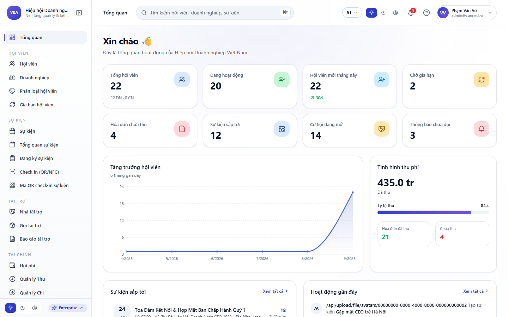

# BỘ SLIDE THUYẾT TRÌNH HỆ THỐNG QUẢN TRỊ CRM VIONE 5.0

**Định dạng:** 16:9 Widescreen Enterprise Presentation (Bộ Chuẩn 20 Slides)  
**Bộ Nhận Diện:** Hoàng Gia Vàng Đồng ViOne (Onyx #09090B, Gold #EAB308, Amber #CA8A04)  
**Đơn Vị Chủ Quản:** Ban Giải Pháp Chuyển Đổi Số ViOne Ecosystem (Tháng 10 / 2026)  
**Phiên Bản:** v5.0 Master Release  

---

## MỤC LỤC DANH SÁCH 20 SLIDES THUYẾT TRÌNH

1. [SLIDE 1 (TỔNG QUAN HỆ THỐNG): VIONE PLATFORM 5.0 — HỆ ĐIỀU HÀNH DOANH NGHIỆP HỢP NHẤT](#slide-1)
2. [SLIDE 2 (GIÁM SÁT VẬN HÀNH): TRUNG TÂM ĐIỀU HÀNH EXECUTIVE DASHBOARD & KPI REALTIME](#slide-2)
3. [SLIDE 3 (PHÂN HỆ CRM): QUẢN LÝ PHỄU KHÁCH HÀNG & HỒ SƠ 360 ĐỘ (LEAD TO DEAL)](#slide-3)
4. [SLIDE 4 (PHÂN HỆ CRM): QUẢN TRỊ CƠ HỘI THƯƠNG MẠI & QUY TRÌNH KÝ KẾT HỢP ĐỒNG](#slide-4)
5. [SLIDE 5 (GIAO THƯƠNG B2B): GIAN HÀNG B2B, DANH MỤC SẢN PHẨM & DỊCH VỤ DOANH NGHIỆP](#slide-5)
6. [SLIDE 6 (SỰ KIỆN & HỘI THẢO): QUẢN TRỊ SỰ KIỆN DOANH NGHIỆP & ĐIỂM DANH CHECK-IN QR](#slide-6)
7. [SLIDE 7 (PHÂN HỆ CÔNG VIỆC): VIONE WORK — QUẢN LÝ DỰ ÁN AGILE & TIẾN ĐỘ CÔNG VIỆC](#slide-7)
8. [SLIDE 8 (PHÂN HỆ TÀI CHÍNH): VIONE FINANCE — DÒNG TIỀN TỰ ĐỘNG & BÁO CÁO P&L MINH BẠCH](#slide-8)
9. [SLIDE 9 (PHÂN HỆ NHÂN SỰ): VIONE HRM — CHẤM CÔNG SỐ & ĐÁNH GIÁ KPI BẰNG TRÍ TUỆ NHÂN TẠO](#slide-9)
10. [SLIDE 10 (ĐIỂM NHẤN CÔNG NGHỆ): VIONE AI COPILOT 5.0 — BỘ NÃO TỰ ĐỘNG HÓA VẬN HÀNH](#slide-10)
11. [SLIDE 11 (TỰ ĐỘNG HÓA): BỘ MÁY TỰ ĐỘNG HÓA QUY TRÌNH ĐA KÊNH (WORKFLOW AUTOMATION)](#slide-11)
12. [SLIDE 12 (KIẾN TRÚC BẢO MẬT): MA TRẬN PHÂN QUYỀN RBAC & CÔ LẬP DỮ LIỆU MULTI-TENANT](#slide-12)
13. [SLIDE 13 (HẠ TẦNG & BẢO MẬT): TIÊU CHUẨN AN TOÀN THÔNG TIN & HẠ TẦNG PRIVATE CLOUD](#slide-13)
14. [SLIDE 14 (TÍCH HỢP HỆ THỐNG): TÍCH HỢP HỆ SINH THÁI MỞ & KẾT NỐI ĐA NỀN TẢNG (OPEN API & WEBHOOK)](#slide-14)
15. [SLIDE 15 (BÁO CÁO THÔNG MINH BI): TRUNG TÂM PHÂN TÍCH KINH DOANH BI & DỰ BÁO XU HƯỚNG DÒNG TIỀN](#slide-15)
16. [SLIDE 16 (SỐ HÓA VĂN BẢN): QUẢN TRỊ TÀI LIỆU SỐ & QUY TRÌNH KÝ HỢP ĐỒNG ĐIỆN TỬ (E-SIGN)](#slide-16)
17. [SLIDE 17 (CHÍNH SÁCH THƯƠNG MẠI): CHÍNH SÁCH BÁO GIÁ TƯ VẤN DOANH NGHIỆP (3 GÓI GIẢI PHÁP)](#slide-17)
18. [SLIDE 18 (TRIỂN KHAI & BÀN GIAO): LỘ TRÌNH TRIỂN KHAI CHUYỂN ĐỔI SỐ 5 BƯỚC CHUẨN MỰC](#slide-18)
19. [SLIDE 19 (HỖ TRỢ & BẢO HÀNH): CAM KẾT DỊCH VỤ SLA & ĐỘI NGŨ CHUYÊN GIA ĐỒNG HÀNH 24/7](#slide-19)
20. [SLIDE 20 (KẾT LUẬN & HÀNH ĐỘNG): TỔNG KẾT GIÁ TRỊ & KHỞI ĐỘNG HỢP TÁC SỐ HÓA CÙNG VIONE](#slide-20)

---

### SLIDE 1: VIONE PLATFORM 5.0 — HỆ ĐIỀU HÀNH DOANH NGHIỆP HỢP NHẤT

- **Phân loại:** `TỔNG QUAN HỆ THỐNG`
- **Mục tiêu & Tóm tắt:** Nền tảng CRM doanh nghiệp thế hệ mới tích hợp sâu Trợ lý Trí tuệ nhân tạo AI Copilot, quản trị đa phân hệ (CRM, Dự án, Tài chính, Nhân sự) và tự động hóa quy trình vận hành toàn diện.

**Các Điểm Nhấn Nghiệp Vụ Cốt Lõi:**
- Hợp nhất 4 phân hệ cốt lõi: CRM 360°, Vione Work, Vione Finance, Vione HRM.
- Trợ lý ảo AI Copilot phân tích dữ liệu cơ sở dữ liệu thời gian thực.
- Kiến trúc Multi-tenant cô lập dữ liệu 100% cấp doanh nghiệp.
- Mã hóa đường truyền TLS 1.3 và dữ liệu lưu trữ AES-256 tiêu chuẩn quốc tế.

**Minh Chứng Giao Diện:**  

*Hình ảnh thực tế: Giao diện Đăng nhập Hệ thống Quản trị Doanh nghiệp ViOne CRM 5.0*

---

### SLIDE 2: TRUNG TÂM ĐIỀU HÀNH EXECUTIVE DASHBOARD & KPI REALTIME

- **Phân loại:** `GIÁM SÁT VẬN HÀNH`
- **Mục tiêu & Tóm tắt:** Bảng điều khiển trực quan phản ánh 360 độ sức khỏe doanh nghiệp: Tổng giá trị thương vụ, tỷ lệ chuyển đổi, dòng tiền dự báo và tiến độ hoàn thành chỉ tiêu KPI phòng ban.

**Các Điểm Nhấn Nghiệp Vụ Cốt Lõi:**
- Chỉ số đo lường hiệu suất thời gian thực (Realtime KPI Metrics).
- Biểu đồ tăng trưởng doanh số và phân bổ cơ hội theo từng giai đoạn phễu.
- Cảnh báo sớm các điểm nghẽn SLA vận hành và quá hạn xử lý hợp đồng.
- Tích hợp nút kích hoạt nhanh Trợ lý AI phân tích chuyên sâu báo cáo.

**Minh Chứng Giao Diện:**  

*Hình ảnh thực tế: Trung tâm Giám sát Điều hành Vận hành Tổng thể ViOne Dashboard*

---

### SLIDE 3: QUẢN LÝ PHỄU KHÁCH HÀNG & HỒ SƠ 360 ĐỘ (LEAD TO DEAL)

- **Phân loại:** `PHÂN HỆ CRM`
- **Mục tiêu & Tóm tắt:** Chuẩn hóa toàn bộ hành trình khách hàng từ lúc tiếp nhận đầu mối tiềm năng, chấm điểm Lead Scoring bằng AI, chuyển đổi thành cơ hội bán hàng và ký kết hợp đồng.

**Các Điểm Nhấn Nghiệp Vụ Cốt Lõi:**
- Hồ sơ khách hàng 360° tích hợp lịch sử tương tác, email, cuộc gọi và ghi chú.
- Tự động phân bổ khách hàng cho nhân viên kinh doanh theo quy tắc phân quyền.
- Phân tích hành vi tương tác và dự báo xác suất chốt đơn qua thuật toán AI.
- Đồng bộ dữ liệu đa kênh từ Webhook, Form Landing Page, Zalo và Hotline.

**Minh Chứng Giao Diện:**  

*Hình ảnh thực tế: Phân hệ Quản lý Khách hàng & Cơ hội Chuyển đổi Lead 360°*

---

### SLIDE 4: QUẢN TRỊ CƠ HỘI THƯƠNG MẠI & QUY TRÌNH KÝ KẾT HỢP ĐỒNG

- **Phân loại:** `PHÂN HỆ CRM`
- **Mục tiêu & Tóm tắt:** Giám sát trực quan đường ống thương vụ (Pipeline), giá trị hợp đồng lũy kế, thời hạn bàn giao và tự động sinh hợp đồng mẫu điện tử chuẩn pháp lý.

**Các Điểm Nhấn Nghiệp Vụ Cốt Lõi:**
- Kanban Pipeline trực quan theo các nấc: Khảo sát, Đề xuất, Đàm phán, Ký kết.
- Quản lý điều khoản thanh toán, phụ lục hợp đồng và biên bản nghiệm thu.
- Cảnh báo công nợ sắp đến hạn và gửi email nhắc thanh toán tự động.
- Xuất báo cáo doanh thu dự phóng (Forecast Revenue) theo tháng và quý.

**Minh Chứng Giao Diện:**  

*Hình ảnh thực tế: Chi tiết Hồ sơ Đối tác & Ngăn kéo Thẩm định Hợp đồng Thương mại*

---

### SLIDE 5: GIAN HÀNG B2B, DANH MỤC SẢN PHẨM & DỊCH VỤ DOANH NGHIỆP

- **Phân loại:** `GIAO THƯƠNG B2B`
- **Mục tiêu & Tóm tắt:** Không gian quảng bá và thiết lập bảng giá dịch vụ số hóa, kết nối chuỗi cung ứng giữa các doanh nghiệp trong hệ sinh thái ViOne với chính sách ưu đãi nội bộ.

**Các Điểm Nhấn Nghiệp Vụ Cốt Lõi:**
- Quản lý SKU, hình ảnh, thông số kỹ thuật và chính sách chiết khấu linh hoạt.
- Tự động sinh báo giá PDF chuyên nghiệp chỉ với 1 cú click chuột.
- Kiểm duyệt chất lượng sản phẩm và xác thực năng lực pháp lý nhà cung cấp.
- Đồng bộ kho hàng và trạng thái đơn hàng thời gian thực.

**Minh Chứng Giao Diện:**  

*Hình ảnh thực tế: Sàn Giao thương B2B & Quản lý Danh mục Sản phẩm Doanh nghiệp*

---

### SLIDE 6: QUẢN TRỊ SỰ KIỆN DOANH NGHIỆP & ĐIỂM DANH CHECK-IN QR

- **Phân loại:** `SỰ KIỆN & HỘI THẢO`
- **Mục tiêu & Tóm tắt:** Giải pháp toàn diện tổ chức hội nghị khách hàng, lễ ký kết và sự kiện xúc tiến thương mại: Phát hành vé điện tử E-Ticket, sơ đồ vị trí và camera soát vé thông minh.

**Các Điểm Nhấn Nghiệp Vụ Cốt Lõi:**
- Thiết lập sự kiện, gói tài trợ và biểu mẫu đăng ký đại biểu trực tuyến.
- Phát hành mã QR Code định danh duy nhất chống gian lận và vé trùng lặp.
- Tốc độ quét nhận diện qua camera dưới 0.2 giây, đồng bộ trạng thái tức thì.
- Báo cáo tỷ lệ tham dự thực tế và tự động gửi thư cảm ơn sau sự kiện.

**Minh Chứng Giao Diện:**  

*Hình ảnh thực tế: Biểu mẫu Khởi tạo Sự kiện & Cấu hình Phát hành Vé Điện tử QR*

---

### SLIDE 7: VIONE WORK — QUẢN LÝ DỰ ÁN AGILE & TIẾN ĐỘ CÔNG VIỆC

- **Phân loại:** `PHÂN HỆ CÔNG VIỆC`
- **Mục tiêu & Tóm tắt:** Phân hệ quản trị nhiệm vụ thông minh theo mô hình Kanban và Agile Sprint, giúp ban giám đốc kiểm soát 100% tiến độ thực hiện của các phòng ban.

**Các Điểm Nhấn Nghiệp Vụ Cốt Lõi:**
- Bảng Kanban kéo thả trực quan theo trạng thái: Cần làm, Đang làm, Hoàn thành.
- Gán người phụ trách, hạn chót (Deadline), tài liệu đính kèm và danh sách việc.
- AI Copilot phát hiện sớm rủi ro chậm tiến độ và đề xuất điều phối nhân sự.
- Đồng bộ lịch biểu cá nhân và gửi thông báo nhắc việc qua ứng dụng di động.

**Minh Chứng Giao Diện:**  

*Hình ảnh thực tế: Bảng Điều hành Tiến độ Công việc & Báo cáo Hoạt động ViOne Work*

---

### SLIDE 8: VIONE FINANCE — DÒNG TIỀN TỰ ĐỘNG & BÁO CÁO P&L MINH BẠCH

- **Phân loại:** `PHÂN HỆ TÀI CHÍNH`
- **Mục tiêu & Tóm tắt:** Kiểm soát dòng tiền thu chi, hóa đơn điện tử, công nợ phải thu/phải trả và tự động đối soát ngân hàng theo chuẩn số hóa tài chính doanh nghiệp.

**Các Điểm Nhấn Nghiệp Vụ Cốt Lõi:**
- Sổ quỹ Cashbook đa cấp, phân loại theo trung tâm chi phí và dự án.
- Quy trình duyệt chi 3 cấp nghiêm ngặt trên nền tảng số hóa không giấy tờ.
- Tích hợp cổng thanh toán VietQR Napas 24/7 tự động gạch nợ tức thời.
- Báo cáo kết quả kinh doanh P&L và dự báo ngân sách lưu chuyển tiền tệ.

**Minh Chứng Giao Diện:**  

*Hình ảnh thực tế: Phân hệ Quản trị Dòng tiền, Sổ quỹ Thu chi & Báo cáo Tài chính*

---

### SLIDE 9: VIONE HRM — CHẤM CÔNG SỐ & ĐÁNH GIÁ KPI BẰNG TRÍ TUỆ NHÂN TẠO

- **Phân loại:** `PHÂN HỆ NHÂN SỰ`
- **Mục tiêu & Tóm tắt:** Số hóa quản trị nhân sự từ lưu trữ hồ sơ nhân viên, quản lý ngày phép, chấm công GPS/Wifi đến tính lương tự động và đánh giá hiệu suất KPI qua AI.

**Các Điểm Nhấn Nghiệp Vụ Cốt Lõi:**
- Hồ sơ nhân sự điện tử lưu trữ hợp đồng lao động, bằng cấp và quá trình công tác.
- Chấm công thông minh trên điện thoại kết hợp định vị địa lý bảo mật.
- Bảng tính lương tự động liên kết dữ liệu chấm công và phụ cấp dự án.
- Mô hình đánh giá KPI đa chiều 360 độ hỗ trợ bởi thuật toán AI khách quan.

**Minh Chứng Giao Diện:**  

*Hình ảnh thực tế: Phân hệ Quản trị Nhân sự HRM, Bảng chấm công & Chỉ số KPI AI*

---

### SLIDE 10: VIONE AI COPILOT 5.0 — BỘ NÃO TỰ ĐỘNG HÓA VẬN HÀNH

- **Phân loại:** `ĐIỂM NHẤN CÔNG NGHỆ`
- **Mục tiêu & Tóm tắt:** Trợ lý AI thế hệ mới được huấn luyện chuyên sâu cho quản trị doanh nghiệp: Kết nối dữ liệu PostgreSQL, phân tích số liệu và đề xuất quyết định kinh doanh chuẩn xác.

**Các Điểm Nhấn Nghiệp Vụ Cốt Lõi:**
- Giao diện Chat trực tiếp hỏi đáp về doanh thu, tồn kho và công nợ khách hàng.
- Phân tích nguyên nhân gốc rễ (Root-cause Analysis) và đề xuất 3 bước xử lý.
- Tự động soạn thảo thư chào hàng, báo cáo tuần và biên bản họp tóm tắt.
- Học hỏi liên tục từ dữ liệu vận hành để cá nhân hóa chiến lược cho từng CEO.

**Minh Chứng Giao Diện:**  

*Hình ảnh thực tế: Giao diện Trợ lý Trí tuệ Nhân tạo ViOne AI Copilot Hỏi đáp Dữ liệu Thời gian thực*

---

### SLIDE 11: BỘ MÁY TỰ ĐỘNG HÓA QUY TRÌNH ĐA KÊNH (WORKFLOW AUTOMATION)

- **Phân loại:** `TỰ ĐỘNG HÓA`
- **Mục tiêu & Tóm tắt:** Thiết lập các kịch bản tự động hóa vận hành không cần viết mã (No-code Automation Engine), kết nối liền mạch từ kích hoạt sự kiện đến thực thi tác vụ đa nền tảng.

**Các Điểm Nhấn Nghiệp Vụ Cốt Lõi:**
- Bước 01 Trigger: Kích hoạt khi có Lead mới từ Web, Zalo OA hoặc Email.
- Bước 02 Actions: AI tự động phân loại mức độ ưu tiên, tạo Deal và gán việc.
- Bước 03 Monitor: Giám sát thời gian phản hồi SLA và gửi cảnh báo khi tắc nghẽn.
- Tích hợp sẵn hơn 100+ ứng dụng doanh nghiệp phổ biến trên thị trường.

**Minh Chứng Giao Diện:**  

*Hình ảnh thực tế: Sơ đồ Luồng Tự động hóa Quy trình Đa kênh & Workflow Triggers*

---

### SLIDE 12: MA TRẬN PHÂN QUYỀN RBAC & CÔ LẬP DỮ LIỆU MULTI-TENANT

- **Phân loại:** `KIẾN TRÚC BẢO MẬT`
- **Mục tiêu & Tóm tắt:** Cơ chế phân quyền 5 cấp chặt chẽ bảo vệ tuyệt đối dữ liệu nội bộ doanh nghiệp, đảm bảo mỗi phòng ban và cá nhân chỉ tiếp cận thông tin thuộc phạm vi công việc.

**Các Điểm Nhấn Nghiệp Vụ Cốt Lõi:**
- 5 Cấp phân quyền: Cấp 1 Super Admin, Cấp 2 Giám đốc, Cấp 3 Trưởng phòng, Cấp 4 Chuyên viên, Cấp 5 Khách.
- Cô lập Tenant tuyệt đối ở tầng cơ sở dữ liệu: Ngăn chặn 100% rò rỉ dữ liệu chéo.
- Nhật ký kiểm toán Audit Trail ghi lại mọi hành vi xem, sửa, xóa với địa chỉ IP.
- Khóa tài khoản tự động và gửi cảnh báo bảo mật khi phát hiện truy cập bất thường.

**Minh Chứng Giao Diện:**  

*Hình ảnh thực tế: Bảng Cấu hình Ma trận Phân quyền Vai trò & Quản trị Bảo mật RBAC*

---

### SLIDE 13: TIÊU CHUẨN AN TOÀN THÔNG TIN & HẠ TẦNG PRIVATE CLOUD

- **Phân loại:** `HẠ TẦNG & BẢO MẬT`
- **Mục tiêu & Tóm tắt:** Hệ thống được phát triển tuân thủ nghiêm ngặt các tiêu chuẩn an toàn thông tin quốc tế ISO 27001 và OWASP Top 10, sẵn sàng triển khai trên Cloud hoặc On-Premise.

**Các Điểm Nhấn Nghiệp Vụ Cốt Lõi:**
- Mã hóa đầu cuối End-to-End Encryption và giao thức bảo mật TLS 1.3.
- Cơ chế sao lưu dữ liệu tự động hàng ngày (Daily Backup) với cam kết RPO < 24h, RTO < 30p.
- Tùy chọn triển khai linh hoạt: SaaS Cloud, Private Cloud hoặc On-Premise.
- Hỗ trợ tích hợp hệ thống xác thực tập trung SSO (Google Workspace, Microsoft Entra).

**Minh Chứng Giao Diện:**  

*Hình ảnh thực tế: Báo cáo Kiểm toán Bảo mật Hệ thống & Thông số Sao lưu Dữ liệu*

---

### SLIDE 14: TÍCH HỢP HỆ SINH THÁI MỞ & KẾT NỐI ĐA NỀN TẢNG (OPEN API & WEBHOOK)

- **Phân loại:** `TÍCH HỢP HỆ THỐNG`
- **Mục tiêu & Tóm tắt:** Khả năng tích hợp mở rộng không giới hạn với ERP, hóa đơn điện tử, cổng thanh toán Napas/VietQR, Zalo OA và tổng đài VoIP qua chuẩn RESTful API bảo mật cao.

**Các Điểm Nhấn Nghiệp Vụ Cốt Lõi:**
- Chuẩn kết nối Open API RESTful bảo mật bằng OAuth 2.0 và khóa API Key doanh nghiệp.
- Webhook thời gian thực đẩy thông báo ngay khi phát sinh giao dịch hoặc đơn hàng mới.
- Tích hợp sẵn cổng VietQR tự động sinh mã thanh toán, gạch nợ tức thời 24/7.
- Đồng bộ hóa 2 chiều với hệ thống kế toán MISA, Fast, SAP và Oracle ERP.

**Minh Chứng Giao Diện:**  

*Hình ảnh thực tế: Giao diện Cấu hình Kết nối Tích hợp API & Webhook Đa Nền Tảng*

---

### SLIDE 15: TRUNG TÂM PHÂN TÍCH KINH DOANH BI & DỰ BÁO XU HƯỚNG DÒNG TIỀN

- **Phân loại:** `BÁO CÁO THÔNG MINH BI`
- **Mục tiêu & Tóm tắt:** Hệ thống báo cáo thông minh Business Intelligence (BI) trực quan hóa đa chiều, giúp ban giám đốc dự báo chính xác dòng tiền và tăng trưởng doanh số theo thời gian thực.

**Các Điểm Nhấn Nghiệp Vụ Cốt Lõi:**
- Phân tích vòng đời khách hàng (Customer Lifetime Value - CLV) và tỷ lệ giữ chân khách hàng.
- Dự báo doanh thu 6 tháng tiếp theo bằng mô hình hồi quy học máy (Machine Learning).
- Bản đồ nhiệt bán hàng (Sales Heatmap) theo khu vực địa lý, chi nhánh và danh mục hàng hóa.
- Xuất báo cáo tài chính quản trị tự động theo định dạng Excel, PDF và PowerPoint chỉ 1 chạm.

**Minh Chứng Giao Diện:**  

*Hình ảnh thực tế: Báo cáo Phân tích Thông minh Business Intelligence & Dự báo Doanh thu AI*

---

### SLIDE 16: QUẢN TRỊ TÀI LIỆU SỐ & QUY TRÌNH KÝ HỢP ĐỒNG ĐIỆN TỬ (E-SIGN)

- **Phân loại:** `SỐ HÓA VĂN BẢN`
- **Mục tiêu & Tóm tắt:** Lưu trữ, phân loại và ký số văn bản, hợp đồng kinh tế hoàn toàn trực tuyến, loại bỏ 100% thủ tục giấy tờ cồng kềnh và tiết kiệm 80% thời gian luân chuyển hồ sơ.

**Các Điểm Nhấn Nghiệp Vụ Cốt Lõi:**
- Tích hợp chữ ký số token USB và chữ ký số từ xa HSM chuẩn giá trị pháp lý Việt Nam.
- Phân loại tài liệu thông minh theo dự án, khách hàng và cấp độ bảo mật bí mật nội bộ.
- Theo dõi trực quan trạng thái ký kết: Đã gửi, Đã mở xem, Đã ký duyệt, Quá hạn xử lý.
- Lưu trữ đám mây mã hóa kép, chống giả mạo và phân quyền truy cập theo sơ đồ chức danh.

**Minh Chứng Giao Diện:**  

*Hình ảnh thực tế: Quản trị Thư viện Văn bản Số & Quy trình Ký kết Hợp đồng Điện tử*

---

### SLIDE 17: CHÍNH SÁCH BÁO GIÁ TƯ VẤN DOANH NGHIỆP (3 GÓI GIẢI PHÁP)

- **Phân loại:** `CHÍNH SÁCH THƯƠNG MẠI`
- **Mục tiêu & Tóm tắt:** ViOne áp dụng mô hình định giá tư vấn linh hoạt theo quy mô và mức độ số hóa của từng doanh nghiệp, cam kết tối ưu chi phí đầu tư và chuyển giao công nghệ trọn gói.

**Các Điểm Nhấn Nghiệp Vụ Cốt Lõi:**
- Gói Khởi tạo (Starter): Dành cho DN 5 - 20 nhân sự, CRM cơ bản & AI 500 tác vụ/tháng.
- Gói Tăng trưởng (Growth - Phổ biến nhất): Dành cho DN 20 - 100 nhân sự, mở khóa 4 phân hệ.
- Gói Doanh nghiệp lớn (Enterprise): Dành cho DN > 100 nhân sự, Private Cloud & tích hợp SAP/ERP.
- Tuyệt đối không hiển thị giá cứng: Khảo sát hiện trạng và gửi báo giá may đo chi tiết.

**Minh Chứng Giao Diện:**  

*Hình ảnh thực tế: Bảng So sánh 3 Gói Giải pháp Số hóa Doanh nghiệp ViOne Platform 5.0*

---

### SLIDE 18: LỘ TRÌNH TRIỂN KHAI CHUYỂN ĐỔI SỐ 5 BƯỚC CHUẨN MỰC

- **Phân loại:** `TRIỂN KHAI & BÀN GIAO`
- **Mục tiêu & Tóm tắt:** Phương pháp luận triển khai thực chiến đã được chứng minh hiệu quả qua hàng trăm doanh nghiệp, đảm bảo vận hành thành công chỉ sau 2 đến 4 tuần làm việc.

**Các Điểm Nhấn Nghiệp Vụ Cốt Lõi:**
- Tuần 1: Khảo sát quy trình nghiệp vụ thực tế và thiết lập sơ đồ luồng dữ liệu.
- Tuần 2: Khởi tạo hệ thống, cấu hình phân quyền RBAC và import dữ liệu danh mục.
- Tuần 3: Đào tạo chuyển giao công nghệ cho cán bộ quản lý và nhân viên sử dụng.
- Tuần 4: Vận hành thử nghiệm (UAT), tinh chỉnh kịch bản AI và ký biên bản nghiệm thu.

**Minh Chứng Giao Diện:**  

*Hình ảnh thực tế: Biểu đồ Tiến độ Triển khai Dự án & Kế hoạch Đào tạo Chuyển giao*

---

### SLIDE 19: CAM KẾT DỊCH VỤ SLA & ĐỘI NGŨ CHUYÊN GIA ĐỒNG HÀNH 24/7

- **Phân loại:** `HỖ TRỢ & BẢO HÀNH`
- **Mục tiêu & Tóm tắt:** VioConnect cam kết đồng hành lâu dài cùng sự phát triển bền vững của doanh nghiệp, cung cấp dịch vụ hỗ trợ kỹ thuật tận tâm và nâng cấp tính năng định kỳ.

**Các Điểm Nhấn Nghiệp Vụ Cốt Lõi:**
- Cam kết thời gian hoạt động hệ thống Uptime tối thiểu 99.98% / năm.
- Kênh hỗ trợ kỹ thuật đa kênh: Hotline 24/7, Nhóm Zalo chuyên trách, Ticket hệ thống.
- Thời gian phản hồi sự cố khẩn cấp dưới 15 phút, khắc phục trong vòng 2 giờ.
- Cập nhật miễn phí các bản vá bảo mật và tính năng nâng cấp phiên bản định kỳ.

**Minh Chứng Giao Diện:**  

*Hình ảnh thực tế: Hệ thống Giám sát Độ sẵn sàng Uptime & Cổng Hỗ trợ Khách hàng 24/7*

---

### SLIDE 20: TỔNG KẾT GIÁ TRỊ & KHỞI ĐỘNG HỢP TÁC SỐ HÓA CÙNG VIONE

- **Phân loại:** `KẾT LUẬN & HÀNH ĐỘNG`
- **Mục tiêu & Tóm tắt:** Chuyển đổi số không còn là lựa chọn mà là con đường tất yếu để bứt phá năng lực cạnh tranh. ViOne 5.0 sẵn sàng đồng hành cùng quý doanh nghiệp kiến tạo tương lai.

**Các Điểm Nhấn Nghiệp Vụ Cốt Lõi:**
- Tiết kiệm 40% chi phí vận hành và 50% thời gian họp báo cáo định kỳ.
- Dữ liệu quản trị tập trung, minh bạch, hỗ trợ ra quyết định kinh doanh tức thời.
- Trải nghiệm đẳng cấp cho khách hàng và đối tác trong từng điểm chạm số hóa.
- Đăng ký lịch tư vấn 1-1 ngay hôm nay để nhận trọn gói khảo sát quy trình miễn phí.

**Minh Chứng Giao Diện:**  

*Hình ảnh thực tế: Cổng Đăng ký Tư vấn Chuyển đổi số Doanh nghiệp ViOne Platform 5.0*

---

