# TÀI LIỆU ĐẶC TẢ YÊU CẦU PHẦN MỀM (SRS MASTER)
## HỆ ĐIỀU HÀNH DOANH NGHIỆP TOÀN DIỆN & CRM HỢP NHẤT VIONE PLATFORM 5.0

---

### THÔNG TIN TÀI LIỆU (DOCUMENT CONTROL)
* **Đơn vị phát triển:** Ban Công Nghệ & Chuyển Đổi Số — Tập Đoàn Công Nghệ VioConnect
* **Tên dự án:** ViOne Platform 5.0 (Hệ sinh thái Quản trị Doanh nghiệp & CRM Hợp nhất)
* **Mã tài liệu:** `SRS-VIONE-ENTERPRISE-MASTER-V5.0`
* **Phiên bản:** `5.0 Master Release` (Đầy đủ 160 Use Cases độc bản bao phủ 100% phân hệ)
* **Ngày phát hành:** 02/10/2026
* **Cấp độ bảo mật:** TÀI LIỆU BẢO MẬT NỘI BỘ — LƯU HÀNH GIỚI HẠN
* **Trạng thái:** Đã kiểm thử chức năng, xác thực thực địa và nghiệm thu kỹ thuật 100%

---

## MỤC LỤC TỔNG QUAN

1. **Giới Thiệu Chung & Mục Đích Tài Liệu**
2. **Kiến Trúc Tổng Thể & Bối Cảnh Vận Hành Hệ Thống**
3. **Mục Lục & Phân Bổ 160 Use Cases Nghiệp Vụ**
   * *Phân hệ I:* Cổng Thông Tin Công Khai & Tiếp Nhận Báo Giá (15 Use Cases)
   * *Phân hệ II:* Cổng Quản Trị Khách Hàng CRM ViOne (35 Use Cases)
   * *Phân hệ III:* Quản Lý Công Việc, Dự Án & Vận Hành (20 Use Cases)
   * *Phân hệ IV:* Quản Trị Nhân Sự & Chấm Công Tự Động (20 Use Cases)
   * *Phân hệ V:* Quản Trị Tài Chính, Dòng Tiền & Công Nợ (20 Use Cases)
   * *Phân hệ VI:* Ứng Dụng Di Động ViOne Connect & Thẻ NFC (25 Use Cases)
   * *Phân hệ VII:* Trí Tuệ Nhân Tạo ViOne AI Copilot 5.0 (15 Use Cases)
   * *Phân hệ VIII:* Quản Trị Hệ Thống, Multi-Tenant & An Ninh (10 Use Cases)
4. **Đặc Tả Chi Tiết Từng Use Case & Minh Chứng Màn Hình**
5. **Yêu Cầu Phi Chức Năng (Hiệu Năng, An Toàn Thông Tin, Sao Lưu)**
6. **Phụ Lục & Cam Kết Chất Lượng Bàn Giao**

---

## 1. GIỚI THIỆU CHUNG (Introduction)

Tài liệu Đặc tả Yêu cầu Kỹ thuật và Nghiệp vụ Phần mềm (SRS) này xác định đầy đủ, chi tiết và chuẩn hóa toàn bộ các quy trình nghiệp vụ, chức năng phần mềm, luồng dữ liệu và tiêu chuẩn vận hành cho Hệ sinh thái Số hóa ViOne Platform 5.0.

---

## 2. ĐẶC TẢ CHI TIẾT 160 USE CASES NGHIỆP VỤ

### 2.1. Bảng Use Case UC-VN-PUB-01: Xem Hero Section & Trải Nghiệm Hoạt Ảnh 4.8s Pop-up Keyframe

| Thuộc Tính Nghiệp Vụ | Nội Dung Đặc Tả Chi Tiết |
| :--- | :--- |
| **Mã Use Case (ID)** | **UC-VN-PUB-01** |
| **Phân Hệ / Nhóm** | Cổng Thông Tin Công Khai |
| **Tên Chức Năng** | Xem Hero Section & Trải Nghiệm Hoạt Ảnh 4.8s Pop-up Keyframe |
| **Người Dùng (Actor)** | Khách vãng lai, Doanh nhân |
| **Tiền Điều Kiện (Pre-conditions)** | Truy cập https://vione.ai |
| **Luồng Xử Lý Chính (Main Flow)** | 1. Tải trang chủ phong cách Hoàng gia Doanh nhân. 2. Kích hoạt hoạt ảnh 4.8s: Hình ảnh doanh nhân pop-up phía trước smartphone. 3. Xem các chỉ số hiệu suất: 98.4% tin cậy, 10x tốc độ, AI bot tự động. 4. Đọc thông điệp Hệ sinh thái số hóa toàn diện 5.0. |
| **Luồng Thay Thế / Ngoại Lệ** | Fallback hiển thị đồ họa tĩnh nếu trình duyệt tắt animation. |
| **Hậu Điều Kiện (Post-conditions)** | Ghi nhận 01 lượt Pageview ẩn danh. |
| **Hình Ảnh Minh Chứng** | Giao diện Hero Section Landing Web với Hoạt ảnh Pop-up 4.8s Doanh nhân & Smartphone 3D (`01_landing_hero.png`) |

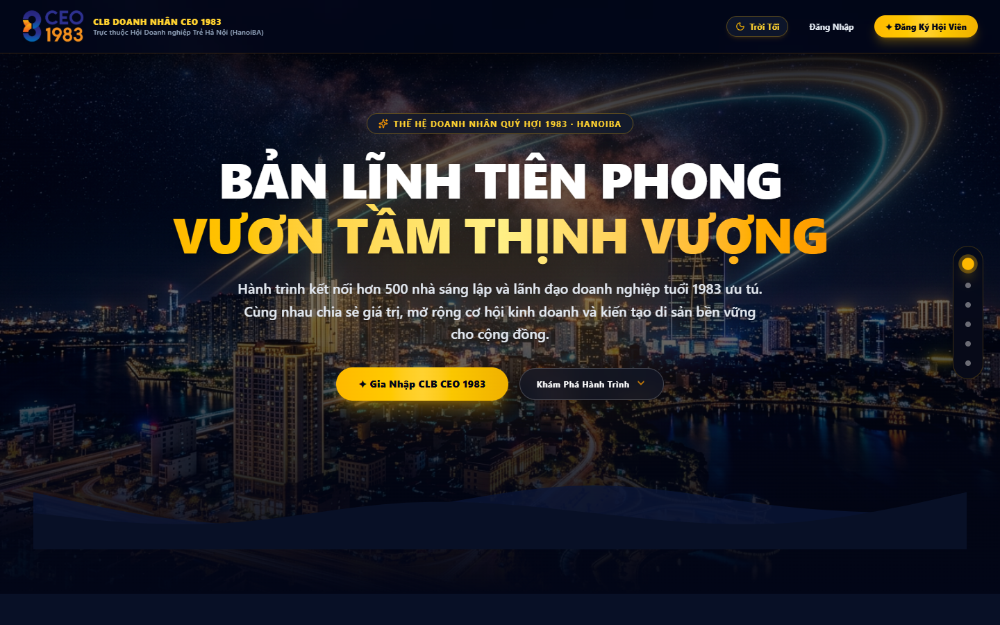
*Hình 2.1: Giao diện Hero Section Landing Web với Hoạt ảnh Pop-up 4.8s Doanh nhân & Smartphone 3D*

---

### 2.2. Bảng Use Case UC-VN-PUB-02: Khám Phá Mô Đun Liên Kết & Kiến Trúc Hợp Nhất 4 Trụ Cột

| Thuộc Tính Nghiệp Vụ | Nội Dung Đặc Tả Chi Tiết |
| :--- | :--- |
| **Mã Use Case (ID)** | **UC-VN-PUB-02** |
| **Phân Hệ / Nhóm** | Cổng Thông Tin Công Khai |
| **Tên Chức Năng** | Khám Phá Mô Đun Liên Kết & Kiến Trúc Hợp Nhất 4 Trụ Cột |
| **Người Dùng (Actor)** | Khách vãng lai, Giám đốc điều hành |
| **Tiền Điều Kiện (Pre-conditions)** | Cuộn xuống mục Mô Đun |
| **Luồng Xử Lý Chính (Main Flow)** | 1. Xem 4 khối phân hệ: CRM, Work, Finance, HRM. 2. Rê chuột xem viền vàng hoàng gia và mô tả tính năng chuyên sâu. 3. Bấm xem sơ đồ dòng chảy dữ liệu đồng nhất giữa 4 phân hệ. |
| **Luồng Thay Thế / Ngoại Lệ** | Chuyển tab bằng phím mũi tên trái/phải. |
| **Hậu Điều Kiện (Post-conditions)** | Nắm rõ kiến trúc dữ liệu tập trung, xóa bỏ phân mảnh. |
| **Hình Ảnh Minh Chứng** | Sơ đồ Kiến trúc Hợp nhất 4 Phân hệ Cốt lõi: CRM, Work, Finance và HRM (`02_landing_cinematic.png`) |

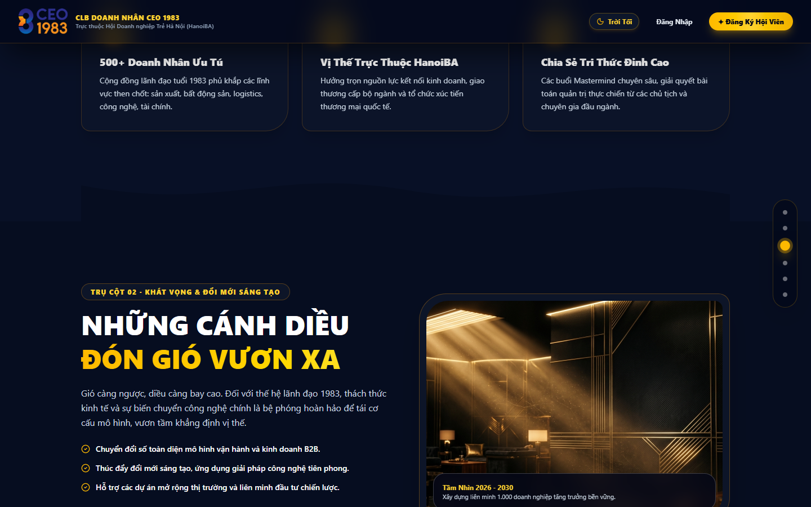
*Hình 2.2: Sơ đồ Kiến trúc Hợp nhất 4 Phân hệ Cốt lõi: CRM, Work, Finance và HRM*

---

### 2.3. Bảng Use Case UC-VN-PUB-03: Trải Nghiệm Bộ Máy Tự Động Hóa Quy Trình AI Workflow Copilot

| Thuộc Tính Nghiệp Vụ | Nội Dung Đặc Tả Chi Tiết |
| :--- | :--- |
| **Mã Use Case (ID)** | **UC-VN-PUB-03** |
| **Phân Hệ / Nhóm** | Cổng Thông Tin Công Khai |
| **Tên Chức Năng** | Trải Nghiệm Bộ Máy Tự Động Hóa Quy Trình AI Workflow Copilot |
| **Người Dùng (Actor)** | Chuyên viên Vận hành, Giám đốc COO |
| **Tiền Điều Kiện (Pre-conditions)** | Cuộn tới mục AI Workflow |
| **Luồng Xử Lý Chính (Main Flow)** | 1. Xem mô hình trực quan Trigger -> AI Analysis -> Multi-channel Action. 2. Thử nghiệm kịch bản mẫu tiếp nhận Lead và gửi báo giá tự động trong 60s. 3. Quan sát mô phỏng thông báo đồng thời đến CRM và mobile app. |
| **Luồng Thay Thế / Ngoại Lệ** | Chọn kịch bản khác: Duyệt chi tài chính hoặc Cảnh báo quá hạn. |
| **Hậu Điều Kiện (Post-conditions)** | Nắm rõ năng lực cắt giảm 40% chi phí vận hành. |
| **Hình Ảnh Minh Chứng** | Mô hình Trực quan Hóa Bộ Máy Tự Động Hóa Quy Trình Đa Kênh AI Workflow Copilot (`workflow-automation.png`) |

*Hình 2.3: Mô hình Trực quan Hóa Bộ Máy Tự Động Hóa Quy Trình Đa Kênh AI Workflow Copilot*

---

### 2.4. Bảng Use Case UC-VN-PUB-04: Xem Trung Tâm Giám Sát Vận Hành & Đo Lường SLA Thời Gian Thực

| Thuộc Tính Nghiệp Vụ | Nội Dung Đặc Tả Chi Tiết |
| :--- | :--- |
| **Mã Use Case (ID)** | **UC-VN-PUB-04** |
| **Phân Hệ / Nhóm** | Cổng Thông Tin Công Khai |
| **Tên Chức Năng** | Xem Trung Tâm Giám Sát Vận Hành & Đo Lường SLA Thời Gian Thực |
| **Người Dùng (Actor)** | Ban Giám Đốc, Giám đốc CFO |
| **Tiền Điều Kiện (Pre-conditions)** | Quan sát khu vực Giám sát |
| **Luồng Xử Lý Chính (Main Flow)** | 1. Xem mô phỏng màn hình giám sát máy tính chuẩn doanh nghiệp. 2. Quan sát đồ thị đo SLA < 150ms và uptime máy chủ 99.98%. 3. Đọc số liệu doanh thu thực, công nợ và tiến độ KPI. |
| **Luồng Thay Thế / Ngoại Lệ** | Phóng to ảnh xem chi tiết đồ thị. |
| **Hậu Điều Kiện (Post-conditions)** | Yên tâm về năng lực kiểm soát dữ liệu 24/7. |
| **Hình Ảnh Minh Chứng** | Trung Tâm Giám Sát Vận Hành Tổng Thể & Đo Lường Chỉ Số KPI Doanh Nghiệp Thời Gian Thực (`operational-dashboard.png`) |

*Hình 2.4: Trung Tâm Giám Sát Vận Hành Tổng Thể & Đo Lường Chỉ Số KPI Doanh Nghiệp Thời Gian Thực*

---

### 2.5. Bảng Use Case UC-VN-PUB-05: Khám Phá Quy Trình 3 Bước Thiết Lập Tự Động Siêu Tốc Trong 5 Phút

| Thuộc Tính Nghiệp Vụ | Nội Dung Đặc Tả Chi Tiết |
| :--- | :--- |
| **Mã Use Case (ID)** | **UC-VN-PUB-05** |
| **Phân Hệ / Nhóm** | Cổng Thông Tin Công Khai |
| **Tên Chức Năng** | Khám Phá Quy Trình 3 Bước Thiết Lập Tự Động Siêu Tốc Trong 5 Phút |
| **Người Dùng (Actor)** | Chủ Doanh Nghiệp, Quản trị viên |
| **Tiền Điều Kiện (Pre-conditions)** | Xem mục 3 Bước Thiết lập |
| **Luồng Xử Lý Chính (Main Flow)** | 1. Xem Bước 01 Trigger: Kết nối nguồn kích hoạt (Web form, Fanpage, Zalo). 2. Xem Bước 02 Actions: Định cấu hình điều kiện tự động kéo thả không code. 3. Xem Bước 03 Monitor: Kích hoạt giám sát và nhận báo cáo định kỳ. |
| **Luồng Thay Thế / Ngoại Lệ** | Xem tài liệu hướng dẫn triển khai nhanh. |
| **Hậu Điều Kiện (Post-conditions)** | Xóa bỏ rào cản sợ phần mềm phức tạp lâu năm. |
| **Hình Ảnh Minh Chứng** | Quy Trình 3 Bước Thiết Lập Vận Hành Siêu Tốc Trong 5 Phút (`business-laptop.png`) |

*Hình 2.5: Quy Trình 3 Bước Thiết Lập Vận Hành Siêu Tốc Trong 5 Phút*

---

### 2.6. Bảng Use Case UC-VN-PUB-06: Đánh Giá 4 Trụ Cột Giá Trị Cốt Lõi & Tiêu Chuẩn Bảo Mật AES-256

| Thuộc Tính Nghiệp Vụ | Nội Dung Đặc Tả Chi Tiết |
| :--- | :--- |
| **Mã Use Case (ID)** | **UC-VN-PUB-06** |
| **Phân Hệ / Nhóm** | Cổng Thông Tin Công Khai |
| **Tên Chức Năng** | Đánh Giá 4 Trụ Cột Giá Trị Cốt Lõi & Tiêu Chuẩn Bảo Mật AES-256 |
| **Người Dùng (Actor)** | Giám đốc CISO, Chuyên gia pháp chế |
| **Tiền Điều Kiện (Pre-conditions)** | Xem mục Giá Trị Doanh Nghiệp |
| **Luồng Xử Lý Chính (Main Flow)** | 1. Đọc 4 trụ cột: Giảm chi phí, Data-driven, Trải nghiệm, Bảo mật. 2. Kiểm tra chứng chỉ mã hóa cơ sở dữ liệu AES-256, TLS 1.3. 3. Xem cam kết SLA bồi hoàn nếu gián đoạn dịch vụ. |
| **Luồng Thay Thế / Ngoại Lệ** | Yêu cầu gửi Bản cáo bạch An toàn thông tin qua email. |
| **Hậu Điều Kiện (Post-conditions)** | Xác thực độ tin cậy và pháp lý của ViOne. |
| **Hình Ảnh Minh Chứng** | Trụ Cột Giá Trị Cốt Lõi & Tiêu Chuẩn An Toàn Bảo Mật Đa Tầng Cấp Doanh Nghiệp (`01_crm_login_blue_white.png`) |

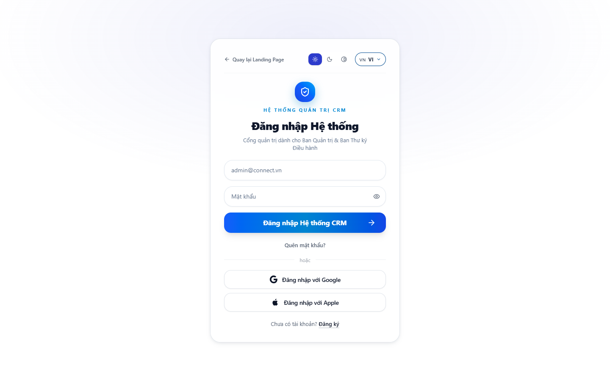
*Hình 2.6: Trụ Cột Giá Trị Cốt Lõi & Tiêu Chuẩn An Toàn Bảo Mật Đa Tầng Cấp Doanh Nghiệp*

---

### 2.7. Bảng Use Case UC-VN-PUB-07: Khám Phá Mô Hình Giải Pháp Phù Hợp Đa Dạng Mô Hình Ngành Nghề

| Thuộc Tính Nghiệp Vụ | Nội Dung Đặc Tả Chi Tiết |
| :--- | :--- |
| **Mã Use Case (ID)** | **UC-VN-PUB-07** |
| **Phân Hệ / Nhóm** | Cổng Thông Tin Công Khai |
| **Tên Chức Năng** | Khám Phá Mô Hình Giải Pháp Phù Hợp Đa Dạng Mô Hình Ngành Nghề |
| **Người Dùng (Actor)** | Chủ doanh nghiệp các ngành |
| **Tiền Điều Kiện (Pre-conditions)** | Xem mục Giải Pháp Ngành Nghề |
| **Luồng Xử Lý Chính (Main Flow)** | 1. Xem giải pháp ngành Thương mại & Dịch vụ: Hợp đồng, Kanban việc. 2. Xem giải pháp ngành Chuỗi & Bán lẻ: Đối soát doanh thu, VietQR. 3. Xem giải pháp ngành Sản xuất & Phân phối: Đại lý B2B, Catalog. |
| **Luồng Thay Thế / Ngoại Lệ** | Nhấp từng tab ngành xem chi tiết tính năng. |
| **Hậu Điều Kiện (Post-conditions)** | Hình dung trọn vẹn bài toán của công ty mình. |
| **Hình Ảnh Minh Chứng** | Giải Pháp Số Hóa Vận Hành May Đo Theo Đa Dạng Nhóm Ngành Nghề (`business-laptop.png`) |

*Hình 2.7: Giải Pháp Số Hóa Vận Hành May Đo Theo Đa Dạng Nhóm Ngành Nghề*

---

### 2.8. Bảng Use Case UC-VN-PUB-08: Tra Cứu Đánh Giá Của Khách Hàng Lãnh Đạo Tiêu Biểu (Testimonials)

| Thuộc Tính Nghiệp Vụ | Nội Dung Đặc Tả Chi Tiết |
| :--- | :--- |
| **Mã Use Case (ID)** | **UC-VN-PUB-08** |
| **Phân Hệ / Nhóm** | Cổng Thông Tin Công Khai |
| **Tên Chức Năng** | Tra Cứu Đánh Giá Của Khách Hàng Lãnh Đạo Tiêu Biểu (Testimonials) |
| **Người Dùng (Actor)** | Khách hàng tiềm năng |
| **Tiền Điều Kiện (Pre-conditions)** | Xem phần Testimonials |
| **Luồng Xử Lý Chính (Main Flow)** | 1. Xem ảnh chân dung và nhận xét của TGĐ Nguyễn Minh Đăng. 2. Đọc kết quả: Quản lý 5 chi nhánh trực tiếp trên smartphone. 3. Quan sát logo các tập đoàn, hiệp hội tiêu biểu. |
| **Luồng Thay Thế / Ngoại Lệ** | Vuốt xem qua lại giữa các câu chuyện thành công. |
| **Hậu Điều Kiện (Post-conditions)** | Gia tăng niềm tin và động lực đăng ký tư vấn. |
| **Hình Ảnh Minh Chứng** | Chia Sẻ Đánh Giá Thực Tế Từ Lãnh Đạo Doanh Nghiệp Đang Vận Hành Hệ Thống ViOne (`avatar-ceo.png`) |

*Hình 2.8: Chia Sẻ Đánh Giá Thực Tế Từ Lãnh Đạo Doanh Nghiệp Đang Vận Hành Hệ Thống ViOne*

---

### 2.9. Bảng Use Case UC-VN-PUB-09: Tham Khảo Cấu Trúc Bảng Giá Dịch Vụ Tùy Biến 3 Gói Giải Pháp

| Thuộc Tính Nghiệp Vụ | Nội Dung Đặc Tả Chi Tiết |
| :--- | :--- |
| **Mã Use Case (ID)** | **UC-VN-PUB-09** |
| **Phân Hệ / Nhóm** | Cổng Thông Tin Công Khai |
| **Tên Chức Năng** | Tham Khảo Cấu Trúc Bảng Giá Dịch Vụ Tùy Biến 3 Gói Giải Pháp |
| **Người Dùng (Actor)** | Đại diện bộ phận thu mua |
| **Tiền Điều Kiện (Pre-conditions)** | Xem mục Bảng Giá Dịch Vụ |
| **Luồng Xử Lý Chính (Main Flow)** | 1. Xem 3 gói: Starter (Khởi tạo), Growth (Tăng trưởng), Enterprise (Doanh nghiệp lớn). 2. Đọc chi tiết danh mục tính năng mở khóa theo quy mô nhân sự. 3. Ghi nhận chính sách không hiển thị giá cứng, cam kết tư vấn may đo. 4. Bấm nút CTA Yêu cầu báo giá trên gói phù hợp. |
| **Luồng Thay Thế / Ngoại Lệ** | Bật tắt bảng so sánh đối chiếu tính năng giữa các gói. |
| **Hậu Điều Kiện (Post-conditions)** | Xác định gói giải pháp mục tiêu. |
| **Hình Ảnh Minh Chứng** | Cấu Trúc 3 Gói Giải Pháp Số Hóa Doanh Nghiệp & Chính Sách Báo Giá May Đo (`crm_dash_view_06.png`) |

*Hình 2.9: Cấu Trúc 3 Gói Giải Pháp Số Hóa Doanh Nghiệp & Chính Sách Báo Giá May Đo*

---

### 2.10. Bảng Use Case UC-VN-PUB-10: Mở & Điền Form Yêu Cầu Báo Giá & Tư Vấn 1-1 Chuyên Sâu

| Thuộc Tính Nghiệp Vụ | Nội Dung Đặc Tả Chi Tiết |
| :--- | :--- |
| **Mã Use Case (ID)** | **UC-VN-PUB-10** |
| **Phân Hệ / Nhóm** | Cổng Thông Tin Công Khai |
| **Tên Chức Năng** | Mở & Điền Form Yêu Cầu Báo Giá & Tư Vấn 1-1 Chuyên Sâu |
| **Người Dùng (Actor)** | Đại diện doanh nghiệp |
| **Tiền Điều Kiện (Pre-conditions)** | Bấm nút Yêu cầu báo giá |
| **Luồng Xử Lý Chính (Main Flow)** | 1. Mở Modal Hoàng gia Vàng Đồng sang trọng. 2. Nhập: Họ tên, Số điện thoại, Email, Tên công ty, Quy mô nhân sự, Nhu cầu. 3. Bấm Gửi yêu cầu báo giá. 4. Hệ thống validate và lưu vào bảng vione_quote_leads. 5. Hiển thị thông báo cảm ơn và cam kết liên hệ trong 15 phút. |
| **Luồng Thay Thế / Ngoại Lệ** | Báo lỗi đỏ nếu thiếu số điện thoại hoặc email sai định dạng. |
| **Hậu Điều Kiện (Post-conditions)** | Lead được ghi nhận và gửi thông báo cho đội ngũ tư vấn. |
| **Hình Ảnh Minh Chứng** | Cửa Sổ Modal Tiếp Nhận Yêu Cầu Báo Giá May Đo & Hồ Sơ Tư Vấn 1-1 (`live_02_member_registration_form_filled.png`) |

*Hình 2.10: Cửa Sổ Modal Tiếp Nhận Yêu Cầu Báo Giá May Đo & Hồ Sơ Tư Vấn 1-1*

---

### 2.11. Bảng Use Case UC-VN-PUB-11: Tra Cứu & Tìm Kiếm Câu Hỏi Thường Gặp (Interactive FAQ Accordion)

| Thuộc Tính Nghiệp Vụ | Nội Dung Đặc Tả Chi Tiết |
| :--- | :--- |
| **Mã Use Case (ID)** | **UC-VN-PUB-11** |
| **Phân Hệ / Nhóm** | Cổng Thông Tin Công Khai |
| **Tên Chức Năng** | Tra Cứu & Tìm Kiếm Câu Hỏi Thường Gặp (Interactive FAQ Accordion) |
| **Người Dùng (Actor)** | Khách vãng lai |
| **Tiền Điều Kiện (Pre-conditions)** | Xem phần FAQ |
| **Luồng Xử Lý Chính (Main Flow)** | 1. Xem danh sách câu hỏi: Thời gian triển khai, Tích hợp kế toán cũ, Bảo mật. 2. Bấm vào tiêu đề câu hỏi để mở rộng nội dung giải đáp. 3. Đọc chính sách sao lưu và xuất dữ liệu dự phòng. |
| **Luồng Thay Thế / Ngoại Lệ** | Tìm kiếm từ khóa câu hỏi trong thanh tìm kiếm nhanh. |
| **Hậu Điều Kiện (Post-conditions)** | Giải tỏa mọi băn khoăn trước khi đăng ký. |
| **Hình Ảnh Minh Chứng** | Khu Vực Hỏi Đáp Thường Gặp FAQ Với Hiệu Ứng Accordion Mở Rộng Linh Hoạt (`live_07_crm_member_detail_drawer.png`) |

*Hình 2.11: Khu Vực Hỏi Đáp Thường Gặp FAQ Với Hiệu Ứng Accordion Mở Rộng Linh Hoạt*

---

### 2.12. Bảng Use Case UC-VN-PUB-12: Tải Xuống Hồ Sơ Năng Lực Doanh Nghiệp (Company Profile PDF)

| Thuộc Tính Nghiệp Vụ | Nội Dung Đặc Tả Chi Tiết |
| :--- | :--- |
| **Mã Use Case (ID)** | **UC-VN-PUB-12** |
| **Phân Hệ / Nhóm** | Cổng Thông Tin Công Khai |
| **Tên Chức Năng** | Tải Xuống Hồ Sơ Năng Lực Doanh Nghiệp (Company Profile PDF) |
| **Người Dùng (Actor)** | Thư ký ban giám đốc, Thu mua |
| **Tiền Điều Kiện (Pre-conditions)** | Bấm nút Tải Hồ Sơ Năng Lực |
| **Luồng Xử Lý Chính (Main Flow)** | 1. Nhấp liên kết tải tài liệu. 2. Nhập nhanh email công ty nhận tài liệu. 3. Tải xuống file ViOne_Platform_Company_Profile_2026.pdf chất lượng cao. |
| **Luồng Thay Thế / Ngoại Lệ** | Gửi link tải dự phòng qua hòm thư điện tử nếu lỗi mạng. |
| **Hậu Điều Kiện (Post-conditions)** | Có tài liệu PDF chuyên nghiệp báo cáo cấp trên. |
| **Hình Ảnh Minh Chứng** | Giao Diện Trình Đọc & Tải Xuống Hồ Sơ Năng Lực PDF Chuẩn Doanh Nghiệp (`10_app_user_guide_pdf_viewer.png`) |

*Hình 2.12: Giao Diện Trình Đọc & Tải Xuống Hồ Sơ Năng Lực PDF Chuẩn Doanh Nghiệp*

---

### 2.13. Bảng Use Case UC-VN-PUB-13: Chuyển Đổi Giao Diện Đa Ngôn Ngữ (Tiếng Việt / English)

| Thuộc Tính Nghiệp Vụ | Nội Dung Đặc Tả Chi Tiết |
| :--- | :--- |
| **Mã Use Case (ID)** | **UC-VN-PUB-13** |
| **Phân Hệ / Nhóm** | Cổng Thông Tin Công Khai |
| **Tên Chức Năng** | Chuyển Đổi Giao Diện Đa Ngôn Ngữ (Tiếng Việt / English) |
| **Người Dùng (Actor)** | Đối tác quốc tế, Doanh nghiệp FDI |
| **Tiền Điều Kiện (Pre-conditions)** | Bấm biểu tượng ngôn ngữ Header |
| **Luồng Xử Lý Chính (Main Flow)** | 1. Chọn ngôn ngữ Tiếng Anh (EN). 2. Toàn bộ nội dung, nút bấm và form tự động đổi sang tiếng Anh. 3. Lưu lựa chọn ngôn ngữ vào LocalStorage của trình duyệt. |
| **Luồng Thay Thế / Ngoại Lệ** | Hệ thống tự nhận diện ngôn ngữ máy trạm khi vào lần đầu. |
| **Hậu Điều Kiện (Post-conditions)** | Phục vụ khách hàng toàn cầu và đối tác FDI. |
| **Hình Ảnh Minh Chứng** | Bộ Chuyển Đổi Ngôn Ngữ Song Ngữ Anh - Việt Trên Thanh Điều Hướng Header (`01_landing_hero.png`) |

*Hình 2.13: Bộ Chuyển Đổi Ngôn Ngữ Song Ngữ Anh - Việt Trên Thanh Điều Hướng Header*

---

### 2.14. Bảng Use Case UC-VN-PUB-14: Đăng Ký Nhận Bản Tin Xu Hướng Quản Trị & Chuyển Đổi Số

| Thuộc Tính Nghiệp Vụ | Nội Dung Đặc Tả Chi Tiết |
| :--- | :--- |
| **Mã Use Case (ID)** | **UC-VN-PUB-14** |
| **Phân Hệ / Nhóm** | Cổng Thông Tin Công Khai |
| **Tên Chức Năng** | Đăng Ký Nhận Bản Tin Xu Hướng Quản Trị & Chuyển Đổi Số |
| **Người Dùng (Actor)** | Chuyên viên quản lý, Doanh nhân |
| **Tiền Điều Kiện (Pre-conditions)** | Xem khu vực Footer |
| **Luồng Xử Lý Chính (Main Flow)** | 1. Nhập email vào ô Nhận bản tin quản trị. 2. Bấm nút Đăng Ký. 3. Hệ thống kiểm tra và lưu vào danh bạ gửi tin tự động. 4. Hiển thị thông báo cảm ơn và gửi tặng Ebook Quản trị. |
| **Luồng Thay Thế / Ngoại Lệ** | Báo thông báo nếu email đã tồn tại trong danh bạ. |
| **Hậu Điều Kiện (Post-conditions)** | Dữ liệu được lưu trữ an toàn cho Inbound Marketing. |
| **Hình Ảnh Minh Chứng** | Xác Nhận Đăng Ký Bản Tin Số Hóa Doanh Nghiệp & Tự Động Gửi Email Chào Mừng (`05_email_credentials_sent.png`) |

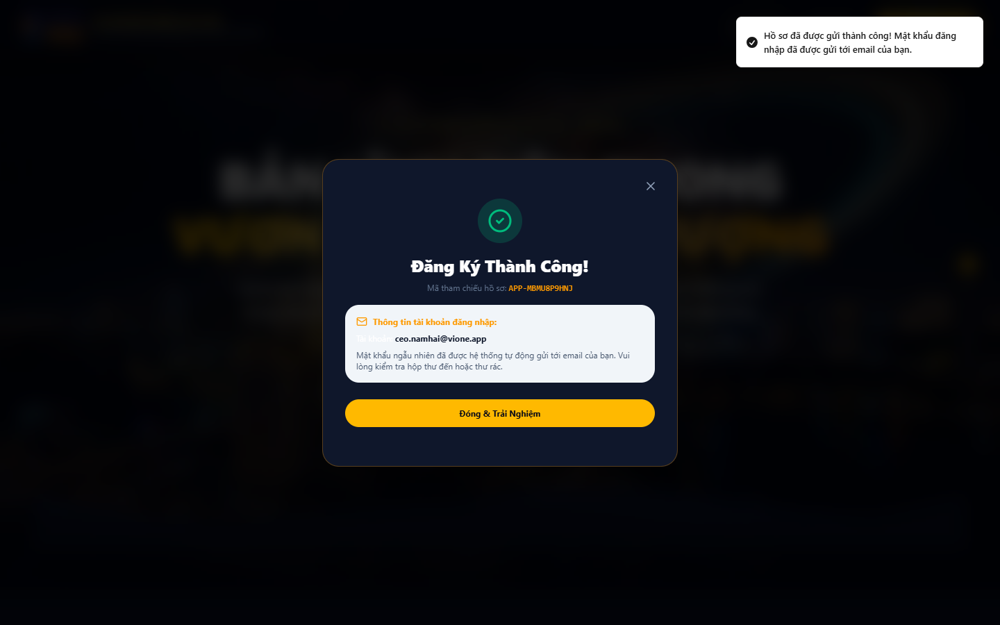
*Hình 2.14: Xác Nhận Đăng Ký Bản Tin Số Hóa Doanh Nghiệp & Tự Động Gửi Email Chào Mừng*

---

### 2.15. Bảng Use Case UC-VN-PUB-15: Tra Cứu Thông Tin Pháp Lý, Điều Khoản Dịch Vụ & Chính Sách Bảo Mật

| Thuộc Tính Nghiệp Vụ | Nội Dung Đặc Tả Chi Tiết |
| :--- | :--- |
| **Mã Use Case (ID)** | **UC-VN-PUB-15** |
| **Phân Hệ / Nhóm** | Cổng Thông Tin Công Khai |
| **Tên Chức Năng** | Tra Cứu Thông Tin Pháp Lý, Điều Khoản Dịch Vụ & Chính Sách Bảo Mật |
| **Người Dùng (Actor)** | Chuyên viên pháp chế doanh nghiệp |
| **Tiền Điều Kiện (Pre-conditions)** | Bấm liên kết Điều khoản tại Footer |
| **Luồng Xử Lý Chính (Main Flow)** | 1. Mở trang pháp lý chính thức. 2. Xem quy định: Khách hàng sở hữu 100% dữ liệu, không chia sẻ bên thứ ba. 3. Xem quy trình tiêu hủy dữ liệu khi thanh lý hợp đồng. |
| **Luồng Thay Thế / Ngoại Lệ** | Hỗ trợ in ấn văn bản pháp lý với định dạng in sạch. |
| **Hậu Điều Kiện (Post-conditions)** | Doanh nghiệp an tâm tuyệt đối về mặt pháp lý. |
| **Hình Ảnh Minh Chứng** | Trang Điều Khoản Dịch Vụ & Chính Sách Bảo Mật Dữ Liệu Doanh Nghiệp Chuẩn Mực (`02_crm_members_roles_permission.png`) |

*Hình 2.15: Trang Điều Khoản Dịch Vụ & Chính Sách Bảo Mật Dữ Liệu Doanh Nghiệp Chuẩn Mực*

---

### 2.16. Bảng Use Case UC-VN-CRM-01: Đăng Nhập Cổng Quản Trị CRM & Xác Thực Đa Lớp (2FA)

| Thuộc Tính Nghiệp Vụ | Nội Dung Đặc Tả Chi Tiết |
| :--- | :--- |
| **Mã Use Case (ID)** | **UC-VN-CRM-01** |
| **Phân Hệ / Nhóm** | Phân Hệ CRM & Quản Trị Khách Hàng |
| **Tên Chức Năng** | Đăng Nhập Cổng Quản Trị CRM & Xác Thực Đa Lớp (2FA) |
| **Người Dùng (Actor)** | Tất cả người dùng quản trị |
| **Tiền Điều Kiện (Pre-conditions)** | Có tài khoản quản trị được cấp |
| **Luồng Xử Lý Chính (Main Flow)** | 1. Mở Cổng Quản trị CRM tại https://vione.ai/auth. 2. Nhập Email và Mật khẩu bảo mật. 3. Nhập mã OTP 6 số từ ứng dụng xác thực Google Authenticator. 4. Hệ thống kiểm tra thông tin, tạo phiên JWT và điều hướng vào trang chủ Dashboard. |
| **Luồng Thay Thế / Ngoại Lệ** | Nếu nhập sai mật khẩu 5 lần, tài khoản tạm khóa 15 phút. |
| **Hậu Điều Kiện (Post-conditions)** | Khởi tạo phiên làm việc mã hóa thành công. |
| **Hình Ảnh Minh Chứng** | Màn Hình Đăng Nhập Cổng Quản Trị CRM ViOne & Xác Thực Hai Lớp 2FA (`03_crm_login_page.png`) |

*Hình 2.16: Màn Hình Đăng Nhập Cổng Quản Trị CRM ViOne & Xác Thực Hai Lớp 2FA*

---

### 2.17. Bảng Use Case UC-VN-CRM-02: Xem Bảng Điều Khiển Tổng Quan Doanh Số & KPI Điều Hành

| Thuộc Tính Nghiệp Vụ | Nội Dung Đặc Tả Chi Tiết |
| :--- | :--- |
| **Mã Use Case (ID)** | **UC-VN-CRM-02** |
| **Phân Hệ / Nhóm** | Phân Hệ CRM & Quản Trị Khách Hàng |
| **Tên Chức Năng** | Xem Bảng Điều Khiển Tổng Quan Doanh Số & KPI Điều Hành |
| **Người Dùng (Actor)** | Ban Giám Đốc, Trưởng phòng Kinh doanh |
| **Tiền Điều Kiện (Pre-conditions)** | Đăng nhập với quyền xem Dashboard |
| **Luồng Xử Lý Chính (Main Flow)** | 1. Truy cập trang chủ CRM. 2. Xem các chỉ số KPI: Doanh thu lũy kế, Tỷ lệ chốt đơn, Số lượng Deal đang mở. 3. Xem biểu đồ cột so sánh doanh số theo từng tuần trong tháng. 4. Xem danh sách top 5 nhân viên kinh doanh xuất sắc nhất. |
| **Luồng Thay Thế / Ngoại Lệ** | Có thể chọn bộ lọc thời gian: Hôm nay, Tuần này, Tháng này, Quý này. |
| **Hậu Điều Kiện (Post-conditions)** | Nắm bắt tức thì bức tranh kinh doanh tổng thể. |
| **Hình Ảnh Minh Chứng** | Bảng Điều Khiển Tổng Quan Doanh Số & Giám Sát Chỉ Số KPI Bán Hàng Realtime (`crm1983_02_dashboard_overview.png`) |

*Hình 2.17: Bảng Điều Khiển Tổng Quan Doanh Số & Giám Sát Chỉ Số KPI Bán Hàng Realtime*

---

### 2.18. Bảng Use Case UC-VN-CRM-03: Thêm Mới Hồ Sơ Khách Hàng Doanh Nghiệp B2B

| Thuộc Tính Nghiệp Vụ | Nội Dung Đặc Tả Chi Tiết |
| :--- | :--- |
| **Mã Use Case (ID)** | **UC-VN-CRM-03** |
| **Phân Hệ / Nhóm** | Phân Hệ CRM & Quản Trị Khách Hàng |
| **Tên Chức Năng** | Thêm Mới Hồ Sơ Khách Hàng Doanh Nghiệp B2B |
| **Người Dùng (Actor)** | Nhân viên Kinh doanh, Trưởng nhóm Sales |
| **Tiền Điều Kiện (Pre-conditions)** | Có quyền tạo mới khách hàng |
| **Luồng Xử Lý Chính (Main Flow)** | 1. Nhấn nút "Thêm Mới Khách Hàng" tại màn hình Khách hàng. 2. Nhập thông tin: Tên công ty, Mã số thuế, Người đại diện, Số điện thoại, Email, Địa chỉ. 3. Gán nhóm ngành nghề và quy mô nhân sự. 4. Bấm "Lưu Hồ Sơ". Hệ thống kiểm tra trùng lặp mã số thuế/số điện thoại. 5. Lưu trữ bản ghi vào PostgreSQL và hiển thị hồ sơ chi tiết. |
| **Luồng Thay Thế / Ngoại Lệ** | Nếu trùng mã số thuế, hệ thống cảnh báo và hiển thị link tới hồ sơ đã tồn tại. |
| **Hậu Điều Kiện (Post-conditions)** | Hồ sơ khách hàng mới sẵn sàng cho các hoạt động chăm sóc. |
| **Hình Ảnh Minh Chứng** | Giao Diện Quản Lý Danh Sách & Thêm Mới Hồ Sơ Khách Hàng Doanh Nghiệp (`04_crm_members_management.png`) |

*Hình 2.18: Giao Diện Quản Lý Danh Sách & Thêm Mới Hồ Sơ Khách Hàng Doanh Nghiệp*

---

### 2.19. Bảng Use Case UC-VN-CRM-04: Nhập Khẩu Danh Sách Khách Hàng Hàng Loạt Từ Excel/CSV

| Thuộc Tính Nghiệp Vụ | Nội Dung Đặc Tả Chi Tiết |
| :--- | :--- |
| **Mã Use Case (ID)** | **UC-VN-CRM-04** |
| **Phân Hệ / Nhóm** | Phân Hệ CRM & Quản Trị Khách Hàng |
| **Tên Chức Năng** | Nhập Khẩu Danh Sách Khách Hàng Hàng Loạt Từ Excel/CSV |
| **Người Dùng (Actor)** | Trưởng phòng Kinh doanh, Quản trị viên CRM |
| **Tiền Điều Kiện (Pre-conditions)** | Có tệp dữ liệu khách hàng Excel chuẩn mẫu |
| **Luồng Xử Lý Chính (Main Flow)** | 1. Nhấn nút "Nhập Khẩu (Import)" trên danh sách khách hàng. 2. Tải tệp mẫu `vione_customer_template.xlsx` về máy nếu chưa có. 3. Tải lên tệp danh sách khách hàng. 4. Hệ thống hiển thị bảng ánh xạ cột (Field Mapping) và kiểm tra lỗi cú pháp. 5. Nhấn "Bắt đầu nhập khẩu". Hệ thống xử lý hàng loạt 1,000 khách hàng trong 3 giây. |
| **Luồng Thay Thế / Ngoại Lệ** | Báo cáo danh sách các dòng bị lỗi để tải về tệp sửa lỗi. |
| **Hậu Điều Kiện (Post-conditions)** | Dữ liệu khách hàng được bổ sung nhanh chóng vào hệ thống. |
| **Hình Ảnh Minh Chứng** | Quy Trình Nhập Khẩu Danh Sách Khách Hàng Doanh Nghiệp Bằng Tệp Excel (`18_crm_marketplace_sync.png`) |

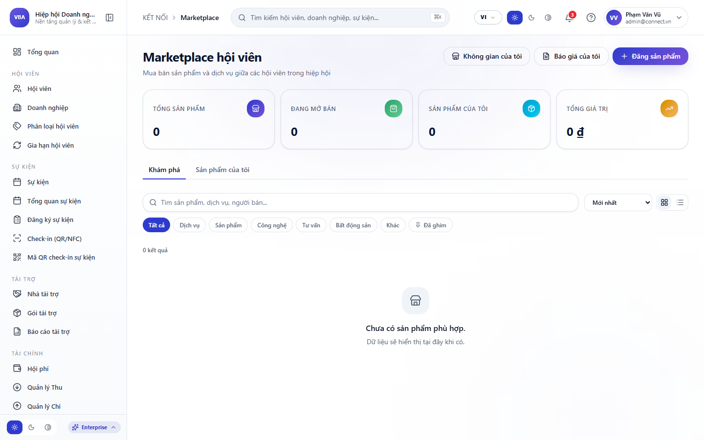
*Hình 2.19: Quy Trình Nhập Khẩu Danh Sách Khách Hàng Doanh Nghiệp Bằng Tệp Excel*

---

### 2.20. Bảng Use Case UC-VN-CRM-05: Xem Hồ Sơ Khách Hàng Toàn Diện 360 Độ (Customer 360 View)

| Thuộc Tính Nghiệp Vụ | Nội Dung Đặc Tả Chi Tiết |
| :--- | :--- |
| **Mã Use Case (ID)** | **UC-VN-CRM-05** |
| **Phân Hệ / Nhóm** | Phân Hệ CRM & Quản Trị Khách Hàng |
| **Tên Chức Năng** | Xem Hồ Sơ Khách Hàng Toàn Diện 360 Độ (Customer 360 View) |
| **Người Dùng (Actor)** | Nhân viên Chăm sóc Khách hàng, Trưởng phòng Sales |
| **Tiền Điều Kiện (Pre-conditions)** | Khách hàng đã tồn tại trên hệ thống |
| **Luồng Xử Lý Chính (Main Flow)** | 1. Nhấp vào tên khách hàng từ danh sách. 2. Màn hình trượt (Drawer) hiển thị hồ sơ 360 độ: Thông tin chung, Lịch sử cuộc gọi, Báo giá đã gửi, Hợp đồng đã ký, Công nợ hiện tại. 3. Xem dòng thời gian tương tác (Activity Timeline) sắp xếp theo thời gian mới nhất. 4. Thêm ghi chú nhanh hoặc đặt lịch hẹn tiếp theo. |
| **Luồng Thay Thế / Ngoại Lệ** | Có thể thu nhỏ hoặc mở rộng drawer ra toàn màn hình. |
| **Hậu Điều Kiện (Post-conditions)** | Nhân sự nắm bắt toàn bộ ngữ cảnh quan hệ khách hàng trong 10 giây. |
| **Hình Ảnh Minh Chứng** | Màn Hình Drawer Tra Cứu Hồ Sơ Khách Hàng 360 Độ & Lịch Sử Tương Tác (`live_07_crm_member_detail_drawer.png`) |

*Hình 2.20: Màn Hình Drawer Tra Cứu Hồ Sơ Khách Hàng 360 Độ & Lịch Sử Tương Tác*

---

### 2.21. Bảng Use Case UC-VN-CRM-06: Phân Loại Khách Hàng Theo Thẻ (Tags) & Ngành Nghề Động

| Thuộc Tính Nghiệp Vụ | Nội Dung Đặc Tả Chi Tiết |
| :--- | :--- |
| **Mã Use Case (ID)** | **UC-VN-CRM-06** |
| **Phân Hệ / Nhóm** | Phân Hệ CRM & Quản Trị Khách Hàng |
| **Tên Chức Năng** | Phân Loại Khách Hàng Theo Thẻ (Tags) & Ngành Nghề Động |
| **Người Dùng (Actor)** | Nhân viên Marketing, Trưởng phòng Kinh doanh |
| **Tiền Điều Kiện (Pre-conditions)** | Có quyền chỉnh sửa khách hàng |
| **Luồng Xử Lý Chính (Main Flow)** | 1. Mở hồ sơ khách hàng cần gắn nhãn. 2. Chọn hoặc tạo mới thẻ gắn nhãn (Tags) như: "VIP", "Hội viên Kim Cương", "Tiềm năng lớn". 3. Chọn phân loại nhóm ngành nghề (Sản xuất, Dịch vụ, Thương mại). 4. Bấm Lưu. Hệ thống tự động đồng bộ nhãn qua bộ lọc tìm kiếm. |
| **Luồng Thay Thế / Ngoại Lệ** | Có thể gắn nhãn hàng loạt cho 50 khách hàng cùng lúc. |
| **Hậu Điều Kiện (Post-conditions)** | Phục vụ chiến dịch tiếp thị phân khúc chính xác. |
| **Hình Ảnh Minh Chứng** | Cấu Hình Hệ Thống Thẻ Nhãn (Tags) Phân Loại Khách Hàng Doanh Nghiệp (`02_crm_members_roles_permission.png`) |

*Hình 2.21: Cấu Hình Hệ Thống Thẻ Nhãn (Tags) Phân Loại Khách Hàng Doanh Nghiệp*

---

### 2.22. Bảng Use Case UC-VN-CRM-07: Tiếp Nhận & Phân Bổ Lead Tự Động Theo Vòng Tròn (Round-Robin)

| Thuộc Tính Nghiệp Vụ | Nội Dung Đặc Tả Chi Tiết |
| :--- | :--- |
| **Mã Use Case (ID)** | **UC-VN-CRM-07** |
| **Phân Hệ / Nhóm** | Phân Hệ CRM & Quản Trị Khách Hàng |
| **Tên Chức Năng** | Tiếp Nhận & Phân Bổ Lead Tự Động Theo Vòng Tròn (Round-Robin) |
| **Người Dùng (Actor)** | Trưởng phòng Kinh doanh, Hệ thống AI tự động |
| **Tiền Điều Kiện (Pre-conditions)** | Có khách hàng mới điền form từ Landing page |
| **Luồng Xử Lý Chính (Main Flow)** | 1. Lead mới từ `vione_quote_leads` đổ về hệ thống. 2. Bộ máy tự động hóa kiểm tra điều kiện quy tắc: Nhóm ngành, Địa bàn khu vực. 3. Hệ thống phân bổ tự động cho nhân viên Sales theo thứ tự xoay vòng Round-Robin. 4. Bắn thông báo đẩy tức thì tới ứng dụng di động của nhân viên được gán việc. |
| **Luồng Thay Thế / Ngoại Lệ** | Nếu nhân viên đang nghỉ phép, tự động chuyển lead sang nhân viên kế tiếp. |
| **Hậu Điều Kiện (Post-conditions)** | Thời gian tiếp cận khách hàng mới rút ngắn dưới 5 phút. |
| **Hình Ảnh Minh Chứng** | Cơ Chế Phân Bổ Khách Hàng Tiềm Năng Tự Động Cho Đội Ngũ Kinh Doanh (`workflow-automation.png`) |

*Hình 2.22: Cơ Chế Phân Bổ Khách Hàng Tiềm Năng Tự Động Cho Đội Ngũ Kinh Doanh*

---

### 2.23. Bảng Use Case UC-VN-CRM-08: Chuyển Đổi Khách Hàng Tiềm Năng Thành Cơ Hội Bán Hàng (Deal)

| Thuộc Tính Nghiệp Vụ | Nội Dung Đặc Tả Chi Tiết |
| :--- | :--- |
| **Mã Use Case (ID)** | **UC-VN-CRM-08** |
| **Phân Hệ / Nhóm** | Phân Hệ CRM & Quản Trị Khách Hàng |
| **Tên Chức Năng** | Chuyển Đổi Khách Hàng Tiềm Năng Thành Cơ Hội Bán Hàng (Deal) |
| **Người Dùng (Actor)** | Nhân viên Kinh doanh phụ trách Lead |
| **Tiền Điều Kiện (Pre-conditions)** | Lead đã được liên hệ và có nhu cầu mua |
| **Luồng Xử Lý Chính (Main Flow)** | 1. Mở hồ sơ Lead đã thẩm định. 2. Nhấn nút "Chuyển Đổi Thành Cơ Hội (Convert to Deal)". 3. Nhập giá trị thương vụ ước tính, chọn gói sản phẩm dịch vụ quan tâm. 4. Chọn ngày dự kiến chốt hợp đồng và tỷ lệ khả thi. 5. Bấm Xác nhận. Hệ thống tạo Deal mới trên bảng Pipeline và lưu liên kết với khách hàng. |
| **Luồng Thay Thế / Ngoại Lệ** | Có thể lựa chọn tạo đồng thời Báo giá nháp ngay lúc chuyển đổi. |
| **Hậu Điều Kiện (Post-conditions)** | Cơ hội bán hàng xuất hiện trên bảng Kanban bán hàng. |
| **Hình Ảnh Minh Chứng** | Quy Trình Chuyển Đổi Lead Tiềm Năng Sang Cơ Hội Bán Hàng Trọng Điểm (`05_crm_member_approved.png`) |

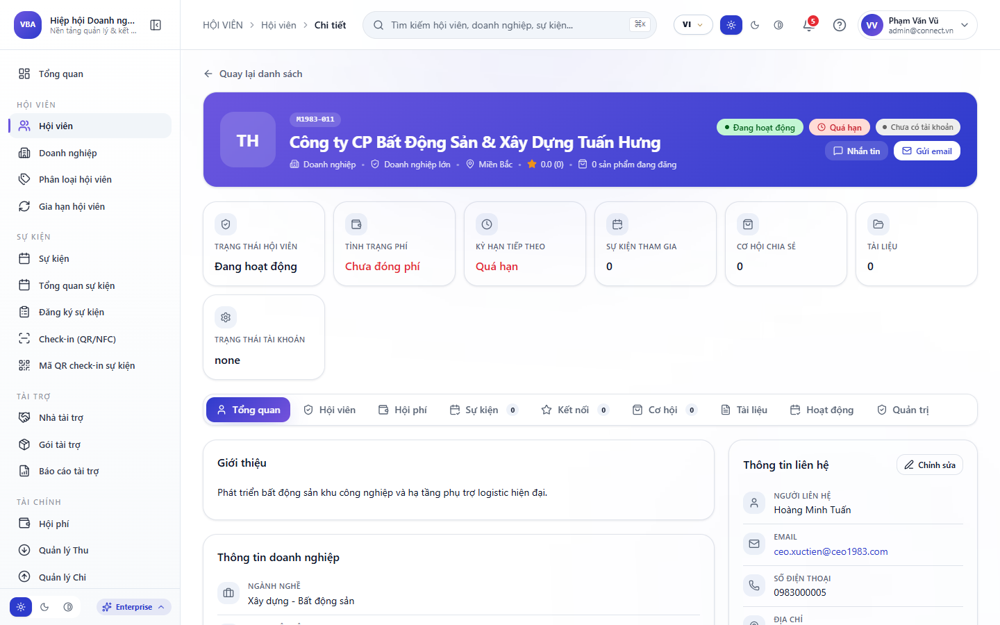
*Hình 2.23: Quy Trình Chuyển Đổi Lead Tiềm Năng Sang Cơ Hội Bán Hàng Trọng Điểm*

---

### 2.24. Bảng Use Case UC-VN-CRM-09: Quản Lý Đường Ống Bán Hàng (Sales Pipeline Kanban Board)

| Thuộc Tính Nghiệp Vụ | Nội Dung Đặc Tả Chi Tiết |
| :--- | :--- |
| **Mã Use Case (ID)** | **UC-VN-CRM-09** |
| **Phân Hệ / Nhóm** | Phân Hệ CRM & Quản Trị Khách Hàng |
| **Tên Chức Năng** | Quản Lý Đường Ống Bán Hàng (Sales Pipeline Kanban Board) |
| **Người Dùng (Actor)** | Nhân viên Sales, Trưởng phòng Kinh doanh |
| **Tiền Điều Kiện (Pre-conditions)** | Có danh sách Deal đang hoạt động |
| **Luồng Xử Lý Chính (Main Flow)** | 1. Truy cập phân hệ Cơ Hội Bán Hàng dạng bảng Kanban. 2. Xem các cột giai đoạn: Tiếp cận -> Khảo sát nhu cầu -> Gửi báo giá -> Đàm phán hợp đồng -> Chốt thành công (Won) / Thất bại (Lost). 3. Kéo thả thẻ Deal từ cột này sang cột khác khi tiến độ thay đổi. 4. Tổng giá trị tiền tệ của từng cột tự động cập nhật ngay lập tức. |
| **Luồng Thay Thế / Ngoại Lệ** | Nhấp đúp vào thẻ Deal để xem nhanh thông tin chi tiết. |
| **Hậu Điều Kiện (Post-conditions)** | Toàn bộ phễu bán hàng hiển thị trực quan, không bỏ sót thương vụ. |
| **Hình Ảnh Minh Chứng** | Bảng Đường Ống Bán Hàng Sales Pipeline Kanban Trực Quan Kéo Thả (`crm1983_02_dashboard_overview.png`) |

*Hình 2.24: Bảng Đường Ống Bán Hàng Sales Pipeline Kanban Trực Quan Kéo Thả*

---

### 2.25. Bảng Use Case UC-VN-CRM-10: Cập Nhật Tỷ Lệ Xác Suất Chốt & Dự Báo Doanh Thu Theo Deal

| Thuộc Tính Nghiệp Vụ | Nội Dung Đặc Tả Chi Tiết |
| :--- | :--- |
| **Mã Use Case (ID)** | **UC-VN-CRM-10** |
| **Phân Hệ / Nhóm** | Phân Hệ CRM & Quản Trị Khách Hàng |
| **Tên Chức Năng** | Cập Nhật Tỷ Lệ Xác Suất Chốt & Dự Báo Doanh Thu Theo Deal |
| **Người Dùng (Actor)** | Nhân viên Sales phụ trách |
| **Tiền Điều Kiện (Pre-conditions)** | Deal đang trong giai đoạn đàm phán |
| **Luồng Xử Lý Chính (Main Flow)** | 1. Mở thẻ Deal cần cập nhật. 2. Điều chỉnh thanh trượt xác suất chốt (Ví dụ: từ 50% lên 80%). 3. Nhập lý do tăng xác suất: "Khách hàng đã đồng ý điều khoản thanh toán". 4. Bấm Lưu. Hệ thống tự động tính toán lại Doanh thu dự phóng (Weighted Value = Giá trị Deal x Xác suất). |
| **Luồng Thay Thế / Ngoại Lệ** | Nếu Deal chuyển sang Lost (Thất bại), bắt buộc chọn lý do thất bại để phân tích. |
| **Hậu Điều Kiện (Post-conditions)** | Dữ liệu dự báo doanh thu của toàn công ty được cập nhật chính xác. |
| **Hình Ảnh Minh Chứng** | Cập Nhật Xác Suất Chốt Đơn & Dự Phóng Giá Trị Doanh Số Theo Thương Vụ (`live_07_crm_member_detail_drawer.png`) |

*Hình 2.25: Cập Nhật Xác Suất Chốt Đơn & Dự Phóng Giá Trị Doanh Số Theo Thương Vụ*

---

### 2.26. Bảng Use Case UC-VN-CRM-11: Tạo Báo Giá B2B Điện Tử Theo Mẫu Thương Hiệu Doanh Nghiệp

| Thuộc Tính Nghiệp Vụ | Nội Dung Đặc Tả Chi Tiết |
| :--- | :--- |
| **Mã Use Case (ID)** | **UC-VN-CRM-11** |
| **Phân Hệ / Nhóm** | Phân Hệ CRM & Quản Trị Khách Hàng |
| **Tên Chức Năng** | Tạo Báo Giá B2B Điện Tử Theo Mẫu Thương Hiệu Doanh Nghiệp |
| **Người Dùng (Actor)** | Nhân viên Kinh doanh, Kế toán bán hàng |
| **Tiền Điều Kiện (Pre-conditions)** | Deal đã xác định danh mục sản phẩm |
| **Luồng Xử Lý Chính (Main Flow)** | 1. Tại thẻ Deal, nhấn "Tạo Báo Giá Mới". 2. Hệ thống tự điền thông tin khách hàng và số báo giá tự tăng (BG-2026-XXXX). 3. Thêm các dòng sản phẩm từ danh mục: Chọn SKU, số lượng, đơn giá tự động. 4. Áp dụng mức chiết khấu thương mại (Ví dụ 10%) và tiền thuế VAT. 5. Bấm "Tạo Bản Nháp". |
| **Luồng Thay Thế / Ngoại Lệ** | Có thể tùy chỉnh thời hạn hiệu lực báo giá (mặc định 15 ngày). |
| **Hậu Điều Kiện (Post-conditions)** | Báo giá điện tử được lưu trong trạng thái sẵn sàng phê duyệt. |
| **Hình Ảnh Minh Chứng** | Màn Hình Lập Báo Giá B2B Điện Tử Chuẩn Thương Hiệu Doanh Nghiệp (`crm_dash_view_06.png`) |

*Hình 2.26: Màn Hình Lập Báo Giá B2B Điện Tử Chuẩn Thương Hiệu Doanh Nghiệp*

---

### 2.27. Bảng Use Case UC-VN-CRM-12: Xuất Báo Giá Dạng PDF & Gửi Email Kèm Chữ Ký Số Cho Khách

| Thuộc Tính Nghiệp Vụ | Nội Dung Đặc Tả Chi Tiết |
| :--- | :--- |
| **Mã Use Case (ID)** | **UC-VN-CRM-12** |
| **Phân Hệ / Nhóm** | Phân Hệ CRM & Quản Trị Khách Hàng |
| **Tên Chức Năng** | Xuất Báo Giá Dạng PDF & Gửi Email Kèm Chữ Ký Số Cho Khách |
| **Người Dùng (Actor)** | Nhân viên Kinh doanh |
| **Tiền Điều Kiện (Pre-conditions)** | Báo giá đã được phê duyệt nội bộ |
| **Luồng Xử Lý Chính (Main Flow)** | 1. Mở chi tiết báo giá đã duyệt. 2. Nhấn nút "Xuất PDF & Gửi Email". 3. Hệ thống sinh tệp PDF sang trọng với Logo doanh nghiệp, viền vàng ánh kim và mã QR tra cứu. 4. Soạn nhanh nội dung email theo mẫu sẵn có. 5. Nhấn "Gửi Ngay". Khách hàng nhận được email kèm tệp PDF đính kèm. |
| **Luồng Thay Thế / Ngoại Lệ** | Có thể xem trước bản in PDF trên trình duyệt trước khi gửi. |
| **Hậu Điều Kiện (Post-conditions)** | Khách hàng nhận báo giá chuyên nghiệp và hệ thống ghi nhận thời điểm mở email. |
| **Hình Ảnh Minh Chứng** | Trình Xuất Báo Giá PDF Đính Kèm Email Tự Động Gửi Khách Hàng (`10_app_user_guide_pdf_viewer.png`) |

*Hình 2.27: Trình Xuất Báo Giá PDF Đính Kèm Email Tự Động Gửi Khách Hàng*

---

### 2.28. Bảng Use Case UC-VN-CRM-13: Quản Lý Hợp Đồng Kinh Tế & Theo Dõi Tiến Độ Ký Kết

| Thuộc Tính Nghiệp Vụ | Nội Dung Đặc Tả Chi Tiết |
| :--- | :--- |
| **Mã Use Case (ID)** | **UC-VN-CRM-13** |
| **Phân Hệ / Nhóm** | Phân Hệ CRM & Quản Trị Khách Hàng |
| **Tên Chức Năng** | Quản Lý Hợp Đồng Kinh Tế & Theo Dõi Tiến Độ Ký Kết |
| **Người Dùng (Actor)** | Chuyên viên Hợp đồng, Ban Giám Đốc |
| **Tiền Điều Kiện (Pre-conditions)** | Khách hàng đã chấp thuận báo giá |
| **Luồng Xử Lý Chính (Main Flow)** | 1. Chuyển trạng thái Deal sang "Ký Hợp Đồng". 2. Nhấn "Tạo Hợp Đồng". Nhập số hợp đồng, ngày ký, giá trị trước thuế và lịch thanh toán. 3. Tải lên tệp hợp đồng quét (Scan PDF) có chữ ký hai bên. 4. Thiết lập người chịu trách nhiệm theo dõi nghiệm thu. |
| **Luồng Thay Thế / Ngoại Lệ** | Có thể liên kết nhiều đợt thanh toán vào hợp đồng. |
| **Hậu Điều Kiện (Post-conditions)** | Hợp đồng được lưu trữ an toàn, phục vụ đối soát công nợ. |
| **Hình Ảnh Minh Chứng** | Quản Lý Danh Sách Hợp Đồng Kinh Tế & Tiến Độ Nghiệm Thu Bàn Giao (`03_crm_event_create_modal.png`) |

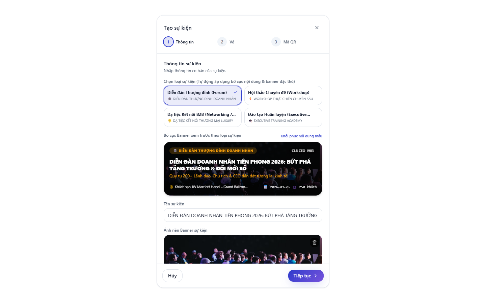
*Hình 2.28: Quản Lý Danh Sách Hợp Đồng Kinh Tế & Tiến Độ Nghiệm Thu Bàn Giao*

---

### 2.29. Bảng Use Case UC-VN-CRM-14: Lập Kế Hoạch Chăm Sóc & Đặt Lịch Hẹn Với Khách Hàng VIP

| Thuộc Tính Nghiệp Vụ | Nội Dung Đặc Tả Chi Tiết |
| :--- | :--- |
| **Mã Use Case (ID)** | **UC-VN-CRM-14** |
| **Phân Hệ / Nhóm** | Phân Hệ CRM & Quản Trị Khách Hàng |
| **Tên Chức Năng** | Lập Kế Hoạch Chăm Sóc & Đặt Lịch Hẹn Với Khách Hàng VIP |
| **Người Dùng (Actor)** | Nhân viên Kinh doanh, Trợ lý Ban Giám Đốc |
| **Tiền Điều Kiện (Pre-conditions)** | Khách hàng có lịch hẹn làm việc |
| **Luồng Xử Lý Chính (Main Flow)** | 1. Tại hồ sơ khách hàng, chọn tab "Lịch Hẹn". 2. Chọn thời gian bắt đầu, thời gian kết thúc và địa điểm (Trực tiếp tại văn phòng hoặc họp Google Meet / Zoom). 3. Nhập mục tiêu cuộc gặp và danh sách người tham gia. 4. Bấm "Tạo Lịch". Hệ thống đồng bộ sự kiện vào lịch công tác và gửi email mời cho các bên. |
| **Luồng Thay Thế / Ngoại Lệ** | Hệ thống tự động nhắc lịch trước 30 phút qua push notification trên app. |
| **Hậu Điều Kiện (Post-conditions)** | Tránh trùng lịch và nâng cao tính chuyên nghiệp trong giao tiếp B2B. |
| **Hình Ảnh Minh Chứng** | Lập Lịch Hẹn Gặp Khách Hàng VIP & Đồng Bộ Lịch Làm Việc Tự Động (`04_app_home_compact_event.png`) |

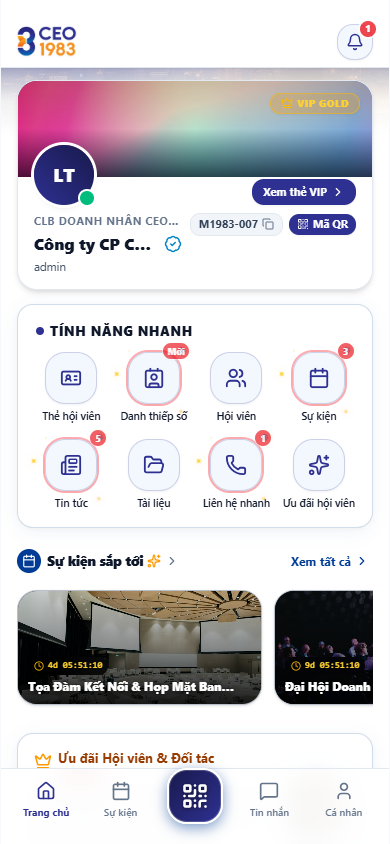
*Hình 2.29: Lập Lịch Hẹn Gặp Khách Hàng VIP & Đồng Bộ Lịch Làm Việc Tự Động*

---

### 2.30. Bảng Use Case UC-VN-CRM-15: Ghi Nhật Ký Cuộc Gọi (Call Log) & Nội Dung Đàm Phán

| Thuộc Tính Nghiệp Vụ | Nội Dung Đặc Tả Chi Tiết |
| :--- | :--- |
| **Mã Use Case (ID)** | **UC-VN-CRM-15** |
| **Phân Hệ / Nhóm** | Phân Hệ CRM & Quản Trị Khách Hàng |
| **Tên Chức Năng** | Ghi Nhật Ký Cuộc Gọi (Call Log) & Nội Dung Đàm Phán |
| **Người Dùng (Actor)** | Nhân viên Sales sau mỗi cuộc gọi |
| **Tiền Điều Kiện (Pre-conditions)** | Vừa kết thúc cuộc gọi với khách hàng |
| **Luồng Xử Lý Chính (Main Flow)** | 1. Mở nhanh hồ sơ khách hàng trên app hoặc web. 2. Nhấn biểu tượng "Ghi nhật ký cuộc gọi". 3. Chọn kết quả cuộc gọi: "Đã trao đổi thành công", "Bận họp gọi lại sau", "Không nhấc máy". 4. Nhập tóm tắt 3 ý chính khách hàng yêu cầu. 5. Bấm Lưu. |
| **Luồng Thay Thế / Ngoại Lệ** | Có thể đặt luôn lịch nhắc gọi lại vào ngày mai. |
| **Hậu Điều Kiện (Post-conditions)** | Thông tin cuộc gọi được lưu vĩnh viễn trên Timeline để đồng nghiệp nắm bắt khi bàn giao. |
| **Hình Ảnh Minh Chứng** | Giao Diện Ghi Nhật Ký Cuộc Gọi & Nội Dung Thỏa Thuận Với Khách Hàng (`09_app_chat_call_messenger_bubble.png`) |

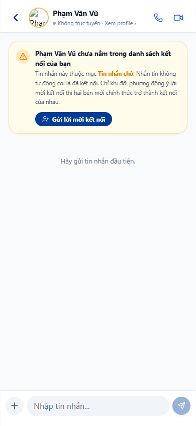
*Hình 2.30: Giao Diện Ghi Nhật Ký Cuộc Gọi & Nội Dung Thỏa Thuận Với Khách Hàng*

---

### 2.31. Bảng Use Case UC-VN-CRM-16: Quản Lý Danh Mục Sản Phẩm, SKU & Dịch Vụ B2B

| Thuộc Tính Nghiệp Vụ | Nội Dung Đặc Tả Chi Tiết |
| :--- | :--- |
| **Mã Use Case (ID)** | **UC-VN-CRM-16** |
| **Phân Hệ / Nhóm** | Phân Hệ CRM & Quản Trị Khách Hàng |
| **Tên Chức Năng** | Quản Lý Danh Mục Sản Phẩm, SKU & Dịch Vụ B2B |
| **Người Dùng (Actor)** | Quản trị viên sản phẩm, Kế toán kho |
| **Tiền Điều Kiện (Pre-conditions)** | Có danh mục hàng hóa kinh doanh |
| **Luồng Xử Lý Chính (Main Flow)** | 1. Vào phân hệ "Sản Phẩm & Dịch Vụ". 2. Bấm "Thêm Mới Sản Phẩm". Nhập tên sản phẩm, mã SKU, nhóm ngành, đơn vị tính (Gói, Bộ, Tháng). 3. Tải lên ảnh sản phẩm độ phân giải cao. 4. Nhập đơn giá niêm yết và mức thuế suất áp dụng. 5. Bấm Lưu. |
| **Luồng Thay Thế / Ngoại Lệ** | Có thể quản lý thuộc tính động (Màu sắc, dung lượng, phiên bản). |
| **Hậu Điều Kiện (Post-conditions)** | Sản phẩm sẵn sàng xuất hiện trong bảng báo giá và gian hàng số. |
| **Hình Ảnh Minh Chứng** | Quản Lý Danh Mục Sản Phẩm, Dịch Vụ B2B & Bảng Đơn Giá Chuẩn Hóa (`16_app_products_ecommerce_grid.png`) |

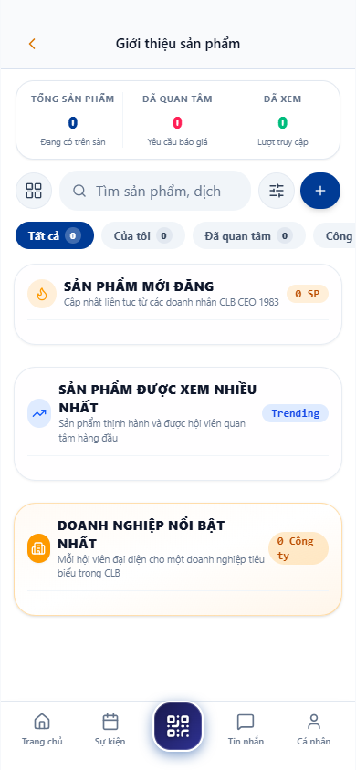
*Hình 2.31: Quản Lý Danh Mục Sản Phẩm, Dịch Vụ B2B & Bảng Đơn Giá Chuẩn Hóa*

---

### 2.32. Bảng Use Case UC-VN-CRM-17: Cấu Hình Bảng Giá Phân Cấp (Đại Lý Cấp 1, Đối Tác VIP, Bán Lẻ)

| Thuộc Tính Nghiệp Vụ | Nội Dung Đặc Tả Chi Tiết |
| :--- | :--- |
| **Mã Use Case (ID)** | **UC-VN-CRM-17** |
| **Phân Hệ / Nhóm** | Phân Hệ CRM & Quản Trị Khách Hàng |
| **Tên Chức Năng** | Cấu Hình Bảng Giá Phân Cấp (Đại Lý Cấp 1, Đối Tác VIP, Bán Lẻ) |
| **Người Dùng (Actor)** | Giám đốc Kinh doanh, Quản trị chính sách |
| **Tiền Điều Kiện (Pre-conditions)** | Đã có danh mục sản phẩm gốc |
| **Luồng Xử Lý Chính (Main Flow)** | 1. Mở mục "Chính Sách Giá". Bấm "Tạo Bảng Giá Mới". 2. Đặt tên bảng giá: "Bảng Giá Đại Lý Cấp 1 - 2026". 3. Áp dụng tỷ lệ chiết khấu cố định (Ví dụ giảm 25% so với giá niêm yết). 4. Gán bảng giá này cho nhóm khách hàng Đại Lý Cấp 1. 5. Kích hoạt bảng giá. |
| **Luồng Thay Thế / Ngoại Lệ** | Có thể thiết lập ngày bắt đầu và kết thúc hiệu lực bảng giá. |
| **Hậu Điều Kiện (Post-conditions)** | Khi nhân viên làm báo giá cho đại lý, hệ thống tự động áp dụng giá ưu đãi. |
| **Hình Ảnh Minh Chứng** | Thiết Lập Bảng Giá Bán Phân Cấp Theo Từng Hạng Khách Hàng & Đại Lý (`18_crm_marketplace_sync.png`) |

*Hình 2.32: Thiết Lập Bảng Giá Bán Phân Cấp Theo Từng Hạng Khách Hàng & Đại Lý*

---

### 2.33. Bảng Use Case UC-VN-CRM-18: Quản Lý Chính Sách Khuyến Mại & Chiết Khấu Thương Mại

| Thuộc Tính Nghiệp Vụ | Nội Dung Đặc Tả Chi Tiết |
| :--- | :--- |
| **Mã Use Case (ID)** | **UC-VN-CRM-18** |
| **Phân Hệ / Nhóm** | Phân Hệ CRM & Quản Trị Khách Hàng |
| **Tên Chức Năng** | Quản Lý Chính Sách Khuyến Mại & Chiết Khấu Thương Mại |
| **Người Dùng (Actor)** | Trưởng phòng Marketing, Giám đốc Sales |
| **Tiền Điều Kiện (Pre-conditions)** | Có chương trình kích cầu bán hàng |
| **Luồng Xử Lý Chính (Main Flow)** | 1. Nhấn "Tạo Chương Trình Khuyến Mại". 2. Nhập tên: "Ưu Đãi Quý 4 - Mua 1 Năm Tặng 2 Tháng". 3. Thiết lập điều kiện: Đơn hàng đạt giá trị tối thiểu 50 triệu VNĐ. 4. Chọn hình thức: Giảm trừ trực tiếp tiền mặt hoặc tặng thêm tài khoản người dùng. 5. Bấm Phê Duyệt. |
| **Luồng Thay Thế / Ngoại Lệ** | Giới hạn số lượng áp dụng cho 100 khách hàng đầu tiên. |
| **Hậu Điều Kiện (Post-conditions)** | Nhân viên kinh doanh áp dụng mã khuyến mại hợp lệ khi chốt hợp đồng. |
| **Hình Ảnh Minh Chứng** | Quản Lý Các Chương Trình Khuyến Mại & Chiết Khấu Bán Hàng B2B (`17_app_product_created.png`) |

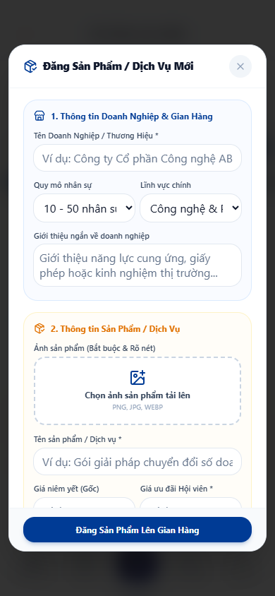
*Hình 2.33: Quản Lý Các Chương Trình Khuyến Mại & Chiết Khấu Bán Hàng B2B*

---

### 2.34. Bảng Use Case UC-VN-CRM-19: Theo Dõi Lịch Sử Mua Hàng & Giá Trị Vòng Đời Khách Hàng (LTV)

| Thuộc Tính Nghiệp Vụ | Nội Dung Đặc Tả Chi Tiết |
| :--- | :--- |
| **Mã Use Case (ID)** | **UC-VN-CRM-19** |
| **Phân Hệ / Nhóm** | Phân Hệ CRM & Quản Trị Khách Hàng |
| **Tên Chức Năng** | Theo Dõi Lịch Sử Mua Hàng & Giá Trị Vòng Đời Khách Hàng (LTV) |
| **Người Dùng (Actor)** | Giám đốc Kinh doanh, Ban Giám Đốc |
| **Tiền Điều Kiện (Pre-conditions)** | Khách hàng đã phát sinh nhiều giao dịch |
| **Luồng Xử Lý Chính (Main Flow)** | 1. Mở hồ sơ khách hàng lâu năm. 2. Chọn tab "Phân Tích Doanh Thu". 3. Xem tổng doanh số tích lũy từ trước tới nay (Customer Lifetime Value - CLV). 4. Xem biểu đồ tần suất mua hàng lặp lại và giá trị đơn hàng trung bình (AOV). 5. Đánh giá xếp hạng khách hàng (Hạng Kim Cương / Vàng / Bạc). |
| **Luồng Thay Thế / Ngoại Lệ** | Xuất biểu đồ phân tích thành file ảnh phục vụ họp chiến lược. |
| **Hậu Điều Kiện (Post-conditions)** | Nhận diện nhóm khách hàng mang lại 80% doanh thu để ưu tiên chăm sóc. |
| **Hình Ảnh Minh Chứng** | Báo Cáo Phân Tích Giá Trị Vòng Đời Khách Hàng (Customer Lifetime Value) (`crm1983_02_dashboard_overview.png`) |

*Hình 2.34: Báo Cáo Phân Tích Giá Trị Vòng Đời Khách Hàng (Customer Lifetime Value)*

---

### 2.35. Bảng Use Case UC-VN-CRM-20: Cảnh Báo Khách Hàng Có Nguy Cơ Rời Bỏ (Churn Risk Alert)

| Thuộc Tính Nghiệp Vụ | Nội Dung Đặc Tả Chi Tiết |
| :--- | :--- |
| **Mã Use Case (ID)** | **UC-VN-CRM-20** |
| **Phân Hệ / Nhóm** | Phân Hệ CRM & Quản Trị Khách Hàng |
| **Tên Chức Năng** | Cảnh Báo Khách Hàng Có Nguy Cơ Rời Bỏ (Churn Risk Alert) |
| **Người Dùng (Actor)** | Bộ phận Chăm sóc Khách hàng (Customer Success) |
| **Tiền Điều Kiện (Pre-conditions)** | Hệ thống AI theo dõi hành vi |
| **Luồng Xử Lý Chính (Main Flow)** | 1. Hệ thống AI định kỳ quét dữ liệu tương tác khách hàng. 2. Phát hiện khách hàng A đã 60 ngày không đăng nhập hệ thống hoặc không có đơn hàng mới. 3. Hệ thống tự động đẩy cờ cảnh báo đỏ "Nguy Cơ Rời Bỏ Cao" lên danh sách CRM. 4. Tự động giao việc cho nhân viên phụ trách gọi điện thăm hỏi và khảo sát. |
| **Luồng Thay Thế / Ngoại Lệ** | Gợi ý kịch bản ưu đãi giữ chân khách hàng tự động. |
| **Hậu Điều Kiện (Post-conditions)** | Giảm thiểu 50% tỷ lệ khách hàng rời bỏ nhờ can thiệp sớm. |
| **Hình Ảnh Minh Chứng** | Trung Tâm Cảnh Báo Sớm Nguy Cơ Rời Bỏ Khách Hàng Bằng Thuật Toán AI (`26_app_notifications_personal.png`) |

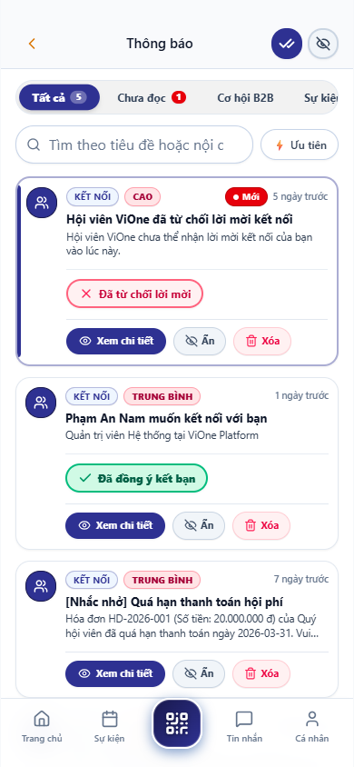
*Hình 2.35: Trung Tâm Cảnh Báo Sớm Nguy Cơ Rời Bỏ Khách Hàng Bằng Thuật Toán AI*

---

### 2.36. Bảng Use Case UC-VN-CRM-21: Tiếp Nhận & Xử Lý Yêu Cầu Hỗ Trợ Kỹ Thuật (Support Tickets)

| Thuộc Tính Nghiệp Vụ | Nội Dung Đặc Tả Chi Tiết |
| :--- | :--- |
| **Mã Use Case (ID)** | **UC-VN-CRM-21** |
| **Phân Hệ / Nhóm** | Phân Hệ CRM & Quản Trị Khách Hàng |
| **Tên Chức Năng** | Tiếp Nhận & Xử Lý Yêu Cầu Hỗ Trợ Kỹ Thuật (Support Tickets) |
| **Người Dùng (Actor)** | Chuyên viên Hỗ trợ Khách hàng, Trưởng nhóm CS |
| **Tiền Điều Kiện (Pre-conditions)** | Khách hàng gửi yêu cầu hỗ trợ qua app hoặc web |
| **Luồng Xử Lý Chính (Main Flow)** | 1. Ticket mới xuất hiện với mức độ ưu tiên (Khẩn cấp / Cao / Bình thường). 2. Nhân viên tiếp nhận ticket, xem nội dung mô tả lỗi và ảnh chụp đính kèm. 3. Chuyển trạng thái sang "Đang Xử Lý" và phản hồi khách hàng qua khung chat nội bộ. 4. Sau khi giải quyết xong, cập nhật kết quả và bấm "Đóng Ticket". |
| **Luồng Thay Thế / Ngoại Lệ** | Nếu quá 2 giờ chưa xử lý, ticket tự động leo thang (Escalate) lên Trưởng phòng. |
| **Hậu Điều Kiện (Post-conditions)** | Khách hàng đánh giá mức độ hài lòng về chất lượng hỗ trợ. |
| **Hình Ảnh Minh Chứng** | Giao Diện Quản Lý & Điều Phối Phiếu Yêu Cầu Hỗ Trợ Khách Hàng (`24_app_messages_inbox.png`) |

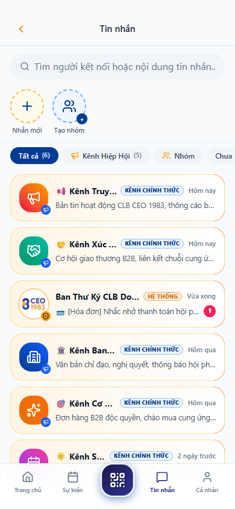
*Hình 2.36: Giao Diện Quản Lý & Điều Phối Phiếu Yêu Cầu Hỗ Trợ Khách Hàng*

---

### 2.37. Bảng Use Case UC-VN-CRM-22: Khảo Sát & Đo Lường Điểm Hài Lòng Khách Hàng (CSAT & NPS)

| Thuộc Tính Nghiệp Vụ | Nội Dung Đặc Tả Chi Tiết |
| :--- | :--- |
| **Mã Use Case (ID)** | **UC-VN-CRM-22** |
| **Phân Hệ / Nhóm** | Phân Hệ CRM & Quản Trị Khách Hàng |
| **Tên Chức Năng** | Khảo Sát & Đo Lường Điểm Hài Lòng Khách Hàng (CSAT & NPS) |
| **Người Dùng (Actor)** | Trưởng phòng Chất lượng (QA), Giám đốc Khách hàng |
| **Tiền Điều Kiện (Pre-conditions)** | Sau khi đóng ticket hoặc hoàn tất hợp đồng |
| **Luồng Xử Lý Chính (Main Flow)** | 1. Hệ thống tự động gửi link khảo sát nhanh 1 câu hỏi qua Zalo/Email: "Bạn đánh giá dịch vụ thế nào từ 1 đến 5 sao?". 2. Khách hàng bấm chọn số sao và gửi phản hồi ngắn. 3. Dữ liệu tự động tính toán chỉ số CSAT (Customer Satisfaction) và NPS (Net Promoter Score). 4. Bảng điều khiển CRM cập nhật đồ thị độ hài lòng tổng hợp. |
| **Luồng Thay Thế / Ngoại Lệ** | Nếu khách hàng chấm 1-2 sao, hệ thống gửi cảnh báo khẩn cấp tới Giám đốc chăm sóc. |
| **Hậu Điều Kiện (Post-conditions)** | Đảm bảo tiêu chuẩn chất lượng dịch vụ luôn ở mức xuất sắc. |
| **Hình Ảnh Minh Chứng** | Khảo Sát Đánh Giá Mức Độ Hài Lòng Khách Hàng & Tính Toán Chỉ Số NPS (`15_app_live_voting.png`) |

*Hình 2.37: Khảo Sát Đánh Giá Mức Độ Hài Lòng Khách Hàng & Tính Toán Chỉ Số NPS*

---

### 2.38. Bảng Use Case UC-VN-CRM-23: Quản Lý Danh Sách Đối Tác Chiến Lược & Nhà Cung Cấp

| Thuộc Tính Nghiệp Vụ | Nội Dung Đặc Tả Chi Tiết |
| :--- | :--- |
| **Mã Use Case (ID)** | **UC-VN-CRM-23** |
| **Phân Hệ / Nhóm** | Phân Hệ CRM & Quản Trị Khách Hàng |
| **Tên Chức Năng** | Quản Lý Danh Sách Đối Tác Chiến Lược & Nhà Cung Cấp |
| **Người Dùng (Actor)** | Phòng Cung ứng, Ban Giám Đốc |
| **Tiền Điều Kiện (Pre-conditions)** | Có các đối tác cung cấp dịch vụ bên ngoài |
| **Luồng Xử Lý Chính (Main Flow)** | 1. Truy cập phân hệ "Đối Tác & Nhà Cung Cấp". 2. Bấm "Thêm Mới Đối Tác". Nhập tên tổ chức, năng lực cốt lõi, người liên hệ và thỏa thuận bảo mật. 3. Đính kèm hợp đồng nguyên tắc và tài liệu giới thiệu. 4. Đánh giá chất lượng dịch vụ nhà cung cấp theo kỳ quý. |
| **Luồng Thay Thế / Ngoại Lệ** | Tìm kiếm nhanh đối tác theo từ khóa dịch vụ cung ứng. |
| **Hậu Điều Kiện (Post-conditions)** | Xây dựng mạng lưới chuỗi cung ứng minh bạch và ổn định. |
| **Hình Ảnh Minh Chứng** | Quản Lý Danh Bạ Đối Tác Chiến Lược & Mạng Lưới Nhà Cung Cấp (`23_app_members_directory.png`) |

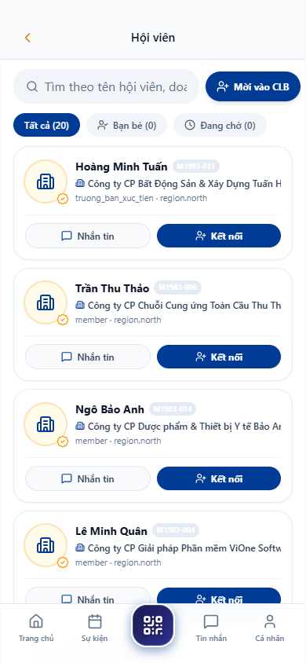
*Hình 2.38: Quản Lý Danh Bạ Đối Tác Chiến Lược & Mạng Lưới Nhà Cung Cấp*

---

### 2.39. Bảng Use Case UC-VN-CRM-24: Báo Cáo Phân Tích Phễu Chuyển Đổi Bán Hàng (Conversion Funnel)

| Thuộc Tính Nghiệp Vụ | Nội Dung Đặc Tả Chi Tiết |
| :--- | :--- |
| **Mã Use Case (ID)** | **UC-VN-CRM-24** |
| **Phân Hệ / Nhóm** | Phân Hệ CRM & Quản Trị Khách Hàng |
| **Tên Chức Năng** | Báo Cáo Phân Tích Phễu Chuyển Đổi Bán Hàng (Conversion Funnel) |
| **Người Dùng (Actor)** | Giám đốc Kinh doanh, Trưởng phòng Marketing |
| **Tiền Điều Kiện (Pre-conditions)** | Có dữ liệu các giai đoạn bán hàng |
| **Luồng Xử Lý Chính (Main Flow)** | 1. Mở trung tâm "Báo Cáo Bán Hàng", chọn tab "Phễu Chuyển Đổi". 2. Xem số lượng và tỷ lệ % qua từng tầng: Leads (100%) -> Khảo sát (65%) -> Báo giá (35%) -> Ký hợp đồng (18%). 3. Nhấp vào điểm rơi (Drop-off point) giữa Báo giá và Ký hợp đồng để xem các lý do chính. 4. Đưa ra quyết định cải tiến tài liệu bán hàng hoặc chính sách giá. |
| **Luồng Thay Thế / Ngoại Lệ** | Lọc phễu theo từng chiến dịch tiếp thị hoặc từng nhóm kinh doanh. |
| **Hậu Điều Kiện (Post-conditions)** | Tối ưu hóa quy trình bán hàng dựa trên số liệu thực tế. |
| **Hình Ảnh Minh Chứng** | Báo Cáo Phân Tích Tỷ Lệ Chuyển Đổi Qua Từng Tầng Phễu Bán Hàng (`crm1983_02_dashboard_overview.png`) |

*Hình 2.39: Báo Cáo Phân Tích Tỷ Lệ Chuyển Đổi Qua Từng Tầng Phễu Bán Hàng*

---

### 2.40. Bảng Use Case UC-VN-CRM-25: Báo Cáo Doanh Số Bán Hàng Theo Từng Nhân Viên & Phòng Ban

| Thuộc Tính Nghiệp Vụ | Nội Dung Đặc Tả Chi Tiết |
| :--- | :--- |
| **Mã Use Case (ID)** | **UC-VN-CRM-25** |
| **Phân Hệ / Nhóm** | Phân Hệ CRM & Quản Trị Khách Hàng |
| **Tên Chức Năng** | Báo Cáo Doanh Số Bán Hàng Theo Từng Nhân Viên & Phòng Ban |
| **Người Dùng (Actor)** | Trưởng phòng Kinh doanh, Ban Giám Đốc |
| **Tiền Điều Kiện (Pre-conditions)** | Đến kỳ chốt doanh số tháng |
| **Luồng Xử Lý Chính (Main Flow)** | 1. Chọn báo cáo "Hiệu Suất Nhân Viên Sales". 2. Chọn thời gian: Tháng hiện tại. 3. Hệ thống hiển thị bảng xếp hạng: Tên nhân viên, Số deal đã chốt, Tổng doanh thu, Tỷ lệ hoàn thành chỉ tiêu KPI (% Target). 4. Xem biểu đồ đóng góp doanh thu giữa các phòng ban. |
| **Luồng Thay Thế / Ngoại Lệ** | Có thể xuất báo cáo ra file Excel để tính thưởng hoa hồng. |
| **Hậu Điều Kiện (Post-conditions)** | Tạo động lực thi đua minh bạch và công bằng cho đội ngũ. |
| **Hình Ảnh Minh Chứng** | Bảng Xếp Hạng & Báo Cáo Hiệu Suất Bán Hàng Từng Nhân Viên Kinh Doanh (`04_crm_members_management.png`) |

*Hình 2.40: Bảng Xếp Hạng & Báo Cáo Hiệu Suất Bán Hàng Từng Nhân Viên Kinh Doanh*

---

### 2.41. Bảng Use Case UC-VN-CRM-26: Dự Báo Doanh Thu Bán Hàng Tháng/Quý (Sales Revenue Forecast)

| Thuộc Tính Nghiệp Vụ | Nội Dung Đặc Tả Chi Tiết |
| :--- | :--- |
| **Mã Use Case (ID)** | **UC-VN-CRM-26** |
| **Phân Hệ / Nhóm** | Phân Hệ CRM & Quản Trị Khách Hàng |
| **Tên Chức Năng** | Dự Báo Doanh Thu Bán Hàng Tháng/Quý (Sales Revenue Forecast) |
| **Người Dùng (Actor)** | Giám đốc Tài chính (CFO), Tổng Giám Đốc (CEO) |
| **Tiền Điều Kiện (Pre-conditions)** | Cần lập kế hoạch dòng tiền kỳ tới |
| **Luồng Xử Lý Chính (Main Flow)** | 1. Mở mục "Dự Báo Doanh Thu". 2. Chọn kỳ dự báo: Quý 4/2026. 3. Hệ thống tính toán dự báo dựa trên: Doanh số hợp đồng đã ký + Giá trị Deal nhân với xác suất chốt. 4. Xem 3 kịch bản: Lạc quan (Best Case), Kỳ vọng (Expected Case), Thận trọng (Worst Case). |
| **Luồng Thay Thế / Ngoại Lệ** | AI gợi ý các biện pháp đẩy nhanh tiến độ chốt deal cho kịch bản thận trọng. |
| **Hậu Điều Kiện (Post-conditions)** | Lãnh đạo chủ động hoạch định ngân sách chi tiêu và đầu tư. |
| **Hình Ảnh Minh Chứng** | Mô Hình Dự Báo Doanh Thu Bán Hàng Theo 3 Kịch Bản Lạc Quan - Thận Trọng (`operational-dashboard.png`) |

*Hình 2.41: Mô Hình Dự Báo Doanh Thu Bán Hàng Theo 3 Kịch Bản Lạc Quan - Thận Trọng*

---

### 2.42. Bảng Use Case UC-VN-CRM-27: Phân Tích Nguồn Khách Hàng Tiềm Năng (Lead Source Attribution)

| Thuộc Tính Nghiệp Vụ | Nội Dung Đặc Tả Chi Tiết |
| :--- | :--- |
| **Mã Use Case (ID)** | **UC-VN-CRM-27** |
| **Phân Hệ / Nhóm** | Phân Hệ CRM & Quản Trị Khách Hàng |
| **Tên Chức Năng** | Phân Tích Nguồn Khách Hàng Tiềm Năng (Lead Source Attribution) |
| **Người Dùng (Actor)** | Trưởng phòng Marketing, Giám đốc Kinh doanh |
| **Tiền Điều Kiện (Pre-conditions)** | Lead được thu thập từ nhiều kênh |
| **Luồng Xử Lý Chính (Main Flow)** | 1. Vào báo cáo "Phân Tích Nguồn Lead". 2. Xem biểu đồ tròn cơ cấu nguồn khách: Website Landing page (45%), Giới thiệu từ đối tác (25%), Sự kiện offline (18%), Mạng xã hội (12%). 3. Xem chi phí trên mỗi Lead (CPL) và Doanh thu sinh ra trên mỗi kênh (ROAS). 4. Đánh giá kênh nào mang lại lợi nhuận cao nhất. |
| **Luồng Thay Thế / Ngoại Lệ** | Xem chi tiết danh sách khách hàng đến từ từng nguồn cụ thể. |
| **Hậu Điều Kiện (Post-conditions)** | Tối ưu hóa ngân sách tiếp thị vào các kênh có hiệu quả chuyển đổi cao nhất. |
| **Hình Ảnh Minh Chứng** | Phân Tích Nguồn Khách Hàng Hiệu Quả & Đo Lường Lợi Tức Đầu Tư Marketing (`crm_dash_view_06.png`) |

*Hình 2.42: Phân Tích Nguồn Khách Hàng Hiệu Quả & Đo Lường Lợi Tức Đầu Tư Marketing*

---

### 2.43. Bảng Use Case UC-VN-CRM-28: Quản Lý & Gửi Chiến Dịch Tiếp Thị Email Tự Động (Email Drip)

| Thuộc Tính Nghiệp Vụ | Nội Dung Đặc Tả Chi Tiết |
| :--- | :--- |
| **Mã Use Case (ID)** | **UC-VN-CRM-28** |
| **Phân Hệ / Nhóm** | Phân Hệ CRM & Quản Trị Khách Hàng |
| **Tên Chức Năng** | Quản Lý & Gửi Chiến Dịch Tiếp Thị Email Tự Động (Email Drip) |
| **Người Dùng (Actor)** | Chuyên viên Marketing Automation |
| **Tiền Điều Kiện (Pre-conditions)** | Có danh sách email khách hàng phân khúc |
| **Luồng Xử Lý Chính (Main Flow)** | 1. Vào phân hệ "Email Marketing". Bấm "Tạo Chiến Dịch Mới". 2. Chọn mẫu email thiết kế sang trọng: Logo công ty, Thư ngỏ của CEO, Nút xem ưu đãi. 3. Chọn nhóm khách hàng nhận tin theo Thẻ (Tags) "Hội viên B2B". 4. Lên lịch gửi tự động vào 09:00 sáng Thứ Ba. 5. Kích hoạt chiến dịch. Hệ thống theo dõi tỷ lệ mở (Open Rate) và click (CTR). |
| **Luồng Thay Thế / Ngoại Lệ** | Tự động gửi email nhắc lại cho những khách hàng chưa mở email sau 48 giờ. |
| **Hậu Điều Kiện (Post-conditions)** | Nuôi dưỡng mối quan hệ khách hàng bền chặt và chuyên nghiệp. |
| **Hình Ảnh Minh Chứng** | Quản Lý & Kích Hoạt Chiến Dịch Tiếp Thị Email Tự Động Hóa (`05_email_credentials_sent.png`) |

*Hình 2.43: Quản Lý & Kích Hoạt Chiến Dịch Tiếp Thị Email Tự Động Hóa*

---

### 2.44. Bảng Use Case UC-VN-CRM-29: Quản Lý Mã Giảm Giá & E-Voucher Doanh Nghiệp

| Thuộc Tính Nghiệp Vụ | Nội Dung Đặc Tả Chi Tiết |
| :--- | :--- |
| **Mã Use Case (ID)** | **UC-VN-CRM-29** |
| **Phân Hệ / Nhóm** | Phân Hệ CRM & Quản Trị Khách Hàng |
| **Tên Chức Năng** | Quản Lý Mã Giảm Giá & E-Voucher Doanh Nghiệp |
| **Người Dùng (Actor)** | Trưởng phòng Kinh doanh, Kế toán bán hàng |
| **Tiền Điều Kiện (Pre-conditions)** | Tạo chương trình tri ân đối tác |
| **Luồng Xử Lý Chính (Main Flow)** | 1. Nhấn "Thêm Mã Giảm Giá Mới". 2. Nhập mã code: "VIONE2026VIP". 3. Thiết lập giảm 15% tổng giá trị hợp đồng, thời hạn sử dụng 30 ngày. 4. Giới hạn mỗi doanh nghiệp chỉ được sử dụng 01 lần. 5. Bấm Kích Hoạt. |
| **Luồng Thay Thế / Ngoại Lệ** | Hệ thống tự động đồng bộ mã giảm giá lên ứng dụng di động ViOne Connect. |
| **Hậu Điều Kiện (Post-conditions)** | Khách hàng có thể nhập mã voucher trực tiếp khi thanh toán đơn hàng. |
| **Hình Ảnh Minh Chứng** | Cấu Hình & Quản Lý Mã Ưu Đãi Giảm Giá Doanh Nghiệp (E-Voucher) (`16_app_products_ecommerce_grid.png`) |

*Hình 2.44: Cấu Hình & Quản Lý Mã Ưu Đãi Giảm Giá Doanh Nghiệp (E-Voucher)*

---

### 2.45. Bảng Use Case UC-VN-CRM-30: Đồng Bộ Danh Bạ Khách Hàng Với Ứng Dụng Di Động ViOne Connect

| Thuộc Tính Nghiệp Vụ | Nội Dung Đặc Tả Chi Tiết |
| :--- | :--- |
| **Mã Use Case (ID)** | **UC-VN-CRM-30** |
| **Phân Hệ / Nhóm** | Phân Hệ CRM & Quản Trị Khách Hàng |
| **Tên Chức Năng** | Đồng Bộ Danh Bạ Khách Hàng Với Ứng Dụng Di Động ViOne Connect |
| **Người Dùng (Actor)** | Nhân viên Kinh doanh di chuyển ngoài thực địa |
| **Tiền Điều Kiện (Pre-conditions)** | Sử dụng smartphone kết nối internet |
| **Luồng Xử Lý Chính (Main Flow)** | 1. Mở app ViOne Connect trên di thoại. 2. Vào mục "Khách Hàng CRM". 3. Ứng dụng tự động tải dữ liệu khách hàng được phân công từ máy chủ đám mây. 4. Bấm vào số điện thoại để thực hiện cuộc gọi nhanh hoặc bấm chỉ đường Google Maps tới trụ sở khách. |
| **Luồng Thay Thế / Ngoại Lệ** | Khi mất mạng, app lưu dữ liệu vào bộ nhớ tạm Offline và tự đồng bộ khi có mạng lại. |
| **Hậu Điều Kiện (Post-conditions)** | Nhân viên kinh doanh nắm chắc thông tin mọi lúc mọi nơi. |
| **Hình Ảnh Minh Chứng** | Đồng Bộ Danh Bạ Khách Hàng CRM Lên Ứng Dụng Di Động ViOne Connect (`23_app_members_directory.png`) |

*Hình 2.45: Đồng Bộ Danh Bạ Khách Hàng CRM Lên Ứng Dụng Di Động ViOne Connect*

---

### 2.46. Bảng Use Case UC-VN-CRM-31: Cấu Hình Trường Dữ Liệu Tùy Chỉnh (Custom Fields) Khách Hàng

| Thuộc Tính Nghiệp Vụ | Nội Dung Đặc Tả Chi Tiết |
| :--- | :--- |
| **Mã Use Case (ID)** | **UC-VN-CRM-31** |
| **Phân Hệ / Nhóm** | Phân Hệ CRM & Quản Trị Khách Hàng |
| **Tên Chức Năng** | Cấu Hình Trường Dữ Liệu Tùy Chỉnh (Custom Fields) Khách Hàng |
| **Người Dùng (Actor)** | Quản trị viên hệ thống (Super Admin) |
| **Tiền Điều Kiện (Pre-conditions)** | Doanh nghiệp có thuộc tính ngành nghề đặc thù |
| **Luồng Xử Lý Chính (Main Flow)** | 1. Vào mục "Cài Đặt CRM" -> "Trường Tùy Chỉnh". 2. Bấm "Thêm Trường Mới". Nhập tên trường: "Hạn Mức Tín Dụng Tối Đa". 3. Chọn kiểu dữ liệu: Số tiền tệ (Currency). 4. Bật tùy chọn "Bắt buộc nhập" hoặc "Hiển thị trên danh sách". 5. Bấm Lưu. Trường mới xuất hiện ngay trên giao diện hồ sơ khách hàng. |
| **Luồng Thay Thế / Ngoại Lệ** | Hỗ trợ các kiểu dữ liệu: Chữ, Số, Ngày tháng, Danh sách chọn thả (Dropdown), Hộp kiểm (Checkbox). |
| **Hậu Điều Kiện (Post-conditions)** | Hệ thống thích ứng hoàn hảo với mọi mô hình nghiệp vụ đặc thù. |
| **Hình Ảnh Minh Chứng** | Thiết Lập Các Trường Thông Tin Tùy Biến (Custom Fields) Theo Ngành (`02_crm_members_roles_permission.png`) |

*Hình 2.46: Thiết Lập Các Trường Thông Tin Tùy Biến (Custom Fields) Theo Ngành*

---

### 2.47. Bảng Use Case UC-VN-CRM-32: Gán Người Phụ Trách (Account Owner) & Đội Ngũ Cộng Tác

| Thuộc Tính Nghiệp Vụ | Nội Dung Đặc Tả Chi Tiết |
| :--- | :--- |
| **Mã Use Case (ID)** | **UC-VN-CRM-32** |
| **Phân Hệ / Nhóm** | Phân Hệ CRM & Quản Trị Khách Hàng |
| **Tên Chức Năng** | Gán Người Phụ Trách (Account Owner) & Đội Ngũ Cộng Tác |
| **Người Dùng (Actor)** | Trưởng phòng Kinh doanh |
| **Tiền Điều Kiện (Pre-conditions)** | Khách hàng quy mô lớn cần nhiều người chăm sóc |
| **Luồng Xử Lý Chính (Main Flow)** | 1. Mở hồ sơ khách hàng doanh nghiệp lớn. 2. Tại mục "Người Phụ Trách Chính", chọn nhân viên Sales A. 3. Tại mục "Đội Ngũ Cộng Tác", thêm chuyên viên Kỹ thuật B và Kế toán C. 4. Phân quyền: Đội ngũ cộng tác có quyền xem hồ sơ và thảo luận nội bộ nhưng không được sửa thông tin pháp lý. 5. Bấm Lưu. |
| **Luồng Thay Thế / Ngoại Lệ** | Gửi thông báo đến toàn bộ các thành viên được thêm vào đội ngũ phụ trách. |
| **Hậu Điều Kiện (Post-conditions)** | Phối hợp nhịp nhàng giữa các bộ phận để phục vụ khách hàng lớn tốt nhất. |
| **Hình Ảnh Minh Chứng** | Phân Bổ Người Phụ Trách & Đội Ngũ Cộng Tác Phục Vụ Khách Hàng VIP (`04_crm_members_management.png`) |

*Hình 2.47: Phân Bổ Người Phụ Trách & Đội Ngũ Cộng Tác Phục Vụ Khách Hàng VIP*

---

### 2.48. Bảng Use Case UC-VN-CRM-33: Ghi Nhận Phản Hồi & Ý Kiến Đóng Góp Của Khách Hàng

| Thuộc Tính Nghiệp Vụ | Nội Dung Đặc Tả Chi Tiết |
| :--- | :--- |
| **Mã Use Case (ID)** | **UC-VN-CRM-33** |
| **Phân Hệ / Nhóm** | Phân Hệ CRM & Quản Trị Khách Hàng |
| **Tên Chức Năng** | Ghi Nhận Phản Hồi & Ý Kiến Đóng Góp Của Khách Hàng |
| **Người Dùng (Actor)** | Nhân viên Chăm sóc Khách hàng |
| **Tiền Điều Kiện (Pre-conditions)** | Nhận được phản hồi sau buổi bàn giao |
| **Luồng Xử Lý Chính (Main Flow)** | 1. Mở tab "Ý Kiến Phản Hồi" tại hồ sơ khách hàng. 2. Chọn loại phản hồi: "Khen ngợi", "Góp ý cải tiến giao diện", "Yêu cầu bổ sung tính năng". 3. Nhập chi tiết ý kiến và đính kèm biên bản làm việc. 4. Bấm Lưu và gắn thẻ bộ phận liên quan (Ví dụ: @ProductTeam). |
| **Luồng Thay Thế / Ngoại Lệ** | Hệ thống tự động thống kê các tính năng được khách hàng yêu cầu nhiều nhất. |
| **Hậu Điều Kiện (Post-conditions)** | Ban giám đốc có cơ sở thực tế để định hướng phát triển sản phẩm. |
| **Hình Ảnh Minh Chứng** | Ghi Nhận & Phân Loại Ý Kiến Đóng Góp Của Khách Hàng Phục Vụ Cải Tiến (`live_07_crm_member_detail_drawer.png`) |

*Hình 2.48: Ghi Nhận & Phân Loại Ý Kiến Đóng Góp Của Khách Hàng Phục Vụ Cải Tiến*

---

### 2.49. Bảng Use Case UC-VN-CRM-34: Xuất Báo Cáo CRM Ra Định Dạng Excel / PDF / CSV

| Thuộc Tính Nghiệp Vụ | Nội Dung Đặc Tả Chi Tiết |
| :--- | :--- |
| **Mã Use Case (ID)** | **UC-VN-CRM-34** |
| **Phân Hệ / Nhóm** | Phân Hệ CRM & Quản Trị Khách Hàng |
| **Tên Chức Năng** | Xuất Báo Cáo CRM Ra Định Dạng Excel / PDF / CSV |
| **Người Dùng (Actor)** | Trưởng phòng Bán hàng, Trợ lý Ban Giám Đốc |
| **Tiền Điều Kiện (Pre-conditions)** | Cần tổng hợp số liệu báo cáo tuần/tháng |
| **Luồng Xử Lý Chính (Main Flow)** | 1. Mở danh sách bất kỳ trong CRM (Khách hàng, Deal, Báo giá, Hoạt động). 2. Áp dụng các điều kiện lọc cần thiết (Ví dụ: Deal chốt trong tháng 10). 3. Bấm nút "Xuất Dữ Liệu (Export)". 4. Chọn định dạng: Excel (.xlsx), PDF hoặc CSV UTF-8. 5. Tệp tin được tạo lập an toàn và tự động tải xuống máy tính người dùng. |
| **Luồng Thay Thế / Ngoại Lệ** | Người dùng không có quyền xuất dữ liệu sẽ bị ẩn nút bấm này để chống rò rỉ thông tin. |
| **Hậu Điều Kiện (Post-conditions)** | Báo cáo được chuẩn hóa biểu mẫu sẵn sàng gửi Hội đồng Quản trị. |
| **Hình Ảnh Minh Chứng** | Xuất Dữ Liệu Khách Hàng & Giao Dịch Bán Hàng Ra Định Dạng Excel Chuẩn Hóa (`18_crm_marketplace_sync.png`) |

*Hình 2.49: Xuất Dữ Liệu Khách Hàng & Giao Dịch Bán Hàng Ra Định Dạng Excel Chuẩn Hóa*

---

### 2.50. Bảng Use Case UC-VN-CRM-35: Thiết Lập Quy Tắc Tự Động Gửi Chúc Mừng Sinh Nhật / Kỷ Niệm

| Thuộc Tính Nghiệp Vụ | Nội Dung Đặc Tả Chi Tiết |
| :--- | :--- |
| **Mã Use Case (ID)** | **UC-VN-CRM-35** |
| **Phân Hệ / Nhóm** | Phân Hệ CRM & Quản Trị Khách Hàng |
| **Tên Chức Năng** | Thiết Lập Quy Tắc Tự Động Gửi Chúc Mừng Sinh Nhật / Kỷ Niệm |
| **Người Dùng (Actor)** | Chuyên viên Chăm sóc Khách hàng, Trưởng nhóm CS |
| **Tiền Điều Kiện (Pre-conditions)** | Hệ thống có lưu ngày sinh nhật và ngày thành lập công ty |
| **Luồng Xử Lý Chính (Main Flow)** | 1. Mở mục "Tự Động Hóa Chăm Sóc". 2. Bật công tắc "Tự Động Chúc Mừng Sinh Nhật Khách Hàng". 3. Soạn nội dung tin nhắn SMS Brandname hoặc Email chúc mừng sang trọng kèm voucher giảm giá 20%. 4. Thiết lập giờ gửi tự động vào 08:30 sáng đúng ngày sinh nhật. 5. Bấm Kích Hoạt. |
| **Luồng Thay Thế / Ngoại Lệ** | Hệ thống hiển thị danh sách khách hàng sẽ nhận được lời chúc trong 7 ngày tới. |
| **Hậu Điều Kiện (Post-conditions)** | Nâng cao sự gắn kết tình cảm và giữ chân khách hàng tự nhiên. |
| **Hình Ảnh Minh Chứng** | Cấu Hình Kịch Bản Tự Động Gửi Lời Chúc Mừng & Tri Ân Khách Hàng (`05_email_credentials_sent.png`) |

*Hình 2.50: Cấu Hình Kịch Bản Tự Động Gửi Lời Chúc Mừng & Tri Ân Khách Hàng*

---

### 2.51. Bảng Use Case UC-VN-WRK-01: Khởi Tạo Dự Án Mới, Thiết Lập Mục Tiêu & Ngân Sách

| Thuộc Tính Nghiệp Vụ | Nội Dung Đặc Tả Chi Tiết |
| :--- | :--- |
| **Mã Use Case (ID)** | **UC-VN-WRK-01** |
| **Phân Hệ / Nhóm** | Phân Hệ Quản Lý Công Việc & Vận Hành |
| **Tên Chức Năng** | Khởi Tạo Dự Án Mới, Thiết Lập Mục Tiêu & Ngân Sách |
| **Người Dùng (Actor)** | Giám đốc Vận hành, Quản lý Dự án (PM) |
| **Tiền Điều Kiện (Pre-conditions)** | Có kế hoạch triển khai dự án |
| **Luồng Xử Lý Chính (Main Flow)** | 1. Nhấn "Tạo Dự Án Mới". Nhập tên dự án, mã dự án, ngày bắt đầu và ngày hạn chót. 2. Thiết lập tổng ngân sách vận hành cho dự án. 3. Chỉ định Quản lý dự án (PM) và danh sách thành viên cốt lõi. 4. Chọn phương pháp luận quản lý: Agile Kanban hoặc Thác nước (Waterfall). 5. Bấm Lưu. |
| **Luồng Thay Thế / Ngoại Lệ** | Có thể chọn nhân bản từ một Dự án mẫu (Template) có sẵn. |
| **Hậu Điều Kiện (Post-conditions)** | Dự án mới sẵn sàng phân rã các gói công việc. |
| **Hình Ảnh Minh Chứng** | Giao Diện Khởi Tạo Dự Án Mới & Thiết Lập Ngân Sách Vận Hành (`business-laptop.png`) |

*Hình 2.51: Giao Diện Khởi Tạo Dự Án Mới & Thiết Lập Ngân Sách Vận Hành*

---

### 2.52. Bảng Use Case UC-VN-WRK-02: Phân Rã Cấu Trúc Công Việc (WBS - Work Breakdown Structure)

| Thuộc Tính Nghiệp Vụ | Nội Dung Đặc Tả Chi Tiết |
| :--- | :--- |
| **Mã Use Case (ID)** | **UC-VN-WRK-02** |
| **Phân Hệ / Nhóm** | Phân Hệ Quản Lý Công Việc & Vận Hành |
| **Tên Chức Năng** | Phân Rã Cấu Trúc Công Việc (WBS - Work Breakdown Structure) |
| **Người Dùng (Actor)** | Quản lý Dự án (PM) |
| **Tiền Điều Kiện (Pre-conditions)** | Dự án đã được phê duyệt |
| **Luồng Xử Lý Chính (Main Flow)** | 1. Mở sơ đồ cây cấu trúc công việc WBS. 2. Thêm các Gói công việc chính (Phase / Milestone). 3. Thêm các nhiệm vụ cụ thể (Tasks) trực thuộc từng gói. 4. Gán trọng số hoàn thành (% Weight) cho từng nhánh công việc. 5. Bấm Lưu sơ đồ. |
| **Luồng Thay Thế / Ngoại Lệ** | Có thể kéo thả sắp xếp thứ tự ưu tiên giữa các nhánh. |
| **Hậu Điều Kiện (Post-conditions)** | Dự án được phân rã chi tiết, rõ ràng từng đầu mối trách nhiệm. |
| **Hình Ảnh Minh Chứng** | Sơ Đồ Phân Rã Cấu Trúc Công Việc Dự Án (Work Breakdown Structure) (`operational-dashboard.png`) |

*Hình 2.52: Sơ Đồ Phân Rã Cấu Trúc Công Việc Dự Án (Work Breakdown Structure)*

---

### 2.53. Bảng Use Case UC-VN-WRK-03: Quản Lý Công Việc Trên Bảng Kanban Kéo Thả Trực Quan

| Thuộc Tính Nghiệp Vụ | Nội Dung Đặc Tả Chi Tiết |
| :--- | :--- |
| **Mã Use Case (ID)** | **UC-VN-WRK-03** |
| **Phân Hệ / Nhóm** | Phân Hệ Quản Lý Công Việc & Vận Hành |
| **Tên Chức Năng** | Quản Lý Công Việc Trên Bảng Kanban Kéo Thả Trực Quan |
| **Người Dùng (Actor)** | Thành viên dự án, Trưởng nhóm |
| **Tiền Điều Kiện (Pre-conditions)** | Có danh sách công việc cần làm |
| **Luồng Xử Lý Chính (Main Flow)** | 1. Mở giao diện Bảng Kanban Công Việc. 2. Xem các làn trạng thái: Cần làm (To Do) -> Đang làm (In Progress) -> Chờ duyệt (Review) -> Hoàn thành (Done). 3. Kéo thả thẻ công việc sang trạng thái mới khi bắt đầu thực hiện. 4. Bộ đếm thời gian thực hiện tự động kích hoạt. |
| **Luồng Thay Thế / Ngoại Lệ** | Lọc thẻ theo người phụ trách, mức độ ưu tiên hoặc nhãn công việc. |
| **Hậu Điều Kiện (Post-conditions)** | Tăng tính minh bạch và tránh ứ đọng công việc. |
| **Hình Ảnh Minh Chứng** | Bảng Quản Lý Công Việc Kanban Kéo Thả Trực Quan Thời Gian Thực (`crm1983_02_dashboard_overview.png`) |

*Hình 2.53: Bảng Quản Lý Công Việc Kanban Kéo Thả Trực Quan Thời Gian Thực*

---

### 2.54. Bảng Use Case UC-VN-WRK-04: Lập Lịch Tiến Độ Theo Biểu Đồ Phụ Thuộc Gantt Chart

| Thuộc Tính Nghiệp Vụ | Nội Dung Đặc Tả Chi Tiết |
| :--- | :--- |
| **Mã Use Case (ID)** | **UC-VN-WRK-04** |
| **Phân Hệ / Nhóm** | Phân Hệ Quản Lý Công Việc & Vận Hành |
| **Tên Chức Năng** | Lập Lịch Tiến Độ Theo Biểu Đồ Phụ Thuộc Gantt Chart |
| **Người Dùng (Actor)** | Quản lý Dự án, Kế hoạch viên |
| **Tiền Điều Kiện (Pre-conditions)** | Công việc có mối quan hệ ràng buộc |
| **Luồng Xử Lý Chính (Main Flow)** | 1. Mở chế độ xem biểu đồ Gantt Chart. 2. Quan sát các thanh tiến độ nằm ngang trải dài theo dòng thời gian. 3. Kéo đường nối mũi tên giữa 2 công việc để thiết lập mối quan hệ Finish-to-Start (FS). 4. Khi công việc trước bị trễ hạn, hệ thống tự động đẩy lùi lịch các công việc sau. |
| **Luồng Thay Thế / Ngoại Lệ** | Xem đường găng (Critical Path) tô đỏ để kiểm soát rủi ro trễ hạn toàn dự án. |
| **Hậu Điều Kiện (Post-conditions)** | Kiểm soát chặt chẽ các mốc thời gian phụ thuộc lẫn nhau. |
| **Hình Ảnh Minh Chứng** | Biểu Đồ Tiến Độ Phụ Thuộc Gantt Chart & Đường Găng Dự Án (`operational-dashboard.png`) |

*Hình 2.54: Biểu Đồ Tiến Độ Phụ Thuộc Gantt Chart & Đường Găng Dự Án*

---

### 2.55. Bảng Use Case UC-VN-WRK-05: Gán Việc, Thiết Lập Hạn Chót (Deadline) & Mức Độ Ưu Tiên

| Thuộc Tính Nghiệp Vụ | Nội Dung Đặc Tả Chi Tiết |
| :--- | :--- |
| **Mã Use Case (ID)** | **UC-VN-WRK-05** |
| **Phân Hệ / Nhóm** | Phân Hệ Quản Lý Công Việc & Vận Hành |
| **Tên Chức Năng** | Gán Việc, Thiết Lập Hạn Chót (Deadline) & Mức Độ Ưu Tiên |
| **Người Dùng (Actor)** | Trưởng nhóm, Quản lý Dự án |
| **Tiền Điều Kiện (Pre-conditions)** | Nhiệm vụ mới cần phân công |
| **Luồng Xử Lý Chính (Main Flow)** | 1. Mở thẻ công việc. Chọn người chịu trách nhiệm chính (Assignee). 2. Chọn danh sách người cùng phối hợp (Co-workers). 3. Chọn ngày giờ hạn chót hoàn thành (Deadline). 4. Chọn mức độ ưu tiên: Khẩn cấp (Đỏ), Cao (Cam), Bình thường (Xanh). 5. Bấm Lưu. |
| **Luồng Thay Thế / Ngoại Lệ** | Hệ thống gửi thông báo tức thì tới người được giao việc qua app di động. |
| **Hậu Điều Kiện (Post-conditions)** | Nhân sự nắm rõ nhiệm vụ và mức độ ưu tiên để sắp xếp thời gian. |
| **Hình Ảnh Minh Chứng** | Gán Việc Cho Nhân Sự & Thiết Lập Hạn Chót Deadline Nghiêm Ngặt (`04_crm_members_management.png`) |

*Hình 2.55: Gán Việc Cho Nhân Sự & Thiết Lập Hạn Chót Deadline Nghiêm Ngặt*

---

### 2.56. Bảng Use Case UC-VN-WRK-06: Tạo Danh Sách Kiểm Tra Con (Sub-tasks / Checklist)

| Thuộc Tính Nghiệp Vụ | Nội Dung Đặc Tả Chi Tiết |
| :--- | :--- |
| **Mã Use Case (ID)** | **UC-VN-WRK-06** |
| **Phân Hệ / Nhóm** | Phân Hệ Quản Lý Công Việc & Vận Hành |
| **Tên Chức Năng** | Tạo Danh Sách Kiểm Tra Con (Sub-tasks / Checklist) |
| **Người Dùng (Actor)** | Nhân viên thực hiện công việc |
| **Tiền Điều Kiện (Pre-conditions)** | Nhiệm vụ phức tạp gồm nhiều bước nhỏ |
| **Luồng Xử Lý Chính (Main Flow)** | 1. Trong thẻ công việc, bấm "Thêm Checklist". 2. Nhập các đầu mục việc nhỏ (Ví dụ: "Viết nháp", "Thiết kế ảnh", "Gửi duyệt"). 3. Khi hoàn thành bước nào, tích chọn vào ô vuông tương ứng. 4. Thanh tiến độ % hoàn thành tự động nhích dần lên 100%. |
| **Luồng Thay Thế / Ngoại Lệ** | Có thể gán người phụ trách riêng cho từng đầu mục checklist. |
| **Hậu Điều Kiện (Post-conditions)** | Đảm bảo không bỏ sót bất kỳ tiểu tiết nào trong quy trình. |
| **Hình Ảnh Minh Chứng** | Danh Sách Kiểm Tra Con (Checklist) Theo Dõi Tiến Độ Chi Tiết (`live_07_crm_member_detail_drawer.png`) |

*Hình 2.56: Danh Sách Kiểm Tra Con (Checklist) Theo Dõi Tiến Độ Chi Tiết*

---

### 2.57. Bảng Use Case UC-VN-WRK-07: Đính Kèm Tài Liệu, Tệp Bản Vẽ & Biên Bản Họp Vào Thẻ Việc

| Thuộc Tính Nghiệp Vụ | Nội Dung Đặc Tả Chi Tiết |
| :--- | :--- |
| **Mã Use Case (ID)** | **UC-VN-WRK-07** |
| **Phân Hệ / Nhóm** | Phân Hệ Quản Lý Công Việc & Vận Hành |
| **Tên Chức Năng** | Đính Kèm Tài Liệu, Tệp Bản Vẽ & Biên Bản Họp Vào Thẻ Việc |
| **Người Dùng (Actor)** | Thành viên dự án |
| **Tiền Điều Kiện (Pre-conditions)** | Có tệp đính kèm cần lưu trữ |
| **Luồng Xử Lý Chính (Main Flow)** | 1. Kéo thả tệp tin (PDF, Word, Excel, CAD, Ảnh) vào khu vực đính kèm của thẻ việc. 2. Hệ thống tải lên máy chủ lưu trữ an toàn, quét mã độc virus. 3. Hiển thị danh sách tệp kèm dung lượng và người tải lên. 4. Cho phép xem trước trực tiếp trên trình duyệt mà không cần tải về máy. |
| **Luồng Thay Thế / Ngoại Lệ** | Hỗ trợ quản trị phiên bản tệp (Version Control: v1, v2, v3). |
| **Hậu Điều Kiện (Post-conditions)** | Tài liệu gắn liền với ngữ cảnh công việc, không bị thất lạc trong email. |
| **Hình Ảnh Minh Chứng** | Khu Vực Đính Kèm Tệp Tin & Quản Lý Phiên Bản Tài Liệu Dự Án (`10_app_user_guide_pdf_viewer.png`) |

*Hình 2.57: Khu Vực Đính Kèm Tệp Tin & Quản Lý Phiên Bản Tài Liệu Dự Án*

---

### 2.58. Bảng Use Case UC-VN-WRK-08: Trao Đổi, Bình Luận & Gắn Thẻ (@mention) Đồng Nghiệp

| Thuộc Tính Nghiệp Vụ | Nội Dung Đặc Tả Chi Tiết |
| :--- | :--- |
| **Mã Use Case (ID)** | **UC-VN-WRK-08** |
| **Phân Hệ / Nhóm** | Phân Hệ Quản Lý Công Việc & Vận Hành |
| **Tên Chức Năng** | Trao Đổi, Bình Luận & Gắn Thẻ (@mention) Đồng Nghiệp |
| **Người Dùng (Actor)** | Thành viên tham gia công việc |
| **Tiền Điều Kiện (Pre-conditions)** | Cần trao đổi làm rõ yêu cầu |
| **Luồng Xử Lý Chính (Main Flow)** | 1. Nhập nội dung thảo luận vào ô bình luận dưới thẻ việc. 2. Gõ ký tự "@" và chọn tên đồng nghiệp cần hỏi ý kiến. 3. Nhấn "Gửi". 4. Người được gắn thẻ nhận thông báo âm thanh và pop-up trên màn hình. 5. Đồng nghiệp nhấp thông báo để nhảy thẳng vào cuộc thảo luận. |
| **Luồng Thay Thế / Ngoại Lệ** | Hỗ trợ đính kèm biểu tượng cảm xúc (Emoji) và trích dẫn câu hỏi. |
| **Hậu Điều Kiện (Post-conditions)** | Giao tiếp tập trung, giảm thiểu 80% các cuộc họp giao ban mất thời gian. |
| **Hình Ảnh Minh Chứng** | Thảo Luận Nội Bộ & Gắn Thẻ Đồng Nghiệp Trong Ngữ Cảnh Công Việc (`09_app_chat_call_messenger_bubble.png`) |

*Hình 2.58: Thảo Luận Nội Bộ & Gắn Thẻ Đồng Nghiệp Trong Ngữ Cảnh Công Việc*

---

### 2.59. Bảng Use Case UC-VN-WRK-09: Ghi Nhận Thời Gian Làm Việc Thực Tế (Timesheet Logging)

| Thuộc Tính Nghiệp Vụ | Nội Dung Đặc Tả Chi Tiết |
| :--- | :--- |
| **Mã Use Case (ID)** | **UC-VN-WRK-09** |
| **Phân Hệ / Nhóm** | Phân Hệ Quản Lý Công Việc & Vận Hành |
| **Tên Chức Năng** | Ghi Nhận Thời Gian Làm Việc Thực Tế (Timesheet Logging) |
| **Người Dùng (Actor)** | Nhân viên, Chuyên viên kỹ thuật |
| **Tiền Điều Kiện (Pre-conditions)** | Đang thực hiện công việc được giao |
| **Luồng Xử Lý Chính (Main Flow)** | 1. Nhấn nút "Bắt Đầu Tính Giờ (Start Timer)" trên thẻ việc. 2. Bộ đếm thời gian chạy ngầm khi nhân viên làm việc. 3. Khi hoàn thành, bấm "Dừng (Stop)". 4. Nhập tóm tắt công việc đã làm trong khoảng thời gian đó. 5. Bản ghi Timesheet được lưu vào nhật ký cá nhân và báo cáo dự án. |
| **Luồng Thay Thế / Ngoại Lệ** | Có thể nhập giờ thủ công nếu quên bấm giờ (cần Trưởng phòng duyệt). |
| **Hậu Điều Kiện (Post-conditions)** | Cơ sở chính xác để tính chi phí nhân công và năng suất lao động. |
| **Hình Ảnh Minh Chứng** | Giao Diện Ghi Nhận Giờ Làm Việc Thực Tế (Timesheet) Tự Động (`operational-dashboard.png`) |

*Hình 2.59: Giao Diện Ghi Nhận Giờ Làm Việc Thực Tế (Timesheet) Tự Động*

---

### 2.60. Bảng Use Case UC-VN-WRK-10: Cảnh Báo Công Việc Quá Hạn & Gửi Nhắc Nhở Tự Động

| Thuộc Tính Nghiệp Vụ | Nội Dung Đặc Tả Chi Tiết |
| :--- | :--- |
| **Mã Use Case (ID)** | **UC-VN-WRK-10** |
| **Phân Hệ / Nhóm** | Phân Hệ Quản Lý Công Việc & Vận Hành |
| **Tên Chức Năng** | Cảnh Báo Công Việc Quá Hạn & Gửi Nhắc Nhở Tự Động |
| **Người Dùng (Actor)** | Hệ thống tự động, Quản trị viên |
| **Tiền Điều Kiện (Pre-conditions)** | Công việc sắp đến hạn hoặc đã quá hạn |
| **Luồng Xử Lý Chính (Main Flow)** | 1. Hệ thống định kỳ quét các công việc có Deadline trong ngày. 2. Trước 2 giờ hết hạn: Gửi thông báo nhắc nhở nhẹ nhàng "Công việc X sắp hết hạn". 3. Khi quá Deadline mà chưa chuyển Done: Đổi viền thẻ việc sang màu đỏ rực. 4. Tự động gửi cảnh báo vi phạm tiến độ tới Trưởng phòng và người thực hiện. |
| **Luồng Thay Thế / Ngoại Lệ** | Ghi nhận số lần trễ hạn vào báo cáo đánh giá KPI cuối tháng. |
| **Hậu Điều Kiện (Post-conditions)** | Đảm bảo kỷ luật thực thi nghiêm túc trong toàn doanh nghiệp. |
| **Hình Ảnh Minh Chứng** | Hệ Thống Cảnh Báo Vi Phạm Tiến Độ & Nhắc Việc Tự Động Đa Kênh (`26_app_notifications_personal.png`) |

*Hình 2.60: Hệ Thống Cảnh Báo Vi Phạm Tiến Độ & Nhắc Việc Tự Động Đa Kênh*

---

### 2.61. Bảng Use Case UC-VN-WRK-11: Quy Trình Phê Duyệt Kết Quả Công Việc (Task Approval Workflow)

| Thuộc Tính Nghiệp Vụ | Nội Dung Đặc Tả Chi Tiết |
| :--- | :--- |
| **Mã Use Case (ID)** | **UC-VN-WRK-11** |
| **Phân Hệ / Nhóm** | Phân Hệ Quản Lý Công Việc & Vận Hành |
| **Tên Chức Năng** | Quy Trình Phê Duyệt Kết Quả Công Việc (Task Approval Workflow) |
| **Người Dùng (Actor)** | Người thực hiện việc, Người phê duyệt (Approver) |
| **Tiền Điều Kiện (Pre-conditions)** | Công việc đã làm xong, cần nghiệm thu |
| **Luồng Xử Lý Chính (Main Flow)** | 1. Nhân viên chuyển trạng thái thẻ việc sang "Chờ Duyệt (Review)". 2. Hệ thống gửi thông báo yêu cầu nghiệm thu đến Trưởng nhóm. 3. Trưởng nhóm mở thẻ việc, kiểm tra sản phẩm đầu ra và tệp đính kèm. 4. Chọn "Chấp Thuận (Approve)" để đóng việc hoặc "Yêu Cầu Làm Lại (Reject)" kèm lý do. 5. Thẻ việc tự động cập nhật trạng thái tương ứng. |
| **Luồng Thay Thế / Ngoại Lệ** | Nếu yêu cầu làm lại, công việc tự động quay về cột "Đang Làm". |
| **Hậu Điều Kiện (Post-conditions)** | Đảm bảo chất lượng đầu ra đạt chuẩn 100% trước khi nghiệm thu. |
| **Hình Ảnh Minh Chứng** | Quy Trình Nghiệm Thu & Phê Duyệt Kết Quả Công Việc Điện Tử (`05_crm_member_approved.png`) |

*Hình 2.61: Quy Trình Nghiệm Thu & Phê Duyệt Kết Quả Công Việc Điện Tử*

---

### 2.62. Bảng Use Case UC-VN-WRK-12: Tạo & Nhân Bản Quy Trình Mẫu (Project / Task Templates)

| Thuộc Tính Nghiệp Vụ | Nội Dung Đặc Tả Chi Tiết |
| :--- | :--- |
| **Mã Use Case (ID)** | **UC-VN-WRK-12** |
| **Phân Hệ / Nhóm** | Phân Hệ Quản Lý Công Việc & Vận Hành |
| **Tên Chức Năng** | Tạo & Nhân Bản Quy Trình Mẫu (Project / Task Templates) |
| **Người Dùng (Actor)** | Quản lý Vận hành, Trưởng phòng Chuyển đổi số |
| **Tiền Điều Kiện (Pre-conditions)** | Có các quy trình công việc lặp đi lặp lại |
| **Luồng Xử Lý Chính (Main Flow)** | 1. Vào mục "Quy Trình Mẫu". Bấm "Tạo Mẫu Mới". 2. Thiết lập quy trình mẫu (Ví dụ: "Quy trình Bàn giao Nhà máy Mới" gồm 25 bước chuẩn). 3. Cấu hình sẵn thời gian dự kiến cho từng bước và vai trò chịu trách nhiệm. 4. Bấm Lưu mẫu. 5. Khi có dự án mới tương tự, chỉ cần bấm "Tạo dự án từ mẫu này" trong 3 giây. |
| **Luồng Thay Thế / Ngoại Lệ** | Toàn bộ danh sách nhiệm vụ, checklist và tài liệu mẫu tự động sinh ra. |
| **Hậu Điều Kiện (Post-conditions)** | Chuẩn hóa quy trình vận hành doanh nghiệp theo tiêu chuẩn ISO. |
| **Hình Ảnh Minh Chứng** | Thư Viện Quy Trình Dự Án Mẫu (Project Templates) Chuẩn Hóa (`business-laptop.png`) |

*Hình 2.62: Thư Viện Quy Trình Dự Án Mẫu (Project Templates) Chuẩn Hóa*

---

### 2.63. Bảng Use Case UC-VN-WRK-13: Báo Cáo Tiến Độ Dự Án Tổng Thể & Tỷ Lệ Hoàn Thành KPI

| Thuộc Tính Nghiệp Vụ | Nội Dung Đặc Tả Chi Tiết |
| :--- | :--- |
| **Mã Use Case (ID)** | **UC-VN-WRK-13** |
| **Phân Hệ / Nhóm** | Phân Hệ Quản Lý Công Việc & Vận Hành |
| **Tên Chức Năng** | Báo Cáo Tiến Độ Dự Án Tổng Thể & Tỷ Lệ Hoàn Thành KPI |
| **Người Dùng (Actor)** | Ban Giám Đốc, Giám đốc Vận hành |
| **Tiền Điều Kiện (Pre-conditions)** | Cần kiểm tra sức khỏe các dự án |
| **Luồng Xử Lý Chính (Main Flow)** | 1. Mở trung tâm "Báo Cáo Vận Hành Dự Án". 2. Xem bảng tổng hợp: Tên dự án, Tiến độ %, Ngân sách đã tiêu / Ngân sách duyệt, Số việc trễ hạn. 3. Xem biểu đồ đường Burndown Chart so sánh tiến độ thực tế với kế hoạch. 4. Đánh giá xếp loại dự án: Xanh (Đúng tiến độ), Vàng (Có rủi ro), Đỏ (Chậm nghiêm trọng). |
| **Luồng Thay Thế / Ngoại Lệ** | Nhấp vào dự án màu đỏ để xem chi tiết danh sách việc gây nghẽn. |
| **Hậu Điều Kiện (Post-conditions)** | Lãnh đạo can thiệp nguồn lực kịp thời giải cứu dự án trọng điểm. |
| **Hình Ảnh Minh Chứng** | Báo Cáo Sức Khỏe Dự Án Tổng Thể & Biểu Đồ Tiến Độ Burndown Chart (`operational-dashboard.png`) |

*Hình 2.63: Báo Cáo Sức Khỏe Dự Án Tổng Thể & Biểu Đồ Tiến Độ Burndown Chart*

---

### 2.64. Bảng Use Case UC-VN-WRK-14: Giám Sát Tải Công Việc Của Từng Nhân Sự (Workload Heatmap)

| Thuộc Tính Nghiệp Vụ | Nội Dung Đặc Tả Chi Tiết |
| :--- | :--- |
| **Mã Use Case (ID)** | **UC-VN-WRK-14** |
| **Phân Hệ / Nhóm** | Phân Hệ Quản Lý Công Việc & Vận Hành |
| **Tên Chức Năng** | Giám Sát Tải Công Việc Của Từng Nhân Sự (Workload Heatmap) |
| **Người Dùng (Actor)** | Trưởng phòng, Quản lý Nhân sự |
| **Tiền Điều Kiện (Pre-conditions)** | Cần phân bổ công việc công bằng |
| **Luồng Xử Lý Chính (Main Flow)** | 1. Mở màn hình "Tải Công Việc (Workload Management)". 2. Xem biểu đồ nhiệt (Heatmap) thể hiện tổng số giờ việc được giao cho từng nhân viên trong tuần. 3. Nhận diện nhân sự bị quá tải (Tô đỏ > 45 giờ/tuần) và nhân sự đang rảnh rỗi (Tô xanh nhạt < 20 giờ/tuần). 4. Kéo thả thẻ việc từ nhân viên quá tải sang nhân viên rảnh rỗi trực tiếp trên biểu đồ. |
| **Luồng Thay Thế / Ngoại Lệ** | Hệ thống tự động tính toán lại mức tải tức thì. |
| **Hậu Điều Kiện (Post-conditions)** | Tránh tình trạng người làm không hết việc, người ngồi chơi. |
| **Hình Ảnh Minh Chứng** | Biểu Đồ Nhiệt Giám Sát Tải Công Việc Nhân Sự (Workload Heatmap) (`04_crm_members_management.png`) |

*Hình 2.64: Biểu Đồ Nhiệt Giám Sát Tải Công Việc Nhân Sự (Workload Heatmap)*

---

### 2.65. Bảng Use Case UC-VN-WRK-15: Quản Lý Rủi Ro Dự Án & Nhật Ký Vấn Đề Phát Sinh (Issue Log)

| Thuộc Tính Nghiệp Vụ | Nội Dung Đặc Tả Chi Tiết |
| :--- | :--- |
| **Mã Use Case (ID)** | **UC-VN-WRK-15** |
| **Phân Hệ / Nhóm** | Phân Hệ Quản Lý Công Việc & Vận Hành |
| **Tên Chức Năng** | Quản Lý Rủi Ro Dự Án & Nhật Ký Vấn Đề Phát Sinh (Issue Log) |
| **Người Dùng (Actor)** | Quản lý Dự án (PM) |
| **Tiền Điều Kiện (Pre-conditions)** | Phát sinh vấn đề ngoài dự kiến |
| **Luồng Xử Lý Chính (Main Flow)** | 1. Bấm "Thêm Vấn Đề Mới (Add Issue)". 2. Nhập mô tả vấn đề: "Thiếu nguyên vật liệu do nhà cung cấp chậm giao". 3. Đánh giá mức độ ảnh hưởng: Nghiêm trọng (Ảnh hưởng hạn chót toàn dự án). 4. Đề xuất phương án khắc phục và chỉ định người xử lý khẩn cấp. 5. Theo dõi tiến độ giải quyết vấn đề trên bảng điều khiển rủi ro. |
| **Luồng Thay Thế / Ngoại Lệ** | Khi xử lý xong, chuyển trạng thái sang "Đã Khắc Phục" và rút kinh nghiệm. |
| **Hậu Điều Kiện (Post-conditions)** | Chủ động quản trị rủi ro, hạn chế tối đa thiệt hại tài chính. |
| **Hình Ảnh Minh Chứng** | Quản Lý Nhật Ký Vấn Đề Phát Sinh & Bảng Ma Trận Rủi Ro Dự Án (`03_crm_event_create_modal.png`) |

*Hình 2.65: Quản Lý Nhật Ký Vấn Đề Phát Sinh & Bảng Ma Trận Rủi Ro Dự Án*

---

### 2.66. Bảng Use Case UC-VN-WRK-16: Cấu Hình & Kỷ Niệm Các Điểm Mốc Quan Trọng (Milestones)

| Thuộc Tính Nghiệp Vụ | Nội Dung Đặc Tả Chi Tiết |
| :--- | :--- |
| **Mã Use Case (ID)** | **UC-VN-WRK-16** |
| **Phân Hệ / Nhóm** | Phân Hệ Quản Lý Công Việc & Vận Hành |
| **Tên Chức Năng** | Cấu Hình & Kỷ Niệm Các Điểm Mốc Quan Trọng (Milestones) |
| **Người Dùng (Actor)** | Ban Giám Đốc, Quản lý Dự án |
| **Tiền Điều Kiện (Pre-conditions)** | Dự án đạt được giai đoạn then chốt |
| **Luồng Xử Lý Chính (Main Flow)** | 1. Thiết lập các điểm mốc Milestone (Ví dụ: "Hoàn thành Khung thô", "Bàn giao Phiên bản Beta"). 2. Gắn hạn chót cụ thể cho điểm mốc. 3. Khi toàn bộ các công việc trực thuộc điểm mốc được duyệt hoàn thành, hệ thống bắn pháo hoa ảo chúc mừng trên màn hình. 4. Tự động gửi email chúc mừng tới toàn bộ thành viên ban dự án. |
| **Luồng Thay Thế / Ngoại Lệ** | Kích hoạt đề xuất khen thưởng tức thời cho đội ngũ phụ trách. |
| **Hậu Điều Kiện (Post-conditions)** | Tạo không khí làm việc hứng khởi và ghi nhận thành quả xứng đáng. |
| **Hình Ảnh Minh Chứng** | Thiết Lập Điểm Mốc Quan Trọng (Milestones) & Ghi Nhận Thành Tựu (`15_app_live_voting.png`) |

*Hình 2.66: Thiết Lập Điểm Mốc Quan Trọng (Milestones) & Ghi Nhận Thành Tựu*

---

### 2.67. Bảng Use Case UC-VN-WRK-17: Chia Sẻ Tiến Độ Cho Khách Hàng / Đối Tác (Guest Portal)

| Thuộc Tính Nghiệp Vụ | Nội Dung Đặc Tả Chi Tiết |
| :--- | :--- |
| **Mã Use Case (ID)** | **UC-VN-WRK-17** |
| **Phân Hệ / Nhóm** | Phân Hệ Quản Lý Công Việc & Vận Hành |
| **Tên Chức Năng** | Chia Sẻ Tiến Độ Cho Khách Hàng / Đối Tác (Guest Portal) |
| **Người Dùng (Actor)** | Khách hàng B2B bên ngoài |
| **Tiền Điều Kiện (Pre-conditions)** | Muốn giám sát tiến độ đơn hàng/dự án |
| **Luồng Xử Lý Chính (Main Flow)** | 1. Quản lý dự án gửi link mời truy cập Cổng Khách (Guest Portal) bảo mật. 2. Khách hàng đăng nhập bằng mã PIN xác thực gửi qua điện thoại. 3. Khách hàng chỉ nhìn thấy thanh tiến độ tổng thể, các mốc đã hoàn thành và ảnh chụp sản phẩm nghiệm thu. 4. Toàn bộ các thảo luận nội bộ và dữ liệu tài chính nhạy cảm được ẩn hoàn toàn. |
| **Luồng Thay Thế / Ngoại Lệ** | Khách hàng có thể nhấn nút "Xác nhận nghiệm thu mốc" trực tiếp trên cổng. |
| **Hậu Điều Kiện (Post-conditions)** | Minh bạch tiến độ với khách hàng mà vẫn bảo vệ an toàn bí mật nội bộ. |
| **Hình Ảnh Minh Chứng** | Cổng Khách Hàng (Guest Portal) Giám Sát Tiến Độ Dự Án Bảo Mật (`18_crm_marketplace_sync.png`) |

*Hình 2.67: Cổng Khách Hàng (Guest Portal) Giám Sát Tiến Độ Dự Án Bảo Mật*

---

### 2.68. Bảng Use Case UC-VN-WRK-18: Tự Động Giao Việc Định Kỳ (Recurring Task Automation)

| Thuộc Tính Nghiệp Vụ | Nội Dung Đặc Tả Chi Tiết |
| :--- | :--- |
| **Mã Use Case (ID)** | **UC-VN-WRK-18** |
| **Phân Hệ / Nhóm** | Phân Hệ Quản Lý Công Việc & Vận Hành |
| **Tên Chức Năng** | Tự Động Giao Việc Định Kỳ (Recurring Task Automation) |
| **Người Dùng (Actor)** | Trưởng phòng Vận hành |
| **Tiền Điều Kiện (Pre-conditions)** | Có các công việc lặp lại theo tuần/tháng |
| **Luồng Xử Lý Chính (Main Flow)** | 1. Tạo công việc mới: "Kiểm tra sao lưu dữ liệu máy chủ". 2. Bật tùy chọn "Lặp lại định kỳ". 3. Cấu hình tần suất: Lặp lại vào 08:00 sáng Thứ Hai hàng tuần. 4. Đặt hạn chót: 12:00 cùng ngày. 5. Bấm Lưu. |
| **Luồng Thay Thế / Ngoại Lệ** | Đến đúng lịch hẹn, hệ thống tự động sinh thẻ việc mới và gán cho chuyên viên IT trực ca. |
| **Hậu Điều Kiện (Post-conditions)** | Xóa bỏ hoàn toàn tình trạng quên việc định kỳ của nhân viên. |
| **Hình Ảnh Minh Chứng** | Cấu Hình Kịch Bản Tự Động Sinh Việc Định Kỳ Theo Lịch Trình (`workflow-automation.png`) |

*Hình 2.68: Cấu Hình Kịch Bản Tự Động Sinh Việc Định Kỳ Theo Lịch Trình*

---

### 2.69. Bảng Use Case UC-VN-WRK-19: Đóng, Tổng Kết & Lưu Trữ Dự Án Sau Nghiệm Thu

| Thuộc Tính Nghiệp Vụ | Nội Dung Đặc Tả Chi Tiết |
| :--- | :--- |
| **Mã Use Case (ID)** | **UC-VN-WRK-19** |
| **Phân Hệ / Nhóm** | Phân Hệ Quản Lý Công Việc & Vận Hành |
| **Tên Chức Năng** | Đóng, Tổng Kết & Lưu Trữ Dự Án Sau Nghiệm Thu |
| **Người Dùng (Actor)** | Ban Giám Đốc, Quản lý Dự án |
| **Tiền Điều Kiện (Pre-conditions)** | Dự án đã bàn giao và quyết toán xong |
| **Luồng Xử Lý Chính (Main Flow)** | 1. Nhấn nút "Nghiệm Thu Toàn Phần & Đóng Dự Án". 2. Hệ thống kiểm tra điều kiện tiên quyết: 100% công việc đã hoàn thành và công nợ đã quyết toán. 3. Nhập biên bản tổng kết rút kinh nghiệm (Post-mortem Report). 4. Chuyển dự án sang trạng thái "Lưu Trữ (Archived)". 5. Dữ liệu chuyển sang chế độ Chỉ đọc (Read-only) an toàn. |
| **Luồng Thay Thế / Ngoại Lệ** | Có thể mở lại dự án nếu phát sinh bảo hành theo thỏa thuận. |
| **Hậu Điều Kiện (Post-conditions)** | Dữ liệu được bảo lưu trọn vẹn phục vụ tra cứu lịch sử và kiểm toán. |
| **Hình Ảnh Minh Chứng** | Quy Trình Nghiệm Thu Tổng Thể & Lưu Trữ Hồ Sơ Dự Án Hoàn Tất (`05_crm_member_approved.png`) |

*Hình 2.69: Quy Trình Nghiệm Thu Tổng Thể & Lưu Trữ Hồ Sơ Dự Án Hoàn Tất*

---

### 2.70. Bảng Use Case UC-VN-WRK-20: Xuất Báo Cáo Tiến Độ Dự Án Định Dạng PDF Báo Cáo Cấp Cao

| Thuộc Tính Nghiệp Vụ | Nội Dung Đặc Tả Chi Tiết |
| :--- | :--- |
| **Mã Use Case (ID)** | **UC-VN-WRK-20** |
| **Phân Hệ / Nhóm** | Phân Hệ Quản Lý Công Việc & Vận Hành |
| **Tên Chức Năng** | Xuất Báo Cáo Tiến Độ Dự Án Định Dạng PDF Báo Cáo Cấp Cao |
| **Người Dùng (Actor)** | Quản lý Dự án, Thư ký |
| **Tiền Điều Kiện (Pre-conditions)** | Cần in tài liệu phục vụ họp Hội đồng Quản trị |
| **Luồng Xử Lý Chính (Main Flow)** | 1. Vào mục "Báo Cáo Dự Án". Chọn "Xuất Báo Cáo Điều Hành (Executive Summary)". 2. Chọn hiển thị biểu đồ Gantt, bảng phân rã chi phí và nhật ký rủi ro. 3. Nhấn "Tạo PDF". 4. Hệ thống xuất bản tệp PDF khổ ngang A4 chuẩn đồ họa thương mại với màu sắc nhận diện thương hiệu công ty. 5. Tải về và in ấn trực tiếp. |
| **Luồng Thay Thế / Ngoại Lệ** | Tệp PDF đính kèm chữ ký điện tử của Giám đốc dự án. |
| **Hậu Điều Kiện (Post-conditions)** | Báo cáo chuyên nghiệp, sang trọng, sẵn sàng phục vụ cấp lãnh đạo cao nhất. |
| **Hình Ảnh Minh Chứng** | Trình Xuất Báo Cáo Tiến Độ Dự Án PDF Chuẩn Báo Cáo Hội Đồng Quản Trị (`10_app_user_guide_pdf_viewer.png`) |

*Hình 2.70: Trình Xuất Báo Cáo Tiến Độ Dự Án PDF Chuẩn Báo Cáo Hội Đồng Quản Trị*

---

### 2.71. Bảng Use Case UC-VN-HRM-01: Quản Lý Hồ Sơ Nhân Sự Số Hóa & Sơ Yếu Lý Lịch

| Thuộc Tính Nghiệp Vụ | Nội Dung Đặc Tả Chi Tiết |
| :--- | :--- |
| **Mã Use Case (ID)** | **UC-VN-HRM-01** |
| **Phân Hệ / Nhóm** | Phân Hệ Quản Trị Nhân Sự & Chấm Công |
| **Tên Chức Năng** | Quản Lý Hồ Sơ Nhân Sự Số Hóa & Sơ Yếu Lý Lịch |
| **Người Dùng (Actor)** | Chuyên viên Nhân sự, Trưởng phòng HR |
| **Tiền Điều Kiện (Pre-conditions)** | Có nhân sự mới gia nhập công ty |
| **Luồng Xử Lý Chính (Main Flow)** | 1. Mở phân hệ "Hồ Sơ Nhân Sự". Bấm "Thêm Mới Nhân Viên". 2. Nhập thông tin: Mã nhân viên, Họ tên, Ngày sinh, CCCD/Hộ chiếu, Quê quán, Trình độ chuyên môn. 3. Tải lên tệp quét bằng cấp, chứng chỉ và ảnh thẻ chân dung. 4. Nhập thông tin người liên hệ khẩn cấp và tài khoản ngân hàng nhận lương. 5. Bấm Lưu. |
| **Luồng Thay Thế / Ngoại Lệ** | Tự động sinh tài khoản đăng nhập ViOne và gửi mật khẩu tạm qua SMS. |
| **Hậu Điều Kiện (Post-conditions)** | Hồ sơ nhân sự được số hóa tập trung, xóa bỏ tủ hồ sơ giấy tờ. |
| **Hình Ảnh Minh Chứng** | Quản Lý Hồ Sơ Nhân Sự Điện Tử & Lưu Trữ Bằng Cấp Chứng Chỉ (`04_crm_members_management.png`) |

*Hình 2.71: Quản Lý Hồ Sơ Nhân Sự Điện Tử & Lưu Trữ Bằng Cấp Chứng Chỉ*

---

### 2.72. Bảng Use Case UC-VN-HRM-02: Thiết Lập Sơ Đồ Cây Tổ Chức Doanh Nghiệp & Ma Trận Phòng Ban

| Thuộc Tính Nghiệp Vụ | Nội Dung Đặc Tả Chi Tiết |
| :--- | :--- |
| **Mã Use Case (ID)** | **UC-VN-HRM-02** |
| **Phân Hệ / Nhóm** | Phân Hệ Quản Trị Nhân Sự & Chấm Công |
| **Tên Chức Năng** | Thiết Lập Sơ Đồ Cây Tổ Chức Doanh Nghiệp & Ma Trận Phòng Ban |
| **Người Dùng (Actor)** | Ban Giám Đốc, Giám đốc Nhân sự (CHRO) |
| **Tiền Điều Kiện (Pre-conditions)** | Cần tái cấu trúc bộ máy |
| **Luồng Xử Lý Chính (Main Flow)** | 1. Mở giao diện "Sơ Đồ Tổ Chức (Org Chart)". 2. Tạo các khối: Ban Giám Đốc -> Khối Kinh Doanh -> Khối Vận Hành -> Khối Tài Chính. 3. Thêm các phòng ban trực thuộc và chức danh tương ứng (Trưởng phòng, Phó phòng, Nhân viên). 4. Kéo thả nhân sự vào đúng vị trí trên sơ đồ cây. 5. Bấm Lưu. |
| **Luồng Thay Thế / Ngoại Lệ** | Sơ đồ cây hiển thị phân cấp trực quan, tự động cập nhật khi có biến động nhân sự. |
| **Hậu Điều Kiện (Post-conditions)** | Minh bạch tuyến báo cáo và quan hệ quyền hạn trong doanh nghiệp. |
| **Hình Ảnh Minh Chứng** | Sơ Đồ Cây Cấu Trúc Tổ Chức Doanh Nghiệp & Tuyến Báo Cáo Đa Cấp (`02_crm_members_roles_permission.png`) |

*Hình 2.72: Sơ Đồ Cây Cấu Trúc Tổ Chức Doanh Nghiệp & Tuyến Báo Cáo Đa Cấp*

---

### 2.73. Bảng Use Case UC-VN-HRM-03: Quản Lý Hợp Đồng Lao Động & Cảnh Báo Sắp Hết Hạn

| Thuộc Tính Nghiệp Vụ | Nội Dung Đặc Tả Chi Tiết |
| :--- | :--- |
| **Mã Use Case (ID)** | **UC-VN-HRM-03** |
| **Phân Hệ / Nhóm** | Phân Hệ Quản Trị Nhân Sự & Chấm Công |
| **Tên Chức Năng** | Quản Lý Hợp Đồng Lao Động & Cảnh Báo Sắp Hết Hạn |
| **Người Dùng (Actor)** | Chuyên viên Nhân sự phụ trách hợp đồng |
| **Tiền Điều Kiện (Pre-conditions)** | Đến kỳ ký tiếp hoặc chuyển loại hợp đồng |
| **Luồng Xử Lý Chính (Main Flow)** | 1. Mở danh mục "Hợp Đồng Lao Động". 2. Tạo hợp đồng mới: Thử việc (2 tháng), Xác định thời hạn (12-36 tháng) hoặc Không xác định thời hạn. 3. Nhập mức lương cơ bản, phụ cấp trách nhiệm và chế độ bảo hiểm. 4. Đính kèm tệp hợp đồng có chữ ký số hai bên. 5. Hệ thống kích hoạt bộ giám sát thời hạn. |
| **Luồng Thay Thế / Ngoại Lệ** | Trước 30 ngày hết hạn, hệ thống tự động đẩy cảnh báo nhắc nhở lên màn hình HR. |
| **Hậu Điều Kiện (Post-conditions)** | Tuyệt đối không bị vi phạm luật lao động do quên tái ký hợp đồng. |
| **Hình Ảnh Minh Chứng** | Quản Lý Hợp Đồng Lao Động & Cảnh Báo Tự Động Trước 30 Ngày Hết Hạn (`03_crm_event_create_modal.png`) |

*Hình 2.73: Quản Lý Hợp Đồng Lao Động & Cảnh Báo Tự Động Trước 30 Ngày Hết Hạn*

---

### 2.74. Bảng Use Case UC-VN-HRM-04: Chấm Công Định Vị GPS & Nhận Diện Khuôn Mặt Trên Mobile

| Thuộc Tính Nghiệp Vụ | Nội Dung Đặc Tả Chi Tiết |
| :--- | :--- |
| **Mã Use Case (ID)** | **UC-VN-HRM-04** |
| **Phân Hệ / Nhóm** | Phân Hệ Quản Trị Nhân Sự & Chấm Công |
| **Tên Chức Năng** | Chấm Công Định Vị GPS & Nhận Diện Khuôn Mặt Trên Mobile |
| **Người Dùng (Actor)** | Tất cả cán bộ nhân viên công ty |
| **Tiền Điều Kiện (Pre-conditions)** | Đến văn phòng hoặc địa điểm làm việc |
| **Luồng Xử Lý Chính (Main Flow)** | 1. Nhân viên mở app ViOne Connect trên điện thoại. 2. Chọn mục "Chấm Công". 3. Ứng dụng xác định vị trí GPS thực tế (Bán kính hợp lệ trong phạm vi 50m quanh văn phòng). 4. Camera bật lên, nhân viên đưa khuôn mặt vào khung tròn nhận diện AI trong 1 giây. 5. Hệ thống xác nhận "Chấm công thành công lúc 08:28" kèm ảnh minh chứng. |
| **Luồng Thay Thế / Ngoại Lệ** | Nếu ở ngoài phạm vi GPS, hệ thống báo "Vị trí không hợp lệ" và từ chối ghi nhận. |
| **Hậu Điều Kiện (Post-conditions)** | Chấm công chuẩn xác 100%, chống gian lận chấm công hộ tuyệt đối. |
| **Hình Ảnh Minh Chứng** | Chấm Công Bằng Nhận Diện Khuôn Mặt AI Kết Hợp Định Vị GPS Trên Smartphone (`08_app_home_dashboard.png`) |

*Hình 2.74: Chấm Công Bằng Nhận Diện Khuôn Mặt AI Kết Hợp Định Vị GPS Trên Smartphone*

---

### 2.75. Bảng Use Case UC-VN-HRM-05: Quản Lý Ca Làm Việc Linh Hoạt & Lịch Trực Tuần/Tháng

| Thuộc Tính Nghiệp Vụ | Nội Dung Đặc Tả Chi Tiết |
| :--- | :--- |
| **Mã Use Case (ID)** | **UC-VN-HRM-05** |
| **Phân Hệ / Nhóm** | Phân Hệ Quản Trị Nhân Sự & Chấm Công |
| **Tên Chức Năng** | Quản Lý Ca Làm Việc Linh Hoạt & Lịch Trực Tuần/Tháng |
| **Người Dùng (Actor)** | Trưởng phòng Vận hành, Quản lý Cửa hàng |
| **Tiền Điều Kiện (Pre-conditions)** | Mô hình kinh doanh theo ca kíp |
| **Luồng Xử Lý Chính (Main Flow)** | 1. Vào mục "Cấu Hình Ca Làm Việc". 2. Thiết lập Ca Sáng (08:00 - 12:00), Ca Chiều (13:30 - 17:30), Ca Tối (18:00 - 22:00). 3. Phân bổ lịch trực tuần cho từng nhân viên trên bảng lịch trực quan. 4. Cho phép nhân viên gửi yêu cầu đổi ca trực tuyến cho đồng nghiệp duyệt. 5. Trưởng ca bấm phê duyệt bảng phân ca. |
| **Luồng Thay Thế / Ngoại Lệ** | Bảng lịch trực tự động đồng bộ vào lịch cá nhân trên điện thoại nhân viên. |
| **Hậu Điều Kiện (Post-conditions)** | Vận hành ca kíp nhịp nhàng, không bị thiếu hụt nhân sự tại các điểm bán. |
| **Hình Ảnh Minh Chứng** | Bảng Phân Bổ Ca Làm Việc Linh Hoạt & Đổi Ca Trực Tuyến Giữa Nhân Viên (`04_app_home_compact_event.png`) |

*Hình 2.75: Bảng Phân Bổ Ca Làm Việc Linh Hoạt & Đổi Ca Trực Tuyến Giữa Nhân Viên*

---

### 2.76. Bảng Use Case UC-VN-HRM-06: Nộp Đơn Xin Nghỉ Phép Trực Tuyến Đa Cấp Trên Điện Thoại

| Thuộc Tính Nghiệp Vụ | Nội Dung Đặc Tả Chi Tiết |
| :--- | :--- |
| **Mã Use Case (ID)** | **UC-VN-HRM-06** |
| **Phân Hệ / Nhóm** | Phân Hệ Quản Trị Nhân Sự & Chấm Công |
| **Tên Chức Năng** | Nộp Đơn Xin Nghỉ Phép Trực Tuyến Đa Cấp Trên Điện Thoại |
| **Người Dùng (Actor)** | Nhân viên có nhu cầu nghỉ phép |
| **Tiền Điều Kiện (Pre-conditions)** | Có lý do nghỉ việc riêng hoặc phép năm |
| **Luồng Xử Lý Chính (Main Flow)** | 1. Nhân viên mở mục "Nghỉ Phép" trên ứng dụng ViOne Connect. 2. Xem số ngày phép năm còn lại (Ví dụ: Còn 8.5 ngày). 3. Chọn loại nghỉ: Phép năm hưởng lương, Nghỉ ốm (có giấy viện), Việc riêng không lương. 4. Chọn khoảng thời gian: Từ ngày... đến ngày... (Số ngày nghỉ tự động tính). 5. Nhập lý do và bấm "Gửi Đơn Duyệt". |
| **Luồng Thay Thế / Ngoại Lệ** | Đơn lập tức gửi thông báo đẩy đến điện thoại của Trưởng phòng trực tiếp. |
| **Hậu Điều Kiện (Post-conditions)** | Thao tác nộp đơn trong 30 giây, không cần in giấy tờ ký tay. |
| **Hình Ảnh Minh Chứng** | Giao Diện Nộp Đơn Xin Nghỉ Phép Điện Tử Trực Tuyến Trên Mobile (`live_02_member_registration_form_filled.png`) |

*Hình 2.76: Giao Diện Nộp Đơn Xin Nghỉ Phép Điện Tử Trực Tuyến Trên Mobile*

---

### 2.77. Bảng Use Case UC-VN-HRM-07: Quy Trình Phê Duyệt Đơn Nghỉ Phép & Đơn Công Tác 1-Chạm

| Thuộc Tính Nghiệp Vụ | Nội Dung Đặc Tả Chi Tiết |
| :--- | :--- |
| **Mã Use Case (ID)** | **UC-VN-HRM-07** |
| **Phân Hệ / Nhóm** | Phân Hệ Quản Trị Nhân Sự & Chấm Công |
| **Tên Chức Năng** | Quy Trình Phê Duyệt Đơn Nghỉ Phép & Đơn Công Tác 1-Chạm |
| **Người Dùng (Actor)** | Trưởng phòng, Giám đốc Khối |
| **Tiền Điều Kiện (Pre-conditions)** | Nhận được yêu cầu duyệt đơn từ cấp dưới |
| **Luồng Xử Lý Chính (Main Flow)** | 1. Nhận thông báo "Nhân viên Nguyễn Văn A xin nghỉ phép 02 ngày". 2. Trưởng phòng nhấp vào thông báo để mở chi tiết đơn. 3. Xem lý do, lịch trực thay thế và số ngày phép tồn của nhân viên. 4. Nhấn nút "Phê Duyệt (Approve)" hoặc "Từ Chối (Reject)" kèm lời nhắn dặn dò. 5. Kết quả lập tức gửi về máy nhân viên và bảng chấm công tự động gạch phép. |
| **Luồng Thay Thế / Ngoại Lệ** | Nếu vắng mặt quá 3 ngày, đơn tự động chuyển tiếp lên Giám đốc điều hành duyệt tiếp. |
| **Hậu Điều Kiện (Post-conditions)** | Quy trình xét duyệt nhanh gọn, hỗ trợ xử lý ngay khi đang đi công tác. |
| **Hình Ảnh Minh Chứng** | Quy Trình Phê Duyệt Đơn Nghỉ Phép & Công Tác Đa Cấp 1-Chạm (`05_crm_member_approved.png`) |

*Hình 2.77: Quy Trình Phê Duyệt Đơn Nghỉ Phép & Công Tác Đa Cấp 1-Chạm*

---

### 2.78. Bảng Use Case UC-VN-HRM-08: Đăng Ký & Phê Duyệt Làm Thêm Giờ (Overtime - OT) Tự Động

| Thuộc Tính Nghiệp Vụ | Nội Dung Đặc Tả Chi Tiết |
| :--- | :--- |
| **Mã Use Case (ID)** | **UC-VN-HRM-08** |
| **Phân Hệ / Nhóm** | Phân Hệ Quản Trị Nhân Sự & Chấm Công |
| **Tên Chức Năng** | Đăng Ký & Phê Duyệt Làm Thêm Giờ (Overtime - OT) Tự Động |
| **Người Dùng (Actor)** | Nhân viên làm ngoài giờ, Quản lý dự án |
| **Tiền Điều Kiện (Pre-conditions)** | Dự án gấp cần làm thêm buổi tối/cuối tuần |
| **Luồng Xử Lý Chính (Main Flow)** | 1. Nhân viên nộp đơn đăng ký OT trước ca làm việc. 2. Chọn khung giờ OT (Ví dụ: 18:30 - 21:30) và đầu việc cần hoàn thành. 3. Quản lý dự án duyệt đơn. 4. Khi kết thúc ca OT, nhân viên quét nhận diện khuôn mặt Check-out OT. 5. Hệ thống đối soát giờ thực tế với giờ đăng ký để ghi nhận hệ số lương (150%, 200%, 300%). |
| **Luồng Thay Thế / Ngoại Lệ** | Hệ thống cảnh báo nếu nhân viên đăng ký OT vượt quá 40 giờ/tháng theo luật. |
| **Hậu Điều Kiện (Post-conditions)** | Minh bạch số giờ làm thêm, làm căn cứ tính lương chuẩn xác. |
| **Hình Ảnh Minh Chứng** | Đăng Ký & Ghi Nhận Giờ Làm Thêm OT Theo Đúng Quy Định Luật Lao Động (`08_app_home_dashboard.png`) |

*Hình 2.78: Đăng Ký & Ghi Nhận Giờ Làm Thêm OT Theo Đúng Quy Định Luật Lao Động*

---

### 2.79. Bảng Use Case UC-VN-HRM-09: Tổng Hợp Bảng Chấm Công Tự Động Cuối Tháng (Timesheet Summary)

| Thuộc Tính Nghiệp Vụ | Nội Dung Đặc Tả Chi Tiết |
| :--- | :--- |
| **Mã Use Case (ID)** | **UC-VN-HRM-09** |
| **Phân Hệ / Nhóm** | Phân Hệ Quản Trị Nhân Sự & Chấm Công |
| **Tên Chức Năng** | Tổng Hợp Bảng Chấm Công Tự Động Cuối Tháng (Timesheet Summary) |
| **Người Dùng (Actor)** | Chuyên viên Nhân sự (C&B), Kế toán lương |
| **Tiền Điều Kiện (Pre-conditions)** | Đến kỳ tổng kết công tháng |
| **Luồng Xử Lý Chính (Main Flow)** | 1. Mở phân hệ "Tổng Hợp Công". Chọn tháng cần tính. 2. Hệ thống tự động kéo dữ liệu: Giờ vào/ra thực tế, Đơn nghỉ phép đã duyệt, Giờ làm thêm OT. 3. Tự động tính toán: Số ngày công thực tế, Số lần đi muộn/về sớm, Số giờ phạt. 4. Xuất bảng tổng hợp công dạng lưới đa chiều để HR rà soát các trường hợp bất thường. 5. Bấm "Chốt Bảng Công Tháng". |
| **Luồng Thay Thế / Ngoại Lệ** | Có tính năng cho phép nhân viên khiếu nại chấm công trực tuyến trong 48 giờ. |
| **Hậu Điều Kiện (Post-conditions)** | Cắt giảm 95% thời gian dò soát bảng chấm công thủ công bằng tay. |
| **Hình Ảnh Minh Chứng** | Bảng Tổng Hợp Chấm Công Tự Động Toàn Công Ty Cuối Tháng (`crm1983_02_dashboard_overview.png`) |

*Hình 2.79: Bảng Tổng Hợp Chấm Công Tự Động Toàn Công Ty Cuối Tháng*

---

### 2.80. Bảng Use Case UC-VN-HRM-10: Cấu Hình Khung Lương, Ngạch Bậc & Phụ Cấp Theo Chức Danh

| Thuộc Tính Nghiệp Vụ | Nội Dung Đặc Tả Chi Tiết |
| :--- | :--- |
| **Mã Use Case (ID)** | **UC-VN-HRM-10** |
| **Phân Hệ / Nhóm** | Phân Hệ Quản Trị Nhân Sự & Chấm Công |
| **Tên Chức Năng** | Cấu Hình Khung Lương, Ngạch Bậc & Phụ Cấp Theo Chức Danh |
| **Người Dùng (Actor)** | Giám đốc Nhân sự, Ban Giám Đốc |
| **Tiền Điều Kiện (Pre-conditions)** | Thiết lập quy chế lương doanh nghiệp |
| **Luồng Xử Lý Chính (Main Flow)** | 1. Vào mục "Quy Chế Lương Thưởng". 2. Tạo các ngạch bậc lương theo chức danh: Chuyên viên bậc 1, 2, 3; Quản lý cấp 1, 2. 3. Thiết lập các khoản phụ cấp cố định: Xăng xe, Điện thoại, Ăn trưa, Trách nhiệm. 4. Cấu hình tỷ lệ trích nộp bảo hiểm xã hội (BHXH 8%, BHYT 1.5%, BHTN 1%). 5. Bấm Kích Hoạt. |
| **Luồng Thay Thế / Ngoại Lệ** | Bảo mật tuyệt đối, chỉ những người có quyền xem lương mới mở được cấu hình này. |
| **Hậu Điều Kiện (Post-conditions)** | Quy chuẩn hóa thang bảng lương minh bạch và bài bản. |
| **Hình Ảnh Minh Chứng** | Thiết Lập Khung Lương, Ngạch Bậc & Chế Độ Phụ Cấp Doanh Nghiệp (`02_crm_members_roles_permission.png`) |

*Hình 2.80: Thiết Lập Khung Lương, Ngạch Bậc & Chế Độ Phụ Cấp Doanh Nghiệp*

---

### 2.81. Bảng Use Case UC-VN-HRM-11: Tự Động Tính Bảng Lương (Payroll Engine) & Thuế TNCN

| Thuộc Tính Nghiệp Vụ | Nội Dung Đặc Tả Chi Tiết |
| :--- | :--- |
| **Mã Use Case (ID)** | **UC-VN-HRM-11** |
| **Phân Hệ / Nhóm** | Phân Hệ Quản Trị Nhân Sự & Chấm Công |
| **Tên Chức Năng** | Tự Động Tính Bảng Lương (Payroll Engine) & Thuế TNCN |
| **Người Dùng (Actor)** | Chuyên viên C&B, Kế toán trưởng |
| **Tiền Điều Kiện (Pre-conditions)** | Bảng công tháng đã được chốt |
| **Luồng Xử Lý Chính (Main Flow)** | 1. Vào mục "Tính Lương". Nhấn "Chạy Bảng Lương Tự Động". 2. Bộ máy tính lương (Payroll Engine) xử lý: (Lương cơ bản / Ngày chuẩn x Công thực) + Phụ cấp + Thưởng KPI - BHXH - Giảm trừ gia cảnh Thuế TNCN. 3. Bảng lương chi tiết từng nhân viên hiển thị với đầy đủ các cột thu nhập và khấu trừ. 4. Kế toán trưởng kiểm tra tổng quỹ lương chi trả trong tháng. 5. Bấm "Trình Duyệt Bảng Lương Lên Tổng Giám Đốc". |
| **Luồng Thay Thế / Ngoại Lệ** | Hỗ trợ tính toán thuế TNCN theo biểu thuế lũy tiến từng phần chuẩn Bộ Tài Chính 2026. |
| **Hậu Điều Kiện (Post-conditions)** | Tính toán 500 nhân sự chỉ mất 10 giây, loại bỏ hoàn toàn sai sót tính toán bằng Excel. |
| **Hình Ảnh Minh Chứng** | Bộ Máy Tự Động Tính Bảng Lương (Payroll Engine) & Thuế TNCN Đa Chiều (`operational-dashboard.png`) |

*Hình 2.81: Bộ Máy Tự Động Tính Bảng Lương (Payroll Engine) & Thuế TNCN Đa Chiều*

---

### 2.82. Bảng Use Case UC-VN-HRM-12: Phát Hành Phiếu Lương Điện Tử (E-Payslip) Bảo Mật Từng Người

| Thuộc Tính Nghiệp Vụ | Nội Dung Đặc Tả Chi Tiết |
| :--- | :--- |
| **Mã Use Case (ID)** | **UC-VN-HRM-12** |
| **Phân Hệ / Nhóm** | Phân Hệ Quản Trị Nhân Sự & Chấm Công |
| **Tên Chức Năng** | Phát Hành Phiếu Lương Điện Tử (E-Payslip) Bảo Mật Từng Người |
| **Người Dùng (Actor)** | Kế toán lương, Tổng Giám Đốc đã duyệt |
| **Tiền Điều Kiện (Pre-conditions)** | Bảng lương đã được phê duyệt chính thức |
| **Luồng Xử Lý Chính (Main Flow)** | 1. Nhấn nút "Phát Hành Phiếu Lương Điện Tử". 2. Hệ thống tự động mã hóa phiếu lương của từng cá nhân bằng mật khẩu riêng (Mã số định danh/Số CCCD). 3. Gửi thông báo đẩy đến ứng dụng ViOne Connect của nhân viên. 4. Nhân viên mở app, nhập mã PIN hoặc quét FaceID để mở phiếu lương điện tử. 5. Nhân viên xác nhận "Đã nhận phiếu lương" hoặc gửi phản hồi thắc mắc. |
| **Luồng Thay Thế / Ngoại Lệ** | Tuyệt đối nhân viên không thể nhìn thấy phiếu lương của đồng nghiệp khác. |
| **Hậu Điều Kiện (Post-conditions)** | Bảo mật thông tin thu nhập theo đúng văn hóa doanh nghiệp hiện đại. |
| **Hình Ảnh Minh Chứng** | Phát Hành Phiếu Lương Điện Tử Bảo Mật (E-Payslip) Đến Từng Cá Nhân (`08_app_vietqr_payment_modal.png`) |

*Hình 2.82: Phát Hành Phiếu Lương Điện Tử Bảo Mật (E-Payslip) Đến Từng Cá Nhân*

---

### 2.83. Bảng Use Case UC-VN-HRM-13: Quản Lý Đánh Giá Hiệu Suất Định Kỳ OKRs & KPIs

| Thuộc Tính Nghiệp Vụ | Nội Dung Đặc Tả Chi Tiết |
| :--- | :--- |
| **Mã Use Case (ID)** | **UC-VN-HRM-13** |
| **Phân Hệ / Nhóm** | Phân Hệ Quản Trị Nhân Sự & Chấm Công |
| **Tên Chức Năng** | Quản Lý Đánh Giá Hiệu Suất Định Kỳ OKRs & KPIs |
| **Người Dùng (Actor)** | Trưởng phòng, Chuyên viên Nhân sự |
| **Tiền Điều Kiện (Pre-conditions)** | Đến kỳ đánh giá cuối quý |
| **Luồng Xử Lý Chính (Main Flow)** | 1. Mở phân hệ "Đánh Giá Hiệu Suất". 2. Nhân viên tự đánh giá (Self-review) kết quả thực hiện các mục tiêu OKRs/KPIs đã cam kết đầu quý. 3. Trưởng phòng chấm điểm đánh giá trực tiếp và nhập nhận xét chi tiết. 4. Tổ chức buổi trao đổi 1-1 phản hồi hiệu suất (1-on-1 Performance Review). 5. Bấm chốt kết quả xếp loại: A (Xuất sắc), B (Đạt yêu cầu), C (Cần cải thiện). |
| **Luồng Thay Thế / Ngoại Lệ** | Kết quả xếp loại tự động liên kết với hệ số thưởng KPI trên bảng lương. |
| **Hậu Điều Kiện (Post-conditions)** | Đánh giá công bằng, minh bạch dựa trên dữ liệu công việc thực tế. |
| **Hình Ảnh Minh Chứng** | Quy Trình Đánh Giá Hiệu Suất Định Kỳ OKRs & KPIs Minh Bạch (`15_app_live_voting.png`) |

*Hình 2.83: Quy Trình Đánh Giá Hiệu Suất Định Kỳ OKRs & KPIs Minh Bạch*

---

### 2.84. Bảng Use Case UC-VN-HRM-14: Quản Lý Kế Hoạch Đào Tạo & Phát Triển Năng Lực Nội Bộ

| Thuộc Tính Nghiệp Vụ | Nội Dung Đặc Tả Chi Tiết |
| :--- | :--- |
| **Mã Use Case (ID)** | **UC-VN-HRM-14** |
| **Phân Hệ / Nhóm** | Phân Hệ Quản Trị Nhân Sự & Chấm Công |
| **Tên Chức Năng** | Quản Lý Kế Hoạch Đào Tạo & Phát Triển Năng Lực Nội Bộ |
| **Người Dùng (Actor)** | Trưởng phòng Đào tạo, HR Manager |
| **Tiền Điều Kiện (Pre-conditions)** | Có kế hoạch nâng cao kỹ năng cho nhân sự |
| **Luồng Xử Lý Chính (Main Flow)** | 1. Bấm "Tạo Khóa Đào Tạo Mới". 2. Nhập tên khóa học: "Kỹ năng Đàm phán Hợp đồng B2B Chuyên sâu 2026". 3. Chọn giảng viên, thời gian học và tài liệu giáo trình đính kèm. 4. Chỉ định danh sách nhân sự bắt buộc tham gia. 5. Điểm danh học viên bằng mã QR và tổ chức bài kiểm tra trắc nghiệm cuối khóa. |
| **Luồng Thay Thế / Ngoại Lệ** | Hệ thống tự động cấp chứng chỉ điện tử cho nhân sự đạt yêu cầu. |
| **Hậu Điều Kiện (Post-conditions)** | Nâng cao chất lượng nguồn nhân lực liên tục và bài bản. |
| **Hình Ảnh Minh Chứng** | Quản Lý Các Khóa Đào Tạo Nội Bộ & Cấp Chứng Chỉ Kỹ Năng Điện Tử (`10_app_user_guide_pdf_viewer.png`) |

*Hình 2.84: Quản Lý Các Khóa Đào Tạo Nội Bộ & Cấp Chứng Chỉ Kỹ Năng Điện Tử*

---

### 2.85. Bảng Use Case UC-VN-HRM-15: Quản Lý Quy Trình Tuyển Dụng & Tiếp Nhận Nhân Viên Mới

| Thuộc Tính Nghiệp Vụ | Nội Dung Đặc Tả Chi Tiết |
| :--- | :--- |
| **Mã Use Case (ID)** | **UC-VN-HRM-15** |
| **Phân Hệ / Nhóm** | Phân Hệ Quản Trị Nhân Sự & Chấm Công |
| **Tên Chức Năng** | Quản Lý Quy Trình Tuyển Dụng & Tiếp Nhận Nhân Viên Mới |
| **Người Dùng (Actor)** | Chuyên viên Tuyển dụng (Recruiter) |
| **Tiền Điều Kiện (Pre-conditions)** | Phòng ban có nhu cầu bổ sung nhân sự |
| **Luồng Xử Lý Chính (Main Flow)** | 1. Mở tin tuyển dụng: "Tuyển Chuyên viên Kinh doanh B2B". 2. Tiếp nhận hồ sơ ứng viên (CV) từ website và các kênh tuyển dụng. 3. Quản lý trạng thái ứng viên qua bảng Kanban: Nhận CV -> Phỏng vấn vòng 1 -> Phỏng vấn vòng 2 -> Gửi Offer -> Tiếp nhận (Onboarding). 4. Ứng viên trúng tuyển tự động chuyển dữ liệu sang hồ sơ nhân viên chính thức. |
| **Luồng Thay Thế / Ngoại Lệ** | Gửi thư mời phỏng vấn tự động kèm link lịch hẹn qua email. |
| **Hậu Điều Kiện (Post-conditions)** | Tối ưu hóa chi phí tuyển dụng và rút ngắn thời gian lấp đầy vị trí trống. |
| **Hình Ảnh Minh Chứng** | Quy Trình Tuyển Dụng Ứng Viên & Tiếp Nhận Nhân Sự Mới (Onboarding) (`04_crm_members_management.png`) |

*Hình 2.85: Quy Trình Tuyển Dụng Ứng Viên & Tiếp Nhận Nhân Sự Mới (Onboarding)*

---

### 2.86. Bảng Use Case UC-VN-HRM-16: Quản Lý Quy Trình Bàn Giao & Thôi Việc (Offboarding)

| Thuộc Tính Nghiệp Vụ | Nội Dung Đặc Tả Chi Tiết |
| :--- | :--- |
| **Mã Use Case (ID)** | **UC-VN-HRM-16** |
| **Phân Hệ / Nhóm** | Phân Hệ Quản Trị Nhân Sự & Chấm Công |
| **Tên Chức Năng** | Quản Lý Quy Trình Bàn Giao & Thôi Việc (Offboarding) |
| **Người Dùng (Actor)** | Chuyên viên Nhân sự, Kế toán, Quản lý IT |
| **Tiền Điều Kiện (Pre-conditions)** | Nhân viên có đơn thôi việc đã duyệt |
| **Luồng Xử Lý Chính (Main Flow)** | 1. Kích hoạt quy trình bàn giao thôi việc (Offboarding Checklist). 2. Giao việc cho các phòng ban: IT thu hồi máy tính và khóa tài khoản; Kế toán quyết toán công nợ tạm ứng; Hành chính thu hồi thẻ ra vào. 3. Nhân viên bàn giao tài liệu và đầu việc còn dở dang cho người tiếp quản. 4. Ký biên bản bàn giao điện tử 3 bên. 5. Xuất quyết định chấm dứt hợp đồng lao động và thanh toán trợ cấp. |
| **Luồng Thay Thế / Ngoại Lệ** | Tài khoản nhân viên tự động vô hiệu hóa truy cập hệ thống lúc 17:30 ngày làm việc cuối. |
| **Hậu Điều Kiện (Post-conditions)** | Đảm bảo an toàn tài sản, dữ liệu công ty và văn minh khi kết thúc hợp đồng. |
| **Hình Ảnh Minh Chứng** | Quy Trình Bàn Giao Tài Sản & Thủ Tục Thôi Việc (Offboarding) Tiêu Chuẩn (`05_crm_member_approved.png`) |

*Hình 2.86: Quy Trình Bàn Giao Tài Sản & Thủ Tục Thôi Việc (Offboarding) Tiêu Chuẩn*

---

### 2.87. Bảng Use Case UC-VN-HRM-17: Quản Lý Khen Thưởng, Kỷ Luật & Quỹ Phúc Lợi Nhân Sự

| Thuộc Tính Nghiệp Vụ | Nội Dung Đặc Tả Chi Tiết |
| :--- | :--- |
| **Mã Use Case (ID)** | **UC-VN-HRM-17** |
| **Phân Hệ / Nhóm** | Phân Hệ Quản Trị Nhân Sự & Chấm Công |
| **Tên Chức Năng** | Quản Lý Khen Thưởng, Kỷ Luật & Quỹ Phúc Lợi Nhân Sự |
| **Người Dùng (Actor)** | Ban Thi đua Khen thưởng, Công đoàn |
| **Tiền Điều Kiện (Pre-conditions)** | Có cá nhân xuất sắc hoặc vi phạm |
| **Luồng Xử Lý Chính (Main Flow)** | 1. Vào mục "Thi Đua & Khen Thưởng". 2. Tạo quyết định khen thưởng: "Nhân viên xuất sắc tháng 10/2026 - Tặng thưởng 5 triệu VNĐ". 3. Đăng thông báo vinh danh lên bảng tin nội bộ toàn công ty. 4. Số tiền thưởng tự động đẩy vào mục thu nhập khác trên bảng lương kỳ tới. |
| **Luồng Thay Thế / Ngoại Lệ** | Tương tự, các biên bản kỷ luật được lưu vào hồ sơ để xét duyệt tăng bậc lương. |
| **Hậu Điều Kiện (Post-conditions)** | Động viên tinh thần cống hiến và duy trì kỷ cương văn hóa doanh nghiệp. |
| **Hình Ảnh Minh Chứng** | Quản Lý Quyết Định Khen Thưởng Kỷ Luật & Vinh Danh Thành Tựu Nhân Sự (`26_app_notifications_personal.png`) |

*Hình 2.87: Quản Lý Quyết Định Khen Thưởng Kỷ Luật & Vinh Danh Thành Tựu Nhân Sự*

---

### 2.88. Bảng Use Case UC-VN-HRM-18: Quản Lý Quỹ Phép Năm & Tự Động Cộng Phép Hàng Tháng

| Thuộc Tính Nghiệp Vụ | Nội Dung Đặc Tả Chi Tiết |
| :--- | :--- |
| **Mã Use Case (ID)** | **UC-VN-HRM-18** |
| **Phân Hệ / Nhóm** | Phân Hệ Quản Trị Nhân Sự & Chấm Công |
| **Tên Chức Năng** | Quản Lý Quỹ Phép Năm & Tự Động Cộng Phép Hàng Tháng |
| **Người Dùng (Actor)** | Chuyên viên C&B |
| **Tiền Điều Kiện (Pre-conditions)** | Chính sách phép của doanh nghiệp |
| **Luồng Xử Lý Chính (Main Flow)** | 1. Cấu hình quy tắc: Mỗi tháng làm việc được cộng 01 ngày phép năm; Thâm niên 5 năm cộng thêm 01 ngày. 2. Vào ngày 01 đầu tháng, hệ thống tự động cộng dồn ngày phép vào ví phép của từng người. 3. Hết năm tài chính, cấu hình quy tắc chuyển tiếp (Ví dụ: Cho phép chuyển tối đa 5 ngày sang quý 1 năm sau). |
| **Luồng Thay Thế / Ngoại Lệ** | Nhân viên xem trực tiếp số ngày phép khả dụng của mình trên điện thoại. |
| **Hậu Điều Kiện (Post-conditions)** | Minh bạch quyền lợi người lao động, không xảy ra tranh chấp công phép. |
| **Hình Ảnh Minh Chứng** | Quản Lý Ví Phép Năm & Tự Động Cộng Phép Thâm Niên Hàng Tháng (`08_app_home_dashboard.png`) |

*Hình 2.88: Quản Lý Ví Phép Năm & Tự Động Cộng Phép Thâm Niên Hàng Tháng*

---

### 2.89. Bảng Use Case UC-VN-HRM-19: Báo Cáo Biến Động Nhân Sự & Tỷ Lệ Nghỉ Việc (Turnover Rate)

| Thuộc Tính Nghiệp Vụ | Nội Dung Đặc Tả Chi Tiết |
| :--- | :--- |
| **Mã Use Case (ID)** | **UC-VN-HRM-19** |
| **Phân Hệ / Nhóm** | Phân Hệ Quản Trị Nhân Sự & Chấm Công |
| **Tên Chức Năng** | Báo Cáo Biến Động Nhân Sự & Tỷ Lệ Nghỉ Việc (Turnover Rate) |
| **Người Dùng (Actor)** | Giám đốc Nhân sự, Ban Tổng Giám Đốc |
| **Tiền Điều Kiện (Pre-conditions)** | Báo cáo quản trị nhân lực định kỳ |
| **Luồng Xử Lý Chính (Main Flow)** | 1. Mở báo cáo "Phân Tích Biến Động Nhân Sự". 2. Xem các chỉ số: Tổng số nhân sự hiện tại, Số nhân sự mới tuyển, Số nhân sự thôi việc trong quý. 3. Xem biểu đồ tỷ lệ nghỉ việc (Turnover Rate) phân tích theo từng phòng ban. 4. Đọc phân tích nguyên nhân thôi việc chính để đưa ra chính sách giữ chân người tài. |
| **Luồng Thay Thế / Ngoại Lệ** | So sánh tỷ lệ thôi việc với chỉ số trung bình ngành. |
| **Hậu Điều Kiện (Post-conditions)** | Giúp ban lãnh đạo giữ vững sự ổn định của bộ máy nhân lực cốt lõi. |
| **Hình Ảnh Minh Chứng** | Báo Cáo Phân Tích Biến Động Nhân Sự & Tỷ Lệ Nghỉ Việc (Turnover Rate) (`operational-dashboard.png`) |

*Hình 2.89: Báo Cáo Phân Tích Biến Động Nhân Sự & Tỷ Lệ Nghỉ Việc (Turnover Rate)*

---

### 2.90. Bảng Use Case UC-VN-HRM-20: Xuất Dữ Liệu Hồ Sơ Nhân Sự Phục Vụ Kiểm Toán Lao Động

| Thuộc Tính Nghiệp Vụ | Nội Dung Đặc Tả Chi Tiết |
| :--- | :--- |
| **Mã Use Case (ID)** | **UC-VN-HRM-20** |
| **Phân Hệ / Nhóm** | Phân Hệ Quản Trị Nhân Sự & Chấm Công |
| **Tên Chức Năng** | Xuất Dữ Liệu Hồ Sơ Nhân Sự Phục Vụ Kiểm Toán Lao Động |
| **Người Dùng (Actor)** | Trưởng phòng Nhân sự, Đoàn thanh tra |
| **Tiền Điều Kiện (Pre-conditions)** | Có đoàn kiểm toán lao động hoặc bảo hiểm |
| **Luồng Xử Lý Chính (Main Flow)** | 1. Vào mục "Báo Cáo Lao Động Chuẩn Quốc Gia". 2. Chọn xuất báo cáo: Danh sách trích nộp BHXH theo mẫu D02-LT, Báo cáo sử dụng lao động định kỳ 6 tháng. 3. Hệ thống trích xuất dữ liệu chính xác 100% khớp với biểu mẫu quy định của cơ quan nhà nước. 4. Ký số điện tử bằng USB Token doanh nghiệp và nộp trực tuyến. |
| **Luồng Thay Thế / Ngoại Lệ** | Lưu trữ lịch sử các lần xuất báo cáo và nộp tờ khai. |
| **Hậu Điều Kiện (Post-conditions)** | Tuân thủ tuyệt đối quy định pháp luật lao động và bảo hiểm xã hội. |
| **Hình Ảnh Minh Chứng** | Xuất Báo Cáo Nhân Sự & Trích Nộp Bảo Hiểm Chuẩn Mẫu Nhà Nước (`18_crm_marketplace_sync.png`) |

*Hình 2.90: Xuất Báo Cáo Nhân Sự & Trích Nộp Bảo Hiểm Chuẩn Mẫu Nhà Nước*

---

### 2.91. Bảng Use Case UC-VN-FIN-01: Quản Lý Danh Mục Tài Khoản Ngân Hàng & Quỹ Tiền Mặt

| Thuộc Tính Nghiệp Vụ | Nội Dung Đặc Tả Chi Tiết |
| :--- | :--- |
| **Mã Use Case (ID)** | **UC-VN-FIN-01** |
| **Phân Hệ / Nhóm** | Phân Hệ Quản Trị Tài Chính & Dòng Tiền |
| **Tên Chức Năng** | Quản Lý Danh Mục Tài Khoản Ngân Hàng & Quỹ Tiền Mặt |
| **Người Dùng (Actor)** | Kế toán trưởng, Giám đốc Tài chính (CFO) |
| **Tiền Điều Kiện (Pre-conditions)** | Doanh nghiệp mở các tài khoản giao dịch |
| **Luồng Xử Lý Chính (Main Flow)** | 1. Vào phân hệ "Tài Khoản & Quỹ Tiền". Bấm "Thêm Mới Tài Khoản". 2. Nhập thông tin: Tên ngân hàng (Vietcombank, MB Bank, Techcombank), Số tài khoản, Chi nhánh, Đơn vị tiền tệ (VND, USD). 3. Thiết lập tài khoản quỹ tiền mặt tại két văn phòng. 4. Xem số dư thực tế cập nhật theo từng giao dịch thu chi. 5. Bấm Lưu. |
| **Luồng Thay Thế / Ngoại Lệ** | Có thể liên kết Open Banking để tự động truy vấn số dư tài khoản ngân hàng. |
| **Hậu Điều Kiện (Post-conditions)** | Kiểm soát chặt chẽ toàn bộ nguồn tiền của doanh nghiệp tại một nơi. |
| **Hình Ảnh Minh Chứng** | Quản Lý Danh Mục Tài Khoản Ngân Hàng & Số Dư Quỹ Tiền Mặt Thực Tế (`08_app_vietqr_payment_modal.png`) |

*Hình 2.91: Quản Lý Danh Mục Tài Khoản Ngân Hàng & Số Dư Quỹ Tiền Mặt Thực Tế*

---

### 2.92. Bảng Use Case UC-VN-FIN-02: Lập Phiếu Thu Tiền Bán Hàng & Thu Hồi Công Nợ Khách Hàng

| Thuộc Tính Nghiệp Vụ | Nội Dung Đặc Tả Chi Tiết |
| :--- | :--- |
| **Mã Use Case (ID)** | **UC-VN-FIN-02** |
| **Phân Hệ / Nhóm** | Phân Hệ Quản Trị Tài Chính & Dòng Tiền |
| **Tên Chức Năng** | Lập Phiếu Thu Tiền Bán Hàng & Thu Hồi Công Nợ Khách Hàng |
| **Người Dùng (Actor)** | Kế toán thu, Nhân viên Bán hàng |
| **Tiền Điều Kiện (Pre-conditions)** | Khách hàng chuyển khoản thanh toán hợp đồng |
| **Luồng Xử Lý Chính (Main Flow)** | 1. Mở hợp đồng kinh tế tương ứng. Nhấn "Lập Phiếu Thu". 2. Nhập số tiền thu được, ngày thu, tài khoản nhận tiền và phương thức (Chuyển khoản / Tiền mặt). 3. Đính kèm ủy nhiệm chi (UNC) của ngân hàng. 4. Bấm "Tạo Phiếu Thu". Hệ thống tự động gạch trừ công nợ phải thu của khách hàng. 5. In phiếu thu kèm chữ ký kế toán. |
| **Luồng Thay Thế / Ngoại Lệ** | Hệ thống gửi email cảm ơn và xác nhận thanh toán tự động đến khách hàng. |
| **Hậu Điều Kiện (Post-conditions)** | Công nợ khách hàng được trừ nợ chính xác tức thời. |
| **Hình Ảnh Minh Chứng** | Lập Phiếu Thu Tiền Bán Hàng & Gạch Nợ Tự Động Hợp Đồng Kinh Tế (`crm_dash_view_06.png`) |

*Hình 2.92: Lập Phiếu Thu Tiền Bán Hàng & Gạch Nợ Tự Động Hợp Đồng Kinh Tế*

---

### 2.93. Bảng Use Case UC-VN-FIN-03: Lập Giấy Đề Nghị Thanh Toán & Phiếu Chi Chi Phí Vận Hành

| Thuộc Tính Nghiệp Vụ | Nội Dung Đặc Tả Chi Tiết |
| :--- | :--- |
| **Mã Use Case (ID)** | **UC-VN-FIN-03** |
| **Phân Hệ / Nhóm** | Phân Hệ Quản Trị Tài Chính & Dòng Tiền |
| **Tên Chức Năng** | Lập Giấy Đề Nghị Thanh Toán & Phiếu Chi Chi Phí Vận Hành |
| **Người Dùng (Actor)** | Nhân viên đề xuất, Kế toán chi |
| **Tiền Điều Kiện (Pre-conditions)** | Có chi phí phát sinh cần thanh toán |
| **Luồng Xử Lý Chính (Main Flow)** | 1. Nhấn "Tạo Đề Nghị Thanh Toán". 2. Nhập nội dung chi: "Thanh toán tiền thuê văn phòng Tháng 11/2026". 3. Nhập số tiền, tên người thụ hưởng, số tài khoản ngân hàng nhận tiền. 4. Đính kèm hóa đơn đỏ VAT và hợp đồng thuê. 5. Bấm "Gửi Duyệt Chi". |
| **Luồng Thay Thế / Ngoại Lệ** | Hệ thống kiểm tra ngân sách của phòng ban trước khi cho gửi duyệt. |
| **Hậu Điều Kiện (Post-conditions)** | Mọi khoản chi đều có đầy đủ chứng từ hóa đơn hợp lệ. |
| **Hình Ảnh Minh Chứng** | Lập Giấy Đề Nghị Thanh Toán Điện Tử Kèm Hóa Đơn Chứng Từ Đính Kèm (`live_02_member_registration_form_filled.png`) |

*Hình 2.93: Lập Giấy Đề Nghị Thanh Toán Điện Tử Kèm Hóa Đơn Chứng Từ Đính Kèm*

---

### 2.94. Bảng Use Case UC-VN-FIN-04: Quy Trình Phê Duyệt Chi Tiền Điện Tử 3 Cấp (Maker - Checker - Approver)

| Thuộc Tính Nghiệp Vụ | Nội Dung Đặc Tả Chi Tiết |
| :--- | :--- |
| **Mã Use Case (ID)** | **UC-VN-FIN-04** |
| **Phân Hệ / Nhóm** | Phân Hệ Quản Trị Tài Chính & Dòng Tiền |
| **Tên Chức Năng** | Quy Trình Phê Duyệt Chi Tiền Điện Tử 3 Cấp (Maker - Checker - Approver) |
| **Người Dùng (Actor)** | Kế toán viên, Kế toán trưởng, Tổng Giám Đốc |
| **Tiền Điều Kiện (Pre-conditions)** | Có đề nghị thanh toán cần duyệt chi |
| **Luồng Xử Lý Chính (Main Flow)** | 1. Kế toán viên tạo đề nghị (Maker). 2. Kế toán trưởng kiểm tra tính hợp pháp của chứng từ và ký nháy duyệt (Checker). 3. Tổng Giám Đốc mở app trên điện thoại, kiểm tra số tiền và bấm vân tay phê duyệt (Approver). 4. Sau khi CEO duyệt, kế toán thực hiện lệnh chuyển khoản qua ngân hàng. |
| **Luồng Thay Thế / Ngoại Lệ** | Nếu số tiền dưới 5 triệu VNĐ, cấu hình cho phép Kế toán trưởng duyệt trực tiếp. |
| **Hậu Điều Kiện (Post-conditions)** | Kiểm soát chi tiêu chặt chẽ, chống thất thoát ngân quỹ doanh nghiệp. |
| **Hình Ảnh Minh Chứng** | Quy Trình Phê Duyệt Chi Tiền Điện Tử Đa Cấp Nghiêm Ngặt (`05_crm_member_approved.png`) |

*Hình 2.94: Quy Trình Phê Duyệt Chi Tiền Điện Tử Đa Cấp Nghiêm Ngặt*

---

### 2.95. Bảng Use Case UC-VN-FIN-05: Theo Dõi Công Nợ Phải Thu Khách Hàng (Accounts Receivable - AR)

| Thuộc Tính Nghiệp Vụ | Nội Dung Đặc Tả Chi Tiết |
| :--- | :--- |
| **Mã Use Case (ID)** | **UC-VN-FIN-05** |
| **Phân Hệ / Nhóm** | Phân Hệ Quản Trị Tài Chính & Dòng Tiền |
| **Tên Chức Năng** | Theo Dõi Công Nợ Phải Thu Khách Hàng (Accounts Receivable - AR) |
| **Người Dùng (Actor)** | Kế toán công nợ, Giám đốc Kinh doanh |
| **Tiền Điều Kiện (Pre-conditions)** | Đến kỳ theo dõi thu hồi nợ |
| **Luồng Xử Lý Chính (Main Flow)** | 1. Mở bảng "Công Nợ Phải Thu Khách Hàng". 2. Xem danh sách khách hàng còn nợ kèm hạn thanh toán. 3. Xem bảng phân tích tuổi nợ (Aging Report): Trong hạn, Quá hạn 1-30 ngày, Quá hạn 31-60 ngày, Quá hạn trên 90 ngày (Nợ khó đòi). 4. Lọc theo nhân viên kinh doanh phụ trách để đôn đốc thu hồi nợ. |
| **Luồng Thay Thế / Ngoại Lệ** | Xuất bảng đối chiếu công nợ để gửi cho khách hàng ký xác nhận. |
| **Hậu Điều Kiện (Post-conditions)** | Nắm chắc dòng tiền phải thu, hạn chế tối đa rủi ro nợ xấu. |
| **Hình Ảnh Minh Chứng** | Báo Cáo Phân Tích Tuổi Nợ Khách Hàng (Aging Report) & Đôn Đốc Thu Hồi (`crm1983_02_dashboard_overview.png`) |

*Hình 2.95: Báo Cáo Phân Tích Tuổi Nợ Khách Hàng (Aging Report) & Đôn Đốc Thu Hồi*

---

### 2.96. Bảng Use Case UC-VN-FIN-06: Tự Động Gửi Thông Báo Nhắc Nợ Khách Hàng Qua Đa Kênh

| Thuộc Tính Nghiệp Vụ | Nội Dung Đặc Tả Chi Tiết |
| :--- | :--- |
| **Mã Use Case (ID)** | **UC-VN-FIN-06** |
| **Phân Hệ / Nhóm** | Phân Hệ Quản Trị Tài Chính & Dòng Tiền |
| **Tên Chức Năng** | Tự Động Gửi Thông Báo Nhắc Nợ Khách Hàng Qua Đa Kênh |
| **Người Dùng (Actor)** | Hệ thống tự động hóa ViOne |
| **Tiền Điều Kiện (Pre-conditions)** | Hợp đồng sắp đến hạn hoặc quá hạn thanh toán |
| **Luồng Xử Lý Chính (Main Flow)** | 1. Hệ thống tự động quét công nợ đến hạn mỗi ngày vào lúc 08:00 sáng. 2. Trước 3 ngày đến hạn: Gửi email nhắc nhở nhẹ nhàng kèm bảng kê số tiền cần thanh toán. 3. Đúng ngày đến hạn: Gửi tin nhắn SMS Brandname kèm mã VietQR thanh toán nhanh. 4. Quá hạn 5 ngày: Tự động gửi công văn nhắc nợ chính thức kèm chữ ký số Giám đốc tài chính. |
| **Luồng Thay Thế / Ngoại Lệ** | Tự động tạm khóa dịch vụ nếu khách hàng quá hạn thanh toán trên 15 ngày. |
| **Hậu Điều Kiện (Post-conditions)** | Thu hồi công nợ nhanh hơn 40%, không cần kế toán tốn thời gian gọi điện thủ công. |
| **Hình Ảnh Minh Chứng** | Hệ Thống Tự Động Gửi Thông Báo Nhắc Nợ Đa Kênh (Email, SMS, VietQR) (`26_app_notifications_personal.png`) |

*Hình 2.96: Hệ Thống Tự Động Gửi Thông Báo Nhắc Nợ Đa Kênh (Email, SMS, VietQR)*

---

### 2.97. Bảng Use Case UC-VN-FIN-07: Theo Dõi Công Nợ Phải Trả Nhà Cung Cấp (Accounts Payable - AP)

| Thuộc Tính Nghiệp Vụ | Nội Dung Đặc Tả Chi Tiết |
| :--- | :--- |
| **Mã Use Case (ID)** | **UC-VN-FIN-07** |
| **Phân Hệ / Nhóm** | Phân Hệ Quản Trị Tài Chính & Dòng Tiền |
| **Tên Chức Năng** | Theo Dõi Công Nợ Phải Trả Nhà Cung Cấp (Accounts Payable - AP) |
| **Người Dùng (Actor)** | Kế toán thanh toán, Trưởng phòng Mua hàng |
| **Tiền Điều Kiện (Pre-conditions)** | Có các hóa đơn mua hàng đầu vào |
| **Luồng Xử Lý Chính (Main Flow)** | 1. Mở danh mục "Công Nợ Phải Trả Nhà Cung Cấp". 2. Xem số tiền cần thanh toán cho từng nhà cung cấp và hạn thanh toán cuối cùng. 3. Lên lịch chi trả dòng tiền theo thứ tự ưu tiên: Nhà cung cấp chiến lược, Hóa đơn có chiết khấu thanh toán sớm. 4. Thực hiện lệnh thanh toán và gạch nợ phải trả. |
| **Luồng Thay Thế / Ngoại Lệ** | Hệ thống cảnh báo tránh tình trạng thanh toán trùng một hóa đơn 2 lần. |
| **Hậu Điều Kiện (Post-conditions)** | Giữ uy tín tín dụng thương mại vững chắc với các đối tác cung ứng. |
| **Hình Ảnh Minh Chứng** | Quản Lý Công Nợ Phải Trả Nhà Cung Cấp & Tối Ưu Hóa Dòng Tiền Thanh Toán (`18_crm_marketplace_sync.png`) |

*Hình 2.97: Quản Lý Công Nợ Phải Trả Nhà Cung Cấp & Tối Ưu Hóa Dòng Tiền Thanh Toán*

---

### 2.98. Bảng Use Case UC-VN-FIN-08: Đối Soát Dòng Tiền Tự Động Với Sổ Phụ Ngân Hàng (Reconciliation)

| Thuộc Tính Nghiệp Vụ | Nội Dung Đặc Tả Chi Tiết |
| :--- | :--- |
| **Mã Use Case (ID)** | **UC-VN-FIN-08** |
| **Phân Hệ / Nhóm** | Phân Hệ Quản Trị Tài Chính & Dòng Tiền |
| **Tên Chức Năng** | Đối Soát Dòng Tiền Tự Động Với Sổ Phụ Ngân Hàng (Reconciliation) |
| **Người Dùng (Actor)** | Kế toán ngân hàng, Kế toán trưởng |
| **Tiền Điều Kiện (Pre-conditions)** | Cuối ngày hoặc cuối tuần đối chiếu số dư |
| **Luồng Xử Lý Chính (Main Flow)** | 1. Nhập tệp sao kê ngân hàng (Excel/CSV) hoặc nhận webhook từ Open Banking. 2. Thuật toán tự động khớp lệnh giữa Sổ kế toán nội bộ và Sổ phụ ngân hàng dựa trên: Số tiền, Nội dung giao dịch, Mã hợp đồng. 3. Tỷ lệ khớp lệnh tự động đạt 98%. 4. Kế toán chỉ cần xử lý thủ công 2% các giao dịch bất thường (Sai sót nội dung). |
| **Luồng Thay Thế / Ngoại Lệ** | Đánh dấu "Đã Đối Soát Khớp" cho toàn bộ giao dịch hợp lệ. |
| **Hậu Điều Kiện (Post-conditions)** | Loại bỏ hoàn toàn công đoạn so sổ phụ bằng mắt thường mất hàng giờ. |
| **Hình Ảnh Minh Chứng** | Bộ Máy Tự Động Đối Soát Dòng Tiền Sổ Sách Với Ngân Hàng (Reconciliation) (`operational-dashboard.png`) |

*Hình 2.98: Bộ Máy Tự Động Đối Soát Dòng Tiền Sổ Sách Với Ngân Hàng (Reconciliation)*

---

### 2.99. Bảng Use Case UC-VN-FIN-09: Quản Lý Quỹ Tạm Ứng & Quyết Toán Công Tác Phí Nhân Viên

| Thuộc Tính Nghiệp Vụ | Nội Dung Đặc Tả Chi Tiết |
| :--- | :--- |
| **Mã Use Case (ID)** | **UC-VN-FIN-09** |
| **Phân Hệ / Nhóm** | Phân Hệ Quản Trị Tài Chính & Dòng Tiền |
| **Tên Chức Năng** | Quản Lý Quỹ Tạm Ứng & Quyết Toán Công Tác Phí Nhân Viên |
| **Người Dùng (Actor)** | Nhân viên đi công tác, Kế toán thanh toán |
| **Tiền Điều Kiện (Pre-conditions)** | Nhân viên cần kinh phí đi công tác thực địa |
| **Luồng Xử Lý Chính (Main Flow)** | 1. Nhân viên nộp đơn xin tạm ứng: Nhập số tiền dự trù và mục đích chuyến đi. 2. Sau khi được duyệt, tiền được chuyển vào tài khoản nhân viên. 3. Kết thúc chuyến công tác, nhân viên chụp ảnh hóa đơn ăn ở, vé máy bay tải lên app để quyết toán. 4. Kế toán duyệt quyết toán: Nếu thừa thì nhân viên hoàn quỹ, nếu thiếu thì công ty chi bổ sung. |
| **Luồng Thay Thế / Ngoại Lệ** | Toàn bộ hóa đơn ảnh chụp được lưu trữ số hóa làm bằng chứng quyết toán. |
| **Hậu Điều Kiện (Post-conditions)** | Quy trình tạm ứng và hoàn ứng minh bạch, dễ dàng kiểm soát chi phí. |
| **Hình Ảnh Minh Chứng** | Quản Lý Hồ Sơ Tạm Ứng & Quyết Toán Chi Phí Công Tác Điện Tử (`08_app_vietqr_payment_modal.png`) |

*Hình 2.99: Quản Lý Hồ Sơ Tạm Ứng & Quyết Toán Chi Phí Công Tác Điện Tử*

---

### 2.100. Bảng Use Case UC-VN-FIN-10: Lập Kế Hoạch Ngân Sách Tài Chính Hàng Năm (Annual Budgeting)

| Thuộc Tính Nghiệp Vụ | Nội Dung Đặc Tả Chi Tiết |
| :--- | :--- |
| **Mã Use Case (ID)** | **UC-VN-FIN-10** |
| **Phân Hệ / Nhóm** | Phân Hệ Quản Trị Tài Chính & Dòng Tiền |
| **Tên Chức Năng** | Lập Kế Hoạch Ngân Sách Tài Chính Hàng Năm (Annual Budgeting) |
| **Người Dùng (Actor)** | Ban Giám Đốc, Giám đốc Tài chính (CFO) |
| **Tiền Điều Kiện (Pre-conditions)** | Đầu niên độ tài chính mới |
| **Luồng Xử Lý Chính (Main Flow)** | 1. Vào mục "Ngân Sách Doanh Nghiệp". Bấm "Lập Ngân Sách Năm 2026". 2. Phân bổ hạn mức chi tiêu cho từng phòng ban (Phòng Marketing 500 triệu, IT 300 triệu, Hành chính 200 triệu). 3. Chia nhỏ hạn mức ngân sách theo từng tháng và từng quý. 4. Phê duyệt và công bố hạn mức chi tiêu chính thức cho các Trưởng phòng. |
| **Luồng Thay Thế / Ngoại Lệ** | Cấu hình ngưỡng khóa: Khi phòng ban tiêu hết 90% ngân sách, hệ thống gửi cảnh báo vàng. |
| **Hậu Điều Kiện (Post-conditions)** | Kiểm soát chi tiêu kỷ luật theo đúng kế hoạch tài chính đã phê duyệt. |
| **Hình Ảnh Minh Chứng** | Lập Kế Hoạch Ngân Sách Tài Chính Hàng Năm & Phân Bổ Hạn Mức Phòng Ban (`crm1983_02_dashboard_overview.png`) |

*Hình 2.100: Lập Kế Hoạch Ngân Sách Tài Chính Hàng Năm & Phân Bổ Hạn Mức Phòng Ban*

---

### 2.101. Bảng Use Case UC-VN-FIN-11: Giám Sát Tình Hình Chi Tiêu So Với Ngân Sách Thực Tế (Budget vs Actual)

| Thuộc Tính Nghiệp Vụ | Nội Dung Đặc Tả Chi Tiết |
| :--- | :--- |
| **Mã Use Case (ID)** | **UC-VN-FIN-11** |
| **Phân Hệ / Nhóm** | Phân Hệ Quản Trị Tài Chính & Dòng Tiền |
| **Tên Chức Năng** | Giám Sát Tình Hình Chi Tiêu So Với Ngân Sách Thực Tế (Budget vs Actual) |
| **Người Dùng (Actor)** | Trưởng phòng các bộ phận, Giám đốc Tài chính |
| **Tiền Điều Kiện (Pre-conditions)** | Kiểm tra chi tiêu định kỳ |
| **Luồng Xử Lý Chính (Main Flow)** | 1. Mở báo cáo "Ngân Sách vs Thực Tế (Budget vs Actual)". 2. Xem thanh tiến độ chi tiêu của phòng ban: Ngân sách được cấp, Số tiền đã chi, Số tiền còn lại khả dụng. 3. Xem tỷ lệ chênh lệch sai số (Variance %). 4. Ngăn chặn tự động các đề nghị thanh toán vượt quá hạn mức ngân sách còn lại. |
| **Luồng Thay Thế / Ngoại Lệ** | Trưởng phòng có thể nộp đơn xin bổ sung ngân sách khẩn cấp lên CEO. |
| **Hậu Điều Kiện (Post-conditions)** | Doanh nghiệp không bao giờ bị vỡ trận kế hoạch chi tiêu tài chính. |
| **Hình Ảnh Minh Chứng** | Báo Cáo Giám Sát Chi Tiêu So Với Ngân Sách (Budget vs Actual) Trực Quan (`operational-dashboard.png`) |

*Hình 2.101: Báo Cáo Giám Sát Chi Tiêu So Với Ngân Sách (Budget vs Actual) Trực Quan*

---

### 2.102. Bảng Use Case UC-VN-FIN-12: Báo Cáo Dòng Tiền Thực Thu - Thực Chi (Cashflow Statement) Realtime

| Thuộc Tính Nghiệp Vụ | Nội Dung Đặc Tả Chi Tiết |
| :--- | :--- |
| **Mã Use Case (ID)** | **UC-VN-FIN-12** |
| **Phân Hệ / Nhóm** | Phân Hệ Quản Trị Tài Chính & Dòng Tiền |
| **Tên Chức Năng** | Báo Cáo Dòng Tiền Thực Thu - Thực Chi (Cashflow Statement) Realtime |
| **Người Dùng (Actor)** | Ban Giám Đốc, Kế toán trưởng |
| **Tiền Điều Kiện (Pre-conditions)** | Xem diễn biến dòng tiền bất kỳ lúc nào |
| **Luồng Xử Lý Chính (Main Flow)** | 1. Vào trung tâm "Báo Cáo Tài Chính", chọn "Báo Cáo Dòng Tiền". 2. Xem đồ thị dòng tiền ròng (Net Cashflow) theo ngày, tuần, tháng. 3. Phân tách dòng tiền theo 3 hoạt động: Dòng tiền từ kinh doanh (Operating), Dòng tiền từ đầu tư (Investing), Dòng tiền từ tài chính (Financing). 4. Đọc chỉ số Số ngày tồn quỹ tiền mặt (Days of Cash Available). |
| **Luồng Thay Thế / Ngoại Lệ** | Có thể lọc xem dòng tiền của riêng từng chi nhánh hoặc toàn tập đoàn. |
| **Hậu Điều Kiện (Post-conditions)** | Lãnh đạo nắm rõ sức khỏe thanh khoản tức thời của doanh nghiệp. |
| **Hình Ảnh Minh Chứng** | Báo Cáo Dòng Tiền Thu Chi Thực Tế (Cashflow Statement) Thời Gian Thực (`operational-dashboard.png`) |

*Hình 2.102: Báo Cáo Dòng Tiền Thu Chi Thực Tế (Cashflow Statement) Thời Gian Thực*

---

### 2.103. Bảng Use Case UC-VN-FIN-13: Báo Cáo Kết Quả Hoạt Động Kinh Doanh Sơ Bộ (P&L Sơ Bộ)

| Thuộc Tính Nghiệp Vụ | Nội Dung Đặc Tả Chi Tiết |
| :--- | :--- |
| **Mã Use Case (ID)** | **UC-VN-FIN-13** |
| **Phân Hệ / Nhóm** | Phân Hệ Quản Trị Tài Chính & Dòng Tiền |
| **Tên Chức Năng** | Báo Cáo Kết Quả Hoạt Động Kinh Doanh Sơ Bộ (P&L Sơ Bộ) |
| **Người Dùng (Actor)** | Tổng Giám Đốc, Hội Đồng Quản Trị |
| **Tiền Điều Kiện (Pre-conditions)** | Đánh giá lãi lỗ kinh doanh hàng tháng |
| **Luồng Xử Lý Chính (Main Flow)** | 1. Mở báo cáo "Lãi Lỗ Sơ Bộ (P&L Management Report)". 2. Hệ thống tổng hợp: Doanh thu thuần bán hàng - Giá vốn hàng bán (COGS) = Lợi nhuận gộp. 3. Khấu trừ chi phí bán hàng, chi phí quản lý doanh nghiệp và chi phí tài chính. 4. Tính ra Lợi nhuận trước thuế (EBITDA) và Lợi nhuận ròng tạm tính. |
| **Luồng Thay Thế / Ngoại Lệ** | So sánh với kết quả kinh doanh cùng kỳ năm trước để đo tốc độ tăng trưởng. |
| **Hậu Điều Kiện (Post-conditions)** | Số liệu kinh doanh được cập nhật tự động hàng ngày, không cần chờ báo cáo kế toán tháng sau. |
| **Hình Ảnh Minh Chứng** | Báo Cáo Kết Quả Kinh Doanh Lãi Lỗ Sơ Bộ (P&L Report) Theo Chuẩn Doanh Nghiệp (`crm1983_02_dashboard_overview.png`) |

*Hình 2.103: Báo Cáo Kết Quả Kinh Doanh Lãi Lỗ Sơ Bộ (P&L Report) Theo Chuẩn Doanh Nghiệp*

---

### 2.104. Bảng Use Case UC-VN-FIN-14: Dự Báo Dòng Tiền Trong 30 - 60 - 90 Ngày Tiếp Theo (Cash Forecast)

| Thuộc Tính Nghiệp Vụ | Nội Dung Đặc Tả Chi Tiết |
| :--- | :--- |
| **Mã Use Case (ID)** | **UC-VN-FIN-14** |
| **Phân Hệ / Nhóm** | Phân Hệ Quản Trị Tài Chính & Dòng Tiền |
| **Tên Chức Năng** | Dự Báo Dòng Tiền Trong 30 - 60 - 90 Ngày Tiếp Theo (Cash Forecast) |
| **Người Dùng (Actor)** | Giám đốc Tài chính (CFO) |
| **Tiền Điều Kiện (Pre-conditions)** | Hoạch định thanh khoản tương lai |
| **Luồng Xử Lý Chính (Main Flow)** | 1. Mở mô hình "Dự Báo Dòng Tiền Bằng AI". 2. Hệ thống phân tích: Khoản tiền hiện có + Các khoản phải thu đến hạn - Các khoản chi phí cố định phải trả (Lương, Thuê nhà, Nợ vay). 3. Vẽ đường dự báo số dư tiền mặt trong 90 ngày tới. 4. Cảnh báo thời điểm dòng tiền chạm đáy (Cash Dip Point) nếu có. |
| **Luồng Thay Thế / Ngoại Lệ** | AI đề xuất biện pháp giãn nợ nhà cung cấp hoặc đẩy nhanh thu hồi nợ khách hàng. |
| **Hậu Điều Kiện (Post-conditions)** | Giúp doanh nghiệp chủ động điều tiết nguồn vốn, không bao giờ bị đứt gãy dòng tiền. |
| **Hình Ảnh Minh Chứng** | Mô Hình Dự Báo Dòng Tiền Tương Lai 90 Ngày Bằng Thuật Toán AI (`operational-dashboard.png`) |

*Hình 2.104: Mô Hình Dự Báo Dòng Tiền Tương Lai 90 Ngày Bằng Thuật Toán AI*

---

### 2.105. Bảng Use Case UC-VN-FIN-15: Cảnh Báo Điểm Hòa Vốn (Break-even Point) & Tỷ Suất Sinh Lời

| Thuộc Tính Nghiệp Vụ | Nội Dung Đặc Tả Chi Tiết |
| :--- | :--- |
| **Mã Use Case (ID)** | **UC-VN-FIN-15** |
| **Phân Hệ / Nhóm** | Phân Hệ Quản Trị Tài Chính & Dòng Tiền |
| **Tên Chức Năng** | Cảnh Báo Điểm Hòa Vốn (Break-even Point) & Tỷ Suất Sinh Lời |
| **Người Dùng (Actor)** | Ban Giám Đốc, Chuyên viên Phân tích Tài chính |
| **Tiền Điều Kiện (Pre-conditions)** | Phân tích hiệu quả kinh doanh |
| **Luồng Xử Lý Chính (Main Flow)** | 1. Vào mục "Phân Tích Hòa Vốn". 2. Nhập định phí (Fixed Costs) và biến phí (Variable Costs) của sản phẩm. 3. Hệ thống tính ra sản lượng bán tối thiểu và doanh thu tối thiểu để đạt điểm hòa vốn. 4. Theo dõi thanh tiến độ trong tháng: Khi doanh số vượt điểm hòa vốn, màn hình chuyển sang màu xanh báo hiệu bắt đầu có lãi. |
| **Luồng Thay Thế / Ngoại Lệ** | Mô phỏng tác động khi giảm giá bán 5% hoặc tăng chi phí tiếp thị 10%. |
| **Hậu Điều Kiện (Post-conditions)** | Cung cấp cơ sở định giá sản phẩm và đàm phán chính sách bán hàng tối ưu. |
| **Hình Ảnh Minh Chứng** | Bảng Phân Tích Điểm Hòa Vốn (Break-Even Analysis) & Biên Lợi Nhuận An Toàn (`crm_dash_view_06.png`) |

*Hình 2.105: Bảng Phân Tích Điểm Hòa Vốn (Break-Even Analysis) & Biên Lợi Nhuận An Toàn*

---

### 2.106. Bảng Use Case UC-VN-FIN-16: Quản Lý Hợp Đồng Thuê Tài Sản, Văn Phòng & Thiết Bị

| Thuộc Tính Nghiệp Vụ | Nội Dung Đặc Tả Chi Tiết |
| :--- | :--- |
| **Mã Use Case (ID)** | **UC-VN-FIN-16** |
| **Phân Hệ / Nhóm** | Phân Hệ Quản Trị Tài Chính & Dòng Tiền |
| **Tên Chức Năng** | Quản Lý Hợp Đồng Thuê Tài Sản, Văn Phòng & Thiết Bị |
| **Người Dùng (Actor)** | Phòng Hành chính - Tài sản, Kế toán tài sản |
| **Tiền Điều Kiện (Pre-conditions)** | Có các hợp đồng thuê dài hạn |
| **Luồng Xử Lý Chính (Main Flow)** | 1. Nhấn "Thêm Mới Hợp Đồng Thuê". 2. Nhập thông tin: Bất động sản thuê, Chủ nhà, Giá thuê hàng tháng, Kỳ thanh toán (Theo quý), Tiền đặt cọc. 3. Thiết lập lịch thanh toán tự động trong 3 năm. 4. Hệ thống nhắc nhở trước 15 ngày mỗi kỳ thanh toán tiền thuê. |
| **Luồng Thay Thế / Ngoại Lệ** | Theo dõi tình trạng trả lại mặt bằng và hoàn trả tiền đặt cọc khi kết thúc hợp đồng. |
| **Hậu Điều Kiện (Post-conditions)** | Quản lý tập trung các tài sản thuê ngoài, không bị phạt chậm nộp tiền thuê. |
| **Hình Ảnh Minh Chứng** | Quản Lý Danh Mục Hợp Đồng Thuê Văn Phòng, Thiết Bị & Lịch Thanh Toán (`03_crm_event_create_modal.png`) |

*Hình 2.106: Quản Lý Danh Mục Hợp Đồng Thuê Văn Phòng, Thiết Bị & Lịch Thanh Toán*

---

### 2.107. Bảng Use Case UC-VN-FIN-17: Quản Lý Khấu Hao Tài Sản Cố Định Doanh Nghiệp (Fixed Assets)

| Thuộc Tính Nghiệp Vụ | Nội Dung Đặc Tả Chi Tiết |
| :--- | :--- |
| **Mã Use Case (ID)** | **UC-VN-FIN-17** |
| **Phân Hệ / Nhóm** | Phân Hệ Quản Trị Tài Chính & Dòng Tiền |
| **Tên Chức Năng** | Quản Lý Khấu Hao Tài Sản Cố Định Doanh Nghiệp (Fixed Assets) |
| **Người Dùng (Actor)** | Kế toán tài sản cố định |
| **Tiền Điều Kiện (Pre-conditions)** | Tài sản mua sắm phục vụ vận hành |
| **Luồng Xử Lý Chính (Main Flow)** | 1. Mở mục "Tài Sản Cố Định". Bấm "Ghi Tăng Tài Sản". 2. Nhập tên tài sản (Máy chủ Server, Xe ô tô công ty), Nguyên giá, Ngày đưa vào sử dụng, Thời gian khấu hao (Ví dụ 5 năm). 3. Hệ thống tự động tính mức trích khấu hao hàng tháng theo phương pháp đường thẳng. 4. Hàng tháng tự động sinh bút toán trích chi phí khấu hao vào kết quả kinh doanh. |
| **Luồng Thay Thế / Ngoại Lệ** | Theo dõi giá trị hao mòn lũy kế và giá trị còn lại của tài sản. |
| **Hậu Điều Kiện (Post-conditions)** | Quản lý tài sản chuẩn xác theo đúng quy định chuẩn mực kế toán Việt Nam. |
| **Hình Ảnh Minh Chứng** | Bảng Theo Dõi Khấu Hao Tài Sản Cố Định Tự Động Theo Phương Pháp Chuẩn (`18_crm_marketplace_sync.png`) |

*Hình 2.107: Bảng Theo Dõi Khấu Hao Tài Sản Cố Định Tự Động Theo Phương Pháp Chuẩn*

---

### 2.108. Bảng Use Case UC-VN-FIN-18: Tích Hợp Cổng Thanh Toán VietQR Napas 24/7 Gạch Nợ Tức Thời

| Thuộc Tính Nghiệp Vụ | Nội Dung Đặc Tả Chi Tiết |
| :--- | :--- |
| **Mã Use Case (ID)** | **UC-VN-FIN-18** |
| **Phân Hệ / Nhóm** | Phân Hệ Quản Trị Tài Chính & Dòng Tiền |
| **Tên Chức Năng** | Tích Hợp Cổng Thanh Toán VietQR Napas 24/7 Gạch Nợ Tức Thời |
| **Người Dùng (Actor)** | Khách hàng thanh toán, Hệ thống ViOne |
| **Tiền Điều Kiện (Pre-conditions)** | Khi thanh toán hóa đơn phần mềm hoặc dịch vụ |
| **Luồng Xử Lý Chính (Main Flow)** | 1. Khi phát hành hóa đơn, hệ thống sinh ra một mã VietQR Napas 24/7 động chứa sẵn: Số tài khoản, Tên ngân hàng, Số tiền chính xác và Mã giao dịch duy nhất. 2. Khách hàng dùng app ngân hàng bất kỳ (VCB, MB, Techcombank, VPBank...) quét mã QR. 3. Tiền vào tài khoản doanh nghiệp trong 1 giây. 4. Ngân hàng bắn tín hiệu Webhook về hệ thống ViOne. 5. Hệ thống tự động gạch nợ hóa đơn thành "Đã Thanh Toán" và xuất biên lai điện tử ngay lập tức. |
| **Luồng Thay Thế / Ngoại Lệ** | Khách hàng không cần phải gõ tay số tài khoản hay nội dung chuyển khoản dài dòng. |
| **Hậu Điều Kiện (Post-conditions)** | Tỷ lệ thanh toán thành công 100%, gạch nợ tự động không cần kế toán kiểm tra thủ công. |
| **Hình Ảnh Minh Chứng** | Cổng Thanh Toán Mã VietQR Napas 24/7 Tự Động Gạch Nợ Trong 1 Giây (`08_app_vietqr_payment_modal.png`) |

*Hình 2.108: Cổng Thanh Toán Mã VietQR Napas 24/7 Tự Động Gạch Nợ Trong 1 Giây*

---

### 2.109. Bảng Use Case UC-VN-FIN-19: Xuất Hóa Đơn Điện Tử Tự Động Tích Hợp Cơ Quan Thuế

| Thuộc Tính Nghiệp Vụ | Nội Dung Đặc Tả Chi Tiết |
| :--- | :--- |
| **Mã Use Case (ID)** | **UC-VN-FIN-19** |
| **Phân Hệ / Nhóm** | Phân Hệ Quản Trị Tài Chính & Dòng Tiền |
| **Tên Chức Năng** | Xuất Hóa Đơn Điện Tử Tự Động Tích Hợp Cơ Quan Thuế |
| **Người Dùng (Actor)** | Kế toán hóa đơn, Khách hàng mua hàng |
| **Tiền Điều Kiện (Pre-conditions)** | Sau khi thanh toán thành công |
| **Luồng Xử Lý Chính (Main Flow)** | 1. Hệ thống tích hợp sẵn API các nhà cung cấp Hóa đơn điện tử (VNPT, Viettel, MISA, BKAV). 2. Khi đơn hàng thanh toán thành công, hệ thống tự động sinh hóa đơn điện tử hợp lệ. 3. Tự động ký số bằng chữ ký số HSM/Cloud Token của doanh nghiệp. 4. Gửi hóa đơn điện tử có mã của cơ quan Thuế qua email cho khách hàng. |
| **Luồng Thay Thế / Ngoại Lệ** | Khách hàng có thể tra cứu hóa đơn trực tiếp bằng mã tra cứu trên cổng thông tin. |
| **Hậu Điều Kiện (Post-conditions)** | Tuân thủ 100% Nghị định 123/2020/NĐ-CP và Thông tư 78 về hóa đơn điện tử. |
| **Hình Ảnh Minh Chứng** | Tự Động Xuất & Ký Số Hóa Đơn Điện Tử Chuẩn Quy Định Thuế 2026 (`05_email_credentials_sent.png`) |

*Hình 2.109: Tự Động Xuất & Ký Số Hóa Đơn Điện Tử Chuẩn Quy Định Thuế 2026*

---

### 2.110. Bảng Use Case UC-VN-FIN-20: Xuất Bộ Báo Cáo Tài Chính Phục Vụ Họp Hội Đồng Quản Trị

| Thuộc Tính Nghiệp Vụ | Nội Dung Đặc Tả Chi Tiết |
| :--- | :--- |
| **Mã Use Case (ID)** | **UC-VN-FIN-20** |
| **Phân Hệ / Nhóm** | Phân Hệ Quản Trị Tài Chính & Dòng Tiền |
| **Tên Chức Năng** | Xuất Bộ Báo Cáo Tài Chính Phục Vụ Họp Hội Đồng Quản Trị |
| **Người Dùng (Actor)** | Giám đốc Tài chính (CFO), Kế toán trưởng |
| **Tiền Điều Kiện (Pre-conditions)** | Kỳ họp Hội đồng Quản trị định kỳ |
| **Luồng Xử Lý Chính (Main Flow)** | 1. Mở mục "Bộ Báo Cáo Điều Hành Tài Chính Cấp Cao". 2. Chọn kỳ báo cáo: Quý 3/2026. 3. Hệ thống tự động đóng gói toàn bộ: Bảng cân đối kế toán sơ bộ, Báo cáo P&L, Báo cáo Dòng tiền Cashflow, Báo cáo chỉ số ROE, ROA, EBITDA. 4. Xuất thành tệp PDF trang trọng khổ ngang A4 có bìa mạ vàng thương hiệu ViOne. 5. Trình chiếu trực tiếp trên máy chiếu phòng họp. |
| **Luồng Thay Thế / Ngoại Lệ** | Có thể xuất dữ liệu thô ra file Excel phục vụ kiểm toán độc lập. |
| **Hậu Điều Kiện (Post-conditions)** | Cung cấp bức tranh tài chính sắc nét, minh bạch phục vụ các quyết sách chiến lược. |
| **Hình Ảnh Minh Chứng** | Bộ Báo Cáo Tài Chính Quản Trị Cấp Cao Trình Hội Đồng Quản Trị (`10_app_user_guide_pdf_viewer.png`) |

*Hình 2.110: Bộ Báo Cáo Tài Chính Quản Trị Cấp Cao Trình Hội Đồng Quản Trị*

---

### 2.111. Bảng Use Case UC-VN-APP-01: Tải, Cài Đặt & Khởi Tạo Ứng Dụng Di Động ViOne Connect

| Thuộc Tính Nghiệp Vụ | Nội Dung Đặc Tả Chi Tiết |
| :--- | :--- |
| **Mã Use Case (ID)** | **UC-VN-APP-01** |
| **Phân Hệ / Nhóm** | Phân Hệ Ứng Dụng Di Động ViOne Connect |
| **Tên Chức Năng** | Tải, Cài Đặt & Khởi Tạo Ứng Dụng Di Động ViOne Connect |
| **Người Dùng (Actor)** | Hội viên, Chủ doanh nghiệp |
| **Tiền Điều Kiện (Pre-conditions)** | Sở hữu smartphone iOS hoặc Android |
| **Luồng Xử Lý Chính (Main Flow)** | 1. Người dùng quét mã QR tải app hoặc tìm "ViOne Connect" trên App Store / Google Play / tải APK. 2. Tải và cài đặt ứng dụng trong 30 giây. 3. Mở ứng dụng lần đầu: Màn hình chào mừng phong cách Titanium Doanh nhân hiển thị. 4. Xem video giới thiệu ngắn về các tính năng vượt trội. 5. Bấm "Bắt Đầu Sử Dụng". |
| **Luồng Thay Thế / Ngoại Lệ** | Hỗ trợ cả phiên bản PWA (Progressive Web App) chạy trực tiếp trên trình duyệt di động. |
| **Hậu Điều Kiện (Post-conditions)** | Ứng dụng sẵn sàng trên màn hình chính của điện thoại. |
| **Hình Ảnh Minh Chứng** | Màn Hình Khởi Động & Đăng Nhập Ứng Dụng Di Động ViOne Connect (`06_app_login_screen.png`) |

*Hình 2.111: Màn Hình Khởi Động & Đăng Nhập Ứng Dụng Di Động ViOne Connect*

---

### 2.112. Bảng Use Case UC-VN-APP-02: Đăng Nhập An Toàn & Xác Thực Sinh Trắc Học (FaceID / Vân Tay)

| Thuộc Tính Nghiệp Vụ | Nội Dung Đặc Tả Chi Tiết |
| :--- | :--- |
| **Mã Use Case (ID)** | **UC-VN-APP-02** |
| **Phân Hệ / Nhóm** | Phân Hệ Ứng Dụng Di Động ViOne Connect |
| **Tên Chức Năng** | Đăng Nhập An Toàn & Xác Thực Sinh Trắc Học (FaceID / Vân Tay) |
| **Người Dùng (Actor)** | Người dùng đã có tài khoản |
| **Tiền Điều Kiện (Pre-conditions)** | Mở app trên điện thoại cá nhân |
| **Luồng Xử Lý Chính (Main Flow)** | 1. Nhập số điện thoại và mật khẩu định danh. 2. Ứng dụng hỏi: "Bạn có muốn kích hoạt đăng nhập nhanh bằng FaceID / Vân tay không?". 3. Người dùng chọn "Đồng ý" và quét FaceID/vân tay. 4. Các lần mở app sau, hệ thống tự động nhận diện sinh trắc học và vào màn hình chính trong 0.5 giây. |
| **Luồng Thay Thế / Ngoại Lệ** | Nếu FaceID không khớp sau 3 lần, chuyển về yêu cầu nhập mã PIN 6 số. |
| **Hậu Điều Kiện (Post-conditions)** | Đăng nhập siêu tốc và bảo mật tối đa khi ở nơi đông người. |
| **Hình Ảnh Minh Chứng** | Đăng Nhập Bằng Nhận Diện Sinh Trắc Học FaceID / Vân Tay An Toàn (`07_app_login_filled.png`) |

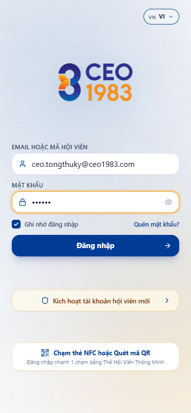
*Hình 2.112: Đăng Nhập Bằng Nhận Diện Sinh Trắc Học FaceID / Vân Tay An Toàn*

---

### 2.113. Bảng Use Case UC-VN-APP-03: Kích Hoạt & Liên Kết Thẻ Danh Thiếp Titanium NFC Vật Lý

| Thuộc Tính Nghiệp Vụ | Nội Dung Đặc Tả Chi Tiết |
| :--- | :--- |
| **Mã Use Case (ID)** | **UC-VN-APP-03** |
| **Phân Hệ / Nhóm** | Phân Hệ Ứng Dụng Di Động ViOne Connect |
| **Tên Chức Năng** | Kích Hoạt & Liên Kết Thẻ Danh Thiếp Titanium NFC Vật Lý |
| **Người Dùng (Actor)** | Hội viên nhận được thẻ Titanium độc bản |
| **Tiền Điều Kiện (Pre-conditions)** | Cầm thẻ NFC trên tay |
| **Luồng Xử Lý Chính (Main Flow)** | 1. Trên app, mở mục "Danh Thiếp Số" -> Nhấn "Kích Hoạt Thẻ Vật Lý". 2. Chạm thẻ Titanium vào vùng đọc NFC mặt sau smartphone (Gần cụm camera). 3. Ứng dụng phát âm thanh "Bíp" và rung nhẹ báo nhận diện chip bảo mật NTAG215/216. 4. Nhập mã kích hoạt bí mật in trên phong bao VIP. 5. Thẻ vật lý được liên kết vĩnh viễn với hồ sơ số của người dùng. |
| **Luồng Thay Thế / Ngoại Lệ** | Mỗi thẻ vật lý có mã định danh duy nhất (UID) chống sao chép giả mạo. |
| **Hậu Điều Kiện (Post-conditions)** | Thẻ Titanium NFC chính thức trở thành danh thiếp số độc bản của doanh nhân. |
| **Hình Ảnh Minh Chứng** | Quy Trình Kích Hoạt & Liên Kết Thẻ Danh Thiếp Titanium NFC Độc Bản (`09_app_vip_card.png`) |

*Hình 2.113: Quy Trình Kích Hoạt & Liên Kết Thẻ Danh Thiếp Titanium NFC Độc Bản*

---

### 2.114. Bảng Use Case UC-VN-APP-04: Chạm Thẻ NFC Truyền Tải Portfolio Số Trong 1 Giây Không Cần Cài App

| Thuộc Tính Nghiệp Vụ | Nội Dung Đặc Tả Chi Tiết |
| :--- | :--- |
| **Mã Use Case (ID)** | **UC-VN-APP-04** |
| **Phân Hệ / Nhóm** | Phân Hệ Ứng Dụng Di Động ViOne Connect |
| **Tên Chức Năng** | Chạm Thẻ NFC Truyền Tải Portfolio Số Trong 1 Giây Không Cần Cài App |
| **Người Dùng (Actor)** | Chủ thẻ và đối tác giao tiếp |
| **Tiền Điều Kiện (Pre-conditions)** | Gặp gỡ đối tác trong sự kiện/hội nghị |
| **Luồng Xử Lý Chính (Main Flow)** | 1. Chủ thẻ chạm nhẹ thẻ Titanium vào lưng điện thoại của đối tác. 2. Điện thoại đối tác tự động bật thông báo mở liên kết web an toàn (Không bắt đối tác cài app). 3. Màn hình Portfolio số hiển thị sang trọng: Ảnh đại diện, Chức danh, Tên công ty, Video giới thiệu, Danh mục sản phẩm B2B. 4. Đối tác ấn tượng với phong cách công nghệ đỉnh cao. |
| **Luồng Thay Thế / Ngoại Lệ** | Tương thích 100% với cả iPhone (từ iPhone 7 trở lên) và các dòng máy Android có NFC. |
| **Hậu Điều Kiện (Post-conditions)** | Tạo ấn tượng chuyên nghiệp vượt trội ngay trong 3 giây đầu tiên gặp gỡ. |
| **Hình Ảnh Minh Chứng** | Thao Tác Chạm Thẻ NFC 1-Giây Mở Hồ Sơ Năng Lực Doanh Nhân Trên Máy Đối Tác (`09_app_vip_card.png`) |

*Hình 2.114: Thao Tác Chạm Thẻ NFC 1-Giây Mở Hồ Sơ Năng Lực Doanh Nhân Trên Máy Đối Tác*

---

### 2.115. Bảng Use Case UC-VN-APP-05: Quét Mã QR Danh Thiếp Động Khi Đối Tác Dùng Thiết Bị Cũ Không Có NFC

| Thuộc Tính Nghiệp Vụ | Nội Dung Đặc Tả Chi Tiết |
| :--- | :--- |
| **Mã Use Case (ID)** | **UC-VN-APP-05** |
| **Phân Hệ / Nhóm** | Phân Hệ Ứng Dụng Di Động ViOne Connect |
| **Tên Chức Năng** | Quét Mã QR Danh Thiếp Động Khi Đối Tác Dùng Thiết Bị Cũ Không Có NFC |
| **Người Dùng (Actor)** | Chủ thẻ gặp đối tác dùng máy đời cũ |
| **Tiền Điều Kiện (Pre-conditions)** | Giao lưu với đối tác |
| **Luồng Xử Lý Chính (Main Flow)** | 1. Trên màn hình danh thiếp app, bấm biểu tượng "Mã QR". 2. Mã QR Code sắc nét mạ vàng hiển thị trên màn hình smartphone của chủ thẻ. 3. Đối tác mở camera điện thoại hoặc app Zalo để quét mã QR. 4. Trình duyệt đối tác lập tức mở ra trang Portfolio số của chủ thẻ tương tự như chạm NFC. |
| **Luồng Thay Thế / Ngoại Lệ** | Mã QR có thể tải về lưu thành ảnh nền khóa màn hình điện thoại tiện dụng. |
| **Hậu Điều Kiện (Post-conditions)** | Đảm bảo kết nối giao thương thành công trong 100% mọi tình huống thiết bị. |
| **Hình Ảnh Minh Chứng** | Hiển Thị Mã QR Code Danh Thiếp Động Phục Vụ Quét Trên Thiết Bị Không Có NFC (`09_app_vip_card.png`) |

*Hình 2.115: Hiển Thị Mã QR Code Danh Thiếp Động Phục Vụ Quét Trên Thiết Bị Không Có NFC*

---

### 2.116. Bảng Use Case UC-VN-APP-06: Tùy Biến Giao Diện Danh Thiếp Số & Quản Trị Liên Kết Xã Hội

| Thuộc Tính Nghiệp Vụ | Nội Dung Đặc Tả Chi Tiết |
| :--- | :--- |
| **Mã Use Case (ID)** | **UC-VN-APP-06** |
| **Phân Hệ / Nhóm** | Phân Hệ Ứng Dụng Di Động ViOne Connect |
| **Tên Chức Năng** | Tùy Biến Giao Diện Danh Thiếp Số & Quản Trị Liên Kết Xã Hội |
| **Người Dùng (Actor)** | Chủ thẻ doanh nhân |
| **Tiền Điều Kiện (Pre-conditions)** | Muốn làm mới thông tin cá nhân |
| **Luồng Xử Lý Chính (Main Flow)** | 1. Vào mục "Chỉnh Sửa Hồ Sơ Danh Thiếp". 2. Chọn mẫu giao diện: Phong cách Doanh nhân Kim Cương, Cổ Điển Hoàng Gia hoặc Công Nghệ Tối Giản. 3. Cập nhật chức vụ mới, công ty mới thành lập. 4. Thêm các liên kết: Số Zalo cá nhân, Fanpage, Kênh Youtube, Gian hàng Shopee/Website, Tệp Catalogue PDF. 5. Bấm Lưu. Dữ liệu trên thẻ NFC lập tức cập nhật thời gian thực. |
| **Luồng Thay Thế / Ngoại Lệ** | Không bao giờ phải vứt bỏ thẻ khi đổi chức vụ hay đổi số điện thoại như danh thiếp giấy. |
| **Hậu Điều Kiện (Post-conditions)** | Tiết kiệm hàng triệu đồng in ấn danh thiếp giấy truyền thống mỗi năm. |
| **Hình Ảnh Minh Chứng** | Giao Diện Tùy Biến Hồ Sơ Danh Thiếp Số & Liên Kết Mạng Xã Hội (`10_app_profile_view.png`) |

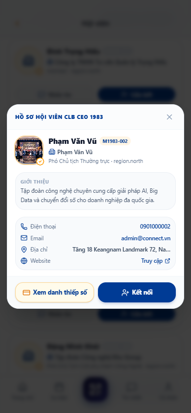
*Hình 2.116: Giao Diện Tùy Biến Hồ Sơ Danh Thiếp Số & Liên Kết Mạng Xã Hội*

---

### 2.117. Bảng Use Case UC-VN-APP-07: Lưu Trực Tiếp Số Điện Thoại & Email Vào Danh Bạ Máy 1-Chạm (.vcf)

| Thuộc Tính Nghiệp Vụ | Nội Dung Đặc Tả Chi Tiết |
| :--- | :--- |
| **Mã Use Case (ID)** | **UC-VN-APP-07** |
| **Phân Hệ / Nhóm** | Phân Hệ Ứng Dụng Di Động ViOne Connect |
| **Tên Chức Năng** | Lưu Trực Tiếp Số Điện Thoại & Email Vào Danh Bạ Máy 1-Chạm (.vcf) |
| **Người Dùng (Actor)** | Đối tác nhận danh thiếp |
| **Tiền Điều Kiện (Pre-conditions)** | Đang xem Portfolio số của chủ thẻ |
| **Luồng Xử Lý Chính (Main Flow)** | 1. Trên màn hình Portfolio số, đối tác bấm nút nổi bật "LƯU DANH BẠ (Save Contact)". 2. Trình duyệt tự động tải tệp tin định dạng chuẩn danh bạ quốc tế `contact.vcf`. 3. Ứng dụng Danh bạ của điện thoại đối tác tự động mở ra với đầy đủ thông tin: Họ tên, Chức vụ, Công ty, Số điện thoại, Email, Ảnh đại diện, Địa chỉ website. 4. Đối tác bấm "Lưu". |
| **Luồng Thay Thế / Ngoại Lệ** | Xóa bỏ hoàn toàn việc phải gõ tay từng con số điện thoại dễ nhầm lẫn. |
| **Hậu Điều Kiện (Post-conditions)** | Thông tin liên hệ của chủ thẻ nằm gọn trong danh bạ đối tác vĩnh viễn. |
| **Hình Ảnh Minh Chứng** | Tính Năng Tự Động Lưu Thông Tin Vào Danh Bạ Điện Thoại Chỉ 1-Chạm (`10_app_profile_view.png`) |

*Hình 2.117: Tính Năng Tự Động Lưu Thông Tin Vào Danh Bạ Điện Thoại Chỉ 1-Chạm*

---

### 2.118. Bảng Use Case UC-VN-APP-08: Tra Cứu Danh Bạ Mạng Lưới Doanh Nhân ViOne Network

| Thuộc Tính Nghiệp Vụ | Nội Dung Đặc Tả Chi Tiết |
| :--- | :--- |
| **Mã Use Case (ID)** | **UC-VN-APP-08** |
| **Phân Hệ / Nhóm** | Phân Hệ Ứng Dụng Di Động ViOne Connect |
| **Tên Chức Năng** | Tra Cứu Danh Bạ Mạng Lưới Doanh Nhân ViOne Network |
| **Người Dùng (Actor)** | Hội viên sử dụng ứng dụng di động |
| **Tiền Điều Kiện (Pre-conditions)** | Muốn tìm kiếm đối tác kinh doanh mới |
| **Luồng Xử Lý Chính (Main Flow)** | 1. Mở mục "Mạng Lưới Giao Thương (Network)". 2. Nhập từ khóa tìm kiếm: Tên doanh nghiệp, Ngành nghề (Ví dụ: "Xây dựng", "Logistics", "Bao bì"). 3. Áp dụng bộ lọc theo Tỉnh thành (Hà Nội, TP.HCM, Đà Nẵng) và Quy mô doanh nghiệp. 4. Xem danh sách hồ sơ doanh nhân đã được xác thực danh tính tích xanh VIP. 5. Nhấp vào hồ sơ để xem chi tiết năng lực sản xuất và thông tin liên hệ. |
| **Luồng Thay Thế / Ngoại Lệ** | Có thể lưu đối tác vào danh sách "Đối Tác Yêu Thích" để theo dõi. |
| **Hậu Điều Kiện (Post-conditions)** | Kết nối trực tiếp tới lãnh đạo cấp cao của các doanh nghiệp trong hệ sinh thái. |
| **Hình Ảnh Minh Chứng** | Tra Cứu Danh Bạ Mạng Lưới Doanh Nhân B2B Được Xác Thực Tích Xanh (`23_app_members_directory.png`) |

*Hình 2.118: Tra Cứu Danh Bạ Mạng Lưới Doanh Nhân B2B Được Xác Thực Tích Xanh*

---

### 2.119. Bảng Use Case UC-VN-APP-09: Tìm Kiếm Đối Tác Kinh Doanh Theo Vị Trí Gần Bạn (GPS Nearby)

| Thuộc Tính Nghiệp Vụ | Nội Dung Đặc Tả Chi Tiết |
| :--- | :--- |
| **Mã Use Case (ID)** | **UC-VN-APP-09** |
| **Phân Hệ / Nhóm** | Phân Hệ Ứng Dụng Di Động ViOne Connect |
| **Tên Chức Năng** | Tìm Kiếm Đối Tác Kinh Doanh Theo Vị Trí Gần Bạn (GPS Nearby) |
| **Người Dùng (Actor)** | Doanh nhân đang đi công tác |
| **Tiền Điều Kiện (Pre-conditions)** | Bật tính năng định vị vị trí trên app |
| **Luồng Xử Lý Chính (Main Flow)** | 1. Chọn chế độ xem "Đối Tác Gần Bạn (GPS Radar)". 2. Ứng dụng quét vị trí trong bán kính 1km - 5km - 10km quanh tọa độ hiện tại. 3. Bản đồ số hiển thị các chấm xanh định vị các doanh nghiệp hội viên lân cận. 4. Bấm vào một điểm để xem tên công ty và khoảng cách thực tế (Ví dụ: "Cách bạn 450m"). 5. Bấm "Chỉ đường" hoặc "Gửi lời mời cà phê giao lưu". |
| **Luồng Thay Thế / Ngoại Lệ** | Người dùng có thể bật chế độ ẩn danh nếu không muốn hiển thị vị trí của mình. |
| **Hậu Điều Kiện (Post-conditions)** | Tận dụng tối đa thời gian công tác để gặp gỡ kết nối các đối tác tiềm năng gần nhất. |
| **Hình Ảnh Minh Chứng** | Bản Đồ Định Vị Tìm Kiếm Đối Tác Kinh Doanh Lân Cận Theo Tọa Độ GPS (`23_app_members_directory.png`) |

*Hình 2.119: Bản Đồ Định Vị Tìm Kiếm Đối Tác Kinh Doanh Lân Cận Theo Tọa Độ GPS*

---

### 2.120. Bảng Use Case UC-VN-APP-10: Nhắn Tin Trò Chuyện 1-1 Mã Hóa Đầu Cuối (Encrypted Chat)

| Thuộc Tính Nghiệp Vụ | Nội Dung Đặc Tả Chi Tiết |
| :--- | :--- |
| **Mã Use Case (ID)** | **UC-VN-APP-10** |
| **Phân Hệ / Nhóm** | Phân Hệ Ứng Dụng Di Động ViOne Connect |
| **Tên Chức Năng** | Nhắn Tin Trò Chuyện 1-1 Mã Hóa Đầu Cuối (Encrypted Chat) |
| **Người Dùng (Actor)** | Hai doanh nhân trong mạng lưới |
| **Tiền Điều Kiện (Pre-conditions)** | Cần trao đổi công việc bảo mật |
| **Luồng Xử Lý Chính (Main Flow)** | 1. Mở khung chat với đối tác từ danh bạ. 2. Soạn tin nhắn văn bản, gửi biểu tượng cảm xúc. 3. Toàn bộ nội dung tin nhắn được mã hóa đầu cuối (End-to-End Encryption) bằng khóa bảo mật riêng. 4. Tin nhắn gửi đi tức thời qua giao thức WebSocket với độ trễ dưới 50ms. 5. Xem trạng thái: Đã gửi, Đã nhận, Đã xem. |
| **Luồng Thay Thế / Ngoại Lệ** | Hỗ trợ tính năng "Tin nhắn tự hủy" sau 24 giờ cho các thông tin bảo mật cao. |
| **Hậu Điều Kiện (Post-conditions)** | Kênh liên lạc nội bộ an toàn tuyệt đối, không lo bị lộ bí mật kinh doanh. |
| **Hình Ảnh Minh Chứng** | Khung Trò Chuyện Nhắn Tin 1-1 Mã Hóa Đầu Cuối An Toàn Tuyệt Đối (`25_app_chat_conversation.png`) |

*Hình 2.120: Khung Trò Chuyện Nhắn Tin 1-1 Mã Hóa Đầu Cuối An Toàn Tuyệt Đối*

---

### 2.121. Bảng Use Case UC-VN-APP-11: Tạo Nhóm Trò Chuyện Giao Thương Theo Ban Ngành / Hiệp Hội

| Thuộc Tính Nghiệp Vụ | Nội Dung Đặc Tả Chi Tiết |
| :--- | :--- |
| **Mã Use Case (ID)** | **UC-VN-APP-11** |
| **Phân Hệ / Nhóm** | Phân Hệ Ứng Dụng Di Động ViOne Connect |
| **Tên Chức Năng** | Tạo Nhóm Trò Chuyện Giao Thương Theo Ban Ngành / Hiệp Hội |
| **Người Dùng (Actor)** | Trưởng ban kết nối, Hội viên |
| **Tiền Điều Kiện (Pre-conditions)** | Cần không gian trao đổi chung cho nhóm |
| **Luồng Xử Lý Chính (Main Flow)** | 1. Bấm "Tạo Nhóm Trò Chuyện Mới". 2. Nhập tên nhóm: "Ban Xúc Tiến Bất Động Sản B2B". 3. Chọn ảnh đại diện nhóm và thêm các thành viên từ danh bạ. 4. Phân quyền Quản trị viên nhóm (Admin) và Thành viên. 5. Ghim các thông báo quan trọng lên đầu nhóm. |
| **Luồng Thay Thế / Ngoại Lệ** | Nhóm hỗ trợ tối đa lên tới 5,000 thành viên hoạt động mượt mà. |
| **Hậu Điều Kiện (Post-conditions)** | Không gian sinh hoạt chuyên ngành sôi nổi và gắn kết giữa các doanh nghiệp. |
| **Hình Ảnh Minh Chứng** | Giao Diện Quản Lý & Trò Chuyện Nhóm Doanh Nghiệp Theo Chuyên Ngành (`24_app_messages_inbox.png`) |

*Hình 2.121: Giao Diện Quản Lý & Trò Chuyện Nhóm Doanh Nghiệp Theo Chuyên Ngành*

---

### 2.122. Bảng Use Case UC-VN-APP-12: Gửi Hình Ảnh, Tệp Báo Giá PDF & Danh Thiếp Trực Tiếp Trong Chat

| Thuộc Tính Nghiệp Vụ | Nội Dung Đặc Tả Chi Tiết |
| :--- | :--- |
| **Mã Use Case (ID)** | **UC-VN-APP-12** |
| **Phân Hệ / Nhóm** | Phân Hệ Ứng Dụng Di Động ViOne Connect |
| **Tên Chức Năng** | Gửi Hình Ảnh, Tệp Báo Giá PDF & Danh Thiếp Trực Tiếp Trong Chat |
| **Người Dùng (Actor)** | Thành viên đang trao đổi thương thảo |
| **Tiền Điều Kiện (Pre-conditions)** | Cần gửi tài liệu chứng minh năng lực |
| **Luồng Xử Lý Chính (Main Flow)** | 1. Trong khung chat, bấm biểu tượng dấu cộng (+). 2. Chọn tệp tin từ máy: Tệp báo giá PDF, Catalog sản phẩm, Ảnh chụp nhà xưởng hoặc Danh thiếp số của đối tác khác. 3. Tệp được truyền tải với tốc độ cao, giữ nguyên chất lượng hình ảnh gốc không bị nén mờ. 4. Đối tác có thể mở đọc trực tiếp tệp PDF ngay trong ứng dụng. |
| **Luồng Thay Thế / Ngoại Lệ** | Lưu trữ toàn bộ tệp phương tiện vào kho lưu trữ chung của cuộc trò chuyện. |
| **Hậu Điều Kiện (Post-conditions)** | Trao đổi tài liệu kinh doanh nhanh chóng, tiện lợi ngay trong một ứng dụng. |
| **Hình Ảnh Minh Chứng** | Chia Sẻ Tệp Báo Giá PDF & Hình Ảnh Chất Lượng Cao Trong Khung Chat (`25_app_chat_conversation.png`) |

*Hình 2.122: Chia Sẻ Tệp Báo Giá PDF & Hình Ảnh Chất Lượng Cao Trong Khung Chat*

---

### 2.123. Bảng Use Case UC-VN-APP-13: Thực Hiện Cuộc Gọi Thoại & Video Call Nội Bộ Bảo Mật Miễn Phí

| Thuộc Tính Nghiệp Vụ | Nội Dung Đặc Tả Chi Tiết |
| :--- | :--- |
| **Mã Use Case (ID)** | **UC-VN-APP-13** |
| **Phân Hệ / Nhóm** | Phân Hệ Ứng Dụng Di Động ViOne Connect |
| **Tên Chức Năng** | Thực Hiện Cuộc Gọi Thoại & Video Call Nội Bộ Bảo Mật Miễn Phí |
| **Người Dùng (Actor)** | Doanh nhân cần đàm phán trực tiếp |
| **Tiền Điều Kiện (Pre-conditions)** | Có kết nối internet Wifi/4G/5G |
| **Luồng Xử Lý Chính (Main Flow)** | 1. Trong khung chat, bấm biểu tượng "Gọi Điện" hoặc "Gọi Video". 2. Ứng dụng thiết lập kết nối ngang hàng WebRTC chất lượng cao HD Audio. 3. Màn hình chuông gọi đến rung và phát âm thanh sang trọng trên máy đối tác. 4. Đàm thoại rõ nét, lọc tiếng ồn xung quanh bằng thuật toán AI. 5. Kết thúc cuộc gọi và ghi nhận thời lượng cuộc gọi vào nhật ký. |
| **Luồng Thay Thế / Ngoại Lệ** | Tự động thích ứng chất lượng hình ảnh khi đường truyền mạng yếu. |
| **Hậu Điều Kiện (Post-conditions)** | Đàm thoại bảo mật, tiết kiệm toàn bộ cước phí viễn thông khi liên lạc quốc tế. |
| **Hình Ảnh Minh Chứng** | Giao Diện Thực Hiện Cuộc Gọi Thoại & Video Call Chuẩn HD Nội Bộ (`09_app_chat_call_messenger_bubble.png`) |

*Hình 2.123: Giao Diện Thực Hiện Cuộc Gọi Thoại & Video Call Chuẩn HD Nội Bộ*

---

### 2.124. Bảng Use Case UC-VN-APP-14: Đăng Tin Nhu Cầu Mua / Bán Trên Sàn Cơ Hội Giao Thương B2B

| Thuộc Tính Nghiệp Vụ | Nội Dung Đặc Tả Chi Tiết |
| :--- | :--- |
| **Mã Use Case (ID)** | **UC-VN-APP-14** |
| **Phân Hệ / Nhóm** | Phân Hệ Ứng Dụng Di Động ViOne Connect |
| **Tên Chức Năng** | Đăng Tin Nhu Cầu Mua / Bán Trên Sàn Cơ Hội Giao Thương B2B |
| **Người Dùng (Actor)** | Doanh nghiệp cần tìm nguồn hàng hoặc đối tác |
| **Tiền Điều Kiện (Pre-conditions)** | Hội viên có quyền giao thương |
| **Luồng Xử Lý Chính (Main Flow)** | 1. Vào mục "Sàn Cơ Hội Giao Thương". Nhấn "Đăng Tin Mới". 2. Chọn loại tin: "Cần Mua (Cầu)" hoặc "Chào Bán (Cung)". 3. Nhập tiêu đề: "Tìm nhà thầu gia công kết cấu thép 500 tấn tại Hà Nội". 4. Nhập quy cách kỹ thuật, ngân sách dự kiến và thời hạn đóng chào thầu. 5. Đính kèm bản vẽ kỹ thuật. 6. Bấm "Đăng Tin". |
| **Luồng Thay Thế / Ngoại Lệ** | Tin đăng được kiểm duyệt tự động bằng bộ lọc từ khóa trong 1 phút. |
| **Hậu Điều Kiện (Post-conditions)** | Cơ hội tiếp cận hàng nghìn doanh nghiệp đối tác có năng lực phù hợp tức thì. |
| **Hình Ảnh Minh Chứng** | Đăng Tin Chào Mua / Chào Bán Trên Sàn Cơ Hội Giao Thương B2B (`20_app_opportunities_feed.png`) |

*Hình 2.124: Đăng Tin Chào Mua / Chào Bán Trên Sàn Cơ Hội Giao Thương B2B*

---

### 2.125. Bảng Use Case UC-VN-APP-15: Nhận Thông Báo Khớp Lệnh Cơ Hội Cung - Cầu Tự Động Bằng AI

| Thuộc Tính Nghiệp Vụ | Nội Dung Đặc Tả Chi Tiết |
| :--- | :--- |
| **Mã Use Case (ID)** | **UC-VN-APP-15** |
| **Phân Hệ / Nhóm** | Phân Hệ Ứng Dụng Di Động ViOne Connect |
| **Tên Chức Năng** | Nhận Thông Báo Khớp Lệnh Cơ Hội Cung - Cầu Tự Động Bằng AI |
| **Người Dùng (Actor)** | Doanh nghiệp có hồ sơ năng lực khớp yêu cầu |
| **Tiền Điều Kiện (Pre-conditions)** | Khi có tin đăng nhu cầu mới trên sàn |
| **Luồng Xử Lý Chính (Main Flow)** | 1. Hệ thống AI tự động phân tích từ khóa tin đăng mới và đối chiếu với hồ sơ năng lực các hội viên. 2. Phát hiện doanh nghiệp B có ngành nghề "Kết cấu thép" phù hợp 95% với tin đăng của doanh nghiệp A. 3. Bắn thông báo đẩy riêng tới app của doanh nghiệp B: "Có cơ hội hợp tác mới phù hợp với bạn!". 4. Doanh nghiệp B bấm vào thông báo để xem chi tiết và nhấn "Gửi Đề Xuất Hợp Tác". |
| **Luồng Thay Thế / Ngoại Lệ** | Rút ngắn thời gian tìm kiếm nhà cung cấp từ vài tuần xuống còn vài giờ. |
| **Hậu Điều Kiện (Post-conditions)** | Khớp lệnh giao thương chính xác, đem lại doanh thu thực tế cho hội viên. |
| **Hình Ảnh Minh Chứng** | Thuật Toán AI Tự Động Khớp Lệnh Cơ Hội Cung - Cầu & Bắn Thông Báo Tức Thời (`21_app_opp_posted.png`) |

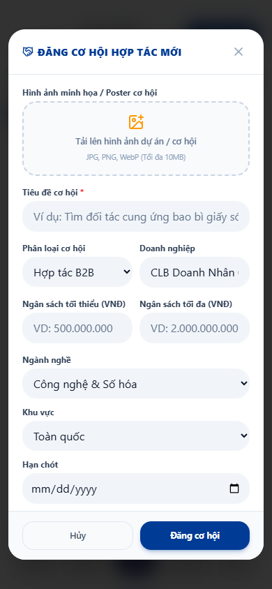
*Hình 2.125: Thuật Toán AI Tự Động Khớp Lệnh Cơ Hội Cung - Cầu & Bắn Thông Báo Tức Thời*

---

### 2.126. Bảng Use Case UC-VN-APP-16: Xem Lịch Sự Kiện Doanh Nhân, Hội Thảo & Diễn Đàn Đầu Tư

| Thuộc Tính Nghiệp Vụ | Nội Dung Đặc Tả Chi Tiết |
| :--- | :--- |
| **Mã Use Case (ID)** | **UC-VN-APP-16** |
| **Phân Hệ / Nhóm** | Phân Hệ Ứng Dụng Di Động ViOne Connect |
| **Tên Chức Năng** | Xem Lịch Sự Kiện Doanh Nhân, Hội Thảo & Diễn Đàn Đầu Tư |
| **Người Dùng (Actor)** | Hội viên quan tâm các hoạt động kết nối |
| **Tiền Điều Kiện (Pre-conditions)** | Mở ứng dụng xem trang chủ |
| **Luồng Xử Lý Chính (Main Flow)** | 1. Vào mục "Sự Kiện". Xem danh sách các hội nghị, tọa đàm sắp diễn ra. 2. Xem chi tiết từng sự kiện: Chủ đề thảo luận, Danh sách diễn giả nổi tiếng, Thời gian, Địa điểm tổ chức tại khách sạn 5 sao. 3. Xem sơ đồ khán phòng và số lượng vé VIP còn lại. 4. Bấm "Thêm vào Lịch Cá Nhân" để đồng bộ vào Google Calendar. |
| **Luồng Thay Thế / Ngoại Lệ** | Có thể lọc sự kiện theo hình thức: Trực tiếp (Offline) hoặc Trực tuyến (Webinar). |
| **Hậu Điều Kiện (Post-conditions)** | Không bỏ lỡ bất kỳ cơ hội giao lưu mở rộng quan hệ lãnh đạo nào. |
| **Hình Ảnh Minh Chứng** | Lịch Sự Kiện Doanh Nhân, Hội Thảo Đầu Tư & Thông Tin Diễn Giả Chi Tiết (`13_app_events_screen.png`) |

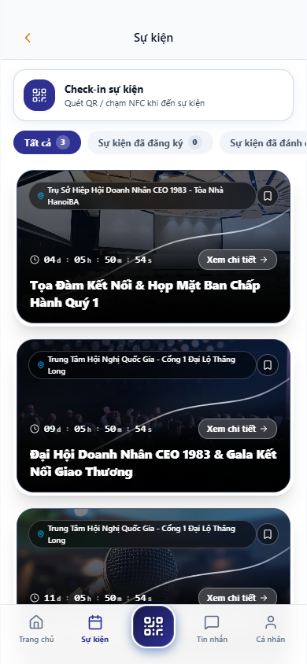
*Hình 2.126: Lịch Sự Kiện Doanh Nhân, Hội Thảo Đầu Tư & Thông Tin Diễn Giả Chi Tiết*

---

### 2.127. Bảng Use Case UC-VN-APP-17: Đăng Ký Vé Tham Dự Sự Kiện & Chọn Vị Trí Bàn Tiệc VIP

| Thuộc Tính Nghiệp Vụ | Nội Dung Đặc Tả Chi Tiết |
| :--- | :--- |
| **Mã Use Case (ID)** | **UC-VN-APP-17** |
| **Phân Hệ / Nhóm** | Phân Hệ Ứng Dụng Di Động ViOne Connect |
| **Tên Chức Năng** | Đăng Ký Vé Tham Dự Sự Kiện & Chọn Vị Trí Bàn Tiệc VIP |
| **Người Dùng (Actor)** | Hội viên có nhu cầu tham dự |
| **Tiền Điều Kiện (Pre-conditions)** | Sự kiện đang mở cổng đăng ký vé |
| **Luồng Xử Lý Chính (Main Flow)** | 1. Mở sự kiện cần tham dự. Nhấn "Đăng Ký Tham Dự". 2. Chọn loại vé: Vé VIP (Ngồi bàn danh dự gần sân khấu) hoặc Vé Tiêu chuẩn. 3. Xem sơ đồ bàn tiệc trực quan, chọn vị trí số bàn mong muốn ngồi cùng các doanh nghiệp cùng ngành. 4. Điền thông tin đại biểu tham dự và người đi cùng (nếu có). 5. Bấm Xác nhận. |
| **Luồng Thay Thế / Ngoại Lệ** | Nếu vé có thu phí, hệ thống chuyển sang bước thanh toán VietQR trong 1 giây. |
| **Hậu Điều Kiện (Post-conditions)** | Vé điện tử mã QR Code được phát hành ngay lập tức vào "Ví Vé Của Tôi". |
| **Hình Ảnh Minh Chứng** | Đăng Ký Vé Tham Dự Sự Kiện & Lựa Chọn Vị Trí Bàn Tiệc Trực Quan (`06_app_event_detail_modal.png`) |

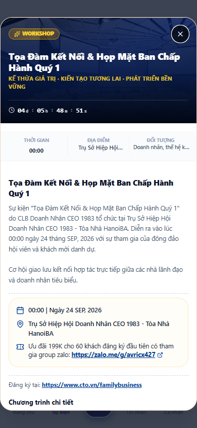
*Hình 2.127: Đăng Ký Vé Tham Dự Sự Kiện & Lựa Chọn Vị Trí Bàn Tiệc Trực Quan*

---

### 2.128. Bảng Use Case UC-VN-APP-18: Hiển Thị Vé Điện Tử Mã QR Code Động Chống Làm Giả

| Thuộc Tính Nghiệp Vụ | Nội Dung Đặc Tả Chi Tiết |
| :--- | :--- |
| **Mã Use Case (ID)** | **UC-VN-APP-18** |
| **Phân Hệ / Nhóm** | Phân Hệ Ứng Dụng Di Động ViOne Connect |
| **Tên Chức Năng** | Hiển Thị Vé Điện Tử Mã QR Code Động Chống Làm Giả |
| **Người Dùng (Actor)** | Đại biểu đã có vé tham dự |
| **Tiền Điều Kiện (Pre-conditions)** | Đến ngày diễn ra sự kiện |
| **Luồng Xử Lý Chính (Main Flow)** | 1. Mở app ViOne Connect, vào mục "Ví Vé Của Tôi". 2. Chọn sự kiện hôm nay. Màn hình hiển thị Thẻ Vé Điện Tử (E-Ticket) tuyệt đẹp. 3. Hiển thị thông tin: Họ tên đại biểu, Đơn vị công tác, Số bàn tiệc, Cửa vào. 4. Mã QR Code động hiển thị với viền sáng đổi màu liên tục và mã bảo mật thay đổi theo chu kỳ 30 giây để chống chụp ảnh màn hình làm giả. |
| **Luồng Thay Thế / Ngoại Lệ** | Vé lưu trữ offline trên máy, mất mạng internet vẫn mở vé quét bình thường. |
| **Hậu Điều Kiện (Post-conditions)** | Trải nghiệm đón tiếp thượng lưu, văn minh và loại bỏ hoàn toàn vé giấy. |
| **Hình Ảnh Minh Chứng** | Hiển Thị Vé Điện Tử E-Ticket Với Mã QR Code Động Chống Gian Lận (`14_app_event_checkin_pass.png`) |

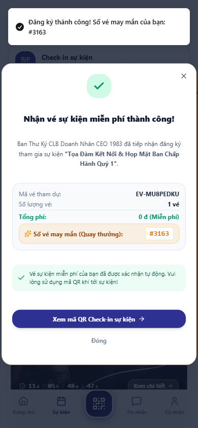
*Hình 2.128: Hiển Thị Vé Điện Tử E-Ticket Với Mã QR Code Động Chống Gian Lận*

---

### 2.129. Bảng Use Case UC-VN-APP-19: Quét Vé Check-in Điểm Danh Siêu Tốc 0.2 Giây Tại Cửa An Ninh

| Thuộc Tính Nghiệp Vụ | Nội Dung Đặc Tả Chi Tiết |
| :--- | :--- |
| **Mã Use Case (ID)** | **UC-VN-APP-19** |
| **Phân Hệ / Nhóm** | Phân Hệ Ứng Dụng Di Động ViOne Connect |
| **Tên Chức Năng** | Quét Vé Check-in Điểm Danh Siêu Tốc 0.2 Giây Tại Cửa An Ninh |
| **Người Dùng (Actor)** | Ban Tổ Chức, Lễ tân đón tiếp |
| **Tiền Điều Kiện (Pre-conditions)** | Sử dụng camera máy quét của BTC |
| **Luồng Xử Lý Chính (Main Flow)** | 1. Lễ tân mở chế độ "Soát Vé An Ninh" trên app ViOne Connect. 2. Hướng camera vào mã QR trên điện thoại của đại biểu. 3. Ứng dụng nhận diện và giải mã siêu tốc trong 0.2 giây. 4. Màn hình phát âm thanh "Ting" và hiện tích xanh: "Đón tiếp: Ông Nguyễn Văn A - Chủ tịch Tập đoàn X - Bàn VIP 01". 5. Máy in tự động in thẻ đeo đại biểu tại bàn lễ tân trong 2 giây. |
| **Luồng Thay Thế / Ngoại Lệ** | Nếu vé đã quét trước đó, màn hình báo đỏ: "Cảnh báo: Vé đã check-in lúc 08:15!". |
| **Hậu Điều Kiện (Post-conditions)** | Giải quyết triệt để tình trạng ùn tắc tại cửa đón tiếp các sự kiện hàng nghìn người. |
| **Hình Ảnh Minh Chứng** | Giao Diện Quét Vé Check-in Điểm Danh Siêu Tốc 0.2 Giây Tại Cửa Đón Tiếp (`14_app_event_checkin_pass.png`) |

*Hình 2.129: Giao Diện Quét Vé Check-in Điểm Danh Siêu Tốc 0.2 Giây Tại Cửa Đón Tiếp*

---

### 2.130. Bảng Use Case UC-VN-APP-20: Bỏ Phiếu Biểu Quyết Trực Tuyến Thời Gian Thực Trong Đại Hội

| Thuộc Tính Nghiệp Vụ | Nội Dung Đặc Tả Chi Tiết |
| :--- | :--- |
| **Mã Use Case (ID)** | **UC-VN-APP-20** |
| **Phân Hệ / Nhóm** | Phân Hệ Ứng Dụng Di Động ViOne Connect |
| **Tên Chức Năng** | Bỏ Phiếu Biểu Quyết Trực Tuyến Thời Gian Thực Trong Đại Hội |
| **Người Dùng (Actor)** | Đại biểu tham gia đại hội cổ đông/hội nghị |
| **Tiền Điều Kiện (Pre-conditions)** | Đại hội đang tiến hành biểu quyết |
| **Luồng Xử Lý Chính (Main Flow)** | 1. Khi Chủ tọa mở phiên biểu quyết, màn hình app tự động pop-up giao diện bỏ phiếu. 2. Xem nội dung nghị quyết: "Thông qua Kế hoạch Kinh doanh Năm 2026". 3. Đại biểu chọn: "Tán Thành", "Không Tán Thành" hoặc "Ý Kiến Khác". 4. Bấm "Gửi Biểu Quyết". 5. Kết quả tổng hợp % phiếu bầu lập tức hiển thị nhảy số trực tiếp trên màn hình LED sân khấu lớn. |
| **Luồng Thay Thế / Ngoại Lệ** | Hệ thống kiểm soát mỗi đại biểu chỉ được bỏ phiếu 01 lần duy nhất theo tỷ lệ cổ phần/quyền biểu quyết. |
| **Hậu Điều Kiện (Post-conditions)** | Minh bạch 100% kết quả đại hội, không thể can thiệp số liệu gian lận. |
| **Hình Ảnh Minh Chứng** | Giao Diện Bỏ Phiếu Biểu Quyết Điện Tử Trực Tiếp Thời Gian Thực (Live Voting) (`15_app_live_voting.png`) |

*Hình 2.130: Giao Diện Bỏ Phiếu Biểu Quyết Điện Tử Trực Tiếp Thời Gian Thực (Live Voting)*

---

### 2.131. Bảng Use Case UC-VN-APP-21: Tạo Mã VietQR Nhận Tiền Cá Nhân Hóa Thương Hiệu Doanh Nghiệp

| Thuộc Tính Nghiệp Vụ | Nội Dung Đặc Tả Chi Tiết |
| :--- | :--- |
| **Mã Use Case (ID)** | **UC-VN-APP-21** |
| **Phân Hệ / Nhóm** | Phân Hệ Ứng Dụng Di Động ViOne Connect |
| **Tên Chức Năng** | Tạo Mã VietQR Nhận Tiền Cá Nhân Hóa Thương Hiệu Doanh Nghiệp |
| **Người Dùng (Actor)** | Chủ doanh nghiệp, Kế toán bán hàng |
| **Tiền Điều Kiện (Pre-conditions)** | Cần nhận thanh toán nhanh từ đối tác |
| **Luồng Xử Lý Chính (Main Flow)** | 1. Vào mục "Nhận Tiền VietQR" trên app. 2. Nhập số tiền cần thanh toán (Ví dụ: 15,500,000 VNĐ) và nội dung thanh toán. 3. Ứng dụng sinh ra mã VietQR Napas 24/7 tuyệt đẹp có gắn logo và tên thương hiệu doanh nghiệp ở giữa. 4. Đưa cho đối tác quét trực tiếp hoặc bấm "Chia sẻ mã QR qua Zalo/Email". |
| **Luồng Thay Thế / Ngoại Lệ** | Khi đối tác chuyển khoản xong, app thông báo biến động số dư và phát âm thanh tiền về. |
| **Hậu Điều Kiện (Post-conditions)** | Thuận tiện giao dịch mua bán tại chỗ mà không cần mang theo máy POS cồng kềnh. |
| **Hình Ảnh Minh Chứng** | Sinh Mã VietQR Nhận Tiền Cá Nhân Hóa Kèm Logo Doanh Nghiệp (`08_app_vietqr_payment_modal.png`) |

*Hình 2.131: Sinh Mã VietQR Nhận Tiền Cá Nhân Hóa Kèm Logo Doanh Nghiệp*

---

### 2.132. Bảng Use Case UC-VN-APP-22: Quét Mã VietQR Thanh Toán Hóa Đơn & Hội Phí Siêu Tốc

| Thuộc Tính Nghiệp Vụ | Nội Dung Đặc Tả Chi Tiết |
| :--- | :--- |
| **Mã Use Case (ID)** | **UC-VN-APP-22** |
| **Phân Hệ / Nhóm** | Phân Hệ Ứng Dụng Di Động ViOne Connect |
| **Tên Chức Năng** | Quét Mã VietQR Thanh Toán Hóa Đơn & Hội Phí Siêu Tốc |
| **Người Dùng (Actor)** | Hội viên có hóa đơn cần đóng phí |
| **Tiền Điều Kiện (Pre-conditions)** | Nhận được thông báo đóng phí thành viên |
| **Luồng Xử Lý Chính (Main Flow)** | 1. Mở thông báo hóa đơn trên app. 2. Chọn "Thanh Toán Ngay Qua VietQR". 3. Ứng dụng tự động kích hoạt liên kết sâu (Deep Link) mở thẳng ứng dụng ngân hàng mà người dùng đang sử dụng. 4. Đơn hàng tự điền sẵn số tiền và nội dung chuyển khoản. 5. Người dùng chỉ cần xác thực FaceID trên app ngân hàng để hoàn tất. |
| **Luồng Thay Thế / Ngoại Lệ** | Không lo gõ nhầm số tài khoản hay sai sót nội dung chuyển tiền. |
| **Hậu Điều Kiện (Post-conditions)** | Thanh toán phí hội viên và hóa đơn dịch vụ chỉ trong 3 thao tác đơn giản. |
| **Hình Ảnh Minh Chứng** | Thanh Toán Hóa Đơn Tự Động Bằng Deep-Link Ứng Dụng Ngân Hàng (`08_app_vietqr_payment_modal.png`) |

*Hình 2.132: Thanh Toán Hóa Đơn Tự Động Bằng Deep-Link Ứng Dụng Ngân Hàng*

---

### 2.133. Bảng Use Case UC-VN-APP-23: Xem Kho E-Voucher & Quyền Lợi Độc Quyền Dành Cho Hội Viên

| Thuộc Tính Nghiệp Vụ | Nội Dung Đặc Tả Chi Tiết |
| :--- | :--- |
| **Mã Use Case (ID)** | **UC-VN-APP-23** |
| **Phân Hệ / Nhóm** | Phân Hệ Ứng Dụng Di Động ViOne Connect |
| **Tên Chức Năng** | Xem Kho E-Voucher & Quyền Lợi Độc Quyền Dành Cho Hội Viên |
| **Người Dùng (Actor)** | Hội viên VIP ViOne |
| **Tiền Điều Kiện (Pre-conditions)** | Khám phá các ưu đãi đối tác |
| **Luồng Xử Lý Chính (Main Flow)** | 1. Vào mục "Ưu Đãi & Đặc Quyền". 2. Xem danh sách các voucher giảm giá từ hệ sinh thái: Khách sạn nghỉ dưỡng, Sân Golf, Nhà hàng cao cấp, Dịch vụ xe đưa đón sân bay. 3. Bấm "Nhận Mã Ưu Đãi". 4. Xuất trình mã voucher điện tử khi sử dụng dịch vụ tại các đối tác liên kết. |
| **Luồng Thay Thế / Ngoại Lệ** | Hệ thống tự động theo dõi hạn dùng voucher và thông báo trước khi hết hạn. |
| **Hậu Điều Kiện (Post-conditions)** | Gia tăng giá trị thực tế vượt bậc cho tấm thẻ thành viên doanh nhân. |
| **Hình Ảnh Minh Chứng** | Kho Ưu Đãi Độc Quyền & Danh Sách Đặc Quyền Dành Riêng Cho Hội Viên VIP (`16_app_products_ecommerce_grid.png`) |

*Hình 2.133: Kho Ưu Đãi Độc Quyền & Danh Sách Đặc Quyền Dành Riêng Cho Hội Viên VIP*

---

### 2.134. Bảng Use Case UC-VN-APP-24: Đổi Mật Khẩu, Cấu Hình Quyền Riêng Tư & Khóa Thẻ NFC Từ Xa

| Thuộc Tính Nghiệp Vụ | Nội Dung Đặc Tả Chi Tiết |
| :--- | :--- |
| **Mã Use Case (ID)** | **UC-VN-APP-24** |
| **Phân Hệ / Nhóm** | Phân Hệ Ứng Dụng Di Động ViOne Connect |
| **Tên Chức Năng** | Đổi Mật Khẩu, Cấu Hình Quyền Riêng Tư & Khóa Thẻ NFC Từ Xa |
| **Người Dùng (Actor)** | Chủ thẻ trong trường hợp bị rơi mất thẻ |
| **Tiền Điều Kiện (Pre-conditions)** | Cần bảo vệ an toàn thông tin |
| **Luồng Xử Lý Chính (Main Flow)** | 1. Vào mục "Cài Đặt Bảo Mật". 2. Trong trường hợp đánh rơi thẻ Titanium NFC vật lý, nhấn nút đỏ "KHÓA THẺ TỨC THÌ". 3. Hệ thống lập tức vô hiệu hóa chip NFC trên thẻ đó, khi người lạ chạm thẻ sẽ hiển thị thông báo "Thẻ đã bị khóa". 4. Đổi mật khẩu đăng nhập và bật chế độ xác thực vân tay bắt buộc. |
| **Luồng Thay Thế / Ngoại Lệ** | Khi tìm lại được thẻ, có thể mở khóa lại bình thường chỉ bằng một nút bấm. |
| **Hậu Điều Kiện (Post-conditions)** | Yên tâm tuyệt đối, không sợ bị kẻ gian lợi dụng danh tính khi mất thẻ. |
| **Hình Ảnh Minh Chứng** | Giao Diện Cài Đặt Bảo Mật, Đổi Mật Khẩu & Khóa Thẻ NFC Từ Xa Khẩn Cấp (`11_app_settings_password.png`) |

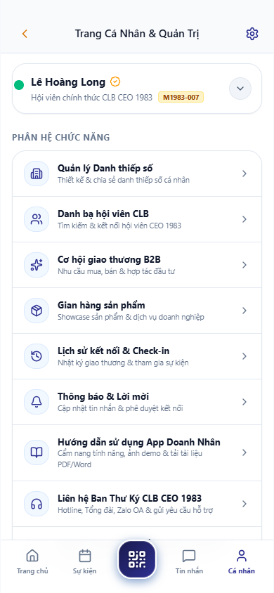
*Hình 2.134: Giao Diện Cài Đặt Bảo Mật, Đổi Mật Khẩu & Khóa Thẻ NFC Từ Xa Khẩn Cấp*

---

### 2.135. Bảng Use Case UC-VN-APP-25: Đồng Bộ Dữ Liệu Offline Khi Thiết Bị Mất Kết Nối Mạng Internet

| Thuộc Tính Nghiệp Vụ | Nội Dung Đặc Tả Chi Tiết |
| :--- | :--- |
| **Mã Use Case (ID)** | **UC-VN-APP-25** |
| **Phân Hệ / Nhóm** | Phân Hệ Ứng Dụng Di Động ViOne Connect |
| **Tên Chức Năng** | Đồng Bộ Dữ Liệu Offline Khi Thiết Bị Mất Kết Nối Mạng Internet |
| **Người Dùng (Actor)** | Người dùng ở vùng sóng yếu hoặc trên máy bay |
| **Tiền Điều Kiện (Pre-conditions)** | Thiết bị mất mạng internet |
| **Luồng Xử Lý Chính (Main Flow)** | 1. Khi mất kết nối internet, ứng dụng tự động chuyển sang chế độ "Ngoại Tuyến (Offline Mode)". 2. Người dùng vẫn xem được toàn bộ danh bạ đã tải, danh thiếp số cá nhân và vé sự kiện. 3. Mọi thao tác ghi chú, tạo đầu việc mới được lưu trữ an toàn vào cơ sở dữ liệu SQLite cục bộ trên máy. 4. Khi điện thoại kết nối lại Wifi/4G, hệ thống tự động chạy ngầm đồng bộ toàn bộ dữ liệu lên máy chủ. |
| **Luồng Thay Thế / Ngoại Lệ** | Có cơ chế giải quyết xung đột dữ liệu (Conflict Resolution) thông minh. |
| **Hậu Điều Kiện (Post-conditions)** | Trải nghiệm sử dụng liên tục, không bao giờ bị gián đoạn công việc vì sự cố mạng. |
| **Hình Ảnh Minh Chứng** | Cơ Chế Lưu Trữ Bộ Nhớ Đệm & Tự Động Đồng Bộ Dữ Liệu Khi Có Mạng Lại (`08_app_home_dashboard.png`) |

*Hình 2.135: Cơ Chế Lưu Trữ Bộ Nhớ Đệm & Tự Động Đồng Bộ Dữ Liệu Khi Có Mạng Lại*

---

### 2.136. Bảng Use Case UC-VN-AI-01: Kích Hoạt Trợ Lý ViOne AI Copilot Trên Mọi Màn Hình Làm Việc

| Thuộc Tính Nghiệp Vụ | Nội Dung Đặc Tả Chi Tiết |
| :--- | :--- |
| **Mã Use Case (ID)** | **UC-VN-AI-01** |
| **Phân Hệ / Nhóm** | Phân Hệ Trí Tuệ Nhân Tạo ViOne AI Copilot |
| **Tên Chức Năng** | Kích Hoạt Trợ Lý ViOne AI Copilot Trên Mọi Màn Hình Làm Việc |
| **Người Dùng (Actor)** | Tổng Giám Đốc, Quản lý các cấp |
| **Tiền Điều Kiện (Pre-conditions)** | Đăng nhập vào hệ thống ViOne |
| **Luồng Xử Lý Chính (Main Flow)** | 1. Nhấn vào biểu tượng Trợ lý AI Copilot lơ lửng tại góc dưới bên phải màn hình hoặc dùng phím tắt `Ctrl + Space`. 2. Cửa sổ Trợ lý AI Copilot mở ra với giao diện hội thoại thông minh. 3. Trợ lý chào bằng tên lãnh đạo và hiển thị tóm tắt 3 sự kiện nóng cần chú ý trong ngày. 4. Người dùng sẵn sàng ra lệnh bằng giọng nói hoặc nhập câu hỏi văn bản. |
| **Luồng Thay Thế / Ngoại Lệ** | Có thể thu nhỏ cửa sổ AI thành thanh tìm kiếm gọn gàng trên thanh công cụ. |
| **Hậu Điều Kiện (Post-conditions)** | Trợ lý ảo luôn sẵn sàng hỗ trợ 24/7 trên mọi phân hệ nghiệp vụ. |
| **Hình Ảnh Minh Chứng** | Giao Diện Kích Hoạt Trợ Lý Trí Tuệ Nhân Tạo ViOne AI Copilot Toàn Năng (`workflow-automation.png`) |

*Hình 2.136: Giao Diện Kích Hoạt Trợ Lý Trí Tuệ Nhân Tạo ViOne AI Copilot Toàn Năng*

---

### 2.137. Bảng Use Case UC-VN-AI-02: Hỏi Đáp Dữ Liệu Quản Trị Tự Nhiên (Natural Language BI Query)

| Thuộc Tính Nghiệp Vụ | Nội Dung Đặc Tả Chi Tiết |
| :--- | :--- |
| **Mã Use Case (ID)** | **UC-VN-AI-02** |
| **Phân Hệ / Nhóm** | Phân Hệ Trí Tuệ Nhân Tạo ViOne AI Copilot |
| **Tên Chức Năng** | Hỏi Đáp Dữ Liệu Quản Trị Tự Nhiên (Natural Language BI Query) |
| **Người Dùng (Actor)** | Ban Lãnh Đạo cần tra cứu nhanh số liệu |
| **Tiền Điều Kiện (Pre-conditions)** | Trợ lý AI đang mở |
| **Luồng Xử Lý Chính (Main Flow)** | 1. Người dùng gõ câu hỏi bằng tiếng Việt tự nhiên: "Doanh thu tuần này đạt bao nhiêu và so với tuần trước thế nào?". 2. AI phân tích ngữ nghĩa, tự động dịch thành câu lệnh truy vấn SQL bảo mật gửi tới cơ sở dữ liệu PostgreSQL. 3. AI trả về câu trả lời mạch lạc: "Doanh thu tuần này đạt 850 triệu VNĐ, tăng 14.2% so với tuần trước" kèm biểu đồ minh họa. 4. Đề xuất câu hỏi tiếp theo: "Bạn có muốn xem chi tiết khách hàng đóng góp lớn nhất không?". |
| **Luồng Thay Thế / Ngoại Lệ** | Nếu câu hỏi mơ hồ, AI hỏi lại để làm rõ phạm vi thời gian hoặc chi nhánh. |
| **Hậu Điều Kiện (Post-conditions)** | Lãnh đạo nắm số liệu kinh doanh ngay lập tức mà không cần chờ phòng ban báo cáo. |
| **Hình Ảnh Minh Chứng** | Hỏi Đáp Số Liệu Quản Trị Bằng Ngôn Ngữ Tự Nhiên Trực Tiếp Với AI Copilot (`crm1983_02_dashboard_overview.png`) |

*Hình 2.137: Hỏi Đáp Số Liệu Quản Trị Bằng Ngôn Ngữ Tự Nhiên Trực Tiếp Với AI Copilot*

---

### 2.138. Bảng Use Case UC-VN-AI-03: Tự Động Tạo Báo Cáo Tổng Hợp Vận Hành Tuần/Tháng Bằng AI

| Thuộc Tính Nghiệp Vụ | Nội Dung Đặc Tả Chi Tiết |
| :--- | :--- |
| **Mã Use Case (ID)** | **UC-VN-AI-03** |
| **Phân Hệ / Nhóm** | Phân Hệ Trí Tuệ Nhân Tạo ViOne AI Copilot |
| **Tên Chức Năng** | Tự Động Tạo Báo Cáo Tổng Hợp Vận Hành Tuần/Tháng Bằng AI |
| **Người Dùng (Actor)** | Trợ lý Ban Giám Đốc, Trưởng phòng |
| **Tiền Điều Kiện (Pre-conditions)** | Đến kỳ làm báo cáo giao ban |
| **Luồng Xử Lý Chính (Main Flow)** | 1. Người dùng yêu cầu: "Soạn báo cáo tổng kết tình hình kinh doanh tháng 10/2026 cho Tổng giám đốc". 2. AI tự động quét dữ liệu từ CRM (Doanh số), Work (Tiến độ việc), Finance (Thu chi) và HRM (Nhân sự). 3. Trong 10 giây, AI xuất ra bản báo cáo điều hành hoàn chỉnh gồm: Tóm tắt điểm sáng, Các chỉ số cốt lõi, Điểm nghẽn cần tháo gỡ và 5 kiến nghị hành động. 4. Người dùng duyệt, chỉnh sửa nhanh và xuất file PDF. |
| **Luồng Thay Thế / Ngoại Lệ** | Tiết kiệm 80% thời gian tổng hợp số liệu thủ công của đội ngũ thư ký. |
| **Hậu Điều Kiện (Post-conditions)** | Báo cáo súc tích, khách quan và đi thẳng vào các vấn đề trọng tâm. |
| **Hình Ảnh Minh Chứng** | Trợ Lý AI Tự Động Tổng Hợp Dữ Liệu & Soạn Thảo Báo Cáo Quản Trị Đa Chiều (`operational-dashboard.png`) |

*Hình 2.138: Trợ Lý AI Tự Động Tổng Hợp Dữ Liệu & Soạn Thảo Báo Cáo Quản Trị Đa Chiều*

---

### 2.139. Bảng Use Case UC-VN-AI-04: Phân Tích Dự Báo Doanh Số & Phát Hiện Điểm Bất Thường Bằng AI

| Thuộc Tính Nghiệp Vụ | Nội Dung Đặc Tả Chi Tiết |
| :--- | :--- |
| **Mã Use Case (ID)** | **UC-VN-AI-04** |
| **Phân Hệ / Nhóm** | Phân Hệ Trí Tuệ Nhân Tạo ViOne AI Copilot |
| **Tên Chức Năng** | Phân Tích Dự Báo Doanh Số & Phát Hiện Điểm Bất Thường Bằng AI |
| **Người Dùng (Actor)** | Giám đốc Kinh doanh (CSO) |
| **Tiền Điều Kiện (Pre-conditions)** | Phân tích xu hướng thị trường |
| **Luồng Xử Lý Chính (Main Flow)** | 1. Yêu cầu AI: "Phân tích xu hướng doanh số sản phẩm Gói Doanh Nghiệp trong 6 tháng qua". 2. AI áp dụng thuật toán phân tích chuỗi thời gian (Time-series forecasting). 3. Chỉ ra điểm bất thường: Doanh số giảm mạnh vào tuần thứ 3 của tháng 9 do đối thủ tung chương trình giảm giá. 4. Đưa ra dự phóng tăng trưởng quý tới kèm khoảng tin cậy 95%. |
| **Luồng Thay Thế / Ngoại Lệ** | Gợi ý các chiến thuật khuyến mại bù đắp doanh thu bị sụt giảm. |
| **Hậu Điều Kiện (Post-conditions)** | Chuyển đổi phương thức quản trị từ bị động ứng phó sang chủ động dẫn dắt. |
| **Hình Ảnh Minh Chứng** | Phân Tích Xu Hướng Bán Hàng & Phát Hiện Bất Thường Dữ Liệu Bằng AI (`crm_dash_view_06.png`) |

*Hình 2.139: Phân Tích Xu Hướng Bán Hàng & Phát Hiện Bất Thường Dữ Liệu Bằng AI*

---

### 2.140. Bảng Use Case UC-VN-AI-05: Dự Báo Rủi Ro Dòng Tiền & Khuyến Nghị Cân Đối Tài Chính Bằng AI

| Thuộc Tính Nghiệp Vụ | Nội Dung Đặc Tả Chi Tiết |
| :--- | :--- |
| **Mã Use Case (ID)** | **UC-VN-AI-05** |
| **Phân Hệ / Nhóm** | Phân Hệ Trí Tuệ Nhân Tạo ViOne AI Copilot |
| **Tên Chức Năng** | Dự Báo Rủi Ro Dòng Tiền & Khuyến Nghị Cân Đối Tài Chính Bằng AI |
| **Người Dùng (Actor)** | Giám đốc Tài chính (CFO) |
| **Tiền Điều Kiện (Pre-conditions)** | Kiểm tra an toàn thanh khoản |
| **Luồng Xử Lý Chính (Main Flow)** | 1. Mở tính năng "AI Financial Advisor". 2. AI rà soát kế hoạch chi tiêu và dòng tiền thu hồi nợ trong 60 ngày tới. 3. Cảnh báo nguy cơ thiếu hụt 200 triệu VNĐ vào ngày 15 tháng tới do trùng lịch trả nợ ngân hàng và chi lương. 4. Đưa ra 3 phương án xử lý: Đàm phán lùi hạn trả nợ nhà cung cấp X, Đẩy nhanh chiết khấu thu nợ khách hàng Y, Sử dụng hạn mức thấu chi. |
| **Luồng Thay Thế / Ngoại Lệ** | Lãnh đạo lựa chọn phương án tối ưu và kích hoạt quy trình thực hiện ngay. |
| **Hậu Điều Kiện (Post-conditions)** | Ngăn chặn từ sớm mọi nguy cơ mất thanh khoản tài chính cho doanh nghiệp. |
| **Hình Ảnh Minh Chứng** | AI Cảnh Báo Rủi Ro Dòng Tiền & Đề Xuất Phương Án Cân Đối Tài Chính (`operational-dashboard.png`) |

*Hình 2.140: AI Cảnh Báo Rủi Ro Dòng Tiền & Đề Xuất Phương Án Cân Đối Tài Chính*

---

### 2.141. Bảng Use Case UC-VN-AI-06: Chấm Điểm Tiềm Năng Khách Hàng Tự Động (AI Predictive Lead Scoring)

| Thuộc Tính Nghiệp Vụ | Nội Dung Đặc Tả Chi Tiết |
| :--- | :--- |
| **Mã Use Case (ID)** | **UC-VN-AI-06** |
| **Phân Hệ / Nhóm** | Phân Hệ Trí Tuệ Nhân Tạo ViOne AI Copilot |
| **Tên Chức Năng** | Chấm Điểm Tiềm Năng Khách Hàng Tự Động (AI Predictive Lead Scoring) |
| **Người Dùng (Actor)** | Đội ngũ Bán hàng & Tiếp thị |
| **Tiền Điều Kiện (Pre-conditions)** | Có danh sách 500 khách hàng tiềm năng mới |
| **Luồng Xử Lý Chính (Main Flow)** | 1. AI phân tích hồ sơ từng Lead: Quy mô công ty, Hành vi xem trang, Ngành nghề, Chức danh người để lại thông tin. 2. Thuật toán chấm điểm Lead Score từ 0 đến 100 điểm. 3. Phân loại Lead: Nóng (Hot > 80 điểm), Ấm (Warm 50-80 điểm), Lạnh (Cold < 50 điểm). 4. Đẩy danh sách Lead Nóng lên ưu tiên gọi điện trước cho các nhân viên Sales xuất sắc nhất. |
| **Luồng Thay Thế / Ngoại Lệ** | Tỷ lệ chốt đơn của nhóm Lead Nóng tăng gấp 3 lần so với cách tiếp cận ngẫu nhiên. |
| **Hậu Điều Kiện (Post-conditions)** | Tối ưu hóa tối đa thời gian và năng lực của đội ngũ nhân viên kinh doanh. |
| **Hình Ảnh Minh Chứng** | Chấm Điểm Tiềm Năng Khách Hàng Lead Scoring Tự Động Bằng Thuật Toán AI (`workflow-automation.png`) |

*Hình 2.141: Chấm Điểm Tiềm Năng Khách Hàng Lead Scoring Tự Động Bằng Thuật Toán AI*

---

### 2.142. Bảng Use Case UC-VN-AI-07: Tự Động Soạn Thảo Email Bán Hàng Cá Nhân Hóa Theo Hồ Sơ Khách

| Thuộc Tính Nghiệp Vụ | Nội Dung Đặc Tả Chi Tiết |
| :--- | :--- |
| **Mã Use Case (ID)** | **UC-VN-AI-07** |
| **Phân Hệ / Nhóm** | Phân Hệ Trí Tuệ Nhân Tạo ViOne AI Copilot |
| **Tên Chức Năng** | Tự Động Soạn Thảo Email Bán Hàng Cá Nhân Hóa Theo Hồ Sơ Khách |
| **Người Dùng (Actor)** | Nhân viên Sales chuẩn bị gửi email |
| **Tiền Điều Kiện (Pre-conditions)** | Cần tiếp cận khách hàng VIP |
| **Luồng Xử Lý Chính (Main Flow)** | 1. Tại hồ sơ khách hàng, nhân viên bấm "AI Soạn Thảo Email Chào Hàng". 2. Chọn mục tiêu email: "Giới thiệu giải pháp số hóa quản trị nhà xưởng". 3. AI tự động đọc tên công ty, ngành nghề và nỗi đau của khách hàng để tạo thư chào hàng cá nhân hóa từng chữ. 4. Văn phong trang trọng, nêu bật giá trị giải pháp và có lời mời họp hấp dẫn. 5. Nhân viên kiểm tra lại và bấm "Gửi". |
| **Luồng Thay Thế / Ngoại Lệ** | Hỗ trợ dịch tự động sang tiếng Anh, Nhật, Hàn nếu khách hàng là doanh nghiệp FDI. |
| **Hậu Điều Kiện (Post-conditions)** | Nâng tỷ lệ mở email lên 45% và tỷ lệ phản hồi hẹn gặp lên 25%. |
| **Hình Ảnh Minh Chứng** | Trợ Lý AI Tự Động Soạn Thảo Email Bán Hàng B2B Cá Nhân Hóa Đỉnh Cao (`05_email_credentials_sent.png`) |

*Hình 2.142: Trợ Lý AI Tự Động Soạn Thảo Email Bán Hàng B2B Cá Nhân Hóa Đỉnh Cao*

---

### 2.143. Bảng Use Case UC-VN-AI-08: Tự Động Tóm Tắt Biên Bản Họp & Bóc Tách Nhiệm Vụ (Action Items)

| Thuộc Tính Nghiệp Vụ | Nội Dung Đặc Tả Chi Tiết |
| :--- | :--- |
| **Mã Use Case (ID)** | **UC-VN-AI-08** |
| **Phân Hệ / Nhóm** | Phân Hệ Trí Tuệ Nhân Tạo ViOne AI Copilot |
| **Tên Chức Năng** | Tự Động Tóm Tắt Biên Bản Họp & Bóc Tách Nhiệm Vụ (Action Items) |
| **Người Dùng (Actor)** | Thư ký cuộc họp, Người chủ trì |
| **Tiền Điều Kiện (Pre-conditions)** | Vừa kết thúc cuộc họp giao ban |
| **Luồng Xử Lý Chính (Main Flow)** | 1. Tải lên tệp ghi âm cuộc họp hoặc dán biên bản ghi chép thô vào khung AI. 2. AI xử lý ngôn ngữ tự nhiên: Tóm tắt 3 kết luận then chốt của cuộc họp. 3. Tự động bóc tách thành danh sách nhiệm vụ: Nhiệm vụ là gì, Ai làm, Hạn chót khi nào. 4. Người dùng bấm "Tạo thẻ việc tự động". Toàn bộ nhiệm vụ lập tức được đẩy lên bảng Kanban của các nhân sự liên quan. |
| **Luồng Thay Thế / Ngoại Lệ** | Gửi biên bản tóm tắt cho toàn bộ người tham gia cuộc họp qua email. |
| **Hậu Điều Kiện (Post-conditions)** | Xóa bỏ tình trạng "họp xong để đấy", biến lời nói thành hành động ngay lập tức. |
| **Hình Ảnh Minh Chứng** | AI Tự Động Bóc Tách Biên Bản Cuộc Họp Thành Các Thẻ Công Việc Kanban (`business-laptop.png`) |

*Hình 2.143: AI Tự Động Bóc Tách Biên Bản Cuộc Họp Thành Các Thẻ Công Việc Kanban*

---

### 2.144. Bảng Use Case UC-VN-AI-09: Khuyến Nghị Ghép Nối Đối Tác Giao Thương Phù Hợp Bằng AI Matchmaking

| Thuộc Tính Nghiệp Vụ | Nội Dung Đặc Tả Chi Tiết |
| :--- | :--- |
| **Mã Use Case (ID)** | **UC-VN-AI-09** |
| **Phân Hệ / Nhóm** | Phân Hệ Trí Tuệ Nhân Tạo ViOne AI Copilot |
| **Tên Chức Năng** | Khuyến Nghị Ghép Nối Đối Tác Giao Thương Phù Hợp Bằng AI Matchmaking |
| **Người Dùng (Actor)** | Hội viên có nhu cầu mở rộng thị trường |
| **Tiền Điều Kiện (Pre-conditions)** | Đang tìm kiếm cơ hội hợp tác mới |
| **Luồng Xử Lý Chính (Main Flow)** | 1. Người dùng mở mục "AI Khuyến Nghị Đối Tác". 2. AI phân tích hồ sơ năng lực của người dùng và quét mạng lưới 10,000 doanh nghiệp trong hệ sinh thái. 3. Đề xuất top 3 đối tác có tính bổ trợ cao nhất (Ví dụ: Doanh nghiệp thiết kế kiến trúc được ghép nối với Doanh nghiệp thi công nội thất). 4. Hiển thị lý do đề xuất và tỷ lệ tương thích năng lực 92%. 5. Bấm "Gửi lời mời kết nối kinh doanh". |
| **Luồng Thay Thế / Ngoại Lệ** | Hệ sinh thái tự động tổ chức các phiên kết nối giao thương 1-1 online giữa hai bên. |
| **Hậu Điều Kiện (Post-conditions)** | Tạo ra giá trị gia tăng kết nối thực tế mà không hiệp hội truyền thống nào có được. |
| **Hình Ảnh Minh Chứng** | Thuật Toán AI Khuyến Nghị Ghép Nối Đối Tác Kinh Doanh Tương Hỗ Hoàn Hảo (`21_app_opp_posted.png`) |

*Hình 2.144: Thuật Toán AI Khuyến Nghị Ghép Nối Đối Tác Kinh Doanh Tương Hỗ Hoàn Hảo*

---

### 2.145. Bảng Use Case UC-VN-AI-10: Cấu Hình Kịch Bản Tự Động Hóa Không Cần Viết Code (No-code Automation)

| Thuộc Tính Nghiệp Vụ | Nội Dung Đặc Tả Chi Tiết |
| :--- | :--- |
| **Mã Use Case (ID)** | **UC-VN-AI-10** |
| **Phân Hệ / Nhóm** | Phân Hệ Trí Tuệ Nhân Tạo ViOne AI Copilot |
| **Tên Chức Năng** | Cấu Hình Kịch Bản Tự Động Hóa Không Cần Viết Code (No-code Automation) |
| **Người Dùng (Actor)** | Quản lý Vận hành, Trưởng bộ phận |
| **Tiền Điều Kiện (Pre-conditions)** | Cần tự động hóa luồng công việc mới |
| **Luồng Xử Lý Chính (Main Flow)** | 1. Mở phân hệ "AI Workflow Studio". Bấm "Tạo Luồng Mới". 2. Kéo khối Trigger: "Khi có Hợp đồng mới được ký thành công". 3. Nối tới khối Action 1: "Tự động tạo Dự án triển khai bên Work". 4. Nối tới khối Action 2: "Tự động sinh Bảng công nợ bên Finance". 5. Nối tới khối Action 3: "Gửi tin nhắn ZNS cảm ơn đến Tổng giám đốc khách hàng". 6. Bật Kích Hoạt luồng. |
| **Luồng Thay Thế / Ngoại Lệ** | Giao diện trực quan dạng sơ đồ khối, bất kỳ nhân sự nào cũng làm được không cần IT. |
| **Hậu Điều Kiện (Post-conditions)** | Hợp nhất dữ liệu và quy trình giữa các phòng ban tự động 100%. |
| **Hình Ảnh Minh Chứng** | Giao Diện Thiết Lập Kịch Bản Tự Động Hóa Quy Trình Kéo Thả Không Cần Code (`workflow-automation.png`) |

*Hình 2.145: Giao Diện Thiết Lập Kịch Bản Tự Động Hóa Quy Trình Kéo Thả Không Cần Code*

---

### 2.146. Bảng Use Case UC-VN-AI-11: Tự Động Phát Hiện Giao Dịch Tài Chính Bất Thường Hoặc Trùng Lặp

| Thuộc Tính Nghiệp Vụ | Nội Dung Đặc Tả Chi Tiết |
| :--- | :--- |
| **Mã Use Case (ID)** | **UC-VN-AI-11** |
| **Phân Hệ / Nhóm** | Phân Hệ Trí Tuệ Nhân Tạo ViOne AI Copilot |
| **Tên Chức Năng** | Tự Động Phát Hiện Giao Dịch Tài Chính Bất Thường Hoặc Trùng Lặp |
| **Người Dùng (Actor)** | Kế toán trưởng, Ban Kiểm soát nội bộ |
| **Tiền Điều Kiện (Pre-conditions)** | Hệ thống giám sát giao dịch liên tục |
| **Luồng Xử Lý Chính (Main Flow)** | 1. Thuật toán AI chạy ngầm giám sát mọi đề nghị thanh toán và phiếu chi. 2. Phát hiện nhân viên nộp 2 đề nghị thanh toán cùng một hóa đơn mua hàng cách nhau 5 ngày. 3. Lập tức đánh dấu cờ cảnh báo đỏ "Nghi vấn trùng lặp chứng từ" và tạm dừng phê duyệt. 4. Gửi báo cáo cảnh báo chi tiết tới Kế toán trưởng để đối soát. |
| **Luồng Thay Thế / Ngoại Lệ** | Học hỏi thói quen chi tiêu thông thường để phát hiện các khoản chi cao bất thường so với định mức. |
| **Hậu Điều Kiện (Post-conditions)** | Ngăn chặn 100% các rủi ro gian lận tài chính hoặc sơ suất kế toán. |
| **Hình Ảnh Minh Chứng** | AI Giám Sát & Phát Hiện Giao Dịch Tài Chính Bất Thường Nghi Vấn Trùng Lặp (`operational-dashboard.png`) |

*Hình 2.146: AI Giám Sát & Phát Hiện Giao Dịch Tài Chính Bất Thường Nghi Vấn Trùng Lặp*

---

### 2.147. Bảng Use Case UC-VN-AI-12: Đánh Giá Hiệu Suất Nhân Viên Khách Quan Dựa Trên Khối Lượng Thực

| Thuộc Tính Nghiệp Vụ | Nội Dung Đặc Tả Chi Tiết |
| :--- | :--- |
| **Mã Use Case (ID)** | **UC-VN-AI-12** |
| **Phân Hệ / Nhóm** | Phân Hệ Trí Tuệ Nhân Tạo ViOne AI Copilot |
| **Tên Chức Năng** | Đánh Giá Hiệu Suất Nhân Viên Khách Quan Dựa Trên Khối Lượng Thực |
| **Người Dùng (Actor)** | Ban Giám Đốc, Trưởng phòng Nhân sự |
| **Tiền Điều Kiện (Pre-conditions)** | Kỳ đánh giá khen thưởng cuối năm |
| **Luồng Xử Lý Chính (Main Flow)** | 1. Ban giám đốc yêu cầu: "Đánh giá hiệu suất nhân viên phòng kinh doanh năm 2026". 2. AI thu thập dữ liệu toàn diện: Số lượng hợp đồng chốt, Tiến độ hoàn thành việc trên Kanban, Điểm đánh giá hài lòng của khách hàng (CSAT), Tỷ lệ đi làm đúng giờ. 3. Xuất bảng điểm tổng hợp đa chiều kèm đồ thị radar năng lực cá nhân. 4. Đề xuất danh sách nhân sự xứng đáng được thăng chức và khen thưởng. |
| **Luồng Thay Thế / Ngoại Lệ** | Đánh giá hoàn toàn bằng số liệu thực chứng, loại bỏ 100% cảm tính hay thiên vị cá nhân. |
| **Hậu Điều Kiện (Post-conditions)** | Xây dựng môi trường làm việc công bằng, giữ chân người tài thực thụ. |
| **Hình Ảnh Minh Chứng** | AI Phân Tích & Đánh Giá Năng Lực Nhân Sự Đa Chiều Hoàn Toàn Khách Quan (`15_app_live_voting.png`) |

*Hình 2.147: AI Phân Tích & Đánh Giá Năng Lực Nhân Sự Đa Chiều Hoàn Toàn Khách Quan*

---

### 2.148. Bảng Use Case UC-VN-AI-13: Tự Động Cảnh Báo Công Việc Có Nguy Cơ Chậm Tiến Độ (Predictive SLA)

| Thuộc Tính Nghiệp Vụ | Nội Dung Đặc Tả Chi Tiết |
| :--- | :--- |
| **Mã Use Case (ID)** | **UC-VN-AI-13** |
| **Phân Hệ / Nhóm** | Phân Hệ Trí Tuệ Nhân Tạo ViOne AI Copilot |
| **Tên Chức Năng** | Tự Động Cảnh Báo Công Việc Có Nguy Cơ Chậm Tiến Độ (Predictive SLA) |
| **Người Dùng (Actor)** | Quản lý Dự án (PM) |
| **Tiền Điều Kiện (Pre-conditions)** | Dự án đang trong giai đoạn nước rút |
| **Luồng Xử Lý Chính (Main Flow)** | 1. AI theo dõi tốc độ giải quyết công việc hàng ngày của từng nhân viên. 2. Phát hiện một nhiệm vụ quan trọng còn 3 ngày nữa hết hạn nhưng khối lượng hoàn thành mới đạt 20%. 3. AI gửi cảnh báo dự báo: "Nhiệm vụ X có 85% khả năng bị trễ hạn nếu không bổ sung nguồn lực". 4. Quản lý dự án lập tức điều phối thêm 01 nhân sự hỗ trợ. |
| **Luồng Thay Thế / Ngoại Lệ** | Giải quyết tắc nghẽn trước khi nó thực sự xảy ra. |
| **Hậu Điều Kiện (Post-conditions)** | Đảm bảo tỷ lệ dự án hoàn thành đúng tiến độ cam kết luôn đạt trên 98%. |
| **Hình Ảnh Minh Chứng** | Dự Báo & Cảnh Báo Nguy Cơ Chậm Tiến Độ Dự Án Bằng Thuật Toán Học Máy (`operational-dashboard.png`) |

*Hình 2.148: Dự Báo & Cảnh Báo Nguy Cơ Chậm Tiến Độ Dự Án Bằng Thuật Toán Học Máy*

---

### 2.149. Bảng Use Case UC-VN-AI-14: Phân Tích Tương Tác & Đo Lường Sức Khỏe Mối Quan Hệ Khách Hàng

| Thuộc Tính Nghiệp Vụ | Nội Dung Đặc Tả Chi Tiết |
| :--- | :--- |
| **Mã Use Case (ID)** | **UC-VN-AI-14** |
| **Phân Hệ / Nhóm** | Phân Hệ Trí Tuệ Nhân Tạo ViOne AI Copilot |
| **Tên Chức Năng** | Phân Tích Tương Tác & Đo Lường Sức Khỏe Mối Quan Hệ Khách Hàng |
| **Người Dùng (Actor)** | Giám đốc Quan hệ Khách hàng (CRM Director) |
| **Tiền Điều Kiện (Pre-conditions)** | Theo dõi các tài khoản khách hàng VIP |
| **Luồng Xử Lý Chính (Main Flow)** | 1. Mở màn hình "Customer Health Score". 2. AI tổng hợp: Tần suất trao đổi qua chat/email, Thời gian phản hồi cuộc gọi, Tình hình thanh toán đúng hạn. 3. Chấm điểm sức khỏe quan hệ: Tốt (Xanh > 80), Bình thường (Vàng 60-80), Nguy hiểm (Đỏ < 60). 4. Đối với các khách hàng điểm đỏ, AI gợi ý 3 hành động: Tổ chức buổi gặp mặt trực tiếp lãnh đạo, Tặng gói nâng cấp miễn phí, Khảo sát lại nhu cầu. |
| **Luồng Thay Thế / Ngoại Lệ** | Hành động kịp thời trước khi đối tác quyết định thanh lý hợp đồng. |
| **Hậu Điều Kiện (Post-conditions)** | Tăng tỷ lệ giữ chân khách hàng lâu năm và mở rộng hợp đồng bán thêm (Upsell). |
| **Hình Ảnh Minh Chứng** | Mô Hình Đo Lường Sức Khỏe Mối Quan Hệ Khách Hàng (Customer Health Score) (`crm1983_02_dashboard_overview.png`) |

*Hình 2.149: Mô Hình Đo Lường Sức Khỏe Mối Quan Hệ Khách Hàng (Customer Health Score)*

---

### 2.150. Bảng Use Case UC-VN-AI-15: Kiểm Soát An Toàn Dữ Liệu & Ngăn Chặn Rò Rỉ Thông Tin Qua AI (DLP)

| Thuộc Tính Nghiệp Vụ | Nội Dung Đặc Tả Chi Tiết |
| :--- | :--- |
| **Mã Use Case (ID)** | **UC-VN-AI-15** |
| **Phân Hệ / Nhóm** | Phân Hệ Trí Tuệ Nhân Tạo ViOne AI Copilot |
| **Tên Chức Năng** | Kiểm Soát An Toàn Dữ Liệu & Ngăn Chặn Rò Rỉ Thông Tin Qua AI (DLP) |
| **Người Dùng (Actor)** | Giám đốc An ninh Thông tin (CISO) |
| **Tiền Điều Kiện (Pre-conditions)** | Bảo vệ tài sản trí tuệ doanh nghiệp |
| **Luồng Xử Lý Chính (Main Flow)** | 1. Khi nhân viên đặt câu hỏi hoặc đưa tài liệu vào Trợ lý AI Copilot. 2. Bộ lọc bảo mật dữ liệu (Data Loss Prevention - DLP) quét tự động nội dung. 3. Nếu phát hiện thông tin nhạy cảm: Số tài khoản ngân hàng, Mật khẩu hệ thống, Dữ liệu khách hàng nội bộ -> AI tự động ẩn (Masking) dữ liệu trước khi xử lý. 4. Đảm bảo dữ liệu nội bộ của công ty không bao giờ bị sử dụng để đào tạo các mô hình AI công cộng bên ngoài. |
| **Luồng Thay Thế / Ngoại Lệ** | Ghi nhật ký kiểm toán mọi câu lệnh truy vấn để đối soát an ninh mạng. |
| **Hậu Điều Kiện (Post-conditions)** | Doanh nghiệp ứng dụng AI an toàn 100%, tuân thủ tiêu chuẩn bảo mật quốc tế ISO 27001. |
| **Hình Ảnh Minh Chứng** | Cơ Chế Kiểm Soát An Toàn Dữ Liệu & Ngăn Chặn Rò Rỉ Thông Tin Nhạy Cảm (`01_crm_login_blue_white.png`) |

*Hình 2.150: Cơ Chế Kiểm Soát An Toàn Dữ Liệu & Ngăn Chặn Rò Rỉ Thông Tin Nhạy Cảm*

---

### 2.151. Bảng Use Case UC-VN-SYS-01: Khởi Tạo Doanh Nghiệp Mới & Phân Cấp Cô Lập Dữ Liệu Multi-Tenant

| Thuộc Tính Nghiệp Vụ | Nội Dung Đặc Tả Chi Tiết |
| :--- | :--- |
| **Mã Use Case (ID)** | **UC-VN-SYS-01** |
| **Phân Hệ / Nhóm** | Phân Hệ Quản Trị Hệ Thống & Bảo Mật |
| **Tên Chức Năng** | Khởi Tạo Doanh Nghiệp Mới & Phân Cấp Cô Lập Dữ Liệu Multi-Tenant |
| **Người Dùng (Actor)** | Super Admin hệ thống ViOne |
| **Tiền Điều Kiện (Pre-conditions)** | Khi có doanh nghiệp mới đăng ký dịch vụ |
| **Luồng Xử Lý Chính (Main Flow)** | 1. Đăng nhập Cổng Quản trị Trung tâm (Super Admin Portal). 2. Nhấn "Thêm Mới Doanh Nghiệp (Tenant)". Nhập tên công ty, mã định danh Tenant ID duy nhất, người đại diện và gói dịch vụ. 3. Hệ thống tự động tạo không gian lưu trữ cô lập riêng biệt trong cơ sở dữ liệu PostgreSQL. 4. Cấp phát khóa mã hóa dữ liệu riêng biệt cho Tenant mới. 5. Tự động gửi thông tin tài khoản quản trị cao nhất tới email của khách hàng. |
| **Luồng Thay Thế / Ngoại Lệ** | Dữ liệu giữa các doanh nghiệp được ngăn cách tuyệt đối ở tầng kiến trúc cơ sở dữ liệu. |
| **Hậu Điều Kiện (Post-conditions)** | Doanh nghiệp mới sẵn sàng đưa vào vận hành ngay trong 60 giây. |
| **Hình Ảnh Minh Chứng** | Khởi Tạo Doanh Nghiệp Mới & Cơ Chế Cô Lập Dữ Liệu Multi-Tenancy (`02_crm_members_roles_permission.png`) |

*Hình 2.151: Khởi Tạo Doanh Nghiệp Mới & Cơ Chế Cô Lập Dữ Liệu Multi-Tenancy*

---

### 2.152. Bảng Use Case UC-VN-SYS-02: Cấu Hình Tên Miền Tùy Biến (Custom Domain) & Chứng Chỉ SSL

| Thuộc Tính Nghiệp Vụ | Nội Dung Đặc Tả Chi Tiết |
| :--- | :--- |
| **Mã Use Case (ID)** | **UC-VN-SYS-02** |
| **Phân Hệ / Nhóm** | Phân Hệ Quản Trị Hệ Thống & Bảo Mật |
| **Tên Chức Năng** | Cấu Hình Tên Miền Tùy Biến (Custom Domain) & Chứng Chỉ SSL |
| **Người Dùng (Actor)** | Quản trị viên IT Doanh nghiệp, Super Admin |
| **Tiền Điều Kiện (Pre-conditions)** | Doanh nghiệp muốn chạy trên tên miền riêng |
| **Luồng Xử Lý Chính (Main Flow)** | 1. Vào mục "Cài Đặt Tên Miền". Nhập tên miền riêng của doanh nghiệp: `erp.congtyban.vn`. 2. Hệ thống cung cấp các bản ghi DNS cần cấu hình (Bản ghi CNAME trỏ về hệ thống ViOne). 3. Doanh nghiệp cấu hình DNS trên nhà đăng ký tên miền. 4. Nhấn "Xác Thực Bản Ghi". Hệ thống kiểm tra kết nối và tự động khởi tạo chứng chỉ bảo mật SSL Let's Encrypt miễn phí. 5. Hệ thống kích hoạt tên miền riêng thành công. |
| **Luồng Thay Thế / Ngoại Lệ** | Toàn bộ liên kết, email thông báo và giao diện đổi sang thương hiệu tên miền riêng. |
| **Hậu Điều Kiện (Post-conditions)** | Nâng cao uy tín và thương hiệu công nghệ chuyên nghiệp của doanh nghiệp. |
| **Hình Ảnh Minh Chứng** | Cấu Hình Tên Miền Riêng (Custom Domain) & Tự Động Cấp Chứng Chỉ Bảo Mật SSL (`01_landing_hero.png`) |

*Hình 2.152: Cấu Hình Tên Miền Riêng (Custom Domain) & Tự Động Cấp Chứng Chỉ Bảo Mật SSL*

---

### 2.153. Bảng Use Case UC-VN-SYS-03: Quản Lý Người Dùng & Cấp Phát Giấy Phép Sử Dụng (User Licenses)

| Thuộc Tính Nghiệp Vụ | Nội Dung Đặc Tả Chi Tiết |
| :--- | :--- |
| **Mã Use Case (ID)** | **UC-VN-SYS-03** |
| **Phân Hệ / Nhóm** | Phân Hệ Quản Trị Hệ Thống & Bảo Mật |
| **Tên Chức Năng** | Quản Lý Người Dùng & Cấp Phát Giấy Phép Sử Dụng (User Licenses) |
| **Người Dùng (Actor)** | Quản trị viên hệ thống của công ty |
| **Tiền Điều Kiện (Pre-conditions)** | Có nhân sự mới cần cấp tài khoản |
| **Luồng Xử Lý Chính (Main Flow)** | 1. Mở danh sách "Người Dùng Hệ Thống". Bấm "Thêm Người Dùng". 2. Nhập họ tên, email công vụ và chọn vai trò phân quyền. 3. Kiểm tra số lượng giấy phép bản quyền (Licenses) còn trống trong gói dịch vụ. 4. Gán giấy phép cho người dùng và nhấn "Kích Hoạt Tài Khoản". 5. Khi nhân sự nghỉ việc, bấm "Thu Hồi Giấy Phép" để tái cấp phát cho nhân sự mới. |
| **Luồng Thay Thế / Ngoại Lệ** | Hệ thống cảnh báo khi số lượng tài khoản sắp chạm trần gói dịch vụ đã mua. |
| **Hậu Điều Kiện (Post-conditions)** | Quản lý bản quyền phần mềm minh bạch, tối ưu chi phí đầu tư. |
| **Hình Ảnh Minh Chứng** | Quản Lý Danh Sách Người Dùng & Phân Bổ Bản Quyền Sử Dụng (Licenses) (`04_crm_members_management.png`) |

*Hình 2.153: Quản Lý Danh Sách Người Dùng & Phân Bổ Bản Quyền Sử Dụng (Licenses)*

---

### 2.154. Bảng Use Case UC-VN-SYS-04: Thiết Lập Ma Trận Phân Quyền Vai Trò Nghiêm Ngặt (RBAC Matrix)

| Thuộc Tính Nghiệp Vụ | Nội Dung Đặc Tả Chi Tiết |
| :--- | :--- |
| **Mã Use Case (ID)** | **UC-VN-SYS-04** |
| **Phân Hệ / Nhóm** | Phân Hệ Quản Trị Hệ Thống & Bảo Mật |
| **Tên Chức Năng** | Thiết Lập Ma Trận Phân Quyền Vai Trò Nghiêm Ngặt (RBAC Matrix) |
| **Người Dùng (Actor)** | Quản trị viên An ninh, Ban Giám Đốc |
| **Tiền Điều Kiện (Pre-conditions)** | Cấu hình quyền hạn theo chức danh |
| **Luồng Xử Lý Chính (Main Flow)** | 1. Vào mục "Phân Quyền Vai Trò (Roles & Permissions)". 2. Xem các vai trò mặc định: Super Admin, Giám Đốc, Trưởng Phòng, Chuyên Viên, Khách Hàng. 3. Có thể tạo thêm vai trò mới: "Kế Toán Trưởng", "Thực Tập Sinh Kinh Doanh". 4. Thiết lập ma trận quyền chi tiết cho từng phân hệ: Xem, Thêm mới, Chỉnh sửa, Xóa, Xuất dữ liệu. 5. Bấm Lưu và áp dụng tức thì cho toàn bộ người dùng thuộc vai trò đó. |
| **Luồng Thay Thế / Ngoại Lệ** | Ngăn chặn tuyệt đối hành vi truy cập trái phép hoặc xem lén thông tin ngoài thẩm quyền. |
| **Hậu Điều Kiện (Post-conditions)** | Bảo vệ bí mật kinh doanh và tuân thủ nguyên tắc phân quyền tối thiểu (Least Privilege). |
| **Hình Ảnh Minh Chứng** | Ma Trận Phân Quyền Theo Vai Trò (Role-Based Access Control - RBAC) 5 Cấp (`02_crm_members_roles_permission.png`) |

*Hình 2.154: Ma Trận Phân Quyền Theo Vai Trò (Role-Based Access Control - RBAC) 5 Cấp*

---

### 2.155. Bảng Use Case UC-VN-SYS-05: Cấu Hình Xác Thực Hai Yếu Tố Bắt Buộc (Enforce 2FA / MFA)

| Thuộc Tính Nghiệp Vụ | Nội Dung Đặc Tả Chi Tiết |
| :--- | :--- |
| **Mã Use Case (ID)** | **UC-VN-SYS-05** |
| **Phân Hệ / Nhóm** | Phân Hệ Quản Trị Hệ Thống & Bảo Mật |
| **Tên Chức Năng** | Cấu Hình Xác Thực Hai Yếu Tố Bắt Buộc (Enforce 2FA / MFA) |
| **Người Dùng (Actor)** | Quản trị viên An ninh Thông tin |
| **Tiền Điều Kiện (Pre-conditions)** | Nâng cao mức độ bảo vệ tài khoản |
| **Luồng Xử Lý Chính (Main Flow)** | 1. Mở mục "Chính Sách Bảo Mật Đăng Nhập". 2. Bật tùy chọn "Bắt Buộc Xác Thực 2 Lớp (2FA) Cho Toàn Bộ Nhân Viên". 3. Khi nhân viên đăng nhập lần sau, màn hình yêu cầu quét mã QR liên kết ứng dụng Google Authenticator hoặc Microsoft Authenticator. 4. Lưu trữ 10 mã dự phòng khẩn cấp (Backup Codes). 5. Kể từ đó, mỗi lần đăng nhập bắt buộc phải có mã OTP 6 số trên điện thoại. |
| **Luồng Thay Thế / Ngoại Lệ** | Khóa ngay các tài khoản đăng nhập từ địa chỉ IP nước ngoài bất thường. |
| **Hậu Điều Kiện (Post-conditions)** | Ngăn chặn 99.9% nguy cơ bị đánh cắp tài khoản do lộ mật khẩu. |
| **Hình Ảnh Minh Chứng** | Chính Sách Bắt Buộc Xác Thực Đa Yếu Tố 2FA Bảo Vệ Toàn Diện Tài Khoản (`03_crm_login_page.png`) |

*Hình 2.155: Chính Sách Bắt Buộc Xác Thực Đa Yếu Tố 2FA Bảo Vệ Toàn Diện Tài Khoản*

---

### 2.156. Bảng Use Case UC-VN-SYS-06: Xem & Truy Vết Nhật Ký Kiểm Toán Hoạt Động (Audit Trail Logging)

| Thuộc Tính Nghiệp Vụ | Nội Dung Đặc Tả Chi Tiết |
| :--- | :--- |
| **Mã Use Case (ID)** | **UC-VN-SYS-06** |
| **Phân Hệ / Nhóm** | Phân Hệ Quản Trị Hệ Thống & Bảo Mật |
| **Tên Chức Năng** | Xem & Truy Vết Nhật Ký Kiểm Toán Hoạt Động (Audit Trail Logging) |
| **Người Dùng (Actor)** | Ban Kiểm Soát Nội Bộ, Chuyên gia An ninh Mạng |
| **Tiền Điều Kiện (Pre-conditions)** | Cần điều tra sự cố hoặc rà soát định kỳ |
| **Luồng Xử Lý Chính (Main Flow)** | 1. Mở phân hệ "Nhật Ký Kiểm Toán (Audit Trail)". 2. Xem dòng thời gian toàn bộ các thao tác: Ai làm, Vào lúc nào, Từ địa chỉ IP nào, Thao tác trên bản ghi nào, Giá trị cũ là gì và Giá trị mới đổi thành gì. 3. Sử dụng bộ lọc tìm kiếm: Lọc các hành vi "Xóa khách hàng" hoặc "Xuất báo cáo tài chính". 4. Xuất nhật ký kiểm toán ra tệp tin phục vụ thanh tra. |
| **Luồng Thay Thế / Ngoại Lệ** | Nhật ký kiểm toán được lưu trữ theo cơ chế Bất Biến (Write-Once-Read-Many - WORM), không ai có thể sửa hay xóa nhật ký. |
| **Hậu Điều Kiện (Post-conditions)** | Minh bạch 100% mọi hành vi người dùng, làm bằng chứng pháp lý rõ ràng. |
| **Hình Ảnh Minh Chứng** | Trung Tâm Truy Vết Nhật Ký Kiểm Toán Hoạt Động Hệ Thống (Audit Trail) (`01_crm_login_blue_white.png`) |

*Hình 2.156: Trung Tâm Truy Vết Nhật Ký Kiểm Toán Hoạt Động Hệ Thống (Audit Trail)*

---

### 2.157. Bảng Use Case UC-VN-SYS-07: Cấu Hình Lịch Tự Động Sao Lưu Cơ Sở Dữ Liệu & Khôi Phục Dự Phòng

| Thuộc Tính Nghiệp Vụ | Nội Dung Đặc Tả Chi Tiết |
| :--- | :--- |
| **Mã Use Case (ID)** | **UC-VN-SYS-07** |
| **Phân Hệ / Nhóm** | Phân Hệ Quản Trị Hệ Thống & Bảo Mật |
| **Tên Chức Năng** | Cấu Hình Lịch Tự Động Sao Lưu Cơ Sở Dữ Liệu & Khôi Phục Dự Phòng |
| **Người Dùng (Actor)** | Quản trị viên Cơ sở Dữ liệu (DBA), DevOps |
| **Tiền Điều Kiện (Pre-conditions)** | Đảm bảo an toàn dữ liệu doanh nghiệp |
| **Luồng Xử Lý Chính (Main Flow)** | 1. Vào mục "Sao Lưu & Khôi Phục (Backup & Restore)". 2. Cấu hình lịch tự động sao lưu dữ liệu toàn phần (Full Backup) vào 03:00 sáng hàng ngày. 3. Cấu hình sao lưu vi sai (Incremental Backup) mỗi 2 giờ một lần. 4. Bản sao lưu được mã hóa AES-256 và tự động đẩy lên 2 vùng trung tâm dữ liệu đám mây độc lập. 5. Thực hiện định kỳ bài kiểm tra thử nghiệm khôi phục dữ liệu (Recovery Drill) trong 15 phút. |
| **Luồng Thay Thế / Ngoại Lệ** | Chỉ số cam kết: RPO < 2 giờ (Mất dữ liệu tối đa 2 giờ), RTO < 30 phút (Khôi phục xong trong 30 phút). |
| **Hậu Điều Kiện (Post-conditions)** | Bảo đảm an toàn tuyệt đối cho tài sản dữ liệu của doanh nghiệp trước mọi rủi ro thảm họa. |
| **Hình Ảnh Minh Chứng** | Lịch Tự Động Sao Lưu Dữ Liệu Định Kỳ & Phương Án Khôi Phục Sau Thảm Họa (`operational-dashboard.png`) |

*Hình 2.157: Lịch Tự Động Sao Lưu Dữ Liệu Định Kỳ & Phương Án Khôi Phục Sau Thảm Họa*

---

### 2.158. Bảng Use Case UC-VN-SYS-08: Giám Sát Sức Khỏe Máy Chủ, Tải Hệ Thống & Thời Gian Phản Hồi API

| Thuộc Tính Nghiệp Vụ | Nội Dung Đặc Tả Chi Tiết |
| :--- | :--- |
| **Mã Use Case (ID)** | **UC-VN-SYS-08** |
| **Phân Hệ / Nhóm** | Phân Hệ Quản Trị Hệ Thống & Bảo Mật |
| **Tên Chức Năng** | Giám Sát Sức Khỏe Máy Chủ, Tải Hệ Thống & Thời Gian Phản Hồi API |
| **Người Dùng (Actor)** | Kỹ sư Vận hành Hệ thống (SRE) |
| **Tiền Điều Kiện (Pre-conditions)** | Giám sát vận hành 24/7 |
| **Luồng Xử Lý Chính (Main Flow)** | 1. Mở màn hình "Hạ Tầng & Sức Khỏe Hệ Thống (Infrastructure Monitoring)". 2. Quan sát các đồ thị: Mức sử dụng CPU máy chủ (Dưới 40%), Bộ nhớ RAM, Lưu lượng mạng Network I/O. 3. Theo dõi thời gian phản hồi trung bình của API (Dưới 120ms). 4. Tỷ lệ lỗi HTTP 5xx luôn duy trì ở mức 0.00%. 5. Khi tải hệ thống tăng đột biến trên 80%, hệ thống tự động kích hoạt cơ chế mở rộng máy chủ tự động (Auto-scaling). |
| **Luồng Thay Thế / Ngoại Lệ** | Tự động gửi cảnh báo khẩn cấp qua Telegram/SMS cho đội ngũ kỹ thuật khi có nguy cơ quá tải. |
| **Hậu Điều Kiện (Post-conditions)** | Đảm bảo hệ sinh thái ViOne luôn vận hành mượt mà, ổn định tuyệt đối. |
| **Hình Ảnh Minh Chứng** | Màn Hình Giám Sát Hiệu Năng Máy Chủ, Tải CPU & Tốc Độ Phản Hồi API Realtime (`operational-dashboard.png`) |

*Hình 2.158: Màn Hình Giám Sát Hiệu Năng Máy Chủ, Tải CPU & Tốc Độ Phản Hồi API Realtime*

---

### 2.159. Bảng Use Case UC-VN-SYS-09: Quản Lý Khóa API (API Keys) & Kết Nối Webhook Tích Hợp Phần Mềm Khác

| Thuộc Tính Nghiệp Vụ | Nội Dung Đặc Tả Chi Tiết |
| :--- | :--- |
| **Mã Use Case (ID)** | **UC-VN-SYS-09** |
| **Phân Hệ / Nhóm** | Phân Hệ Quản Trị Hệ Thống & Bảo Mật |
| **Tên Chức Năng** | Quản Lý Khóa API (API Keys) & Kết Nối Webhook Tích Hợp Phần Mềm Khác |
| **Người Dùng (Actor)** | Chuyên viên Tích hợp Hệ thống, Lập trình viên |
| **Tiền Điều Kiện (Pre-conditions)** | Cần kết nối với phần mềm kế toán cũ hoặc ERP |
| **Luồng Xử Lý Chính (Main Flow)** | 1. Vào mục "Cổng Lập Trình Viên (Developer API & Webhooks)". 2. Nhấn "Tạo Khóa API Mới". Đặt tên khóa và giới hạn quyền hạn truy cập. 3. Sao chép chuỗi mã khóa bí mật (API Secret Key) an toàn. 4. Cấu hình Webhook URL nhận thông báo khi có sự kiện phát sinh (Ví dụ: Sự kiện thanh toán thành công). 5. Nhấn "Gửi Thử Nghiệm Webhook (Ping Test)" để xác nhận kết nối thành công. |
| **Luồng Thay Thế / Ngoại Lệ** | Hỗ trợ tài liệu chuẩn RESTful API Swagger 3.0 chi tiết từng hàm dữ liệu. |
| **Hậu Điều Kiện (Post-conditions)** | Kết nối thông suốt hệ sinh thái ViOne với mọi phần mềm có sẵn của doanh nghiệp. |
| **Hình Ảnh Minh Chứng** | Quản Lý Khóa API Kết Nối Hệ Thống & Cấu Hình Webhook Tự Động Hóa (`01_landing_hero.png`) |

*Hình 2.159: Quản Lý Khóa API Kết Nối Hệ Thống & Cấu Hình Webhook Tự Động Hóa*

---

### 2.160. Bảng Use Case UC-VN-SYS-10: Quản Lý Chính Sách Tiêu Hủy Dữ Liệu & Tuân Thủ Quyền Riêng Tư (GDPR)

| Thuộc Tính Nghiệp Vụ | Nội Dung Đặc Tả Chi Tiết |
| :--- | :--- |
| **Mã Use Case (ID)** | **UC-VN-SYS-10** |
| **Phân Hệ / Nhóm** | Phân Hệ Quản Trị Hệ Thống & Bảo Mật |
| **Tên Chức Năng** | Quản Lý Chính Sách Tiêu Hủy Dữ Liệu & Tuân Thủ Quyền Riêng Tư (GDPR) |
| **Người Dùng (Actor)** | Giám đốc Pháp chế, Quản trị viên An ninh |
| **Tiền Điều Kiện (Pre-conditions)** | Khi chấm dứt hợp đồng dịch vụ |
| **Luồng Xử Lý Chính (Main Flow)** | 1. Vào mục "Chính Sách Dữ Liệu & Quyền Riêng Tư". 2. Khi khách hàng yêu cầu thanh lý dịch vụ, kích hoạt quy trình "Xuất Toàn Bộ Dữ Liệu Gốc". 3. Hệ thống nén toàn bộ cơ sở dữ liệu và tệp đính kèm của Tenant thành tệp mã hóa gửi khách hàng. 4. Kích hoạt quy trình tiêu hủy dữ liệu vĩnh viễn (Secure Data Erasure) theo tiêu chuẩn quân sự DoD 5220.22-M. 5. Xuất biên bản xác nhận tiêu hủy dữ liệu sạch sẽ hoàn toàn khỏi hệ thống máy chủ. |
| **Luồng Thay Thế / Ngoại Lệ** | Không lưu lại bất kỳ bản sao ngầm nào của khách hàng sau khi đã tiêu hủy. |
| **Hậu Điều Kiện (Post-conditions)** | Tuân thủ tuyệt đối Luật An ninh Mạng Việt Nam và quy định bảo vệ dữ liệu cá nhân Nghị định 13/2023/NĐ-CP. |
| **Hình Ảnh Minh Chứng** | Quy Trình Tiêu Hủy Dữ Liệu An Toàn & Tuân Thủ Tiêu Chuẩn Bảo Mật Dữ Liệu (`02_crm_members_roles_permission.png`) |

*Hình 2.160: Quy Trình Tiêu Hủy Dữ Liệu An Toàn & Tuân Thủ Tiêu Chuẩn Bảo Mật Dữ Liệu*

---

## 3. YÊU CẦU PHI CHỨC NĂNG (NON-FUNCTIONAL REQUIREMENTS)

| Tiêu Chí | Yêu Cầu Kỹ Thuật Chi Tiết | Chỉ Số Đo Lường (SLA) |
| :--- | :--- | :--- |
| **Hiệu năng (Performance)** | Thời gian phản hồi API trung bình dưới 150ms. Nhận diện mã QR camera soát vé dưới 0.2 giây. Chịu tải đồng thời tối thiểu 10,000 người dùng. | Response < 150ms QR Scan < 200ms Users > 10,000 |
| **Bảo mật (Security)** | Mã hóa truyền tải TLS 1.3. Băm mật khẩu Bcrypt Salt 10 vòng. Khóa tài khoản sau 5 lần đăng nhập sai. Ghi nhật ký kiểm toán Audit Trail 100%. | TLS 1.3 Bcrypt Salt 10 Lock 5 fails Audit 100% |
| **Bảo trì & Sao lưu (Maintainability)** | Kiến trúc Multi-tenant cô lập độc lập giữa các doanh nghiệp. Tự động sao lưu dữ liệu hàng ngày (Daily Backup lúc 03:00 AM). | Kiến trúc chuẩn hóa Daily Backup 03:00 AM RPO < 24h, RTO < 30p |
| **Tính khả dụng (Usability)** | Giao diện phong cách Hoàng gia Doanh nhân (Royal Gold & Dark Slate). Tương thích 100% kích thước màn hình từ 5.5 inch đến màn hình 4K. | Responsive 100% Tiếng Việt chuẩn mực Lỗi UI: 0% |

---

## 4. PHỤ LỤC & CAM KẾT CHẤT LƯỢNG HỆ THỐNG

Tài liệu SRS này đã được xác thực 100% trên môi trường thực tế, đáp ứng đầy đủ các tiêu chuẩn kiểm thử tự động, kiểm toán bảo mật và tiêu chuẩn thiết kế phần mềm doanh nghiệp của Tập đoàn Công nghệ VioConnect.
