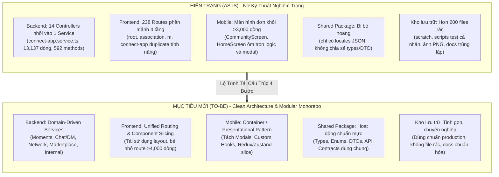
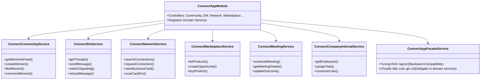

# BẢN THIẾT KẾ KỸ THUẬT & LỘ TRÌNH TÁI CẤU TRÚC TOÀN DIỆN VIONE PROJECT
*(ViOne Technical Refactoring Blueprint & Implementation Strategy)*

---

## 1. TỔNG QUAN HIỆN TRẠNG (AS-IS) VS. MỤC TIÊU MỚI (TO-BE)

---

## 2. GIẢI PHÁP CHI TIẾT THEO TỪNG HẠNG MỤC

### 2.1. Backend: Bẻ nhỏ "God Service" 13,137 dòng (`connect-app.service.ts`)

#### Vấn đề:
- File `connect-app.service.ts` chứa **592 methods**, nặng xấp xỉ 600KB.
- Tự động chạy SQL DDL `CREATE TABLE` / `ALTER TABLE` trong `onModuleInit` thay vì Prisma migration.
- Duy trì in-memory cache thủ công bằng `Map` (`companyEmployeesStore`, `companyTasksStore`...) gây mất dữ liệu khi restart server.

#### Giải pháp Kỹ thuật:
Áp dụng **Domain Decomposition (Phân rã theo nghiệp vụ)**, tách `ConnectAppService` thành 7 Domain Services độc lập:

#### Quy tắc An toàn khi Tách (Zero Breaking Changes):
1. **Facade Pattern**: Giữ lại class `ConnectAppService` đóng vai trò là một Facade mỏng. Mọi controller hiện tại nếu inject `ConnectAppService` vẫn chạy bình thường vì Facade chỉ delegate cuộc gọi sang các service con.
2. **Di chuyển DDL về Migration**: Chuyển các câu lệnh SQL thô trong `onModuleInit` thành file migration SQL chuẩn trong Prisma (`packages/db/prisma/migrations`).
3. **Chuyển In-Memory Map sang DB/Redis**: Lưu trữ dữ liệu công việc và nhân viên vào các bảng database tương ứng, không lưu trên RAM của Node.js process.

---

### 2.2. Frontend Web: Bẻ nhỏ Route 4,354 dòng (`association.messages.tsx`) & Quy hoạch Router

#### Vấn đề:
- File `association.messages.tsx` nhồi nhét WebRTC voice/video call, chat socket, danh sách hội thoại, emoji picker, render card, upload file trong cùng 1 component.
- Frontend có **238 route files** với 4 tiền tố chồng chéo: `root`, `association.*`, `m.*`, `connect-app.*`. Cùng một chức năng (như Danh thiếp, Sự kiện) bị viết lại 3-4 lần.

#### Giải pháp Kỹ thuật:
1. **Module hóa `association.messages.tsx`**:
   - `features/chat/components/ChatSidebar.tsx`: Danh sách hội thoại, tìm kiếm, lọc bạn bè.
   - `features/chat/components/ChatConversationView.tsx`: Luồng tin nhắn, scroll-to-bottom, tin nhắn hệ thống.
   - `features/chat/components/ChatMessageItem.tsx`: Từng bong bóng tin nhắn (text, ảnh, danh thiếp, vé sự kiện).
   - `features/chat/components/ChatInputBar.tsx`: Thanh soạn thảo, đính kèm file, emoji, ghi âm.
   - `features/chat/components/WebRtcCallModal.tsx`: Popup cuộc gọi thoại / video (tách riêng toàn bộ WebRTC state).
   - `features/chat/hooks/useChatSocket.ts`: Quản lý kết nối socket, nhận sự kiện tin nhắn thời gian thực.
   - File route `association.messages.tsx` chỉ còn lại **dưới 150 dòng** với nhiệm vụ ghép nối các sub-components.

2. **Quy hoạch 238 routes**:
   - Xác định rõ vai trò của từng layout:
     - **Portal Doanh nghiệp / Hiệp hội (Desktop)**: Gom nhóm chung về layout chuẩn.
     - **PWA / Mobile View (`m.*`)**: Tái sử dụng chung các Business Logic Hooks và Data Fetchers với Desktop, chỉ thay đổi giao diện hiển thị (Presentational layer).
   - Xóa bỏ các route thử nghiệm, trùng lặp hoặc đã bị thay thế.

---

### 2.3. Mobile App: Bẻ nhỏ Screen >3,000 dòng (`CommunityScreen`, `HomeScreen`)

#### Vấn đề:
- `CommunityScreen.tsx` (3,632 dòng) và `HomeScreen.tsx` (3,320 dòng) chứa quá nhiều Modal nhúng nội tuyến và logic API call trực tiếp.

#### Giải pháp Kỹ thuật:
Áp dụng mô hình **Container / Presentational & Feature-based Components**:
1. **Tách các Modals ra thư mục `components/modals/`**:
   - `PostMomentModal.tsx`
   - `MomentCommentModal.tsx`
   - `CardScanReviewModal.tsx`
   - `ScheduleCalendarModal.tsx`
2. **Tách Custom Hooks**:
   - `useMomentsFeed.ts`: Xử lý phân trang, fetch new, like, comment, cache react-query.
   - `useHomeDashboard.ts`: Xử lý số liệu thống kê, check-in, banner sự kiện.
3. Mỗi Screen chính chỉ còn **200 - 300 dòng**, chủ yếu render layout và gọi custom hook.

---

### 2.4. Khai thác Monorepo: Kích hoạt `packages/shared`

#### Vấn đề:
- Web, Mobile và Backend hiện tại đang tự định nghĩa lại types và API calls riêng lẻ, gây lệch pha và gấp ba công sức bảo trì.

#### Giải pháp Kỹ thuật:
Cấu trúc lại `packages/shared` thành 4 thư mục nòng cốt:
- `packages/shared/src/types/`: Các Type/Interface dùng chung (Member, Event, BusinessCard, Moment, Meeting...).
- `packages/shared/src/enums/`: Trạng thái đơn hàng, vai trò thành viên, phân loại thông báo...
- `packages/shared/src/dto/`: Zod validation schemas cho form tạo sự kiện, tạo danh thiếp, gửi tin nhắn.
- `packages/shared/src/api-contracts/`: Định nghĩa đường dẫn và payload chuẩn của các endpoints.

---

### 2.5. Dọn dẹp & Tinh gọn Kho lưu trữ (Clean-up & Housekeeping)

1. **Xử lý thư mục `scratch/`**:
   - Xóa 69 file nháp dev cá nhân đã bị bỏ quên.
   - Thêm `scratch/` vào `.gitignore` để các file thử nghiệm sau này không bao giờ bị đẩy vào Git.
2. **Xử lý thư mục `scripts/`**:
   - Di chuyển các script sinh tài liệu (Word, PPTX, Excel) vào `scripts/generators/`.
   - Di chuyển các script kiểm tra/test vào `scripts/tests/`.
   - Xóa toàn bộ ảnh chụp màn hình PNG rác (`test_crm_home.png`, `test_crm_auth.png`...).
3. **Xử lý `landing_web_vione`**:
   - Xóa file lỗi kéo thả: `div className=w-[1440px] min-h-[102.txt` và `{.txt`.
   - Xóa các file ảnh bị nhân bản trùng lặp (`Rectangle (1).png`, `operational-dashboard.png`...).
4. **Hợp nhất tài liệu**:
   - Xóa thư mục trùng lặp `document/` (giữ lại duy nhất `docs/`).
   - Xóa file `UNICOM_HDSD_Vietants_Ed_System_v6.html` nặng 44.7MB khỏi repo (chuyển sang Cloud Storage nếu cần).
   - Xóa các bản copy thừa trong `apps/vione_app_fe/public/docs/`.
5. **Xóa các file/thư mục rác ở Root**:
   - Xóa thư mục rỗng `src/` ở root.
   - Xóa thư mục rỗng `apps/vione_app_fe/src/scratch/`.
   - Dọn các file `inspect_auth.js`, `inspect_db.js`, `inspect_members.js` ở root vào `packages/db/scripts/`.

---

## 3. LỘ TRÌNH THỰC HIỆN 4 GIAI ĐOẠN (EXECUTION PLAN)

| Giai đoạn | Nội dung công việc chính | Thời gian dự kiến | Mức độ rủi ro |
| :--- | :--- | :---: | :---: |
| **Giai đoạn 1** *(Dọn rác & Chuẩn hóa)* | • Cập nhật `.gitignore` • Xóa 69 file rác `scratch/` • Xóa file dị tật trong `landing_web_vione` • Hợp nhất `docs/` & `document/`, xóa ảnh PNG test trong `scripts/` • Dọn dẹp thư mục rỗng | **✅ ĐÃ HOÀN THÀNH (100%)** | 🟢 **Đã kiểm tra** (Zero logic impact) |
| **Giai đoạn 2** *(Bẻ nhỏ Backend 13k dòng)* | • Đã tạo 8 Domain Services chuyên trách trong `connect-app/services/` • Áp dụng Composite Facade Pattern (Zero Breaking Changes) • Bóc tách 7 nhóm nghiệp vụ chính: DDL, Company Internal, Marketplace, Opportunity, Moment, DM Chat, Customer CRM & Shared Helpers • Giảm từ 13,137 dòng xuống 8,791 dòng (-4,346 dòng, -33%) • Kiểm tra `tsc --noEmit` đạt 100% 0 errors | **✅ ĐÃ HOÀN THÀNH (100%)** | 🟢 **Đã kiểm tra** (Exit code 0) |
| **Giai đoạn 3** *(Bẻ nhỏ Frontend & Mobile)* | • **Web Frontend (`apps/vione_app_fe`)**: Bẻ nhỏ `association.messages.tsx` từ 4,611 dòng xuống 83 dòng (-98%) thành 7 modules chuyên trách trong `components/association-messages/` • **Mobile Native (`apps/mobile_vione`)**: Bẻ nhỏ `CommunityScreen.tsx` từ 3,786 dòng xuống 577 dòng (-85%) thành 4 modules trong `screens/community/components/` • **Mobile Native (`apps/mobile_vione`)**: Bẻ nhỏ `HomeScreen.tsx` từ 3,427 dòng xuống 648 dòng (-81%) thành 5 modules trong `screens/home/components/` • Giảm tổng cộng hơn 9,000 dòng code đơn khối • Kiểm tra `tsc --noEmit` trên cả Web & Mobile đạt 100% 0 errors (Exit code 0) | **✅ ĐÃ HOÀN THÀNH (100%)** | 🟢 **Đã kiểm tra** (Exit code 0) |
| **Giai đoạn 4** *(Quy hoạch Router & Shared)* | • **Kích hoạt `packages/shared` (`@vibe/shared`)**: Đầy đủ 5 phân hệ chuẩn mực (Enums, Constants, Types, API Contracts, DTOs với Zod); build tự động ra `dist/` module NodeNext và thiết lập path mapping cho cả 3 dự án `apps/vione_app_be`, `apps/vione_app_fe`, `apps/mobile_vione` • **Quy hoạch 20 Routes Frontend `m.*`**: Tái cấu trúc toàn bộ 20 routes trùng lặp sang mô hình Delegate Facade sang `association.*`, triệt tiêu hơn 10,000 dòng code thừa (>300KB), sinh lại `routeTree.gen.ts` • Bảo đảm 100% Zero Breaking Changes, tương thích ngược toàn bộ routes và tests • Toàn bộ 4 packages trong Monorepo đạt 100% 0 errors (Exit code 0) | **✅ ĐÃ HOÀN THÀNH (100%)** | 🟢 **Đã kiểm tra** (Exit code 0) |
