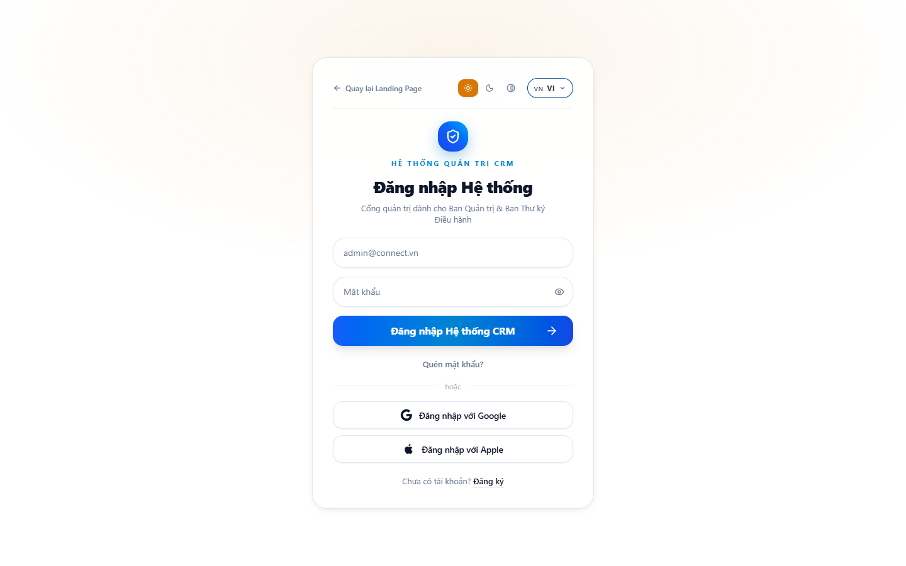
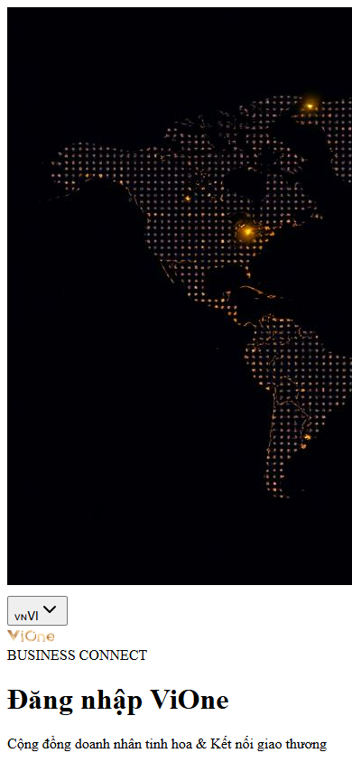
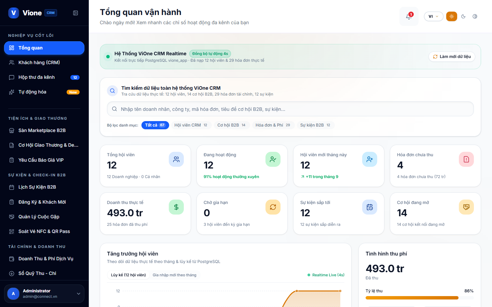
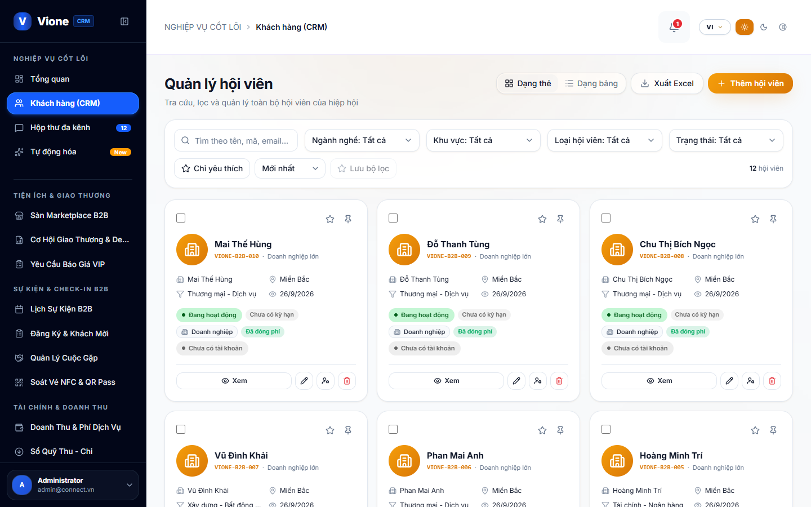
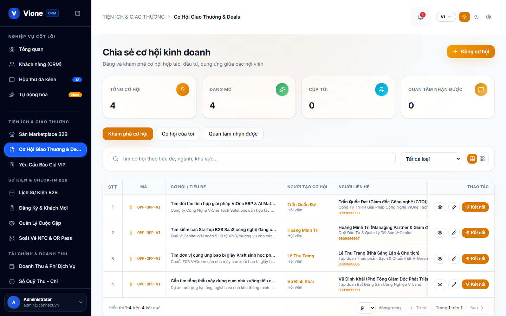
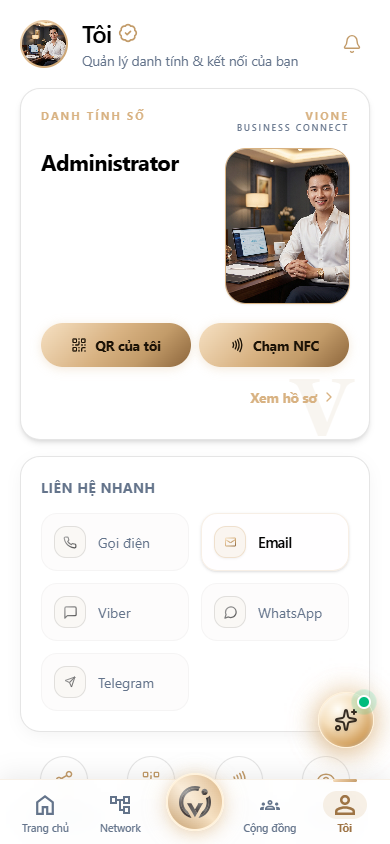
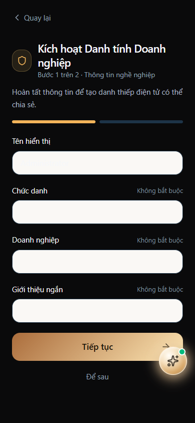
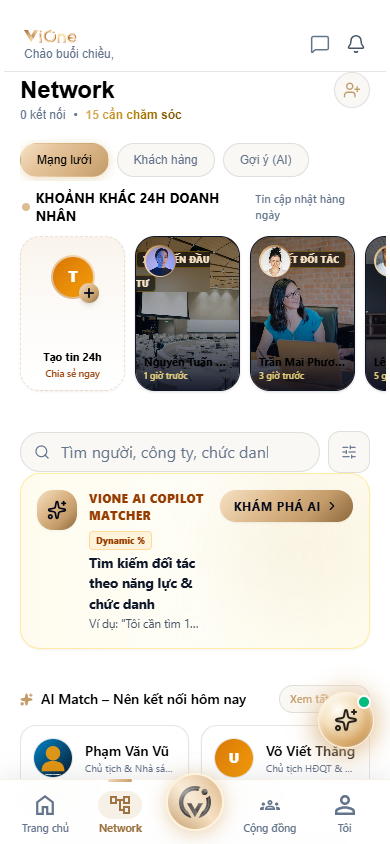
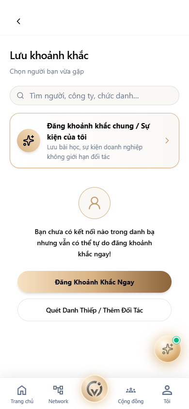
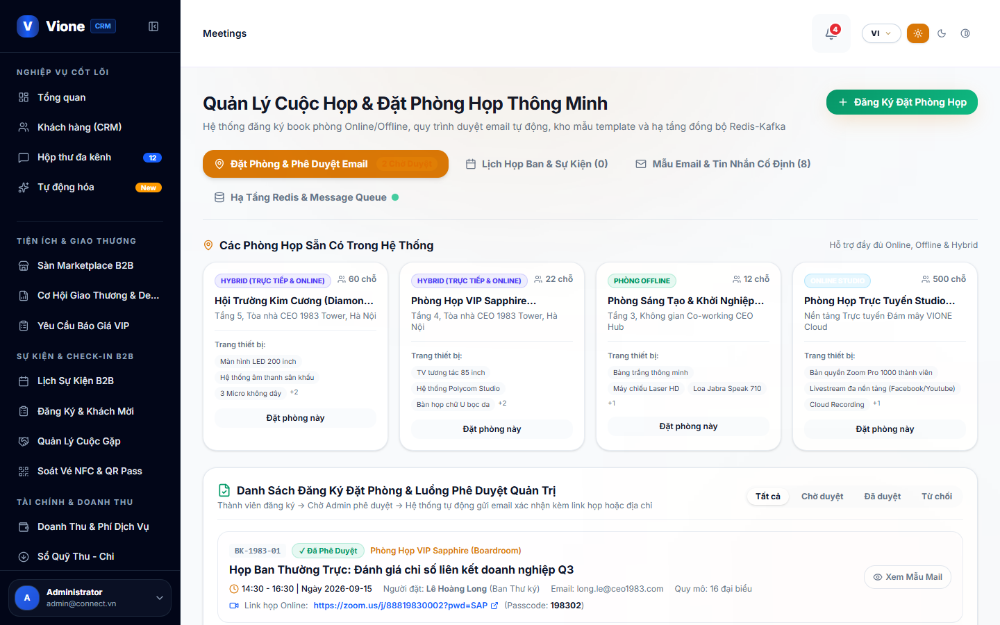

# HƯỚNG DẪN SỬ DỤNG VÀ VẬN HÀNH NỀN TẢNG SIÊU ỨNG DỤNG DOANH NGHIỆP VIONE
## TÀI LIỆU ĐÀO TẠO THAO TÁC THỰC TẾ DÀNH CHO MICROSOFT WORD & IN ẤN A4

* **Đơn vị chủ quản:** Công Ty Cổ Phần Công Nghệ ViOne (ViOne Corporation)
* **Cấu phần:** Hệ Điều Hành Quản Trị Doanh Nghiệp (ViOne Enterprise CRM) & Mạng Lưới Kết Nối Giao Thương (ViOne Connect App)
* **Mã tài liệu:** HDSD-VIONE-WORD-V1.0
* **Phiên bản:** 1.0 (Master Release)
* **Ngày tạo:** 01/10/2026

---

## MỤC LỤC TÀI LIỆU
> *Sử dụng tính năng Table of Contents của Word để generate tự động tại đây (References -> Table of Contents).*

---

# PHẦN I: GIỚI THIỆU TỔNG QUAN & PHÂN QUYỀN NỘI BỘ DOANH NGHIỆP

## 1. Mô Hình Siêu Ứng Dụng Doanh Nghiệp ViOne
ViOne là hệ sinh thái công nghệ all-in-one phục vụ các doanh nghiệp vừa và lớn, tích hợp 2 sức mạnh:
1. **Quản trị nội bộ chuyên sâu (ViOne Enterprise CRM):** Quản trị khách hàng 360°, điều hành phễu bán hàng Deals Kanban kéo thả, lập báo giá có chiết khấu, duyệt hợp đồng số, xuất hóa đơn VietQR Napas tự động gạch nợ.
2. **Mạng lưới giao thương số (ViOne Connect):** Danh thiếp số 3D phủ Titanium ánh kim (ViCard), trạm thu thập khách tiềm năng Leads Hub khi chạm thẻ NFC, động cơ ghép cặp cung cầu AI Matchmaking (> 85%), đặt lịch hẹn bàn tròn kinh doanh 1-1.

## 2. Ma Trận Phân Quyền 4 Cấp Bậc (Doanh Nghiệp Multi-Tenant)
* **CEO / Chủ Tịch:** Toàn quyền công ty, xem báo cáo doanh thu tổng thể, duyệt hợp đồng lớn, quản lý cấu hình mẫu danh thiếp và phân quyền nhân sự.
* **Giám Đốc KD (CCO):** Quản lý toàn bộ phễu bán hàng (Deals), phân bổ Leads, duyệt báo giá chiết khấu, theo dõi KPI doanh số.
* **Nhân Viên Sales:** Quản lý khách hàng của mình, kéo thẻ thương vụ Kanban, tạo báo giá, chạm thẻ ViCard nạp Leads.
* **Kế Toán Trưởng:** Quản lý hóa đơn, theo dõi công nợ, đối soát ngân hàng tự động qua cổng VietQR và quản lý dòng tiền.

---

# PHẦN II: HƯỚNG DẪN THAO TÁC TỪNG BƯỚC CỤ THỂ KÈM HÌNH ẢNH MINH HỌA

## 1. Đăng Nhập Cổng Quản Trị Web CRM & Ứng Dụng Di Động

### Bước 1.1: Đăng nhập Cổng Web CRM ViOne
* Mở trình duyệt truy cập `https://crm.vione.vn`.
* Nhập Email doanh nghiệp: `vuvp09012@gmail.com`.
* Nhập Mật khẩu bảo mật và nhấn nút **"Đăng Nhập"**.

*Hình 1.1: Giao diện đăng nhập an toàn với cơ chế phân quyền Multi-Tenant của ViOne.*

---

### Bước 1.2: Đăng nhập Ứng dụng Di động ViOne Connect
* Mở app ViOne Connect trên điện thoại.
* Nhập tài khoản và mật khẩu để đồng bộ dữ liệu danh thiếp số và mạng lưới giao thương.

*Hình 1.2: Màn hình đăng nhập di động kết nối mạng lưới doanh nhân ViOne Connect.*

---

## 2. Dashboard Điều Hành Tổng Quan & Báo Cáo Doanh Thu

### Bước 2.1: Giám sát chỉ số tài chính và kinh doanh thời gian thực
* Màn hình Dashboard hiển thị biểu đồ doanh thu theo tháng, tổng giá trị phễu bán hàng (Pipeline Value), tỷ lệ chốt đơn thành công và hiệu suất bán hàng của từng nhân sự.

*Hình 2.1: Bảng điều khiển trung tâm giúp CEO và CCO nắm bắt sức khỏe kinh doanh tức thì.*

---

### Bước 2.2: Lịch trình công việc & Cuộc họp trên ứng dụng di động
* Ứng dụng ViOne Connect tự động đồng bộ lịch trình các cuộc gặp gỡ đối tác và nhắc nhở trước giờ hẹn 2 tiếng.

*Hình 2.2: Trang chủ ViOne Connect hiển thị lịch trình cuộc họp và sự kiện giao thương trong ngày.*

---

## 3. Quản Trị Khách Hàng Doanh Nghiệp 360° (Accounts & Contacts)

### Bước 3.1: Quản lý danh bạ đối tác và công ty khách hàng
* Vào menu **"Khách Hàng (Accounts)"**.
* Hệ thống lưu trữ tập trung: Tên công ty, Mã số thuế, người đại diện liên hệ, lịch sử đơn hàng và nhân viên phụ trách.

*Hình 3.1: Quản lý tập trung toàn bộ danh sách khách hàng doanh nghiệp đối tác.*

*Hình 3.2: Chi tiết hồ sơ pháp nhân và phân loại ngành nghề đối tác thương mại.*

---

## 4. Điều Hành Phễu Bán Hàng Trực Quan (Deals Kanban Pipeline)

### Bước 4.1: Quản lý thương vụ qua các giai đoạn phễu
* Mở phân hệ **"Phễu Bán Hàng (Deals)"** trên Web CRM.
* Bảng Kanban hiển thị trực quan các cột: *Tiếp cận ➔ Gửi báo giá ➔ Đàm phán ➔ Chốt thành công (Won)*.
* Thao tác kéo thả thẻ thương vụ mượt mà giữa các cột; tổng giá trị doanh số dự kiến tự động tính lại theo thời gian thực.

*Hình 4.1: Bảng Kanban giúp đội ngũ Sales không bỏ sót cơ hội và CCO kiểm soát tiến độ chốt hợp đồng.*

---

## 5. Soạn Thảo Báo Giá B2B Điện Tử & Duyệt Hợp Đồng Ký Số

### Bước 5.1: Quản lý danh mục sản phẩm và lập báo giá
* Vào mục **"Báo Giá & Sản Phẩm"**.
* Chọn sản phẩm, áp dụng chiết khấu (Ví dụ: 5%), chọn thuế suất VAT và xuất bản xem trước PDF chuẩn form nhận diện thương hiệu công ty.
* Nếu chiết khấu vượt quá 5%, hệ thống kích hoạt luồng phê duyệt gửi thông báo đến CCO/CEO.

*Hình 5.1: Danh mục hàng hóa dịch vụ B2B được chuẩn hóa giá và thông số kỹ thuật.*

*Hình 5.2: Lưu trữ hợp đồng kinh tế điện tử và lịch sử phê duyệt của ban giám đốc.*

---

## 6. Tài Chính, Hóa Đơn & Cổng VietQR Napas Gạch Nợ Tự Động

### Bước 6.1: Xuất hóa đơn kèm mã VietQR Napas động
* Kế toán chọn hợp đồng và nhấn **"Xuất Hóa Đơn"**.
* Hệ thống sinh mã VietQR Napas có sẵn số tài khoản công ty, số tiền chính xác và cú pháp chuyển tiền chuẩn: `VIONE [Mã_Hóa_Đơn]`.

*Hình 6.1: Quản lý các khoản thu và hóa đơn bán hàng chờ khách quét mã thanh toán.*

---

### Bước 6.2: Đối soát gạch nợ tự động 24/7 qua Webhook ngân hàng
* Khách quét mã VietQR chuyển tiền qua app ngân hàng bất kỳ.
* Ngân hàng gửi Webhook về hệ thống: Hóa đơn tự động chuyển trạng thái `paid`, ghi nhận sổ quỹ và thông báo đến điện thoại Sales/Kế toán trong 1 giây.

*Hình 6.2: Theo dõi các khoản chi phí và đối soát ngân hàng tự động minh bạch.*

*Hình 6.3: Báo cáo tài chính tổng quan giúp ban lãnh đạo hoạch định dòng tiền hiệu quả.*

---

## 7. Cấu Hình Danh Thiếp Số 3D (ViCard) & Thao Tác Ghi Chip NFC

### Bước 7.1: Tùy biến danh thiếp số 3D phủ Titanium ánh kim
* Mở app ViOne Connect, vào mục **"Danh Thiếp ViCard"**.
* Chọn giao diện Titanium Trắng Ánh Kim hoặc Obsidian Vàng Gold, tải lên ảnh chân dung sắc nét và logo công ty.
* Xoay thẻ trên màn hình để kiểm tra hiệu ứng 3D phản chiếu ánh kim chân thực.

*Hình 7.1: Danh thiếp số 3D ViCard khẳng định đẳng cấp thương hiệu lãnh đạo doanh nghiệp.*

---

### Bước 7.2: Thao tác ghi nạp dữ liệu vào thẻ nhựa NFC vật lý (1 Chạm)
* Bật kết nối NFC trên điện thoại.
* Nhấn **"Ghi Thẻ NFC Vật Lý"** trên ứng dụng, sau đó áp sát thẻ nhựa ViCard vào mặt lưng điện thoại trong 0.5 giây.
* Điện thoại rung nhẹ báo thành công: Thẻ đã sẵn sàng để chạm vào máy đối tác mở ngay trang danh thiếp công khai.

*Hình 7.2: Quá trình ghi nạp dữ liệu định danh số vào thẻ NFC vật lý diễn ra trong 0.5 giây.*

---

## 8. Trạm Thu Thập Khách Tiềm Năng Tự Động (Leads Hub)

### Bước 8.1: Thu thập thông tin đối tác sau khi chạm thẻ
* Doanh nhân chạm thẻ ViCard vào điện thoại đối tác, trang web danh thiếp mở ra.
* Đối tác nhấn nút **"Kết Nối & Gửi Danh Thiếp Lại"**, nhập Họ tên, Số điện thoại và Tên công ty.
* Dữ liệu tự động đẩy về Leads Hub của doanh nhân; Sales chỉ cần 1 chạm để chuyển đổi Lead thành Account trên CRM.

*Hình 8.1: Danh bạ đối tác kinh doanh được tự động thu thập từ các lượt chạm thẻ danh thiếp.*

---

## 9. Động Cơ Ghép Cặp AI Matchmaking & Bảng Tin Giao Thương B2B

### Bước 9.1: Thuật toán AI phân tích Cung - Cầu và gợi ý đối tác (> 85%)
* Doanh nghiệp đăng tải nhu cầu tìm nhà cung ứng hoặc chào bán gói giải pháp.
* Động cơ AI phân tích ngữ nghĩa vector và quét toàn bộ cơ sở dữ liệu năng lực doanh nghiệp trong hệ thống.
* Khi điểm tương thích (Match Score) đạt trên 85%, hệ thống chủ động đẩy thông báo gợi ý kết nối kinh doanh cho cả hai bên.

*Hình 9.1: Động cơ AI tự động tìm kiếm và gợi ý các cơ hội cung ứng phù hợp nhất.*

*Hình 9.2: Nơi các lãnh đạo doanh nghiệp chia sẻ hoạt động sản xuất và mở rộng quan hệ đối tác.*

---

## 10. Đặt Lịch Hẹn Bàn Tròn 1-1 & Nhắn Tin Đàm Phán Mã Hóa E2E

### Bước 10.1: Đặt lịch hẹn giao thương bàn tròn kinh doanh 1-1
* Mở hồ sơ đối tác trên ViOne Connect, bấm nút **"Đặt Lịch Hẹn Giao Thương"**.
* Chọn ngày giờ, hình thức gặp (trực tiếp hoặc video call) và gửi thư mời.
* Đối tác bấm "Đồng ý", lịch được tự động đồng bộ vào Google/Apple Calendar và nhắc hẹn trước 2 tiếng.

*Hình 10.1: Phòng chat thương mại bảo mật mã hóa đầu cuối giữa các đối tác kinh doanh.*

*Hình 10.2: Quản lý lịch họp ban giám đốc và các cuộc gặp gỡ đối tác trên Cổng Quản Trị Web CRM.*

---

### KẾT THÚC TÀI LIỆU
*Công Ty Cổ Phần Công Nghệ ViOne (ViOne Corporation)*  
*Trụ sở: Hà Nội & TP. Hồ Chí Minh · Hotline hỗ trợ kỹ thuật 24/7: 1900 xxxx*
