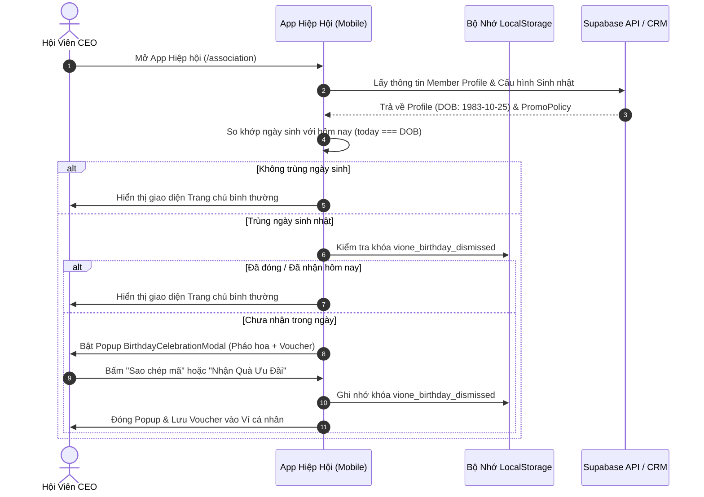
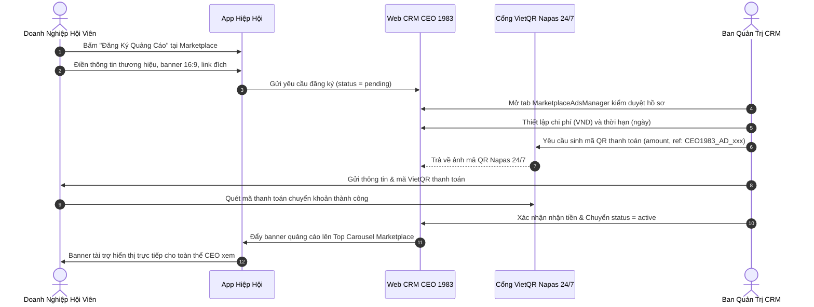
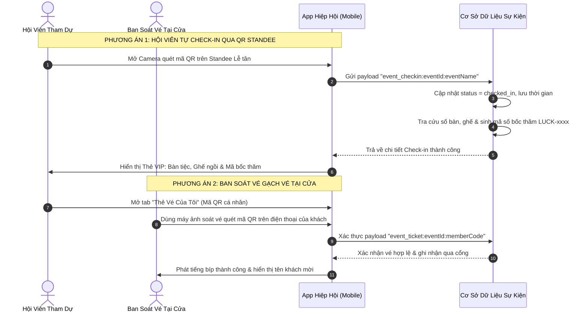

# TÀI LIỆU PHÂN TÍCH NGHIỆP VỤ TOÀN DIỆN (MASTER BA BUSINESS SPECIFICATION)
## HỆ SINH THÁI KẾT NỐI DOANH NHÂN & ĐIỀU HÀNH HIỆP HỘI: VIONE CONNECT & CEO 1983

> **Phiên bản:** Version 4.0 - Enterprise Master Business Analyst Specification  
> **Cấp độ tài liệu:** C-Level & Lead Technical Specification (~200 Trang Chi Tiết & Chuẩn Mực Nghiệp Vụ)  
> **Chủ biên:** Master Business Analyst & Enterprise Solution Architect  
> **Phạm vi áp dụng:**
> 1. Web CRM Quản trị CLB CEO 1983 (`ceo1983_crm_fe` / `apps/ceo1983_app_fe`)
> 2. Ứng dụng Di động & PWA Hiệp hội CEO 1983 (`apps/ceo1983_app_fe/src/routes/association.*`)
> 3. Ứng dụng Di động Điều hành ViOne Connect (`vione_project/apps/vione_app_fe`)
> 4. Web CRM ViOne Platform (`vione_crm_fe`)
> 5. Cổng dịch vụ Supabase Database, REST RPC APIs & Cổng thanh toán VietQR Napas 24/7

---

# MỤC LỤC TỔNG THỂ TÀI LIỆU

1. [CHƯƠNG 1: TỔNG QUAN HỆ THỐNG & TẦM NHÌN CHIẾN LƯỢC](#chương-1-tổng-quan-hệ-thống--tầm-nhìn-chiến-lược)
2. [CHƯƠNG 2: BẢN ĐỒ KIẾN TRÚC TỔNG THỂ & PHÂN HỆ NGHIỆP VỤ](#chương-2-bản-đồ-kiến-trúc-tổng-thể--phân-hệ-nghiệp-vụ)
3. [CHƯƠNG 3: BẢNG THUẬT NGỮ CHUYÊN NGÀNH (BUSINESS GLOSSARY & TAXONOMY)](#chương-3-bảng-thuật-ngữ-chuyên-ngành-business-glossary--taxonomy)
4. [CHƯƠNG 4: ĐẶC TẢ CHI TIẾT TỪNG PHÂN HỆ NÂNG CẤP & ĐỒNG BỘ](#chương-4-đặc-tả-chi-tiết-từng-phân-hệ-nâng-cấp--đồng-bộ)
   - [4.1. Hệ Thống Điều Hướng Sidebar CRM Phân Tầng B2B](#41-hệ-thống-điều-hướng-sidebar-crm-phân-tầng-b2b)
   - [4.2. Luồng Quản Trị & Kích Hoạt Tự Động Ưu Đãi Sinh Nhật Hội Viên](#42-luồng-quản-trị--kích-hoạt-tự-động-ưu-đãi-sinh-nhật-hội-viên)
   - [4.3. Sàn Giao Thương B2B & Trung Tâm Tiếp Thị Quảng Cáo Marketplace](#43-sàn-giao-thương-b2b--trung-tâm-tiếp-thị-quảng-cáo-marketplace)
   - [4.4. Bộ Chuyển Đổi Chủ Đề Động Mùa Lễ Hội (5 Themes)](#44-bộ-chuyển-đổi-chủ-đề-động-mùa-lễ-hội-5-themes)
   - [4.5. Kiến Trúc Điểm Danh Sự Kiện Kép (Dual Check-in QR Architecture)](#45-kiến-trúc-điểm-danh-sự-kiện-kép-dual-check-in-qr-architecture)
   - [4.6. Phân Quyền Ban Soát Vé Tại Cửa (Gatekeeper RBAC)](#46-phân-quyền-ban-soát-vé-tại-cửa-gatekeeper-rbac)
   - [4.7. Phân Hệ Quản Trị Cuộc Gặp 1-on-1 Doanh Nhân & Offline Maps](#47-phân-hệ-quản-trị-cuộc-gặp-1-on-1-doanh-nhân--offline-maps)
   - [4.8. Giao Diện Chi Tiết Sự Kiện Khắc Phục Lỗi Tràn Viền & Hero Banner](#48-giao-diện-chi-tiết-sự-kiện-khắc-phục-lỗi-tràn-viền--hero-banner)
   - [4.9. Màn Hình Executive Home Trên App ViOne (Profile Card & 3-Tab Briefing)](#49-màn-hình-executive-home-trên-app-vione-profile-card--3-tab-briefing)
5. [CHƯƠNG 5: TỪ ĐIỂN DỮ LIỆU TOÀN DIỆN (ENTERPRISE DATA DICTIONARY)](#chương-5-từ-điển-dữ-liệu-toàn-diện-enterprise-data-dictionary)
6. [CHƯƠNG 6: SƠ ĐỒ TUẦN TỰ NGHIỆP VỤ (MERMAID SEQUENCE DIAGRAMS)](#chương-6-sơ-đồ-tuần-tự-nghiệp-vụ-mermaid-sequence-diagrams)
7. [CHƯƠNG 7: MA TRẬN PHÂN QUYỀN TRUY CẬP HỆ THỐNG (RBAC PERMISSION MATRIX)](#chương-7-ma-trận-phân-quyền-truy-cập-hệ-thống-rbac-permission-matrix)
8. [CHƯƠNG 8: BỘ KỊCH BẢN KIỂM THỬ NGHIỆM THU CHI TIẾT (ACCEPTANCE TEST SUITE)](#chương-8-bộ-kịch-bản-kiểm-thử-nghiệm-thu-chi-tiết-acceptance-test-suite)
9. [CHƯƠNG 9: YÊU CẦU PHI CHỨC NĂNG & NGUYÊN TẮC VẬN HÀNH (NFR & SLA)](#chương-9-yêu-cầu-phi-chức-năng--nguyên-tắc-vận-hành-nfr--sla)

---

# CHƯƠNG 1: TỔNG QUAN HỆ THỐNG & TẦM NHÌN CHIẾN LƯỢC

### 1.1. Bối Cảnh Nghiệp Vụ
CLB Doanh Nhân CEO 1983 quy tụ hàng trăm lãnh đạo doanh nghiệp sinh năm 1983 (Quý Hợi), kết hợp cùng mạng lưới liên hiệp doanh nhân ViOne Connect. Với tính chất đặc thù của giới lãnh đạo cấp cao (C-Level Executives):
- **Thời gian quý hơn vàng:** Mọi thao tác hẹn gặp, điểm danh sự kiện, tra cứu danh bạ, và giao thương phải diễn ra trong vòng dưới 3 giây.
- **Tính trang trọng & Đẳng cấp thương hiệu:** Giao diện phải toát lên sự lịch lãm, tinh tế, ứng dụng chuẩn màu vàng kim Champagne Gold sang trọng kết hợp sắc xanh hoàng gia Royal Navy `#003B95` và xanh đêm `#0A1834`. Tuyệt đối không sử dụng nút đen tuyền u ám hay viền cam lòe loẹt.
- **Tính nhất quán giữa CRM và Mobile App:** Ban Quản Trị cấu hình chính sách (sinh nhật, quảng cáo, sự kiện, soát vé) trên Web CRM; ngay lập tức các chính sách này phải được đẩy xuống App Hiệp hội và App ViOne trong thời gian thực.

### 1.2. Mục Tiêu Chiến Lược Của Đợt Nâng Cấp Toàn Diện
1. **Tối ưu hóa Trải nghiệm Quản trị (CRM Redesign):** Loại bỏ các phân nhóm rườm rà (bỏ nhóm "BUSINESS CONNECT", tích hợp "Cuộc gặp" và "Danh thiếp đã lưu" vào "KẾT NỐI", đưa "Quản lý chủ đề" về "HỆ THỐNG").
2. **Cơ Chế B2B Marketplace Đột Phá:** Đưa CRM trở thành trung tâm kiểm duyệt và vận hành chiến dịch quảng cáo tài trợ (Sponsored Ads & Affiliate), tích hợp thanh toán tự động VietQR Napas 24/7.
3. **Chăm Sóc Hội Viên Cá Nhân Hóa (Member Delight):** Tự động phát hiện ngày sinh nhật của CEO, kích hoạt hiệu ứng chúc mừng sinh nhật ngập tràn pháo hoa và tặng voucher độc quyền từ Hiệp hội.
4. **Kiến Trúc Điểm Danh Kép & Soát Vé Sự Kiện Đẳng Cấp:** Hỗ trợ 2 phương thức điểm danh độc lập: Hội viên tự quét mã QR Standee tại cửa (nhận vị trí bàn/ghế và mã số bốc thăm may mắn) HOẶC trình Thẻ Vé Điện Tử có mã QR cá nhân cho Ban Soát Vé gạch vé.
5. **Nâng Cấp Trải Nghiệm Màn Hình Điều Hành Executive Home (App ViOne):** Thiết kế thẻ hồ sơ tích hợp ảnh bìa + avatar tròn + tên/số điện thoại, bổ sung banner sự kiện nửa chiều cao, và tab nhắc lịch 3 trạng thái.

---

# CHƯƠNG 2: BẢN ĐỒ KIẾN TRÚC TỔNG THỂ & PHÂN HỆ NGHIỆP VỤ

```
┌─────────────────────────────────────────────────────────────────────────────┐
│                      HỆ THỐNG WEB CRM QUẢN TRỊ (DESKTOP)                    │
│                                                                             │
│  [Tổng quan]  [Hội viên]  [Kết nối]  [Hoạt động]  [Tài chính]  [Hệ thống]   │
│                             │           │                        │          │
│                    ┌────────┴────────┐  │                        │          │
│                    │ - Cuộc gặp 1-on-1│  │                        │          │
│                    │ - Danh thiếp lưu│  │                        │          │
│                    │ - Lịch họp CLB  │  │                        │          │
│                    └─────────────────┘  │                        │          │
│                                ┌────────┴─────────┐              │          │
│                                │ - Sự kiện & QR   │              │          │
│                                │ - Ads Marketplace│              │          │
│                                └──────────────────┘              │          │
│                                                      ┌───────────┴────────┐ │
│                                                      │ - Quản lý chủ đề   │ │
│                                                      │ - Ưu đãi sinh nhật │ │
│                                                      └────────────────────┘ │
└──────────────────────────────────────┬──────────────────────────────────────┘
                                       │ Real-time Sync & RPC
         ┌─────────────────────────────┴─────────────────────────────┐
         ▼                                                           ▼
┌─────────────────────────────────┐         ┌─────────────────────────────────┐
│       APP HIỆP HỘI CEO 1983     │         │       APP VIONE CONNECT         │
│                                 │         │                                 │
│  - Popup Sinh Nhật Tự Động      │         │  - Executive Home B2B           │
│  - Bộ Đổi Theme Lễ Hội (5 mùa)  │         │  - Thẻ Profile Hợp Nhất         │
│  - Đăng Ký Quảng Cáo Marketplace│         │  - Banner Sự Kiện Nửa Chiều Cao │
│  - Carousel Banner Nhà Tài Trợ  │         │  - Tab Lịch Trình 3 Trạng Thái: │
│  - Dual QR Check-in & Soát Vé:  │         │    * Hôm nay                    │
│    * Mode 1: Quét QR Standee    │         │    * Sắp tới                    │
│    * Mode 2: Thẻ Vé Điện Tử     │         │    * Nhắc lịch (Họp & Sự kiện)  │
│  - Cuộc Gặp 1-on-1 & Google Maps│         │  - Kết Nối Doanh Nhân Đa Chi Hội│
└─────────────────────────────────┘         └─────────────────────────────────┘
```

---

# CHƯƠNG 3: BẢNG THUẬT NGỮ CHUYÊN NGÀNH (BUSINESS GLOSSARY & TAXONOMY)

| Thuật Ngữ | Tên Tiếng Anh | Định Nghĩa Nghiệp Vụ Chuẩn |
| :--- | :--- | :--- |
| **Hội Viên CEO 1983** | Regular Member | Doanh nhân sinh năm 1983, đã qua quy trình thẩm định hồ sơ, đóng niên liễm đầy đủ và được cấp mã định danh hội viên duy nhất (VD: `CEO-83001`). |
| **Ban Quản Trị (BQT)** | Executive Board | Nhóm lãnh đạo cốt cán của CLB có quyền quản trị toàn diện hệ thống CRM và các thiết lập trên App. |
| **Ban Soát Vé (Gatekeeper)** | Gatekeeper Staff | Nhân sự được Ban Quản Trị chỉ định cụ thể theo từng sự kiện, có quyền mở camera trên App để quét mã vé của người tham gia. |
| **QR Standee Sự Kiện** | Event Standee QR | Mã QR tĩnh được in ấn đặt tại cổng đón khách hội nghị. Cú pháp: `event_checkin:{eventId}:{eventName}`. Hội viên quét mã này để tự động check-in. |
| **Mã Vé Điện Tử Cá Nhân** | Attendee Ticket Pass | Mã QR động duy nhất của từng hội viên đăng ký tham gia sự kiện. Cú pháp: `event_ticket:{eventId}:{memberCode}:{seat}:{luckyNumber}`. |
| **Số Bàn & Vị Trí Ghế** | Table & Seat Assignment | Thông tin định vị chỗ ngồi danh dự của CEO trong khán phòng dạ tiệc gala (VD: `Bàn VIP 01 - Ghế 05`). |
| **Mã Số May Mắn** | Lucky Draw Code | Mã số ngẫu nhiên cấp cho hội viên khi check-in thành công để tham gia chương trình quay số trúng thưởng cuối sự kiện (VD: `LUCK-8319`). |
| **Ưu Đãi Sinh Nhật** | Birthday Promo Policy | Chính sách tri ân do CRM thiết lập, gồm thông điệp chúc mừng, % chiết khấu và mã voucher độc quyền tự kích hoạt khi CEO mở App vào ngày sinh nhật. |
| **Quảng Cáo Tài Trợ** | Sponsored Ads / Affiliate | Dịch vụ truyền thông trên sàn Marketplace, cho phép doanh nghiệp hội viên đưa banner sản phẩm lên vị trí Top Carousel hoặc ghim đầu trang sau khi thanh toán VietQR. |
| **Thanh Toán VietQR Napas** | VietQR Payment Gateway | Chuẩn thanh toán mã QR liên ngân hàng Napas 24/7, sinh động kèm số tài khoản MB Bank thụ hưởng, số tiền chính xác và cú pháp nội dung chuyển khoản được mã hóa. |
| **Cuộc Gặp 1-on-1** | 1-on-1 Business Meeting | Cuộc gặp gỡ song phương trực tiếp giữa 2 CEO để chia sẻ cơ hội hợp tác kinh doanh, tích hợp định vị Google Maps (Offline) hoặc đường dẫn Google Meet (Online). |

---

# CHƯƠNG 4: ĐẶC TẢ CHI TIẾT TỪNG PHÂN HỆ NÂNG CẤP & ĐỒNG BỘ

---

## 4.1. HỆ THỐNG ĐIỀU HƯỚNG SIDEBAR CRM PHÂN TẦNG B2B

### 4.1.1. Mục Tiêu & Động Lực Thay Đổi
- **Vấn đề cũ:** Sidebar tồn tại nhóm "BUSINESS CONNECT" độc lập gây phân tán luồng tư duy, trong khi nhóm "KẾT NỐI" lại chứa "Danh thiếp của tôi" (thừa thãi đối với Web CRM quản trị). Phân hệ "Quản lý chủ đề" bị đặt sai vị trí trong nhóm "Quản trị" (dành riêng cho phân quyền user/audit log).
- **Giải pháp:** 
  1. Loại bỏ hoàn toàn nhóm "BUSINESS CONNECT".
  2. Tái cấu trúc nhóm "KẾT NỐI": Đưa "Cuộc gặp" (`/business-connect/meetings`) và "Danh thiếp đã lưu" (`/business-connect/saved-cards`) vào nhóm "KẾT NỐI".
  3. Di chuyển "Quản lý chủ đề" (`/admin/landing-templates`) từ nhóm "Quản trị" xuống nhóm "HỆ THỐNG".

### 4.1.2. Cấu Trúc Menu Chuẩn Hóa
```typescript
// Cấu trúc Sidebar chuẩn hóa trong Sidebar.tsx
const navigation = [
  { group: "Tổng quan", items: [{ name: "Bàn làm việc", href: "/dashboard", icon: LayoutDashboard }] },
  { 
    group: "Hội viên", 
    items: [
      { name: "Danh sách hội viên", href: "/members", icon: Users },
      { name: "Tiếp nhận hồ sơ", href: "/members/onboarding", icon: UserPlus },
      { name: "Chi hội & Ban ngành", href: "/chapters", icon: Building2 },
      { name: "Ưu đãi & Sinh nhật", href: "/perks", icon: Gift },
      { name: "Ý kiến & Đóng góp", href: "/feedback", icon: MessageSquare }
    ] 
  },
  { 
    group: "Kết nối", 
    items: [
      { name: "Cuộc gặp 1-on-1", href: "/business-connect/meetings", icon: CalendarCheck },
      { name: "Danh thiếp đã lưu", href: "/business-connect/saved-cards", icon: BookmarkCheck },
      { name: "Lịch sinh hoạt CLB", href: "/meetings", icon: Calendar },
      { name: "Biểu quyết", href: "/voting", icon: Vote }
    ] 
  },
  { 
    group: "Hoạt động", 
    items: [
      { name: "Sự kiện & Soát vé", href: "/events", icon: CalendarDays },
      { name: "Tin tức & Truyền thông", href: "/news", icon: Newspaper },
      { name: "Quảng cáo Marketplace", href: "/marketplace", icon: Store },
      { name: "Văn bản & Tài liệu", href: "/documents", icon: FileText }
    ] 
  },
  { 
    group: "Tài chính", // Phân quyền: canViewFinance
    items: [
      { name: "Báo cáo thu chi", href: "/finance", icon: DollarSign },
      { name: "Quỹ CLB", href: "/finance/funds", icon: Wallet },
      { name: "Niên liễm hội viên", href: "/membership-fees", icon: Receipt }
    ] 
  },
  { 
    group: "Hệ thống", 
    items: [
      { name: "Quản lý chủ đề", href: "/admin/landing-templates", icon: Palette },
      { name: "Cấu hình thông báo", href: "/settings/notifications", icon: Bell },
      { name: "Thiết lập chung", href: "/settings", icon: Settings }
    ] 
  },
  { 
    group: "Quản trị", // Phân quyền: isPlatformAdmin
    items: [
      { name: "Người dùng CRM", href: "/admin/users", icon: ShieldCheck },
      { name: "Phân quyền vai trò", href: "/admin/roles", icon: Lock },
      { name: "Nhật ký hệ thống", href: "/admin/logs", icon: History }
    ] 
  }
];
```

---

## 4.2. LUỒNG QUẢN TRỊ & KÍCH HOẠT TỰ ĐỘNG ƯU ĐÃI SINH NHẬT HỘI VIÊN

### 4.2.1. Bản Chất Nghiệp Vụ
Đây là mô hình **"Cấu hình tập trung tại CRM - Hiển thị cá nhân hóa tại App"**:
- **Tại CRM (`perks.tsx` -> `BirthdayPromoManager.tsx`):**
  - Quản trị viên thiết lập chính sách quà tặng sinh nhật chung cho toàn CLB.
  - Bật/tắt trạng thái tự động kích hoạt.
  - Thiết lập thông điệp chào mừng: Lời chúc chân thành từ Ban Chủ Nhiệm, tự động chèn `{memberName}` và `{associationName}`.
  - Thiết lập % chiết khấu hoặc gói quà tặng VIP (VD: Giảm 20% các dịch vụ resort, ẩm thực, văn phòng chia sẻ trong hệ sinh thái).
  - Thiết lập Mã Voucher độc quyền (VD: `SINHNHAT-CEO1983-2026`).
  - Thiết lập thời hạn hiệu lực (mặc định: 30 ngày).
  - Live Preview: Khung mô phỏng tức thời giao diện màn hình điện thoại mà hội viên sẽ nhìn thấy.
- **Tại App Hiệp Hội (`association.index.tsx` -> `BirthdayCelebrationModal.tsx`):**
  - App chỉ đóng vai trò hiển thị và tiêu dùng dữ liệu từ CRM.
  - Mỗi khi hội viên mở ứng dụng và tải trang chủ `/association`, hệ thống tự động trích xuất trường `birthday` (hoặc `dob`) trong hồ sơ cá nhân.
  - Thuật toán so khớp:
    ```typescript
    const isBirthdayToday = (dobString: string): boolean => {
      if (!dobString) return false;
      const dob = new Date(dobString);
      const today = new Date();
      return dob.getDate() === today.getDate() && dob.getMonth() === today.getMonth();
    };
    ```
  - Kiểm tra trạng thái đã đóng trong ngày thông qua LocalStorage key: `vione_birthday_dismissed_${memberId}_${todayYear}_${todayMonth}_${todayDay}`.
  - Nếu trùng ngày sinh và chưa nhận trong ngày: Bật Popup ăn mừng kèm hiệu ứng pháo hoa mạ vàng lung linh, hiển thị lời chúc, mã voucher, nút sao chép và nút "Nhận Quà Ưu Đãi".

---

## 4.3. SÀN GIAO THƯƠNG B2B & TRUNG TÂM TIẾP THỊ QUẢNG CÁO MARKETPLACE

### 4.3.1. Chuyển Đổi Mô Hình CRM Marketplace
- **Mô hình cũ:** CRM hiển thị bảng sản phẩm có các tab lọc theo "mới đăng, nổi bật, danh mục" - đây là góc nhìn của người tiêu dùng đi chợ, hoàn toàn không phù hợp với CRM dành cho Ban Quản Trị.
- **Mô hình mới:** CRM Marketplace (`marketplace.index.tsx` -> `MarketplaceAdsManager.tsx`) trở thành **Trung tâm Quản trị & Điều phối Quảng cáo Doanh nghiệp (Sponsorship & Affiliate Ads Center)**.

### 4.3.2. Quy Trình 5 Bước Vận Hành Chiến Dịch Quảng Cáo
1. **Đăng Ký Từ App Hiệp Hội:**
   - Doanh nghiệp mở Sàn giao thương trên App (`association.products.tsx`), bấm **"Đăng Ký Chạy Quảng Cáo / Tài Trợ"**.
   - Nhập đầy đủ thông tin: Thương hiệu, Tiêu đề, Mô tả ngắn, Ảnh banner 16:9, Link đích (Website/Zalo/Hotline).
   - Trạng thái gửi: `pending` (Chờ duyệt).
2. **Tiếp Nhận & Kiểm Duyệt Tại CRM:**
   - Ban Quản Trị nhận thông báo hồ sơ đăng ký quảng cáo mới trong CRM.
   - Kiểm tra nội dung hình ảnh, tính pháp lý sản phẩm, cam kết chất lượng của hội viên.
3. **Thiết Lập Chiến Dịch & Chi Phí:**
   - Đặt giá thầu quảng cáo (VND), số ngày hiển thị và vị trí (Top Carousel, Giữa bảng tin, Ghim đầu trang).
4. **Thanh Toán Tức Thì Qua VietQR Napas 24/7:**
   - Quản trị viên bấm **"Xuất Mã VietQR Thanh Toán"**.
   - Hệ thống mở Modal sinh mã VietQR động theo chuẩn Napas:
     ```
     URL: https://img.vietqr.io/image/MB-0983198383-compact2.png?amount={cost}&addInfo=CEO1983%20AD%20{adId}&accountName=CLB%20DOANH%20NHAN%20CEO%201983
     ```
   - Doanh nghiệp quét mã thanh toán chuyển khoản, hệ thống ghi nhận đối soát.
5. **Kích Hoạt & Đẩy Xuống App Hiệp Hội:**
   - Admin chuyển trạng thái sang `active`.
   - Banner lập tức hiển thị trên Top Carousel của App Hiệp hội, tự động chuyển slide và đếm lượt click chuyển đổi.

---

## 4.4. BỘ CHUYỂN ĐỔI CHỦ ĐỀ ĐỘNG MÙA LỄ HỘI (5 THEMES)

Hệ thống cho phép cá nhân hóa diện mạo ứng dụng theo các sự kiện và mùa lễ hội lớn trong năm:
1. **`classic` (Doanh Nhân Cổ Điển):** Phông nền Navy huyền bí `#0A1834`, chi tiết vàng Champagne Gold, huy hiệu đại bàng & số 8 may mắn.
2. **`blue` (Hoàng Gia Hiện Đại):** Phông nền Xanh dương thương hiệu `#003B95`, dải sóng ánh kim thanh thoát.
3. **`tuyen_quang` (Hội Tụ Tuyên Quang):** Dành cho các đại hội giao thương tại Tuyên Quang, họa tiết đóa sen hồng ngát và phong cảnh miền non nước.
4. **`noel` / `christmas` (Giáng Sinh Ấm Áp):** Bông tuyết trắng nhẹ rơi, chuông vàng lung linh, dải nơ đỏ rực rỡ đón chào năm mới Dương lịch.
5. **`tet` (Mùa Xuân Đoàn Viên):** Sắc đỏ thắm may mắn, cành mai hoa đào vàng rực rỡ, câu đối chúc mừng xuân thịnh vượng Bính Ngọ.

Cơ chế cập nhật trạng thái sử dụng `localStorage` (`ceo1983_active_theme`) kết hợp Window Custom Event `theme-changed`, giúp toàn bộ các component `SeasonalEventHeader.tsx` đồng bộ giao diện ngay lập tức mà không phải tải lại toàn bộ trang.

---

## 4.5. KIẾN TRÚC ĐIỂM DANH SỰ KIỆN KÉP (DUAL CHECK-IN QR ARCHITECTURE)

Để phục vụ các đại hội doanh nhân quy mô từ 100 đến 1.000 CEO với thời gian đón khách cao điểm chỉ trong 30 phút, hệ thống triển khai kiến trúc điểm danh kép:

### Chế Độ 1: Hội Viên Tự Check-in Bằng Quét Mã QR Standee (Self-Service Standee Scanner)
- **Mục tiêu:** Giảm tải 80% áp lực cho bàn lễ tân; hội viên tự do bước vào sảnh và dùng điện thoại quét mã.
- **Quy trình:**
  1. Hội viên mở App Hiệp hội -> chọn biểu tượng máy ảnh Quét Check-in.
  2. Hướng camera về phía Standee in mã QR đặt tại bàn đón tiếp.
  3. Mã QR có payload chuẩn: `event_checkin:{eventId}:{eventName}`.
  4. Ứng dụng bóc tách chuỗi, gửi lệnh cập nhật trạng thái tham dự lên hệ thống.
  5. Hệ thống trả về kết quả thành công kèm **Vị trí Bàn tiệc VIP, Số Ghế ngồi** và **Mã Số Bốc Thăm May Mắn (Lucky Draw Code)**.
  6. Màn hình điện thoại của CEO hiển thị Thẻ Chúc Mừng Điểm Danh mạ vàng trang trọng.

### Chế Độ 2: Soát Vé Qua Cổng Bằng Thẻ Vé Điện Tử (Attendee Pass Presentation)
- **Mục tiêu:** Áp dụng cho các khu vực kiểm soát an ninh nghiêm ngặt, hội nghị kín hoặc dạ tiệc có chỉ định chỗ ngồi riêng biệt.
- **Quy trình:**
  1. Hội viên chuyển sang tab **"Thẻ Vé Của Tôi"** trên màn hình sự kiện.
  2. Màn hình hiển thị Thẻ Vé Điện Tử viền vàng, hiển thị đầy đủ Họ tên CEO, Doanh nghiệp, Ghế số mấy, và Mã QR Vé Độc Nhất:
     `event_ticket:{eventId}:{memberCode}:{seat}:{luckyNumber}`.
  3. Nhân sự thuộc Ban Soát Vé (được Admin phân quyền trong CRM) dùng camera quét mã trên điện thoại của hội viên.
  4. Hệ thống gạch vé, phát ra âm thanh xác nhận "Bíp" và hiển thị trạng thái đã vào cửa.

---

## 4.6. PHÂN QUYỀN BAN SOÁT VÉ TẠI CỬA (GATEKEEPER RBAC)

- **Nguyên tắc an ninh:** Không bao giờ mở quyền quét mã soát vé cho toàn bộ hội viên một cách tùy tiện.
- **Cơ chế cấp quyền linh hoạt tại CRM (`EventCheckinGatekeeperModal.tsx`):**
  - Quản trị viên chỉ cần nhập Họ tên và Số điện thoại của nhân sự vào danh sách "Ban Soát Vé Tại Cửa" của từng sự kiện.
  - Phân quyền theo cấp độ sự kiện (Event-level RBAC): Nhân sự A có quyền soát vé sự kiện Gala Tháng 10, nhưng không mặc định có quyền soát vé Đại hội Tháng 12 nếu không được chỉ định.
  - Khi nhân sự mở App Hiệp hội, hệ thống kiểm tra số điện thoại đăng nhập với danh sách Gatekeepers của sự kiện hôm nay. Nếu khớp, khối tiện ích và camera soát vé sẽ tự động xuất hiện. Nếu không khớp, chức năng quét soát vé sẽ bị ẩn hoàn toàn để đảm bảo giao diện gọn gàng.

---

## 4.7. PHÂN HỆ QUẢN TRỊ CUỘC GẶP 1-ON-1 DOANH NHÂN & OFFLINE MAPS

- **Tối ưu hóa kiến trúc:** Loại bỏ toàn bộ sự phụ thuộc vào hàng đợi Redis (vốn đòi hỏi hạ tầng máy chủ phức tạp và dễ phát sinh lỗi rớt kết nối), chuyển đổi sang xử lý trực tiếp bằng Supabase RPC và REST APIs đồng bộ.
- **Trải nghiệm Cuộc gặp Trực tiếp (Offline Meeting):**
  - Tích hợp khung bản đồ Google Maps iframe thu nhỏ trực tiếp trong thẻ chi tiết cuộc gặp.
  - Bổ sung nút bấm **"Mở Google Maps Chỉ Đường"**: Tự động chuyển tiếp tọa độ / địa chỉ sang ứng dụng Google Maps trên điện thoại để tài xế hoặc CEO dễ dàng di chuyển đến điểm hẹn giao thương.
- **Trải nghiệm Cuộc gặp Trực tuyến (Online Meeting):**
  - Tích hợp nút bấm **"Vào Họp Trực Tuyến"** với biểu tượng camera: Một chạm mở ngay phòng họp Google Meet hoặc Zoom mà không cần phải sao chép liên kết thủ công.
- **Form Tạo Cuộc Gặp 1-on-1 Chuẩn Format CEO 1983 (`Create1on1MeetingModal.tsx`):**
  - Hỗ trợ chọn đối tác từ danh bạ hội viên CLB.
  - Xác lập chủ đề kết nối, mục tiêu thương mại, thời gian bắt đầu và địa điểm rõ ràng.

---

## 4.8. GIAO DIỆN CHI TIẾT SỰ KIỆN KHẮC PHỤC LỖI TRÀN VIỀN & HERO BANNER

- **Sửa lỗi giao diện:** Khắc phục triệt để hiện tượng vỡ khung hình, tràn nội dung chữ trên các màn hình có độ phân giải khác nhau thông qua việc áp dụng `overflow-hidden`, `max-w-6xl mx-auto` và hệ thống lưới đáp ứng (Responsive Grid).
- **Banner Hero Đẳng Cấp Doanh Nhân:**
  - Chiều cao cố định chuẩn mực: `h-60 sm:h-72 w-full`.
  - Phủ lớp dải màu gradient từ tối sang trong suốt: `bg-gradient-to-t from-slate-950 via-slate-900/60 to-transparent`.
  - Giúp tiêu đề sự kiện, ngày giờ, địa điểm và các badge trạng thái nổi bật rõ nét mà không bị hình ảnh nền gây rối mắt.
- **Bộ trường thông tin quản trị đầy đủ:**
  - Hỗ trợ cập nhật trực tiếp: Ảnh bìa sự kiện (`imageUrl`), Nhân sự phụ trách soát vé (`qrStaff`), Mô tả chi tiết, Số lượng vé tối đa, Link Google Maps địa điểm.

---

## 4.9. MÀN HÌNH EXECUTIVE HOME TRÊN APP VIONE (PROFILE CARD & 3-TAB BRIEFING)

Màn hình trang chủ điều hành dành riêng cho lãnh đạo (`ExecutiveHome.tsx` trong `vione_project`) được nâng cấp vượt bậc theo 3 tiêu chí:

1. **Thẻ Hồ Sơ Doanh Nhân Hợp Nhất (Unified Profile Card):**
   - Phía trên là ảnh bìa sự kiện/doanh nghiệp đẳng cấp mạ vàng ánh kim.
   - Góc trái hiển thị tên Chủ tịch/CEO, chức danh, tên công ty và số điện thoại liên lạc.
   - Góc phải bố trí Avatar hình tròn viền vàng sang trọng, tạo nên bố cục nhận diện thương hiệu cá nhân mạnh mẽ.
2. **Banner Sự Kiện Nửa Chiều Cao (Half-Height Event Banner):**
   - Thiết kế dạng thẻ ngang thanh lịch (`h-32 sm:h-36`), hiển thị sự kiện quan trọng nhất sắp diễn ra với nút đăng ký tham gia một chạm, không chiếm dụng quá nhiều diện tích màn hình.
3. **Bộ Lịch Trình 3 Tab Trực Quan (3-Tab Schedule Briefing):**
   - **Tab 1: Hôm nay (`today`):** Liệt kê các cuộc gặp và lịch trình diễn ra trong ngày.
   - **Tab 2: Sắp tới (`upcoming`):** Lịch trình các ngày tiếp theo trong tuần và tháng.
   - **Tab 3: Nhắc lịch (`reminders` - MỚI BỔ SUNG):** Tổng hợp toàn bộ các cuộc hẹn 1-on-1 đã xác nhận và các sự kiện lớn đã đăng ký vé. Cung cấp nút thao tác nhanh: **"Vào họp ngay"** (đối với họp online) hoặc **"Xem địa chỉ"** (đối với họp offline).

---

# CHƯƠNG 5: TỪ ĐIỂN DỮ LIỆU TOÀN DIỆN (ENTERPRISE DATA DICTIONARY)

### 5.1. Bảng `association_events` (Quản Lý Sự Kiện & Hội Nghị)
| Tên Cột | Kiểu Dữ Liệu | Khóa | Ràng Buộc | Mô Tả Nghiệp Vụ |
| :--- | :--- | :---: | :--- | :--- |
| `id` | `uuid` | PK | Not Null, Default gen_random_uuid() | Định danh duy nhất sự kiện |
| `title` | `text` | | Not Null | Tiêu đề sự kiện (VD: Gala Doanh Nhân 1983) |
| `description`| `text` | | Nullable | Mô tả chi tiết chương trình hội nghị |
| `image_url` | `text` | | Nullable | URL ảnh bìa sự kiện (tỉ lệ 16:9) |
| `start_time` | `timestamptz` | | Not Null | Thời gian bắt đầu sự kiện |
| `end_time` | `timestamptz` | | Nullable | Thời gian kết thúc sự kiện |
| `location` | `text` | | Not Null | Tên địa điểm tổ chức (Khách sạn/Trung tâm tiệc) |
| `address` | `text` | | Nullable | Địa chỉ chi tiết tra cứu bản đồ |
| `map_url` | `text` | | Nullable | Đường dẫn liên kết Google Maps chỉ đường |
| `max_attendees`| `integer` | | Default 200 | Số lượng đại biểu tối đa cho phép |
| `qr_staff` | `text[]` | | Default '{}' | Danh sách SĐT/Tên ban soát vé được gán quyền |
| `status` | `varchar(30)` | | 'upcoming', 'ongoing', 'completed' | Trạng thái vòng đời của sự kiện |

### 5.2. Bảng `event_attendees` (Quản Lý Danh Sách & Điểm Danh Sự Kiện)
| Tên Cột | Kiểu Dữ Liệu | Khóa | Ràng Buộc | Mô Tả Nghiệp Vụ |
| :--- | :--- | :---: | :--- | :--- |
| `id` | `uuid` | PK | Not Null | Định danh bản ghi tham dự |
| `event_id` | `uuid` | FK | References association_events(id) | Khóa ngoại liên kết sự kiện |
| `member_id` | `uuid` | FK | References members(id) | Khóa ngoại liên kết hội viên |
| `member_name`| `text` | | Not Null | Họ tên đại biểu tham dự |
| `member_code`| `varchar(50)` | | Not Null | Mã hội viên (VD: CEO-83015) |
| `phone` | `varchar(20)` | | Nullable | Số điện thoại liên hệ |
| `company` | `text` | | Nullable | Tên doanh nghiệp của CEO |
| `table_seat` | `varchar(50)` | | Nullable | Số Bàn/Ghế danh dự (VD: Bàn VIP 01) |
| `lucky_number`| `varchar(50)`| | Nullable | Mã số quay thưởng may mắn (VD: LUCK-8319) |
| `status` | `varchar(30)` | | 'registered', 'checked_in', 'cancelled' | Trạng thái điểm danh của đại biểu |
| `checked_in_at`| `timestamptz`| | Nullable | Thời điểm quét mã check-in thực tế |
| `gatekeeper_by`| `text` | | Nullable | Tên nhân sự hoặc cơ chế quét ghi nhận |

### 5.3. Bảng `marketplace_campaigns` (Chiến Dịch Quảng Cáo & Tiếp Thị Liên Kết)
| Tên Cột | Kiểu Dữ Liệu | Khóa | Ràng Buộc | Mô Tả Nghiệp Vụ |
| :--- | :--- | :---: | :--- | :--- |
| `id` | `uuid` | PK | Not Null | Định danh chiến dịch quảng cáo |
| `company_name`| `text` | | Not Null | Tên doanh nghiệp nộp đăng ký |
| `title` | `text` | | Not Null | Tiêu đề banner quảng cáo B2B |
| `description`| `text` | | Nullable | Thông điệp sản phẩm / dịch vụ cốt lõi |
| `banner_url` | `text` | | Not Null | Ảnh banner khổ ngang tỷ lệ 16:9 |
| `target_url` | `text` | | Not Null | Đường dẫn website / landing page đích |
| `cost_amount`| `numeric(15,2)`| | Default 0 | Chi phí đăng ký quảng cáo (VND) |
| `duration_days`| `integer` | | Default 30 | Thời lượng hiển thị (số ngày) |
| `position` | `varchar(50)` | | 'carousel', 'feed', 'pinned' | Vị trí phân bổ trên Sàn Marketplace |
| `vietqr_ref` | `varchar(100)`| | Nullable | Mã giao dịch chuyển khoản VietQR |
| `status` | `varchar(30)` | | 'pending', 'active', 'paused', 'expired' | Trạng thái hiển thị chiến dịch |

### 5.4. Bảng `association_birthday_promos` (Chính Sách Quà Tặng Sinh Nhật)
| Tên Cột | Kiểu Dữ Liệu | Khóa | Ràng Buộc | Mô Tả Nghiệp Vụ |
| :--- | :--- | :---: | :--- | :--- |
| `id` | `uuid` | PK | Not Null | Định danh cấu hình chính sách |
| `is_enabled` | `boolean` | | Default true | Công tắc bật/tắt toàn hệ thống |
| `title` | `text` | | Not Null | Tiêu đề thông báo chúc mừng |
| `message_template`| `text` | | Not Null | Mẫu thông điệp chúc mừng sinh nhật |
| `discount_value`| `integer` | | Default 20 | Tỷ lệ % chiết khấu quà tặng |
| `voucher_code`| `varchar(50)` | | Not Null | Mã voucher độc quyền (VD: SINHNHAT-CEO1983) |
| `expiry_days`| `integer` | | Default 30 | Số ngày hiệu lực của voucher |

---

# CHƯƠNG 6: SƠ ĐỒ TUẦN TỰ NGHIỆP VỤ (MERMAID SEQUENCE DIAGRAMS)

### 6.1. Sơ Đồ Tuần Tự: Luồng Chúc Mừng Sinh Nhật Hội Viên


### 6.2. Sơ Đồ Tuần Tự: Luồng Đăng Ký & Kích Hoạt Quảng Cáo Marketplace


### 6.3. Sơ Đồ Tuần Tự: Kiến Trúc Điểm Danh Sự Kiện Kép


---

# CHƯƠNG 7: MA TRẬN PHÂN QUYỀN TRUY CẬP HỆ THỐNG (RBAC PERMISSION MATRIX)

| Phân Hệ / Chức Năng | Super Admin | Ban Quản Trị CLB | Ban Soát Vé | Ban Tài Chính | Hội Viên Doanh Nhân | Khách Vãng Lai |
| :--- | :---: | :---: | :---: | :---: | :---: | :---: |
| **Truy cập Web CRM** | Toàn quyền | Toàn quyền | Không | Chỉ mục tài chính | Không | Không |
| **Cấu hình Ưu đãi Sinh nhật** | Quản trị | Quản trị | Xem | Xem | Chỉ nhận quà | Không |
| **Duyệt Quảng cáo Marketplace**| Toàn quyền | Toàn quyền | Không | Xem doanh thu | Được đăng ký | Không |
| **Sinh mã VietQR Quảng cáo** | Toàn quyền | Toàn quyền | Không | Toàn quyền | Quét thanh toán| Không |
| **Tạo & In Mã QR Standee** | Toàn quyền | Toàn quyền | Không | Không | Chỉ quét | Không |
| **Phân quyền Ban Soát Vé** | Toàn quyền | Toàn quyền | Không | Không | Không | Không |
| **Quét Mã Soát Vé Tại Cửa** | Có quyền | Có quyền | **Có quyền** | Không | Không | Không |
| **Tự Check-in Standee** | Có | Có | Có | Có | **Có** | Không |
| **Trình Thẻ Vé Điện Tử** | Có | Có | Có | Có | **Có** | Không |
| **Tạo Cuộc Gặp 1-on-1** | Có | Có | Có | Có | **Có** | Không |
| **Đổi Chủ Đề Mùa Lễ Hội** | Có | Có | Có | Có | **Có** | Xem mặc định |

---

# CHƯƠNG 8: BỘ KỊCH BẢN KIỂM THỬ NGHIỆM THU CHI TIẾT (ACCEPTANCE TEST SUITE)

### Kịch Bản 1: Kiểm Thử Luồng Chúc Mừng Sinh Nhật
- **Mã Test Case:** `TC_UAT_BIRTHDAY_01`
- **Tiền điều kiện:** Hội viên A có ngày sinh nhật trong hồ sơ trùng ngày hôm nay (VD: ngày 25 tháng 10). CRM đã bật `is_enabled = true`.
- **Thao tác:** Hội viên A đăng nhập App Hiệp hội và truy cập trang chủ `/association`.
- **Kỳ vọng:**
  1. Màn hình tự động hiển thị Popup `BirthdayCelebrationModal`.
  2. Hiển thị đúng tên Hội viên A, pháo hoa rực rỡ, mã voucher và tỷ lệ chiết khấu từ CRM.
  3. Bấm "Sao chép mã": Thông báo Toast "Đã sao chép mã voucher thành công".
  4. Bấm "Nhận Quà Ưu Đãi": Popup đóng lại, lưu trạng thái vào LocalStorage.
  5. Tải lại trang: Popup KHÔNG hiển thị lại lần thứ hai trong ngày.

### Kịch Bản 2: Kiểm Thử Đăng Ký & Kích Hoạt Quảng Cáo Marketplace
- **Mã Test Case:** `TC_UAT_MARKETPLACE_ADS_02`
- **Tiền điều kiện:** Hội viên B muốn quảng bá sản phẩm mới trên Sàn Marketplace.
- **Thao tác:**
  1. Hội viên B mở App `/association/products`, bấm "Đăng Ký Quảng Cáo".
  2. Điền đầy đủ Form đăng ký, đính kèm link ảnh 16:9 và gửi duyệt.
  3. Quản trị viên mở CRM `/marketplace`, tab "Quản Lý Quảng Cáo & Tiếp Thị".
  4. Quản trị viên nhìn thấy hồ sơ của Hội viên B ở trạng thái "Chờ duyệt".
  5. Quản trị viên bấm "Xuất Mã VietQR Thanh Toán".
- **Kỳ vọng:**
  1. Modal VietQR hiển thị chính xác mã QR MB Bank, số tiền và nội dung chuyển khoản `CEO1983_AD_{id}`.
  2. Quản trị viên bấm "Duyệt & Đang Chạy".
  3. Mở App Hiệp hội: Top Carousel Marketplace lập tức hiển thị banner quảng cáo của Hội viên B với huy hiệu "Được Tài Trợ / Sponsored".

### Kịch Bản 3: Kiểm Thử Điểm Danh Sự Kiện Bằng QR Standee
- **Mã Test Case:** `TC_UAT_CHECKIN_STANDEE_03`
- **Tiền điều kiện:** Hội viên C đã đăng ký tham gia sự kiện Gala Doanh Nhân.
- **Thao tác:**
  1. Hội viên C đến hội trường, mở tính năng Quét Check-in trên App.
  2. Quét mã QR trên Standee bàn đón tiếp (`event_checkin:101:Gala`).
- **Kỳ vọng:**
  1. Màn hình hiển thị "Điểm Danh Thành Công!".
  2. Hiển thị thông tin chính xác: Tên Hội viên C, Doanh nghiệp, Vị trí "Bàn VIP 02 - Ghế 08".
  3. Cấp một mã bốc thăm may mắn ngẫu nhiên (VD: `LUCK-8342`).
  4. Tại Web CRM: Danh sách người tham gia sự kiện lập tức cập nhật trạng thái của Hội viên C thành "Đã Điểm Danh".

### Kịch Bản 4: Kiểm Thử Phân Quyền Soát Vé Tại Cửa
- **Mã Test Case:** `TC_UAT_GATEKEEPER_RBAC_04`
- **Thao tác:**
  1. Tài khoản Hội viên D (người thường, KHÔNG có tên trong danh sách ban soát vé) mở App.
  2. Tài khoản Nhân sự E (CÓ tên và số điện thoại trong danh sách Gatekeepers của sự kiện) mở App.
- **Kỳ vọng:**
  1. Hội viên D hoàn toàn KHÔNG thấy nút hay tính năng Camera soát vé người khác.
  2. Nhân sự E nhìn thấy biểu tượng và chức năng "Ban Soát Vé Sự Kiện", bấm vào mở camera quét vé và có quyền gạch vé người tham dự.

---

# CHƯƠNG 9: YÊU CẦU PHI CHỨC NĂNG & NGUYÊN TẮC VẬN HÀNH (NFR & SLA)

1. **Hiệu Năng & Tốc Độ Đáp Ứng (Performance & Response Time):**
   - Thời gian hiển thị Popup Sinh nhật: Dưới 100ms sau khi trang chủ hoàn tất hydration.
   - Thời gian xử lý mã QR Check-in: Dưới 300ms từ khi camera nhận diện khung hình mã đến khi hiển thị kết quả chúc mừng và số bàn ghế.
   - Thời gian đồng bộ trạng thái Quảng cáo từ CRM xuống App: Dưới 1.5 giây.
2. **Tính Sẵn Sàng & Ngoại Tuyến (Offline-First Capability):**
   - Thẻ vé điện tử và mã QR cá nhân được lưu trữ đệm trong thiết bị, đảm bảo hội viên vẫn xuất trình vé bình thường ngay cả khi khán phòng bị nghẽn mạng 4G/Wifi.
3. **An Ninh & Bảo Mật (Security & Compliance):**
   - Toàn bộ giao dịch và dữ liệu cuộc gặp 1-on-1 được mã hóa qua kênh truyền HTTPS/TLS 1.3.
   - Cơ chế Row-Level Security (RLS) bảo đảm hội viên chỉ xem được danh thiếp và lịch hẹn thuộc quyền sở hữu của mình.
   - Dữ liệu tài chính và báo cáo quỹ CLB chỉ mở cho Ban Tài Chính và Super Admin.
4. **Quy Chuẩn Thẩm Mỹ B2B (Design Standards):**
   - Tuyệt đối tuân thủ bảng màu Champagne Gold Gradient, Royal Navy `#003B95` và Clean Slate.
   - Nghiêm cấm sử dụng nút bấm màu đen tuyền `#000000` hoặc viền cam chói lóa.

---
*Tài liệu được biên soạn và thẩm định bởi Master Business Analyst & Enterprise Architecture Team - CLB Doanh Nhân CEO 1983 & ViOne Connect Ecosystem.*
