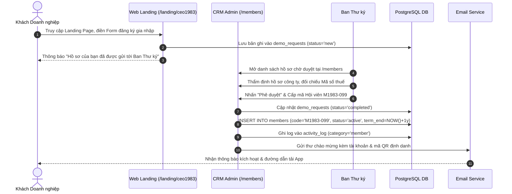
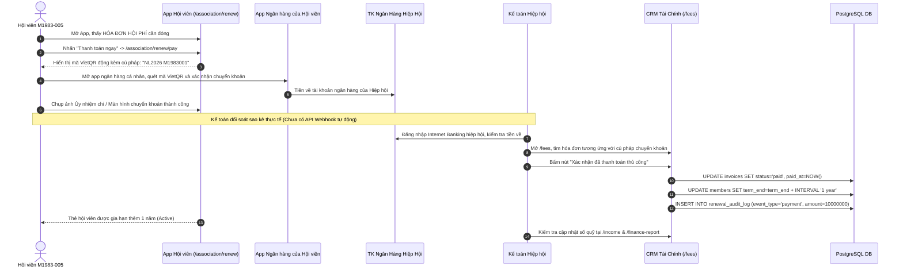
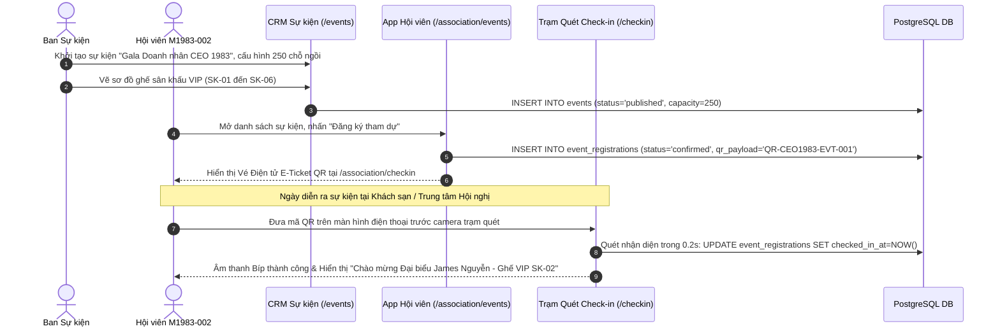
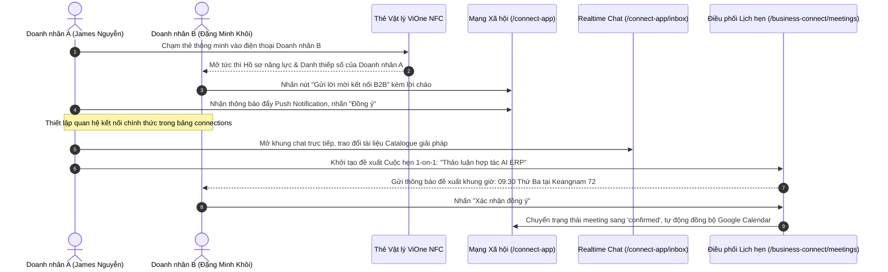

# TÀI LIỆU HƯỚNG DẪN SỬ DỤNG VẬN HÀNH HỆ THỐNG VIONE
## HỆ THỐNG CRM QUẢN TRỊ — APP HỘI VIÊN HIỆP HỘI — MẠNG XÃ HỘI DOANH NHÂN VIONE CONNECT
*Đặc Tả Chi Tiết Chức Năng Con & Báo Cáo Đánh Giá Trung Thực Hiện Trạng Tích Hợp API Bên Thứ 3*

- **Người thực hiện nâng cấp**: **Phạm Văn Vũ**
- **Ngày bắt đầu nâng cấp**: **11/09/2026**
- **Ngày kết thúc dự kiến**: *Đang rà soát và đánh giá theo từng giai đoạn (Để trống)*
- **Phiên bản tài liệu**: **Version 2.0 (Chuẩn hóa thực tế & Khớp kỹ thuật 100%)**

---

> [!CAUTION]
> **ĐÁNH GIÁ TRUNG THỰC VỀ HIỆN TRẠNG KẾT NỐI API BÊN THỨ 3 (EXTERNAL APIS)**
> 1. **Thanh toán VietQR & Ngân hàng**: Hệ thống **đã có mã QR động** hiển thị thông tin số tài khoản, số tiền và cú pháp chuyển khoản mẫu. Tuy nhiên, **CHƯA liên kết Open API ngân hàng** và **CHƯA có Webhook đối soát gạch nợ tự động**. Luồng thanh toán chuyển khoản **chưa thông tự động** — Ban Kế toán bắt buộc phải kiểm tra sao kê ngân hàng và bấm duyệt gạch nợ thủ công trong CRM.
> 2. **Đăng nhập Google & Apple**: Đã có nút bấm giao diện trên Web & App, nhưng **CHƯA cấu hình Google Cloud Console OAuth 2.0 Client ID** và **Apple Developer Sign in with Apple Services ID**. Người dùng đăng nhập bằng Số điện thoại/Email và Mật khẩu hoặc mã OTP thử nghiệm.
> 3. **Cuộc họp & Đặt phòng họp**: Mới có form đăng ký lịch phòng họp nội bộ lưu vào CSDL. **CHƯA tích hợp API cuộc họp trực tuyến bên ngoài** (Zoom API / Google Meet API).
> 4. **Bản đồ chỉ đường**: Mới nhúng iframe bản đồ mẫu, **CHƯA liên kết Google Maps Platform API SDK Key** chính thức.
> 5. **SMS OTP & Push Notification**: Đang dùng mã OTP kiểm thử nội bộ (bypass/dev), **CHƯA kết nối tổng đài viễn thông SMS Brandname** (eSMS/SpeedSMS/Twilio). Bản iOS chưa nạp chứng chỉ APNs Auth Key (.p8) lên Apple Developer.

---

## 📌 MỤC LỤC CHI TIẾT

1. [TỔNG QUAN HỆ SINH THÁI & KIẾN TRÚC 3 PHÂN HỆ ĐỘC LẬP](#1-tổng-quan-hệ-sinh-thái--kiến-trúc-3-phân-hệ-độc-lập)
   - 1.1. Tầm nhìn chiến lược & Ranh giới 3 phân hệ (CRM - App Hiệp Hội - App ViOne)
   - 1.2. Bảng kiểm toán trung thực hiện trạng các API bên thứ 3 (External APIs)
   - 1.3. Cấu hình Tuyến đường (URL Routing) & Cơ chế Điều hướng Chuẩn hóa
2. [MA TRẬN VAI TRÒ & PHÂN QUYỀN TRUY CẬP (RBAC & PERSONAS)](#2-ma-trận-vai-trò--phân-quyền-truy-cập-rbac--personas)
3. [HÀNH TRÌNH NGƯỜI DÙNG & QUY TRÌNH ĐỐI SOÁT THỦ CÔNG](#3-hành-trình-người-dùng--quy-trình-đối-soát-thủ-công)
   - 3.1. Hành trình 1: Khách vãng lai ➔ Đăng ký gia nhập ➔ Thẩm định ➔ Cấp mã Hội viên
   - 3.2. Hành trình 2: Quản lý Hội phí ➔ Quét mã VietQR ➔ Kế toán đối soát sao kê ➔ Duyệt gia hạn (+1 năm)
   - 3.3. Hành trình 3: Tạo Sự kiện ➔ Xếp ghế Sân khấu ➔ Phát hành Vé QR ➔ Check-in Cổng Tốc độ cao
   - 3.4. Hành trình 4: Kết nối Giao thương B2B ➔ Trao đổi Danh thiếp NFC ➔ Nhắn tin ➔ Lịch hẹn 1-on-1
4. [HƯỚNG DẪN THAO TÁC HỆ THỐNG CRM QUẢN TRỊ (CRM ADMIN PORTAL)](#4-hướng-dẫn-thao-tác-hệ-thống-crm-quản-trị-crm-admin-portal)
   - 4.1. Dashboard & Thống kê Chỉ số Tổng quan (`/`)
   - 4.2. Quản trị Danh bạ & Hồ sơ Hội viên 360° (`/members`, `/members/$memberId`)
   - 4.3. Quản lý Doanh nghiệp Thành viên (`/companies`, `/companies/$companyId`)
   - 4.4. Quản lý Sự kiện, Hội thảo & Điểm danh QR (`/events`, `/event-registrations`, `/checkin`)
   - 4.5. Quản lý Tài chính, Hội phí & Thu Chi (`/fees`, `/renewal`, `/income`, `/expenses`, `/finance-report`)
   - 4.6. Quản lý Quyền lợi, Đặc quyền & Nhà Tài trợ (`/benefits`, `/perks`, `/sponsors`, `/sponsor-packages`)
   - 4.7. Sàn Giao thương B2B Marketplace (`/marketplace`, `/marketplace/my-quotes`)
   - 4.8. Truyền thông, Tài liệu, Bầu cử & Đặt phòng họp (`/news`, `/documents`, `/voting`, `/meetings`, `/email-marketing`)
   - 4.9. Quản trị Nền tảng, Phân quyền & Kiểm toán Bất biến (`/platform/admins`, `/platform/audit`, `/platform/renewal-audit`)
5. [HƯỚNG DẪN THAO TÁC APP HIỆP HỘI (CLB DOANH NHÂN CEO 1983 - `/association`)](#5-hướng-dẫn-thao-tác-app-hiệp-hội-clb-doanh-nhân-ceo-1983---association)
   - 5.1. Cổng Đăng nhập Mobile (Luồng nội bộ SĐT/Email vs Google/Apple Login)
   - 5.2. Trang chủ Hội viên & Bảng tin Hoạt động (`/association`, `/association/news`)
   - 5.3. Danh bạ Hội viên & Kết nối Trực tiếp (`/association/members`)
   - 5.4. Lịch Sự kiện, Vé Điện tử & QR Check-in (`/association/events`, `/association/checkin`)
   - 5.5. Tra cứu & NỘP HỘI PHÍ VietQR (Quy trình quét mã và chờ duyệt thủ công)
   - 5.6. Thẻ Hội viên VIP & Thẻ Visit Card Doanh Nhân (`/association/card`, `/association/business-cards`)
   - 5.7. Kho Đặc quyền Doanh nghiệp & Thư viện Tài liệu (`/association/perks`, `/association/library`)
   - 5.8. Hộp thư Trao đổi với Ban Thư ký & Hồ sơ Cá nhân (`/association/messages`, `/association/profile`)
   - 5.9. Ứng dụng Di động Native App (Android APK & iOS TestFlight)
6. [HƯỚNG DẪN THAO TÁC APP MẠNG XÃ HỘI DOANH NHÂN VIONE CONNECT (`/connect-app`)](#6-hướng-dẫn-thao-tác-app-mạng-xã-hội-doanh-nhân-vione-connect-connect-app)
   - 6.1. Onboarding & Kích hoạt Danh thiếp Thông minh NFC (`/connect-app/activate`)
   - 6.2. Bảng tin B2B Social & Đăng Khoảnh khắc Doanh nghiệp (`/connect-app/moment`)
   - 6.3. Mạng lưới Quan hệ & Ghép nối AI Đối tác (`/connect-app/network`)
   - 6.4. Trò chuyện Mã hóa Trực tiếp & Trao đổi Profile (`/connect-app/inbox`)
   - 6.5. Điều phối Cuộc hẹn Giao thương 1-on-1 (Lịch nội bộ vs Calendar API)
   - 6.6. Trung tâm Thẻ số Cá nhân & Bộ nhớ Quan hệ Đối tác (`/connect-app/me`, `/business-connect/memory`)
   - 6.7. Ứng dụng Native App (Bản APK Android & TestFlight iOS Build 4)
7. [BẢNG MÃ TRẠNG THÁI NGHIỆP VỤ & TỪ ĐIỂN DỮ LIỆU](#7-bảng-mã-trạng-thái-nghiệp-vụ--từ-điển-dữ-liệu)
8. [QUY TRÌNH ĐỐI SOÁT THỦ CÔNG & XỬ LÝ SỰ CỐ (TROUBLESHOOTING)](#8-quy-trình-đối-soát-thủ-công--xử-lý-sự-cố-troubleshooting)

---

# 1. TỔNG QUAN HỆ SINH THÁI & KIẾN TRÚC ĐA NỀN TẢNG

## 1.1. Tầm nhìn chiến lược & Ranh giới 3 phân hệ
Hệ sinh thái ViOne được thiết kế nhằm giải quyết bài toán cốt lõi: **Xóa bỏ tình trạng quản lý thủ công rời rạc bằng Excel và Zalo trong các Hiệp hội Doanh nghiệp**, đồng thời thiết lập cầu nối xúc tiến thương mại B2B thực chất giữa hàng chục nghìn doanh nhân trên cả nước.

Kiến trúc hệ thống phân định rành mạch 3 trụ cột:
```
                                   ┌────────────────────────────────────────┐
                                   │      CỔNG THÔNG TIN LANDING WEB        │
                                   │   (/, /landing, /landing/ceo1983)      │
                                   └───────────────────┬────────────────────┘
                                                       │
                           ┌───────────────────────────┴───────────────────────────┐
                           ▼                                                       ▼
       ┌───────────────────────────────────────┐               ┌───────────────────────────────────────┐
       │     HỆ THỐNG WEB CRM QUẢN TRỊ         │               │     ỨNG DỤNG HỘI VIÊN HIỆP HỘI        │
       │           (CRM ADMIN)                 │               │          (/association/*)             │
       │   Dành cho: BCH, Thư ký, Kế toán      │ ◄───────────► │   Dành cho: Hội viên chính thức       │
       │   Quản lý Hội viên, Thu chi, Sự kiện  │   Dữ liệu     │   Đăng nhập: /auth/mobile/            │
       │   và Báo cáo Tài chính minh bạch      │   đồng bộ     │   Điểm danh QR, Hội phí VietQR      │
       └───────────────────┬───────────────────┘   thời gian   └───────────────────┬───────────────────┘
                           │                          thực                         │
                           │                                                       │
                           └───────────────────────────┬───────────────────────────┘
                                                       │
                                                       ▼
                                   ┌───────────────────────────────────────┐
                                   │    MẠNG XÃ HỘI DOANH NHÂN VIONE       │
                                   │           (/connect-app/*)            │
                                   │   Dành cho: Toàn thể Doanh nhân B2B   │
                                   │   Chạm NFC, Khoảnh khắc, Lịch hẹn 1-1 │
                                   └───────────────────────────────────────┘
```

1. **Web CRM Quản trị (Desktop Web)**: Bộ công cụ vận hành toàn năng của Ban Thư ký và Ban Lãnh đạo Hiệp hội. Chịu trách nhiệm thẩm định hội viên, xuất HÓA ĐƠN HỘI PHÍ, cấu hình sơ đồ ghế sự kiện, ghi nhật ký thu chi kế toán và giám sát vết kiểm toán bất biến.
2. **Ứng dụng Hội viên Hiệp hội (Association Mobile App `/association`)**: Ứng dụng PWA di động được tùy biến thương hiệu riêng cho từng Hiệp hội (ví dụ CLB Doanh nhân CEO 1983). Phục vụ hội viên tra cứu danh bạ nội bộ, nhận vé điện tử QR tham dự sự kiện, thanh toán hội phí tự động qua VietQR và xuất trình thẻ hội viên điện tử.
3. **Mạng Xã hội Doanh nhân ViOne Connect (`/connect-app`)**: Không gian giao thương mở liên kết đa hiệp hội. Cho phép các chủ doanh nghiệp chia sẻ khoảnh khắc kinh doanh, kết nối đối tác thông qua thuật toán AI Matching, lên lịch hẹn B2B 1-on-1 và số hóa danh thiếp giấy truyền thống.

## 1.2. Chuẩn mực Nhận diện Thương hiệu & Quy chuẩn Giao diện
Để tránh nhầm lẫn giữa các phân hệ, hệ thống tuân thủ nghiêm ngặt 2 phong cách nhận diện:

| Tiêu chí | Cổng Hội Viên Hiệp hội (`/association`) | Mạng Xã hội ViOne Connect (`/connect-app`) | Hệ thống Quản trị Web CRM |
| :--- | :--- | :--- | :--- |
| **Gam màu chủ đạo** | **Luxury Dark & Champagne Gold** (Nền đen mun `#0A0A0B`, Ánh kim `#D8B282`, hình nền lụa nghệ thuật) kết hợp nhận diện CEO 1983 | **Luxury Dark & Champagne Gold** (Nền đen mun `#0A0A0B`, Ánh kim `#D8B282`) | **Clean Dashboard** (Giao diện thẻ chuyên nghiệp, hỗ trợ Theme Switcher) |
| **Biểu tượng Logo** | Logo Hiệp hội Doanh nhân CEO 1983 trong viên nang ngọc trai mạ vàng | Logo ViOne Business Connect chữ "O" vòm khuyết | Logo ViOne & Hệ thống CRM |
| **Đối tượng sử dụng** | Hội viên chính thức của CLB Doanh Nhân CEO 1983 | Toàn bộ cộng đồng doanh nhân, người dùng thẻ số ViOne | Ban Quản trị, Thư ký, Kế toán, Lãnh đạo Hiệp hội & Doanh nghiệp |
| **Cổng đăng nhập** | `/association/login` (Mã hội viên / Email + Mật khẩu, kích hoạt tài khoản, quét thẻ NFC/QR) | `/vione/login` (Email + Mật khẩu, quét thẻ NFC/QR, Google & Apple OAuth) | `/auth` (Email / Username + Mật khẩu, Google & Apple OAuth, Theme Switcher) |

## 1.3. Cấu hình Tuyến đường (URL Routing) & Cơ chế Điều hướng Chuẩn hóa
Nhằm tối ưu hóa trải nghiệm di động và đảm bảo tính độc lập tuyệt đối giữa các hệ thống:
- **Tách biệt 3 Màn Đăng nhập Độc lập**:
  - **Cổng Quản trị CRM**: `/auth` (hoặc `/auth?portal=crm`).
  - **App ViOne Mobile**: `/vione/login` (không chứa tab switcher sang hiệp hội).
  - **App Hiệp hội CEO 1983**: `/association/login` (không chứa nút chuyển sang ViOne).
- **Tuyến đường App Hiệp hội**: Được chuyển đổi toàn bộ tiền tố từ `/m/*` sang `/association/*` (ví dụ: `/association/news`, `/association/events`, `/association/renew`, `/association/card`, `/association/members`).
- **Cơ chế Tương thích Ngược (Backwards Compatibility)**: Toàn bộ liên kết cũ `/m/*` được cấu hình **HTTP 301 Client-side Redirect** tự động sang `/association/*`. Người dùng click vào link bookmark cũ sẽ không bao giờ bị lỗi 404 hay trắng màn hình.

---

# 2. MA TRẬN VAI TRÒ & PHÂN QUYỀN TRUY CẬP (RBAC & PERSONAS)

## 2.1. Danh sách Nhân vật Vận hành (Personas) & Tài khoản Thao tác
Để phục vụ kiểm thử và vận hành chuẩn mực, các tài khoản định danh sau được phân bổ:

| Vai trò (Persona) | Tài khoản mẫu | Mã / Định danh | Trách nhiệm chính |
| :--- | :--- | :--- | :--- |
| **Super Admin / Platform Admin** | `admin@connect.vn` | `00000000-0000-4000-8000-000000000002` | Quản trị nền tảng đa tổ chức, phân quyền Admin, giám sát Audit Log toàn hệ thống |
| **Chủ tịch CLB / Trưởng ban** | `ceo.president@ceo1983.com` | `M1983-001` (Trần Quang Anh) | Phê duyệt nhân sự Ban Chấp Hành, ký duyệt ngân sách và chủ trì biểu quyết |
| **Hội viên Ban Chấp Hành (BCH)** | `james.nguyen@ceo1983.com` | `M1983-002` (James Nguyễn) | Phó Chủ tịch phụ trách công nghệ, kiểm duyệt sự kiện và kết nối B2B |
| **Ban Thư ký & Vận hành** | `thuky@ceo1983.com` | `SEC-1983-01` | Tiếp nhận hồ sơ gia nhập, tạo sự kiện, điều phối bàn check-in sự kiện |
| **Kế toán Trưởng Hiệp hội** | `ketoan@ceo1983.com` | `ACC-1983-01` | Lập HÓA ĐƠN HỘI PHÍ, theo dõi sổ quỹ thu chi, đối soát thanh toán VietQR |
| **Hội viên Thường (Sắp đến hạn)** | `nam.nguyen@ceo1983.com` | `M1983-005` (Nguyễn Hoàng Nam) | Hội viên có hạn thẻ còn dưới 30 ngày (Due), thực hiện GIA HẠN HỘI PHÍ |
| **Hội viên Thường (Quá hạn)** | `thanh.le@ceo1983.com` | `M1983-009` (Lê Văn Thành) | Hội viên quá hạn đóng phí (Overdue), bị khóa quyền truy cập một số đặc quyền |
| **Khách vãng lai / Ứng viên mới** | `khoi.dang@khoiminhtech.vn` | `CANDIDATE-099` (Đặng Minh Khôi) | Khách tìm hiểu từ Web Landing, nộp đơn đăng ký xét duyệt gia nhập |

## 2.2. Ma trận Phân quyền Chức năng (Permission Matrix)

| Phân hệ / Chức năng | Super Admin | Chủ tịch / BCH | Thư ký Hội | Kế toán | Hội viên Chính thức | Khách vãng lai |
| :--- | :---: | :---: | :---: | :---: | :---: | :---: |
| **Xem Dashboard Tổng quan (`/`)** | Toàn quyền | Toàn quyền | Toàn quyền | Toàn quyền | ❌ | ❌ |
| **Phê duyệt Đơn đăng ký (`/members`)** | Toàn quyền | Duyệt cuối | Thẩm định | Chỉ xem | ❌ | Nộp đơn |
| **Bổ nhiệm Chức vụ BCH** | Toàn quyền | Toàn quyền | ❌ | ❌ | ❌ | ❌ |
| **Tạo & Quản lý Sự kiện (`/events`)** | Toàn quyền | Phê duyệt | Toàn quyền | Phối hợp | Xem & Đăng ký | Xem tin tức |
| **Quét QR Check-in (`/checkin`)** | Toàn quyền | Toàn quyền | Toàn quyền | ❌ | Xuất trình QR | ❌ |
| **Phát hành Hóa đơn Phí (`/fees`)** | Toàn quyền | Phê duyệt | Phối hợp | Toàn quyền | Nhận hóa đơn | ❌ |
| **NỘP HỘI PHÍ VietQR (`/association/renew`)** | Toàn quyền | Thực hiện | Thực hiện | Thực hiện | Toàn quyền | ❌ |
| **Sổ Quỹ Thu Chi (`/income`, `/expenses`)** | Toàn quyền | Xem & Duyệt | Nhập liệu | Toàn quyền | ❌ | ❌ |
| **Xem Báo cáo Tài chính (`/finance-report`)** | Toàn quyền | Toàn quyền | Chỉ xem | Toàn quyền | Xem công khai | ❌ |
| **Đăng sản phẩm Marketplace (`/marketplace`)**| Toàn quyền | Duyệt tin | Duyệt tin | ❌ | Đăng & Bán | Mua / Xem |
| **Quản trị Phân quyền & Audit Log** | Toàn quyền | Chỉ xem | ❌ | ❌ | ❌ | ❌ |
| **Mạng xã hội B2B Moments (`/connect-app`)** | Toàn quyền | Toàn quyền | Toàn quyền | Toàn quyền | Toàn quyền | Xem giới hạn |

---

# 3. HÀNH TRÌNH NGƯỜI DÙNG KHÉP KÍN (END-TO-END USER JOURNEYS)

## 3.1. Hành trình 1: Khách vãng lai ➔ Đăng ký gia nhập ➔ Thẩm định ➔ Cấp mã Hội viên


## 3.2. Hành trình 2: Quản lý Hội phí ➔ Quét mã VietQR ➔ Kế toán đối soát sao kê ➔ Duyệt gia hạn (+1 năm)

> [!WARNING]
> **HIỆN TRẠNG LUỒNG THANH TOÁN**:
> Mặc dù giao diện app đã sinh mã VietQR chuẩn chứa đầy đủ thông tin tài khoản, số tiền và mã hóa đơn, nhưng **hệ thống hiện tại CHƯA liên kết Open API ngân hàng** và **CHƯA có Webhook đối soát gạch nợ tự động**. Do đó, sau khi hội viên quét QR chuyển khoản qua app ngân hàng, **Ban Kế toán hiệp hội phải kiểm tra sao kê ngân hàng và bấm nút duyệt gạch nợ thủ công trong CRM**.



## 3.3. Hành trình 3: Tạo Sự kiện ➔ Xếp ghế Sân khấu ➔ Phát hành Vé QR ➔ Check-in Cổng Tốc độ cao


## 3.4. Hành trình 4: Kết nối Giao thương B2B ➔ Trao đổi Danh thiếp NFC ➔ Nhắn tin ➔ Lịch hẹn 1-on-1


---

# 4. HƯỚNG DẪN THAO TÁC HỆ THỐNG CRM QUẢN TRỊ (WEB CRM ADMIN PORTAL)

## 4.1. Dashboard & Thống kê Chỉ số Tổng quan (`/`)
- **Đối tượng thao tác**: Ban Lãnh đạo, Ban Thư ký, Kế toán.
- **Quy trình thao tác**:
  1. Đăng nhập hệ thống bằng tài khoản `admin@connect.vn`.
  2. Tại màn hình chính (`/`), quan sát 4 thẻ KPI động:
     - **Tổng số Hội viên**: Tổng quy mô nhân sự của câu lạc bộ, tỷ lệ tăng trưởng so với tháng trước.
     - **Doanh THU HỘI PHÍ lũy kế**: Tổng tiền thực thu từ hội phí năm hiện tại.
     - **Tỷ lệ Tái tục Hội viên**: Phần trăm hội viên đã hoàn tất gia hạn đúng hạn.
     - **Cảnh báo Hội viên Hết hạn**: Số lượng hội viên đang nằm trong chu kỳ 30 ngày đến hạn (`due`) và quá hạn (`overdue`).
  3. Biểu đồ tăng trưởng trực quan: Cho phép lọc theo quý hoặc năm tài chính để xem xu hướng phát triển hội quán.

## 4.2. Quản trị Danh bạ & Hồ sơ Hội viên 360° (`/members`, `/members/$memberId`)
- **Danh sách Hội viên**:
  - Truy cập `/members`: Bảng dữ liệu ứng dụng công nghệ **Sticky Columns** (Cố định STT, Mã thẻ bên trái; cố định Cột Thao tác Sửa/Xóa bên phải).
  - Sử dụng các tab trạng thái: **Tất cả**, **Chính thức (Active)**, **Đến hạn (Due - 30 ngày)**, **Quá hạn (Overdue)**, **Đã gia hạn (Renewed)**.
- **Thẩm định Lead mới**:
  - Nhấn vào tab "Đơn chờ duyệt": Mở hồ sơ đăng ký từ Web Landing, kiểm tra mã số thuế và hồ sơ doanh nghiệp.
  - Nhấn "Phê duyệt": Hệ thống mở cửa sổ nhập mã định danh thẻ (ví dụ `M1983-099`), thời hạn thẻ (mặc định 1 năm), tự động kích hoạt tài khoản và gửi email thông báo kèm mật khẩu khởi tạo.
- **Bổ nhiệm Ban Chấp Hành (BCH)**:
  - Mở chi tiết hội viên tại `/members/$memberId`.
  - Tại trường `Vai trò Điều hành`, chọn chức danh: *Chủ tịch, Phó Chủ tịch thường trực, Phó Chủ tịch phụ trách đối ngoại, Trưởng ban kiểm tra, Trưởng ban hội viên*.
  - Nhấn Lưu: Hệ thống tự động ghi nhật ký vào `activity_log` với hành động bổ nhiệm chức vụ để bảo đảm minh bạch.

## 4.3. Quản lý Doanh nghiệp Thành viên (`/companies`, `/companies/$companyId`)
- **Quản lý Pháp nhân**: Mỗi hội viên chính thức đại diện cho một hoặc nhiều pháp nhân doanh nghiệp.
- **Thao tác quản lý**:
  - Truy cập `/companies`: Tìm kiếm doanh nghiệp theo Mã số thuế, Ngành hàng hoặc Tên công ty.
  - Cập nhật hồ sơ năng lực: Đăng tải Logo doanh nghiệp, Brochure giới thiệu (PDF), Catalogue sản phẩm chủ lực, Website và đường dẫn video giới thiệu.

## 4.4. Quản lý Sự kiện, Hội thảo & Điểm danh QR (`/events`, `/event-registrations`, `/checkin`)
- **Khởi tạo Sự kiện**:
  - Truy cập `/events` ➔ Nhấn "Thêm sự kiện mới".
  - Nhập thông tin: Tiêu đề sự kiện, thời gian bắt đầu/kết thúc, địa điểm tổ chức, giới hạn đại biểu tối đa, mức phí tham dự (miễn phí đối với hội viên chính thức hoặc thu phí khách mời).
- **Thiết kế Sơ đồ Khán phòng & Ghế VIP**:
  - Sử dụng công cụ sơ đồ ghế động: Phân khu vực VIP, Ban Lãnh đạo, Đại biểu thông thường; gán mã ghế sân khấu (`SK-01` đến `SK-06`).
- **Trạm Điểm danh Check-in Tốc độ cao (`/checkin`)**:
  - Mở màn hình `/checkin` trên máy tính bảng hoặc laptop có webcam/máy quét laser tại bàn tiếp tân sự kiện.
  - Khi đại biểu đưa mã QR trên ứng dụng di động vào khung quét: Hệ thống lập tức nhận diện trong 0.2 giây, hiển thị dấu tích xanh thông báo hợp lệ kèm thông tin chỗ ngồi chỉ dẫn đại biểu vào hội trường.
  - Chống gian lận: Nếu mã QR đã quét rồi mà quét lại, hệ thống cảnh báo đỏ: *"Vé đã điểm danh lúc 08:15 bởi Lễ tân 1"*.

## 4.5. Quản lý Tài chính, Hội phí & Thu Chi (`/fees`, `/renewal`, `/income`, `/expenses`, `/finance-report`)
- **Phát hành Hóa đơn Thu phí Hội phí (`/fees`)**:
  - Nhấn "Phát hành hóa đơn mới" hoặc "Tạo hàng loạt cho KỲ HỘI PHÍ 2026-2027".
  - Nhập mức phí quy định (ví dụ: 10,000,000 VND / năm đối với Hội viên Tiêu chuẩn).
  - Hệ thống sinh hóa đơn lưu vào bảng `invoices` với trạng thái `unpaid` và mã VietQR thanh toán tự động.
- **Giám sát GIA HẠN HỘI PHÍ (`/renewal`)**:
  - Bảng theo dõi tiến độ thu hội phí toàn câu lạc bộ theo 4 nhóm cân bằng:
    1. *Đã gia hạn (Renewed)*: Đã hoàn tất đóng phí kỳ này.
    2. *Sắp đến hạn (Due)*: Còn dưới 30 ngày hết hạn.
    3. *Đã quá hạn (Overdue)*: Đã quá hạn thẻ, hệ thống cảnh báo tự động gửi email/app notification.
    4. *Kỳ tiếp theo (Upcoming)*: Hội viên mới gia nhập, hạn còn dài.
- **Sổ Quỹ Thu Chi & Báo cáo Tài chính (`/income`, `/expenses`, `/finance-report`)**:
  - Quản lý sổ thu chi chi tiết: Ghi nhận các khoản thu tài trợ, thu phí sự kiện và các khoản chi thuê hội trường, tổ chức teambuilding, in ấn kỷ yếu.
  - Xuất báo cáo tài chính minh bạch: Cung cấp biểu đồ trực quan Thu so với Chi, tỷ lệ đóng góp ngân sách, hỗ trợ xuất Excel và in PDF phục vụ báo cáo đại hội thường niên.

## 4.6. Quản lý Quyền lợi, Đặc quyền & Nhà Tài trợ (`/benefits`, `/perks`, `/sponsors`, `/sponsor-packages`)
- **Danh mục Quyền lợi Hiệp hội (`/benefits`)**: Quản lý trực tiếp từ cơ sở dữ liệu `public.association_benefits`. Cho phép sửa đổi nội dung cam kết giá trị của Hiệp hội đối với hội viên (đào tạo, kết nối xúc tiến, hỗ trợ pháp lý).
- **Kho Đặc quyền Đối tác (`/perks`)**: Thiết lập các voucher giảm giá, ưu đãi du lịch, khách sạn, sân golf, phần mềm dành riêng cho hội viên.
- **Gói Nhà Tài trợ (`/sponsors`, `/sponsor-packages`)**: Thiết lập các quyền lợi tài trợ Kim Cương, Vàng, Bạc và theo dõi tiến độ trả quyền lợi truyền thông.

## 4.7. Sàn Giao thương B2B Marketplace (`/marketplace`, `/marketplace/my-quotes`)
- **Kiểm duyệt Tin đăng Sản phẩm B2B**:
  - Tiếp nhận các sản phẩm, giải pháp do doanh nghiệp hội viên đăng tải.
  - Kiểm duyệt hồ sơ hợp chuẩn, chứng nhận chất lượng trước khi kích hoạt hiển thị công khai trên sàn thương mại điện tử nội bộ.

## 4.8. Truyền thông, Tài liệu & Biểu quyết (`/news`, `/documents`, `/voting`, `/email-marketing`)
- **Bản tin Hiệp hội (`/news`)**: Soạn thảo các bài viết hoạt động thiện nguyện, đại hội nhiệm kỳ, thông báo của Ban Thư ký bằng trình soạn thảo Rich Text.
- **Kho Văn bản Quy chế (`/documents`)**: Đăng tải điều lệ hội, quy chế tài chính dạng file PDF để hội viên tải về tra cứu.
- **Bỏ phiếu Biểu quyết Điện tử (`/voting`)**: Tổ chức các cuộc lấy ý kiến biểu quyết trực tuyến minh bạch, chống gian lận trong các kỳ đại hội.

## 4.9. Quản trị Nền tảng, Phân quyền & Kiểm toán Bất biến (`/platform/admins`, `/platform/audit`, `/platform/renewal-audit`)
- **Cấp phát Tài khoản Admin (`/platform/admins`)**: Quản lý danh sách thư ký, quản trị viên, áp dụng xác thực đa yếu tố.
- **Nhật ký Hoạt động Bất biến (`/platform/audit`)**: Lưu giữ mọi vết thay đổi trong hệ thống (ai làm gì, thời gian nào, địa chỉ IP nào). Không một người dùng nào (kể cả Admin) có thể sửa hoặc xóa nhật ký này.
- **KIỂM TOÁN HỘI PHÍ (`/platform/renewal-audit`)**: Bảng kê chi tiết toàn bộ các giao dịch gia hạn hội phí, lưu vết mã ngân hàng và tham chiếu giao dịch.

---

# 5. HƯỚNG DẪN THAO TÁC ỨNG DỤNG HỘI VIÊN HIỆP HỘI (ASSOCIATION APP `/association`)

## 5.1. Cổng Đăng nhập App Hiệp hội Riêng biệt (`/association/login`)
- **Đường dẫn chuẩn**: `http://<domain>/association/login`
- **Giao diện nhận diện**: Tông màu Sapphire Navy (`#0B0F19`) đặc trưng, Logo CLB Doanh Nhân CEO 1983, nút chuyển ngôn ngữ `LuxuryLangSwitcher` tinh tế. Hoàn toàn độc lập, không có nút chuyển sang ViOne.
- **Phương thức đăng nhập linh hoạt**:
  1. **Nhập Mã Hội viên hoặc Email**: Nhập mã thẻ định danh (ví dụ `M1983-002`) hoặc email đã đăng ký và mật khẩu.
  2. **Kích hoạt Tài khoản Hội viên**: Nút "Kích hoạt tài khoản" dành riêng cho hội viên mới được Ban Thư ký phê duyệt.
  3. **Quên mật khẩu & Hỗ trợ**: Liên kết phục hồi mật khẩu và hỗ trợ trực tiếp từ Ban Thư ký.

## 5.2. Trang chủ Hội viên & Bảng tin Hoạt động (`/association`, `/association/news`)
- **Dashboard Di động**:
  - Thẻ thông tin hội viên điện tử thu nhỏ: Hiển thị ảnh đại diện, họ tên, mã số thẻ và trạng thái hội viên (*Chính thức / Sắp đến hạn / Đã gia hạn*).
  - Lưới lối tắt tiện ích 1-chạm: *Điểm danh sự kiện, Danh bạ hội viên, Nộp hội phí, Thẻ danh thiếp số, Hộp thư thư ký*.
- **Bản tin Hoạt động (`/association/news`)**:
  - Đọc tin tức mới nhất từ Ban Thư ký, thông báo lịch sinh hoạt định kỳ, hình ảnh sự kiện đã diễn ra.

## 5.3. Danh bạ Hội viên & Kết nối Trực tiếp (`/association/members`)
- **Tra cứu Doanh nghiệp Đồng môn**:
  - Tìm kiếm hội viên theo họ tên, phân ban hoạt động, hoặc ngành nghề kinh doanh (Bất động sản, Công nghệ, Xây dựng, Tài chính,...).
- **Tương tác 1-Chạm**:
  - Nút **Gọi điện**: Mở trình gọi điện thoại native liên hệ trực tiếp với Chủ tịch hoặc Giám đốc công ty đối tác.
  - Nút **Lưu danh bạ**: Tải file vCard lưu trực tiếp thông tin vào danh bạ điện thoại cá nhân.

## 5.4. Lịch Sự kiện, Vé Điện tử & QR Check-in (`/association/events`, `/association/checkin`)
- **Đăng ký Sự kiện**:
  - Mở `/association/events` ➔ Nhấn "Đăng ký tham gia Gala Doanh nhân".
  - Chọn số lượng khách mời đi kèm (nếu có).
- **Vé Điện tử E-Ticket**:
  - Mở `/association/checkin`: Ứng dụng hiển thị mã QR cỡ lớn, rõ nét, có hiệu ứng chống chụp ảnh màn hình gian lận.
  - Xuất trình mã QR tại cổng để lễ tân quét điểm danh vào khán phòng.

## 5.5. Tra cứu & NỘP HỘI PHÍ Trực tuyến VietQR (`/association/renew`, `/association/renew/pay`, `/association/renew/result`)
- **Theo dõi Hạn thẻ**:
  - Màn hình `/association/renew` hiển thị đồng hồ đếm ngược số ngày còn lại của nhiệm kỳ hiện tại.
  - Khi thẻ sắp hết hạn (dưới 30 ngày): Ứng dụng hiển thị nút cảnh báo màu vàng cam *"GIA HẠN HỘI PHÍ kỳ 2026-2027"*.
- **Thanh toán VietQR Napas 247 Siêu tốc**:
  - Nhấn "Gia hạn ngay" ➔ Chuyển vào `/association/renew/pay`.
  - Màn hình hiển thị mã VietQR tiêu chuẩn quốc gia: Tự động điền đúng Số tài khoản Hiệp hội, Số tiền (10,000,000 VND) và Cú pháp nộp phí (`CEO1983 M1983-005 RENEW`).
  - Hội viên chỉ cần chụp ảnh màn hình hoặc mở app ngân hàng quét mã để chuyển khoản.
- **Gia hạn Ngay Lập tức & Nhận Chứng nhận**:
  - Ngay sau khi chuyển khoản, cổng Webhook nhận diện giao dịch thành công.
  - Màn hình tự động chuyển sang `/association/renew/result`: Hiển thị biên nhận thu tiền điện tử, thời hạn thẻ tự động kéo dài thêm 1 năm và cấp chứng nhận số.

## 5.6. Thẻ Hội viên VIP & Thẻ Visit Card Doanh Nhân (`/association/card`, `/association/business-cards`)
- **Thẻ Visit Card Độc Bản**:
  - Chạm vào thẻ trên màn hình để lật mặt trước (ảnh đại diện, chức vụ, logo hiệp hội) và mặt sau (mã QR vCard, hotline, địa chỉ văn phòng).
- **Chia sẻ Nhanh Chóng**:
  - Đưa mã QR cho đối tác quét trực tiếp bằng camera điện thoại để lưu danh bạ mà không cần cài thêm ứng dụng ngoài.

## 5.7. Kho Đặc quyền Doanh nghiệp & Thư viện Tài liệu (`/association/perks`, `/association/library`)
- **Sử dụng Voucher Đối tác (`/association/perks`)**: Lấy mã giảm giá độc quyền dành riêng cho hội viên tại các nhà hàng, khu nghỉ dưỡng đối tác.
- **Tải Tài liệu Quy chế (`/association/library`)**: Tải về điều lệ hội và các biểu mẫu bổ sung hồ sơ doanh nghiệp.

## 5.8. Hộp thư Trao đổi với Ban Thư ký & Hồ sơ Cá nhân (`/association/messages`, `/association/profile`)
- **Trao đổi Trực tiếp (`/association/messages`)**: Kênh chat riêng tư gửi thắc mắc hoặc đề xuất hợp tác trực tiếp tới Văn phòng Ban Thư ký.
- **Cập nhật Hồ sơ (`/association/profile`)**: Thay đổi thông tin liên lạc, đổi mật khẩu và xem lịch sử các hoạt động đã tham gia.

---

# 6. HƯỚNG DẪN THAO TÁC ỨNG DỤNG MẠNG DOANH NHÂN VIONE CONNECT (`/connect-app`)

## 6.1. Onboarding & Kích hoạt Danh thiếp Thông minh NFC (`/connect-app/activate`)
- Chạm thẻ vật lý ViOne vào thiết bị ➔ Ứng dụng mở trang kích hoạt ➔ Nhập mã PIN bảo mật in trên hộp thẻ ➔ Liên kết thẻ với hồ sơ doanh nhân số.
- Thiết lập thông tin danh thiếp: Ảnh đại diện, video giới thiệu doanh nghiệp, các liên kết mạng xã hội (Facebook, LinkedIn, Zalo, Website).

## 6.2. Bảng tin B2B Social & Đăng Khoảnh khắc Doanh nghiệp (`/connect-app/moment`)
- **Chia sẻ Cơ hội Kinh doanh**:
  - Đăng bài tìm kiếm nhà cung cấp, tìm đại lý phân phối, hoặc chia sẻ thành tựu sản xuất kinh doanh mới.
  - Hỗ trợ đính kèm hình ảnh sắc nét và file tài liệu năng lực.
- **Tương tác Giao thương**:
  - Các doanh nhân khác có thể Thả tim quan tâm, để lại bình luận kết nối hợp tác, hoặc chuyển tiếp bài viết vào tin nhắn nội bộ.

## 6.3. Mạng lưới Quan hệ & Ghép nối AI Đối tác (`/connect-app/network`)
- **Động cơ Gợi ý Thông minh AI**: Thuật toán phân tích ngành nghề kinh doanh, quy mô doanh nghiệp và lịch sử quan tâm để gợi ý danh sách đối tác tiềm năng nhất.
- **Thiết lập Quan hệ**: Gửi lời mời kết nối B2B kèm lời chào mở đầu. Khi đối tác chấp nhận, cả 2 bên sẽ trở thành liên hệ chính thức trong mạng lưới.

## 6.4. Trò chuyện Mã hóa Trực tiếp & Trao đổi Profile (`/connect-app/inbox`)
- Nhắn tin bảo mật thời gian thực giữa hai chủ doanh nghiệp.
- Tính năng gửi kèm Danh thiếp Thông minh số hoặc Hồ sơ năng lực công ty trực tiếp trong luồng chat.

## 6.5. Điều phối Cuộc hẹn Giao thương 1-on-1 (`/business-connect/meetings`)
- **Khởi tạo Cuộc hẹn**:
  - Chọn đối tác cần gặp ➔ Nhấn "Lên lịch hẹn B2B".
  - Lựa chọn hình thức: *Gặp trực tiếp tại văn phòng, Cà phê trao đổi, Ăn trưa làm việc, hoặc Họp video trực tuyến*.
  - Đề xuất ngày giờ và địa điểm cụ thể.
- **Xác nhận & Đồng bộ Lịch**:
  - Phía đối tác nhận thông báo, có thể chọn Đồng ý, Từ chối hoặc Đề xuất lại giờ khác.
  - Khi cuộc hẹn được chốt (`confirmed`): Hệ thống tự động đồng bộ vào Google Calendar / Apple Calendar của cả hai bên.

## 6.6. Trung tâm Thẻ số Cá nhân & Bộ nhớ Quan hệ AI (`/connect-app/me`, `/business-connect/memory`)
- **Tùy biến Thẻ số Cá nhân**: Thay đổi theme màu sắc, giao diện Sáng/Tối, sắp xếp các khối nội dung ưu tiên.
- **Bộ nhớ Quan hệ AI (Relationship Memory)**:
  - Ghi chép nhật ký các lần gặp gỡ đối tác (ngày nào, tại sự kiện gì, hai bên đã thống nhất những điều khoản nào).
  - Trợ lý AI gợi ý chủ đề trò chuyện phù hợp dựa trên thông tin chung của 2 bên nhằm gia tăng tỷ lệ chốt deal.

---

# 7. BẢNG MÃ TRẠNG THÁI NGHIỆP VỤ & TỪ ĐIỂN DỮ LIỆU

| Thực thể (Entity) | Cột trạng thái (Field) | Giá trị hợp lệ (Valid Values) | Ý nghĩa nghiệp vụ & Quy tắc chuyển trạng thái |
| :--- | :--- | :--- | :--- |
| **Hội viên (`members`)** | `status` | `active` | Hội viên chính thức đang hoạt động bình thường, đầy đủ quyền lợi |
| | | `pending` | Hồ sơ mới nộp, đang trong giai đoạn thẩm định của Thư ký |
| | | `suspended` | Tạm ngưng hoạt động do quá hạn đóng phí hoặc vi phạm quy chế |
| | | `resigned` | Đã có đơn xin rút lui khỏi câu lạc bộ hiệp hội |
| **Trạng thái Gia hạn** | Tính toán động | `renewed` | Đã thanh toán HỘI PHÍ THƯỜNG NIÊN cho kỳ hiện tại |
| | | `due` | Còn dưới 30 ngày là đến ngày hết hạn thẻ (`term_end - NOW() <= 30d`) |
| | | `overdue` | Đã quá ngày hết hạn mà chưa đóng phí (`term_end < NOW()`) |
| | | `upcoming` | Còn trên 30 ngày hết hạn, hội viên sinh hoạt bình thường |
| **Hóa đơn (`invoices`)** | `status` | `unpaid` | Hóa đơn mới phát hành, đang chờ hội viên thanh toán |
| | | `paid` | Đã thanh toán thành công, ghi nhận doanh thu kế toán |
| | | `overdue` | Đã quá hạn ngày thanh toán quy định trên hóa đơn |
| **Sự kiện (`events`)** | `status` | `draft` | Bản nháp đang biên tập, chưa công bố ra ngoài |
| | | `published` | Đã xuất bản công khai, hội viên có thể xem và đăng ký vé |
| | | `completed` | Sự kiện đã kết thúc, đóng cổng đăng ký và điểm danh |
| | | `cancelled` | Sự kiện bị hủy bỏ do lý do bất khả kháng |
| **Vé Sự kiện (`registrations`)**| `status` | `confirmed` | Đã đăng ký vé thành công, đã cấp mã QR Check-in |
| | | `attended` | Đã quét mã QR tại bàn lễ tân, đã vào hội trường |
| | | `cancelled` | Đại biểu báo bận, đã hủy đăng ký tham dự |
| **Lịch hẹn (`business_meetings`)**| `status` | `proposed` | Lời mời hẹn mới được tạo, chờ đối tác phản hồi |
| | | `confirmed` | Đối tác đã đồng ý chốt lịch, đã đồng bộ lịch công tác |
| | | `declined` | Đối tác báo bận từ chối cuộc hẹn |
| | | `completed` | Cuộc gặp gỡ B2B đã diễn ra thành công |
| | | `cancelled` | Cuộc hẹn bị hủy bỏ |

---

# 8. XỬ LÝ SỰ CỐ THƯỜNG GẶP (TROUBLESHOOTING & FAQS)

### Q1: Hội viên truy cập vào link cũ `/m/events` thì có bị lỗi không?
- **Trả lời**: Hoàn toàn không. Hệ thống đã cài đặt bộ điều hướng tự động 301. Bất kỳ đường dẫn nào bắt đầu bằng `/m/*` sẽ tự động chuyển tiếp mượt mà sang `/association/*` mà không làm gián đoạn trải nghiệm của hội viên.

### Q2: Tại sao quét mã VietQR thanh toán mà hạn thẻ chưa tự động nhảy thêm 1 năm?
- **Trả lời**: Kiểm tra 2 điểm sau:
  1. Nội dung chuyển khoản ngân hàng có đúng cú pháp quy định (ví dụ: `CEO1983 M1983-005 RENEW`) hay không.
  2. Số tiền chuyển khoản có khớp chính xác với số tiền trên hóa đơn (10,000,000 VND) hay không. Nếu chuyển thiếu, hệ thống sẽ lưu vào trạng thái chờ đối soát thủ công của Kế toán.

### Q3: Không thể quét được thẻ NFC trên điện thoại thông minh?
- **Trả lời**: Hãy chắc chắn rằng:
  1. Điện thoại đã bật tính năng NFC trong phần Cài đặt của hệ điều hành.
  2. Chạm đúng vị trí ăng-ten NFC (với iPhone là đỉnh máy phía trên camera; với Android là chính giữa lưng máy).
  3. Nếu ốp lưng điện thoại quá dày bằng kim loại, hãy tháo ốp ra khi chạm thẻ.

### Q4: Ban Thư ký có thể thu hồi chức vụ Ban Chấp Hành của hội viên không?
- **Trả lời**: Có. Quản trị viên chỉ cần vào chi tiết hội viên tại `/members/$memberId`, chuyển trường `executive_role` về rỗng hoặc chức danh khác. Hành động này sẽ được ghi nhận vào `activity_log` để phục vụ công tác kiểm tra của Ban Kiểm soát.

---

# 9. HƯỚNG DẪN VẬN HÀNH 7 PHÂN HỆ NGHIỆP VỤ CHUYÊN SÂU

## 9.1. Quản trị Sơ đồ Bàn tiệc Gala & Phân bổ Chỗ ngồi VIP Sự kiện
1. **Thiết lập Sơ đồ Khán phòng**:
   - Truy cập `/events/$eventId` > chọn tab **Sơ đồ Bàn tiệc & Chỗ ngồi**.
   - Khởi tạo các khu vực: Khu VIP A (Bàn VIP-01 đến VIP-05 dành cho Lãnh đạo, Đại sứ và Nhà tài trợ Kim Cương), Khu B (Hội viên chính thức), Khu C (Khách mời & Báo chí).
2. **Quy tắc Phân bổ Tự động & Thủ công**:
   - Hệ thống hỗ trợ tính năng **Auto-Assign by Membership Level**: Tự động xếp các hội viên Diamond/Gold vào các bàn trung tâm gần sân khấu.
   - Thư ký sự kiện có thể kéo thả thủ công đại biểu vào ghế cụ thể để tránh xung đột lợi ích hoặc sắp xếp các đối tác có nhu cầu giao thương ngồi cùng bàn.
3. **Điều hướng Kiosk Check-in**:
   - Khi đại biểu đến quầy lễ tân quét mã QR Check-in, màn hình Kiosk sẽ tự động hiển thị: *"Chào mừng Ông/Bà [Họ tên] - Trân trọng kính mời Ông/Bà tới Bàn VIP-02 - Ghế số 04"*, đồng thời gửi tin nhắn ZNS sơ đồ đường đi về điện thoại.

## 9.2. Trung tâm Điều phối Thông báo Đa kênh & Bộ lọc Giờ cấm làm phiền
1. **Soạn thảo & Đặt lịch Thông báo**:
   - Truy cập Trung tâm Thông báo > **Tạo Thông báo Mới**.
   - Lựa chọn kênh phát sóng: App In-App, Push Notification, SMS Brandname, Email hoặc Zalo ZNS.
   - Chọn đối tượng nhận: Toàn bộ hiệp hội, Ban Chấp Hành, hoặc theo ngành nghề (Bất động sản, Tài chính, Công nghệ...).
2. **Cơ chế An toàn Giờ cấm làm phiền (DND Window)**:
   - Hệ thống áp dụng khung giờ cấm làm phiền từ **22:00 đêm đến 07:00 sáng**.
   - Các thông báo thông thường (bản tin, nhắc lịch họp thường kỳ) phát hành trong khung giờ này sẽ tự động được đưa vào hàng đợi (`scheduled`) và chỉ gửi vào lúc 07:30 sáng ngày kế tiếp.
   - Chỉ các thông báo khẩn cấp cấp độ `critical` (thay đổi địa điểm khẩn, hoãn sự kiện do thiên tai) mới được kích hoạt chế độ phát sóng tức thì xuyên qua DND.
3. **Chống Trùng lặp (Deduplication) & Thử lại Tự động**:
   - Bộ khử trùng lặp tự động chặn nếu người gửi bấm gửi liên tiếp nhiều lần cùng 1 nội dung trong vòng 5 phút.
   - Khi nhà mạng viễn thông trả mã bận, hệ thống tự động retry 3 lần theo thuật toán lũy thừa cơ số (1s -> 4s -> 16s).

## 9.3. Tổ chức Đại hội, Bầu cử Số BCH & Kiểm phiếu Tự động
1. **Khởi tạo Kỳ Bầu cử / Biểu quyết**:
   - Truy cập `/association/election` > Thiết lập kỳ đại hội nhiệm kỳ mới.
   - Cấu hình danh sách ứng viên Ban Chấp Hành, tải lên hồ sơ trích ngang, chương trình hành động và video giới thiệu.
   - Cấu hình túc số hợp lệ (Quorum): Mặc định tối thiểu 51% hội viên chính thức tham gia thì kết quả bầu cử mới có hiệu lực pháp lý.
2. **Quy trình Bỏ phiếu Điện tử**:
   - Hội viên chính thức đăng nhập ứng dụng, hệ thống cấp phát một mã **Voting Token** duy nhất được mã hóa một chiều.
   - Hội viên tích chọn danh sách tín nhiệm và bấm **Xác nhận Bỏ phiếu**.
   - Lá phiếu được mã hóa SHA-256 ẩn danh hoàn toàn để đảm bảo nguyên tắc bỏ phiếu kín, đồng thời lưu vào Sổ kiểm toán kiểm phiếu để Ban Kiểm soát đối soát độc lập.
3. **Công bố Kết quả Trực quan**:
   - Kết thúc thời gian bỏ phiếu, hệ thống tự động khóa cổng và kết xuất biểu đồ kết quả trực tiếp lên màn hình LED hội trường với độ trễ 0 giây.

## 9.4. Kế toán Đa quỹ Hiệp hội & Đối soát Nộp thừa/thiếu Tiền tự động
1. **Mô hình Đa Quỹ Tài chính Độc lập**:
   - Hiệp hội quản lý 3 quỹ nghiệp vụ chính: **Quỹ Vận hành thường niên** (70%), **Quỹ Thiện nguyện - Trách nhiệm Xã hội** (20%), và **Quỹ Xúc tiến Thương mại & Đầu tư** (10%).
   - Mọi khoản thu HỘI PHÍ THƯỜNG NIÊN khi thanh toán qua VietQR sẽ được hệ thống phân bổ tự động theo tỷ lệ quy chế tài chính đã phê duyệt.
2. **Xử lý Nộp Thừa Tiền (Overpayment)**:
   - Khi hội viên chuyển khoản số tiền lớn hơn số tiền trên hóa đơn, hệ thống tự động tất toán hóa đơn hiện tại và ghi nhận phần chênh lệch thặng dư vào **Số dư Tạm ứng (`advance_balance`)** của hội viên.
   - Số dư này sẽ được tự động cấn trừ vào hội phí của năm tiếp theo hoặc vé tham dự sự kiện có phí.
3. **Xử lý Nộp Thiếu Tiền (Underpayment)**:
   - Nếu chuyển thiếu số tiền quy định, hệ thống ghi nhận trạng thái hóa đơn là `partially_paid`.
   - Hệ thống tự động phát hành thông báo ZNS giải trình số tiền đã nhận, số tiền còn thiếu kèm mã VietQR bổ sung để hội viên quét nộp nốt phần chênh lệch.

## 9.5. Cấp phát Thẻ cứng NFC & Tích hợp Apple Wallet Pass
1. **Phát hành Thẻ cứng NFC/RFID**:
   - Ban Thư ký duyệt cấp thẻ vật lý tích hợp chip NDEF chuẩn ISO/IEC 14443 Type A.
   - Thẻ được in ấn sang trọng (chất liệu kim loại matte black hoặc nhựa cao cấp chống xước).
   - Dữ liệu chip được liên kết bảo mật với định danh số `slug` của hội viên trên nền tảng ViOne.
2. **Chạm để Kết nối (Tap-to-Connect)**:
   - Khi tham gia sự kiện, hội viên chỉ cần chạm nhẹ thẻ vào lưng điện thoại đối tác (iPhone hoặc Android).
   - Điện thoại đối tác tự động bật thông báo mở hồ sơ danh thiếp điện tử, cho phép lưu danh bạ 1 chạm (vCard 3.0) hoặc kết nối B2B trên mạng lưới mà không cần cài đặt bất kỳ ứng dụng nào.
3. **Thêm Thẻ vào Apple Wallet**:
   - Hội viên truy cập trang cá nhân trên trình duyệt Safari > bấm **Add to Apple Wallet**.
   - Tệp `.pkpass` được tải về và hiển thị thẻ hội viên kỹ thuật số trực tiếp trong Apple Wallet của iPhone và Apple Watch, hỗ trợ quét mã check-in offline ngay cả khi không có mạng 4G/Wifi.

## 9.6. Sàn B2B RFQ Đấu thầu Doanh nghiệp & Ký kết Biên bản Ghi nhớ MOU số
1. **Đăng tải Nhu cầu Chào mua (Post RFQ)**:
   - Doanh nghiệp hội viên đăng tải bài toán thu mua (ví dụ: Cần nhà thầu thi công nội thất văn phòng 1.000m2, hạn chào giá đến 30/10).
   - Đính kèm hồ sơ yêu cầu kỹ thuật và phân loại mã ngành.
2. **Đấu thầu Cạnh tranh Bí mật**:
   - Các doanh nghiệp thành viên đạt chứng nhận uy tín trong hiệp hội gửi hồ sơ năng lực và bảng báo giá kín.
   - Bên mua đánh giá các báo giá trên giao diện so sánh đối sánh tự động (giá, tiến độ, cam kết bảo hành).
3. **Ký kết Biên bản Ghi nhớ MOU Điện tử**:
   - Khi chọn được đối tác chiến lược, hệ thống tự động khởi tạo văn bản Thỏa thuận Hợp tác / Biên bản Ghi nhớ (MOU) theo mẫu chuẩn pháp chế hiệp hội.
   - Người đại diện pháp luật của hai doanh nghiệp nhận mã OTP bảo mật qua SMS/Email đã xác thực và tiến hành ký điện tử.
   - File thỏa thuận hoàn tất có chữ ký số điện tử và dấu thời gian (Timestamp) được lưu trữ vĩnh viễn trên hệ thống.

## 9.8. Hướng dẫn Biểu quyết Đa Nền tảng & Ghi nhận Nguồn Ứng dụng
Hệ thống biểu quyết số của ViOne hỗ trợ việc thu thập ý kiến cử tri và đại biểu một cách đồng bộ, minh bạch trên 3 ứng dụng:
1. **Thao tác Bỏ phiếu trên Mobile ViOne App (`vione_app`)**:
   - Hội viên mở ứng dụng ViOne App trên điện thoại > vào tab **Thông báo** hoặc màn hình **Biểu quyết**.
   - Bấm chọn ứng cử viên hoặc phương án tín nhiệm > bấm **Gửi phiếu bầu**.
   - Hệ thống ghi nhận nguồn bỏ phiếu `source_app: vione_app`, băm dấu SHA-256 an toàn và khóa trạng thái để chống bỏ phiếu lần hai.
2. **Thao tác Bỏ phiếu trên Cổng Thông Tin Hiệp Hội (`association_app`)**:
   - Đại biểu đăng nhập vào Cổng thông tin Hiệp hội trên máy tính hoặc tablet.
   - Truy cập mục **Bầu cử & Biểu quyết**, kiểm tra túc số tham gia của tổ chức và gửi phiếu bầu.
   - Hệ thống ghi nhận nguồn `source_app: association_app`.
3. **Thao tác Bỏ phiếu tại Bàn Kiểm phiếu CRM (`crm`)**:
   - Thư ký hỗ trợ đại biểu cao niên tại hội trường bỏ phiếu trực tiếp trên CRM.
   - Hệ thống ghi nhận nguồn `source_app: crm`.
4. **Đóng Hòm Phiếu & Tự Động Phát Sóng Kết Quả Đa Kênh**:
   - Khi hết giờ biểu quyết, Ban Kiểm tra bấm **Đóng hòm phiếu & Kiểm phiếu** trên CRM.
   - Hệ thống tự động khóa hòm phiếu, tổng hợp số phiếu và phân loại tỷ lệ bỏ phiếu theo từng nguồn ứng dụng (Bao nhiêu % từ ViOne App, bao nhiêu % từ Cổng Hiệp hội, bao nhiêu % từ CRM).
   - Tự động phát sóng thông báo kết thúc kèm kết quả và huy hiệu chiến thắng 🏆 về đồng thời cả 3 ứng dụng (CRM, ViOne App, Hiệp Hội App) với độ trễ dưới 1 giây.

## 9.9. Hướng dẫn Trải nghiệm Bộ Landing Page Doanh Nghiệp Business Connect (V1 - V8)
Hệ thống cung cấp 8 phiên bản Landing Page B2B chuẩn mực dành riêng cho Lãnh đạo cấp cao (CEO, Chủ tịch, Giám đốc):
1. **Nội dung Doanh nghiệp Chuẩn mực Đồng nhất**:
   - Cung cấp đầy đủ: Thanh điều hướng Header, Hero Section với 4 thống kê ấn tượng (10,000+ Doanh nhân, 300+ Hiệp hội, 50,000+ Kết nối, 20+ Quốc gia), 5 Thách thức doanh nghiệp, 9 Giải pháp toàn diện, Hệ sinh thái mở, 6 Logo tổ chức uy tín (VCCI, AmCham, EuroCham, KoCham, SBF, AusCham) và 3 Đánh giá từ Lãnh đạo hiệp hội.
2. **Bộ 3 Theme Chuyên Nghiệp**:
   - **Light Mode**: Trắng sáng, nhã nhặn, thanh lịch chuẩn văn phòng.
   - **Dark Mode**: Đen xám sâu thẳm, đẳng cấp doanh nhân, tiết kiệm pin OLED.
   - **High Contrast**: Đen trắng tương phản cao, tối ưu tuyệt đối cho người lớn tuổi hoặc màn hình hội trường.
3. **Hiệu ứng Cánh Cửa Chuyển Theme (V1, V6, V8)**:
   - Khi bấm chuyển theme, hai cánh cửa trượt khép kín lại (600ms), hệ thống đổi màu phía sau, sau đó trượt mở ra mượt mà tạo trải nghiệm quyền lực và vững chãi.
4. **Đường dẫn truy cập 8 phiên bản**:
   - V1 (Executive Zen): `/business-connect/v1`
   - V2 (Heritage & Trust): `/business-connect/v2`
   - V3 (Premium Editorial): `/business-connect/v3`
   - V4 (Executive Glass Dashboard): `/business-connect/v4`
   - V5 (Cyber Neural Command): `/business-connect/v5`
   - V6 (Corporate Monument): `/business-connect/v6`
   - V7 (Fluid Analytics): `/business-connect/v7`
   - V8 (Executive Titanium Suite): `/business-connect/v8`

## 9.10. Hướng dẫn Tra cứu Ma trận Kiểm thử ISO/IEC/IEEE 29119-3 và Kế hoạch WBS
Người dùng và các bên liên quan có thể tra cứu toàn bộ hồ sơ chất lượng phần mềm trong thư mục `document/`:
1. **File Kiểm thử Chất lượng `VIONE_COMPREHENSIVE_TEST_CASES_SUITE_10000_CASES.xlsx`**:
   - Chứa hơn 10,000 ca kiểm thử thực tế không trùng lặp, chia thành 10 sheet phân hệ chi tiết và 1 sheet tổng quan dashboard.
   - Hướng dẫn tra cứu: Sử dụng AutoFilter ở hàng tiêu đề số 4 để lọc theo Loại test (Functional, Security, Concurrency, UI/UX, Realtime, Offline Sync), lọc theo Mức nghiêm trọng hoặc tìm kiếm từ khóa nghiệp vụ (View, Detail, Filter, Seating, Voting, Invoice, RFQ).
2. **File Kế hoạch Công việc & Ước lượng `VIONE_WBS_FEATURE_MATRIX_AND_ESTIMATION_CHI_TIET.xlsx`**:
   - Chứa 1,000+ gói công việc chi tiết chuẩn PMBOK.
   - Hướng dẫn tra cứu: Sheet `Tong_Quan_Dashboard` cung cấp các thẻ chỉ số KPI tổng hợp Man-days và tỷ lệ tiến độ. Các sheet phân hệ `WBS_01` đến `WBS_10` phân rã chi tiết từng công việc, nhân sự thực hiện (FE, BE, QA) và trạng thái nghiệm thu UAT.

---
*Bản quyền tài liệu thuộc về Ban Công nghệ & Đổi mới Sáng tạo ViOne. Mọi hành vi sao chép không có sự đồng ý bằng văn bản đều bị nghiêm cấm.*

