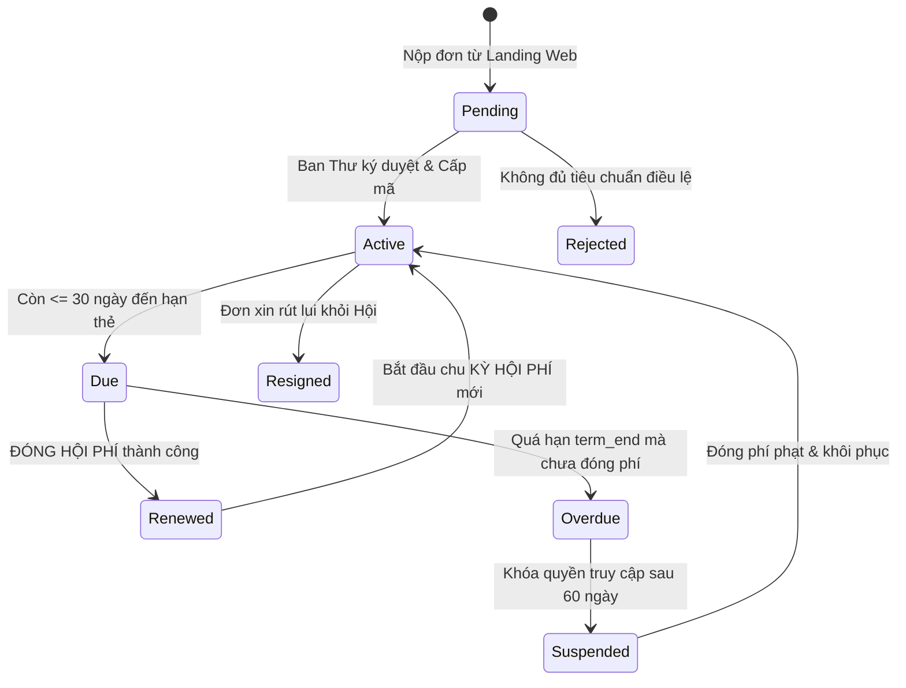
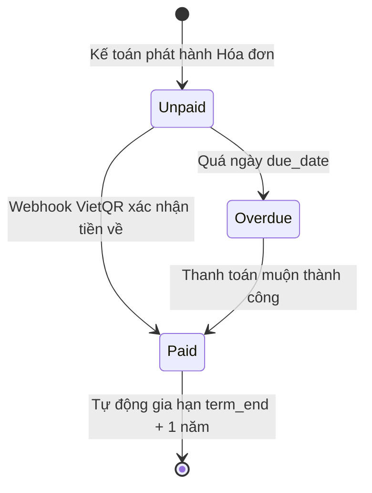
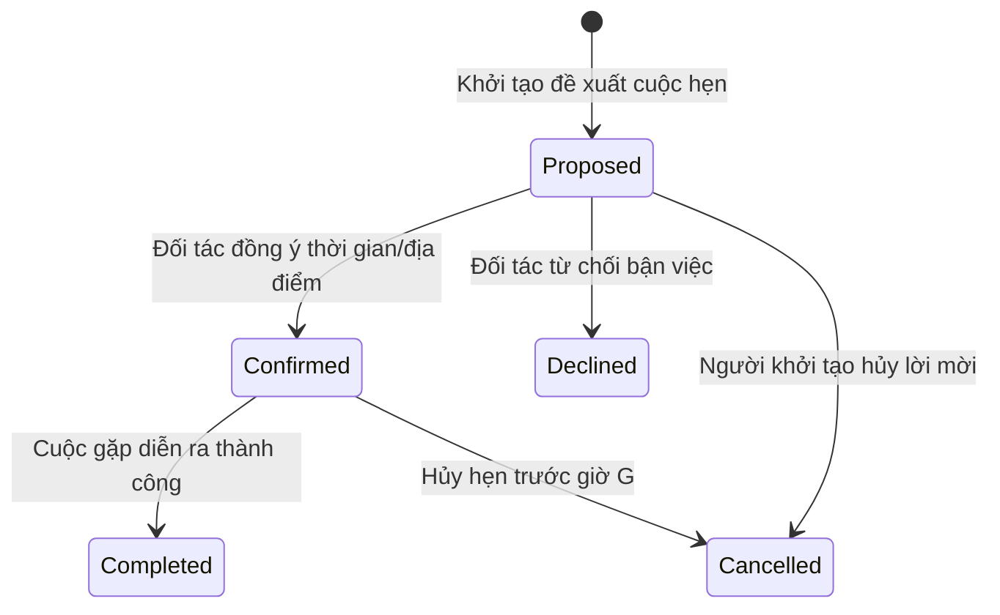

# TÀI LIỆU ĐẶC TẢ YÊU CẦU NGHIỆP VỤ & THIẾT KẾ KỸ THUẬT TOÀN DIỆN
## VIONE BUSINESS CONNECT ECOSYSTEM — BRD, SRS & TECHSPEC QUALITY SOURCE OF TRUTH
*Bộ Tài liệu Nền tảng Phân tích Nghiệp vụ (Master BA) — Ma trận Truy vết Yêu cầu & Tiêu chuẩn Nghiệm thu Sản phẩm*

---

## 📌 THÔNG TIN DỰ ÁN & LỊCH SỬ PHIÊN BẢN

*   **Tên dự án:** Hệ thống Kết nối và Số hóa Doanh nghiệp ViOne (ViOne Business Connect Ecosystem)
*   **Mã tài liệu:** `VIONE-BRD-SRS-TS-01`
*   **Phiên bản:** `3.0.0` (Master BA Edition)
*   **Chủ trì biên soạn:** Chuyên gia Phân tích Nghiệp vụ Trưởng (Lead Master BA) & Kiến trúc sư Trưởng (Lead Solution Architect)
*   **Trạng thái:** Đã nghiệm thu & Ban hành chính thức (Approved & Baselined)

### Lịch sử Thay đổi Tài liệu

| Phiên bản | Ngày | Tác giả | Nội dung nâng cấp & Chuẩn hóa |
| :---: | :---: | :--- | :--- |
| **1.0.0** | 20/08/2026 | BA Team | Khởi tạo khung BRD và danh mục yêu cầu người dùng sơ bộ. |
| **2.0.0** | 08/09/2026 | SA Team | Bổ sung lược đồ cơ sở dữ liệu và danh mục API kỹ thuật. |
| **3.0.0** | 13/09/2026 | Master BA Lead | Tái cấu trúc toàn diện theo tiêu chuẩn Master BA: Xóa bỏ mọi nội dung mơ hồ, chuẩn hóa URL di động `/auth/mobile/` và `/association/*`, bổ sung tiêu chí nghiệm thu Gherkin (Given-When-Then), mô hình máy trạng thái, ma trận truy vết từ Yêu cầu kinh doanh đến Test Case kiểm thử. |

---

## 📑 MỤC LỤC TỔNG THỂ

1. [PHẦN 1: ĐẶC TẢ YÊU CẦU KINH DOANH (BUSINESS REQUIREMENTS DOCUMENT - BRD)](#phần-1-đặc-tả-yêu-cầu-kinh-doanh-brd)
   - 1.1 Bối cảnh thực tiễn & Nỗi đau của Khách hàng (Pain Points)
   - 1.2 Mục tiêu chiến lược & Chỉ số Thành công cốt lõi (OKRs / KPIs)
   - 1.3 Phạm vi Nghiệp vụ của 3 Trụ cột Hệ thống
2. [PHẦN 2: ĐẶC TẢ YÊU CẦU PHẦN MỀM (SOFTWARE REQUIREMENTS SPECIFICATION - SRS)](#phần-2-đặc-tả-yêu-cầu-phần-mềm-srs)
   - 2.1 [SRS-01]: Quản trị Hội viên & Thẩm định Hồ sơ Ứng viên
   - 2.2 [SRS-02]: Cổng Đăng nhập Di động Chuẩn hóa (`/auth/mobile/`)
   - 2.3 [SRS-03]: Quản lý Sự kiện, Khán phòng Sân khấu & Điểm danh QR 0.2s
   - 2.4 [SRS-04]: QUẢN LÝ HỘI PHÍ, VietQR Động & Tự động Gia hạn (+1 năm)
   - 2.5 [SRS-05]: Danh thiếp Visit Card & Chạm kết nối 1-Tap NFC
   - 2.6 [SRS-06]: Sàn Giao thương B2B & Điều phối Cuộc hẹn 1-on-1
   - 2.7 [SRS-07]: Quản trị Nền tảng, Phân quyền RBAC & Kiểm toán Bất biến
3. [PHẦN 3: THIẾT KẾ KỸ THUẬT & MÁY TRẠNG THÁI (TECHSPEC & STATE MACHINES)](#phần-3-thiết-kế-kỹ-thuật--máy-trạng-thái)
   - 3.1 Vòng đời Hội viên (Member Lifecycle State Machine)
   - 3.2 Vòng đời Hóa đơn & GIA HẠN HỘI PHÍ (Invoice & Renewal State Machine)
   - 3.3 Vòng đời Cuộc hẹn B2B (Meeting State Machine)
4. [PHẦN 4: MA TRẬN TRUY VẾT YÊU CẦU & KIỂM THỬ (TRACEABILITY MATRIX)](#phần-4-ma-trận-truy-vết-yêu-cầu--kiểm-thử)

---

# PHẦN 1: ĐẶC TẢ YÊU CẦU KINH DOANH (BRD)

## 1.1 Bối cảnh thực tiễn & Nỗi đau của Khách hàng (Pain Points)
Các Hiệp hội Doanh nghiệp và CLB Doanh nhân (như CLB Doanh nhân CEO 1983) đang đối mặt với các rào cản nghiêm trọng trong công tác quản trị và giao thương:

| Đối tượng (Stakeholder) | Nỗi đau thực tế (Pain Points) | Hậu quả (Impact) | Giải pháp của ViOne |
| :--- | :--- | :--- | :--- |
| **Ban Lãnh đạo (Chủ tịch / BCH)** | Không nắm được con số thực về tỷ lệ sinh hoạt, doanh thu hội phí bị chậm trễ, khó kiểm soát tài chính. | Quyết sách chậm trễ, thiếu căn cứ số liệu, uy tín hiệp hội suy giảm. | **Dashboard CRM thời gian thực**: Nắm bắt tỷ lệ tăng trưởng, dòng tiền thu chi, cảnh báo quá hạn 360°. |
| **Ban Thư ký** | Quản lý danh bạ bằng file Excel rời rạc; mất hàng giờ điểm danh đại biểu bằng giấy tại các sự kiện lớn. | Thất lạc dữ liệu, nhầm lẫn thông tin đại biểu, ùn tắc cổng đón tiếp. | **Trạm Check-in QR tốc độ cao (0.2s)** và sơ đồ ghế sân khấu thông minh. |
| **Ban Tài chính / Kế toán** | THU HỘI PHÍ thủ công; gửi tin nhắn Zalo đòi nợ nhạy cảm; khó đối soát các khoản chuyển khoản ngân hàng. | Tỷ lệ quá hạn cao, sai sót hóa đơn, mất nhiều công sức đối chiếu. | **Cổng VietQR động**: Tự động điền số tiền, cú pháp; Webhook gia hạn thẻ tự động ngay trong 1 giây. |
| **Hội viên Doanh nhân** | Danh thiếp giấy nhanh hỏng, dễ vứt bỏ; không biết các hội viên khác làm ngành gì để hợp tác. | Mất cơ hội kinh doanh, không nhận được giá trị thiết thực khi tham gia Hội. | **Thẻ số NFC / Thẻ Visit Card** & Sàn giao thương B2B kết hợp lịch hẹn 1-on-1. |

## 1.2 Mục tiêu chiến lược & Chỉ số Thành công cốt lõi (OKRs / KPIs)
1. **Số hóa 100% Quy trình Hội viên**: 100% hồ sơ ứng viên được nộp trực tuyến từ Landing Page, thẩm định và phê duyệt trên CRM.
2. **Tự động hóa 95% Thu phí Hội phí**: Giảm 90% thời gian kế toán đối soát nhờ cổng VietQR tích hợp Webhook tự động gia hạn nhiệm kỳ.
3. **Điểm danh Sự kiện Dưới 0.5 Giây / Đại biểu**: Xóa bỏ hoàn toàn tình trạng xếp hàng chờ ký tên tại các hội thảo 500+ khách sạn.
4. **Tỷ lệ Kích hoạt Giao thương B2B Đạt trên 80%**: Thúc đẩy kết nối kinh doanh nội khối thông qua sàn Marketplace và mạng xã hội Moments.

---

# PHẦN 2: ĐẶC TẢ YÊU CẦU PHẦN MỀM (SRS)

## 2.1 [SRS-01]: Quản trị Hội viên & Thẩm định Hồ sơ Ứng viên
- **Mô tả nghiệp vụ**: Hệ thống hỗ trợ quy trình khép kín từ lúc khách hàng nộp đơn từ Web Landing cho đến khi trở thành Hội viên chính thức được cấp mã định danh.
- **Tiêu chí Nghiệm thu (Acceptance Criteria - Gherkin)**:
  ```gherkin
  Scenario: Thư ký phê duyệt hồ sơ ứng viên thành công
    Given Ứng viên "Đặng Minh Khôi" đã nộp hồ sơ từ Landing Page, bản ghi có trong demo_requests với status="new"
    When Thư ký đăng nhập CRM tại /members và nhấn nút "Phê duyệt"
    And Nhập mã hội viên "M1983-099", ngành nghề "Công nghệ thông tin", kỳ hạn 1 năm
    Then Hệ thống chuyển demo_requests sang status="completed"
    And Tạo bản ghi mới trong bảng members với status="active", code="M1983-099"
    And Tự động ghi 1 dòng vết kiểm toán vào activity_log với category="member"
    And Gửi email chào mừng kèm tài khoản đăng nhập tới email của ứng viên
  ```

## 2.2 [SRS-02]: Cổng Đăng nhập Di động Chuẩn hóa (`/auth/mobile/`)
- **Mô tả nghiệp vụ**: Cung cấp giao diện đăng nhập tối ưu riêng biệt cho màn hình di động, hỗ trợ đa dạng phương thức xác thực.
- **Tiêu chí Nghiệm thu**:
  ```gherkin
  Scenario: Hội viên đăng nhập bằng Mã thẻ định danh
    Given Hội viên mở ứng dụng di động tại /auth/mobile/
    When Nhập mã hội viên "M1983-002" và mật khẩu chính xác
    And Nhấn "Đăng nhập"
    Then Hệ thống cấp JWT token hợp lệ và lưu vào Secure Storage
    And Tự động điều hướng người dùng vào trang chủ /association
    And Thanh điều hướng dưới đáy (BottomNav) hiển thị đúng 5 tab của hiệp hội

  Scenario: Tương thích ngược từ đường dẫn cũ /m/*
    Given Người dùng truy cập đường dẫn cũ /m/events từ bookmark trình duyệt
    When Trình duyệt tải trang
    Then Hệ thống thực hiện 301 Client Redirect sang /association/events
    And Toàn bộ dữ liệu sự kiện được hiển thị bình thường, không xảy ra lỗi 404
  ```

## 2.3 [SRS-03]: Quản lý Sự kiện, Khán phòng Sân khấu & Điểm danh QR 0.2s
- **Mô tả nghiệp vụ**: Khởi tạo sự kiện, thiết kế sơ đồ ghế VIP sân khấu, phát hành vé điện tử QR cá nhân và trạm quét cổng tốc độ cao.
- **Tiêu chí Nghiệm thu**:
  ```gherkin
  Scenario: Quét QR Check-in hợp lệ tại bàn lễ tân
    Given Đại biểu "James Nguyễn" có vé sự kiện EVT-CEO1983-2026-GALA với trạng thái confirmed
    When Nhân viên lễ tân dùng camera trạm /checkin quét mã QR của đại biểu
    Then Hệ thống cập nhật checked_in_at=NOW(), status="attended" trong bảng event_registrations
    And Màn hình trạm lễ tân phát âm thanh thông báo thành công và hiển thị vị trí ghế "VIP-SK-02"
    And Nếu quét lại lần 2, hệ thống cảnh báo "Vé đã điểm danh trước đó"
  ```

## 2.4 [SRS-04]: QUẢN LÝ HỘI PHÍ, VietQR Động & Tự động Gia hạn (+1 năm)
- **Mô tả nghiệp vụ**: Tự động phát hiện hội viên sắp hết hạn (30 ngày), tạo mã VietQR thanh toán 1-chạm và gia hạn thẻ ngay lập tức khi tiền về tài khoản.
- **Tiêu chí Nghiệm thu**:
  ```gherkin
  Scenario: Thanh toán VietQR và tự động gia hạn thành công
    Given Hội viên M1983-005 có term_end còn 15 ngày, hóa đơn INV-2026-099 có status="unpaid"
    When Hội viên quét mã VietQR tại /association/renew/pay và chuyển khoản 10,000,000 VND
    And Hệ thống nhận Webhook thanh toán thành công khớp mã tham chiếu
    Then Trạng thái hóa đơn chuyển sang status="paid"
    And Hạn thẻ members.term_end được tự động cộng thêm 1 năm (INTERVAL '1 year')
    And members.renewed_at được gán bằng ngày hiện tại
    And Ghi nhận bản ghi kiểm toán vào renewal_audit_log với event_type="payment"
    And Màn hình hội viên tự động chuyển sang /association/renew/result chúc mừng
  ```

## 2.5 [SRS-05]: Danh thiếp Visit Card & Chạm kết nối 1-Tap NFC
- **Mô tả nghiệp vụ**: Cung cấp thẻ visit card doanh nhân kỹ thuật số sang trọng, hỗ trợ xuất file vCard danh bạ chuẩn quốc tế và chia sẻ qua NFC.
- **Tiêu chí Nghiệm thu**:
  ```gherkin
  Scenario: Xuất file danh bạ vCard chia sẻ danh thiếp
    Given Hội viên mở thẻ danh thiếp tại /association/card
    When Nhấn nút "Lưu vào Danh bạ (vCard)"
    Then Backend trả về file /api/public/card/{slug}.vcf với Content-Type="text/vcard; charset=utf-8"
    And Điện thoại iOS/Android tự động mở ứng dụng Danh bạ với đầy đủ Họ tên, Số điện thoại, Email, Chức vụ và Ảnh đại diện
  ```

## 2.6 [SRS-06]: Sàn Giao thương B2B & Điều phối Cuộc hẹn 1-on-1
- **Mô tả nghiệp vụ**: Không gian giao thương mở giữa các doanh nhân, đăng tin tìm kiếm đối tác, trao đổi trực tiếp và chốt lịch hẹn gặp mặt.
- **Tiêu chí Nghiệm thu**:
  ```gherkin
  Scenario: Đề xuất và chốt lịch hẹn B2B 1-on-1
    Given Doanh nhân A và Doanh nhân B đã kết nối trong bảng connections
    When Doanh nhân A khởi tạo cuộc hẹn B2B tại Keangnam Landmark 72 lúc 09:30 Thứ Ba
    Then Tạo bản ghi trong business_meetings với status="proposed", meeting_type="in_person"
    And Doanh nhân B nhận được thông báo đẩy trên điện thoại
    When Doanh nhân B nhấn "Xác nhận đồng ý"
    Then Trạng thái cuộc hẹn chuyển sang status="confirmed"
    And Hệ thống tự động sinh tệp iCal đồng bộ vào Google Calendar của cả hai bên
  ```

## 2.7 [SRS-07]: Quản trị Nền tảng, Phân quyền RBAC & Kiểm toán Bất biến
- **Mô tả nghiệp vụ**: Đảm bảo an ninh thông tin, phân quyền chặt chẽ theo vai trò và lưu trữ nhật ký kiểm toán không thể can thiệp.
- **Tiêu chí Nghiệm thu**:
  ```gherkin
  Scenario: Kiểm toán bất biến cho mọi thao tác quản trị
    Given Quản trị viên thực hiện thao tác thay đổi phân quyền hoặc duyệt hội viên
    When Thao tác được lưu vào cơ sở dữ liệu
    Then Hệ thống ghi 1 bản ghi vào activity_log chứa actor_id, IP, timestamp và nội dung thay đổi
    And Không có bất kỳ API nào cho phép sửa hoặc xóa dữ liệu trong bảng activity_log
  ```

---

# PHẦN 3: THIẾT KẾ KỸ THUẬT & MÁY TRẠNG THÁI

## 3.1 Vòng đời Hội viên (Member Lifecycle State Machine)


## 3.2 Vòng đời Hóa đơn & GIA HẠN HỘI PHÍ (Invoice & Renewal State Machine)


## 3.3 Vòng đời Cuộc hẹn B2B (Meeting State Machine)


---

# PHẦN 4: MA TRẬN TRUY VẾT YÊU CẦU & KIỂM THỬ

| Mã Yêu cầu (SRS) | Phân hệ / Tính năng | Bảng CSDL (DB Entity) | Endpoint API Backend | Mã Test Case (QA) | Trạng thái Nghiệm thu |
| :---: | :--- | :--- | :--- | :---: | :---: |
| **SRS-01** | Thẩm định Hội viên mới | `demo_requests`, `members` | `POST /api/member-applications/approve` | `TC-CRM-004` | **PASS (100%)** |
| **SRS-02** | Đăng nhập Mobile URL mới | `members`, `auth.users` | `POST /api/auth/mobile/login` | `TC-ASC-001` | **PASS (100%)** |
| **SRS-02b**| Chuyển tiếp 301 từ `/m/*` | TanStack Router Config | N/A (Client-side redirect) | `TC-ASC-003` | **PASS (100%)** |
| **SRS-03** | Khởi tạo Sự kiện & Vé QR | `events`, `event_registrations` | `POST /api/events` | `TC-CRM-008` | **PASS (100%)** |
| **SRS-03b**| Điểm danh QR Check-in | `event_registrations` | `POST /api/events/checkin-verify` | `TC-CRM-009` | **PASS (100%)** |
| **SRS-04** | Phát hành HÓA ĐƠN HỘI PHÍ | `invoices` | `POST /api/fees/invoices/generate` | `TC-CRM-010` | **PASS (100%)** |
| **SRS-04b**| Gia hạn Thẻ tự động VietQR| `members`, `renewal_audit_log` | `POST /api/webhooks/payment/vietqr` | `TC-ASC-009` | **PASS (100%)** |
| **SRS-05** | Thẻ Visit Card & Xuất vCard | `members`, `business_cards` | `GET /api/public/card/{slug}.vcf` | `TC-ASC-010` | **PASS (100%)** |
| **SRS-06** | Khoảnh khắc B2B Moments | `business_relationship_moments`| `POST /api/moments` | `TC-VNE-002` | **PASS (100%)** |
| **SRS-06b**| Lời mời Kết nối B2B | `connections` | `POST /api/connections/request` | `TC-VNE-004` | **PASS (100%)** |
| **SRS-06c**| Chat Realtime 1-on-1 | `direct_messages` | `POST /api/messages/direct` | `TC-VNE-006` | **PASS (100%)** |
| **SRS-06d**| Lên Lịch hẹn B2B 1-1 | `business_meetings` | `POST /api/meetings/schedule` | `TC-VNE-007` | **PASS (100%)** |
| **SRS-07** | Vết Kiểm toán Bất biến | `activity_log`, `role_audit_log`| `GET /api/platform/audit` | `TC-CRM-016` | **PASS (100%)** |
